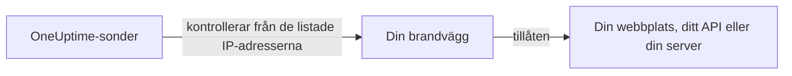

# IP-adresser

OneUptime Clouds sonder kontrollerar dina webbplatser, API:er och servrar från en fast uppsättning IP-adresser. Står en brandvägg eller en tillåtelselista framför det du övervakar måste du tillåta dessa adresser så att kontrollerna kommer igenom.



## IP-adresser att tillåta

Tillåt trafik från dessa adresser i din brandvägg:

{{IP_WHITELIST}}

> [!NOTE]
> Adresserna kan ändras. OneUptime meddelar dig i förväg när det sker. För att hålla dig uppdaterad utan att bevaka meddelanden kan du [hämta listan](#hämta-listan-programmatiskt) varje gång du uppdaterar brandväggen.

## Hämta listan programmatiskt

Samma lista levereras som JSON, utan att någon API-nyckel behövs, så att ett skript kan hålla dina brandväggsregler uppdaterade:

```bash
curl -s https://oneuptime.com/ip-whitelist
```

```json
{
  "ipWhitelist": ["<list of IPs>"]
}
```

`ipWhitelist` är en array med en adress per post. Så här skriver du ut en adress per rad, till exempel till ett brandväggsskript:

```bash
curl -s https://oneuptime.com/ip-whitelist | jq -r '.ipWhitelist[]'
```

## Självhostad OneUptime

På din egen instans visar den här sidan och slutpunkten `/ip-whitelist` adresserna från instansens inställning `IP_WHITELIST`, en kommaseparerad lista. Ange adresserna som dina egna sonder skickar sina kontroller från.

:::tabs
@tab Kubernetes
Ange värdet `ipWhitelist` i Helm-diagrammet:

```yaml title="values.yaml"
ipWhitelist: "203.0.113.1,203.0.113.2"
```
@tab Docker Compose
`config.env` skickar inte inställningen vidare till appen. Lägg till den i miljön för tjänsten `app` i en `docker-compose.override.yml` bredvid `docker-compose.yml`, och starta sedan om OneUptime:

```yaml title="docker-compose.override.yml"
services:
  app:
    environment:
      IP_WHITELIST: "203.0.113.1,203.0.113.2"
```
:::

När inget är angivet visar den här sidan **No IP addresses configured.** och slutpunkten returnerar en tom `ipWhitelist`-array.

## Nästa steg

:::cards
- [Anpassade probes](/docs/probe/custom-probe): Kör en sond i ditt eget nätverk i stället för att öppna brandväggen.
- [Skapa en monitor](/docs/monitor/create-monitor): Börja kontrollera en webbplats, ett API eller en server.
:::
