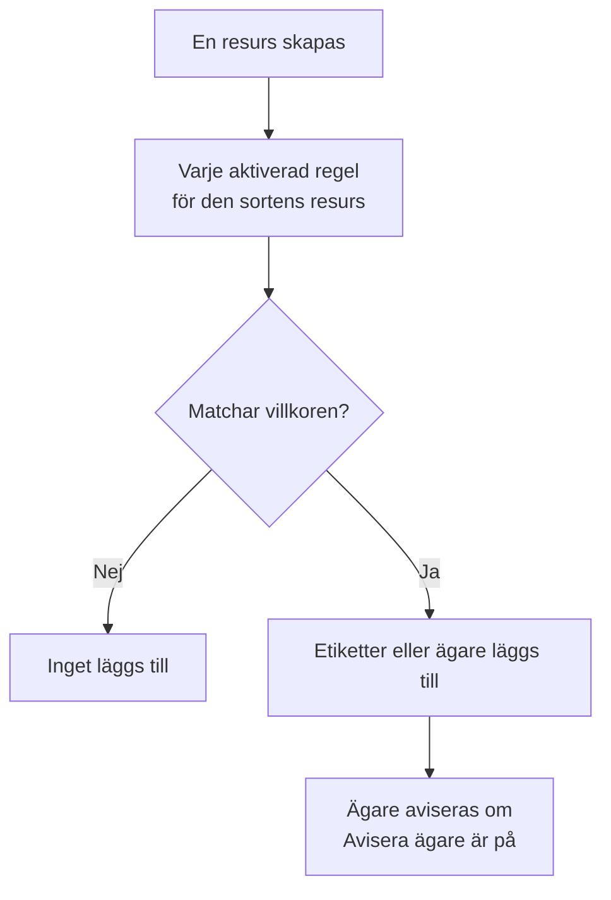

# Etikett- och ägarregler

Etikettregler och ägarregler håller ordning på dina resurser åt dig. En **etikettregel** sätter etiketter på varje ny resurs som den matchar, och en **ägarregel** lägger till användare och team som ägare: så får en ny databasincident etiketten _Databas_ och ägs av databasteamet, utan att någon behöver komma ihåg det.

:::cards
- [Skapa en regel](#skapa-en-regel): Två steg: vad regeln matchar, och sedan vad den lägger till.
- [Ärv etiketter och ägare](#ärv-etiketter-och-ägare): För vidare det som en händelses monitorer, värdar och tjänster bär.
- [När regler körs](#när-regler-körs): Nya resurser, och **Run Now** för dem du redan har.
:::

## Så fungerar det

Regler körs när en resurs skapas. Varje aktiverad regel kontrollerar sina villkor mot den nya resursen, och varje regel som matchar lägger till det den lägger till.

Etiketter och ägare är det du filtrerar och grupperar resurser efter, de avgör vem OneUptime aviserar om dem och vad [behörigheter begränsade till etiketter eller egna resurser](/docs/permissions/index) når. Regler håller dem enhetliga utan att någon behöver komma ihåg det.

## Var du hittar reglerna

Varje produkt med etiketter och ägare har båda sorterna under sina **Inställningar** (för incidenter, larm och planerat underhåll under **Regler**): monitorer, incidenter och incidentepisoder, larm och larmepisoder, planerade underhållshändelser, statussidor, tjänster, värdar, Kubernetes-kluster, Docker-värdar, Docker Swarm-kluster, Podman-värdar, Proxmox-kluster, VMware vCenter, Ceph-kluster, lagringsmatriser, databaser, köer, IoT-flottor, serverlösa funktioner, molnresurser, RUM-applikationer, instrumentpaneler, jourpolicyer, jourscheman, policyer för inkommande samtal, arbetsflöden, runbooks, nätverksenheter och SLO:er.

Etikettregler för monitorer finns till exempel under **Monitorer → Inställningar → Etikettregler**, och etikettregler för incidenter under **Incidenter → Regler → Etikettregler**. **Inställningar** och **Regler** är hopfällda i sidomenyn från början: klicka på avsnittets rubrik för att öppna det. Sidorna för incidenter och larm har en flik **Incident Rules** (eller **Alert Rules**) och en flik **Episode Rules**.

## Skapa en regel

Alla etikett- och ägarregler skapas på samma sätt, i två steg.

:::steps
### Öppna listan med regler

Öppna produktens sida **Etikettregler** eller **Ägarregler** och klicka på knappen för att skapa, som är uppkallad efter regeln, till exempel **Skapa Monitor Label Rule**.

### Välj vad regeln matchar

I steget **Matcha** klickar du på **Lägg till villkor** för varje villkor som resursen måste uppfylla. Med två eller fler väljer du **Matcha alla** eller **Matcha något**. En regel utan villkor matchar alla nya resurser.

### Välj vad regeln lägger till

I steget **Etiketter** väljer du **Etiketter att lägga till**. I en ägarregel heter steget **Ägare**: **Lägg till ägare** öppnar en enda lista med personer och team.

**Namn** fylls i utifrån det du väljer (_Lägg till Production_, _Lägg till Platform som ägare_) och följer dina val tills du skriver ett eget namn. En regel som bara ärver får i stället namn efter det den ärver från (se nedan).

### Kontrollera de hopfällda fälten

**Fler fält** innehåller den valfria **Beskrivning** och, i en ägarregel, **Avisera ägare**, som är på som standard: de ägare som en regel lägger till får samma avisering ”du har lagts till som ägare” som en ägare som läggs till för hand. Stäng av den för att lägga till ägare utan att avisera dem.

### Spara regeln

I det sista steget klickar du på knappen som är uppkallad efter regeln igen, till exempel **Skapa Monitor Label Rule**. Regeln är aktiverad från början, och listan visar den med en grön märkning **Aktiverad**.
:::

En ny regel måste lägga till något: minst en etikett (eller ägare) eller, i en regel för incidenter, larm eller planerat underhåll, något som den ärver (se nedan). För att pausa en regel utan att ta bort den stänger du av **Aktiverad** i dess redigeringsformulär; listan visar då en röd märkning **Inaktiverad**.

### Oavsett hur regeln skapas

Detsamma gäller för en regel som skapas via API:t, Terraform, ett arbetsflöde eller en [import av etikettregler](/docs/configuration/label-rule-import-export): OneUptime avvisar en ny regel som inte lägger till något, med ett meddelande som nämner fälten som ska fyllas i. Meddelandena är på engelska på alla språk.

| Regel | Meddelande |
| --- | --- |
| Etikettregel | This label rule adds nothing. Choose at least one label in Labels to Add. |
| Etikettregel för incidenter, larm eller planerat underhåll | This label rule adds nothing. Choose at least one label in Labels to Add, or turn on an Inherit Labels switch. |
| Ägarregel | This owner rule adds nothing. Choose at least one user or team in Owner Users or Owner Teams. |
| Ägarregel för incidenter, larm eller planerat underhåll | This owner rule adds nothing. Choose at least one user or team in Owner Users or Owner Teams, or turn on an Inherit Owners switch. |

- **API**: sätt `labelsToAdd` (eller `ownerUsers` / `ownerTeams`) till minst en post i projektet, eller en av regelns brytare `inheritLabelsFrom…` (`inheritOwnersFrom…`) till `true`, en JSON-boolean.
- **Terraform**: en resurs för en etikett- eller ägarregel som inte lägger till något misslyckas vid `terraform apply` med meddelandet ovan. Ge den `labels_to_add` (eller `owner_users` / `owner_teams`) eller slå på en av dess arvsbrytare.

Regler som du redan har påverkas inte: se [Redigera en regel](#redigera-en-regel).

## Ärv etiketter och ägare

Regler för incidenter, larm och planerat underhåll kan också föra vidare det som resurserna som en händelse berör bär. Under **Etiketter att lägga till** (eller **Ägare**) innehåller det hopfällda avsnittet **Ärv etiketter** (eller **Ärv ägare**) sex brytare:

- **Ärv etiketter från övervakare**: varje etikett på incidentens monitorer sätts också på incidenten. Ett larm har en monitor, så i en larmregel heter brytaren **Ärv etiketter från övervakning** (och i en ägarregel för larm **Ärv ägare från övervakning**).
- **Ärv etiketter från värdar**, **Ärv etiketter från Kubernetes-kluster**, **Ärv etiketter från Docker-värdar**, **Inherit Labels From Podman Hosts** och **Ärv etiketter från tjänster** gör samma sak för de resurserna.

Ägarregler har samma sex brytare för ägare (**Ärv ägare från övervakare** och så vidare). Så länge ingen brytare är på berättar det hopfällda avsnittet vad det är till för; i en regel som ärver öppnas det av sig självt. Episodregler har inga arvsbrytare.

En regel som ärver kan lämna **Etiketter att lägga till** (eller **Ägare**) tomt: den lägger till det den ärver. En sådan regel får namn efter det den ärver från:

| Påslagna brytare | Namn |
| --- | --- |
| **Ärv etiketter från övervakare** | _Ärv etiketter från: monitorer_ |
| **Ärv etiketter från övervakare** och **Ärv etiketter från värdar** | _Ärv etiketter från: monitorer, värdar_ |
| **Ärv etiketter från övervakning**, i en larmregel | _Ärv etiketter från: övervakning_ |

Namnet följer brytarna tills du väljer en etikett (då får regeln namn efter sina etiketter) eller skriver ett eget namn.

## Redigera en regel

En regels redigeringsformulär har samma två steg och lägger till brytaren **Aktiverad**. Det kräver inte det som regeln lägger till: en regel som sparades innan OneUptime frågade (via API:t, Terraform, en import eller det gamla formuläret) kanske inte lägger till något alls, och en redigering kan ta bort allt som en regel lägger till.

En sådan regel kan fortfarande byta namn, stängas av eller tas bort, även via API:t och Terraform. Listan märker en regel som inte lägger till något med **Lägger inte till något** bredvid dess status, och det gör även regelns egen sida. Redigera den för att välja vad den lägger till, eller ta bort den.

## När regler körs

Varje aktiverad regel körs när en resurs skapas, från instrumentpanelen eller via API:t, och varje regel som matchar lägger till det den lägger till:

- Om flera regler matchar lägger alla till sina etiketter och ägare.
- En regel tar aldrig bort något: varken etiketter eller ägare som någon lagt till för hand, eller sådana som den själv har lagt till.
- En inaktiverad regel gör ingenting.

En regel som du skriver i dag gäller för de resurser som skapas efteråt. För att tillämpa den på dem du redan har använder du **Run Now**: se [Köra regler på befintliga resurser](/docs/configuration/run-rules-now). Etikettregler kan också kopieras mellan projekt: se [Importera och exportera etikettregler](/docs/configuration/label-rule-import-export).

## Nästa steg

:::cards
- [Köra regler på befintliga resurser](/docs/configuration/run-rules-now): Tillämpa en regel på de resurser du redan har.
- [Importera och exportera etikettregler](/docs/configuration/label-rule-import-export): Kopiera etikettregler mellan projekt som JSON.
- [Incidentinställningar och automatisering](/docs/incidents/settings): De andra regler som en incident kan köra.
- [Etikett- och ägarregler för SLO:er](/docs/slo/label-and-owner-rules): Vad SLO-regler matchar på.
:::
