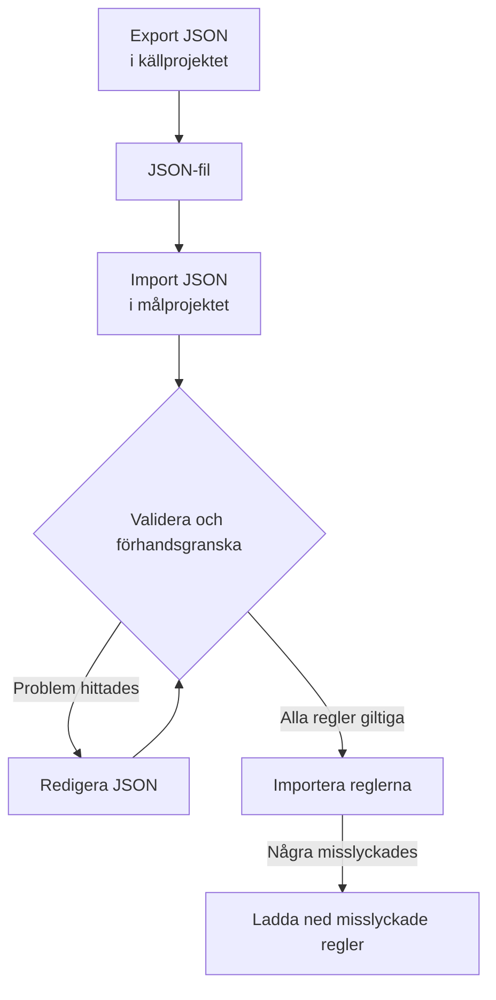

# Importera och exportera etikettregler

Kopiera etikettregler mellan projekt, eller skapa många på en gång, som en JSON-fil. Varje sida **Etikettregler** har åtgärderna **Export JSON** och **Import JSON** i menyn **Fler alternativ** (**⋯**), även för incidenter, larm, monitorer och nätverksenheter. Det enda undantaget är VMware: dess etikettregler för vCenter har ingen av dem.



## Exportera regler

Öppna **Fler alternativ** och välj **Export JSON** för att ladda ned alla regler av den typen i det aktuella projektet. Exporten tar med regler på andra sidor i tabellen och bortser från tabellfilter.

Filen behåller varje regels status (aktiverad eller inte), villkor, etiketter att lägga till och inställningar för arv av etiketter. Projekt-ID:n, regel-ID:n och granskningsfält utelämnas.

Länkade etiketter, monitorer och allvarlighetsgrader skrivs med sitt exakta namn. En import skapar dem inte: de måste redan finnas i målprojektet.

## Importera regler

:::steps
### Öppna Import JSON

Öppna målprojektets sida **Etikettregler** och välj **Fler alternativ → Import JSON**.

### Lägg till filen

Ladda upp en JSON-exportfil, eller klistra in dess innehåll.

### Validera och förhandsgranska

Välj **Validate and preview**. Varje regel kontrolleras innan någon skapas, och de resurser som det hänvisas till måste finnas i målprojektet med unika, matchande namn.

### Granska förhandsvisningen

Kontrollera reglernas namn, status, etiketter och villkor. En stor batch visas en sida i taget. För att rätta något väljer du **Edit JSON** och validerar igen.

### Importera

Välj importknappen, som räknar reglerna (till exempel **Import 2 rules**), och låt fönstret vara öppet tills resultaten visas.
:::

Importer lägger till nya regler och behåller befintliga, så om du importerar samma fil igen skapas ännu en kopia. De vanliga behörigheterna för att skapa och serverns validering gäller för varje regel.

Om några regler misslyckas väljer du **Download failed rules** för att bara spara de raderna, rättar dem och importerar den filen igen. Om en begäran får tidsgränsen överskriden ska du kontrollera listan med regler innan du försöker igen: servern kan ha sparat regeln innan svaret gick förlorat.

## Skapa en batch i JSON

Exportera en befintlig regel för att få ett exempel för din resurstyp, och redigera eller lägg sedan till poster i matrisen `items`. Det här exemplet skapar två etikettregler för monitorer. Etiketterna `Production` och `Infrastructure` måste redan finnas i målprojektet.

```json title="monitor-label-rules.json"
{
  "fileType": "oneuptime-label-rules",
  "schemaVersion": 1,
  "resourceType": "MonitorLabelRule",
  "items": [
    {
      "name": "Production API monitors",
      "description": "Label production API monitors automatically",
      "isEnabled": true,
      "monitorNamePattern": "^api-prod-",
      "monitorLabels": [],
      "labelsToAdd": ["Production"]
    },
    {
      "name": "Database monitors",
      "isEnabled": false,
      "monitorNamePattern": "^database-",
      "labelsToAdd": ["Infrastructure"]
    }
  ]
}
```

| Fält | Vad det innehåller |
| --- | --- |
| `fileType` | Alltid `oneuptime-label-rules`. |
| `schemaVersion` | Alltid `1`. |
| `resourceType` | Typen av regel som filen innehåller, till exempel `MonitorLabelRule`. |
| `items` | Reglerna, ett objekt för varje. En fil måste ha minst en. |

Använd JSON-booleans för `isEnabled`, text för mönster och matriser med namn för länkade resurser.

Följande stoppar hela batchen före importsteget: ogiltiga mönster, okända fält, saknade namn och tvetydiga hänvisningar. Det gör även en regel som inte lägger till något (en tom `labelsToAdd` och, i en regel för incidenter, larm eller planerat underhåll, ingen brytare `inheritLabelsFrom…` satt till `true`), eftersom OneUptime vägrar att skapa en sådan (se [Etikett- och ägarregler](/docs/configuration/label-and-owner-rules#oavsett-hur-regeln-skapas)). En export kan innehålla en sådan regel om den sparades före den kontrollen; ge den en etikett eller ta bort den från filen innan du importerar.

> [!NOTE]
> Filer och inklistrad JSON är begränsade till 10 MB.

## Kopiera mellan resurstyper

Behåll det ursprungliga `resourceType` i filen och öppna **Import JSON** på målsidan. Kompatibla mönster för primärt namn eller titel, beskrivningsmönster och förutsatta etiketter kopplas till målets fält, och förhandsvisningen listar kopplingarna så att du kan granska dem. Hänvisningar till allvarlighetsgrader för incidenter och larm jämförs med namnen på målets allvarlighetsgrader.

Villkor eller åtgärder som målet inte stöder blockerar importen. Till exempel kan en incidentregel som är begränsad till vissa monitorer inte kopieras till regler för nätverksenheter utan att de villkoren redigeras.

> [!WARNING]
> Etikettregler för nätverksenheter och SLO:er stöder jokertecken utöver reguljära uttryck. En överföring mellan de reglerna och andra regeltyper avvisar mönster som innehåller `*` eller omgivande blanksteg, eftersom de matchar annorlunda där. Redigera mönstren för målet, eller behåll regeln inom samma resurstyp. Etikettregler för nätverksenheter och SLO:er kan byta vilket mönster som helst med varandra, eftersom de matchar på samma sätt.

## Nästa steg

:::cards
- [Etikett- och ägarregler](/docs/configuration/label-and-owner-rules): Vad en etikettregel matchar och vad den lägger till.
- [Köra regler på befintliga resurser](/docs/configuration/run-rules-now): Tillämpa importerade regler på de resurser du redan har.
:::
