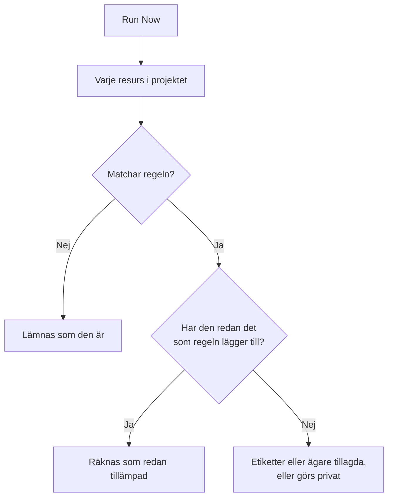

# Köra regler på befintliga resurser

Etikettregler, ägarregler och sekretessregler körs automatiskt när en resurs **skapas**. En regel som du skriver i dag gör därför ingenting med de monitorer, incidenter eller värdar som du redan har. **Run Now** täpper till den luckan: den tillämpar en regel på varje resurs som redan finns i projektet.

## Vilka regler kan köras

- **Etikettregler** och **Ägarregler**, för varje resurs som har dem: monitorer, incidenter, incidentepisoder, larm, larmepisoder, planerade underhållshändelser, statussidor, tjänster, värdar, Kubernetes-kluster, Docker-värdar, Docker Swarm-kluster, Podman-värdar, Proxmox-kluster, VMware vCenter, Ceph-kluster, lagringsmatriser, databaser, köer, IoT-flottor, serverlösa funktioner, molnresurser, RUM-applikationer, instrumentpaneler, jourpolicyer, jourscheman, policyer för inkommande samtal, arbetsflöden, runbooks, nätverksenheter och SLO:er.
- **Sekretessregler**, för incidenter, larm, incidentepisoder och larmepisoder.
- **Monitor Rules** på en statussida. De synkroniserar redan om sidan varje gång en regel sparas; att köra en synkroniserar den direkt.
- **Monitor Rules** på en SLO. De synkroniserar redan om SLO:n varje gång en regel sparas; att köra en synkroniserar SLO:ns monitorer direkt. Se [Monitorer och monitorregler](/docs/slo/monitor-rules).

Regler som utför en åtgärd i stället för att beskriva en resurs (**Jourregler**, **Runbook-regler**, **Regler för automatisk åtgärd** och **Grupperingsregler**) kan inte köras på befintliga poster. Att köra dem skulle larma personer, köra runbooks, starta åtgärder eller organisera om episoder för incidenter som redan är över.

## Innan du börjar

För att köra en regel behöver du behörighet att redigera regeln **och** att redigera de resurser som den ändrar: en etikettregel för monitorer kräver till exempel både redigeringsbehörigheten för etikettregler för monitorer och den för monitorer. Ägarregler kräver även behörighet att lägga till ägare. Monitorregler på en statussida eller en SLO kräver bara behörighet att redigera regeln.

> [!IMPORTANT]
> En behörighet som är begränsad till vissa etiketter, eller till resurser som du äger, räcker inte: en körning kan ändra alla resurser i projektet. Teamens blocklistor gäller som överallt annars, och en blockering som är begränsad till vissa etiketter räknas också: en körning skulle ändra resurserna med de etiketterna, så en blockering med etiketter på redigering av de resurser som en regel ändrar avvisar körningen.

Ett nätverks regler kräver detsamma när du kör dem på de enheter du redan har. **Run Now** för en regel för platstilldelning eller enhetsetiketter kräver behörighet att redigera regeln och **Edit Network Device**. **Dry Run** och **Run Rule** för en regel för automatisk import kräver behörighet att redigera regeln, **Create Network Device** och, när regeln har en monitormall, **Create Monitor**. Var och en måste nå hela projektet. Se [Automatisk import med regler för automatisk import](/docs/monitor/network-device-monitor#importing-automatically-with-auto-import-rules).

## Köra en regel

:::steps
### Öppna listan med regler

Öppna sidan med regler, till exempel **Monitorer → Inställningar → Etikettregler**.

### Välj Run Now

Öppna menyn **⋯** i slutet av regelns rad och välj **Run Now**, eller välj **Visa** och sedan **Run Now** på regelns egen sida. En dialogruta berättar vad körningen kommer att göra.

### Välj om nya ägare ska aviseras

För en ägarregel väljer du om du vill **Notify the owners this run adds**. Det är avstängt som standard och gäller bara när regeln själv har **Avisera ägare** påslaget. En ägare aviseras en gång för varje resurs som hen läggs till på.

### Starta regeln

Välj **Run Rule** och låt dialogrutan vara öppen. I ett stort projekt visar dialogrutan hur långt körningen har kommit.

### Läs rapporten

När körningen är klar berättar dialogrutan hur många resurser regeln matchade, hur många den ändrade och hur många som redan hade det som regeln lägger till.
:::

## Köra flera regler

Markera regler i tabellen, öppna menyn för massåtgärder och välj **Run Now**. De markerade reglerna körs efter varandra.

- Ägare som läggs till av en masskörning aviseras aldrig. Kör i stället en enskild regel för att avisera dem.
- En regel som inte kan köras (till exempel för att den är inaktiverad) listas med orsaken, och de andra reglerna körs ändå.

## Vad en körning gör

- **Den lägger bara till.** Etiketter sätts på, ägare läggs till, resurser görs privata. Inget tas bort och inget görs offentligt, så det är säkert att köra en regel igen: den andra körningen rapporterar att allt redan var tillämpat.
- **Varje resurs i projektet bedöms**, även lösta incidenter och larm.
- **Befintliga ägare hoppas över**, de läggs aldrig till två gånger.
- **Bara projektets egna etiketter läggs till.** En etikett som regeln nämner och som inte längre är en av projektets etiketter hoppas över, och regelns andra etiketter läggs ändå till. Detsamma gäller när en regel körs på en ny resurs.
- **Regeln tillämpas på samma sätt som när resursen skapas**, inklusive etiketter och ägare som ärvs från en incidents monitorer, värdar och tjänster. Där resursen har ett aktivitetsflöde registrerar flödet vilken regel som ändrade den.
- **Inaktiverade regler körs inte.** Aktivera regeln först.
- **Monitorregler för statussidor** lägger till de monitorer som de matchar och tar bort de monitorer som de tidigare lagt till men inte längre matchar. Monitorer som lagts till på sidan för hand rörs aldrig.
- **En enskild körning omfattar upp till 100 000 resurser.** I ett större projekt stoppar körningen och säger det; kör regeln igen för att fortsätta.

## Nästa steg

:::cards
- [Etikett- och ägarregler](/docs/configuration/label-and-owner-rules): Skriv de regler som en körning tillämpar.
- [Importera och exportera etikettregler](/docs/configuration/label-rule-import-export): Hämta först in etikettregler från ett annat projekt.
- [Incidentinställningar och automatisering](/docs/incidents/settings): Regler för incidenter, inklusive sekretessregler.
:::
