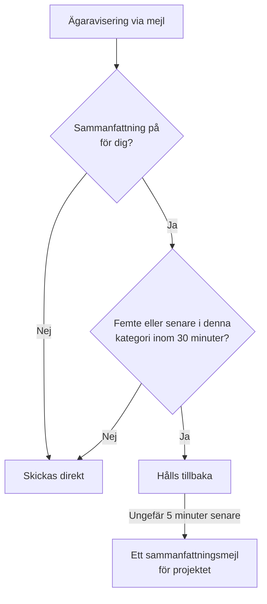

# Aviseringssammanfattning

När något går riktigt fel går det sällan fel bara en gång. En instabil uppströmslänk slår ut fyrtio monitorer, fyrtio incidenter deklareras, kvitteras och löses, och varje ägare får ett mejl för varje steg: tvåhundra meddelanden i en enda inkorg, och ingen läser dem längre.

OneUptime samlar automatiskt sådana skurar i ett enda mejl. Det är påslaget för alla och det finns inget att konfigurera — men vill du hellre få varje avisering som ett eget mejl kan du [stänga av sammanfattningen för dig själv](#stäng-av-sammanfattningen-för-dig-själv), ett projekt i taget.

:::cards
- [Så fungerar det](#så-fungerar-det): Fyra mejl skickas direkt, resten kommer samlat.
- [Det som aldrig sammanfattas](#det-som-aldrig-sammanfattas): Jourlarm, säkerhets-, fakturerings- och prenumerantmejl.
- [Stäng av sammanfattningen](#stäng-av-sammanfattningen-för-dig-själv): Få varje avisering som ett eget mejl igen.
- [Färre rutinmejl](#dra-ner-ännu-mer): Stäng av de informativa mejlen i ett svep.
:::

## Så fungerar det

Varje ägaravisering via mejl som du får räknas mot en liten budget som hålls per projekt, per mottagare, per e-postadress och per **kategori** av resurs — incidenter, larm, monitorer, planerat underhåll, statussidor, sonder, SLO:er och så vidare.



- De **fyra första** mejlen i en kategori inom ett godtyckligt trettiominutersfönster skickas direkt, precis som alltid. Samma ämne, samma mall, samma länkar.
- Det **femte och varje senare** mejl i det fönstret hålls tillbaka.
- Ungefär fem minuter senare kommer allt som hållits tillbaka för dig i projektet — över alla kategorier — som **ett** mejl som listar vad som hände, med en länk till varje resurs.

Sammanfattningen tar med de aviseringar du fortfarande prenumererar på när den skickas. Stänger du av mejlet för en händelsetyp medan dess aviseringar står i kö, utelämnas de aviseringarna från sammanfattningen. Att slå på mejlet igen senare skickar inte de överhoppade uppdateringarna i efterhand.

Under tröskeln gör funktionen ingenting alls. Ett projekt som skapar tre ägarmejl om dagen skickar fortfarande de tre mejlen var för sig.

## Så ser sammanfattningsmejlet ut

Ämnesraden berättar omfattningen _och sorten_ av stormen innan du öppnar mejlet:

```text
[Acme Production] 112 notifications: 63 Monitors, 41 Incidents, 6 Alerts +2 more
```

Inuti ger ett sammanfattningskort totalen, tidsfönstret som sammanfattningen täcker och fördelningen per kategori. Därunder är aviseringarna grupperade i en sektion per kategori, den mest brådskande först — incidenter, sedan larm, sedan monitorerna och sonderna som märkte dem — så att det första under sammanfattningen också är det första som är värt ett klick.

Varje sektion har en rad per resurs i stället för en rad per händelse:

- **Raderna visar var en resurs hamnade.** Om en incident skapades, sedan kvitterades och sedan löstes är det en enda rad i det senaste tillståndet, vilket gör sammanfattningen _mer_ aktuell än tre separata mejl hade varit.
- **Siffrorna går ihop.** Varje rad har tiden för sin senaste uppdatering, och en rad som har tagit upp flera anger hur många, så att sektionerna och sammanfattningskortet alltid ger samma total.
- **Allvarlighetsgrad och tillstånd visas.** Kort för larm och incidenter visar allvarlighetsgrad och tillstånd från den senaste aviseringen, även egna namn. Äldre aviseringar i kö utan de uppgifterna visas ändå, utan de etiketter som saknas.

Tider visas i UTC, med datum dessutom när en sammanfattning spänner över mer än en dag.


## Det som aldrig sammanfattas

Sammanfattningen berör bara aviseringar till ägare och medlemmar — familjen ”något du ansvarar för har ändrats”. Den kan inte nå något annat, eftersom den ligger i den enda kodväg som de aviseringarna tar, och inga andra.

Aldrig fördröjt och aldrig medräknat:

| Kategori | Exempel |
| ----------------------------------------- | ---------------------------------------------------------------------------------------------------- |
| Jourlarm | Varje larm från en eskaleringspolicy och varje begäran om kvittering |
| Jourtider | ”Du har jour nu”, ”du har jour härnäst”, ”ditt pass börjar snart”, ”ditt pass har tilldelats om” |
| Kontosäkerhet | Återställning av lösenord, verifiering av e-post, lösenord ändrat, reservkod för tvåfaktor använd eller återskapad |
| Administrativa meddelanden om ditt konto | En administratör har ändrat dina aviseringsmetoder eller dina jourregler |
| Fakturering och saldo | Fakturor, förfallen prenumeration, ”vi kunde inte larma någon eftersom kortet nekades” |
| Instansens hälsa | Varningar om Postgres, Valkey och ClickHouse till instansens administratörer |
| Prenumeranter på statussidor | Varje mejl som din statussida skickar till dina egna prenumeranter |
| SLA-brott | Skickas direkt, trots att de återanvänder aviseringstypen för skapade incidenter |

Bara mejl påverkas. SMS, telefonsamtal, push-aviseringar, WhatsApp, Telegram, Slack, Microsoft Teams och webhooks levereras direkt, precis som förut — även för aviseringar vars mejl hölls tillbaka.

## Gränser

| Gräns | Värde |
| --- | --- |
| Aviseringar i ett sammanfattningsmejl | Högst **500**. Resten ligger kvar i kön och går ut med nästa sammanfattning, högst fem minuter senare. |
| Visade rader i ett sammanfattningsmejl | Högst **100**. Raderna slås ihop per resurs, så det är 100 olika resurser; utöver det anger mejlet de fullständiga totalerna och länkar till projektet. |
| Sammanfattningsmejl till en mottagare från ett projekt | Högst **12** i timmen. |
| Extra fördröjning för en tillbakahållen avisering | Ungefär sex minuter i värsta fall. |

Taket per timme upprätthålls av databasen, inte av en timer, så det håller även under en storm som pågår i timmar.

## Stäng av sammanfattningen för dig själv

Vissa vill ha samlingen. Andra arkiverar varje avisering när den kommer, eller låter något annat göra det med inkorgen, och ett sammanfattningsmejl förstör det. Därför kan sammanfattningen stängas av, per person och per projekt.

:::steps
### Öppna E-postinställningar

Gå i projektet till **Användarinställningar → E-postinställningar** — samma sida som varje sammanfattningsmejl länkar till längst ner.

### Stäng av Email Rollup

Stäng av reglaget i kortet **Email Rollup**. Det sparas av sig självt, och kortet visar sedan "Off: every notification arrives as its own email, immediately."
:::

När den är avstängd skickas varje ägar- och medlemsavisering via mejl i det projektet till dig var för sig och direkt igen: samma ämne, samma mall, samma länkar, ingen tröskel och ingen väntan på fem minuter. Det som redan står i kö för dig när du stänger av den kommer ändå som en sista sammanfattning några minuter senare; allt därefter kommer ett i taget.

Reglaget är **bara ditt och gäller ett projekt**. Att stänga av det ändrar inte vad dina kolleger får, och det gäller inte över projektgränser — så det bullriga produktionsprojektet kan fortsätta samla medan det lugna interna projektet skickar allt var för sig, eller tvärtom. Det är påslaget för alla tills de stänger av det.

Vad det **inte** påverkar:

- **Vilka aviseringar du får.** Det är inställningen per händelsetyp och per kanal under **Användarinställningar → Aviseringsinställningar**, en sida bort. Sammanfattningen och det här reglaget ändrar bara hur många mejl aviseringarna packas i.
- **Jourlarm och pass-mejl**, **mejl om kontosäkerhet**, **faktureringsmejl**, varningar om instansens hälsa och mejl till statussidesprenumeranter. Inget av det sammanfattas någonsin, så det ändrar ingenting för dem att stänga av sammanfattningen — se [Det som aldrig sammanfattas](#det-som-aldrig-sammanfattas).
- **Alla andra kanaler.** SMS, telefonsamtal, push, WhatsApp, Telegram, Slack, Microsoft Teams och webhooks är redan omedelbara.

## Dra ner ännu mer

Sammanfattningen packar ihop rutinuppdateringar; du kan också sluta få de flesta av dem.

:::steps
### Öppna inställningarna från ett sammanfattningsmejl

Öppna länken till inställningarna längst ner i ett sammanfattningsmejl, eller gå till **Användarinställningar → E-postinställningar**.

### Välj Reduce routine emails

Välj **Reduce routine emails** i kortet **Fewer routine emails**. När ändringen är sparad visar kortet **Rutinmässiga e-postmeddelanden avstängda.**
:::

Det stänger av de här informativa mejlen för dig i det aktuella projektet:

- Anteckningar på incidenter, larm, episoder och planerat underhåll.
- Meddelanden om att du har lagts till som ägare av en resurs.
- Nya monitorer och statussidor.
- Incidenter eller larm som lagts till i befintliga episoder.
- Att läggas till i eller tas bort från en jourpolicy.

Dina befintliga val för skapande av incidenter och larm, tillståndsändringar, påminnelser, tilldelning av incidenter, monitorhälsa och jourpass behålls, och inget mejl som du hade stängt av slås på. Jourlarm, andra leveranskanaler, kontomejl, faktureringsmejl och mejl till statussidesprenumeranter påverkas inte.

Ändringarna sparas tillsammans. Gå igenom reglagen per händelse under **Användarinställningar → Aviseringsinställningar** för att slå på ett enskilt mejl igen. De här inställningarna gäller också aviseringar som väntar på en sammanfattning; ett mejl som redan har skickats kan inte återkallas. E-postsammanfattningen är fortfarande en separat inställning som styr samlingen av de händelser du behåller.

## Felsökning

:::details Ett aviseringsmejl kom några minuter för sent
Det var det femte eller ett senare mejlet i sin kategori inom trettio minuter, så det hölls tillbaka och skickades i en sammanfattning ungefär fem minuter senare. Leta efter ett sammanfattningsmejl från samma projekt: aviseringen är en rad i det. Jourlarm och de andra kanalerna fördröjdes inte.
:::

:::details Jag stängde av sammanfattningen och fick ändå ett sammanfattningsmejl
Aviseringar som redan stod i kö för dig när du stängde av den kommer som en sista sammanfattning några minuter senare. Allt därefter kommer som ett mejl i taget.
:::

:::details En uppdatering jag väntade på saknas i ett sammanfattningsmejl
Varje rad visar en resurs i dess senaste tillstånd, så en incident som skapades, kvitterades och löstes är en rad, med antalet uppdateringar som den har tagit upp. En avisering utelämnas också om du stängde av mejlet för den händelsetypen under **Användarinställningar → Aviseringsinställningar** medan den stod i kö.
:::

## Nästa steg

:::cards
- [SMTP-konfiguration](/docs/emails/smtp): Skicka OneUptimes mejl via din egen e-postserver.
- [Eskaleringsregler](/docs/on-call/escalation-rules): Så når jourlarm fram till människor, aldrig sammanfattade.
:::
