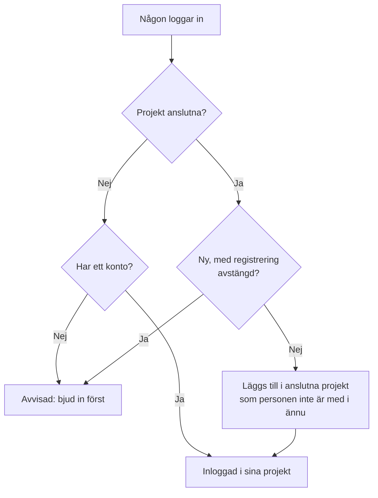

# Global SSO

Med global SSO konfigurerar en **instansadministratör** i OneUptime (master admin) en identitetsleverantör för SAML 2.0 eller OpenID Connect (OIDC) **en gång**, på instansnivå, och ansluter den till valfritt projekt på servern. I stället för att varje projektägare konfigurerar sin egen identitetsleverantör konfigurerar en master admin en som betjänar hela instansen.

> [!NOTE]
> Global SSO, inklusive reglaget "Require SSO for Login" för hela instansen, ingår i alla OneUptime-utgåvor: alla självhostade instanser har det, även Community Edition, och det kräver ingen licens. Det är instansadministration och gäller därför inte OneUptime Cloud. Se [Enterprise Edition](/docs/self-hosted/enterprise) för vad varje utgåva innehåller.

:::cards
- [Konfigurera en leverantör](#konfigurera-global-sso): Skapa den, ge din identitetsleverantör OneUptimes URL:er och testa den.
- [Hur användare loggar in](#hur-användare-loggar-in): Endast befintliga medlemmar, eller nya personer som läggs till i projekten du ansluter.
- [Kräv SSO](#kräv-sso): Kräv SSO för ett projekt eller för hela instansen.
- [Stäng av en leverantör](#stänga-av-eller-ta-bort-en-leverantör): Vad som upphör, och vilka ändringar OneUptime avvisar.
:::

## Global SSO jämfört med projekt-SSO

|                         | Projekt-SSO                                       | Global SSO                                          |
| ----------------------- | ------------------------------------------------- | --------------------------------------------------- |
| Konfigureras av         | Projektägare/-administratör (Projektinställningar) | Instansens master admin (Admin Dashboard)          |
| Omfattning              | Ett enskilt projekt                               | Hela instansen, kan anslutas till valfritt projekt  |
| Resultat vid inloggning | Åtkomst till just det projektet                   | Åtkomst till alla projekt användaren kan nå         |

För ett enskilt projekts egen leverantör, se [SSO](/docs/identity/sso).

## Konfigurera global SSO

:::steps
### Öppna listan över leverantörer

:::tabs
@tab SAML
Logga in som master admin och öppna Admin Dashboard med **Admin-inställningar** i användarmenyn. Gå sedan till **Inställningar** > **Autentisering** > **Global SSO**.
@tab OpenID Connect
Logga in som master admin och öppna Admin Dashboard med **Admin-inställningar** i användarmenyn. Gå sedan till **Inställningar** > **Autentisering** > **Global OIDC**.
:::

### Skapa leverantören

:::tabs
@tab SAML
- Klicka på **Create Global SSO**.
- Ange ett **Namn**, **Sign On URL** och **Issuer** från din identitetsleverantör, och klistra in **Public Certificate**. Resten är redan ifyllt under **Fler fält**: **Signature Method** (`RSA-SHA256`), **Digest Method** (`SHA256`) och en beskrivning (`Sign in with` och namnet). Ändra dem bara om din IdP kräver det. När du sparar öppnas leverantörens sida.
@tab OpenID Connect
- Klicka på **Create Global OIDC**.
- Ange ett **Namn**, **Issuer URL** samt **Client ID** och **Client Secret** för appen du har registrerat i din IdP. Det fungerar också att klistra in IdP:ns discovery-URL i **Issuer URL**. Resten är redan ifyllt under **Fler fält**: **Discovery URL** (utfärdaren följd av `/.well-known/openid-configuration`), **Scopes** (`openid email profile`), anspråksnamnen `email` och `name` och en beskrivning (`Sign in with` och namnet). Ändra dem bara om din IdP kräver det. När du sparar öppnas leverantörens sida.
:::

### Kopiera OneUptimes URL:er till din identitetsleverantör

:::tabs
@tab SAML
På leverantörens sida visar kortet **Identity Provider URLs** **ACS URL (Assertion Consumer Service / Reply URL)** och **Issuer (Entity ID)**. Klistra in båda i din identitetsleverantör (Okta, Microsoft Entra ID, OneLogin, JumpCloud med flera).
@tab OpenID Connect
På leverantörens sida visar kortet **Identity Provider URL** **Redirect URI (Callback URL)**. Lägg till den bland din identitetsleverantörs tillåtna omdirigerings-URI:er.
:::

### Slå på leverantören

En ny leverantör börjar avstängd. Klicka på **Edit Configuration** på leverantörens sida och slå på **Aktiverad**.

Att slå på en global leverantör lägger bara till ett alternativ "Sign in with SSO" på inloggningssidan — den tvingar aldrig fram SSO och stänger aldrig ute någon, så det är säkert att slå på den, testa den och stänga av den igen vid behov.

### Testa leverantören

Använd länken i kortet **Test this SSO provider** (**Test this OIDC provider** för OpenID Connect) för att köra en fullständig inloggning via din identitetsleverantör. Du behöver inte ansluta några projekt först: testet loggar in dig i de projekt du redan är med i. Leverantören måste vara påslagen för att länken ska fungera.
:::

## Hur användare loggar in

Hur en global leverantör beter sig beror på om du ansluter några projekt till den:

- **Inga projekt anslutna (alla projekt / inbjudan först):** Användare kan logga in med leverantören och nå **alla projekt de redan är medlemmar i**. Nya användare skapas **inte** automatiskt — en användare måste först bjudas in till ett projekt. Använd detta för företagsövergripande SSO där medlemskap hanteras på annat håll.

- **Projekt anslutna (automatisk etablering):** Öppna leverantören och använd tabellen **Attached Projects** för att ansluta ett eller flera projekt, vart och ett med en uppsättning standardteam. Användare som loggar in **etableras automatiskt** i dessa projekt och läggs till i standardteamen vid första inloggningen. Ett projekt som du ansluter börjar med sitt medlemsteam; välj andra team om nya användare ska börja med annan åtkomst. Lägg till ett projekt + team i taget för att bygga listan; för att ändra en anslutning, ta bort den och lägg till den igen.

Den som redan är medlem i ett anslutet projekt behåller sina team där.

Två reglage på leverantören ändrar detta. Båda börjar avstängda, hopfällda under **Fler fält**:

| Reglage | Vad det gör när det är påslaget |
| --- | --- |
| **Disable Sign Up with SSO** | Personer måste vara inbjudna till ett projekt innan de kan logga in med den här leverantören, även när projekt är anslutna. Ingen ny skapas vid första inloggningen. |
| **Restrict to Attached Projects** | Inloggning med den här leverantören uppfyller SSO-kravet bara i de projekt som är anslutna till den, så personer som redan är inloggade kan förlora åtkomsten till andra projekt. När det är avstängt uppfyller inloggningen kravet i alla projekt personen tillhör, och anslutna projekt avgör bara var nya personer läggs till. |

## Kräv SSO

Att konfigurera en global leverantör tvingar ingen att använda den; inloggning med lösenord fungerar fortfarande. För att kräva SSO slår du på kravet för ett projekt eller för hela instansen:

- **Per projekt:** ett projekt kan kräva SSO, och eventuellt kräva en _specifik_ leverantör (projekt eller global). Se [Kräv SSO för ditt projekt](/docs/identity/sso#kräv-sso-för-ditt-projekt).
- **Hela instansen:** **Admin** > **Inställningar** > **Autentisering** har ett reglage **Kräv SSO för inloggning** som tvingar fram SSO för alla användare på instansen. Det ber om bekräftelse innan det slås på och sparas så snart du bekräftar. Master admins förblir undantagna så att de inte kan stängas ute.

Att slå på **Kräv SSO för inloggning** kräver en SSO-leverantör som loggar in personer, så att ingen stängs ute av det:

- För hela instansen behöver varje projekt som inte självt kräver SSO en: en av projektets egna SAML- eller OIDC-leverantörer som är påslagen, eller en global leverantör som är påslagen och loggar in personer i det. Så länge ett projekt inte har någon avvisas det att slå på reglaget, och meddelandet nämner projekten (eller, när de är många, de första och hur många). Slå först på en global leverantör, eller en leverantör i de projekten. Ett projekt som kräver en specifik leverantör behöver just den: så länge den är avstängd, borttagen eller inte loggar in personer i projektet nämner meddelandet projektet för sig — slå först på den leverantören, eller kräv en annan där.
- För ett projekt ställs samma krav på det projektet, och på den leverantör det kräver när det kräver en.
- En sparning som skickar **Kräv SSO för inloggning** som påslaget medan det redan är påslaget — tillsammans med andra inställningar eller från API:et — kontrolleras på samma sätt, för instansen eller för ett projekt, och detsamma gäller en sparning som anger den leverantör ett projekt redan kräver.
- För ett nytt projekt, som ännu inte har någon egen leverantör: så länge instansen kräver SSO kräver det en global leverantör som är påslagen och loggar in personer i alla projekt att skapa ett projekt, annars skulle ingen, inte ens den som skapar det, kunna öppna det. Utan en sådan avvisas skapandet av ett projekt, och meddelandet ber en serveradministratör att slå på en. Master admins kan fortfarande skapa projekt. Ett projekt som skapas med **Kräv SSO för inloggning** redan påslaget behöver detsamma, oavsett vem som skapar det.

Att stänga av det avvisas aldrig.

## Stänga av eller ta bort en leverantör

Att stänga av en global leverantör, ta bort den eller begränsa den till de projekt som är anslutna till den avslutar de inloggningar den har gett där den inte längre loggar in personer. Där SSO krävs måste personer som loggade in med den logga in med SSO igen vid nästa förfrågan, sidorna de har öppna slutar genast att få liveuppdateringar, och en MCP-klient som någon anslöt efter att ha loggat in med den slutar fungera i projektet.

Att slå på leverantören igen ger inte tillbaka de inloggningarna: personerna loggar in med den igen. En leverantör som redan var avstängd när du uppgraderade räknas som avstängd vid uppgraderingen.

Ett nytt certifikat eller en ny klienthemlighet, andra URL:er eller ett nytt namn håller alla inloggade.

### Varje projekt som kräver SSO behåller en väg in

Ett projekt som kräver SSO, självt eller för att hela instansen gör det, behåller alltid en leverantör som personer kan logga in i det med. Därför avvisas dessa ändringar så länge de skulle lämna ett sådant projekt helt utan leverantör, eller ta ifrån det den leverantör det kräver:

- att stänga av en global leverantör, ta bort den eller begränsa den till de projekt som är anslutna till den;
- för en leverantör som är begränsad till de projekt som är anslutna till den: att ansluta dess första projekt (fram till dess loggar den in personer i alla projekt), stänga av en anslutning, flytta den till ett annat projekt eller en annan leverantör, eller ta bort den.

Meddelandet nämner projekten, eller de första och hur många de är. Slå först på en annan leverantör för dem, en av deras egna eller en global, eller stäng av **Kräv SSO för inloggning** där. Ett projekt som kräver just den här leverantören nämns för sig: kräv först en annan leverantör där, eller stäng av **Kräv SSO för inloggning**.

Ändringar som låter en leverantör logga in fler personer — att slå på den eller en anslutning, att häva begränsningen — avvisas aldrig. De når alla appservrar direkt, precis som när **Kräv SSO för inloggning** stängs av: personer kan logga in med leverantören genast. Bara när en annan ändring av samma leverantör sparas i exakt samma ögonblick kan en appserver behöva upp till en minut för att följa efter.

Två ändringar av vem som kan logga in kontrolleras efter varandra. Sparas en annan i samma ögonblick och tar den längre tid än vanligt — att slå på **Kräv SSO för inloggning** för hela instansen läser alla projekt — avvisas en ändring med "Another change to who can sign in with SSO is being saved. Try again in a moment.": spara den igen. Ett projekt som skapas i det ögonblicket väntar också på ändringen, och väntar det för länge avvisas det med "The server's SSO settings are being changed. Create the project again in a moment."

## Felsökning

:::details "You must be invited to a project on this OneUptime instance before you can sign in with SSO"
Personen har ännu inget OneUptime-konto, och leverantören skapar inget: antingen är inga projekt anslutna till den, eller så är **Disable Sign Up with SSO** påslaget. Bjud in personen till ett projekt, eller anslut ett projekt till leverantören.
:::

:::details "This SSO provider does not grant access to any project you are a member of"
**Restrict to Attached Projects** är påslaget, och personen är inte medlem i något projekt som är anslutet till leverantören. Anslut ett av personens projekt, eller lägg till personen i ett anslutet projekt.
:::

:::details "You are not a member of any project on this OneUptime instance"
Personen har ett konto men tillhör inget projekt, och leverantören har inget att lägga till hen i. Bjud in personen till ett projekt, eller anslut ett projekt med standardteam till leverantören.
:::

:::details "Issuer URL does not match"
För en SAML-leverantör är utfärdaren i svaret från din identitetsleverantör inte den **Issuer** som är sparad på leverantören. Kopiera den igen från din identitetsleverantör; de två måste matcha exakt.
:::

## Nästa steg

:::cards
- [SSO](/docs/identity/sso): Konfigurera ett projekts egen SAML- eller OIDC-leverantör.
- [SCIM](/docs/identity/scim): Låt din identitetsleverantör lägga till och ta bort personer automatiskt.
- [Användare, team och behörigheter](/docs/permissions/index): Vad teamen som nya personer går med i låter dem göra.
:::
