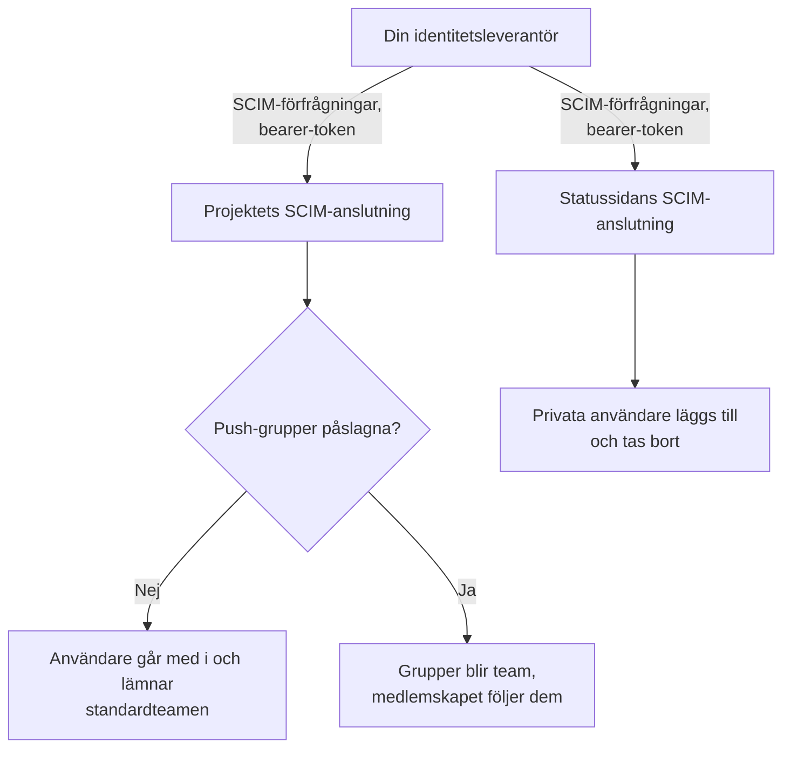
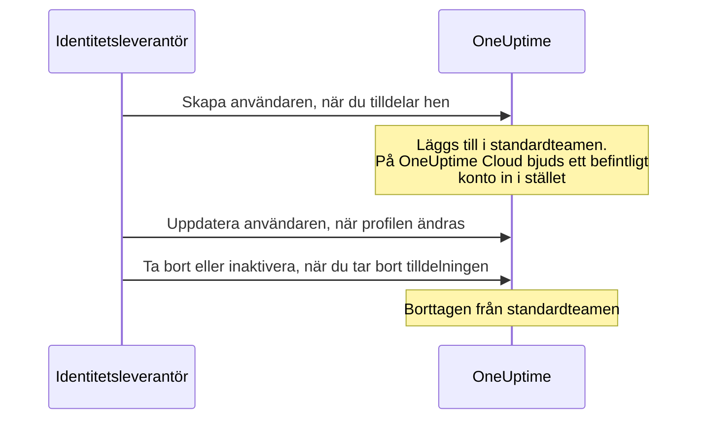
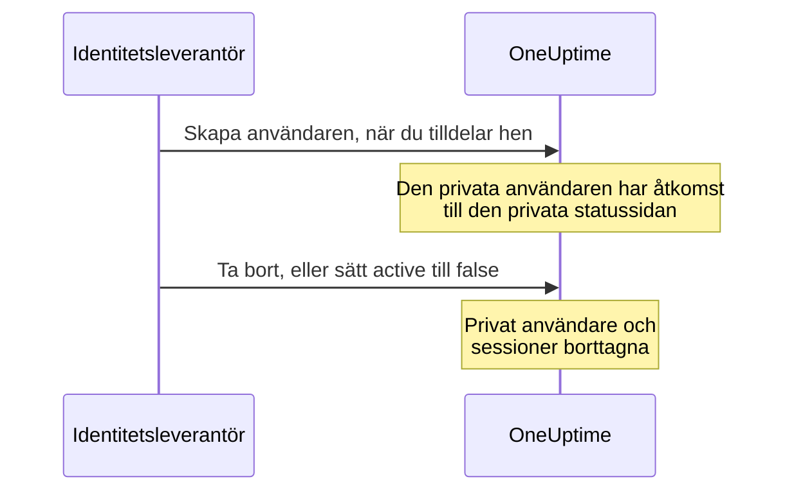

# SCIM

SCIM (System for Cross-domain Identity Management) etablerar och avetablerar personer automatiskt. Din identitetsleverantör (IdP) — Microsoft Entra ID, Okta eller vilket annat SCIM 2.0-system som helst — lägger till personer i dina OneUptime-projekt och privata statussidor när du tilldelar dem, och tar bort dem när du tar bort tilldelningen.

> [!NOTE]
> **Utgåva:** SCIM ingår i OneUptime Enterprise Edition. På OneUptime Cloud är det tillgängligt från planen **Scale** och uppåt. Självhostade installationer behöver Enterprise Edition-avbildningen och en licens. Se [Enterprise Edition](/docs/self-hosted/enterprise). Utan en giltig licens (efter provperioden på 14 dagar, eller 30 dagar efter att en licens har gått ut) avvisas SCIM-förfrågningar tills en licens aktiveras.

:::cards
- [Konfigurera projekt-SCIM](#konfigurera-projekt-scim): Skapa en anslutning och ge din IdP dess URL och token.
- [Konfigurera SCIM för statussidor](#konfigurera-scim-för-statussidor): Etablera de privata användarna av en statussida.
- [Anslut din identitetsleverantör](#konfigurera-din-identitetsleverantör): Steg för steg för Microsoft Entra ID och Okta.
- [Vanliga frågor](#vanliga-frågor): Befintliga användare, avetablering, ändrade e-postadresser.
:::

## Så fungerar det

Din identitetsleverantör anropar OneUptimes SCIM-slutpunkt, autentiserad med en bearer-token, varje gång du tilldelar, ändrar eller tar bort tilldelningen av någon. Vad förfrågan ändrar beror på var anslutningen finns:



SCIM-integrationen ger följande fördelar:

- **Automatisk etablering av användare**: användare skapas i OneUptime när de tilldelas i din IdP.
- **Automatisk avetablering av användare**: användare tas bort från OneUptime när deras tilldelning tas bort i din IdP.
- **Synkronisering av användarattribut**: användarinformationen hålls likadan i din IdP och i OneUptime.
- **Central åtkomsthantering**: åtkomsten till OneUptime hanteras från ditt befintliga system för identitetshantering.

SCIM och [SSO](/docs/identity/sso) är oberoende: SCIM avgör vem som är med i ett projekt, SSO hur de loggar in. De flesta organisationer använder båda.

## SCIM för projekt

Med projekt-SCIM hanterar identitetsleverantörer teammedlemmarna i OneUptime-projekt.

### Konfigurera projekt-SCIM

Endast en projektägare kan lägga till eller ändra ett projekts SCIM-anslutning, eller se eller återställa dess bearer-token: via SCIM kan din identitetsleverantör lägga till personer i vilket team som helst i projektet.
:::steps
1. **Gå till projektinställningarna**

   - Öppna ditt OneUptime-projekt
   - Gå till **Projektinställningar** > **Säkerhet** > **SCIM**

2. **Konfigurera SCIM-inställningarna**

   - Ange ett **Namn**. **Standardteam** börjar med projektets medlemsteam: nya användare läggs till i dessa team
   - Under **Fler fält** är **Etablera användare automatiskt** (lägg till användare när de tilldelas i din IdP) och **Avetablera användare automatiskt** (ta bort användare när deras tilldelning tas bort i din IdP) påslagna, och **Aktivera push-grupper** är avstängt. Ändra dem där om du behöver
   - Spara. Dialogen med **SCIM Base URL** och **Bearer Token** för din IdP-konfiguration öppnas direkt

3. **Konfigurera din identitetsleverantör**

   - Använd **SCIM Base URL** från dialogen. På OneUptime Cloud är den `https://oneuptime.com/identity/scim/v2/<scim-id>`; en självhostad installation visar sin egen värd
   - Konfigurera autentisering med bearer-token med **Bearer Token** från dialogen
   - Mappa användarattributen (e-post krävs). [Konfigurera din identitetsleverantör](#konfigurera-din-identitetsleverantör) har detaljerna för Microsoft Entra ID och Okta
:::

För att se URL:erna igen väljer du **Visa SCIM-URL:er** på anslutningens rad. **Återställ Bearer-token** ersätter token; uppdatera din identitetsleverantör med den nya.

### Så etableras en projektanvändare



En person som redan hade ett OneUptime-konto går med när hen accepterar inbjudan på OneUptime Cloud (se [vanliga frågor](#vanliga-frågor)). Åtkomst som ges via andra team än anslutningens standardteam påverkas inte.

## SCIM för statussidor

Med SCIM för statussidor etablerar och avetablerar identitetsleverantörer statussidors privata användare, som har åtkomst till privata statussidor.

### Konfigurera SCIM för statussidor

:::steps
1. **Gå till statussidans inställningar**

   - Öppna **Statussidor** och välj din statussida
   - Gå till **Säkerhet** > **SCIM**

2. **Konfigurera SCIM-inställningarna**

   - Ange ett **Namn**. Under **Fler fält** är **Etablera användare automatiskt** (lägg till privata användare när de tilldelas i din IdP) och **Avetablera användare automatiskt** (ta bort privata användare när deras tilldelning tas bort i din IdP) påslagna. Ändra dem där om du behöver
   - Spara. Dialogen med **SCIM Base URL** och **Bearer Token** för din IdP-konfiguration öppnas direkt

3. **Konfigurera din identitetsleverantör**

   - Använd **SCIM Base URL** från dialogen. På OneUptime Cloud är den `https://oneuptime.com/identity/status-page-scim/v2/<scim-id>`
   - Konfigurera autentisering med bearer-token med den token som visas
   - Mappa användarattributen (e-post krävs)
:::

För att se URL:erna igen väljer du **Visa SCIM-slutpunkts-URL:er** på anslutningens rad.

SCIM för statussidor stöder endast användare. Grupper och etablering av grupper stöds inte.

### Så etableras en privat användare



> [!WARNING]
> Avetablering tar permanent bort statussidans privata användare och alla hens sessioner för statussidan. Tilldelas användaren igen senare etableras hen som en ny privat användare. När **Avetablera användare automatiskt** är avstängt ignoreras uppdateringar som sätter `active` till `false`, och DELETE-förfrågningar avvisas.

## Konfigurera din identitetsleverantör

Varje leverantör nedan börjar med att skapa en SCIM-anslutning för projektet i OneUptime och ansluter sedan din identitetsleverantör till den.

### Microsoft Entra ID (tidigare Azure AD)

Microsoft Entra ID ger identitetshantering i företagsklass med SCIM-etablering. Du behöver:

- En klientorganisation i Microsoft Entra ID med en Premium P1- eller P2-licens (krävs för automatisk etablering).
- Ett OneUptime-projekt på planen **Scale** eller högre på OneUptime Cloud.
- Administratörsåtkomst till både Microsoft Entra ID och OneUptime.

:::steps
#### Skapa SCIM-anslutningen för Entra ID

1. Logga in i din OneUptime-instrumentpanel
2. Gå till **Projektinställningar** > **Säkerhet** > **SCIM**
3. Klicka på **Skapa SCIM**
4. Ange ett beskrivande namn (t.ex. "Microsoft Entra ID Provisioning")
5. Kontrollera inställningarna:
   - **Standardteam**: börjar med projektets medlemsteam; nya användare läggs till i dessa team
   - **Etablera användare automatiskt** och **Avetablera användare automatiskt**: påslagna, under **Fler fält**
   - **Aktivera push-grupper**: under **Fler fält**; slå på det om du vill hantera teammedlemskap via grupper i Entra ID
6. Spara konfigurationen
7. Kopiera **SCIM Base URL** och **Bearer Token** från dialogen som öppnas — du behöver dem i Entra ID

#### Skapa ett företagsprogram i Entra ID

1. Logga in i [Microsoft Entra admin center](https://entra.microsoft.com)
2. Gå till **Identity** > **Applications** > **Enterprise applications**
3. Klicka på **+ New application** och sedan på **+ Create your own application**
4. Ange ett namn (t.ex. "OneUptime")
5. Välj **Integrate any other application you don't find in the gallery (Non-gallery)** och klicka på **Create**

#### Anslut Entra ID till OneUptime

1. Gå till **Provisioning** i ditt OneUptime-företagsprogram och klicka på **Get started**
2. Ställ in **Provisioning Mode** på **Automatic**
3. Under **Admin Credentials** ställer du in **Tenant URL** på **SCIM Base URL** från OneUptime (t.ex. `https://oneuptime.com/identity/scim/v2/<scim-id>`) och **Secret Token** på **Bearer Token**
4. Klicka på **Test Connection** för att kontrollera konfigurationen och sedan på **Save**

#### Mappa användarattribut i Entra ID

1. Klicka på **Mappings** i avsnittet Provisioning och sedan på **Provision Azure Active Directory Users**
2. Konfigurera följande attributmappningar, ta bort dem du inte behöver och klicka på **Save**:

| Azure AD-attribut                                             | OneUptime SCIM-attribut        | Obligatoriskt |
| ------------------------------------------------------------- | ------------------------------ | ------------- |
| `userPrincipalName`                                           | `userName`                     | Ja            |
| `mail`                                                        | `emails[type eq "work"].value` | Rekommenderas |
| `displayName`                                                 | `displayName`                  | Rekommenderas |
| `givenName`                                                   | `name.givenName`               | Valfritt      |
| `surname`                                                     | `name.familyName`              | Valfritt      |
| `Switch([IsSoftDeleted], , "False", "True", "True", "False")` | `active`                       | Rekommenderas |

#### Mappa grupper i Entra ID (valfritt)

Om du slog på **Aktivera push-grupper** i OneUptime:

1. Gå tillbaka till **Mappings** och klicka på **Provision Azure Active Directory Groups**
2. Ställ in **Enabled** på **Yes**
3. Konfigurera följande attributmappningar och klicka på **Save**:

| Azure AD-attribut | OneUptime SCIM-attribut |
| ----------------- | ----------------------- |
| `displayName`     | `displayName`           |
| `members`         | `members`               |

#### Tilldela användare och grupper i Entra ID

1. Gå till **Users and groups** i ditt OneUptime-företagsprogram
2. Klicka på **+ Add user/group**, välj de användare och grupper som ska etableras i OneUptime och klicka på **Assign**

#### Starta etableringen i Entra ID

1. Gå till **Provisioning** > **Overview** och klicka på **Start provisioning**
2. Den första etableringscykeln startar; den första synkroniseringen kan ta upp till 40 minuter
3. Leta efter fel i **Provisioning logs**. De personer du tilldelade visas i projektets team i OneUptime
:::

### Okta

Okta ger flexibel identitetshantering med stöd för SCIM. Du behöver:

- En Okta-klientorganisation med etablering (funktionen Lifecycle Management).
- Ett OneUptime-projekt på planen **Scale** eller högre på OneUptime Cloud.
- Administratörsåtkomst till både Okta och OneUptime.

:::steps
#### Skapa SCIM-anslutningen för Okta

1. Logga in i din OneUptime-instrumentpanel
2. Gå till **Projektinställningar** > **Säkerhet** > **SCIM**
3. Klicka på **Skapa SCIM**
4. Ange ett beskrivande namn (t.ex. "Okta Provisioning")
5. Kontrollera inställningarna:
   - **Standardteam**: börjar med projektets medlemsteam; nya användare läggs till i dessa team
   - **Etablera användare automatiskt** och **Avetablera användare automatiskt**: påslagna, under **Fler fält**
   - **Aktivera push-grupper**: under **Fler fält**; slå på det om du vill hantera teammedlemskap via grupper i Okta
6. Spara konfigurationen
7. Kopiera **SCIM Base URL** och **Bearer Token** från dialogen som öppnas — du behöver dem i Okta

#### Skapa eller öppna Okta-programmet

Gå till **Applications** > **Applications** i Okta Admin Console:

- Använder du redan Okta för SSO i OneUptime öppnar du det programmet.
- Annars klickar du på **Create App Integration**, väljer **SAML 2.0**, ger det namnet "OneUptime" och slutför SAML-konfigurationen (se [SSO](/docs/identity/sso)).

#### Slå på SCIM-etablering i Okta

1. Gå till fliken **General** i ditt OneUptime-program
2. Klicka på **Edit** i avsnittet **App Settings**, välj **SCIM** under **Provisioning** och klicka på **Save**
3. En ny flik **Provisioning** visas

#### Anslut Okta till OneUptime

1. Klicka på **Integration** på fliken **Provisioning**, sedan på **Configure API Integration**, och markera **Enable API integration**
2. Konfigurera följande:
   - **SCIM connector base URL**: **SCIM Base URL** från OneUptime (t.ex. `https://oneuptime.com/identity/scim/v2/<scim-id>`)
   - **Unique identifier field for users**: `userName`
   - **Supported provisioning actions**: Import New Users and Profile Updates, Push New Users, Push Profile Updates och, om du använder gruppbaserad etablering, Push Groups
   - **Authentication Mode**: **HTTP Header**
   - **Authorization**: **Bearer Token** från OneUptime. OneUptime förväntar sig headern `Authorization: Bearer <token>`; visar Okta redan ordet Bearer framför fältet anger du bara token
3. Klicka på **Test API Credentials** för att kontrollera anslutningen och sedan på **Save**

#### Välj vad Okta etablerar

1. Klicka på **To App** på fliken **Provisioning** och sedan på **Edit**
2. Slå på **Create Users**, **Update User Attributes** och **Deactivate Users** och klicka på **Save**

#### Mappa användarattribut i Okta

Rulla ned till **Attribute Mappings** och kontrollera dessa mappningar. Ta bort dem du inte behöver:

| Okta-attribut      | OneUptime SCIM-attribut         | Riktning        |
| ------------------ | ------------------------------- | --------------- |
| `userName`         | `userName`                      | Okta till app   |
| `user.email`       | `emails[primary eq true].value` | Okta till app   |
| `user.firstName`   | `name.givenName`                | Okta till app   |
| `user.lastName`    | `name.familyName`               | Okta till app   |
| `user.displayName` | `displayName`                   | Okta till app   |

#### Pusha grupper från Okta (valfritt)

Om du slog på **Aktivera push-grupper** i OneUptime:

1. Gå till fliken **Push Groups** och klicka på **+ Push Groups**
2. Välj **Find groups by name** eller **Find groups by rule**
3. Sök efter och välj de grupper som ska pushas och klicka på **Save**

#### Tilldela personer i Okta

1. Gå till fliken **Assignments**
2. Klicka på **Assign** > **Assign to People** eller **Assign to Groups**, välj vilka som ska etableras, klicka på **Assign** för var och en och sedan på **Done**

#### Kontrollera etableringen i Okta

1. Gå till **Reports** > **System Log** i Okta Admin Console och filtrera på ditt OneUptime-program
2. Kontrollera att etableringshändelserna lyckades och att personerna visas i projektets team i OneUptime
:::

### Andra identitetsleverantörer

OneUptimes SCIM-implementering följer SCIM v2.0-specifikationen och fungerar med alla kompatibla identitetsleverantörer:

| Inställning | Värde |
| --- | --- |
| SCIM Base URL | **SCIM Base URL** från OneUptime: `https://oneuptime.com/identity/scim/v2/<scim-id>` för ett projekt, eller `https://oneuptime.com/identity/status-page-scim/v2/<scim-id>` för en statussida |
| Autentisering | HTTP-bearer-token |
| Unik användaridentifierare | `userName`, som måste vara en giltig e-postadress |
| Åtgärder | GET, POST, PUT, PATCH och DELETE för Users, i projekt-SCIM och SCIM för statussidor. Groups stöds endast i projekt-SCIM. |

## SCIM API-referens

Sökvägarna är relativa till anslutningens **SCIM Base URL**.

| Slutpunkt                | Metoder                 | Beskrivning                                          |
| ------------------------ | ----------------------- | ---------------------------------------------------- |
| `/ServiceProviderConfig` | GET                     | SCIM-serverns funktioner                             |
| `/Schemas`               | GET                     | Tillgängliga resursscheman                           |
| `/ResourceTypes`         | GET                     | Tillgängliga resurstyper                             |
| `/Users`                 | GET, POST               | Lista och skapa användare                            |
| `/Users/{id}`            | GET, PUT, PATCH, DELETE | Hantera enskilda användare                           |
| `/Groups`                | GET, POST               | Lista och skapa grupper/team (endast projekt-SCIM)   |
| `/Groups/{id}`           | GET, PUT, PATCH, DELETE | Hantera enskilda grupper (endast projekt-SCIM)       |
| `/Bulk`                  | POST                    | Flera åtgärder i en förfrågan                        |

Vad `/ServiceProviderConfig` rapporterar:

| Funktion | Stöds |
| --- | --- |
| PATCH | Ja |
| Bulk | Ja, upp till 1 000 åtgärder och 1 MB per förfrågan |
| Filter | Ja, upp till 200 resultat |
| Sortering | Ja |
| Ändra lösenord | Nej |
| ETag | Nej |
| Autentisering | HTTP-bearer-token |

En grupp som din identitetsleverantör skapar blir ett team med samma namn i projektet; ett team som redan har det namnet används i stället för ett nytt.

:::details SCIM-användarschema
```json
{
  "schemas": ["urn:ietf:params:scim:schemas:core:2.0:User"],
  "userName": "user@example.com",
  "name": {
    "givenName": "John",
    "familyName": "Doe",
    "formatted": "John Doe"
  },
  "displayName": "John Doe",
  "emails": [
    {
      "value": "user@example.com",
      "type": "work",
      "primary": true
    }
  ],
  "active": true
}
```
:::

:::details SCIM-gruppschema
```json
{
  "schemas": ["urn:ietf:params:scim:schemas:core:2.0:Group"],
  "displayName": "Engineering Team",
  "members": [
    {
      "value": "user-id-here",
      "display": "user@example.com"
    }
  ]
}
```
:::

## Planer och licenser

På OneUptime Cloud kräver SCIM planen **Scale**. En självhostad installation kräver Enterprise Edition och en licens, som anmärkningen högst upp på sidan säger.

### Under planen Scale

På OneUptime Cloud fungerar SCIM-etablering bara fullt ut så länge projektet har **Scale** eller högre. Under den — efter att en Scale-provperiod har slutat eller planen har sänkts — tar projektets SCIM-anslutningar, och statussidornas, bara bort personer, så att alla som slutar fortfarande förlorar sin åtkomst:

- **Fungerar fortfarande:** att inaktivera en användare (`active` satt till `false`, på en anslutning som är inställd på att ta bort de personer den inaktiverar), att ta bort en användare, att ta bort medlemmar ur en grupp (Entra ID:s `Remove` på `members` med medlemmarna som värde, Oktas `remove` på `members[value eq "..."]`, eller att ersätta medlemmarna med några av dem gruppen redan har), att ta bort en grupp, och en `Bulk`-förfrågan som bara består av `DELETE`. Uppslag besvaras också — att lista och filtrera användare och grupper, vilket identitetsleverantörer gör innan de tar bort någon — men under planen skapar ett uppslag aldrig någon.
- **Avvisas:** att skapa en användare eller en grupp, att återaktivera en användare (`active` satt till `true` för någon som anslutningen skulle lägga tillbaka i ett av sina team), att lägga till någon i en grupp som hen inte är med i, och att bara ändra en användares e-postadress eller namn eller en grupps namn. En förfrågan som lägger till någon avvisas i sin helhet, även när den samtidigt tar bort personer, eftersom en SCIM-`PATCH` är allt eller inget. Avvisningen är en `402` med ett fel i SCIM-format, som din identitetsleverantör visar: `SCIM provisioning needs the Scale plan. This project's plan does not include it, so its SCIM connections can only remove people: requests that add or change people or groups are refused. The connections are kept: upgrade the project to Scale in Project Settings > Billing and they work fully again.` Varje avvisning finns också i anslutningens SCIM-loggar.
- **En borttagning som också ändrar en profil** — en inaktivering som skickar en ny e-postadress eller ett nytt namn, eller en gruppuppdatering som tar bort medlemmar och byter namn på gruppen — går igenom och lämnar e-postadressen, namnet eller gruppnamnet som det var. Identitetsleverantörer skickar igen det de ser skiljer sig, så en ändring som avvisats en gång kommer tillbaka med deras senare förfrågningar, och en borttagning väntar aldrig på planen. En inaktivering på en anslutning som inte tar bort de personer den inaktiverar (automatisk avetablering avstängd, eller grupper som pushas i stället) tar inte bort någon, så en ny e-postadress eller ett nytt namn som skickas med den avvisas som en egen ändring.
- **En förfrågan som inte ändrar något besvaras som vanligt** — Oktas `PUT` av en användare som den är, med `active` satt till `true`, för någon som redan finns i alla anslutningens team; att lägga till någon i en grupp som hen redan är med i; en e-postadress som skickas igen med andra stora och små bokstäver; attribut som OneUptime inte lagrar, till exempel en titel eller en avdelning. En statussidas privata användare finns på sidan eller inte alls, så `active` satt till `true` ändrar aldrig en sådan användare.

Ingenting tas bort. Uppgradera till **Scale** så fungerar anslutningarna fullt ut igen som de är, med samma bearer-token och inget att konfigurera om i din identitetsleverantör; en planändring träder i kraft inom en minut. Identitetsleverantörer fortsätter att anropa enligt sitt eget schema: Okta visar avvisningarna bland sina etableringsfel, och Entra ID visar dem i sina etableringsloggar och kan sätta ett jobb som hela tiden misslyckas i karantän, vilket gör synkroniseringarna — även borttagningar — långsammare, till ungefär en om dagen. Starta om etableringen där efter uppgraderingen, så att personerna som lagts till under tiden etableras.

Under **Scale** visar **Projektinställningar** > **Säkerhet** > **SCIM** och en statussidas sida **SCIM** anslutningarna under planens uppgraderingserbjudande (**SCIM-anslutningar som fortfarande är konfigurerade**) och säger att de bara tar bort personer. Ta bort en anslutning för att bli av med den. Att lägga till en anslutning, ändra en eller ersätta dess bearer-token kräver **Scale**. Listan visar inga bearer-token, och bara projektägare kan läsa en token, på alla planer.

## Felsökning

Börja med fliken **Loggar** under **Projektinställningar** > **Säkerhet** > **SCIM** (eller på statussidans sida **SCIM**). Den listar de SCIM-förfrågningar som din identitetsleverantör har skickat, med status, och **Visa detaljer** visar förfrågan och vad OneUptime svarade.

:::details Entra ID: Test Connection misslyckas
Kontrollera att **Tenant URL** är exakt den **SCIM Base URL** som OneUptime visar, och att **Secret Token** är den aktuella **Bearer Token**. Efter **Återställ Bearer-token** fungerar den gamla token inte längre.
:::

:::details Okta: testet av API-uppgifterna misslyckas, eller förfrågningar får 401 Unauthorized
Kontrollera **SCIM connector base URL** och token. OneUptime läser headern `Authorization: Bearer <token>`, så se till att ordet Bearer skickas exakt en gång. Har token gått förlorad eller läckt väljer du **Återställ Bearer-token** i OneUptime och uppdaterar Okta.
:::

:::details Användare etableras inte
Kontrollera att användarna är tilldelade programmet i din identitetsleverantör, att etableringen är påslagen där och att attributmappningarna är korrekta. I Entra ID visar **Provisioning logs** varje fel; i Okta gör **System Log** det.
:::

:::details Dubblettanvändare i Okta
Se till att `userName` är unikt och motsvarar användarens e-postadress.
:::

:::details Fel när grupper pushas
Kontrollera att grupperna finns i din identitetsleverantör och har rätt medlemmar, och att **Aktivera push-grupper** är påslaget i OneUptime.
:::

:::details Ändringar från Entra ID dröjer
Entra ID etablerar enligt sitt eget schema: den första synkroniseringen kan ta upp till 40 minuter, och senare synkroniseringar körs ungefär var 40:e minut. Ett jobb som Entra ID har satt i karantän synkroniserar mer sällan; åtgärda felen i **Provisioning logs** och starta om jobbet.
:::

## Vanliga frågor

:::details Vad händer när en användare avetableras?
Avetablering kan begäras med en DELETE-förfrågan eller genom att sätta `active` till `false` i en PUT/PATCH-uppdatering:

- **Projekt-SCIM**: Med **Avetablera användare automatiskt** påslaget tas användaren bort från de standardteam som är konfigurerade i SCIM-inställningarna, medan OneUptime-kontot finns kvar. Åtkomst via andra team påverkas inte. När push-grupper är påslagna hanteras teammedlemskapet via etablering av grupper.
- **SCIM för statussidor**: Med **Avetablera användare automatiskt** påslaget tas statussidans privata användare och alla hens sessioner för statussidan bort permanent. Det tar inte bort ett separat OneUptime-användarkonto i ett projekt.
:::

:::details Kan jag använda SCIM utan SSO?
Ja, SCIM och SSO är oberoende funktioner. Du kan använda SCIM för att etablera användare och låta dem logga in med sina OneUptime-lösenord eller en annan autentiseringsmetod.
:::

:::details Hur hanterar jag användare som redan finns i OneUptime?
När SCIM försöker skapa en användare som redan finns (matchad på e-post) skapar OneUptime ingen dubblettanvändare. Vad som händer sedan beror på var OneUptime körs:

- **Självhostad**: Den befintliga användaren läggs direkt till i de konfigurerade standardteamen (eller, med push-grupper, i gruppens team).
- **OneUptime Cloud**: Ett OneUptime-konto tillhör personen, inte ett enskilt projekt, så SCIM kan inte på eget bevåg göra någon till medlem i ditt projekt. Den befintliga användaren blir i stället **inbjuden** till teamen och får den vanliga inbjudan via e-post. Hen går med när hen accepterar inbjudningarna under **Projektinbjudningar** i OneUptime, eller när hen bekräftar ditt projekts enkla inloggning (SSO) från det e-postmeddelande som OneUptime skickar vid hens första SSO-inloggning. Till dess visas hen som väntande. Detsamma gäller när en grupp lägger till en befintlig användare som ännu inte är medlem i ditt projekt.

Användare som SCIM själv skapar och användare som är medlemmar i ditt projekt läggs direkt till i båda fallen. Att bekräfta ditt projekts SSO gör någon till medlem, så hen läggs också direkt till; den som sedan dess har lämnat ditt projekt bjuds in igen.
:::

:::details Kan SCIM ändra en användares e-postadress eller namn?
E-postadressen för ett OneUptime-konto är det personen loggar in med i alla projekt hen tillhör, och dit länkar för återställning av lösenord skickas. Därför:

- **OneUptime Cloud**: SCIM ändrar aldrig en e-postadress. En förfrågan som skulle ändra en avvisas med ett SCIM-fel `400` av typen `mutability`, och ingenting i förfrågan tillämpas; din identitetsleverantör visar orsaken. Be användaren att själv ändra adressen från sin egen OneUptime-profil. En förfrågan som upprepar adressen som kontot redan har är ingen ändring och lyckas.
- **Självhostad**: SCIM ändrar e-postadressen endast för en användare som har gått med i det här projektet, inte tillhör något annat projekt och inte är OneUptime-administratör. Alla andra ändringar avvisas på samma sätt.

Namn följer samma regel överallt: SCIM uppdaterar namnet endast för en användare som har gått med i det här projektet, inte tillhör något annat projekt och inte är OneUptime-administratör. För alla andra lämnas namnet som det är, och resten av förfrågan lyckas ändå.
:::

:::details Vad är skillnaden mellan standardteam och push-grupper?
- **Standardteam**: alla användare som etableras via SCIM läggs till i samma fördefinierade team
- **Push-grupper**: teammedlemskapet hanteras av din identitetsleverantör, så att olika användare kan vara med i olika team utifrån sina grupper i IdP:n
:::

:::details Hur ofta synkroniseras det?
Det beror på din identitetsleverantör:

- **Microsoft Entra ID**: den första synkroniseringen kan ta upp till 40 minuter; senare synkroniseringar sker var 40:e minut
- **Okta**: nästan i realtid för de flesta åtgärder, med periodiska fullständiga synkroniseringar
:::

## Nästa steg

:::cards
- [SSO](/docs/identity/sso): Låt personerna som SCIM etablerar logga in med din identitetsleverantör.
- [Användare, team och behörigheter](/docs/permissions/index): Vad standardteamen låter nya användare göra.
- [Global SSO](/docs/identity/global-sso): En identitetsleverantör för alla projekt på en självhostad instans.
:::
