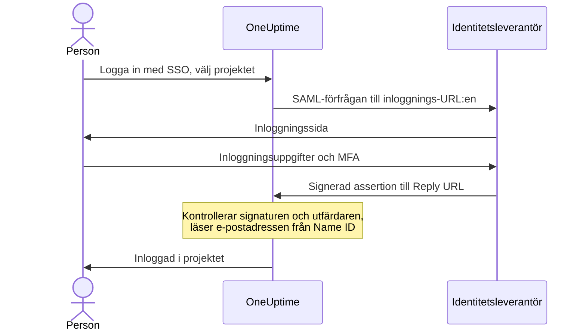

# SSO

Med enkel inloggning (SSO) loggar personerna i ditt projekt in i OneUptime via organisationens identitetsleverantör (IdP), över SAML 2.0 eller OpenID Connect. Du hanterar åtkomst, lösenord och multifaktorautentisering på ett ställe, och du kan kräva SSO för alla i projektet.

> [!NOTE]
> **Utgåva:** SSO, inklusive "Require SSO for login", ingår i alla OneUptime-utgåvor: självhostade installationer får det i Community Edition, utan att någon licens behövs. På OneUptime Cloud är det tillgängligt från planen **Scale** och uppåt. Se [Enterprise Edition](/docs/self-hosted/enterprise) för vad varje utgåva innehåller.

:::cards
- [Konfigurera en SAML-leverantör](#konfigurera-sso): Skapa den i OneUptime och ge din IdP två URL:er.
- [Guider för identitetsleverantörer](#guider-för-identitetsleverantörer): Keycloak, Microsoft Entra ID och Okta, steg för steg.
- [OpenID Connect](#openid-connect-oidc): Logga in via en OIDC-app i stället.
- [Kräv SSO](#kräv-sso-för-ditt-projekt): Gör SSO till den enda vägen in i projektet.
:::

## Så fungerar SAML-inloggning

En SAML-leverantör kopplar ett projekt till ett program i din identitetsleverantör. Den som loggar in väljer projektet på OneUptimes sida **Logga in med SSO**, loggar in hos din IdP och kommer tillbaka inloggad.



OneUptime läser bara några få saker från den assertion som din IdP skickar:

| Från assertionen | Vad OneUptime gör med det |
| --- | --- |
| Signatur | Kontrollerar den mot leverantörens **Offentligt certifikat**. Svaret måste vara signerat och får inte vara krypterat. |
| Issuer | Måste exakt matcha leverantörens **Utfärdare**. |
| Name ID | Personens e-postadress. Den måste vara en giltig e-postadress. |
| `http://schemas.microsoft.com/identity/claims/displayname` | Personens namn, som används när OneUptime skapar kontot. Valfritt. |

Personer som loggar in för första gången går med i leverantörens **Team**, som avgör vad de kan göra: se [Roller och team för SSO-användare](#roller-och-team-för-sso-användare).

> [!NOTE]
> På OneUptime Cloud loggar OneUptime inte in en person som för första gången loggar in i projektet med en av projektets SAML- eller OIDC-leverantörer; i stället skickar OneUptime en länk via e-post. Personen öppnar länken, bekräftar att projektets enkla inloggning får logga in hen och fortsätter inloggningen. Länken gäller i 24 timmar. Detta sker en gång per projekt, och igen om personen lämnar projektet och kommer tillbaka. Självhostade installationer loggar in personer direkt.

## Konfigurera SSO

Du behöver behörighet att lägga till SSO-leverantörer — **Project Owner**, **Project Admin** eller **Create Project SSO** — och, på OneUptime Cloud, planen **Scale**. För din identitetsleverantörs sida, se [guiderna för identitetsleverantörer](#guider-för-identitetsleverantörer).

:::steps
1. **Gå till projektinställningarna**

   - Öppna ditt OneUptime-projekt
   - Gå till **Projektinställningar** > **Säkerhet** > **SSO**

2. **Skapa SSO-konfigurationen**

   - Klicka på **Skapa SSO**
   - Ange ett **Namn** för SSO-konfigurationen (t.ex. "Keycloak SAML" eller "Okta SAML")
   - Ange **Inloggnings-URL** från din identitetsleverantör
   - Ange **Utfärdare** (Entity ID) från din identitetsleverantör
   - Klistra in **Offentligt certifikat** från din identitetsleverantör
   - I steget **Inloggning** börjar **Team** med projektets medlemsteam: personer som loggar in för första gången går med i dessa team. Endast team som du själv kan bjuda in någon till godtas: ett team som ger mer åtkomst än du har nämns under **Team**
   - Resten är redan ifyllt under **Fler fält**: **Signaturmetod** (`RSA-SHA256`), **Digest-metod** (`SHA256`) och en beskrivning ("Sign in with" och namnet). Ändra dem bara om din identitetsleverantör kräver det

3. **Hämta OneUptimes SSO-metadata**
   - När du sparar öppnas dialogen **SSO Configuration**. Du kan öppna den igen med knappen **Visa SSO-konfiguration**
   - Kopiera **Identifier (Entity ID)**, till exempel `https://oneuptime.com/<project-id>/<provider-id>` — den behövs i din IdP-konfiguration
   - Kopiera **Reply URL (Assertion Consumer Service URL)**, till exempel `https://oneuptime.com/identity/idp-login/<project-id>/<provider-id>` — den behövs i din IdP-konfiguration
   - En ny leverantör börjar avstängd. När din IdP har dessa två värden redigerar du leverantören och slår på **Aktiverad**

4. **Testa leverantören**
   - Öppna länken i kortet **Test Single Sign On (SSO)** och välj leverantören på sidan som öppnas. Du skickas till din identitetsleverantörs inloggningssida och sedan tillbaka till OneUptime, inloggad
   - När det fungerar kan du [kräva SSO](#kräv-sso-för-ditt-projekt) för projektet
:::

## Guider för identitetsleverantörer

Välj din identitetsleverantör. Varje guide hämtar IdP:ns värden, skapar leverantören i OneUptime och ger sedan IdP:n OneUptimes **Identifier (Entity ID)** och **Reply URL**.

:::tabs
@tab Keycloak
Keycloak är en populär lösning med öppen källkod för identitets- och åtkomsthantering. Du behöver en körande Keycloak-instans med en realm, och administratörsåtkomst till både Keycloak och OneUptime.

:::steps
1. **Samla in värdena från din realm**

   - **Inloggnings-URL**: `https://<your-keycloak-domain>/auth/realms/<your-realm>/protocol/saml`
   - **Utfärdare**: `https://<your-keycloak-domain>/auth/realms/<your-realm>`
   - **Certifikat**: realmens signeringscertifikat. Öppna `https://<your-keycloak-domain>/auth/realms/<your-realm>/protocol/saml/descriptor` och kopiera värdet `X509Certificate`, eller öppna **Realm settings** > **Keys** och klicka på **Certificate** vid RS256-nyckeln

   Keycloak 17 och senare levererar dessa URL:er utan prefixet `/auth`. Placera certifikatet mellan sina egna rader, så här:

   ```text
   -----BEGIN CERTIFICATE-----
   MIICnzCCAYcCBgFyPZ8QFzANBgkqhkiG.......
   -----END CERTIFICATE-----
   ```

2. **Skapa leverantören i OneUptime**

   Gå till **Projektinställningar** > **Säkerhet** > **SSO**, klicka på **Skapa SSO** och fyll i:
   - **Namn**: ett beskrivande namn (t.ex. `my-project-oneuptime`)
   - **Inloggnings-URL** och **Utfärdare**: värdena ovan
   - **Offentligt certifikat**: certifikatet, mellan sina egna rader `BEGIN CERTIFICATE` och `END CERTIFICATE`
   - **Signaturmetod** och **Digest-metod**: redan angivna under **Fler fält** (`RSA-SHA256` och `SHA256`)

   Spara och kopiera **Identifier (Entity ID)** och **Reply URL (Assertion Consumer Service URL)** från dialogen som öppnas.

3. **Skapa Keycloak-klienten**

   Öppna **Clients** i din realm i Keycloak och skapa en klient, eller redigera en befintlig:
   - **Client Protocol** (klienttyp): `saml`
   - **Client ID**: **Identifier (Entity ID)** från OneUptime
   - **Root URL** och **Valid Redirect URIs**: din OneUptime-URL
   - **Assertion Consumer Service POST Binding URL**: **Reply URL (Assertion Consumer Service URL)** från OneUptime

4. **Justera klientinställningarna**

   - Ställ in **Name ID Format** på `email` och slå på **Force Name ID Format**, så att Keycloak alltid skickar e-postadressen som Name ID
   - Stäng av **Client signature required** (under **Signing keys config**) på klientens flik **Keys**: OneUptime signerar inte sina förfrågningar

5. **Slå på leverantören och testa den**

   Redigera leverantören i OneUptime och slå på **Aktiverad**, öppna sedan länken i kortet **Test Single Sign On (SSO)** och välj leverantören. Du ska skickas till inloggningssidan i Keycloak och tillbaka till OneUptime.
:::
@tab Microsoft Entra ID
Microsoft Entra ID (tidigare Azure AD / Active Directory) är Microsofts molnbaserade identitetstjänst. Du behöver en klientorganisation som stöder företagsprogram med SAML-SSO, och administratörsåtkomst till både Entra ID och OneUptime.

:::steps
1. **Skapa ett företagsprogram i Entra ID**

   - Logga in i [Microsoft Entra admin center](https://entra.microsoft.com)
   - Gå till **Identity** > **Applications** > **Enterprise applications**, klicka på **+ New application** och sedan på **+ Create your own application**
   - Ange ett namn (t.ex. "OneUptime"), välj **Integrate any other application you don't find in the gallery (Non-gallery)** och klicka på **Create**

2. **Kopiera SAML-värdena från Entra ID**

   - Gå till **Single sign-on** i programmet och välj **SAML**
   - Ladda ned **Certificate (Base64)** under **SAML Certificates**, öppna filen i en textredigerare och kopiera innehållet
   - Kopiera **Login URL** och **Microsoft Entra Identifier** (**Azure AD Identifier** i äldre klientorganisationer) under **Set up OneUptime**

3. **Skapa leverantören i OneUptime**

   Gå till **Projektinställningar** > **Säkerhet** > **SSO**, klicka på **Skapa SSO** och fyll i:
   - **Namn**: ett beskrivande namn (t.ex. `Azure AD SAML`)
   - **Inloggnings-URL**: **Login URL**
   - **Utfärdare**: **Microsoft Entra Identifier**
   - **Offentligt certifikat**: Base64-certifikatet, inklusive raderna `BEGIN CERTIFICATE` och `END CERTIFICATE`
   - **Signaturmetod** och **Digest-metod**: redan angivna under **Fler fält** (`RSA-SHA256` och `SHA256`)

   Spara och kopiera **Identifier (Entity ID)** och **Reply URL (Assertion Consumer Service URL)** från dialogen som öppnas.

4. **Ge Entra ID OneUptimes URL:er**

   Klicka på **Edit** under **Basic SAML Configuration** och ange:
   - **Identifier (Entity ID)**: **Identifier (Entity ID)** från OneUptime
   - **Reply URL (Assertion Consumer Service URL)**: **Reply URL** från OneUptime

   Klicka på **Save**.

5. **Skicka e-postadressen som Name ID**

   Klicka på **Edit** under **Attributes & Claims**:
   - Ställ in **Unique User Identifier (Name ID)** på användarens e-postadress: `user.mail`, eller `user.userprincipalname` där det är e-postadressen
   - Ställ in **Name identifier format** på `Email address`
   - Lägg eventuellt till ett anspråk med namnet `http://schemas.microsoft.com/identity/claims/displayname` och källattributet `user.displayname`, så att nya konton får personens namn. OneUptime ignorerar de andra anspråken

6. **Tilldela användare och grupper**

   Klicka på **+ Add user/group** under programmets **Users and groups**, välj de användare och grupper som ska få SSO-åtkomst och klicka på **Assign**.

7. **Slå på leverantören och testa den**

   Redigera leverantören i OneUptime och slå på **Aktiverad**, öppna sedan länken i kortet **Test Single Sign On (SSO)** och välj leverantören. Du ska skickas till Microsofts inloggningssida och tillbaka till OneUptime.
:::
@tab Okta
Okta är en vanlig identitetsplattform med SAML-SSO. Du behöver en Okta-organisation med administratörsåtkomst, och administratörsåtkomst till OneUptime.

:::steps
1. **Skapa ett SAML-program i Okta**

   - Gå till **Applications** > **Applications** i Okta Admin Console och klicka på **Create App Integration**
   - Välj **SAML 2.0** och klicka på **Next**, ange "OneUptime" som **App name** och klicka på **Next**
   - Okta frågar efter OneUptimes URL:er innan den visar sina egna. Ange tills vidare din OneUptime-adress (till exempel `https://oneuptime.com`) som **Single sign-on URL** och **Audience URI (SP Entity ID)**: du ersätter båda i steg 4
   - Ställ in **Name ID format** på `EmailAddress` och **Application username** på `Email`
   - Klicka på **Next**, välj **I'm an Okta customer adding an internal app** och klicka på **Finish**

2. **Kopiera SAML-värdena från Okta**

   Hitta det aktiva certifikatet under **SAML Signing Certificates** på programmets flik **Sign On**:
   - Klicka på **Actions** > **View IdP metadata** och kopiera **Inloggnings-URL** (Identity Provider Single Sign-On URL) och **Utfärdare** (Identity Provider Issuer)
   - Klicka på **Actions** > **Download certificate**, öppna filen `.cert` i en textredigerare och kopiera innehållet

3. **Skapa leverantören i OneUptime**

   Gå till **Projektinställningar** > **Säkerhet** > **SSO**, klicka på **Skapa SSO** och fyll i:
   - **Namn**: ett beskrivande namn (t.ex. `Okta SAML`)
   - **Inloggnings-URL** och **Utfärdare**: värdena från Okta
   - **Offentligt certifikat**: certifikatet, inklusive raderna `BEGIN CERTIFICATE` och `END CERTIFICATE`
   - **Signaturmetod** och **Digest-metod**: redan angivna under **Fler fält** (`RSA-SHA256` och `SHA256`)

   Spara och kopiera **Identifier (Entity ID)** och **Reply URL (Assertion Consumer Service URL)** från dialogen som öppnas.

4. **Ge Okta OneUptimes URL:er**

   Klicka på **Edit** under **SAML Settings** på programmets flik **General** och sedan på **Next**, och ange:
   - **Single sign-on URL**: **Reply URL (Assertion Consumer Service URL)** från OneUptime
   - **Audience URI (SP Entity ID)**: **Identifier (Entity ID)** från OneUptime

   Lägg eventuellt till en attribute statement med namnet `http://schemas.microsoft.com/identity/claims/displayname` och värdet `user.firstName + " " + user.lastName`, så att nya konton får personens namn. Klicka på **Next** och sedan på **Finish**.

5. **Tilldela personer**

   Klicka på **Assign** > **Assign to People** eller **Assign to Groups** på fliken **Assignments**, välj vilka som ska få SSO-åtkomst, klicka på **Assign** för var och en och sedan på **Done**.

6. **Slå på leverantören och testa den**

   Redigera leverantören i OneUptime och slå på **Aktiverad**, öppna sedan länken i kortet **Test Single Sign On (SSO)** och välj leverantören. Du ska skickas till Oktas inloggningssida och tillbaka till OneUptime.
:::
@tab Övriga
OneUptimes SSO använder SAML 2.0 och fungerar med alla kompatibla identitetsleverantörer:

:::steps
1. Hämta din identitetsleverantörs **Inloggnings-URL** (dess SSO-slutpunkt), **Utfärdare** (dess entitets-ID) och **Offentligt certifikat** (dess X.509-signeringscertifikat). Visar din IdP dem först när det finns ett program skapar du programmet med din OneUptime-adress som tillfälliga URL:er.
2. Skapa leverantören i OneUptime med dessa värden och kopiera **Identifier (Entity ID)** och **Reply URL (Assertion Consumer Service URL)** från dialogen **SSO Configuration** (eller via **Visa SSO-konfiguration**).
3. Ställ i SAML-programmet hos din identitetsleverantör in **Assertion Consumer Service URL / Reply URL** och **Entity ID / Audience URI** på OneUptimes värden, och **Name ID Format** på e-postadress.
4. **Signaturmetod** (`RSA-SHA256`) och **Digest-metod** (`SHA256`) är redan angivna under **Fler fält**; ändra dem bara om din identitetsleverantör signerar på ett annat sätt
5. Slå på **Aktiverad** för leverantören och testa den med länken i kortet **Test Single Sign On (SSO)**.
:::
:::

## OpenID Connect (OIDC)

Ett projekt kan också logga in via en OpenID Connect-leverantör, till exempel Google Workspace, Okta, Microsoft Entra ID, Auth0 eller Keycloak. Du behöver behörighet att lägga till OIDC-leverantörer (**Project Owner**, **Project Admin** eller **Create Project OIDC**) och, på OneUptime Cloud, planen **Scale**.

:::steps
1. Registrera en app (en OIDC-klient) hos din identitetsleverantör som får använda auktoriseringskodflödet med PKCE, och kopiera dess **Utfärdar-URL**, **Klient-ID** och **Klienthemlighet**.
2. Gå till **Projektinställningar** > **Säkerhet** > **OIDC** i OneUptime och klicka på **Skapa OIDC**.
3. Ange ett **Namn** (det som personer ser på inloggningssidan), **Utfärdar-URL**, **Klient-ID** och **Klienthemlighet**. Du kan också klistra in leverantörens discovery-URL i **Utfärdar-URL** i stället.
4. I steget **Inloggning** börjar **Team** med projektets medlemsteam: personer som loggar in för första gången går med i dessa team. Resten är redan ifyllt under **Fler fält**: **Discovery-URL** (utfärdaren följd av `/.well-known/openid-configuration`), **Omfattningar** (`openid email profile`), anspråksnamnen `email` och `name` och en beskrivning ("Sign in with" och namnet). Ändra dem bara om din leverantör kräver det. Endast team som du själv kan bjuda in någon till godtas: ett team som ger mer åtkomst än du har nämns under **Team**.
5. Spara. Dialogen **OIDC Configuration** öppnas med **Redirect URI**: lägg till den bland appens tillåtna omdirigerings-URI:er. En ny leverantör börjar avstängd, så redigera den sedan och slå på **Aktiverad**.
6. Använd länken i kortet **Test OpenID Connect (OIDC)** för att logga in via leverantören innan du kräver SSO för projektet.
:::

## Roller och team för SSO-användare

OneUptime mappar inte roller eller grupper från din identitetsleverantör. Vad någon kan göra följer av de team hen är med i: en leverantör lägger till nya personer i sina **Team**, och du hanterar team och deras behörigheter i OneUptime, så som [Användare, team och behörigheter](/docs/permissions/index) beskriver. Använd [SCIM](/docs/identity/scim) för att hålla teammedlemskapet i takt med din identitetsleverantör.

En leverantörs team avgör vad de som loggar in med den kan göra, så en leverantör sparas bara med team som den som sparar den kan bjuda in någon till. Varje sparning kontrollerar dem på nytt: en leverantör vars team ger mer åtkomst än du har kan bara ändras av någon vars åtkomst täcker dem, till exempel en projektägare. Leverantörer som sparades före den här kontrollen fortsätter att logga in personer i sina team. Alla som får redigera en leverantör kan fortfarande stänga av den, så att den kan stoppas direkt.

## Kräv SSO för ditt projekt

En konfigurerad leverantör hindrar ingen från att logga in med lösenord. För att göra SSO till den enda vägen in i projektet använder du reglaget **Kräv SSO för inloggning** under **Projektinställningar** > **Säkerhet** > **SSO**, under dina leverantörer:

:::steps
1. Testa din leverantör först, med länken i kortet **Test Single Sign On (SSO)**.
2. Slå på **Kräv SSO för inloggning**. OneUptime frågar innan något sparas: från och med då måste alla i projektet, även du, logga in med SSO för att öppna det, och alla som är inloggade med lösenord stängs ute från projektet tills de loggar in med SSO.
3. Klicka på **Kräv SSO** för att bekräfta. Reglaget sparas direkt; det finns ingen separat Spara-knapp.
:::

Att slå på **Kräv SSO för inloggning** kräver en leverantör som loggar in personer i projektet: en av projektets egna SAML- eller OIDC-leverantörer som är påslagen, eller en global leverantör som är påslagen och loggar in personer i det. Utan en sådan vägrar OneUptime och ber dig först slå på en leverantör för projektet och testa den. Väljer du en leverantör som projektet kräver måste det vara en av dessa, och samma sak krävs när du senare kräver en annan leverantör.

En sparning som skickar **Kräv SSO för inloggning** som påslaget medan det redan är påslaget, eller som anger den leverantör projektet redan kräver, kontrolleras på samma sätt — API:et, Terraform och andra verktyg skickar ofta alla inställningar vid varje sparning. Så länge projektet inte har någon leverantör som loggar in personer, eller den leverantör det kräver har stängts av sedan dess, avvisas en sådan sparning därför med samma ord, oavsett vad mer den ändrar: slå först på en leverantör, kräv en annan, eller stäng av **Kräv SSO för inloggning**.

Ett nytt projekt följer samma regel. Det har ingen egen leverantör ännu, så att skapa det med **Kräv SSO för inloggning** redan påslaget — det kan bara en master admin — kräver en global leverantör som är påslagen och loggar in personer i alla projekt, och utan en sådan avvisas det med samma ord. Skapa projektet, konfigurera och testa dess leverantör, och slå sedan på reglaget.

Så länge hela servern kräver SSO (**Admin** > **Inställningar** > **Autentisering** > **Kräv SSO för inloggning**) kräver det också en sådan global leverantör att skapa ett projekt, annars skulle ingen, inte ens den som skapar det, kunna öppna projektet. Utan en sådan avvisas skapandet av ett projekt, och meddelandet ber en serveradministratör att slå på en. Master admins kan fortfarande skapa projekt.

Att stänga av **Kräv SSO för inloggning** sparas så snart du slår om reglaget och släpper in medlemmar med deras lösenord direkt — om inte någon slår på det igen i exakt samma ögonblick; då kan en appserver behöva upp till en minut för att följa efter. Projektägare, projektadministratörer och medlemmar med behörigheten **Edit Project** kan ändra det; alla andra ser reglaget låst, tillsammans med den behörighet de skulle behöva.

> [!NOTE]
> På OneUptime Cloud kräver det planen **Scale** att kräva SSO, medan det fungerar på alla planer att stänga av det. Under Scale visar **Projektinställningar** > **Säkerhet** > **SSO** planens uppgraderingserbjudande; ett projekt som en Scale-provperiod lämnade med krav på SSO hittar också **Kräv SSO för inloggning** där, under erbjudandet, så att det kan stängas av. Att slå på det igen kräver **Scale**.

## Stänga av eller ta bort en leverantör

| Vad du ändrar | Personer som loggade in med leverantören |
| --- | --- |
| Stänga av den eller ta bort den | Loggar in med SSO igen vid nästa förfrågan, där SSO krävs |
| Ett nytt certifikat eller en ny klienthemlighet, andra URL:er, ett nytt namn eller andra team | Förblir inloggade |
| Slå på den | Kan logga in med den direkt |

Att stänga av eller ta bort en SAML- eller OIDC-leverantör avslutar de inloggningar den har gett. I ett projekt som kräver SSO, självt eller för att hela servern gör det:

- Alla som loggade in med den måste logga in med SSO igen vid nästa förfrågan, och sidorna de har öppna slutar genast att få liveuppdateringar.
- En MCP-klient som någon anslöt efter att ha loggat in med den slutar fungera i projektet. Anslut den igen efter att ha loggat in med SSO.
- Att slå på leverantören igen ger inte tillbaka de inloggningarna: personerna loggar in med den igen.

Att ändra något annat i en leverantör håller alla inloggade: ett nytt certifikat eller en ny klienthemlighet, andra URL:er, ett nytt namn eller andra team. Inloggningarna kontrollerades när de gjordes, och nästa inloggning använder de nya inställningarna.

Så länge projektet kräver SSO håller OneUptime en väg in öppen: du kan inte stänga av eller ta bort den sista leverantör som personer kan logga in i projektet med — globala leverantörer som loggar in personer i det medräknade — eller den leverantör som projektet kräver. Stäng först av **Kräv SSO för inloggning**.

Att slå på en leverantör låter personer logga in med den direkt.

När hela servern kräver SSO (**Admin** > **Inställningar** > **Autentisering** > **Kräv SSO för inloggning**) behåller varje projekt en väg in på samma sätt, även ett som inte självt kräver SSO: slå först på en annan leverantör för det.

Globala leverantörer följer samma regel: en ändring av en global leverantör, eller av projekten som är anslutna till den, som skulle lämna ett projekt som kräver SSO utan leverantör avvisas, och projektet nämns. Se [Global SSO](/docs/identity/global-sso#stänga-av-eller-ta-bort-en-leverantör).

Där varken projektet eller servern kräver SSO stoppar en avstängning nya inloggningar med leverantören. Personer som redan är inloggade förblir inloggade, precis som personer som loggade in med lösenord.

## Leverantörer under planen Scale

En SAML- eller OIDC-leverantör som ett projekt fortfarande har fortsätter att logga in personer efter att en Scale-provperiod har slutat eller planen har sänkts. Därför listar sidorna **SSO** och **OIDC** under Scale projektets leverantörer under uppgraderingserbjudandet (**SAML-leverantörer som fortfarande är konfigurerade**, **OIDC-leverantörer som fortfarande är konfigurerade**):

- **Stäng av** stoppar en leverantör direkt. OneUptime frågar först.
- **Ta bort** tar bort den.

Att lägga till en leverantör, ändra en eller slå på den igen kräver **Scale**. Vem som kan göra vad är detsamma som med Scale: att stänga av en leverantör kräver behörighet att redigera den, att ta bort den behörighet att ta bort den.

Så länge projektet fortfarande kräver SSO visar sidorna **SSO** och **OIDC** också **Kräv SSO för inloggning**: stäng av det innan du stänger av den sista leverantören. Till dess kan den sista leverantör som personer kan logga in med inte stängas av eller tas bort, så att ingen stängs ute från projektet.

En statussidas sidor **SSO** och **OIDC** listar statussidans egna leverantörer på samma sätt. Så länge statussidan fortfarande kräver SSO visar båda sidorna också **Kräv SSO för inloggning**: stäng av det innan du stänger av leverantörerna, annars kan statussidans privata användare inte logga in alls.

## Felsökning

:::details "SSO Config not found"
Leverantören är avstängd, eller länken gäller en leverantör som inte längre finns. En ny leverantör börjar avstängd: redigera den och slå på **Aktiverad**.
:::

:::details "No teams added."
Personen är inte med i projektet ännu, och leverantören har inga **Team** att lägga till hen i. Redigera leverantören och välj minst ett team, till exempel projektets medlemsteam.
:::

:::details "Issuer URL does not match"
Utfärdaren i din IdP:s assertion är inte leverantörens **Utfärdare**. Kopiera den igen från din IdP — realm-URL:en i Keycloak, **Microsoft Entra Identifier** eller Identity Provider Issuer i Okta — så att de två matchar exakt.
:::

:::details Inloggningen misslyckas med ett signatur- eller certifikatfel
Klistra in IdP:ns aktuella signeringscertifikat i **Offentligt certifikat**, inklusive raderna `BEGIN CERTIFICATE` och `END CERTIFICATE`. För Entra ID laddar du ned certifikatet i formatet **Base64**, inte det råa; för Okta det aktiva signeringscertifikatet; för Keycloak certifikatet från rätt realm.
:::

:::details "Encrypted SAML Responses are not supported"
OneUptime dekrypterar inte assertions. Stäng av kryptering av assertions för programmet i din IdP, så att den skickar en okrypterad, signerad assertion.
:::

:::details "SAML response did not include a valid email address"
OneUptime läser e-postadressen från Name ID. Ställ in Name ID på användarens e-postadress: **Name ID Format** `email` med **Force Name ID Format** i Keycloak, **Unique User Identifier (Name ID)** i Entra ID, eller **Name ID format** `EmailAddress` och **Application username** `Email` i Okta. Adressen måste matcha personens OneUptime-konto.
:::

:::details Entra ID: AADSTS700016
**Identifier (Entity ID)** i Entra ID matchar inte OneUptimes. Kopiera den igen från **Visa SSO-konfiguration**; de två värdena måste vara identiska.
:::

:::details Okta: 404, eller en audience som inte matchar
**Single sign-on URL** i Okta måste vara exakt OneUptimes **Reply URL**, och **Audience URI** exakt OneUptimes **Identifier (Entity ID)**. Kontrollera att båda har ersatt de tillfälliga värdena.
:::

:::details Användaren är inte tilldelad programmet
Entra ID och Okta loggar bara in personer som är tilldelade programmet. Tilldela användaren, eller en grupp som hen är med i.
:::

:::details Keycloak: omdirigeringsloop
Kontrollera att **Valid Redirect URIs** och **Assertion Consumer Service POST Binding URL** är angivna som ovan, på klienten i rätt realm.
:::

## Nästa steg

:::cards
- [Global SSO](/docs/identity/global-sso): En identitetsleverantör för alla projekt på en självhostad instans.
- [SCIM](/docs/identity/scim): Låt din identitetsleverantör lägga till och ta bort personer automatiskt.
- [Användare, team och behörigheter](/docs/permissions/index): Vad teamen som nya personer går med i låter dem göra.
:::
