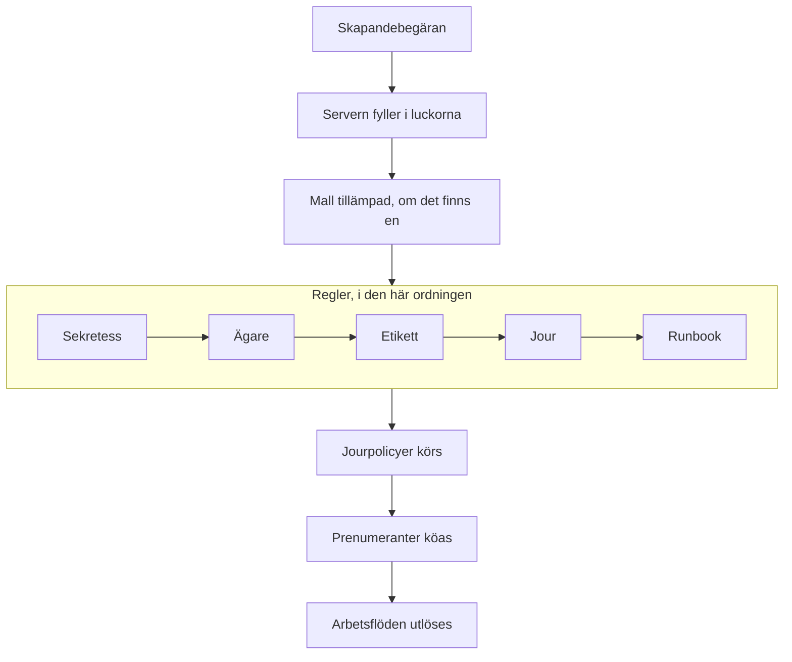

# Deklarera en incident

Att deklarera en incident skapar posten ditt team arbetar utifrån: den får ett nummer, en allvarlighetsgrad och ett starttillstånd, dess jourpolicyer larmar folk, och — om du inte säger något annat — statussidans prenumeranter får höra om den. Den här sidan går igenom de fem sätten att deklarera en, fält för fält, och vad som händer i samma ögonblick som den finns.

:::cards
- [Deklarera en för hand](#deklarera-en-för-hand): Formuläret i tre steg, fält för fält.
- [Deklarera från en mall](#deklarera-från-en-mall): Samma sorts incident, förifylld varje gång.
- [Deklarera från monitorkriterier](#deklarera-automatiskt-från-monitorkriterier): Låt en misslyckad kontroll öppna den åt dig.
- [Deklarera via API:t](#deklarera-via-apit): Från din egen kod, ett skript eller ett annat verktyg.
:::

## Fem sätt som en incident deklareras på

Det finns fem sätt som en incident kommer in i OneUptime på, och alla hamnar på samma ställe: en rad i tabellen `Incident` med en allvarlighetsgrad, ett aktuellt tillstånd och en lista över berörda resurser. Skillnaden är bara vem som fyller i fälten — du klockan tre på natten, en sparad mall, en monitors kriterier, din egen kod som anropar API:t, eller någon utanför ditt team som fyller i ett formulär.

| Om du vill …                                                 | Välj                                                                        |
| ------------------------------------------------------------ | --------------------------------------------------------------------------- |
| Öppna en incident för hand och fylla i allt                  | Guiden **Deklarera incident**                                               |
| Öppna en återkommande sorts incident med fälten förifyllda   | **Skapa från mall**                                                         |
| Öppna en automatiskt när en monitors kontroller misslyckas   | Ett kriteriefilter på en monitor med **När filter matchar, deklarera en incident.** |
| Öppna en från din egen kod, ett skript eller ett annat verktyg | `POST /api/incident`                                                      |
| Låta folk utanför ditt team rapportera ett problem via en länk | Ett [formulär](/docs/forms/index)                                         |

Alla fem skriver samma modell, så en incident som en sond öppnade ser exakt ut som en som en jourhavande öppnade för hand — bortsett från några administrativa kolumner som servern sätter på de automatiska. Integrationer skriver den också: [Huntress](/docs/integrations/huntress) öppnar en incident för varje incidentrapport som dess SOC skickar.

> [!TIP]
> Du kan också deklarera en incident från larm: **Deklarera incident** på en larmlista, i ett larms rubrik eller på ett larms sida **Länkade incidenter** öppnar samma guide, förifylld från larmen, och länkar dem till den nya incidenten. En kryssruta på formuläret, ikryssad som standard, bekräftar också larmen, så att de slutar eskalera. Se [Länkade larm](/docs/incidents/linked-alerts).

## Deklarera en för hand

Formuläret **Deklarera ny incident** frågar efter en incident i tre steg — **Incidentdetaljer**, **Berörda resurser** och **Jour och roller** — och visar sedan en sammanfattning att gå igenom. När ditt projekt frågar efter några av sina anpassade incidentfält vid skapandet kommer ett fjärde steg, **Detaljer**, direkt efter **Berörda resurser**.

:::steps
1. Öppna **Incidenter → Alla incidenter** och klicka på **Deklarera incident** längst upp till höger i listan **Incidenter**. Formuläret öppnas på **Incidentdetaljer**.
2. Ange en **Titel** och välj en **Incidentallvar**. Resten av formuläret är valfritt.
3. Klicka dig igenom de återstående stegen med **Nästa** och fyll i det du vet nu: monitorer och andra resurser, jourpolicyer, roller.
4. Läs sammanfattningen och klicka på **Deklarera incident**. Du hamnar på den nya incidenten, och dess **Incident Flöde** börjar registrera.
:::

Bara det första steget har obligatoriska fält, plus alla anpassade fält som dina administratörer har markerat som **Obligatoriskt vid skapande**, som steget **Detaljer** frågar efter. Varje steg före sammanfattningen har en vanlig **Nästa**, och **Deklarera incident** finns på sammanfattningen, det sista steget. Har du bråttom fyller du i **Incidentdetaljer** och trycker **Nästa** genom de andra stegen utan att fylla i dem: att lägga till resurser, lägga till jourpolicyer och tilldela roller kan också vänta till incidentens egna sidor. Trycker du på **Enter** i ett fält går det också vidare; det deklarerar aldrig före sammanfattningen.

> [!TIP]
> Alternativen som de flesta incidenter aldrig behöver väntar hopfällda under en rubrik **Fler fält** i slutet av sitt steg; klicka på den för att öppna dem. Medan den är hopfälld nämner rubriken vad som finns i den och visar varje alternativ som är satt, med dess värde — satt av en mall till exempel, eller av ett privat larm som du deklarerar från — och den öppnas av sig själv när något i den behöver rättas. Sammanfattningen nämner bara ett sådant alternativ när det är satt — utom **Meddela statussideprenumeranter**, som den alltid nämner, med vem som får besked.

**Från en resurs egen sida.** **Deklarera incident** på fliken **Incidenter** för en monitor, en värd, en tjänst, ett kluster eller de flesta andra resurser öppnar samma formulär med den resursen redan vald på **Berörda resurser**, så att en titel och en allvarlighetsgrad är allt som behövs, och incidenten visas på fliken du började från.

:::details Vilka resurssidor som erbjuder det, och vad de väljer
**Deklarera incident** på fliken **Incidenter** för en monitor, en värd, ett Kubernetes-, Proxmox-, Ceph- eller Docker Swarm-kluster, en Docker- eller Podman-värd, en vCenter, en lagringsmatris, en IoT-flotta, en databas eller en tjänst öppnar samma guide med den resursen redan vald på **Berörda resurser** (en monitor under **Monitorer**, allt annat under **Andra påverkade resurser**), före allt som en mall lägger till. **Skapa från mall** på den fliken behåller också resursen. Brödsmulorna leder tillbaka via resursens flik, och när incidenten är deklarerad hamnar du på den nya incidenten, som från listan över incidenter.

Fliken **Incidenter** för ett lagerobjekt väljer värden, tjänsten eller Kubernetes-klustret som objektet pekar på, och brödsmulorna leder tillbaka via den resursens flik. **Skapa varning** på fliken **Varningar** för en resurs fungerar på samma sätt: från en monitor fyller den i larmets **Övervakning**, från allt annat **Andra påverkade resurser**.

Resursen slås upp med dina egna behörigheter: kan du inte läsa den, eller har den tagits bort, öppnas formuläret helt enkelt utan att något är valt.
:::

### Steg 1 — Incidentdetaljer

- **Titel** — obligatoriskt. Sammanfattningen på en rad som alla ser i listan, i Slack och (om incidenten är synlig) på din statussida. Platshållare: `Incident Title`.
- **Incidentallvar** — obligatoriskt. En av de allvarlighetsgrader som är konfigurerade för ditt projekt; nya projekt får **Critical Incident**, **Major Incident** och **Minor Incident** i förväg.
- **Beskrivning** — valfritt, skrivet i Markdown. Det är det här fältet som visas på statussidan, så skriv det för kunderna och inte för ditt team. En bild som du lägger in i det visas för alla medan incidenten är synlig på statussidor, och bara för medlemmarna i ditt projekt medan den är dold. Du kan redigera det senare från **Beskrivning** i incidentens sidomeny.

Under **Fler fält**:

- **Deklarerad den** — börjar på det ögonblick du öppnade sidan. Det är tidpunkten som varje varaktighet på incidenten mäts från, så backdatera den om du registrerar något som började tidigare.
- **Inledande tillstånd** — valfritt och tomt till att börja med. Lämnar du det tomt börjar incidenten i tillståndet med flaggan `isCreatedState`, som nya projekt skapar som **Identified** — eller i mallens starttillstånd när du deklarerar från en mall. Välj bara ett senare tillstånd när du registrerar en incident som redan var förbi den punkten, bekräftad eller löst. En sådan incident larmar ingen — se [Deklarerad redan bekräftad eller löst](#deklarerad-redan-bekräftad-eller-löst).
- **Etiketter** — valfritt. Etiketter samlar relaterade incidenter så att du kan filtrera på dem, och ett team vars behörigheter är begränsade till etiketter ser bara incidenterna som har någon av dess etiketter.
- **Privat incident** — kryssruta, avstängd som standard (`isPrivate`). En privat incident är bara synlig för användarna som äger den, medlemmarna i teamen som äger den, projektadministratörer och projektägare — och den är dold för alla statussidor, oavsett andra inställningar, även statussidorna den är begränsad till. Listan över incidenter markerar dem med ett rött märke **Private**.

> [!NOTE]
> **Larm och episoder börjar också i tillståndet du väljer.** **Skapa varning**, och **Skapa episod** i listorna över incident- och larmepisoder, har samma **Inledande tillstånd** under **Fler fält**. Lämnar du det tomt börjar larmet eller episoden i projektets skapandetillstånd. Välj ett senare tillstånd för att registrera ett som redan var bekräftat eller löst: det börjar i det tillståndet, dess tillståndstidslinje börjar med det, och en episod som registreras som löst räknas som löst direkt. Dess ägare meddelas inte om det första tillståndet för sig, och prenumeranterna på en incidentepisods statussida får höra om den en gång, när episoden skapas. Ett larm eller en episod som registreras så larmar ingen, precis som en incident: se [Deklarerad redan bekräftad eller löst](#deklarerad-redan-bekräftad-eller-löst). Via API:t är samma val `currentAlertStateId` eller `currentIncidentStateId` — se [OneUptime API-referens](/docs/api-reference/api-reference).

:::details Skriva i Markdown-redigeraren
Beskrivningen — liksom anteckningar, rotorsak, åtgärd och anpassade fält med formaterad text — skrivs i Markdown-redigeraren. Den öppnas i visuellt läge, som visar texten formaterad; **Markdown** i verktygsfältet växlar till Markdown-läge, som visar Markdown-källan, och **Visual** växlar tillbaka. I en lista flyttar **Öka indrag** och **Minska indrag** i verktygsfältet, eller Tab och Shift+Tab, en punkt in under punkten ovanför och ut igen; där det inte finns något att flytta in under, och utanför en lista, går Tab som vanligt vidare till nästa fält. I visuellt läge delar **Kodblock**, **Tabell** och **Uppgiftslista** mitt på eller i slutet av en rad raden vid markören och lägger det nya blocket på egna rader — även vid kanten av ett fetstilt ord, en länk eller inline-kod, utan att lämna tom formatering efter sig — och **Uppgiftslista** i en listpunkt lägger till uppgiften i den punktens lista i stället för som en deluppgift. I Markdown-läge infogas **Kodblock** och **Tabell** vid markören, så börja en ny rad för dem först, **Uppgiftslista** gör markörens rad till en uppgift, och **Numrerad lista** numrerar varje nivå i en kapslad lista från 1. Verktygsfältet håller sig på en rad: formulär med redigeraren öppnas i en bred dialog, så på de flesta skärmar får alla knappar plats, och där de inte gör det — på en telefon eller i ett smalt fönster — finns knapparna som inte får plats under **Mer formatering** (**⋯**) i slutet av verktygsfältet, i samma ordning, och varje knapp du väljer där infogas där markören stod. På de smalaste skärmarna flyttar även reglaget **Markdown** in där.

**Ångra.** I visuellt läge ångrar Ctrl+Z (Cmd+Z på en Mac) dina ändringar en i taget, den senaste först — det du skrev och redigerarens egna redigeringar: ett ökat eller minskat indrag, ett block som den infogade i en rad, en formaterad eller blockvis inklistring — och Ctrl+Shift+Z (Cmd+Shift+Z) eller Ctrl+Y gör om dem i samma ordning. I Markdown-läge ångrar Ctrl+Z ett indrag, en listknapps ändring och en formaterad inklistring, men inte det som knapparna **Kodblock**, **Tabell** och **Vågrät linje** infogar.

**Klistra in i den.** Inklistring från Word, Google Docs eller en OneUptime-sida — en annan incidents beskrivning till exempel — behåller listorna och deras kapsling, länkarna och formateringen, och inklistrade `•`-punkter blir en riktig lista. Länkar som bara är en ikon, som ankaret bredvid en rubrik på GitHub, utelämnas. I visuellt läge blir kod eller ett citat som klistras in i en rad ett eget block som delar raden, och en lista som klistras in i en listpunkt ansluter sig till den punktens lista i stället för att kapslas inuti den — inklistrad i den tomma punkten som Enter lämnar efter sig tar den den punktens plats — medan ett kodblock, ett citat eller en tabell som klistras in i en punkt stannar kvar i den. I Markdown-läge hamnar det som inklistringen gör till block — kod, ett citat, en lista, en rubrik, flera stycken — på egna rader, med en tom rad på var sida, när det landar mitt på en rad, och en lista som klistras in i slutet av en listpunkts rad, eller efter ett ensamt `- `, ansluter sig till den listan på punktens indrag; Markdown som du kopierade som oformaterad text infogas vid markören exakt som den är. Det du klistrar in i ett kodblock förblir exakt som du kopierade det. Inklistring över en markering som sträcker sig över flera punkter, stycken eller tabellceller ersätter den, som skrivning skulle göra. I visuellt läge behåller en inklistring eller knappen **Kod** över tabellceller varje cell och kolumn, en inklistring lämnar inget efter sig som en tom punkt, ett tomt citat eller ett tomt kodblock, och när markeringen slutar inuti ett kodblock är det bara resten av den kodraden som ansluter sig till texten.

**Kopiera ut ur en anteckning.** Ett kodblock som kopieras från en anteckning eller en beskrivning klistras in igen som ett kodblock i sitt språk, och det gör även en rad ur det som kopieras med sin radbrytning, som en trippelklickning kopierar den i Chrome, Edge och Safari. Ett ord eller en del av en rad som kopieras ut ur ett kodblock klistras in som inline-kod. I Chrome, Edge och Safari klistras rader som kopieras från en kodvy som ritas som en tabell — YAML-fliken för en Kubernetes-resurs, ramarna i ett undantags stackspårning — in som oformaterad text, med indraget bevarat.
:::

### Steg 2 — Berörda resurser

Monitorerna kommer först, för sig, eftersom statussidor ser en incident genom dess monitorer, och statusen som monitorerna byter till står direkt under dem.

- **Monitorer** — en sökruta som lägger till monitorerna som incidenten påverkar; fliken **Etiketter** lägger till alla monitorer med en etikett på en gång. En statussida visar en incident, och meddelar sina prenumeranter om den, när den visar någon av incidentens monitorer, så det är dessa som avgör vilka statussidor som får höra om den (`monitors` på incidenten).
- **Ändra övervakningsstatus till** — valfritt, och visas bara när minst en monitor är vald. Väljer en monitorstatus som tillämpas på varje monitor som är kopplad till den här incidenten, så att det att deklarera incidenten och markera monitorerna som försämrade är en åtgärd i stället för två. Deklarerar du från en mall som sätter en, börjar fältet med mallens status, som visas så snart du väljer en monitor. Utan vald monitor sparas ingen status, inte heller mallens; tar du bort den sista monitorn försvinner fältet tills du väljer en annan, vilket tar tillbaka ditt val. En monitors status delas av alla statussidor som visar den, så med statussidor valda under **Fler fält** påminner formuläret dig om att ändringen också syns på sidorna du inte valde.
- **Andra påverkade resurser** — en andra sökruta för allt annat som incidenten påverkar: värdar, Kubernetes-kluster, Docker- och Podman-värdar, Proxmox-, Ceph- och Docker Swarm-kluster, vCenters, lagringsmatriser, IoT-flottor, databaser och tjänster — allt utöver monitorer som incidentens eget kort **Berörda resurser** erbjuder. Under huven är det separata relationer på incidenten (`hosts`, `kubernetesClusters`, `dockerHosts`, `podmanHosts`, `services` och fler), men formuläret slår ihop dem till en väljare.

En monitor kan säga vad den övervakar — **Övervakning → Översikt → Länkade resurser**, samma sorters resurser som **Andra påverkade resurser**. Välj en sådan monitor, så läggs det den är länkad till direkt till i **Andra påverkade resurser**, och en rad under fältet nämner vad som lades till. Ta bort det du inte vill ha innan du deklarerar: inget läggs till igen för den monitorn medan du stannar på formuläret, och tar du bort monitorn blir det den lade till kvar. Samma sak händer när en monitor kommer från en mall eller från sidan du deklarerade från, och på **Skapa varning** och **Schedule Maintenance**.

Incidentens kort **Berörda resurser** frågar på samma sätt när du redigerar det senare: **Monitorer**, **Ändra övervakningsstatus till** så snart det finns en monitor, och sedan **Andra påverkade resurser**. Sparas en incident utan monitor behåller den statusen den hade.

Under **Fler fält**:

- **Begränsa till dessa statussidor** — valfritt. Lämnar du det tomt visas incidenten på, och meddelar prenumeranterna på, varje statussida som visar dess monitorer. Välj sidor här, så används bara de valda sidorna bland dem; fliken **Etiketter** lägger till alla sidor med en etikett på en gång. Formuläret varnar dig när en vald sida inte visar någon av incidentens monitorer, och när incidenten är privat, vilket döljer den för alla statussidor. Se [En statussida per målgrupp](/docs/status-pages/one-status-page-per-audience).
- **Meddela statussideprenumeranter** — kryssruta, påslagen som standard. Styr om prenumeranterna meddelas om att incidenten har skapats (`shouldStatusPageSubscribersBeNotifiedOnIncidentCreated`). Att fälla ihop den under **Fler fält** ändrar inget i vad den gör: den börjar fortfarande ikryssad, och sammanfattningen nämner den alltid. Under den, och igen på sammanfattningen innan du skickar, visar **Will notify** statussidorna som får besked, med ett "upp till"-antal prenumeranter per kanal, och sidorna som inte får besked och varför. Får ingen besked (ingen monitor är kopplad, ingen statussida visar monitorerna, eller sidorna har inga prenumeranter än), visar den ingenting, och den varnar bara när incidentens statussideomfång är orsaken. På sammanfattningen visar **Förhandsgranskning**, bredvid **Ja**, e-postmeddelandet som prenumeranterna på var och en av de statussidorna får, och **Skicka test till mig** skickar det till ditt eget kontos e-postadress; se [Prenumeranter och meddelanden](/docs/status-pages/subscribers#incidenter). Stäng av den för internt brus som du ändå vill ha registrerat. Incidenten förblir då tyst som standard: nya offentliga anteckningar på den, och dialogen för tillståndsändringar på dess översiktssida (**Bekräfta**, **Lös** eller val av ett annat tillstånd), börjar med sin egen kryssruta **Meddela statussideprenumeranter** avstängd. Det manuella formuläret på sidan **Tillståndstidslinje** och massåtgärden **Ändra tillstånd** i listan över incidenter börjar fortfarande med den påslagen.

> [!IMPORTANT]
> **Koppla monitorer, även när det känns överflödigt.** Kopplingen mellan en incident och en statussida går genom incidentens monitorer: en statussida visar en incident, och meddelar sina prenumeranter om den, när en av dess resurser är en av incidentens monitorer. **Begränsa till dessa statussidor** kan bara snäva in den listan, aldrig utöka den, och en statussida med **Visa bara incidenter som är begränsade till den här sidan** påslaget visar bara incidenterna som är begränsade till den. En incident utan monitorer meddelar ingen prenumerant på någon statussida alls. Se [Statussidans resurser och grupper](/docs/status-pages/resources-and-groups).

Flaggan **Should be visible on status page?** (`isVisibleOnStatusPage`) finns inte i guiden; den är sann som standard. Ändra den i efterhand från **Inställningar** i incidentens sidomeny, där den heter **Synlig på statussidan**.

**Deklarera dold och publicera senare.** En incident som är dold för statussidor när den skapas meddelar ingen prenumerant, och dess aviseringsstatus lyder **Hoppades över: dold på statussidor**. När du senare slår på **Synlig på statussidan** erbjuder redigeringsformuläret **Meddela prenumeranter att denna incident har skapats**, så att rutinen att deklarera dold, ta reda på vilka som påverkas och sedan publicera fortfarande meddelar dem. Den börjar ikryssad medan incidenten inte är löst och avkryssad när den är löst, så att det att publicera en gammal incident för ordningens skull inte tillkännager den som ny. Den erbjuds bara när incidenten deklarerades med **Meddela statussideprenumeranter** påslaget och inte är privat — alltså inte för en incident som rapporterats via ett [formulär](/docs/forms/on-submit), som deklareras dold och med den avstängd. Via API:t skickar du `"miscDataProps": {"notifySubscribersOfIncidentCreatedOnPublish": true}` med uppdateringen som sätter `isVisibleOnStatusPage` till `true`, eller sätter själv tillbaka `subscriberNotificationStatusOnIncidentCreated` till `Pending`. En efteranalys som publicerades medan incidenten var dold behöver ingen kryssruta: att slå på **Synlig på statussidan** skickar den en gång, som beskrivs i [Prenumeranter och meddelanden](/docs/status-pages/subscribers#incidenter).

### Detaljer — dina anpassade incidentfält

Det här steget visas bara när minst ett anpassat incidentfält har **Visa vid skapande** påslaget under **Incidenter → Inställningar → Anpassade fält** — eller, när du deklarerar från en mall, när mallens **Anpassade fält vid skapande** frågar efter ett. Det frågar efter de fälten, i deras **Ordning** — ordningen de har dragits i på den inställningssidan — med den inmatning som deras typ kräver: en rullgardinsmeny, ett tal, ett datum, ett ja/nej-reglage, lång text eller formaterad text i Markdown-redigeraren. Det utelämnas också för någon som inte kan läsa projektets anpassade incidentfält: på OneUptime Cloud kräver det abonnemanget **Growth** eller högre och en roll som kan visa anpassade incidentfält.

- Ett fält som är markerat som **Obligatoriskt vid skapande** måste fyllas i innan du kan deklarera. Ett obligatoriskt ja/nej-fält — en bekräftelse till exempel — måste vara påslaget.
- En 0 eller ett reglage som är avstängt är ett svar och sparas som ett.
- Ett fält vars värde kopieras från ett anpassat monitorfält frågas det inte efter när incidenten har en monitor, eftersom värdet kopieras från monitorn när incidenten skapas.
- Att deklarera från en mall börjar steget med mallens värden, och mallens värden för fält som steget inte frågar efter behålls som de är. Ett värde som du rensar i steget förblir rensat. Ett mallvärde som inte längre passar sitt fält — ett alternativ i en rullgardinsmeny som har tagits bort sedan dess — utelämnas i stället för att avvisa incidenten.
- Att deklarera från en mall följer också mallens **Anpassade fält vid skapande**. Ett fält som den markerar som **Obligatoriskt** eller **Valfritt** frågas det efter även när projektet inte visar det vid skapande; ett fält som den markerar som **Dold** frågas det inte efter — mallens värde för det gäller fortfarande — och ett fält som står på **Standard** följer sina egna **Visa vid skapande** och **Obligatoriskt vid skapande**. Se [Anpassade fält vid skapande](/docs/incidents/settings#anpassade-fält-vid-skapande).

**Obligatoriskt vid skapande** kontrolleras bara av instrumentpanelen, och detsamma gäller en malls **Anpassade fält vid skapande**. Incidenter som skapas av monitorer, API:t, Slack, Microsoft Teams eller AI kan lämna ett fält tomt, och varje fält förblir valfritt på incidentens sida **Anpassade fält** efteråt, så att det att rätta ett värde mitt under ett avbrott aldrig kräver alla de andra. Se [Anpassade fält](/docs/incidents/settings#anpassade-fält) för fälttyperna och inställningarna.

### Steg 3 — Jour och roller

- **Jourpolicy** — ett flerval av jourpolicyerna som ska köras när den här incidenten skapas. Det motsvarar `onCallDutyPolicies` på incidenten.
- **Tilldela incidentroller** — vem som tar varje roll som ditt projekt definierar, ett kort per roll. En roll med märket **Primär** som du lämnar tom är din: du tar den när incidenten deklareras, och sammanfattningen säger det. En roll för en person säger det när den har en; en roll för flera behåller sin väljare.

Det här är det enda stället där en jourpolicy kopplas direkt till en incident. Allvarlighetsgrader har ingen jourpolicy — allvarlighetsgraden är en etikett, och den påverkar bara larmningen som *matchningskriterium* i en jourregel. Regler som är konfigurerade under **Incidenter → Regler → Jourregler** lägger till sina policyer ovanpå det du väljer här; den slutliga uppsättningen som körs är unionen av båda, utan dubbletter. En incident som deklareras i ett senare tillstånd kör ingen av dem — se [Deklarerad redan bekräftad eller löst](#deklarerad-redan-bekräftad-eller-löst).

Själva rollerna konfigureras under **Incidenter → Inställningar → Incidentroller**. Ett nytt projekt har en, Incidentansvarig; lägg där till Responder, Communications Lead eller vad din process annars behöver. Väljer du ingen som Incidentansvarig blir du det när incidenten deklareras.

## Deklarera från en mall

Fortsätter du att deklarera samma sorts incident — samma titelmönster, samma allvarlighetsgrad, samma jourpolicy — sparar du den en gång som en mall och deklarerar sedan från den:

:::steps
1. Klicka på **Skapa från mall** i listan **Incidenter** (den konturritade knappen bredvid **Deklarera incident**). En dialog **Skapa incident från mall** öppnas, med en rullgardinsmeny **Välj incidentmall**.
2. Välj en mall. Skapandeformuläret öppnas förifyllt.
3. Ändra det som är annorlunda den här gången, gå sedan igenom stegen och deklarera som vanligt.
:::

Har ditt projekt inga mallar än får du i stället en dialog **No Incident Templates**, med en knapp **Create Template** som tar dig till **Incidenter → Inställningar → Incidentmallar**.

Mallar byggs med en egen guide i fyra steg — **Mallinformation**, **Incidentdetaljer**, **Berörda resurser**, **Jour** — plus stegen **Anpassade fält** och **Anpassade fält vid skapande** efter **Berörda resurser** när ditt projekt har anpassade incidentfält. Mallens **Inledande incidenttillstånd**, **Ägare** och **Etiketter** finns under **Fler fält** i slutet av **Incidentdetaljer**. **Berörda resurser** frågar som deklarationsformuläret gör — **Monitorer**, sedan **Ändra övervakningsstatus till**, sedan **Andra påverkade resurser**, med **Begränsa till dessa statussidor** under **Fler fält** — förutom att en mall alltid frågar efter monitorstatusen: den gäller också monitorerna som väljs när en incident deklareras från mallen. Det här är fälten:

| Fält                            | Syfte                                                  |
| ------------------------------- | ------------------------------------------------------ |
| **Mallnamn**                    | Hur mallen känns igen i väljaren.                      |
| **Mallbeskrivning**             | En anteckning till ditt framtida jag om när den ska användas. |
| **Titel**                       | Titeln som förifylls på incidenten.                    |
| **Beskrivning**                 | Markdown-beskrivningen som förifylls på incidenten.    |
| **Incidentallvar**              | Allvarlighetsgraden som förifylls på incidenten.       |
| **Inledande incidenttillstånd** | Tillståndet som incidenter från den här mallen börjar i. Tomt betyder det vanliga starttillståndet. En incident som börjar bekräftad eller löst larmar ingen. |
| **Monitorer**                   | Monitorerna som ska kopplas.                           |
| **Ändra övervakningsstatus till** | Monitorstatusen som tillämpas på incidentens monitorer, även de som väljs när den deklareras. |
| **Andra påverkade resurser**    | Värdarna, klustren och tjänsterna som ska kopplas.     |
| **Begränsa till dessa statussidor** | Statussidorna som incidenten begränsas till.       |
| **Jourpolicy**                  | Policyerna som körs när incidenten skapas.             |
| **Ägare**                       | Personer och team som äger incidenter som skapas från den här mallen, valda från en lista. |
| **Etiketter**                   | Etiketterna som sätts på incidenten.                   |
| **Anpassade fält**              | Värden för incidentens anpassade fält.                 |
| **Anpassade fält vid skapande** | Vilka anpassade fält steget **Detaljer** frågar efter, och vilka som måste fyllas i. |

Några snabba regler:

- Mallar kan inte redigeras från listan över mallar — du skapar en och öppnar den sedan för att ändra den.
- En mall fyller bara i ett fält som du lämnade tomt. På skapandesidan tillämpas mallen som en förifyllning som du kan skriva över; på servern — för ett formulär som deklarerar från en mall — fylls ett fält bara från mallen när begäran lämnade fältet `undefined`. Det som anroparen angav vinner alltid.
- Steget **Detaljer** följer mallens **Anpassade fält vid skapande**, som [beskrivs ovan](#detaljer-dina-anpassade-incidentfält).
- Värden i anpassade fält slås ihop ett fält i taget. En malls värden fyller i de anpassade fälten som incidenten deklareras utan; ett värde som sätts i steget **Detaljer**, eller skickas i begärans `customFields`, vinner alltid — `0`, `false` och `null` inräknade. Ett fält som kopieras från ett anpassat monitorfält får fortfarande monitorns värde.
- En befintlig malls värden i anpassade fält finns på dess kort **Anpassade fält**, bredvid dess andra kort.
- Mallens **Ägare** läggs till när incidentens Slack- och Microsoft Teams-kanaler finns, så att en aviseringsregel som bjuder in incidentens ägare till en ny kanal också bjuder in dem. Att deklarera från en mall i instrumentpanelen lägger till dem utan aviseringen "du har lagts till"; ett [formulär](/docs/forms/on-submit) med en mall meddelar dem och håller tillbaka incidentens avisering **Incident skapad** tills de har lagts till, så att den går till dem och inte till projektets ägare.

## Deklarera automatiskt från monitorkriterier

De flesta incidenter borde inte behöva skrivas in av en människa. En monitors kriterier kan deklarera en i samma ögonblick som ett filter matchar:

:::steps
1. Öppna monitorn, välj **Kriterier** i dess sidomeny och klicka på **Edit Monitoring Criteria**. (En ny monitor frågar efter samma kriterier medan du skapar den.)
2. Slå på **När filter matchar, deklarera en incident.** i kriteriefiltret som ska deklarera. Ett avsnitt **Skapa incident** visas med en knapp **Lägg till incident** — ett kriteriefilter kan deklarera mer än en incident.
3. Fyll i incidentens fält (se nedan) och spara. Nästa gång filtret matchar deklareras incidenten och larmar sina jourpolicyer.
:::

Varje incidentpost har:

- **Incidenttitel** — stöder mallar; platshållaren föreslår något i stil med `{{monitorName}} is down`.
- **Allvarlighetsgrad** — obligatoriskt.
- **Incidentbeskrivning** — också med mallar.
- **Jour → Jourpolicyer** — policyerna som körs när den här incidenten skapas.
- **Incidentroller** — vem som tar varje roll på incidenten, vald på samma kort som **Tilldela incidentroller** på deklarationsformuläret, ett per roll. Visas när ditt projekt har incidentroller.
- **Ägarskap och etiketter → Ägare** (personer och team, valda från en lista), **Etiketter**.
- **Fler fält → Lös incident automatiskt** (löser incidenten automatiskt när kriterierna slutar matcha), **Visa incident på statussida**, **Privat incident** och **Åtgärdsanteckningar**.

För den fullständiga listan över `{{variable}}`-platshållare som du kan använda i titeln, beskrivningen och åtgärdsanteckningarna, se [Incident- och varningsmallar](/docs/monitor/incident-alert-templating).

Incidenter som skapas på det här sättet märks av servern: `isCreatedAutomatically` sätts, `createdCriteriaId` registrerar vilket kriteriefilter som utlöstes, och `createdByProbe` registrerar vilken sond som såg det. Allt annat med dem beter sig exakt som en incident som deklarerats för hand.

En incident som en monitor deklarerar länkas till det som monitorn övervakar: allt som dess konfiguration nämner (värden för en värdmonitor, klustret för en Kubernetes-monitor, tjänsterna för en loggmonitor) och allt under dess **Länkade resurser**. En webbplats- eller API-monitors konfiguration nämner ingen infrastruktur, så länka den till klustret, värdarna eller databasen bakom webbplatsen: dess incidenter hamnar då på de resursernas sidor, OneUptime AI kan utreda dem där, och klustrets eller resursens AI-åtgärd kan agera på dem (se [AI SRE](/docs/ai/ai-sre#which-incidents-a-clusters-fixes-act-on)). Larm som en monitor skapar länkas på samma sätt.

## Deklarera via API:t

Incidentmodellen exponerar en standard-CRUD-slutpunkt, så `POST /api/incident` skapar en. Autentisera med en API-nyckel som skapats under **Projektinställningar → Avancerad → API-nycklar**, skickad i headern `apikey` — nyckeln identifierar projektet, så du behöver inte ange ett projekt-ID separat.

```bash
curl -X POST https://oneuptime.com/api/incident \
  -H "apikey: $ONEUPTIME_API_KEY" \
  -H "Content-Type: application/json" \
  -d '{
    "data": {
      "title": "Checkout latency above SLO",
      "description": "Investigating elevated p99 latency on the checkout service.",
      "incidentSeverityId": "<incident-severity-id>"
    }
  }'
```

Användbara fält i begärans body:

| Fält                     | Obligatoriskt | Anmärkningar                                                                                                                                                                                                                                |
| ------------------------ | ------------- | ------------------------------------------------------------------------------------------------------------------------------------------------------------------------------------------------------------------------------------------- |
| `title`                  | Ja            | Incidentens titel.                                                                                                                                                                                                                          |
| `incidentSeverityId`     | Ja            | En av projektets allvarlighetsgrader. Servern kontrollerar att den hör till samma projekt som API-nyckeln och avvisar begäran om den inte gör det.                                                                                         |
| `declaredAt`             | Nej           | Valfritt här, även om formuläret kräver det. Utelämnar du det använder servern aktuell tid.                                                                                                                                                 |
| `currentIncidentStateId` | Nej           | Tillståndet att börja i; utelämnat skapandetillståndet. Kontrolleras mot API-nyckelns projekt, som allvarlighetsgraden. Samma kontroll gäller monitorstatusen bakom **Ändra övervakningsstatus till**.                                      |
| `statusPages`            | Nej           | ID:na för statussidorna som incidenten begränsas till, alla från samma projekt. Utelämna det för att nå varje statussida som visar incidentens monitorer. `isScopedToStatusPages` härleds från det, och ett värde som du skickar för det ignoreras. Se [En statussida per målgrupp](/docs/status-pages/one-status-page-per-audience). |
| `customFields`           | Nej           | Incidentens värden i anpassade fält med varje fälts namn som nyckel. Varje värde som du skickar måste passa sitt fält — ett tal för ett fält **Tal**, ett av alternativen för en **Rullgardinsmeny (enkelval)** — annars avvisas begäran med ett fel `400` som nämner fältet. **Obligatoriskt vid skapande** kontrolleras inte här. Se [Värden i anpassade fält via API:t](/docs/incidents/settings#värden-i-anpassade-fält-via-apit). |

En API-nyckel kan inte deklarera från en mall: en begäran som skickar `createdIncidentTemplateId` avvisas. OneUptime sätter själv den kolumnen, för incidenter som rapporteras via ett [formulär](/docs/forms/on-submit) och för ett arbetsflödes steg **Create One Incident**, som deklarerar från mallen som är vald under dess inställning **Incident Template** (se [Arbetsflödeskomponenter](/docs/workflows/components)). För att deklarera från en mall via API:t läser du mallen från `/api/incident-templates` och skickar dess värden i begäran.

Relaterade slutpunkter är `/api/incident-state`, `/api/incident-severity` och `/api/incident-state-timeline`. Den genererade [API-referensen](/reference) har den exakta formen på begäran och svar för var och en, även hur relationsfält som monitorer uttrycks.

## Rapportera via ett formulär

Den femte vägen in är för folk utanför ditt team. Ett formulär är en sida som du delar som en länk: alla som har den kan rapportera ett problem utan ett OneUptime-konto, och varje inskick deklarerar en incident. Du bestämmer vad formuläret frågar efter — en titel, en beskrivning, en allvarlighetsgrad, monitorer, anpassade fält, egna frågor — och hur svaren blir incidenten: en standardallvarlighetsgrad, en incidentmall att deklarera från, och monitorer, etiketter, jourpolicyer och ägare som alltid läggs till.

Incidenter som rapporteras på det här sättet deklareras dolda för statussidor, med **Meddela statussideprenumeranter** avstängt, så att en jourhavande bedömer dem innan något blir offentligt, och en privat anteckning registrerar vem som rapporterade dem. Formulär är en egen produkt, under **Formulär** i menyn **Produkter**, och kan också schemalägga underhållshändelser; se [Formulär](/docs/forms/index).

## Incidentnummer och prefix

Varje incident får ett löpnummer från en räknare per projekt, som servern tilldelar vid skapandet. Två kolumner innehåller det: `incidentNumber` (det råa heltalet) och `incidentNumberWithPrefix` (det du faktiskt ser). Utan konfigurerat prefix är det visade värdet `#42`.

:::steps
1. Gå till **Incidenter → Inställningar → Nummerprefix** och klicka på **Uppdatera**.
2. Skriv prefixet i **Prefix för incidentnummer**. Fältet förhandsgranskar numret medan du skriver: `INC-` gör det till `INC-42`. Lämna det tomt för att behålla standarden `#`.
3. Klicka på **Spara ändringar**. Incidenter som deklareras från och med nu får det nya prefixet; befintliga incidenter behåller sina nummer.
:::

Samma dialog har **Nummerprefix för incidentepisoder** för numreringen av episoder. [Nummerprefix](/docs/incidents/settings#nummerprefix) nämner reglerna som ett prefix följer.

Numret visas som den första kolumnen i listan över incidenter, länkar till incidenten och visas som **Incidentnummer** på incidentens **Översikt**.

## Vad som händer i samma ögonblick som en incident deklareras

Skapandeanropet gör mer än att skriva en rad:



I ordning:

1. **Servern fyller i luckorna.** `declaredAt` är som standard nu, det aktuella tillståndet är som standard projektets tillstånd med `isCreatedState`, och incidentnumret och numret med prefix tilldelas från projektets räknare.
2. **En mall tillämpas**, när ett formulär eller ett arbetsflödes steg **Create One Incident** deklarerar incidenten från en (`createdIncidentTemplateId`) — och fyller bara i fält som anroparen lämnade undefined; ett tillstånd som anroparen nämner vinner över mallens. Instrumentpanelen tillämpar i stället en mall i formuläret, innan begäran skickas.
3. **Sekretessregler körs** och gör incidenten privat när en matchande regel säger det. Det är den första regelmotorn som körs, så allt efter den ser rätt sekretessinställning.
4. **Ägarregler körs** och lägger till användarna och teamen som matchande regler nämner som ägare.
5. **Etikettregler körs** och lägger till etiketterna som passar incidenten.
6. **Jourregler körs.** Varje aktiverad regel under **Incidenter → Regler → Jourregler** vars kriterier matchar lägger till sina policyer på incidenten. Det finns ingen prioritetsordning och ingen kortslutning — alla matchande regler utlöses, och policyerna rensas från dubbletter.
7. **Runbook-regler körs** och kopplar och startar matchande runbooks. Se [Runbooks](/docs/runbooks/index).
8. **Jourpolicyer körs.** Varje policy på incidenten — vald i guiden, ärvd från en mall eller tillagd av en regel — körs parallellt med händelsetypen `IncidentCreated`. Om en policy misslyckas stoppar det inte de andra. En arkiverad policy larmar ingen: dess körningslogg på incidenten säger att den inte kördes eftersom policyn är arkiverad. En incident som deklareras redan bekräftad eller löst kör ingen av dem; se [Deklarerad redan bekräftad eller löst](#deklarerad-redan-bekräftad-eller-löst) nedan.
9. **Prenumeranter köas**, om **Meddela statussideprenumeranter** lämnades påslaget och incidenten är synlig på statussidan. Leveransen sköts av ett bakgrundsjobb, inte inom din begäran, och går till statussidorna som incidenten når: de som visar dess monitorer, inskränkt av **Begränsa till dessa statussidor**, och utan sidorna som bara visar incidenter som är begränsade till dem, när den inte är begränsad. En arkiverad statussida skickar ingenting. Förloppet visas som **Prenumerantaviseringsstatus** på incidentens **Översikt**: vad som skickades och vad som misslyckades på varje statussida, och **Försök igen** eller **Skicka igen** när det är avslutat. Se [Prenumeranter och meddelanden](/docs/status-pages/subscribers).
10. **Arbetsflöden utlöses.** Utlösaren **On Create Incident** startar varje arbetsflöde som är byggt på den. Se [Översikt över arbetsflöden](/docs/workflows/index).

Därifrån är incidenten live: den räknas in i märket **Aktiva incidenter** i sidomenyn för Incidenter (varje tillstånd ovanför ditt lösta tillstånd räknas som aktivt), den visas på statussidorna som visar någon av dess monitorer (bara de valda, om du begränsade den), och dess **Tillståndstidslinje** börjar registrera.

### Deklarerad redan bekräftad eller löst

Att välja ett senare **Inledande tillstånd** — på formuläret, via en malls **Inledande incidenttillstånd** eller med `currentIncidentStateId` från API:t, Terraform eller ett arbetsflöde — registrerar en incident som någon redan hanterar, eller som redan är över. Den behandlas inte som en ny nödsituation:

```mermaid title="Vad en ny incident sätter igång, efter tillståndet den börjar i"
flowchart TB
    start{"Starttillstånd"} -->|"Skapandetillståndet, standarden"| live["Behandlas som ny: larmar jouren"]
    start -->|"Vid eller efter bekräftad"| acked["Registrerad: larmar ingen"]
    start -->|"Vid eller efter löst"| over["Registrerad som över"]
    over --> quiet["Ingen gruppering, runbooks, AI, kanal eller SLA"]
```

- **Vid eller efter ditt bekräftade tillstånd** — **Bekräftad**, eller varje tillstånd som står under det i **Incidenter → Inställningar → Incidentstatus** — körs ingen jourpolicy, så ingen larmas. Incidenten nämner fortfarande sina policyer, de du valde och de som jourregler lägger till, och dess flöde säger varför på en rad: _No one was paged. This incident was created already acknowledged, so its on-call policy **Primary** was not run._ Dess SLA, om en regel ger den en, börjar redan som besvarad. Allt annat nedan körs som för varje ny incident.
- **Vid eller efter ditt lösta tillstånd** — **Löst**, eller varje tillstånd som står under det — är incidenten över, så dessutom körs inget som reagerar på en pågående incident:
  - den grupperas inte i en episod, som skulle kunna larma igen;
  - ingen runbook-regel och ingen regel för automatisk åtgärd agerar på den;
  - OneUptime AI utreder den inte — dess kort **AI Investigation** säger att den skapades redan löst, och **Ask OneUptime AI** under det besvarar fortfarande frågor om den;
  - ingen Slack- eller Microsoft Teams-kanal skapas för den;
  - dess monitorer behåller sin status och fortsätter att övervakas, vad **Ändra övervakningsstatus till** än säger;
  - ingen SLA startas för den.
- **Vad som fortfarande händer:** sekretess-, ägar-, etikett- och jourregler körs, dess ägare läggs till och meddelas att den har skapats, posten **Incident skapad** skrivs i dess flöde och publiceras i Slack- och Microsoft Teams-kanalerna som dina regler nämner, och statussidans prenumeranter meddelas när **Meddela statussideprenumeranter** är påslaget och incidenten visas på deras statussida. En incident som redan är över är fortfarande en nyhet för dem.

Larm, larmepisoder och incidentepisoder följer samma regel: en som skapas redan bekräftad larmar ingen, och en som skapas löst grupperas inte heller, åtgärdas inte och utreds inte av AI, och får ingen egen kanal. En incident eller ett larm i skapandetillståndet — standarden, och varje sådan som en monitor öppnar — sätter igång allt som tidigare.

## Felsökning

:::details Deklarationen misslyckas och ber om ett skapandetillstånd för incidenter
Har ditt projekt inget tillstånd med flaggan `isCreatedState` misslyckas skapandeanropet och ber dig lägga till ett skapandetillstånd för incidenter från inställningarna. Det händer normalt bara i ett projekt vars tillstånd har redigerats kraftigt — se [Incidentstatusar och allvarlighetsgrader](/docs/incidents/states-and-severities).
:::

:::details Incidenten deklarerades, men ingen prenumerant på statussidan fick höra om den
Kontrollera i den här ordningen: **Meddela statussideprenumeranter** var påslaget; incidenten har minst en monitor kopplad, och en statussida visar den monitorn; incidenten är synlig på statussidor och inte privat; och sidan utesluts inte av **Begränsa till dessa statussidor**. **Prenumerantaviseringsstatus** på incidentens **Översikt** säger vilken av dem som stoppade den.
:::

:::details Steget Detaljer med våra anpassade fält visas inte
Steget visas bara när ett fält har **Visa vid skapande** påslaget, eller en malls **Anpassade fält vid skapande** frågar efter ett, och bara för någon som kan läsa projektets anpassade incidentfält — på OneUptime Cloud kräver det abonnemanget **Growth** eller högre.
:::

## Vad du kan läsa härnäst

:::cards
- [Incidentstatusar och allvarlighetsgrader](/docs/incidents/states-and-severities): Vad tillståndsflaggorna gör och hur du lägger till egna.
- [Incidentanteckningar, ägare och flöde](/docs/incidents/notes-owners-and-feed): Offentliga anteckningar, privata anteckningar, ägare och aktivitetsflödet.
- [Incidentinställningar och automatisering](/docs/incidents/settings): Mallar, anpassade fält, roller, regler och utlösare för arbetsflöden.
- [Prenumeranter och meddelanden](/docs/status-pages/subscribers): Vem som får höra om incidenten som du just deklarerade.
:::
