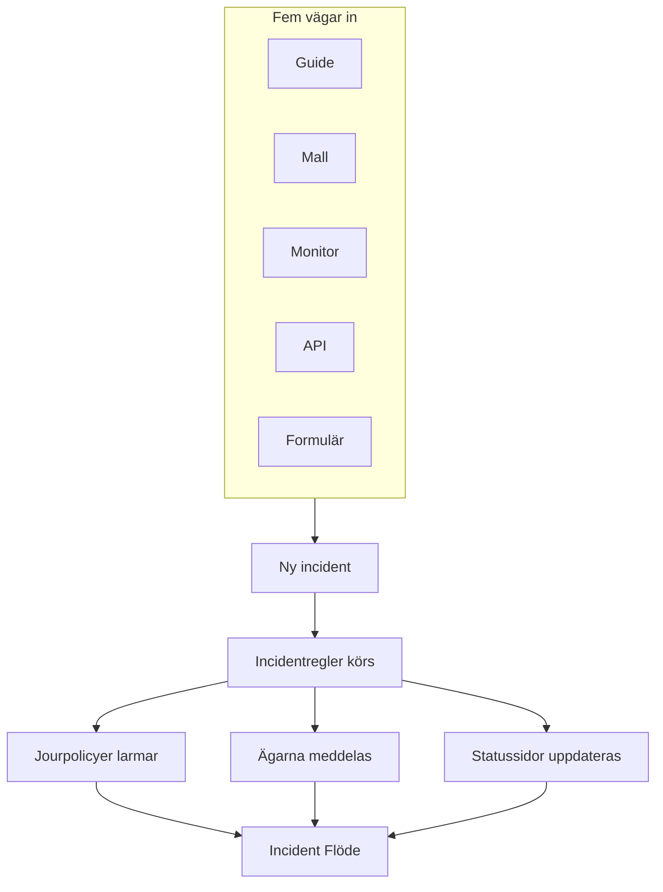
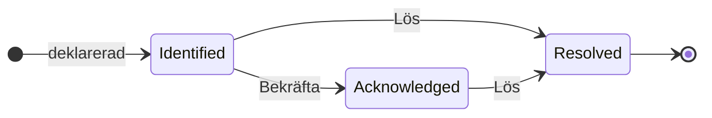

# Incidenter – Översikt

En incident är posten ditt team arbetar utifrån när något går sönder: vad som är påverkat, hur allvarligt det är, hur långt insatsen har kommit, vem som äger den och allt som skrivs ner under tiden. Att deklarera en larmar rätt jourrotation, meddelar ägarna och — om du vill — lägger ut avbrottet på din statussida, så att kunderna vet att du arbetar med saken.

:::cards
- [Deklarera en incident](/docs/incidents/declaring-incidents): För hand, från en mall, från en monitor, via API:t eller via ett formulär.
- [Incidentstatusar och allvarlighetsgrader](/docs/incidents/states-and-severities): Livscykeln, och vad bekräftelse och lösning gör.
- [Incidentanteckningar, ägare och flöde](/docs/incidents/notes-owners-and-feed): Uppdateringar till kunder och till ditt team, och vem som får höra om dem.
- [Länkade larm](/docs/incidents/linked-alerts): Knyt larmen som ett avbrott utlöste till incidenten som förklarar dem.
- [Incidentinställningar och automatisering](/docs/incidents/settings): Mallar, anpassade fält, roller, mätningar och regler.
:::

## I korthet

- **En egen produkt** — öppna **Incidenter** från menyn **Produkter** i toppfältet; listan finns på `/dashboard/{projectId}/incidents`.
- **Tre förskapade tillstånd** — **Identified**, **Bekräftad** och **Löst** skapas för varje nytt projekt. Du kan lägga till egna; de tre förskapade kan byta namn och färg men aldrig tas bort.
- **Tre förskapade allvarlighetsgrader** — **Critical Incident**, **Major Incident** och **Minor Incident**. En allvarlighetsgrad är en etikett med en färg och en ordning — den har inget eget beteende.
- **Fem vägar in** — guiden **Deklarera incident**, **Skapa från mall**, en kriterieregel på en monitor, `POST /api/incident` eller ett [formulär](/docs/forms/index) som alla med länken kan fylla i.
- **Numrerade per projekt** — varje incident får ett incidentnummer från en räknare per projekt, som visas med projektets prefix: `INC-42` i ett nytt projekt, eller `#42` utan prefix.
- **Två sorters anteckningar** — privata anteckningar (interna anteckningar) för ditt team, offentliga anteckningar för statussidans prenumeranter.
- **Larm länkas till incidenter** — länka larmen som hör till en incident, eller deklarera en incident direkt från larm — från en larmlista eller från ett larms egen sida — och bekräfta dem samtidigt. Se [Länkade larm](/docs/incidents/linked-alerts).
- **Inställningarna finns under Incidenter, inte under Projektinställningar** — tillstånd, allvarlighetsgrader, mallar, anpassade fält och regelmotorerna finns alla under **Incidenter → Inställningar** och **Incidenter → Regler**.

## Så fungerar det

Du kan deklarera en incident för hand klockan tre på natten, eller låta en monitor deklarera den i samma ögonblick som dess kriterier matchar. Hur som helst är incidenten samma objekt, med samma livscykel och samma pappersspår i slutet.

### 1. Den deklareras

Fem vägar leder till samma objekt:

- **För hand** — klicka på **Deklarera incident** i listan över incidenter. Det öppnar guiden **Deklarera ny incident**, som har tre steg: **Incidentdetaljer**, **Berörda resurser**, **Jour och roller**. Det första steget frågar efter en titel, en allvarlighetsgrad och en beskrivning, och det som de flesta incidenter aldrig behöver är hopfällt under **Fler fält**. Bara det första steget frågar efter något du måste svara på: **Nästa** går igenom resten, och **Deklarera incident** finns på sammanfattningen i slutet.
  - **Från larm** — **Deklarera incident** på ett urval av larm, eller i ett larms rubrik, öppnar samma guide, förifylld från larmen, länkar dem till den nya incidenten och bekräftar dem, om du inte avmarkerar rutan, så att de slutar eskalera — se [Länkade larm](/docs/incidents/linked-alerts).
- **Från en mall** — klicka på **Skapa från mall** och välj en sparad **Incident Mall**. Mallar förifyller titel, beskrivning, allvarlighetsgrad, starttillstånd, resurser, jourpolicyer, ägare och etiketter.
- **Från en monitor** — en kriterieregel på en monitor med reglaget "deklarera en incident" påslaget skapar incidenten automatiskt i samma ögonblick som filtren matchar. Titlar och beskrivningar stöder där `{{variable}}`-mallar.
- **Via API:t** — `POST /api/incident` med en API-nyckel. Servern fyller i `declaredAt`, skapandetillståndet och incidentnumret åt dig.
- **Via ett formulär** — någon utanför ditt team fyller i ett formulär som du har delat som en länk, utan ett OneUptime-konto. Incidenten deklareras dold för statussidor, från formulärets incidentmall om det har en. Se [Formulär](/docs/forms/index).

Integrationer öppnar också incidenter: [Huntress](/docs/integrations/huntress) gör varje incidentrapport som dess SOC skickar till en incident, som larmar de jourpolicyer du väljer. Se [Deklarera en incident](/docs/incidents/declaring-incidents) för genomgången fält för fält.

### 2. Rätt personer får veta

När incidenten skapas kör OneUptime den automatisering du har konfigurerat: sekretessregler, ägarregler, etikettregler, jourregler och runbook-regler. Alla jourpolicyer som är kopplade till incidenten — för hand, från en mall eller tillagda av en jourregel som matchar — körs parallellt.

Ägarna meddelas via de kanaler som var och en av dem har slagit på under **Användarinställningar → Aviseringsinställningar**: e-post, sms, röstsamtal, push, WhatsApp, Telegram, Slack, Microsoft Teams eller webhook. Har en incident inga ägare alls går aviseringen till projektets ägare i stället för att försvinna.

Är incidenten synlig på en statussida och är aviseringar till prenumeranter påslagna, får prenumeranterna också veta: prenumeranterna på varje statussida som visar någon av dess monitorer, eller bara de på sidorna du har begränsat den till. Se [En statussida per målgrupp](/docs/status-pages/one-status-page-per-audience) för att ge varje målgrupp en egen statussida.

> [!NOTE]
> Aviseringar skickas av ett schemalagt jobb som körs varje minut, så räkna med upp till ungefär en minuts fördröjning i stället för ett omedelbart utskick.

### 3. Ditt team arbetar med den

De som ingriper bekräftar incidenten, lägger till berörda resurser, länkar larmen som hör till den, kör runbooks, tilldelar incidentroller och skriver ner vad de får reda på — privata anteckningar för teamet, offentliga anteckningar för kunderna, plus sidorna **Rotorsak** och **Åtgärd** när bilden klarnar. Allt de gör hamnar i **Incident Flöde** på sidan **Översikt**.

### 4. Den löses

Ett klick på **Lös** flyttar incidenten till det lösta tillståndet, registrerar det i tillståndstidslinjen, stoppar varaktighetsklockan, släpper monitorerna den håller och tar bort incidenten från den aktiva delen av varje statussida den visades på. Inget annat behöver ändras för det — en statussida visar bara incidenter i ett tillstånd ovanför det lösta tillståndet. Se [Vad lösning gör](/docs/incidents/states-and-severities#vad-lösning-gör).

Därefter kan du skriva en efteranalys och, om du vill, publicera den på statussidan.

## Nyckelbegrepp

En handfull ord återkommer på varannan sida i det här avsnittet. Reda ut dem först.

| Begrepp                | Vad det betyder                                                                                                                                     |
| ---------------------- | --------------------------------------------------------------------------------------------------------------------------------------------------- |
| **Incident**           | Själva posten — titel, beskrivning, allvarlighetsgrad, aktuellt tillstånd, berörda resurser och allt som skrivs på den under insatsen.              |
| **Incidenttillstånd**  | Var incidenten befinner sig i sin livscykel. En rad i projektet med namn, färg och `order`, plus flaggorna som ger den betydelse.                   |
| **Incidentens allvarlighetsgrad** | Hur allvarligt det är. En rad i projektet med namn, färg och `order`. Ren klassificering — inget i produkten behandlar en allvarlighetsgrad särskilt. |
| **Incidentnummer**     | En räknare per projekt, som visas som `#42`, eller med ett prefix du konfigurerar, som `INC-42`.                                                    |
| **Berörda resurser**   | Monitorerna, värdarna, Kubernetes-klustren, Docker-värdarna, tjänsterna och annan infrastruktur som du kopplar till incidenten.                     |
| **Offentlig anteckning** | En uppdatering som skrivs för statussidans läsare och prenumeranter. Den visas på statussidans tidslinje.                                         |
| **Privat anteckning**  | En intern anteckning (modellen `IncidentInternalNote`) för teamet som ingriper. Den når aldrig en statussida.                                       |
| **Ägare**              | En användare eller ett team som ansvarar för incidenten. Ägarna meddelas när den skapas, när anteckningar publiceras och när tillståndet ändras.     |
| **Incident Flöde**     | Aktivitetstidslinjen som bara kan växa, på incidentens **Översikt**, med tillståndsändringar, anteckningar, ägarändringar, regelkörningar och aviseringar. |
| **Tillståndstidslinje** | Registret över vilket tillstånd incidenten var i, när och hur länge — med prenumeranternas aviseringsstatus för varje övergång.                    |
| **Länkat larm**        | Ett larm som är länkat till incidenten som en del av insatsen. Ett larm kan vara länkat till mer än en incident och behåller sitt eget tillstånd.    |

## De tre tillstånd som OneUptime skapar för varje projekt

När ett projekt skapas, skapar OneUptime exakt tre incidenttillstånd, i den här ordningen:

| Tillstånd        | Ordning | Färg               | Vad det betyder                                                           |
| ---------------- | ------- | ------------------ | ------------------------------------------------------------------------- |
| **Identified**   | 1       | Röd (`#fd625e`)    | Tillståndet en helt ny incident hamnar i. Det här är skapandetillståndet. |
| **Bekräftad**    | 2       | Gul (`#ffbf53`)    | Någon har tagit incidenten och arbetar med den.                           |
| **Löst**         | 3       | Grön (`#2ab57d`)   | Incidenten är över. Det är lösningen som tar bort den från din statussida. |

Namnen är bara etiketter — det som faktiskt styr beteendet är tre booleans på tillståndets rad: `isCreatedState`, `isAcknowledgedState` och `isResolvedState`. Bara ett tillstånd per projekt förväntas ha varje flagga.

Den skillnaden betyder mer än det låter:

- `isCreatedState` avgör var en ny incident börjar. Väljs inget tillstånd uttryckligen när incidenten skapas, letar OneUptime upp projektets skapandetillstånd och använder det.
- `isAcknowledgedState` och `isResolvedState` markerar det bekräftade och det lösta tillståndet. Var en incidents tillstånd står i förhållande till dem styr knapparna **Bekräfta** och **Lös** i incidentens rubrik, de två nyckeltalsrutorna på incidentens **Översikt** och räknaren **Aktiva incidenter** i sidomenyn: en incident i det bekräftade tillståndet eller ett senare tillstånd är bekräftad, och en incident i det lösta tillståndet eller ett senare tillstånd är löst.
- **Aktiva incidenter** definieras enbart som "det aktuella tillståndet står ovanför det lösta tillståndet". Ett eget tillstånd som du lägger till ovanför det lösta tillståndet är därför aktivt; ett som du placerar efter det räknas som löst, precis som det lösta tillståndet självt.

> [!NOTE]
> Det första förskapade tillståndet heter **Identified**, även om flera beskrivningar i produkten fortfarande kallar det skapandetillståndet ("created"). Letar du efter "Created" i projektets lista över tillstånd är det raden som heter **Identified**.

Du kan lägga till egna tillstånd under **Incidenter → Inställningar → Incidentstatus**. Ett nytt tillstånd läggs till precis ovanför det lösta tillståndet, och du drar raderna för att ändra ordningen; kolumnen **Räknas som** visar vad en incident i varje tillstånd räknas som — inte bekräftad, bekräftad eller löst. De tre tillstånden med flaggor har märket **Inbyggd**: de behåller sin ordning och kan inte tas bort, men du kan byta namn och färg på dem och flytta dem, och därför läser gränssnittet tillståndsnamn dynamiskt.

Ordningen upprätthålls och är inte kosmetisk: en incident kan inte gå till ett tillstånd som står tidigare i ordningen än dess nuvarande. Alla detaljer finns i [Incidentstatusar och allvarlighetsgrader](/docs/incidents/states-and-severities).

## De tre allvarlighetsgrader som OneUptime skapar för varje projekt

Varje nytt projekt får också tre allvarlighetsgrader:

| Allvarlighetsgrad     | Ordning | Färg                     | Vad den betyder                                             |
| --------------------- | ------- | ------------------------ | ----------------------------------------------------------- |
| **Critical Incident** | 1       | Mörkröd (`#b70400`)      | Mycket stor påverkan på kunderna, som kräver omedelbar insats. |
| **Major Incident**    | 2       | Röd (`#fd625e`)          | Betydande påverkan, som oftast kräver omedelbar insats.     |
| **Minor Incident**    | 3       | Gul (`#ffbf53`)          | Liten påverkan, hanteras oftast under arbetstid.            |

Allvarlighetsgrader har `name`, `description`, `color` och `order` och inget annat. Det finns inga flaggor, och ingen kodväg behandlar "Critical Incident" annorlunda än någon annan rad. Allvarlighetsgraden är hur människor prioriterar, och den kan användas som matchningskriterium när du skriver jourregler — men att välja en allvarlighetsgrad larmar inte i sig någon.

Redigera eller lägg till allvarlighetsgrader under **Incidenter → Inställningar → Incidentallvar**. De fullständiga förskapade beskrivningarna finns i [Incidentstatusar och allvarlighetsgrader](/docs/incidents/states-and-severities).

## Var incidenterna finns i instrumentpanelen

Öppna **Incidenter** från menyn **Produkter** i toppfältet. Sidomenyn är indelad i avsnitt:

| Avsnitt       | Vad du gör där                                                                                                                                                             |
| ------------- | -------------------------------------------------------------------------------------------------------------------------------------------------------------------------- |
| **Översikt**  | **Alla incidenter** och **Aktiva incidenter** — den senare har ett rött märke med antalet incidenter i ett tillstånd ovanför det lösta tillståndet.                          |
| **Episoder**  | Incidentepisoder, en separat grupperingsfunktion med egna sidor.                                                                                                          |
| **AI**        | **Insikter**, **Loggar**, **Inställningar**: vad OneUptime AI har lärt sig av dina incidenter och allt den har gjort för dem, och vad den får göra på egen hand — med reglerna för vilka incidenter den utreder och åtgärdar. Se [AI SRE](/docs/ai/ai-sre). |
| **Arbetsyta** | Chattarbetsytorna som projektet har anslutit: **Slack**, **Microsoft Teams** eller båda, var och en med sina aviseringsregler för incidenter. Är ingen av dem ansluten innehåller den **Anslut Slack eller Teams**, en sida som visar båda och hur de ansluts. |
| **Integrationer** | Verktyg som själva öppnar incidenter: **Huntress**, vars incidentrapporter blir incidenter som larmar jouren. Se [Huntress](/docs/integrations/huntress). |
| **Regler**    | Regelmotorerna: **Grupperingsregler**, **Jourregler**, **Ägarregler**, **Runbook-regler**, **Sekretessregler**, **Etikettregler**, **SLA-regler**, **Reminder Rules**. |
| **Inställningar** | **Incidentstatus**, **Incidentallvar**, **Incidentmallar**, **Anteckningsmallar**, **Postmortem-mallar**, **Anpassade fält**, **Incidentroller**, **Mätningar**, **Länkade larm**, **Nummerprefix**. |

**Översikt** och **Episoder** är öppna; **AI**, **Arbetsyta**, **Integrationer**, **Regler**, **Inställningar** och **Utvecklare** är hopfällda som standard, så att menyn öppnas på listorna du använder varje dag. Klicka på ett avsnitts titel för att fälla ut det och hitta sidorna som resten av den här dokumentationen hänvisar till; ett avsnitt öppnas också av sig självt när du är på någon av dess sidor. Konfigurationen av incidenter finns inte under projektinställningarna; den finns helt här.

Själva listan över incidenter visar **Incidentnummer**, **Titel**, **Tillstånd**, **Allvarlighetsgrad**, **Berörda resurser**, **Deklarerad**, **Varaktighet**, **Etiketter** och **Ägare**, med en massåtgärd **Ändra tillstånd** för att stänga flera på en gång.

## Vad varje sida på en incident visar

Öppna en incident, så grupperar dess egen sidomeny sidorna så här:

| Avsnitt i sidomenyn | Sidor                                                                                     |
| ------------------- | ----------------------------------------------------------------------------------------- |
| **Översikt**        | **Översikt**, **Tillståndstidslinje**, **SLA**                                            |
| **Utredning**       | **Beskrivning**, **Rotorsak**, **Åtgärd**, **Runbooks**, **Efteranalys**, **Länkade larm** |
| **Team**            | **Roller**, **Jourexekveringar**, **Ägare**                                               |
| **Aviseringar**     | **Aviseringsloggar**, **AI-loggar** — hopfällt tills du klickar på **Aviseringar**        |
| **Anteckningar**    | **Privata anteckningar**, **Offentliga anteckningar**                                     |
| **Utvecklare**      | **Terraform**, **API**, **AI-assistenter** — hopfällt tills du klickar på **Utvecklare**  |
| **Avancerad**       | **Anpassade fält**, **Inställningar**, **Granskningsloggar**, **Ta bort incident** — hopfällt tills du klickar på **Avancerad** |

Vad varje sida innehåller:

- **Översikt** — insatsen i en överblick. Under rubriken visar nyckeltalsrutor tiden till bekräftelse, tiden till lösning och den totala **Varaktighet**. Kortet **AI Investigation** står överst på sidan — vad OneUptime AI hittade, eller varför den inte startade — med **Incident Flöde** under sig. Bredvid står kortet **Video Call**, kortet **Incidentdetaljer** (titel, allvarlighetsgrad, etiketter, incidentnummer, deklarerad den, deklarerad av, jourpolicyer och incidentens ID på en liten rad **ID** längst ner, ett klick från urklippet), **Incidentroller**, ett kort **Berörda resurser** och incidentens anpassade fält. Har ditt projekt [mätningar](/docs/incidents/settings#mätningar), säger ett kort **Mätningar** under **Incidentdetaljer** vad varje mätning visar för den här incidenten: **12 minuter**, **Har pågått i 5 minuter**, **Inte nådd**.
- **Tillståndstidslinje** — varje tillstånd som incidenten har varit i, med **Börjar den**, **Slutar den**, **Varaktighet** och prenumeranternas aviseringsstatus för varje övergång. **Visa orsak** och **Visa loggar** förklarar varför varje ändring skedde.
- **SLA** — uppföljning av SLA för den här incidenten.
- **Beskrivning**, **Rotorsak**, **Åtgärd** — tre Markdown-sidor. Beskrivningen är den som visas på din statussida.
- **Runbooks** — de runbook-körningar som är kopplade till den här incidenten.
- **Efteranalys** — rapporten och dess bilagor, som du kan välja att publicera på statussidan. **Redigera obduktionsanteckning** frågar efter anteckningen och bilagorna, och därefter efter **Publicera på statussidan**; bara medan det är påslaget frågar den efter **Avisera prenumeranter** och **Efteranalys publicerad**, som sätts till nu när du slår på publicering. **Generate with AI** skriver ett utkast till anteckningen åt dig, och **Tillämpa mall** — som visas när projektet har en mall för efteranalys — låter den börja från en mall. Prenumeranterna får veta en gång, när efteranalysen publiceras: första gången statussidan visar den, vilket kräver **Publicera på statussidan** påslaget och en skriven anteckning. Sparas den igen, eller redigeras den medan den är publicerad, uppdateras statussidan och ingen meddelas; publiceras den igen efter att ha tagits bort från statussidan, får de veta igen. En efteranalys som publiceras medan incidenten är dold skickas när incidenten görs synlig. Se [Efteranalysen](/docs/status-pages/subscribers#incidenter).
- **Länkade larm** — larmen som är länkade till den här incidenten, med varje larms aktuella tillstånd, och vem som länkade det och när. Larm har en motsvarande sida **Länkade incidenter**. Se [Länkade larm](/docs/incidents/linked-alerts).
- **Roller**, **Jourexekveringar**, **Ägare** — vem som arbetar med den, vilka policyer som kördes och vem som meddelas.
- **Aviseringsloggar**, **AI-loggar**, **Granskningsloggar** — vad som skickades och vad som ändrades.
- **Privata anteckningar** och **Offentliga anteckningar** — vad ditt team och dina kunder fick veta. Se [Incidentanteckningar, ägare och flöde](/docs/incidents/notes-owners-and-feed).
- **Anpassade fält**, **Inställningar**, **Ta bort incident** — sidan **Inställningar** innehåller **Synlig på statussidan** och **Privat incident**, kortet **Statussideomfång** som begränsar incidenten till vissa statussidor, och kortet **Reminders**, vars reglage **Skicka påminnelser** sparas så snart du slår om det och visar när nästa påminnelse skickas.

## Så passar incidenter in i resten av OneUptime

- **Monitorer upptäcker problemet; incidenter registrerar det.** En kriterieregel på en monitor kan deklarera en incident automatiskt och förifylla titel, allvarlighetsgrad, jourpolicyer, ägare, etiketter och åtgärdsanteckningar. Se [Incident- och varningsmallar](/docs/monitor/incident-alert-templating) för variablerna som finns där.
- **Larm är signalerna; incidenter är insatsen.** Länka larmen som en incident förklarar till den, från vilket håll som helst, och två projektreglage, påslagna i nya projekt, bekräftar och löser de larmen tillsammans med incidenten. Se [Länkade larm](/docs/incidents/linked-alerts).
- **Jourpolicyer står för larmningen.** Koppla policyer i steget **Jour och roller** i guiden för att deklarera, på en mall eller via **Incidenter → Regler → Jourregler**. Varje regel som matchar utlöses — det som körs är unionen av alla träffar plus allt som är kopplat direkt, utan dubbletter.
- **Runbooks talar om för folk vad de ska göra.** Runbook-regler kopplar automatiskt en procedur när en matchande incident skapas, och de som ingriper kan starta en för hand från incidenten. Se [Runbooks – Översikt](/docs/runbooks/index).
- **Statussidor informerar kunderna.** En incident visas i en statussidas aktiva lista när sidan visar någon av dess monitorer, sidan har incidenter påslagna, incidenten är markerad som synlig på statussidan och dess aktuella tillstånd står ovanför det lösta tillståndet. En incident som är begränsad till vissa statussidor visas bara på dem. Privata incidenter är alltid dolda för alla statussidor. Se [Statussidor – Översikt](/docs/status-pages/index) och [En statussida per målgrupp](/docs/status-pages/one-status-page-per-audience).
- **Arbetsflöden automatiserar runt den.** Med utlösarna **On Create Incident**, **On Update Incident** och **On Delete Incident** bygger du automatisering utan kod ovanpå incidentens livscykel. Se [Översikt över arbetsflöden](/docs/workflows/index).

## Nästa steg

:::cards
- [Deklarera en incident](/docs/incidents/declaring-incidents): Gå igenom guiden fält för fält, eller deklarera från en mall, en monitor eller API:t.
- [Incidentstatusar och allvarlighetsgrader](/docs/incidents/states-and-severities): Lägg till egna tillstånd och se exakt vad varje tillstånd gör.
- [Statussidor – Översikt](/docs/status-pages/index): Hur incidenter når dina kunder.
- [Prenumeranter och meddelanden](/docs/status-pages/subscribers): Vem som meddelas när en incident rör sig.
:::
