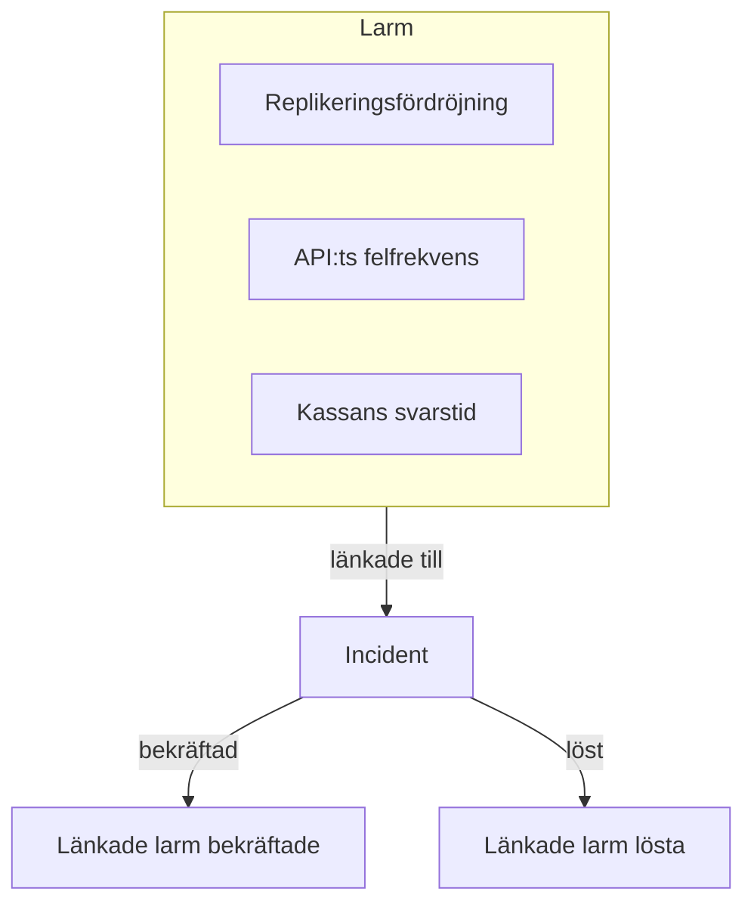
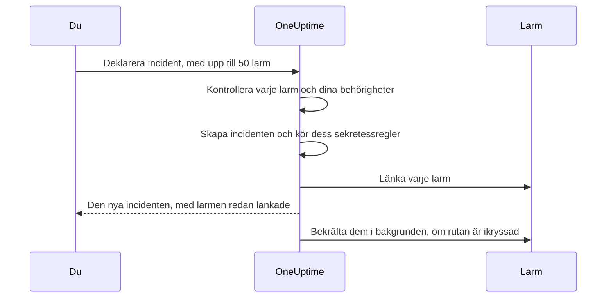

# Länkade larm

Ett avbrott utlöser sällan bara ett larm. När den primära databasen faller bort går monitorn för replikeringsfördröjning igång, monitorn för API:ts felfrekvens går igång, och SLO:n för kassans svarstid börjar bränna — tre larm, ett problem. Att länka de larmen till incidenten säger just det: incidenten är där insatsen sker, och varje larm visar vilken incident som förklarar det.

En länk är bara en länk. Larmet behåller sitt eget tillstånd, sina ägare, jourpolicyer, anteckningar och sitt flöde; incidenten behåller sina. Länkning slår inte ihop och kopierar ingenting, och bekräftar, löser eller tystar aldrig i sig ett larm. (Att deklarera en ny incident från larm är annorlunda: den nya incidenten förifylls från dem, som [beskrivs nedan](#deklarera-en-incident-från-larm), och om du inte kryssar ur rutan på formuläret bekräftas larmen medan du deklarerar den, vilket stoppar deras eskalering — se [Bekräfta larmen medan du deklarerar](#bekräfta-larmen-medan-du-deklarerar).) Två projektreglage, påslagna i nya projekt, tar med sig de länkade larmen när incidenten bekräftas och löses — se [längre ner](#håll-larmens-tillstånd-i-takt-med-incidenten).

:::cards
- [Länka larm till en incident](#länka-larm-från-en-incident): Från incidenten, från ett larm eller många på en gång.
- [Deklarera en incident från larm](#deklarera-en-incident-från-larm): En ny incident, förifylld och länkad i ett svep.
- [Håll larmens tillstånd i takt](#håll-larmens-tillstånd-i-takt-med-incidenten): Bekräfta och lös larmen tillsammans med incidenten.
- [Behörigheter](#behörigheter): Vem som kan länka, och vad länkning låter dem göra.
:::

> [!TIP]
> Kommer du från Opsgenie är det här OneUptimes version av att koppla larm till en incident.

## I korthet

- **Många-till-många** — en incident kan ha valfritt antal länkade larm, och ett larm kan vara länkat till flera incidenter.
- **Tre ställen att länka på** — incidentens sida **Länkade larm**, larmets sida **Länkade incidenter** och massåtgärden **Länka till incident** i huvudlistorna över larm, för upp till **50** larm åt gången.
- **Deklarera en incident från larm** — **Deklarera incident** i en larmlista, i ett larms rubrik eller på dess sida **Länkade incidenter** förifyller en ny incident från larmen och länkar dem medan den skapas. En kryssruta på formuläret, ikryssad som standard, bekräftar dem också, vilket stoppar deras egen eskalering från jouren.
- **Registrerat på båda sidor** — varje länkning och avlänkning skriver en flödespost på incidenten och på larmet, förutom att en incident som deklareras från larm får en post som listar dem alla. Bara incidentens poster publiceras i Slack och Microsoft Teams, och titeln på ett privat larm eller en privat incident skrivs aldrig på den andra sidan.
- **Larmens tillstånd följer incidenten** — två projektreglage, båda påslagna i nya projekt, bekräftar och löser länkade larm när incidenten bekräftas och löses. Stäng av något av dem under **Incidenter → Inställningar → Länkade larm**.
- **Går att automatisera** — länkar är en vanlig API-resurs, `/api/incident-alert`.

## Så fungerar det

Larm är signaler: en monitors kriterier matchade, en SLO började bränna sin budget, en säkerhetsregel gick igång. En incident är den samordnade insatsen mot ett problem (se [Incidenter – Översikt](/docs/incidents/index)). De flesta problem ger flera signaler, och utan länkar är det enda som binder dem till insatsen någons minne.



Med larmen länkade:

- Ser de som ingriper i incidenten i en lista vilka larm som hör till den och vilket tillstånd vart och ett är i.
- Ser någon som öppnar ett av de larmen att det redan hanteras, under vilken incident, i stället för att deklarera en andra incident för samma avbrott.
- Registrerar incidentens flöde när varje larm länkades och av vem, så att tidslinjen visar hur bilden växte fram.
- Stoppar bekräftelsen av incidenten, med reglagen påslagna, jourens eskaleringar för larmen, så att de som arbetar med incidenten inte larmas igen av dess symtom.

## Så fungerar länkar

En länk kopplar ett larm till en incident. Länkar går åt båda håll — samma länk visas på incidentens sida **Länkade larm** och på larmets sida **Länkade incidenter**.

- **Ett larm kan vara länkat till flera incidenter.** Ett delat beroende som fallerar kan vara ett symtom på två separata incidenter. Varje incident listar larmet, och larmet listar båda incidenterna.
- **Varje par länkas en gång.** Att länka ett larm till en incident som det redan är länkat till avvisas med "This alert is already linked to this incident." — även när två personer länkar samma par i samma ögonblick.
- **Länkar skapas eller tas bort, de redigeras aldrig.** En länk har inga egna fält utöver sin incident, sitt larm, när den skapades och av vem. För att flytta ett larm till en annan incident länkar du det till den nya och avlänkar det från den gamla.
- **Länkar stannar inom ett projekt.** Larmet och incidenten måste höra till samma projekt.

## Länka larm från en incident

:::steps
### Öppna incidentens sida Länkade larm

Öppna incidenten och välj **Länkade larm** i avsnittet **Utredning** i dess sidomeny. Tabellen listar varje larm som redan är länkat till den.

### Välj larmet

Klicka på **Länka larm** och välj det i rullgardinsmenyn **Larm**. Rullgardinsmenyn visar de senaste larmen först, vart och ett med sitt nummer — som `ALT-63: Checkout API is offline` — så att larm med samma titel, som en monitors upprepade larm, kan skiljas åt. För att hitta ett äldre larm skriver du: rullgardinsmenyn söker i alla larm efter titel.

### Spara länken

Klicka på **Länka larm** i dialogen. Larmet visas i tabellen, och båda flödena registrerar länken. Avvisas länken, till exempel för att larmet redan är länkat, stannar dialogen öppen och säger varför.
:::

| Kolumn            | Vad den visar                                    |
| ----------------- | ------------------------------------------------ |
| **Larm #**        | Larmets nummer, som `#17` eller `ALT-17`.        |
| **Titel**         | Larmets titel, med en länk till larmet.          |
| **Nuvarande tillstånd** | Larmets eget tillstånd, som **Bekräftad**. |
| **Länkad**        | När larmet länkades.                             |
| **Länkad av**     | Vem som länkade det.                             |

Varje rad har **Visa larm** för att öppna larmet och **Avlänka** för att ta bort länken.

## Länka incidenter från ett larm

Larmets sida speglar incidentens. Öppna ett larm och välj **Länkade incidenter** i avsnittet **Grundläggande** i dess sidomeny. Tabellen listar varje incident som larmet är länkat till, med incidentnummer, titel och aktuellt tillstånd, och när och av vem den länkades.

- **Länka incident** länkar det här larmet till en befintlig incident. Dess rullgardinsmeny fungerar som den på incidentens sida: de senaste incidenterna först, var och en med sitt nummer — som `INC-42: Checkout is down` — och när du skriver söks alla incidenter igenom efter titel.
- **Visa incident** öppnar en länkad incident.
- **Avlänka** tar bort en länk.
- **Deklarera incident** startar en ny incident från det här larmet. Samma knapp finns i larmets rubrik, bredvid **Bekräfta** och **Lös**. Se [Deklarera en incident från larm](#deklarera-en-incident-från-larm).

## Länka många larm på en gång

Huvudlistorna över larm har två massåtgärder för det här: **Alla varningar** och **Aktiva varningar**, de aktiva larmen på startsidan, och sidan **Varningar** för en monitor, en tjänst, en värd, ett Kubernetes-kluster, en SLO eller någon annan resurs som har en. Listan **Medlemsvarningar** för en larmepisod har dem inte — välj i stället larmen i en av huvudlistorna. Välj larmen och välj sedan:

- **Länka till incident** — välj incidenten i rullgardinsmenyn **Incident** och klicka på **Länka larmen**. De senaste incidenterna står först, med sina nummer, och när du skriver söks alla incidenter igenom efter titel. OneUptime länkar varje valt larm och visar förloppet medan det pågår. Ett larm som redan är länkat till den incidenten räknas som klart i stället för misslyckat, så det är ofarligt att köra åtgärden två gånger.
- **Deklarera incident** — öppnar deklarationsformuläret för en ny incident som är förifylld från de valda larmen. Se nästa avsnitt.

Båda åtgärderna tar upp till **50** larm åt gången. Väljer du fler inaktiveras de, med en verktygstips som säger varför. Gränsen finns eftersom varje länk skriver till båda flödena, och varje länk som skapas med **Länka till incident** också publiceras i incidentens Slack- och Microsoft Teams-kanaler — ett urval på tusen larm skulle översvämma dem.

## Deklarera en incident från larm

Visar sig en mängd larm vara en incident som ingen har deklarerat än, deklarera den från larmen. Det finns tre vägar in:

- Välj larmen i en av huvudlistorna över larm och välj **Deklarera incident**.
- Öppna ett larm och klicka på **Deklarera incident** i dess rubrik, bredvid **Bekräfta** och **Lös**. Den står kvar när larmet har bekräftats eller lösts, så att du fortfarande kan deklarera en incident för ett larm i efterhand — för att göra en efteranalys av det, till exempel.
- Öppna ett larms sida **Länkade incidenter** och klicka på **Deklarera incident**.

Alla tre kräver behörighet att skapa incidenter och att länka larm till dem. Utan den är knappen låst, och dess verktygstips nämner den saknade behörigheten.

Vilken du än använder hamnar du på det vanliga formuläret **Deklarera ny incident**, med larmen listade som de som kommer att länkas och de här fälten förifyllda:

| Fält                   | Förifyllt med                                                                                                                                                                                                                                                                          |
| ---------------------- | -------------------------------------------------------------------------------------------------------------------------------------------------------------------------------------------------------------------------------------------------------------------------------------- |
| **Titel**              | Ett larm: dess titel. Flera: titeln på det allvarligaste larmet.                                                                                                                                                                                                                       |
| **Beskrivning**        | Ett larm: dess beskrivning. Flera: en lista med en rad per larm, med dess nummer och titel.                                                                                                                                                                                            |
| **Incidentallvar**     | Det allvarligaste larmets allvarlighetsgrad, översatt till en allvarlighetsgrad för incidenter. En allvarlighetsgrad för incidenter med samma namn, oavsett versaler och gemener, vinner. Annars tar OneUptime allvarlighetsgraden för incidenter på samma plats i ordningen av allvarlighetsgrader, eller den sista om du har färre allvarlighetsgrader för incidenter. |
| **Berörda resurser**   | Varje monitor, värd, Kubernetes-kluster, Docker-värd, Podman-värd och tjänst från de valda larmen, sammanslagna. Monitorerna hamnar under **Monitorer**, resten under **Andra påverkade resurser**. Andra resurser, som SLO:er eller VMware-, Proxmox- och Ceph-kluster, kopieras inte — lägg till dem själv om incidenten påverkar dem. |
| **Etiketter**          | Varje etikett från varje valt larm.                                                                                                                                                                                                                                                    |
| **Privat incident**    | Påslagen om något av larmen är privat. Formuläret säger det, och larmens ägare blir ägare av incidenten — se nedan.                                                                                                                                                                     |

"Allvarligast" följer ordningen av dina allvarlighetsgrader för larm: den första allvarlighetsgraden för larm i listan är den allvarligaste. Med allvarlighetsgraderna som varje projekt börjar med blir ett larm **High** en **Critical Incident** och ett larm **Low** en **Major Incident**.

Allt går att redigera innan du skickar. **Etiketter** och **Privat incident** finns under **Fler fält** på formulärets första steg, vars hopfällda rubrik visar var och en av dem medan den är satt.

**Ett larm som redan har en incident flaggas.** Med **Deklarera incident** på varje larms sida kan två jourhavande som larmas av samma avbrott deklarera det var för sig. Därför markerar bannern som listar larmen varje larm som redan är länkat till en incident — "(already linked to Incident INC-42)", med en länk till den incidenten — och lägger till en anmärkning, formulerad efter hur många av larmen som är länkade:

- Alla larm, och det är ett: "This alert is already linked to an incident. If it is the same problem, update that incident instead of declaring another one."
- Alla larm, och det är flera: "These alerts are already linked to incidents. If it is the same problem, update that incident instead of declaring another one."
- Bara några av dem: "Some of these alerts are already linked to an incident. If it is the same problem, link the other alerts to that incident from the alerts list instead of declaring another one."

Incidentlänkarna öppnas i en ny flik, så att du kan kontrollera den befintliga incidenten utan att förlora det du har fyllt i på formuläret. Anmärkningen är en påminnelse, inte en spärr, och bara incidenter som du får se nämns.

**Jourpolicyer kopieras inte.** Larmen körde sina egna jourpolicyer när de skapades, så att kopiera dem till incidenten skulle larma samma personer en gång till. Incidentens jourpolicyer är det du väljer i steget **Jour och roller** plus det som dina jourregler för incidenter lägger till — precis som för vilken annan incident som helst.

**Larmens monitorer förifylls som påverkade monitorer.** Som för varje incident som deklareras för hand pausas den aktiva övervakningen av incidentens monitorer tills incidenten är löst. Ta bort en monitor från **Monitorer** i steget **Berörda resurser** innan du skickar, om den ska fortsätta kontrolleras.

**Ett privat larm ger en privat incident.** Är något av larmen privat börjar **Privat incident** påslagen, och bannern som listar larmen säger det. En privat incident är bara synlig för sina ägare, Project Owners och Project Admins, så OneUptime ser till att personerna som kunde se larmen kan se incidenten: när den har deklarerats läggs ägarna till varje larm som den deklarerades från — användare och team — till som ägare av incidenten, utan att meddelas. De läggs till precis efter att incidentens Slack- och Microsoft Teams-kanaler har skapats, så att de bjuds in till de kanalerna som vilken annan ägare som helst. Du är också ägare, som för varje incident som du deklarerar. Samma sak händer när en sekretessregel för incidenter gör den nya incidenten privat. Stänger du av **Privat incident** innan du skickar och ingen sekretessregel gäller, är incidenten inte privat och inga ägare kopieras.



När du skickar kontrollerar servern larmen innan den skapar något: högst 50 av dem, vart och ett ett larm i det här projektet som du får se, och du måste få länka larm till incidenter. Misslyckas en kontroll avvisas begäran och ingen incident skapas — så ett felaktigt larm-ID förbrukar aldrig ett incidentnummer. När incidenten finns — och när dess sekretessregler har körts, så att länkarna vet om den är privat — länkas varje larm innan begäran returneras, så att incidentens sida **Länkade larm** redan listar dem. Misslyckas en enskild länk — för att larmet togs bort ett ögonblick tidigare, till exempel — deklareras incidenten ändå och de andra larmen länkas ändå.

Incidentens flöde får en enda post **Larm länkat** som listar larmen, skriven efter **Incident skapad**, i stället för en per larm — se [Flödet, Slack och Microsoft Teams](#flödet-slack-och-microsoft-teams).

### Bekräfta larmen medan du deklarerar

Att deklarera en incident stoppar inte i sig att dess larm larmar: ett larms eskalering från jouren stoppas först när själva larmet har bekräftats. När något av larmen inte har bekräftats än har bannern på formuläret därför en kryssruta, ikryssad som standard — **Acknowledge this alert to stop its escalation** för ett larm, **Acknowledge these 3 alerts to stop their escalation** för flera. Är några av dem redan bekräftade nämner den bara de andra och säger att resten lämnas som de är.

Låt den vara ikryssad, så när incidenten har deklarerats och larmen har länkats:

- **Bekräftas larmen som du.** Varje larm går till ditt larmtillstånd **Bekräftad**, som om du själv hade klickat på **Bekräfta** på det: larmets **Tillståndstidslinje** och flöde nämner dig, larmets ägare meddelas, och ändringen publiceras i larmets Slack- och Microsoft Teams-kanaler som vilken annan tillståndsändring för ett larm som helst. Orsaken lyder "Acknowledged because Incident INC-42 was declared from this alert." — eller, för en privat incident, "Acknowledged because a private incident was declared from this alert.", så att en privat incident aldrig nämns där larmets publik kan läsa det.
- **Stoppas deras egen eskalering från jouren inom ungefär en minut.** Nästa eskaleringssteg ser ett bekräftat larm och stannar. Larm som redan har gått ut återkallas inte.
- **Stoppas påminnelser bara om påminnelseregeln säger det.** Ett larms påminnelser stoppas vid bekräftelse bara när dess påminnelseregel har **Stop Reminders When** satt till **Bekräftad**; annars fortsätter de tills larmet är löst.
- **Fortsätter en larmepisod att eskalera.** Hör ett larm till en episod som larmar via sin egen jourpolicy fortsätter episoden att eskalera tills själva episoden har bekräftats.
- **Lämnas larm som redan är bekräftade eller lösta i fred.** Som överallt annars jämförs tillstånd efter sin ordning, så ett larm i ett eget tillstånd efter **Bekräftad** räknas som bekräftat, och inget flyttas någonsin bakåt.

Kryssa ur rutan för att deklarera utan att bekräfta. När larm kommer att lämnas obekräftade — rutan är urkryssad eller låst — säger formuläret det: "Declaring the incident does not acknowledge the alert: it keeps escalating until it is acknowledged." Och bekräftar du larmen utan att välja en jourpolicy för incidenten påpekar sammanfattningen för steget **Jour och roller**: "The alerts it is declared from are acknowledged too, so their own escalation stops. An alert episode they belong to keeps escalating until the episode is acknowledged, and an incident on-call rule, if any, may still page."

**Du behöver behörighet att bekräfta larmen.** Att bekräfta dem medan du deklarerar kräver **Create Alert State Timeline** och **Edit Alert** (att bekräfta ett larm på dess egen sida kräver bara den första: se [Ändra ett tillstånd](/docs/permissions/index#ändra-ett-tillstånd)): Project Owner, Project Admin, Project Member, Alert Admin och Alert Member har båda, medan Incident Admin och Incident Member, som kan deklarera incidenter från larm, inte har någon av dem. Ditt etikett- och ägaromfång på larm måste också omfatta varje larm som ska bekräftas — bara de som inte har bekräftats än kontrolleras. Larm som redan är bekräftade eller lösta kräver ingen behörighet och blockerar aldrig deklarationen. Utan behörigheterna är rutan låst, med en verktygstips som nämner den saknade, och du kan fortfarande deklarera incidenten. Servern kontrollerar igen innan den skapar något, för varje larm som den ska bekräfta: får du inte bekräfta ett av dem skapas ingen incident och formuläret säger varför — kryssa ur rutan och skicka igen.

**Projektet behöver ett larmtillstånd Bekräftad.** Varje projekt börjar med ett. Har ditt inget erbjuds inte rutan.

Larmen bekräftas i bakgrunden, precis efter att de har länkats, några åt gången — upp till 5 samtidigt — så att incidentens sida kan öppnas ett ögonblick innan de har bekräftats, och så att deklarationen från många larm inte låter de sista vänta bakom alla andra. Ett larm som inte kan bekräftas — för att det togs bort under tiden, till exempel — loggas och stoppar aldrig de andra eller incidenten, och ett larm som någon annan bekräftar eller löser under tiden lämnas som den personen lämnade det.

**Med projektets reglage för länkade larm påslagna kan reglagen flytta larmen i stället.** Deklareras incidenten direkt i ett bekräftat eller löst tillstånd och verkar ett av [reglagen för länkade larm](#håll-larmens-tillstånd-i-takt-med-incidenten) på det tillståndet, flyttar reglaget de länkade larmen medan de länkas, och rutan överlåter de larmen till det, så att varje larm har en enda skribent. De bekräftas eller löses så som reglaget gör det — med reglagets orsak, som "Acknowledged because linked Incident INC-42 was acknowledged.", som nämner incidenten vid dess nummer även när den är privat — de tillskrivs inte dig, och deras ägare meddelas inte. Att deklarera i ditt första incidenttillstånd, som vanligt, eller med reglagen avstängda, överlåter varje larm till rutan.

### Deklarera via API:t

`POST /api/incident` tar emot ID:na för larmen som ska länkas i `miscDataProps`, under `alertIdsToLink`, och om de larmen ska bekräftas under `acknowledgeAlertsToLink`:

```bash
curl -X POST https://oneuptime.com/api/incident \
  -H "apikey: $ONEUPTIME_API_KEY" \
  -H "Content-Type: application/json" \
  -d '{
    "data": {
      "title": "Primary database unavailable",
      "incidentSeverityId": "<incident-severity-id>"
    },
    "miscDataProps": {
      "alertIdsToLink": ["<alert-id>", "<another-alert-id>"],
      "acknowledgeAlertsToLink": true
    }
  }'
```

`alertIdsToLink` är en array med 1 till 50 larm-ID:n. Dubbletter ignoreras, och samma kontroller gäller som i instrumentpanelen, innan incidenten skapas. Inget förifylls via API:t — skicka titeln, allvarlighetsgraden och resurserna som du vill ha. API-nyckeln behöver behörighet att skapa incidenter och att länka larm till dem, och den måste kunna läsa larmen. En API-nyckel är inte en användare, så länkar som skapas med en har ingen **Länkad av**. För resten av begärans body, se [Deklarera en incident](/docs/incidents/declaring-incidents).

`acknowledgeAlertsToLink` är valfritt och avstängt om du inte skickar det. Sätt det till `true` för att bekräfta larmen när de har länkats, som formulärets ruta gör — larm som redan är bekräftade eller lösta lämnas i fred och kräver ingen behörighet. Utelämna det, eller skicka `false`, för att deklarera utan att bekräfta dem. Det kontrolleras tillsammans med larm-ID:na, innan incidenten skapas, och begäran avvisas med en 400 när:

- det är något annat än `true` eller `false`;
- det skickas utan `alertIdsToLink`;
- projektet inte har något larmtillstånd Bekräftad;
- API-nyckeln inte får bekräfta varje larm som inte har bekräftats än — det kräver **Create Alert State Timeline** och **Edit Alert**, med ett etikettomfång som omfattar vart och ett av de larmen.

En API-nyckel är inte en användare, så larm som bekräftas med en tillskrivs ingen, precis som dess länkar inte har någon **Länkad av**.

## Länka och avlänka via API:t

Länkar är en standard-CRUD-resurs på `/api/incident-alert`. För att länka ett larm till en incident skapar du en:

```bash
curl -X POST https://oneuptime.com/api/incident-alert \
  -H "apikey: $ONEUPTIME_API_KEY" \
  -H "Content-Type: application/json" \
  -d '{
    "data": {
      "incidentId": "<incident-id>",
      "alertId": "<alert-id>"
    }
  }'
```

För att lista en incidents länkade larm frågar du efter `incidentId`. Fråga i stället efter `alertId` för att hitta incidenterna som ett larm är länkat till:

```bash
curl -X POST https://oneuptime.com/api/incident-alert/get-list \
  -H "apikey: $ONEUPTIME_API_KEY" \
  -H "Content-Type: application/json" \
  -d '{
    "query": { "incidentId": "<incident-id>" },
    "select": { "_id": true, "alertId": true, "createdAt": true },
    "limit": 50,
    "skip": 0
  }'
```

För att avlänka tar du bort länken efter dess eget ID — länkens `_id`, inte larmets eller incidentens:

```bash
curl -X DELETE https://oneuptime.com/api/incident-alert/<link-id> \
  -H "apikey: $ONEUPTIME_API_KEY"
```

Båda ID:na är obligatoriska. En begäran om länkning avvisas också när larmet eller incidenten hör till ett annat projekt eller är en som du inte kan se. Felet lyder likadant oavsett om larmet eller incidenten inte finns eller bara är dold för dig, så att det aldrig avslöjar att ett privat finns.

Samma resurs driver de genererade arbetsflödeskomponenterna — **On Create Incident Alert** utlöses när ett larm länkas och **On Delete Incident Alert** när det avlänkas — och MCP-serverns Incident Alert-verktyg. [API-referensen](/reference) har den fullständiga formen på begäran och svar.

## Avlänka

Avlänka från vilken sida som helst: **Avlänka** på en rad på incidentens sida **Länkade larm** eller larmets sida **Länkade incidenter**, och bekräfta. För att avlänka flera på en gång väljer du raderna och väljer massåtgärden **Avlänka**. Den tar bara bort länkarna — själva larmen och incidenterna tas inte bort.

Avlänkning tar bort länken och inget annat. Larmet och incidenten behåller sina tillstånd, och ett larm som bekräftades eller löstes på grund av incidenten förblir så — larms tillstånd går aldrig bakåt. Båda flödena registrerar avlänkningen.

## Behörigheter

Länkning har fyra egna detaljerade behörigheter, i gruppen **Incident** i [Behörighetsreferens](/docs/permissions/reference):

| Behörighet                | Vad den tillåter                                                                                                       | Roller som har den                                                                                       |
| ------------------------- | ---------------------------------------------------------------------------------------------------------------------- | -------------------------------------------------------------------------------------------------------- |
| **Create Incident Alert** | Att länka ett larm till en incident, även när en incident deklareras från larm. Du måste också kunna läsa båda.        | Project Owner, Project Admin, Project Member, Incident Admin, Incident Member, Alert Admin, Alert Member |
| **Delete Incident Alert** | Att avlänka.                                                                                                           | Project Owner, Project Admin, Project Member, Incident Admin, Incident Member, Alert Admin, Alert Member |
| **Read Incident Alert**   | Att se listorna **Länkade larm** och **Länkade incidenter**.                                                           | Alla ovanstående, plus Viewer, Incident Viewer och Alert Viewer                                          |
| **Edit Incident Alert**   | I praktiken ingenting — en länk har inga fält som du kan ändra.                                                        | Project Owner, Project Admin, Project Member, Incident Admin, Incident Member, Alert Admin, Alert Member |

Larmroller finns med så att de som arbetar med larm kan länka dem, och incidentroller så att de som arbetar med incidenter kan göra det. Ingen av dem räcker på egen hand, eftersom en länk bara skapas när du kan läsa båda sidor:

- **En larmroll behöver också läsåtkomst till incidenter** — lägg till Viewer, Incident Viewer eller Read Incident.
- **En incidentroll behöver också läsåtkomst till larm** — lägg till Viewer, Alert Viewer eller Read Alert.

Ytterligare tre regler gäller ovanpå det:

- **Du måste kunna se båda sidor.** En länk skapas bara när du kan läsa både larmet och incidenten. Privata larm och incidenter, och etikettbegränsningar, gäller som vanligt.
- **En länk hör till sin incident.** Om du kan se en länk följer din åtkomst till dess incident: etikettbegränsningar och ägaromfång på incidenter gäller också länken.
- **Länkning kräver läsåtkomst till ett larm, inte redigeringsåtkomst.** Med projektets reglage för länkade larm påslagna, som de är i nya projekt, räcker det för att en länk ska kunna bekräfta eller lösa larmet — se [Vem flyttar ett länkat larm](#vem-flyttar-ett-länkat-larm).

Att deklarera en incident från larm kräver också behörighet att skapa incidenter, och att bekräfta dess larm medan du deklarerar kräver **Create Alert State Timeline** och **Edit Alert** på vart och ett av dem som inte har bekräftats än — se [Bekräfta larmen medan du deklarerar](#bekräfta-larmen-medan-du-deklarerar). I instrumentpanelen är en åtgärd som du saknar en behörighet för låst, och dess verktygstips nämner den saknade behörigheten. Det gäller även läsåtkomst till den andra sidan: **Länka larm** är låst om du inte kan läsa larm, och **Länka incident** och **Länka till incident** om du inte kan läsa incidenter. För hur roller, detaljerade behörigheter, etiketter och ägaromfång samverkar, se [Användare, team och behörigheter](/docs/permissions/index).

## Flödet, Slack och Microsoft Teams

Varje länkning och avlänkning skrivs till båda flödena och tillskrivs den som gjorde ändringen:

| Ändring     | Incidentens flöde                            | Larmets flöde                                       |
| ----------- | -------------------------------------------- | --------------------------------------------------- |
| Länkning    | **Larm länkat** (`AlertLinked`)              | **Länkat till incident** (`LinkedToIncident`)       |
| Avlänkning  | **Larm avlänkat** (`AlertUnlinked`)          | **Avlänkat från incident** (`UnlinkedFromIncident`) |

Varje post nämner den andra sidan vid dess nummer och länkar till den, så att du kan hoppa från incidentens flöde till larmet och tillbaka. Den ger också den andra sidans titel, om inte den sidan är privat:

- **Ett privat larms titel hålls utanför incidentens post**, och därmed utanför Slack och Microsoft Teams. Posten lyder till exempel "Linked Alert #12 (private alert) to Incident #5".
- **En privat incidents titel hålls utanför larmets post**, som lyder "Linked to Incident #5 (private incident)".

Det gäller även när båda är privata, eftersom ett privat larm och en privat incident kan ha olika ägare. Att öppna det länkade larmet eller den länkade incidenten styrs som vanligt av dess egen sekretess.

**Bara incidentens poster når Slack och Microsoft Teams.** **Larm länkat** och **Larm avlänkat** publiceras där incidentens andra flödesuppdateringar går. Posterna på larmets sida stannar i instrumentpanelen, så att en länk ger ett meddelande i stället för två. Se [Slack](/docs/workspace-connections/slack) och [Microsoft Teams](/docs/workspace-connections/microsoft-teams) för att konfigurera de kanalerna.

**Att deklarera en incident från larm skriver en post, inte en per larm.** Länkarna som skapas medan incidenten deklareras skriver inga egna poster **Larm länkat**. I stället får incidenten, när dess post **Incident skapad** är ute — och incidentens egna Slack- och Microsoft Teams-kanaler, om du använder dem, har skapats — en enda post **Larm länkat**: "Declared from 3 alerts:", följt av en rad per larm med dess nummer och titel (ett privat larm utan sin titel). Det är det enda meddelandet som publiceras i Slack och Microsoft Teams. Varje larm får fortfarande sin egen post **Länkat till incident**.

Båda flödenas dialoger **Filtrera efter händelsetyp**, i varje flödes meny **⋯**, listar de här händelsetyperna, så att du kan visa eller dölja länkningsaktivitet som vilken annan sorts post som helst. Mer om incidentens flöde i [Incidentanteckningar, ägare och flöde](/docs/incidents/notes-owners-and-feed).

## Håll larmens tillstånd i takt med incidenten

Två projektreglage låter incidenten ta med sig sina länkade larm. Båda är påslagna i nya projekt. Ett projekt som skapades innan de var påslagna som standard behåller inställningen det hade, som är avstängd om ingen slog på dem. De har en egen inställningssida, **Incidenter → Inställningar → Länkade larm**, där vart och ett är ett reglage på kortet **Länkade larm** som sparas så snart du slår om det. Bara Project Owners och Project Admins kan ändra dem; för alla andra är reglagen låsta och säger vilken behörighet de kräver:

- **Bekräfta länkade larm när incidenten bekräftas** — när incidenten når ditt bekräftade tillstånd går varje länkat larm som inte har bekräftats än till ditt larmtillstånd **Bekräftad**. Det är det här som stoppar jourens eskaleringar för de larmen: nästa eskaleringssteg ser ett bekräftat larm och stannar, inom ungefär en minut. Larm som redan har gått ut återkallas inte. Påminnelser för larm stoppas också när larmets påminnelseregel har **Stop Reminders When** satt till **Bekräftad**; annars fortsätter de tills larmet är löst.
- **Lös länkade larm när incidenten löses** — när incidenten når ditt lösta tillstånd går varje länkat larm som inte har lösts än till ditt larmtillstånd **Löst**, förutom ett larm som fortfarande är länkat till en annan incident som inte är löst. Det larmet lämnas öppet för den andra incidenten — bekräftat, om bekräftelsereglaget också är påslaget — och löses när den sista av dess incidenter löses.

Med båda reglagen avstängda ändrar länkning ingenting i ett larms tillstånd. Ett länkat larm stannar där det är tills någon flyttar det, dess jourpolicy fortsätter att eskalera, och dess påminnelser fortsätter att komma. Det enda undantaget är att deklarera en incident från larm med formulärets ruta ikryssad, vilket bekräftar dem medan du deklarerar — se [Bekräfta larmen medan du deklarerar](#bekräfta-larmen-medan-du-deklarerar).

### Så beter sig reglagen

- **Ordning, inte namn.** "Når" betyder att incidentens aktuella tillstånd står vid eller efter det bekräftade eller lösta tillståndet i din ordning av tillstånd. Ett eget tillstånd mellan Bekräftad och Löst, som ett tillstånd **Övervakning**, räknas som bekräftat. Larm jämförs på samma sätt, så ett larm i ett eget tillstånd efter **Bekräftad** räknas redan som bekräftat.
- **Aldrig bakåt.** Bara larm som ligger bakom måltillståndet flyttas. Ett larm som redan är bekräftat lämnas i fred av bekräftelsereglaget, och ett löst larm rörs aldrig.
- **Att lösa med bara bekräftelsereglaget påslaget** bekräftar de länkade larmen, eftersom löst ligger efter bekräftat.
- **Att länka till en incident som redan är bekräftad eller löst** tillämpar reglagen på det nya larmet direkt, som om incidenten just hade bytt tillstånd.
- **Att öppna en incident igen öppnar inte dess larm igen.** Larm kan inte gå till ett tidigare tillstånd.
- **Bara det aktuella tillståndet räknas.** Att lägga till en tidigare post i incidentens **Tillståndstidslinje** — en med en **Slutar den** — flyttar inget larm.
- **Länkning ensam ändrar aldrig ett larms tillstånd.** Med båda reglagen avstängda flyttar incidenten aldrig sina larm.

Larmen byter tillstånd i bakgrunden, precis efter incidenten. Varje ändring går genom larmets egen tillståndstidslinje med en orsak som "Acknowledged because linked Incident INC-42 was acknowledged.", så att larmets **Tillståndstidslinje** och flöde visar varför det flyttades. Larmets ägare får ingen avisering om tillståndsändringen för det, men tillståndsändringen publiceras i Slack och Microsoft Teams som vilken annan tillståndsändring för ett larm som helst. Om ett larm inte kan flyttas stoppar det inte de andra.

### Vem flyttar ett länkat larm

Att slå på ett reglage överlåter medvetet de länkade larmens tillstånd till incidenten: incidenten är där insatsen leds, så den som leder incidenten leder också dess larm. Från och med då:

- **Den som kan ändra en incidents tillstånd flyttar dess länkade larm.** Att bekräfta eller lösa incidenten bekräftar eller löser dem.
- **Den som kan länka ett larm kan flytta det.** Att länka ett larm till en incident som redan är bekräftad eller löst flyttar larmet medan det länkas.

Ingen av dem kräver behörighet att redigera larmen. OneUptime flyttar dem själv, och länkning kräver bara läsåtkomst till ett larm. Med bekräftelsereglaget påslaget kan alltså alla som kan länka larm eller ändra incidenters tillstånd bekräfta — och stoppa jourens eskalering av — vilket larm som helst som de kan se; med lösningsreglaget påslaget kan de lösa det. Därför kan bara Project Owners och Project Admins ändra reglagen. De är påslagna i ett nytt projekt, så stäng av dem om larms tillstånd bara någonsin ska ändras av personer som kan redigera larm.

### Lös larm som kommer från monitorer

Att bekräfta är alltid säkert för en monitors larm: ett bekräftat larm räknas fortfarande som öppet, så monitorn fortsätter att använda det i stället för att öppna ett nytt.

> [!WARNING]
> Att lösa är annorlunda. Fallerar monitorn fortfarande när dess larm löses, öppnar monitorns nästa kontroll ett nytt larm — och det nya larmet är inte länkat till incidenten. Löses dina incidenter ofta innan deras monitorer har återhämtat sig, stäng av lösningsreglaget och behåll bara bekräftelsereglaget påslaget, eller lös incidenter först när deras monitorer är friska.

## Ta bort larm och incidenter

- **Att ta bort ett larm** tar bort det från varje incident som det var länkat till. Incidenterna är i övrigt oförändrade.
- **Att ta bort en incident** tar bort dess länkar. Larmen är i övrigt oförändrade och behåller sina tillstånd.
- **Att ta bort ett projekt** tar bort alla dess länkar tillsammans med allt annat.

Ingen av dem skriver flödesposter **Larm avlänkat** eller **Avlänkat från incident** — det gör bara en uttrycklig avlänkning.

## Nästa steg

:::cards
- [Deklarera en incident](/docs/incidents/declaring-incidents): Deklarationsformuläret, mallar, monitorkriterier och API:t.
- [Incidentstatusar och allvarlighetsgrader](/docs/incidents/states-and-severities): Ordningen av tillstånd som reglagen jämför mot.
- [Incidentinställningar och automatisering](/docs/incidents/settings): Inställningssidorna för incidenter, bland dem Länkade larm.
- [Användare, team och behörigheter](/docs/permissions/index): Roller, detaljerade behörigheter och omfång.
:::
