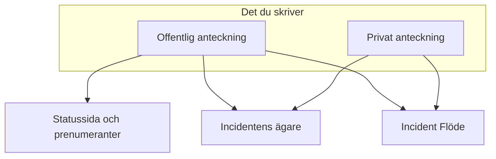

# Incidentanteckningar, ägare och flöde

Varje incident samlar ett skriftligt register medan du arbetar med den: uppdateringar till dina kunder, arbetsanteckningar till ditt team och ett aktivitetsflöde över allt som hände. Den här sidan beskriver hur du skriver offentliga och privata anteckningar, vem var och en når, incidentens flöde och ägarna som meddelas om varje ändring.

:::cards
- [Publicera en offentlig anteckning](#publicera-en-offentlig-anteckning): Berätta för kunderna vad du vet, på statussidan och med en avisering.
- [När prenumeranterna meddelas](#när-en-offentlig-anteckning-faktiskt-når-prenumeranterna): Kontrollerna som en offentlig anteckning passerar, och dess märke.
- [Incidentens flöde](#incidentens-flöde): Tidslinjen över allt som hände.
- [Ägare](#ägare): Vem som ansvarar, och vad de får veta.
:::

## Så fungerar det

En del av det du skriver är för dina kunder — uppdateringen som går ut på statussidan klockan 02:14 och säger att du har hittat den felaktiga driftsättningen. Resten är för ditt team — stackspårningen som någon klistrade in, grafen som äntligen blev begriplig, beslutet att växla över. OneUptime håller de två målgrupperna isär och registrerar båda på incidenten.



**Offentliga anteckningar** publiceras på din statussida och kan meddela prenumeranterna. **Privata anteckningar** (modellen `IncidentInternalNote`) stannar inne i instrumentpanelen. Under båda ligger **Incident Flöde**, en tidslinje som bara kan växa och som registrerar allt som hände med incidenten, och listan **Ägare**, som avgör vem som får besked.

Allt hänger på incidentens sidomeny: **Anteckningar → Offentliga anteckningar**, **Anteckningar → Privata anteckningar** och **Team → Ägare**. Flödet finns på incidentens sida **Översikt**.

## Offentliga anteckningar jämfört med privata anteckningar

De två sorternas anteckningar ser likadana ut i instrumentpanelen och beter sig väldigt olika.

|                          | Offentlig anteckning                                                | Privat anteckning                                               |
| ------------------------ | ------------------------------------------------------------------- | --------------------------------------------------------------- |
| Modell                   | `IncidentPublicNote`                                                | `IncidentInternalNote`                                          |
| Visas på statussidor     | Ja, som en del av incidentens tidslinje                             | Aldrig — inget i statussideappen läser dem                      |
| Publiceringstid          | `postedAt`, som du själv kan sätta                                  | Ingen: stämplad och sorterad efter `createdAt`                  |
| Meddelar prenumeranter   | När **Notify status page subscribers** är påslagen                  | Aldrig: den har inga fält för prenumeranter alls                |
| Bilagor nåbara för       | Statussidans besökare, via en väg på statussidan                    | Bara det autentiserade instrumentpanels-API:t                   |
| Meddelar ägare           | Ja                                                                  | Ja                                                              |

**Vad "privat" faktiskt betyder.** Det betyder "inte publicerad på statussidan" — inte "begränsad till en mindre grupp personer". De inbyggda rollerna som kan läsa en incident läser båda sorternas anteckningar, så alla som kan läsa incidenten kan oftast också läsa dess privata anteckningar; i en anpassad roll är det separata behörigheter, **Read Incident Status Page Note** och **Read Incident Internal Note**. Måste du begränsa vem som över huvud taget kan se en incident använder du flaggan **Privat incident** (`isPrivate`) på själva incidenten, som döljer incidenten för alla statussidor och begränsar den till användarna som äger den, medlemmarna i teamen som äger den, och projektadministratörer och projektägare.

**Ägarna ser båda.** Jobbet som meddelar ägarna hämtar offentliga och privata anteckningar tillsammans. En privat anteckning är privat för dina prenumeranter, inte för de som ingriper.

| Om du vill …                                           | Välj             |
| ------------------------------------------------------ | ---------------- |
| Berätta för kunderna vad du vet och när du vet mer     | **Offentlig anteckning** |
| Bakåtdatera en uppdatering som du redan har skickat någon annanstans | **Offentlig anteckning** |
| Registrera en hypotes, ett kommando du körde eller en återvändsgränd | **Privat anteckning** |
| Bifoga en heapdump eller en skärmbild av en intern instrumentpanel | **Privat anteckning** |

## Publicera en offentlig anteckning

:::steps
### Öppna de offentliga anteckningarna

Öppna incidenten och välj **Anteckningar → Offentliga anteckningar** i dess sidomeny. Redigeraren ovanför anteckningarna säger vem som läser anteckningen innan du publicerar den: **Public · Visible on your status page**.

### Skriv uppdateringen

Skriv anteckningen i Markdown, eller börja från en av dina **Mallar** eller från **Draft with AI**. Lägg till filer med **Attach** om prenumeranterna ska se dem.

### Bestäm vem som får besked

Låt **Notify status page subscribers** vara ikryssad för att meddela prenumeranterna, eller kryssa ur den för att publicera tyst. **Will notify** under den visar vilka statussidor anteckningen når, och **Förhandsgranskning** visar e-postmeddelandet de får.

### Publicera den

Klicka på **Post update**, eller tryck på Ctrl+Enter (⌘+Enter på en Mac). Anteckningen visas överst i listan, med ett märke som följer dess avisering.
:::

Samma redigerare öppnas i en dialog från **Add Public Note** i menyn **Åtgärder** i incidentens flöde (se [Incidentens flöde](#incidentens-flöde)), så en anteckning skrivs på samma sätt från båda ställena.

| Kontroll                           | Syfte                                                                                                                                         |
| ---------------------------------- | --------------------------------------------------------------------------------------------------------------------------------------------- |
| Anteckningen                       | Texten, i Markdown. Obligatoriskt.                                                                                                            |
| **Mallar**                         | Infogar en av dina anteckningsmallar i anteckningen, efter det du redan har skrivit. Se [Anteckningsmallar](#anteckningsmallar).                 |
| **Draft with AI**                  | Skriver ett utkast till anteckningen utifrån incidenten, som du redigerar. Se [Generera en anteckning med AI](#generera-en-anteckning-med-ai).     |
| **Attach**                         | Filer som delas med prenumeranterna på statussidan. Valfritt.                                                                                 |
| **Posted now**                     | När anteckningen säger att den publicerades: ögonblicket då du publicerar den, om du inte väljer en tidigare tidpunkt här, i din aktuella tidszon. |
| **Notify status page subscribers** | Kryssruta. Påslagen som standard, om inte incidenten deklarerades utan att meddela prenumeranterna — då börjar den avstängd. Stäng av den för att publicera tyst. |

**Tysta incidenter förblir tysta.** Deklarerades en incident med **Meddela statussideprenumeranter** avstängt (eller som en privat incident) har dess prenumeranter aldrig fått veta om den, så en offentlig anteckning bör inte vara det första de hör. På en sådan incident börjar kryssrutan avstängd, med en rad under som förklarar varför. Du kan fortfarande kryssa i den för att meddela prenumeranterna om den anteckningen. Anteckningar som publiceras utan ett uttryckligt val följer samma regel: anteckningar från Slack och Microsoft Teams, arbetsflöden och API-begäranden som utelämnar `shouldStatusPageSubscribersBeNotifiedOnNoteCreated`. Ett uttryckligt `true` eller `false` behålls alltid. Offentliga anteckningar på [schemalagda underhållshändelser](/docs/status-pages/subscribers#schemalagda-underhållshändelser) och [incidentepisoder](/docs/status-pages/subscribers) följer en liknande regel, baserad på om händelsen eller episoden själv meddelade prenumeranterna när den skapades; att göra en episod privat påverkar det inte.

**Se vem anteckningen når.** Medan **Notify status page subscribers** är ikryssad visar en rad **Will notify** under den statussidorna som anteckningen går till, med ett "upp till"-antal prenumeranter per kanal, och sidorna som visar incidentens monitorer men inte får besked, med orsaken. Får ingen besked visar den ingenting, om inte incidenten är dold för statussidor eller dess statussideomfång är orsaken. Den följer incidentens statussideomfång, så en anteckning på en incident som är begränsad till två platssidor säger att den når de två. Se [En statussida per målgrupp](/docs/status-pages/one-status-page-per-audience).

**Se vad de får.** Bredvid samma kryssruta visar **Förhandsgranskning** e-postmeddelandet som prenumeranterna på var och en av de statussidorna får för anteckningen du skriver, och vilken mall det använder och varför. Den förblir grå tills anteckningen har lite text. **Skicka test till mig** skickar det e-postmeddelandet till ditt eget kontos e-postadress, och till ingen annan. Se [Prenumeranter och meddelanden](/docs/status-pages/subscribers#incidenter).

> [!TIP]
> **Publiceringstiden är anteckningens verkliga tidsstämpel.** Statussidor sorterar och visar offentliga anteckningar efter `postedAt`, inte efter när du skrev dem — så om du uppdaterar statussidan med en uppdatering som du skickade för 40 minuter sedan väljer du **Posted now** och anger när det faktiskt hände. Kommer en anteckning in via API:t (`/api/incident-public-note`) utan en tidpunkt stämplar OneUptime aktuell tid.

Varje anteckning visar vem som skrev den, dess publiceringstid, den återgivna Markdown-texten med dess bilagor och, i dess rubrik, hur det står till med aviseringen till prenumeranterna. **Search notes…** hittar anteckningar utifrån vad de säger, och flödet kan läsas med de senaste eller de äldsta först.

## Publicera en privat anteckning

**Anteckningar → Privata anteckningar** är medvetet enklare. Det är samma redigerare, som säger **Private · Only your team can see this**, med anteckningen, **Mallar**, **Draft with AI** och **Attach** för filer som är avsedda för teamet som ingriper i incidenten. **Lägg till privat anteckning** i menyn **Åtgärder** i incidentens flöde öppnar den i en dialog. Via API:t är privata anteckningar `/api/incident-internal-note`.

Ingen publiceringstid, ingen kryssruta för prenumeranter — anteckningen stämplas när den skapas.

Båda sorternas anteckningar skrivs i Markdown-redigeraren, som kapslar listpunkter med **Öka indrag** och **Minska indrag** — eller Tab och Shift+Tab — och behåller listorna, länkarna och formateringen i det du klistrar in från Word, Google Docs eller en annan OneUptime-sida. Ctrl+Z ångrar ett indrag, och i visuellt läge även blocken och inklistringarna som redigeraren infogade, i ordning med det du skrev. Ett kodblock som kopieras från en anteckning klistras in igen som ett kodblock, och ett ord som kopieras ut ur ett som inline-kod. Se [Deklarera en incident](/docs/incidents/declaring-incidents#steg-1-incidentdetaljer).

## Bilagor på anteckningar

Båda sorternas anteckningar tar emot bifogade filer via redigerarens knapp **Attach**, och båda visar en lista över bilagor under anteckningens text med en länk **Download attachment** per fil.

Där de skiljer sig åt är vem som kan hämta filen:

- **Bilagor på offentliga anteckningar** kan laddas ner av statussidans besökare via en väg på statussidan, tillsammans med själva anteckningen.
- **Bilagor på privata anteckningar** kan bara nås via det autentiserade instrumentpanels-API:t. Det finns ingen väg på statussidan för dem.

Det gör bilagor till samma val mellan offentligt och privat som anteckningens text. En bild till tidslinjen som kunderna ser hör hemma på en offentlig anteckning; en konfigurationsdump på en privat.

Bilder följer samma val. En bild som du klistrar in eller drar in i en anteckning, eller lägger till med **Ladda upp bild**, lagras i incidentens projekt och visas inuti anteckningen, och vem som kan se den följer anteckningen:

- **I en privat anteckning** — eller i en offentlig anteckning innan den har publicerats — visas en bild bara för projektets medlemmar, inloggade på det sätt som projektet kräver. Alla andra som öppnar dess adress ser ingenting, som om det inte fanns någon bild där.
- **I en offentlig anteckning** visas en bild för alla som kan se anteckningen: på statussidan och i e-postmeddelandena som prenumeranterna får. En offentlig anteckning visas med sin incident, aldrig utan: medan incidenten är dold för statussidor eller privat visas bilderna i dess anteckningar också bara för projektets medlemmar.

Varje uppladdning börjar privat, från instrumentpanelen och från API:t. En bild kan bara ses av alla så länge något som dina statussidor visar har den i sig: en offentlig anteckning medan dess incident, episod eller schemalagda underhållshändelse visas på statussidor, ett meddelande från tidpunkten då det börjar visas, incidentens beskrivning medan incidenten är **Synlig på statussidan** och inte privat, dess efteranalys när den också har publicerats där, en episods eller en schemalagd underhållshändelses beskrivning medan den visas på statussidor (aldrig medan episoden är privat), och statussidans egna beskrivningar av översikt, grupper och resurser. När det upphör — incidenten döljs eller görs privat, bilden redigeras bort, anteckningen eller incidenten tas bort — är bilden privat igen, om inte något annat som dina statussidor visar fortfarande har den i sig. Ett formulärs beskrivning och tackmeddelande visar sina bilder för alla på samma sätt, medan formuläret tar emot inskick.

Att läsa en anteckning via API:t, Terraform eller ett arbetsflöde visar bara bilagorna som läsaren får öppna: filer från anteckningens projekt och offentliga filer. En bilaga som en anteckning nämner från ett annat projekt utelämnas från listan, som om anteckningen inte hade den.

## Generera en anteckning med AI

Redigeraren har en knapp **Draft with AI**, på båda anteckningssidorna och i flödets dialoger **Add Public Note** och **Lägg till privat anteckning**. Den skickar incidenten till ditt projekts AI-leverantör och lägger in den genererade Markdown-texten i anteckningen, där du redigerar den innan du publicerar — inget publiceras automatiskt.

| Dialog                             | Vad den skriver                                                      | Mallar                                                            |
| ---------------------------------- | -------------------------------------------------------------------- | ----------------------------------------------------------------- |
| **Generate Public Note with AI**   | En anteckning till kunderna, utifrån en analys av incidentens data.  | **Status Update**, **Resolution Notice**, **Maintenance Update**  |
| **Generate Private Note with AI**  | En intern teknisk anteckning.                                        | **Investigation Update**, **Technical Analysis**, **Shift Handoff** |

Bakom knappen skickar instrumentpanelen en begäran till `/incident/generate-note-from-ai/{incidentId}` med den valda mallen och en anteckningstyp `public` eller `internal`.

Det som skickas är incidentens text. En bild eller en fil som är inbäddad i den — en skärmbild som klistrats in i beskrivningen till exempel — ersätts av en kort notering som `[image omitted: PNG, 340 KB]`, och varje textfält kortas till 16 000 tecken, så att en enda stor inklistring aldrig tränger undan resten. Själva incidenten behåller sina bilder.

## Anteckningsmallar

Skriver ditt team samma tre uppdateringar vid varje avbrott, spara dem en gång. Redigerarens meny **Mallar** visar dem, på båda anteckningssidorna och i flödets anteckningsdialoger, och väljer du en infogas den i anteckningen.

Mallar delas mellan offentliga och privata anteckningar: en enda lista över mallar tjänar båda, och samma mall kan infogas i båda sorternas anteckningar.

Platshållare i en mall — `{{incident.title}}`, `{{incident.state}}`, `{{incident.customFields.impact}}` och de andra som listas under [Anteckningsmallar](/docs/incidents/settings#anteckningsmallar) — fylls i med incidentens aktuella värden när du väljer den, både på anteckningssidorna och i dialogerna **Bekräfta** och **Lös**. Det du redan hade skrivit ändras aldrig, och en platshållare utan värde står kvar som den skrevs.

> [!IMPORTANT]
> Läs den ifyllda anteckningen innan du publicerar en offentlig: `{{incident.affectedStatusPages}}` nämner varje statussida som incidenten når, och prenumeranterna på alla av dem läser den.

Du hanterar dem under **Incidenter → Inställningar → Anteckningsmallar** — kortet heter **Mallar för offentliga eller privata anteckningar för incidenter** och dess formulär är en sida: **Mallnamn** och **Mallbeskrivning**, båda obligatoriska, och sedan texten. Innan du har några säger menyn **Mallar** det och länkar dit.

## Publicera anteckningar från Slack eller Microsoft Teams

Har du anslutit en arbetsyta behöver de som ingriper aldrig lämna kanalen. Både Slack och Microsoft Teams erbjuder en åtgärd för att lägga till en anteckning som öppnar en dialog med en rullgardinsmeny **Note Type** — **Public Note** (publicerad på statussidan) eller **Private Note** (bara synlig för teammedlemmar) — och en textruta **Note**, och som skriver resultatet direkt på incidenten.

Tre detaljer som är värda att känna till:

- **Skydd mot dubbletter** — varje anteckning registrerar Slack-meddelandet som den kom från (`postedFromSlackMessageId`, i formatet `channel_id:message_ts`), så att flera personer som reagerar på samma meddelande ger en anteckning, inte fem.
- **Anteckningar ekar tillbaka** — att publicera båda sorternas anteckningar skickar också ett meddelande in i den anslutna incidentkanalen, eftersom anteckningens flödespost skapas med aviseringar till arbetsytan påslagna.
- **Publicerad som den som frågade** — en anteckning från dialogen eller från en reaktion publiceras med den personens OneUptime-behörigheter, så den kräver personens behörighet att publicera den sortens anteckning på incidenten. Avvisas den får personen veta varför — i ett direktmeddelande i Slack, och i konversationen i Microsoft Teams (i meddelandets tråd, vid en reaktion) — och inget publiceras.

## När en offentlig anteckning faktiskt når prenumeranterna

Att skapa en offentlig anteckning med **Meddela statussideprenumeranter** påslaget garanterar inte i sig att ett e-postmeddelande går ut. Anteckningen måste klara en kedja av kontroller, och varje misslyckande registrerar en specifik orsak i stället för att ge ett fel:

```mermaid title="Kontrollerna som en offentlig anteckning passerar innan prenumeranterna får höra om den"
flowchart TB
    note["Offentlig anteckning publicerad"] --> box{"Aviseringsrutan påslagen?"}
    box -->|Nej| skipped["Prenumeranter inte meddelade"]
    box -->|Ja| incident{"Incident på statussidor?"}
    incident -->|Nej| skipped
    incident -->|Ja| pages{"Sida inom omfånget?"}
    pages -->|Nej| skipped
    pages -->|Ja| prefs{"Prenumerant anmäld?"}
    prefs -->|Ja| sent["Meddelande skickat"]
```

1. **Meddela statussideprenumeranter** måste vara påslaget. Är det inte det stämplas anteckningen som överhoppad i samma ögonblick som den skapas. Det börjar avstängt på incidenter som deklarerades utan att meddela prenumeranterna.
2. Anteckningen måste höra till en incident som fortfarande finns.
3. Incidenten måste ha minst en monitor kopplad — utan monitorer finns det ingen resurs på en statussida att leda anteckningen till.
4. Incidentens flagga **Synlig på statussidan** (`isVisibleOnStatusPage`) måste vara sann, och incidenten får inte vara privat (`isPrivate`). En privat incident är dold för alla statussidor, vad flaggan än säger — se [Håll en incident borta från statussidan](/docs/incidents/states-and-severities#håll-en-incident-borta-från-statussidan).
5. Varje statussida som incidenten når måste ha **Visa incidenter** (`showIncidentsOnStatusPage`) påslaget. Sidorna som den når är de som visar dess monitorer, inskränkta till sidorna som incidenten är begränsad till, om det finns några. En incident som inte är begränsad till någon sida hoppar över sidorna som bara visar incidenter som är begränsade till dem. Se [En statussida per målgrupp](/docs/status-pages/one-status-page-per-audience).
6. Varje prenumerant måste klara sina egna inställningar — inte avregistrerad, och prenumererande på den här resursen och på händelsetypen `Incident` där sidan låter prenumeranterna välja.

> [!NOTE]
> **Aviseringar är inte omedelbara.** Jobbet som skickar dem körs en gång i minuten, så räkna med upp till ungefär en minut mellan att anteckningen sparas och att e-posten går iväg. Det är vad **Notifying subscribers soon** betyder på en anteckning, och **Sending Soon** på incidentens egna aviseringar.

En offentlig antecknings rubrik följer hela resan med ett märke. Klicka på det för aviseringens statusmeddelande, som säger vad som hände:

| Märke                          | Vad det betyder                                                                                                                                   |
| ------------------------------ | ------------------------------------------------------------------------------------------------------------------------------------------------- |
| **Subscribers not notified**   | Inget skickades: anteckningen publicerades med **Meddela statussideprenumeranter** urkryssat, eller en av spärrarna ovan stängde. Orsaken är registrerad. |
| **Notifying subscribers soon** | Köad, väntar på nästa körning av utskicksjobbet.                                                                                                  |
| **Notifying subscribers**      | Jobbet arbetar sig igenom listan över prenumeranter.                                                                                              |
| **Subscribers notified**       | Varje prenumerants meddelande skickades. Statusmeddelandet visar per statussida hur många som gick ut på varje kanal.                             |
| **Notification failed**        | Inte alla prenumeranter fick det skickat, eller jobbet stoppades med ett fel. Statusmeddelandet säger vilket.                                     |

**Skickat betyder skickat.** Jobbet väntar på varje meddelande: ett e-postmeddelande eller ett sms räknas som skickat när e-postservern eller sms-leverantören har tagit emot det, och ett meddelande till Slack, Microsoft Teams eller en webhook när den andra sidan har svarat. Ett meddelande som avvisas, ger ett fel eller inte får något svar inom 4 minuter räknas som misslyckat, och ett misslyckande sätter märket till **Notification failed**; de andra prenumeranterna får det fortfarande skickat. Statusmeddelandet lyder då till exempel `Not every subscriber was sent this notification: 2 of 61 messages failed. Site 03: 41 email sent. Site 07: 16 email, 2 SMS sent; 2 email failed.` "Skickat" är så långt som OneUptime kan se: en e-postserver kan fortfarande studsa ett e-postmeddelande senare.

:::details Stora sidor och långa utskick
En statussidas prenumeranter läses 10 000 åt gången tills alla har nåtts, och 20 meddelanden är på väg samtidigt. En avisering slutar starta nya meddelanden efter 20 minuter: det som den inte hade nått dittills listas, och den markeras som **Notification failed**. Ett utskick som avbröts halvvägs — dess server startades om eller slutade svara — markeras också som **Notification failed**, med ett meddelande som börjar med `Interrupted:`, när det har stått på **Notifying subscribers** i 40 minuter, så att det aldrig blir hängande för evigt. Se [Prenumeranter och meddelanden](/docs/status-pages/subscribers).
:::

### Skicka en antecknings avisering igen

Klicka på en antecknings aviseringsmärke för att se vad som hände. En anteckning vars avisering misslyckades erbjuder **Försök med meddelandet igen**, och en vars avisering gick ut erbjuder **Skicka meddelandet igen**. Båda frågar först: bekräftelsen visar statussidorna som anteckningen skulle nå nu, med ett "upp till"-antal per kanal, eller säger att den inte skulle nå någon, och säger vad som händer. Båda sätter tillbaka anteckningen i väntande läge så att nästa körning plockar upp den, och skickar den till varje statussida som incidenten når nu, även till prenumeranterna som redan har fått den. Har du ändrat sidorna som incidenten är begränsad till sedan anteckningen publicerades, går den till sidorna som den är begränsad till nu. En anteckning som publicerades med **Meddela statussideprenumeranter** urkryssat erbjuder ingen av dem, eftersom den aldrig var tänkt att skickas, och ingen av dem erbjuds medan en avisering fortfarande är köad eller håller på att skickas. Offentliga anteckningar på schemalagda underhållshändelser och incidentepisoder behåller bara **Försök med meddelandet igen** efter ett misslyckande.

Att skicka en antecknings avisering igen berättar för varje prenumerant vad anteckningen säger, precis som publiceringen gjorde, så det kräver behörigheten att publicera offentliga anteckningar som meddelar prenumeranterna samt behörigheten att redigera offentliga anteckningar. Via API:t är det samma uppdatering som instrumentpanelen gör, som sätter tillbaka `subscriberNotificationStatusOnNoteCreated` till `Pending`; den avvisas för en anropare utan de behörigheterna, för en anteckning som publicerades utan att meddela prenumeranterna, och medan anteckningens avisering håller på att skickas.

:::details Hur incidentens avisering 'skapad' fortsätter
Bara incidentens avisering 'skapad' fortsätter där den stannade: den håller reda på statussidorna som den har skickats till fullt ut, och **Försök igen** på incidentens **Översikt** hoppar över dem. Det registreras per statussida, inte per prenumerant, så en sida som den stannade halvvägs på får den skickad fullt ut igen, även prenumeranterna på den sidan som redan har fått den. Bekräftelsen för **Försök igen** erbjuder **Skicka det igen till alla statussidor, även sidorna som redan har nåtts**, vilket gör den till **Skicka igen till alla sidor**, och **Skicka igen** efter ett lyckat utskick skickar den till varje sida igen. Se [En statussida per målgrupp](/docs/status-pages/one-status-page-per-audience#adding-status-pages).
:::

### Redigera en offentlig anteckning

**Att redigera en offentlig anteckning sker tyst, om du inte ber om annat.** Anteckningens redigeringsformulär har en kryssruta **Meddela prenumeranter om denna uppdatering**, urkryssad varje gång. Kryssa i den för en ändring som prenumeranterna behöver känna till, så får de den redigerade anteckningen, markerad som en uppdatering; anteckningen visar då ett andra märke för uppdateringen bredvid det ursprungliga, med sitt eget **Försök med meddelandet igen** efter ett misslyckande:

| Uppdateringens märke             | Vad det betyder                                     |
| -------------------------------- | --------------------------------------------------- |
| **Uppdatering i kö**             | Väntar på nästa körning av utskicksjobbet.          |
| **Skickar uppdatering**          | Jobbet arbetar sig igenom listan över prenumeranter. |
| **Uppdatering skickad**          | Varje prenumerant fick den redigerade anteckningen skickad. |
| **Uppdateringen misslyckades**   | Inte alla prenumeranter fick den skickad.           |
| **Uppdatering inte skickad**     | En av spärrarna ovan stoppade den.                  |

En skickad uppdatering erbjuds inte igen: redigera anteckningen med kryssrutan ikryssad för att skicka den senaste texten, eller skicka själva anteckningen igen. Har den ursprungliga aviseringen inte skickats än går ingen separat uppdatering ut — den ursprungliga tar med sig redigeringen. Håller den på att skickas just då väntar uppdateringen tills den är klar och går sedan ut. Kryssrutan och uppdateringens **Försök med meddelandet igen** kräver samma behörigheter som att skicka anteckningens avisering igen; utan dem kan du fortfarande redigera anteckningen, utan att meddela någon. Se [Prenumeranter och meddelanden](/docs/status-pages/subscribers).

Det faktiska meddelandet som prenumeranterna får byggs med en mall per statussida och per kanal — e-post, sms, Slack och Microsoft Teams har var sin mall för händelsen **Subscriber Incident Note Created**, med variabler för statussidans namn och URL, länken till detaljerna, de berörda resurserna, incidentens allvarlighetsgrad och titel, anteckningens text, incidentens etiketter, berörda statussidor och anpassade fält, och en avregistreringslänk per prenumerant. Standardmeddelandena via e-post, i Slack och i Microsoft Teams visar också incidentens anpassade fält som är markerade med **Ta med i aviseringar till prenumeranter**, med deras aktuella värden. Se [Prenumeranter och meddelanden](/docs/status-pages/subscribers) för hur de mallarna och kanalerna konfigureras.

## Incidentens flöde

Kortet **Incident Flöde** står längst ner i den vänstra kolumnen på incidentens sida **Översikt**. Det är incidentens historia i ordning: varje post är en ikon, avataren och namnet på den som orsakade den, en relativ tidsstämpel med exakt lokal tid när du håller muspekaren över, och en text i Markdown. Som standard står de senaste posterna överst.

Vissa poster har extra detaljer — en avisering till ägarna listar till exempel alla som fick e-post, och en avisering till prenumeranterna listar varje statussida som den gick till, med antalet skickade och misslyckade meddelanden på varje kanal och ämnet som dess e-post gick ut med, följt, när den skickade några, av värdena i anpassade fält som den lade in i ett meddelande, under **Custom fields sent**. De visar en knapp **More Information** som öppnar en panel **More Information**.

Kortets rubrik har också en meny **Åtgärder**, så att du kan agera utan att lämna tidslinjen:

- **Execute Runbook** — starta ett [runbook](/docs/runbooks/index) för den här incidenten.
- **Kör jourpolicy** — larma en policy på begäran. En arkiverad policy larmar ingen: dess körningslogg på incidenten säger att den inte kördes eftersom policyn är arkiverad.
- **Add Public Note** — redigeraren från sidan **Offentliga anteckningar**, i en dialog: skriv anteckningen, och sedan **Post update**. Mallar, **Draft with AI**, bilagor, **Notify status page subscribers** med vem den når, och **Förhandsgranskning** finns alla där. Anteckningen publiceras nu; för att bakåtdatera den väljer du **Posted now**.
- **Lägg till privat anteckning** — redigeraren från sidan **Privata anteckningar**, i en dialog: skriv anteckningen, och sedan **Add note**.

Båda anteckningsåtgärderna är låsta, med namnet på den saknade behörigheten, för någon som inte får skriva anteckningar. När en anteckning har publicerats stängs dialogen och flödet visar den.

Allt annat finns bakom knappen **⋯** bredvid, samma knapp **Fler alternativ** som en tabellkorts rubrik har, så att rubriken visar så få knappar som möjligt:

- **Nyaste först** / **Äldsta först** — ordningen som flödet läses i. En bock markerar den som används, och din webbläsare kommer ihåg valet för varje incidents flöde.
- **Filtrera efter händelsetyp** — en dialog med flödets händelsetyper, var och en med ikonen som dess poster har, och en sökruta när listan är lång. Kryssa i de som ska visas och välj **Använd filter**; med inget ikryssat visas varje händelsetyp. Medan flödet är filtrerat säger en ruta ovanför det hur många händelsetyper det visar, med ett märke för var och en, **Redigera filter** och **Rensa filter**. Filtret sparas inte: lämna incidenten, så visar dess flöde allt igen.
- **Uppdatera** — hämtar flödet igen.

> [!NOTE]
> **Flödet kan bara växa, och det är inte din granskningslogg.** API:t tillåter att flödesposter skapas och läses men inte att de uppdateras eller tas bort, så att ingen i tysthet kan skriva om en incidents historik. Det är inte heller permanent: på installationer med fakturering tas flödesrader som är äldre än tre år bort. För ett varaktigt register över vem som ändrade vad använder du **Avancerad → Granskningsloggar** i incidentens sidomeny.

## Vad flödet registrerar

Flödesposter skrivs av själva incidenttjänsten, av båda anteckningstjänsterna, av tillståndstidslinjen, av ändringar av ägare och medlemmar, av länkning och avlänkning av larm, av regelmotorerna, av jourens körning, av körningarna av AI-utredningen och efteranalysen, och av cronjobben för aviseringar. Händelsetyperna omfattar:

- **Själva incidenten** — `IncidentCreated`, `IncidentUpdated`, `IncidentStateChanged`. En post `IncidentUpdated` registrerar vad en redigering ändrade: titeln, beskrivningen, rotorsaken, åtgärdsanteckningarna, etiketterna, allvarlighetsgraden, monitorerna och statusen som sattes på dem, och statussidorna som lades till i eller togs bort från incidentens omfång. Den har en rad för varje värde som ändrades och ingen för ett värde som sparades som det var, så att spara ett kort utan ändringar, eller en API-klient eller ett arbetsflöde som skriver tillbaka incidenten som den är, lägger inte till någon post alls. Text som läses likadant är densamma (radbrytningar och blankstegen runt den undantagna), och etiketter är samma uppsättning i vilken ordning som helst; ett värde som rensades läses som borttaget, och att ta bort alla etiketter som "All labels removed.". Ett larms poster **Alert updated** fungerar på samma sätt.
- **Anteckningar och rapporter** — `PublicNote`, `PrivateNote`, `RootCause`, `RemediationNotes`, `PostmortemNote`. En post `PostmortemNote` skrivs när efteranalysens anteckning ändras, inte varje gång efteranalysen sparas.
- **Personer** — `OwnerUserAdded`, `OwnerTeamAdded`, `OwnerUserRemoved`, `OwnerTeamRemoved`, `IncidentMemberAdded`, `IncidentMemberRemoved`.
- **Länkade larm** — `AlertLinked` och `AlertUnlinked`, som visas som **Larm länkat** och **Larm avlänkat**.
- **Aviseringar** — `OwnerNotificationSent`, `SubscriberNotificationSent`, `OnCallPolicy`, `OnCallNotification`.
- **Automatisering** — `LabelRuleExecuted`, `OwnerRuleExecuted`, `PrivacyRuleExecuted`, `OnCallRuleExecuted`, `AutoRemediation`.
- **Videosamtal** — `VideoCallStarted` och `VideoCallFailed`: ett samtal som startades för incidenten, med dess anslutningslänk, eller orsaken till att en leverantör inte kunde starta ett. Se [Videosamtal](/docs/workspace-connections/video-calls).

Varje typ får sin egen ikon, så att du kan skumma ett långt flöde och plocka ut tillståndsändringarna ur pratet. AI-genererad analys av rotorsaken markeras särskilt och återges i ett begränsat Markdown-läge. Posten **Incident skapad**, posten som registrerar en ny titel och posterna för att gå in i eller lämna en episod visar en titel exakt som den skrevs: de escapar `\`, `[`, `]`, `*`, `_`, `~`, backticks och \< i den, så att en titel inte kan bli en bild, rå HTML, ett Slack-omnämnande som \<!here\>, en länk vars text döljer vart den går, eller fetstil, kursiv eller kod. En adress i en titel visas fortfarande som en länk till samma adress.

Att länka ett larm registreras också på larmet. Larm har ett eget flöde, där samma ändring visas som **Länkat till incident** (`LinkedToIncident`) eller **Avlänkat från incident** (`UnlinkedFromIncident`), med incidentens namn. Bara incidentens poster **Larm länkat** och **Larm avlänkat** publiceras i Slack och Microsoft Teams, så att varje länk tillkännages en gång. En incident som deklareras från larm får en enda post **Larm länkat** som listar dem alla i stället för en per larm, och titeln på ett privat larm eller en privat incident utelämnas från den andra sidans post. Se [Länkade larm](/docs/incidents/linked-alerts).

Flöden respekterar incidenters sekretess: för privata incidenter filtreras flödet på samma sätt som incidenten.

## Ägare

Ägare är personerna och teamen som ansvarar för en incident. De är mottagarna av aviseringarna om allt som händer med den — och de är anledningen till att en incident inte går obemärkt förbi medan alla tror att någon annan tar hand om den.

Öppna **Team → Ägare** i incidentens sidomeny. Kortet **Ägare** visar ett märke med ett antal och beskriver ägare som personerna och teamen som ansvarar för den här incidenten och som meddelas om ändringar, med en löpande räkning som "2 people · 1 team". Ägare visas som överlappande avatarer; håller du muspekaren över en visas personens e-postadress, eller så markeras posten som ett **Team**.

- Klicka på **Lägg till ägare** för att öppna en väljare med en sökruta för personer eller team.
- Klicka på borttagningskontrollen på en avatar för att öppna bekräftelsen **Ta bort ägare**, och sedan på **Ta bort**.
- Finns det inga ägare än säger kortet det och uppmanar dig att lägga till en kollega eller ett team, så att de meddelas om ändringar.

Användare som äger och team som äger är separata poster — att lägga till ett team gör varje medlem i teamet till ägare när det gäller aviseringar, utan att lista dem var för sig. Via API:t är de `/api/incident-owner-user` och `/api/incident-owner-team`.

Bara projektets egna team och medlemmar kan vara ägare. Väljaren erbjuder bara dem, och ägare som läggs till via API:t, Terraform eller ett arbetsflöde hålls till samma sak: ett team från ett annat projekt, eller någon som inte är medlem i projektet, avvisas.

## Hur ägare tilldelas

Det finns fyra vägar in på listan över ägare:

- **Från en incidentmall** — mallar har ett fält **Ägare**: personerna och teamen som äger incidenten och meddelas när den skapas eller uppdateras, valda från samma lista som **Lägg till ägare**. Att skapa en incident från mallen förifyller dem, och de läggs till när incidentens Slack- och Microsoft Teams-kanaler finns, så att en aviseringsregel som bjuder in incidentens ägare till en ny kanal också bjuder in dem. Instrumentpanelen, och ett arbetsflödes steg **Create One Incident** med en vald **Incident Template**, lägger till dem utan aviseringen "du har lagts till"; ett [formulär](/docs/forms/on-submit) med en mall meddelar dem och håller tillbaka incidentens avisering **Incident skapad** tills de har lagts till. Se [Deklarera en incident](/docs/incidents/declaring-incidents).
- **Från Ägarregler för incidenter** — matchande regler lägger till ägare automatiskt när incidenten skapas.
- **Vid skapande via API:t** — användare och team som anges som ägare med skapandeanropet läggs till på samma sätt, när kanalerna finns, och utan aviseringen "du har lagts till".
- **För hand** — kontrollen **Lägg till ägare** på sidan **Ägare**, när som helst under incidenten.

Att lägga till samma person två gånger är ofarligt; ägare som redan är tilldelade dupliceras inte.

## Ägarregler för incidenter

**Ägarregler för incidenter** tilldelar automatiskt användare och team som ägare när matchande incidenter skapas — dirigeringslagret som gör att en databasincident hamnar hos databasteamet utan att någon behöver tänka på det. Du hittar dem under **Incidenter → Regler → Ägarregler**, och resten av automatiseringen av incidenter beskrivs i [Incidentinställningar och automatisering](/docs/incidents/settings).

Regelformuläret har två steg — **Matcha**, villkoren som en incident måste uppfylla, och sedan **Ägare**, det som regeln lägger till:

- **Ägare** — **Lägg till ägare** öppnar en lista med personer och team; klicka på var och en för att lägga till den, och ta bort ett val med **×** på dess märke. När regeln matchar läggs varje vald person och varje valt team till som ägare, och ägare som redan är tilldelade dupliceras inte.
- **Ärv ägare**, hopfällt under **Ägare** — tilldela ägare från relaterade enheter i stället för att nämna dem. **Ärv ägare från övervakare** gör varje ägare till incidentens monitorer till ägare av incidenten, och **Ärv ägare från värdar**, **Ärv ägare från Kubernetes-kluster**, **Ärv ägare från Docker-värdar**, **Inherit Owners From Podman Hosts** och **Ärv ägare från tjänster** gör samma sak för de resurserna.

En ny regel måste lägga till någon: välj minst en ägare, eller slå på ett reglage under **Ärv ägare**. API:t och Terraform avvisar också en ny regel som inte lägger till någon. Dess **Namn** fylls i utifrån ägarna som du väljer — eller, på en regel som bara ärver, utifrån dess reglage (_Inherit owners from monitors_) — tills du skriver ett eget namn. Att redigera en regel kräver aldrig ägare, så en äldre regel som inte lägger till något kan fortfarande byta namn eller stängas av; listan markerar den med **Lägger inte till något**. Se [Etikett- och ägarregler](/docs/configuration/label-and-owner-rules).

**Avisera ägare**, under **Fler fält**, styr om folk får veta det. Låt det vara påslaget för riktig dirigering; stäng av det för att lägga till ägare tyst — användbart när en regel är en administrativ bekvämlighet och inte ett larm.

Varje körning av en regel skrivs i incidentens flöde, så att du alltid kan se om en person lades till av en regel eller av en människa.

## Vad ägarna meddelas om

Fem jobb meddelar ägarna, och vart och ett körs en gång i minuten:

| Avisering                  | När                                                          | E-postens ämne                                                 |
| -------------------------- | ------------------------------------------------------------ | -------------------------------------------------------------- |
| **Incident skapad**        | Incidenten deklareras.                                       | `[New Incident {number}] - {title}`                            |
| **En anteckning publicerades** | En offentlig *eller* privat anteckning publiceras.       | `[Update Incident {number}] - {title}`                         |
| **Tillståndet ändrades**   | Incidenten går till ett annat tillstånd.                     | `[{State} Incident {number}] - {title}`                        |
| **Du lades till**          | Du läggs till som ägare.                                     | `You have been added as the owner of Incident {number} - {title}` |
| **Fortfarande inte löst**  | En påminnelse, styrd av tidpunkten för incidentens nästa påminnelse. | `[Reminder] Incident {number} is still {state} - {title}` |

Varje avisering går ut på kanalerna som personen har slagit på under **Användarinställningar → Aviseringsinställningar** — e-post, sms, röstsamtal, push, WhatsApp, Telegram, Slack, Microsoft Teams eller webhook — som avgör vad som faktiskt skickas. Varje mottagare kan stänga av var och en av dem för sig — inställningarna per användare handlar om att skicka dig aviseringarna om skapad incident, publicerad anteckning, ändrat tillstånd, tillagd ägare, tilldelad medlem och påminnelse om att den fortfarande är öppen. Den som bara vill ha ett samtal vid tillståndsändringar kan få exakt det. Se [Incidentstatusar och allvarlighetsgrader](/docs/incidents/states-and-severities) för vad en tillståndsändring betyder.

**Incidenter utan ägare är inte tysta.** Har en incident inga ägare alls faller aviseringsjobben tillbaka på projektets ägare, så att inget tappas bort. Aviseringen **Incident skapad** för en incident som har rapporterats via ett formulär vars mall har ägare väntar i stället på de ägarna. Varje person som meddelas läggs också till i den matchande flödesposten, så att du i efterhand kan se exakt vem som fick besked och på vilken adress.

## Nästa steg

:::cards
- [Incidentinställningar och automatisering](/docs/incidents/settings): Ägarregler, anteckningsmallar och resten av automatiseringen.
- [Prenumeranter och meddelanden](/docs/status-pages/subscribers): Var offentliga anteckningar hamnar och vem som tar emot dem.
- [En statussida per målgrupp](/docs/status-pages/one-status-page-per-audience): Vilka statussidor en incidents anteckningar når.
- [Incidentstatusar och allvarlighetsgrader](/docs/incidents/states-and-severities): Tillståndsmaskinen som driver halva flödet.
:::
