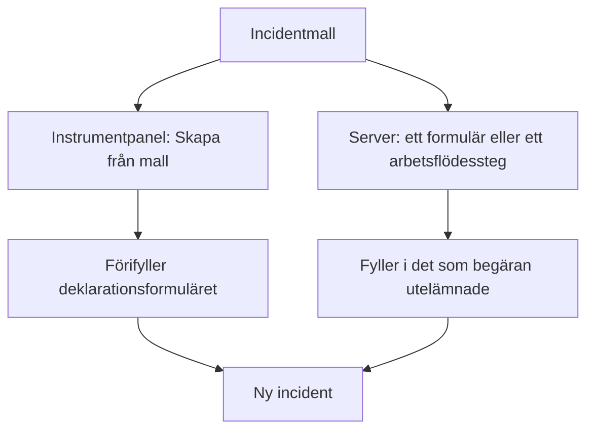
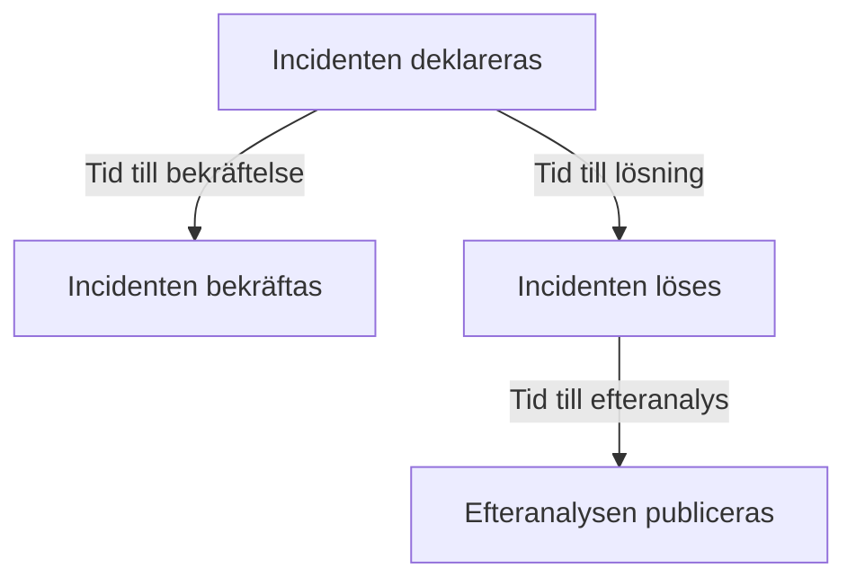
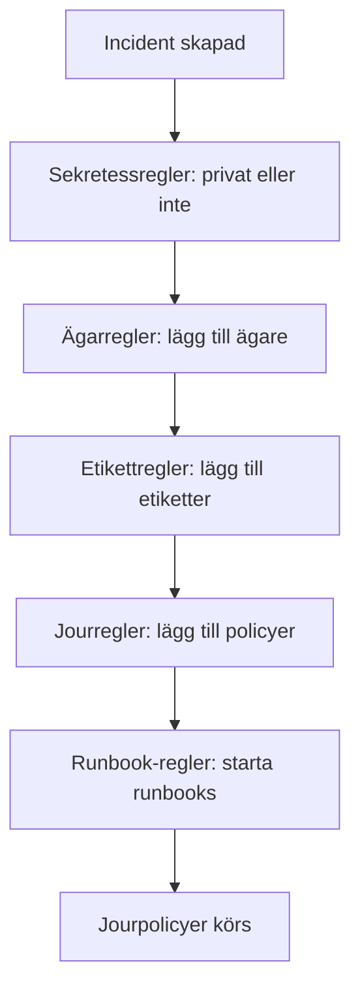

# Incidentinställningar och automatisering

Konfigurationen av incidenter finns under **Incidenter**, inte under **Projektinställningar**: tillstånd och allvarlighetsgrader, mallar, anpassade fält, roller, mätningar och nummerprefix, och reglerna som verkar på varje ny incident. Den här sidan är referensen för var och en av de sidorna, och för det som körs av sig självt i samma ögonblick som en incident deklareras.

:::cards
- [Incidentmallar](#incidentmallar): Deklarera samma sorts incident, förifylld, varje gång.
- [Anpassade fält](#anpassade-fält): Dina egna fält på varje incident, som efterfrågas när den deklareras.
- [Mätningar](#mätningar): Tiden till bekräftelse, lösning eller lindring, uträknad för varje incident.
- [Regler](#regler-som-körs-när-en-incident-skapas): Ägare, etiketter, larmning och episoder, satta automatiskt.
:::

## Var incidentinställningarna finns

Öppna **Incidenter** från menyn **Produkter** i toppfältet och fäll sedan ut **Inställningar** längst ner i dess sidomeny. **Regler** och **Inställningar** börjar båda hopfällda, så fäll ut dem innan sidorna nedan visas. Allt här hör till projektet: mallar, roller, anpassade fält och regler hör till ett projekt och gäller för varje incident som deklareras i det, på vägar som börjar med `/dashboard/{projectId}/incidents/settings/`.

| Sida                         | Vad du gör där                                                                               |
| ---------------------------- | -------------------------------------------------------------------------------------------- |
| **Incidentstatus**           | Lägga till, byta namn på, byta färg på och ändra ordningen på tillstånden som en incident går igenom. |
| **Incidentallvar**           | Lägga till, byta namn på, byta färg på och ändra ordningen på allvarlighetsgraderna.         |
| **Incidentmallar**           | Förifylla en hel incident — titel, beskrivning, resurser, jourpolicyer, ägare, etiketter.    |
| **Anteckningsmallar**        | Återanvändbar text för offentliga och privata anteckningar.                                  |
| **Postmortem-mallar**        | Återanvändbara strukturer för efteranalyser.                                                 |
| **Anpassade fält**           | Definiera extra fält som visas på varje incident.                                            |
| **Incidentroller**           | Definiera rollerna som du tilldelar de som ingriper, som Incidentansvarig.                   |
| **Mätningar**                | Mäta hur lång tid saker tar, som tiden till bekräftelse eller till lösning, på varje incident. |
| **Länkade larm**             | Välja om larmen som är länkade till en incident bekräftas och löses tillsammans med den. Båda är påslagna i nya projekt. |
| **Nummerprefix**             | Texten före incident- och episodnummer, som `INC-` i `INC-42`.                               |

Det som OneUptime AI gör på egen hand ställs inte in här: det har ett eget avsnitt, **Incidenter → AI**, på vägar som börjar med `/dashboard/{projectId}/incidents/ai/`. Dess sida **Inställningar** slår av eller på utredning av nya incidenter, automatisk åtgärd av dem (avstängd tills du slår på den), med pull requests för åtgärder och för saknad telemetri, som hör till åtgärden, grupperade under den, och utkast till efteranalyser, och var och en sparas så snart du slår om den; utredningsreglerna och reglerna för automatisk åtgärd som snävar in vilka incidenter som utreds och åtgärdas, och de valfria gränserna som AI arbetar under, är hopfällda under **Fler inställningar**, och ingen av dem gäller förrän du sätter den. **Insikter** och **Loggar** finns bredvid: vad AI har lärt sig av dina incidenter, och allt den har gjort. Se [AI SRE](/docs/ai/ai-sre).

**Incidentstatus** och **Incidentallvar** beskrivs ingående i [Incidentstatusar och allvarlighetsgrader](/docs/incidents/states-and-severities) — resten av den här sidan fortsätter från **Incidentmallar**. Formulär som låter folk utanför ditt team rapportera incidenter är en egen produkt: se [Formulär](/docs/forms/index). Verktyg som själva öppnar incidenter, som [Huntress](/docs/integrations/huntress), konfigureras under **Incidenter → Integrationer**.

Fäll ut **Regler**, så får du åtta sidor till: **Grupperingsregler**, **Jourregler**, **Ägarregler**, **Runbook-regler**, **Sekretessregler**, **Etikettregler**, **SLA-regler** och **Reminder Rules**. De beskrivs längre ner.

## Incidentmallar

En incidentmall är ett sparat skelett av en incident. I stället för att skriva samma titel, samma lista över monitorer och samma jourpolicy igen varje gång betalningsklustret vacklar sparar du den en gång och deklarerar från den.

:::steps
1. Gå till **Incidenter → Inställningar → Incidentmallar** (`/dashboard/{projectId}/incidents/settings/templates`). Kortet heter **Incidentmallar**.
2. Klicka på **Skapa Incident Mall**. Namnge mallen på **Mallinformation** och fyll sedan i incidenten som den deklarerar på **Incidentdetaljer**: en **Titel**, en **Incidentallvar** och en **Beskrivning**.
3. Tryck **Nästa** genom de valfria stegen — resurserna som den påverkar, dess anpassade fält och dess jourpolicyer — och fyll i det som varje incident av den sorten har gemensamt.
4. Klicka på **Skapa Incident Mall** på det sista steget. Från och med nu erbjuds mallen av **Skapa från mall** i listan över incidenter.
:::

Skapandet leder dig genom en guide i fyra steg, med två steg till när ditt projekt har anpassade incidentfält. Bara de två första frågar efter något som du måste svara på: **Nästa** går igenom de valfria stegen efter dem, och **Skapa Incident Mall** finns på det sista steget.

- **Mallinformation** — **Mallnamn** och **Mallbeskrivning**. De namnger själva mallen; de visas aldrig på incidenten.
- **Incidentdetaljer** — **Titel**, **Beskrivning** (Markdown) och **Incidentallvar**. Under **Fler fält**, vars hopfällda rubrik nämner de tre och visar var och en som är satt:
  - **Inledande incidenttillstånd** — tillståndet som incidenter som deklareras från mallen börjar i. Det börjar tomt, som på deklarationsformuläret, och dess alternativ listas i tillståndens ordning. Lämnar du det tomt, som dess platshållare säger, börjar de i det vanliga starttillståndet: projektets skapandetillstånd, det som varje ny incident börjar i. En mall som sparats med ett tillstånd behåller det.
  - **Ägare** — personerna och teamen som äger incidenter som deklareras från mallen. **Lägg till ägare** öppnar en lista med båda, samma lista som en incidents sida **Ägare**; varje val visas som ett märke som du kan ta bort. En befintlig mall visar dem på ett kort **Ägare**.
  - **Etiketter** — etiketterna som incidenter som deklareras från mallen börjar med.
- **Berörda resurser** — som på deklarationsformuläret: **Monitorer**, sedan **Ändra övervakningsstatus till**, sedan **Andra påverkade resurser** för värdarna, klustren och tjänsterna, med **Begränsa till dessa statussidor** under **Fler fält**. En mall frågar alltid efter **Ändra övervakningsstatus till**, oavsett om monitorer är valda: den gäller också monitorerna som väljs när en incident deklareras från mallen, där deklarationsformuläret visar den så snart den första monitorn har valts. En befintlig malls kort **Berörda resurser** frågar på samma sätt och visar statusen som mallen väljer, eller **Monitorer behåller sin status.** när den inte väljer någon. **Begränsa till dessa statussidor** begränsar incidenter som deklareras från mallen till några av statussidorna som visar deras monitorer — en mall `Region East outage` kan ta med sidorna för platsen Öst. En befintlig mall visar det på ett kort **Statussideomfång**, med **Redigera statussideomfång**. Se [En statussida per målgrupp](/docs/status-pages/one-status-page-per-audience).
- **Anpassade fält** — bara när ditt projekt har anpassade incidentfält: värdena som incidenter som deklareras från den här mallen börjar med. Varje fält erbjuds här, inte bara de som steget **Detaljer** frågar efter, och inget är obligatoriskt. En befintlig mall har ett kort **Anpassade fält** för att ändra dem.
- **Anpassade fält vid skapande** — också bara när ditt projekt har anpassade incidentfält: vilka av dem som steget **Detaljer** frågar efter när en incident deklareras från den här mallen, och vilka som måste fyllas i. En befintlig mall har ett kort **Anpassade fält vid skapande** för att ändra dem. Se [Anpassade fält vid skapande](#anpassade-fält-vid-skapande).
- **Jour** — **Jourpolicy**, policyerna som ska köras när en incident som skapats från den här mallen deklareras.

Några snabba regler:

- Listan över mallar visar bara **Namn** och **Beskrivning**. Rader kan inte redigeras eller tas bort från listan — öppna en mall (`/dashboard/{projectId}/incidents/settings/templates/{modelId}`) för att ändra den.
- Alla som kan redigera en mall kan ändra dess detaljer och dess berörda resurser, **Inledande incidenttillstånd** och **Ändra övervakningsstatus till** inräknade: Project Owners, Project Admins och Project Members, Incident Admins och Incident Members, och en roll med **Edit Incident Template**.
- Mallar stöder import och export i JSON, så att du kan flytta en mellan projekt.
- Utan mallar säger listan **Inga incidentmallar hittades** med **Skapa Incident Mall** direkt under.
- Utan mallar öppnar också **Skapa från mall** i listan över incidenter en dialog **No Incident Templates** som säger var mallar skapas, och dess knapp **Create Template** öppnar **Incidenter → Inställningar → Incidentmallar**.

### Så tillämpas en mall

Det finns två vägar, och de slår ihop på samma sätt.



- **I instrumentpanelen** — knappen **Skapa från mall** i listan över incidenter öppnar en väljare **Välj incidentmall**, och deklarationssidan läser mallen från frågeparametern `incidentTemplateId` och förifyller sedan formuläret med mallen plus dess ägarteam och ägaranvändare. Dess steg **Detaljer** följer mallens [anpassade fält vid skapande](#anpassade-fält-vid-skapande). Ägarna blir incidentens ägare utan att meddelas, när incidentens Slack- och Microsoft Teams-kanaler finns, så att en aviseringsregel som bjuder in incidentens ägare till en ny kanal också bjuder in dem.
- **På servern** — ett [formulär](/docs/forms/on-submit#the-incident-template) som har en **Incident Mall**, och ett arbetsflödes steg **Create One Incident** med en vald **Incident Template**, deklarerar incidenten från mallen på servern. Steget läser mallen som Project Admin för arbetsflödets projekt, så en mall från ett annat projekt, eller en som har tagits bort, avvisas, och på ett abonnemang som inte omfattar incidentmallar avvisas steget med det abonnemang som det kräver. Mallens ägare blir incidentens ägare, som i instrumentpanelen. Se [Arbetsflödeskomponenter](/docs/workflows/components).

En incident som deklareras på servern registrerar mallen i `createdIncidentTemplateId`. Bara OneUptime sätter den kolumnen, för ett formulär eller ett arbetsflödessteg som nämner en mall: en API-nyckel eller en inloggad användare kan inte det, och en begäran som skickar `createdIncidentTemplateId` avvisas. För att deklarera från en mall via API:t läser du den från `/api/incident-templates` och skickar dess värden i begäran.

> [!IMPORTANT]
> Det viktiga är sammanslagningsregeln: **en mall fyller bara i ett fält som du inte har satt**. Titel, beskrivning, incidentens allvarlighetsgrad, inledande incidenttillstånd, monitorstatusen bakom **Ändra övervakningsstatus till**, monitorer, värdar, Kubernetes-kluster, Docker-värdar, Podman-värdar, tjänster, jourpolicyer, etiketter och statussidor kopieras bara från mallen när anroparen eller formuläret inte angav något. Det du sätter uttryckligen vinner alltid, även ett tillstånd: en incident som nämner sitt tillstånd börjar i det och tar fortfarande allt annat från mallen, som i instrumentpanelen. Värden i anpassade fält slås ihop ett fält i taget: mallen fyller i fälten som incidenten deklarerades utan, och ett värde som du sätter — `0`, `false` och `null` inräknade — vinner över mallens.

### Anpassade fält vid skapande

Projektets inställningar avgör vad steget **Detaljer** frågar efter när en incident deklareras: **Visa vid skapande** frågar efter ett fält, och **Obligatoriskt vid skapande** gör det obligatoriskt. En mall kan ändra båda för incidenterna som deklareras från den. Dess kort **Anpassade fält vid skapande** — och guidens steg med samma namn — listar varje anpassat incidentfält i dess **Ordning**, med en inställning var:

| Inställning      | När en incident deklareras från den här mallen                                                                                     |
| ---------------- | ---------------------------------------------------------------------------------------------------------------------------------- |
| **Standard**     | Fältet följer sina egna **Visa vid skapande** och **Obligatoriskt vid skapande**. Alternativet säger vilket, som **Standard (Obligatoriskt)**. |
| **Obligatoriskt** | Steget **Detaljer** frågar efter fältet, och det måste fyllas i. Ett ja/nej-fält måste vara påslaget.                             |
| **Valfritt**     | Steget frågar efter fältet, och det kan lämnas tomt — även när projektet kräver det.                                              |
| **Dold**         | Steget frågar inte efter fältet, även när projektet visar eller kräver det. Mallens eget värde för det tillämpas fortfarande.     |

På kortet visar ett fält som mallen sätter till **Obligatoriskt**, **Valfritt** eller **Dold** också, under sin typ, vad projektet gör med det: **Projektets standard: Obligatoriskt**, **Projektets standard: Valfritt** eller **Projektets standard: Visas inte**. Alla som kan se mallen ser det.

Använd det när incidenterna från en mall behöver ett svar som andra inte behöver — en kundnivå på en mall `Customer data exposure`, till exempel — eller för att hålla en fråga som projektet ställer överallt borta från en mall där den inte passar.

- **Lagrade per mallvariabel.** Varje inställning lagras under fältets **Mallvariabel**, som aldrig ändras, så ett namnbyte på ett fält behåller dess inställning. Ett fält som tas bort och skapas igen med samma namn får tillbaka sin inställning — till skillnad från ett formulärs frågor, som nämner ett fält efter dess ID, så att ett fält som tagits bort och skapats igen inte efterfrågas förrän det läggs till igen.
- **Redigera och Spara läser dem på nytt.** **Redigera** på kortet läser fälten och mallens inställningar igen, med en laddningsindikator i dialogen under tiden, och **Spara** läser dem en gång till och skriver bara fälten som du ändrade i den. Så en ändring som en annan administratör gjorde i andra fält under tiden behålls — även en inställning som den personen gav ett fält som skapades medan din dialog var öppen — och en ändring som du gjorde i ett fält som togs bort under tiden skrivs inte. Kortet listar sedan fälten som de är. Kan de inte läsas när du trycker på **Redigera** säger dialogen varför och erbjuder **Försök igen** i stället för **Spara**; trycker du på **Spara** säger den varför, sparar ingenting och behåller dina val.
- **Bara instrumentpanelen tillämpar dem.** Liksom **Obligatoriskt vid skapande** formar inställningarna formuläret **Deklarera incident** och inget annat. Incidenter som deklareras via API:t, av ett arbetsflöde, en monitor, Slack, Microsoft Teams eller AI är inte bundna av dem, och [formulär](/docs/forms/building) ställer egna frågor. Se [Obligatoriskt vid skapande kontrolleras bara av instrumentpanelen](#obligatoriskt-vid-skapande-kontrolleras-bara-av-instrumentpanelen).
- **Ett fält som kopieras från ett anpassat monitorfält** efterfrågas fortfarande inte när incidenten har en monitor, vad mallen än säger.
- **Alla som kan redigera incidentmallar kan ändra dem** — Project Members och Incident Members inräknade — även för ett fält som en Project Admin har gjort **Obligatoriskt vid skapande** för hela projektet. Själva inställningarna för hela projektet kräver en Project Owner, en Project Admin eller behörigheten **Edit Incident Custom Field**.
- **De följer med mallen.** En malls JSON-export innehåller dem, och i projektet som du importerar den till gäller de för fälten med samma **Mallvariabel**.

Via API:t är de mallens `customFieldSettings`: ett objekt med varje fälts **Mallvariabel** som nyckel, med `Required`, `Optional`, `Hidden` eller `Default` för varje fält.

```json title="customFieldSettings"
{
  "customFieldSettings": {
    "impact": "Required",
    "affected_location": "Optional",
    "additional_information": "Hidden"
  }
}
```

Ett fält som inte finns i listan följer sina egna inställningar, som med `Default`. En begäran avvisas med ett fel `400` när en nyckel inte är en giltig **Mallvariabel** — gemener, siffror och understreck — eller ett värde inte är ett av de fyra. En nyckel som inte matchar något fält behålls, och ignoreras.

## Anteckningsmallar

Anteckningsmallar ger de som ingriper färdig text till uppdateringar om incidenten, så att en uppdatering på statussidan klockan tre på natten inte skrivs från grunden av någon som är halvsovande.

:::steps
1. Gå till **Incidenter → Inställningar → Anteckningsmallar** (`/dashboard/{projectId}/incidents/settings/note-templates`). Kortet heter **Mallar för offentliga eller privata anteckningar för incidenter** — ett enda bibliotek tjänar båda sorternas anteckningar.
2. Klicka på **Skapa Incident Anteckning Mall** och fyll i dess enda sida: **Mallnamn** och **Mallbeskrivning**, båda obligatoriska, och sedan själva **Anteckning**, i Markdown, obligatorisk: texten som en anteckning börjar med när mallen väljs.
3. Spara den. Mallen erbjuds av **Mallar** på båda anteckningssidorna, och av **Välj anteckningsmall** i dialogerna **Bekräfta incident** och **Lös incident**.
:::

Liksom incidentmallar skapas och visas raderna i stället för att redigeras i listan; öppna en mall för att ändra den.

**Variabler.** En anteckningsmall kan innehålla variabler som fylls i med incidentens värden när mallen väljs, så att författaren ser — och fortfarande kan ändra — den färdiga texten innan den publiceras:

| Variabel                            | Fylls i med                                                        |
| ----------------------------------- | ------------------------------------------------------------------ |
| `{{incident.title}}`                | Incidentens titel.                                                 |
| `{{incident.number}}`               | Dess nummer, till exempel `INC-42` eller `#42`.                    |
| `{{incident.severity}}`             | Dess allvarlighetsgrad.                                            |
| `{{incident.state}}`                | Dess aktuella tillstånd.                                           |
| `{{incident.startedAt}}`            | När den deklarerades, i författarens tidszon, med tidszonen angiven. |
| `{{incident.labels}}`               | Dess etiketter, avgränsade med kommatecken.                        |
| `{{incident.affectedStatusPages}}`  | Statussidorna som den visas på och meddelar, som författaren kan se. |
| `{{incident.customFields.<key>}}`   | Ett anpassat fälts värde, via fältets **Mallvariabel**, som redigeraren **Anteckning** listar under **Mallvariabler** efter fältets namn. |

Anpassade fält skrevs tidigare som `{{customFields.<key>}}`; mallar som fortfarande använder det fylls i på samma sätt. En variabel som inte har något värde, eller som inte finns i listan, står kvar exakt som den skrevs, så att författaren kan fylla i den. Värden infogas som text: en incidents titel kan inte bli en bild, HTML eller en länk vars text döljer vart den går i den publicerade anteckningen, även om en adress i den fortfarande visas som en länk till den adressen. Ett anpassat fält **Formaterad text (Markdown)** infogas som den Markdown som det är.

> [!IMPORTANT]
> Variablerna för anpassade fält, etiketter och statussidor fyller i ditt teams egna poster, varje anpassat fält, oavsett om det är markerat med **Ta med i aviseringar till prenumeranter** eller inte, och ett enda bibliotek tjänar även offentliga anteckningar, som visas på incidentens statussidor och skickas via e-post till deras prenumeranter. Läs den ifyllda texten innan du publicerar en offentlig anteckning.

**Infoga en variabel.** Du behöver aldrig skriva en variabels namn. Redigeraren **Anteckning** erbjuder variablerna på tre sätt, och vart och ett infogar variabeln där markören står:

- **Mallvariabler**, hopfällt under redigeraren: öppna det för att se varje variabel med det som den fylls i med — projektets anpassade incidentfält efter namn — och klicka på en.
- **Infoga variabel**, i slutet av redigerarens verktygsfält: samma lista, med en sökruta.
- Att skriva `{{` i anteckningen öppnar listan under markören. Fortsätt skriva för att snäva in den, välj med piltangenterna och tryck på Enter eller Tab för att infoga variabeln; Escape stänger listan.

Samma lista, knapp och `{{` följer med de andra mallarna som har variabler: en SLA-regels anteckningspåminnelser, en grupperingsregels för incidenter eller larm episodtitel och episodbeskrivning, en monitorregels incident- och larmbeskrivning och åtgärdsanteckningar, en SLO-förbrukningsregels mallar och en statussidas anpassade mallar för aviseringar till prenumeranter.

Anteckningsmallar dyker upp där du faktiskt behöver dem: bekräftelsedialogerna **Bekräfta incident** och **Lös incident** erbjuder båda **Välj anteckningsmall** ovanför fältet **Offentlig anteckning**, hopfällt under **Lägg till en offentlig anteckning**. Se [Incidentanteckningar, ägare och flöde](/docs/incidents/notes-owners-and-feed) för hur offentliga och privata anteckningar skiljer sig åt.

## Mallar för efteranalys

En mall för efteranalys är skelettet till rapporten som du tar fram efter en incident — dina rubriker, dina uppmaningar, dina återkommande frågor — så att varje genomgång i projektet följer samma form.

:::steps
1. Gå till **Incidenter → Inställningar → Postmortem-mallar** (`/dashboard/{projectId}/incidents/settings/postmortem-templates`). Kortet heter **Postmortem-mallar**.
2. Klicka på **Skapa Incident Postmortem Mall** och fyll i dess enda sida: **Mallnamn** och **Mallbeskrivning**, båda obligatoriska, och sedan **Mall för efteranalys**, själva texten, i Markdown, obligatorisk.
3. Spara den. Varje incidents sida **Efteranalys** erbjuder nu **Tillämpa mall**.
:::

Du tillämpar en från incidenten, inte från inställningarna. Öppna en incident, välj **Efteranalys** i dess sidomeny (`/dashboard/{projectId}/incidents/{incidentId}/postmortem`), och använd **Tillämpa mall**. Det öppnar en dialog **Tillämpa mall för efteranalys** med en rullgardinsmeny **Välj mall**; väljer du en läses mallens text in i redigeraren **Anteckning för efteranalys**, där du redigerar den innan du sparar. Incidentepisoder har samma sida **Efteranalys** och hämtar från samma mallbibliotek. **Tillämpa mall** visas bara när projektet har en mall för efteranalys; finns det bara en är den redan vald. Redigeraren öppnas på incidentens efteranalys som den är, med mallen som anteckning, så om den finns på statussidan, när den publicerades och dess bilagor förblir som de var.

## Anpassade fält

Med anpassade fält bär du dina egna metadata på varje incident — namnet på en intern tjänst, en referens till ett ändringsärende, en kundnivå — och ställer samma frågor varje gång en incident deklareras, som dess påverkan och när den väntas vara löst.

:::steps
1. Gå till **Incidenter → Inställningar → Anpassade fält** (`/dashboard/{projectId}/incidents/settings/custom-fields`). Sidan heter **Anpassade incidentfält** och listar fälten i deras **Ordning**, vart och ett bara med sitt **Fältnamn** och sin **Fälttyp**.
2. Klicka på **Skapa Incident Anpassad Fält** och fyll i dess **Fältnamn**, **Fältbeskrivning** och **Fälttyp** — och, för en rullgardinsmenytyp, dess alternativ, direkt under typen.
3. För att fråga efter fältet varje gång en incident deklareras öppnar du **Fler fält** och slår på **Visa vid skapande**, och **Obligatoriskt vid skapande** om det måste besvaras.
4. Spara det och dra sedan raden i dess grepp dit där fältet ska stå. **Redigera** på ett fälts rad öppnar resten av dess inställningar.
:::

Att skapa ett fält frågar efter dess **Fältnamn**, **Fältbeskrivning** och **Fälttyp** på en sida — och, för en rullgardinsmenytyp, dess alternativ, direkt under typen. Ett nytt fälts värden skrivs in. Allt annat finns under **Fler fält**, som börjar hopfällt oavsett om du skapar eller redigerar ett fält; hopfällt nämner rubriken vad som finns i det och visar vad som är satt. För att skapa ett fält som kopierar sitt värde från ett anpassat monitorfält i stället öppnar du menyn **Mer** (**⋯**) bredvid **Skapa Incident Anpassad Fält** och väljer **Skapa mappat anpassat fält** — se [Fält som kopieras från en monitor](#fält-som-kopieras-från-en-monitor).

Varje definition har:

- **Fältnamn** — obligatoriskt, minst två tecken. Platshållaren föreslår ett slug-liknande namn som `internal-service`.
- **Fältbeskrivning** — valfritt.
- **Fälttyp** — obligatoriskt. Den avgör hur data matas in; typerna listas nedan. Rullgardinsmenytyper behöver också sina alternativ.
- **Alternativ för rullgardinsmeny** — värdena som visas i rullgardinsmenyn, vart och ett med en valfri färg: den lilla knappen bredvid ett alternativ visar dess färg och öppnar samma namngivna färger som alla andra färgfält, med **Ingen färg** först och **Anpassad färg** för en exakt kod. Dra ett alternativ i greppet i början av dess rad för att ändra var det står. Alternativ kan läggas till, byta namn och tas bort efter att incidenter har värden; se [Ändra en rullgardinsmenys alternativ](#ändra-en-rullgardinsmenys-alternativ).
- **Ordning** — var fältet visas bland incidentens anpassade fält: på incidentens sida **Anpassade fält**, i steget **Detaljer** och i meddelanden till prenumeranter. Det finns inget tal att skriva in: dra ett fält i greppet i början av dess rad för att flytta det uppåt eller nedåt, och ett nytt fält läggs till sist. Dragning är avstängd medan ett filter eller en sökning snävar in listan.
- **Visa vid skapande** — under **Fler fält**. Frågar efter fältet i steget **Detaljer** när en incident deklareras från instrumentpanelen (se [Deklarera en incident](/docs/incidents/declaring-incidents)). En incidentmall kan ge vilket fält som helst ett startvärde, visat vid skapande eller inte, och kan fråga efter ett fält eller utelämna det för incidenterna som deklareras från den — se [Anpassade fält vid skapande](#anpassade-fält-vid-skapande). [Formulär](/docs/forms/building#custom-fields) följer det inte: ett formulär frågar bara efter fälten som har lagts till i det.
- **Obligatoriskt vid skapande** — under **Fler fält**, erbjuds så snart **Visa vid skapande** är påslaget. Steget **Detaljer** låter dig inte deklarera incidenten förrän fältet är ifyllt, och ett fält **Boolesk** måste vara påslaget. Instrumentpanelen är det enda stället där det kontrolleras; se [Obligatoriskt vid skapande kontrolleras bara av instrumentpanelen](#obligatoriskt-vid-skapande-kontrolleras-bara-av-instrumentpanelen).
- **Ta med i aviseringar till prenumeranter** — under **Fler fält**. Skickar fältet och dess värde till statussidans prenumeranter med incidentens meddelanden: standardmeddelandena via e-post, i Slack och i Microsoft Teams och webhooks, men inte sms. Prenumeranter finns oftast utanför ditt team, så slå bara på det för fält som kan delas säkert. Se [Prenumeranter och meddelanden](/docs/status-pages/subscribers#incidenter).
- **Mallvariabel** — nyckeln som en mall når fältet med, `{{incident.customFields.<key>}}`, i anteckningsmallar och anpassade mallar för aviseringar till prenumeranter. Den bildas från fältets namn när fältet skapas — gemener, siffror och understreck, så `Expected Resolution` blir `expected_resolution`, med `_2`, `_3` och så vidare tillagt när ett annat fält redan har nyckeln — och den ändras inte när fältet byter namn. Ingen sätter den för hand: API:t ignorerar ett värde som skickas för den. Mallar som har skrivits med den äldre `{{customFields.<key>}}` fortsätter att fungera. Du behöver aldrig slå upp den: redigerarna som infogar den — en anteckningsmalls **Anteckning** och en statussidas anpassade mallar för aviseringar till prenumeranter för incidenthändelser — listar varje fälts variabel under **Mallvariabler**, efter fältets namn. Ett fälts formulär **Redigera** visar den också, skrivskyddad, längst ner i **Fler fält**, med en knapp som kopierar den.

**Ordning**, **Visa vid skapande**, **Obligatoriskt vid skapande**, **Ta med i aviseringar till prenumeranter** och **Mallvariabel** finns bara på anpassade incidentfält. De anpassade fälten på monitorer, larm, schemalagda underhållshändelser och de andra resurserna har dem inte.

Definitionerna finns i en egen modell; värdena finns på själva incidenten i kolumnen `customFields`. På en enskild incident fyller du i dem från **Anpassade fält** i incidentens sidomeny (`/dashboard/{projectId}/incidents/{incidentId}/custom-fields`), där fälten listas i sin **Ordning**. Incidentmallar behåller värden för samma fält i sina egna `customFields`.

**En lucka som är värd att känna till.** Definitioner av anpassade incidentfält är den enda delen av incidentfamiljen utan utlösare för arbetsflöden — se avsnittet om arbetsflöden nedan.

### Fälttyper

| Fälttyp                                    | Matas in som                                          | Bra för                                            |
| ------------------------------------------ | ----------------------------------------------------- | -------------------------------------------------- |
| **Text**                                   | En rad text                                           | En referens till ett ändringsärende, namnet på en intern tjänst |
| **Tal**                                    | Ett tal                                               | Uppskattad varaktighet i minuter, påverkade användare |
| **Boolesk**                                | Ett ja/nej-reglage                                    | En bekräftelse, "kundnära"                         |
| **Rullgardinsmeny (enkelval)**             | Ett alternativ från en lista                          | Påverkan, region                                   |
| **Rullgardinsmeny (flerval)**              | Flera alternativ från en lista                        | Påverkade system                                   |
| **Datum**                                  | Ett datum                                             | Ett datum för förnyelse av ett avtal               |
| **Datum och tid**                          | Ett datum och en tid på dagen                         | Förväntad lösning                                  |
| **Lång text**                              | Flera rader oformaterad text                          | Påverkade användare eller system, ytterligare information |
| **Formaterad text (Markdown)**             | Formaterad text, i Markdown-redigeraren med dess visuella läge | En tillfällig lösning med länkar och listor |

**Lång text** och **Formaterad text (Markdown)** finns för de anpassade fälten på varje resurs, inte bara incidenter. Ett värde med formaterad text lagras som den Markdown som det skrevs i. Det finns ingen typ med alternativknappar eller en grupp av kryssrutor: använd en **Rullgardinsmeny (enkelval)**, en **Rullgardinsmeny (flerval)** eller en **Boolesk**.

### Obligatoriskt vid skapande kontrolleras bara av instrumentpanelen

**Obligatoriskt vid skapande** håller tillbaka formuläret **Deklarera incident**, och inget annat. Incidenter som en monitor, API:t, Slack, Microsoft Teams eller AI öppnar kan inte fylla i ett formulär, så de skapas med fältet tomt. När en incident väl finns förblir varje fält valfritt på dess sida **Anpassade fält**, så att någon som rättar ett värde mitt under ett avbrott aldrig ombeds fylla i alla andra. Se det som en påminnelse för dem som deklarerar incidenter, inte som ett löfte om att varje incident har ett värde.

En malls [anpassade fält vid skapande](#anpassade-fält-vid-skapande) är likadana: de formar formuläret **Deklarera incident** och inget annat. [Formulär](/docs/forms/building#required-questions) är undantaget, eftersom servern kontrollerar ett formulärs frågor **Obligatoriskt** när formuläret skickas.

### Fält som kopieras från en monitor

Ett anpassat fält kan ta sitt värde från ett anpassat fält på incidentens monitorer i stället för att få det inskrivet — en region eller en kundnivå som dina monitorer redan registrerar, till exempel. För att skapa ett öppnar du menyn **Mer** (**⋯**) bredvid **Skapa Incident Anpassad Fält** och väljer **Skapa mappat anpassat fält**. Det frågar efter tre saker:

- **Monitorfält** — det anpassade monitorfältet som ska kopieras. Vartenda ett erbjuds, vart och ett med sin typ under sitt namn. Det nya fältet får den typen, och en rullgardinsmenys alternativ, så att de två alltid stämmer överens.
- **Fältnamn** — börjar som monitorfältets namn, tills du skriver ett annat.
- **Fältbeskrivning** — valfritt.

Värdet fylls i när en incident skapas med en monitor, och hålls uppdaterat när monitorns värde ändras. När en incidents monitorer har olika värden lämnas ett fält med ett enda värde som det är, och ett flervalsfält får alla. Kopiering rensar aldrig ett värde: en incident utan monitor behåller det som har skrivits in på den, och att rensa monitorns värde lämnar kopiorna i fred. Steget **Detaljer** frågar inte efter ett kopierat fält när incidenten har en monitor.

För att kopiera ett befintligt fälts värde från en monitor, ändra vilket monitorfält det kopierar, eller gå tillbaka till att skriva in det, öppnar du **Redigera** på fältets rad och använder **Hämta värde från** under **Fler fält**. Anpassade fält på larm och schemalagt underhåll kan kopiera från sina monitorer på samma sätt.

### Värden i anpassade fält via API:t

På `POST /api/incident` och vid uppdateringar av en incident är `customFields` ett objekt med varje fälts **Fältnamn** som nyckel:

```json title="customFields"
{
  "customFields": {
    "Impact": "Major",
    "Estimated Duration": 90,
    "Acknowledgement": true,
    "Expected Resolution": "2026-10-01T14:30:00.000Z"
  }
}
```

När en användare eller en API-nyckel skapar eller uppdaterar en incident måste varje värde som begäran sätter eller ändrar passa sitt fält, annars avvisas begäran med ett fel `400` som nämner fältet och värdet som det fick:

| Fälttyp                                                            | Accepterar                                                     |
| ------------------------------------------------------------------ | -------------------------------------------------------------- |
| **Text**, **Lång text**, **Formaterad text (Markdown)**            | Text. Ett tal, `true` eller `false` lagras som det skickades.  |
| **Tal**                                                            | Ett tal, eller text som är ett, som `"42"`.                    |
| **Boolesk**                                                        | `true` eller `false`, eller texten `"true"` eller `"false"`.   |
| **Datum**, **Datum och tid**                                       | Ett datum, helst som ISO 8601-text.                            |
| **Rullgardinsmeny (enkelval)**                                     | Ett av dess alternativ.                                        |
| **Rullgardinsmeny (flerval)**                                      | En lista över dess alternativ, eller ett enda alternativ för sig. |

För en **Rullgardinsmeny (flerval)** nämner avvisningen de första 10 posterna som inte finns bland dess alternativ, och sedan hur många fler det finns.

Vad som inte kontrolleras, så att befintliga integrationer fortsätter att fungera:

- **Värden som begäran lämnar som de är.** Kortet **Anpassade fält** skickar tillbaka varje värde när du sparar ett av dem, så ett värde som lagrades innan de här kontrollerna fanns, eller ett alternativ i en rullgardinsmeny som har tagits bort sedan dess, hindrar dig aldrig från att spara de andra. Ett flervalsfält behåller posterna som det redan hade.
- **Nycklar som inte är namnet på ett anpassat incidentfält**, som `jiraIssueKey` som [Jira-integrationen](/docs/integrations/jira) skriver.
- **Tomma värden.** `null` eller en tom sträng rensar ett fält.
- **Värden som kopieras från ett anpassat monitorfält**, och skrivningar som OneUptime gör själv.
- **Obligatoriskt vid skapande.** API:t frågar aldrig efter ett fält.

En incident som ett formulär eller ett arbetsflödes steg **Create One Incident** deklarerar från en mall (`createdIncidentTemplateId`) börjar med mallens värden i anpassade fält, sammanslagna ett fält i taget under de som den skickar (se [Så tillämpas en mall](#så-tillämpas-en-mall)). En API-nyckel kan inte deklarera från en mall: en begäran som skickar `createdIncidentTemplateId` avvisas.

### Byt namn på ett fält

Värden lagras under fältets namn, så ett namnbyte på ett fält måste flytta dem. När du sparar ett nytt **Fältnamn** flyttar OneUptime fältets värde till det nya namnet på varje incident och varje incidentmall i projektet, och uppdaterar de sparade vyerna av listan över incidenter som visar fältet eller filtrerar på det. Flytten startar inget arbetsflöde **On Update Incident**, och den ändrar inte någon incidents tid för senaste uppdatering. Fältets **Mallvariabel** förblir som den var, så anteckningsmallar, anpassade mallar för aviseringar till prenumeranter och webhook-integrationer som använder den fortsätter att fungera.

Två namnbyten avvisas: ett till ett namn som ett annat anpassat incidentfält redan har (jämfört utan hänsyn till versaler och gemener), och en API-begäran som skulle byta namn på flera fält på en gång. Arbetsflöden och API-klienter som läser eller skriver ett värde efter fältets gamla namn måste ändras till det nya.

Efter ett namnbyte innehåller fältet bara sina egna värden. Att ta bort ett fält lämnar dess värden kvar på incidenterna som hade dem, så incidenter kan fortfarande ha värden under det nya namnet från ett fält som togs bort; namnbytet rensar dem, i stället för att visa dem som det här fältets svar eller skicka dem till prenumeranter. Varje incident och mall flyttas tillsammans: misslyckas flytten ändras ingen av dem, fältet behåller sitt gamla namn och sparningen rapporterar ett fel, så att du helt enkelt kan försöka igen. Ett fält som **skapas** med ett borttaget fälts namn är annorlunda: det visar värdena som det fältet lämnade efter sig, och skickar dem till prenumeranterna så snart **Ta med i aviseringar till prenumeranter** är påslaget.

Att ta bort ett fält lämnar frågorna som frågar efter det kvar i varje [formulär](/docs/forms/building#custom-fields) i projektet, men de ställs inte längre: formulärbyggaren markerar var och en så att du kan ta bort den. Ett fält som skapas igen med samma namn är ett nytt fält, och efterfrågas inte i ett formulär förrän någon lägger till det där. Incidentmallar behåller sin inställning **Anpassade fält vid skapande** för det.

### Ändra en rullgardinsmenys alternativ

Alternativen i ett fält **Rullgardinsmeny (enkelval)** eller **Rullgardinsmeny (flerval)** kan ändras när som helst: öppna **Redigera** på fältets rad. En incident lagrar texten för alternativet som den fick, så vad en ändring gör med incidenterna som har ett alternativ beror på ändringen:

| Vad du gör med ett alternativ            | Vad som händer med incidenterna som har det                                                                        |
| ---------------------------------------- | ------------------------------------------------------------------------------------------------------------------ |
| **Lägger till** ett                      | Ingenting. Det erbjuds från och med nu.                                                                            |
| **Byter namn** på det (ändrar texten)    | De visar det nya namnet. Under alternativet säger formuläret hur många incidenter som kommer att göra det.          |
| **Tar bort** det (papperskorgen bredvid) | De behåller det, visat som _inte längre ett alternativ_, om du inte väljer ett annat alternativ för dem under **Inte längre alternativ**. |
| **Drar** det i greppet                   | Ingenting. Bara ordningen som alternativen listas i ändras.                                                        |

När formuläret öppnas räknar det hur många incidenter som har varje värde. **Inte längre alternativ** listar varje alternativ som du tar bort och som en incident fortfarande har, och varje värde som incidenter har och som aldrig var ett alternativ (ett som skrivits via API:t, till exempel), vart och ett med hur många incidenter som har det. För vart och ett kan du behålla det som det är eller välja alternativet som de incidenterna ska ha i stället. **Ångra** lägger tillbaka ett alternativ som du tog bort av misstag.

När du sparar flyttas ett alternativ med nytt namn och ett värde som du väljer ett alternativ för: på varje incident och incidentmall i projektet, i de sparade vyerna av listan över incidenter som filtrerar på dem, och i svaren som [formulärmallar](/docs/forms/building) ger för fältet. Liksom för ett fält med nytt namn startar flytten inget arbetsflöde **On Update Incident** och ändrar inte någon incidents tid för senaste uppdatering; misslyckas den flyttas ingenting och fältet behåller sina gamla alternativ. Arbetsflöden, API-klienter och Terraform-konfigurationer som skriver ett alternativ efter dess gamla text behöver den nya texten.

En incident vars värde dess fält inte längre erbjuder visar värdet, markerat som _inte längre ett alternativ_, på sin sida **Anpassade fält** och i listan över incidenter. Att redigera dess andra fält behåller det; välj ett annat alternativ för att ändra det.

De anpassade fälten på alla andra resurser fungerar på samma sätt: monitorer, larm, schemalagda underhållshändelser, statussidor, jourpolicyer, team, teammedlemmar och lagerobjekt. Att byta namn på ett alternativ i ett monitorfält, eller lägga till ett, gör samma sak med incident-, larm- och underhållsfälten som kopierar det (se [Fält som kopieras från en monitor](#fält-som-kopieras-från-en-monitor)), så att de fortsätter att erbjuda varje värde som de kopierar.

Via API:t skickar du den nya listan som `dropdownOptions`, och namnbytena i `miscDataProps`:

```json
{
  "data": { "dropdownOptions": "Facility Alpha\nFacility B" },
  "miscDataProps": {
    "renamedDropdownOptions": [{ "from": "Facility A", "to": "Facility Alpha" }]
  }
}
```

Varje `to` måste vara ett av fältets alternativ när det har sparats, och varje `from` kan bara byta namn en gång. Utan `renamedDropdownOptions` ändras listan och varje lagrat värde förblir som det är, vilket också är vad som händer när du ändrar `dropdown_options` i Terraform.

### Terraform

Inställningarna finns på resursen `oneuptime_incident_custom_field` som `sort_order`, `show_on_create`, `is_required_on_create` och `include_in_subscriber_notifications`. `variable_key` är skrivskyddad: nyckeln som OneUptime bildade när fältet skapades.

Utelämna `sort_order`, så hamnar ett nytt fält sist i listan. Ge det talet som ett annat fält redan har, så tar det den platsen, medan fälten i vägen flyttas ett steg. Ett tal som inget annat fält har behålls som du skrev det.

## Mätningar

En mätning är tiden mellan två ögonblick i en incident. **Tid till bekräftelse** är tiden från att en incident deklareras tills någon bekräftar den; **tid till lösning** löper från att den deklareras tills den är löst. Du konfigurerar en mätning en gång, och OneUptime räknar ut den för varje incident, även tidigare incidenter, och visar den i ett diagram, så att du kan se om ditt team blir snabbare.

Gå till **Incidenter → Inställningar → Mätningar** (`/dashboard/{projectId}/incidents/settings/measurements`) och välj **Skapa Incident Measurement**. Varje definition har ett **namn**, en **startpunkt** och en **slutpunkt**. Dess permanenta **nyckel** bildas från namnet medan du skriver det — "Time to Detect" får `time-to-detect` — så det finns inget att fylla i. För att välja en egen nyckel väljer du **Redigera** bredvid den innan du skapar mätningen.



Larm och schemalagda underhållshändelser har samma funktion, under **Varningar → Inställningar → Mätningar** och **Schemalagt underhåll → Inställningar → Mätningar**. Allt nedan gäller för alla tre, var och en med sina egna ögonblick.

### Färdiga mätningar

Formuläret öppnas på **Vad vill du mäta?**. Välj en av de här, så fylls dess namn, beskrivning och båda ögonblick i: **Nästa** visar ögonblicken, och mätningen skapas från det sista steget.

| Var                       | Mätning                                | Startar när                                       | Slutar när                             |
| ------------------------- | -------------------------------------- | ------------------------------------------------- | -------------------------------------- |
| Incidenter                | **Tid till bekräftelse**               | Incidenten deklareras                             | Incidenten bekräftas                   |
| Incidenter                | **Tid till lösning**                   | Incidenten deklareras                             | Incidenten löses                       |
| Incidenter                | **Tid till efteranalys**               | Incidenten löses                                  | Efteranalysen publiceras               |
| Larm                      | **Tid till bekräftelse**               | Larmet skapas                                     | Larmet bekräftas                       |
| Larm                      | **Tid till lösning**                   | Larmet skapas                                     | Larmet löses                           |
| Schemalagt underhåll      | **Startfördröjning**                   | Underhållet ska enligt planen starta              | Underhållet startar                    |
| Schemalagt underhåll      | **Överdrag**                           | Underhållet ska enligt planen sluta               | Underhållet slutar                     |
| Schemalagt underhåll      | **Underhållets varaktighet**           | Underhållet startar                               | Underhållet slutar                     |

Välj **Något annat** för att välja de två ögonblicken själv. Ett namn som du har skrivit behålls när du väljer en av de här.

### Välj de två ögonblicken

Det andra steget, **Start och slut**, har **Startar när** och **Slutar när**. Var och en listar med vanliga ord ögonblicken som en mätning kan starta eller sluta vid. En ny mätning startar när incidenten deklareras, så för det mesta väljer du bara var den slutar.

| Ögonblick                                         | När det inträffar                                                            | Lagrat i API:t som                                    |
| ------------------------------------------------- | ---------------------------------------------------------------------------- | ----------------------------------------------------- |
| **Incidenten deklareras**                         | När incidenten började i OneUptime: när den skapades, om inte någon satte en tidigare tidpunkt. | `Declared At` (`Timeline Start` är samma ögonblick) |
| **Incidenten bekräftas**                          | När den når ditt bekräftade tillstånd, eller något tillstånd efter det (en lösning direkt från början räknas också). | `State Role Entered`, roll `Acknowledged` |
| **Incidenten löses**                              | När den når ditt lösta tillstånd.                                            | `State Role Entered`, roll `Resolved`                 |
| **Efteranalysen publiceras**                      | När incidentens efteranalys publiceras.                                      | `Postmortem Posted At`                                |
| **Incidenten går in i ett tillstånd du väljer**   | Något av dina incidenttillstånd. Formuläret frågar sedan vilket.            | `State Entered`, med tillståndet                      |
| **Påverkan börjar**                               | När kunderna först påverkades — se nedan.                                    | `Impact Started At`                                   |
| **Incidenten går in i sitt första tillstånd**     | När den når tillståndet som nya incidenter börjar i, som Identified.         | `State Role Entered`, roll `Created`                  |
| **Incidenten skapas i OneUptime**                 | Oftast samma ögonblick som den deklareras.                                   | `Created At`                                          |

Larm börjar från **Larmet skapas** och har ingen efteranalys; schemalagt underhåll lägger till **Underhållet ska enligt planen starta** och **Underhållet ska enligt planen sluta**, det planerade fönstret, bredvid **Underhållet startar**, **Underhållet slutar** och **Underhållet slutförs**.

Att nå **bekräftad** eller **löst** följer det tillstånd som spelar den rollen, så det fortsätter att fungera om du byter namn på eller ersätter tillståndet. **Ett tillstånd du väljer** är bundet till det enda tillståndet.

### Fler fält

Några alternativ som de flesta mätningar aldrig ändrar är hopfällda under **Fler fält** i slutet av steget **Start och slut**, satta till standardvärdena som API:t också använder. Hopfällt nämner rubriken dem och visar de som har ändrats.

- **Om starten inträffar mer än en gång** och **Om slutet inträffar mer än en gång** visas för ett ögonblick som når ett tillstånd. En incident som öppnats igen kan nå samma tillstånd igen. **Använd första gången** är standard och stämmer överens med de inbyggda tiderna för incidenter; **Använd sista gången** följer en incident som öppnats igen till dess sista genomgång.
- **Visa varaktigheter i** är enheten som mätningens diagram använder. **Automatiskt** är standard: den registrerar sekunder, som diagrammen visar som sekunder, minuter, timmar eller dagar allteftersom talen växer. **Minuter**, **Timmar** eller **Dagar** håller ett diagram i en enhet. Varje punkt skrivs i den enhet som du väljer, och att ändra den skriver om mätningens punkter i den nya.
- **Diagramsammanfattning** är hur **Visa diagram** sammanfattar många incidenter: **Genomsnitt** som standard, eller **Median**, 90:e, 95:e eller 99:e percentilen, **Längsta** eller **Kortaste**.
- **Visa på incidentsidor** lägger mätningen på kortet **Mätningar** på varje incidents sida (se nedan). Den är påslagen som standard; stäng av den för en mätning som du bara vill ha i ett diagram. Larm och schemalagt underhåll kallar den **Visa på larmsidor** och **Visa på sidor för underhållshändelser**.

Att redigera en mätning lägger till ett reglage **Aktiverad**: stäng av det för att sluta mäta incidenter. Talen som redan har registrerats behålls.

### Vad en mätning rapporterar

| Status             | Betydelse                                                                                 |
| ------------------ | ----------------------------------------------------------------------------------------- |
| **Recorded**       | Båda ögonblicken har inträffat. Varaktigheten finns på incidenten och i diagrammet.       |
| **Väntar**         | Ett ögonblick har inte inträffat än, men kan fortfarande göra det — incidenten är fortfarande öppen. |
| **Not Applicable** | Ett ögonblick kan aldrig inträffa — tillståndet hoppades över, eller tidpunkten registrerades aldrig. |
| **Invalid**        | Båda ögonblicken har inträffat, men slutet ligger före starten. Dina registrerade tider motsäger varandra. |

Bara värden **Recorded** blir punkter i diagrammet. Ett överhoppat ögonblick skriver ingenting i stället för en nolla, så det kan inte dra ett genomsnitt åt sitt håll.

**Invalid** är statusen som är värd att hålla ögonen på. Det är vad en mätning säger när tidslinjen som den räknades ut från är fel — till exempel ett slut 17 minuter före starten. Det syns medvetet mer än ett rimligt utseende tal som ingen ifrågasätter.

### På varje incidents sida

Varje incidents sida visar sina egna mätningar på ett kort **Mätningar**, direkt under **Incidentdetaljer**, i ordningen från listan på den här inställningssidan. Var och en säger vad den mäter — **Deklarerad → Bekräftad** — och vad den visar för den här incidenten:

| Den visar                             | När                                                                                                                              |
| ------------------------------------- | -------------------------------------------------------------------------------------------------------------------------------- |
| En varaktighet, som **4 minuter**     | Båda ögonblicken har inträffat (**Recorded**). Den anges i mätningens enhet: **Automatiskt** läses som sidans andra tider, **1 timme, 5 minuter**, och **Timmar** läses **1,5 timmar**. |
| **Har pågått i 12 minuter**           | Klockan har startat och slutet har inte inträffat än. Den räknar uppåt medan sidan är öppen.                                     |
| **Inte startad än**                   | Starten har inte inträffat än, eller är en tidpunkt som fortfarande ligger framåt, som en underhållshändelses schemalagda start.  |
| **Inte nådd**                         | Incidenten är löst, och ögonblicket som mätningen väntade på kom aldrig — en incident som löstes utan att bekräftas.             |
| **Inte mätt**                         | Ett ögonblick kan aldrig inträffa (**Not Applicable**), med orsaken, som ett överhoppat tillstånd.                               |
| **Slutar innan den börjar**           | De registrerade tiderna motsäger varandra (**Invalid**), med hur långt ifrån varandra de ligger.                                 |
| **Inte uträknad än**                  | OneUptime har inte räknat ut den för den här incidenten än, som precis efter att mätningen skapades.                             |

En mätning vars start eller slut du ändrar fortsätter att visa sitt gamla värde på varje incident tills OneUptime har räknat ut den igen, liksom dess diagram. Direkt efter en tillståndsändring från incidentens rubrik visar kortet de nya värdena så snart OneUptime har räknat ut dem, oftast direkt.

Larm och schemalagda underhållshändelser har samma kort på sina sidor. För en underhållshändelse visas **Inte nådd** när händelsen har avslutats. Kortet utelämnas när ingen aktiverad mätning har **Visa på incidentsidor** påslaget, och för någon som inte får läsa mätningar.

### Påverkan började, och varför det är tomt

**Påverkan började** är ett fält på incidenten och på larmet. Det är tomt som standard och OneUptime fyller aldrig i det. Det registreras av ett incidentformulär som frågar när påverkan började (se [Formulär](/docs/forms/index)), eller via API:t. Tills det har registrerats har en mätning som börjar eller slutar vid **Påverkan börjar** inget tal för den incidenten.

Det är just poängen. `Declared At` registrerar när OneUptime fick veta det, vilket för en incident som utlöses av en monitor är när kriterierna bearbetades — inte när påverkan började. Om "Time to Detect" som standard lät starten vara samma tidpunkt som slutet använder, skulle varje incident rapportera noll och diagrammet skulle säga "vi upptäcker direkt". Ett tomt fält och en mätning **Not Applicable** säger det som är sant: ingen har registrerat när det här började.

### Rätta en felaktig tidsstämpel

Varje mätning räknas ut från grunden igen varje gång datan under den ändras — en post i tillståndstidslinjen som skapas, redigeras eller tas bort, eller `Impact Started At`, `Declared At` eller `Postmortem Posted At` som rättas på incidenten. Inget lappas stegvis, så det finns inget inaktuellt värde att laga.

Fältet **Börjar den** på en post i tillståndstidslinjen kan redigeras. Bekräftades en incident klockan 09:12 men posten säger 09:29, rätta posten, så flyttar sig varje mätning som är härledd från den.

### Diagram, API och Terraform

Välj **Visa diagram** på en mätning för att öppna dess diagram i måttutforskaren, över den senaste månaden, sammanfattat på dess sätt. Varje aktiverad mätning skriver ett mått som heter `oneuptime.incident.measurement.<key>`, som du också kan lägga till på vilken instrumentpanel som helst. Larm använder `oneuptime.alert.measurement.<key>` och schemalagt underhåll använder `oneuptime.scheduled-maintenance.measurement.<key>`. Listans kolumn **Nyckel**, dold som standard, visar varje mätnings nyckel.

Definitionerna är vanliga API-resurser, så Terraform-providern hanterar dem som `oneuptime_incident_measurement`, `oneuptime_alert_measurement` och `oneuptime_scheduled_maintenance_measurement`. Beräknade värden är skrivskyddade och visas som datakällor. Utelämnade tar alternativen under **Fler fält** samma standardvärden som i instrumentpanelen: `unit` är `seconds` (eller `minutes`, `hours`, `days`), `aggregation_type` är `Avg` (eller `P50`, `P90`, `P95`, `P99`, `Max`, `Min`), och `start_state_occurrence` och `end_state_occurrence` är `First` (eller `Last`). `show_on_incident_view` (`show_on_alert_view`, `show_on_scheduled_maintenance_view`) är `true`.

**Nyckeln** är permanent eftersom den är en del av måttets namn — att ändra den skulle lämna serien föräldralös. Byt namn på mätningen fritt; nyckeln står kvar.

Via API:t och i Terraform kan nyckeln också utelämnas: den bildas från namnet, med `-2`, `-3` och så vidare tillagt när en annan mätning i projektet redan har den. En nyckel som du skickar behålls som du skrev den. Den måste bestå av gemener, siffror och bindestreck, börja med en bokstav eller en siffra, vara högst 50 tecken lång, och ingen annan mätning i projektet får ha den.

### Byta från en annan incidentplattform

Kommer du från ett verktyg med deklarativa definitioner av mätningar går de att föra över direkt:

| Deras mätning           | Konfigurera den här som                                                                             |
| ----------------------- | --------------------------------------------------------------------------------------------------- |
| Time to Detect          | **Något annat**: **Påverkan börjar** → **Incidenten deklareras**                                    |
| Time to Acknowledge     | Den färdiga **Tid till bekräftelse**                                                                |
| Time to Mitigate        | **Något annat**: **Incidenten deklareras** → **Incidenten går in i ett tillstånd du väljer**, ett tillstånd **Mitigated** som du lägger till mellan Bekräftad och Löst |
| Time to Resolve         | Den färdiga **Tid till lösning**                                                                    |

Time to Mitigate behöver ett tillstånd som inte finns som standard. Lägg till det under **Incidenter → Inställningar → Incidentstatus** — ett nytt tillstånd läggs till precis ovanför det lösta tillståndet, och du kan dra det var som helst mellan de andra.

> [!NOTE]
> **En sak att veta om historiken.** En mätning som du skapar i dag räknas också ut för tidigare incidenter, i bakgrunden: värdet på varje incident och dess punkt i diagrammet. Att ändra var en mätning startar eller slutar, eller dess enhet, räknar ut den igen för varje incident. Vill du behålla de gamla talen skapar du en ny mätning i stället.

## Incidentroller

Incidentroller är de namngivna uppgifterna som du tilldelar personer under en insats. Definiera dem under **Incidenter → Inställningar → Incidentroller** (`/dashboard/{projectId}/incidents/settings/roles`). Tabellen listar varje rolls namn och beskrivning.

Ett nytt projekt börjar med en roll, **Incidentansvarig**, personen som leder insatsen. OneUptime fyller i den åt dig: deklarerar du en incident från instrumentpanelen utan att välja någon till rollen blir du dess Incidentansvarig, och en incident som fortfarande saknar en får den första personen som ändrar dess tillstånd, om inte den personen redan har en annan roll på den. Incidentansvarig kan byta namn men inte tas bort, och innehas alltid av en person. Dess **Ta bort** är låst och säger varför.

Lägg till de andra rollerna som ditt team använder, som Responder, Communications Lead eller Scribe, med **Skapa Incident Roll**. Formuläret är en sida: ett namn och en beskrivning, och sedan **Fler fält**, hopfällt, med **Tillåt flera användare**, rollens ikon och dess färg. En ny rolls färg är redan vald, en som rollerna i listan inte använder än, och ikonen är valfri, så du öppnar bara **Fler fält** för att ändra dem. En roll innehas av en person per incident om du inte slår på **Tillåt flera användare**. Projekt som skapades av tidigare versioner av OneUptime började också med Responder, Communications Lead och Observer. De behåller dem tills du tar bort dem.

Roller är bara definitioner. Du tilldelar personer till dem per incident — deklarationsguiden frågar i sitt steg **Jour och roller**, med ett fält **Tilldela incidentroller**, och varje incident har en sida **Roller** i sin sidomeny. En monitors kriterier och en grupperingsregel för incidenter kan välja personer till dem i förväg. Vart och ett av de formulären frågar med samma kort, ett per roll: en roll med märket **Primär** är Incidentansvarig eller en annan primär roll, och en roll för en person tar bort sin väljare när den har en. På en incidents kort **Roller** erbjuder en roll för flera personer **Add More**.

## Nummerprefix

Varje incident får ett nummer från en räknare per projekt. Utan prefix visas det som `#42`; med ett visas det som `INC-42`. Säger ditt team "INC-42" högt, låt produkten säga samma sak. Nya projekt börjar med `INC-` för incidenter och `IE-` för incidentepisoder.

Gå till **Incidenter → Inställningar → Nummerprefix** (`/dashboard/{projectId}/incidents/settings/number-prefix`). Kortet **Nummerprefix** har en rad för **Incidenter** och en för **Incident Episoder**. Var och en visar sitt prefix och ett exempel på numret som det bildar: `INC-`, och sedan **Exempel:** `INC-42`. Ett projekt utan prefix visar **Inget prefix** och `#42`.

:::steps
1. Klicka på **Uppdatera**. Dialogen **Redigera nummerprefix** öppnas, med två fält: **Prefix för incidentnummer** (platshållare `INC-`) och **Nummerprefix för incidentepisoder** (platshållare `IE-`).
2. Skriv prefixet. Under varje fält visar **Förhandsvisning:** numret medan du skriver, så att du ser `OPS-42` innan du sparar `OPS-`. Lämna ett fält tomt för att gå tillbaka till `#`.
3. Klicka på **Spara ändringar**. Incidenter och episoder som skapas från och med nu får det nya prefixet.
:::

Ett prefix:

- har upp till 20 tecken;
- använder bokstäver (från vilket alfabet som helst), siffror och `-` `_` `.` `/` `:` `#` — inga blanksteg, och inget som Markdown, Slack eller HTML skulle läsa som formatering;
- slutar inte med en siffra, som skulle flyta ihop med numret: `SEV1` skulle göra incident 42 till `SEV142`.

Dialogen säger vad som är fel innan du sparar, och API:t avvisar samma prefix. Blanksteg runt ett prefix tas bort.

**Vad ett nytt prefix ändrar.** Bara incidenter och episoder som skapas efter att du har sparat får det nya prefixet. Varje befintlig behåller numret som den fick: värdet med prefix lagras på incidenten som `incidentNumberWithPrefix`, vilket är det som listan över incidenter, incidentens rubrik, aviseringar och namnen på incidentens Slack- och Microsoft Teams-kanaler använder. Räknaren fortsätter: var den senaste incidenten `INC-41` och byter du till `OPS-`, är nästa `OPS-42`.

Project Owners, Project Admins och alla med **Edit Project** kan ändra prefixen. Alla andra ser dem med knappen **Uppdatera** låst.

Larm och schemalagda underhållshändelser har samma sida: **Varningar → Inställningar → Nummerprefix** för numren på larm och larmepisoder (`ALT-` och `AE-` i nya projekt), och **Schemalagt underhåll → Inställningar → Nummerprefix** för numren på händelser (`SM-`). I alla tre fungerar den gamla adressen för **Fler inställningar** (`…/settings/more`) fortfarande och öppnar **Nummerprefix**.

## Reglage för länkade larm

Att länka larm till en incident ändrar aldrig i sig deras tillstånd. Två projektreglage, på kortet **Länkade larm** under **Incidenter → Inställningar → Länkade larm** (`/dashboard/{projectId}/incidents/settings/linked-alerts`), låter incidenten ta med sig sina länkade larm:

- **Bekräfta länkade larm när incidenten bekräftas** — att bekräfta incidenten bekräftar varje länkat larm som inte har bekräftats än, vilket stoppar jourens eskaleringar för de larmen.
- **Lös länkade larm när incidenten löses** — att lösa incidenten löser varje länkat larm som inte har lösts än, förutom ett larm som fortfarande är länkat till en annan incident som inte är löst.

Båda är påslagna i nya projekt; ett projekt som skapades innan de var påslagna som standard behåller inställningen som det hade. Vart och ett är ett reglage som sparas så snart du slår om det. Bara Project Owners och Project Admins kan ändra dem; för alla andra är reglagen låsta och säger vilken behörighet de kräver. Tillstånd jämförs efter sin ordning, så egna tillstånd räknas; larm går aldrig bakåt, att öppna en incident igen öppnar inte dess larm igen, och ett larm som länkas till en incident som redan är bekräftad eller löst bringas i takt medan det länkas. Att slå på ett reglage överlåter de länkade larmens tillstånd till incidenten: den som kan ändra en incidents tillstånd, eller länka ett larm till en incident som redan är bekräftad eller löst, flyttar också larmen, utan att behöva behörighet att redigera larm. [Länkade larm](/docs/incidents/linked-alerts) har de fullständiga reglerna, även varför det att lösa ett larm vars monitor fortfarande fallerar får monitorn att öppna ett nytt.

## Regler som körs när en incident skapas

**Incidenter → Regler** innehåller åtta regelmotorer, och **Incidenter → AI → Inställningar** två till, under **Fler inställningar**: **Regler för automatisk åtgärd** och **Utredningsregler**. De gör alla samma jobb — tittar på en incident i samma ögonblick som den skapas och agerar om den matchar — men de skiljer sig åt i vad de gör och i hur flera matchande regler avgörs.



Grupperings-, SLA-, påminnelse-, utrednings- och åtgärdsregler verkar också på den nya incidenten, var och en för sig: se varje regel nedan.

- **Grupperingsregler** — grupperar relaterade incidenter i episoder. Reglerna utvärderas från toppen av listan och nedåt; dra en regel för att ändra dess plats. Beskrivs utförligt nedan.
- **Jourregler** — kör jourpolicyer för matchande incidenter. Beskrivs utförligt nedan.
- **Ägarregler** — tilldelar ägare automatiskt.
- **Runbook-regler** — startar ett [runbook](/docs/runbooks/index) när en incident matchar.
- **Regler för automatisk åtgärd**, under **AI** → **Inställningar** — vilka nya incidenter som åtgärdas medan **Åtgärda nya incidenter automatiskt** är påslaget, och hur: av OneUptime AI eller med regelns runbooks, med eller utan att fråga först. Utan någon regel åtgärdas varje ny incident. Står en AI-utredning i kö för incidenten körs de när den är klar, med dess analys till hands.
- **Utredningsregler**, under **AI** → **Inställningar** — vilka nya incidenter som OneUptime AI utreder. Utan någon regel utreds varje. Se [AI SRE](/docs/ai/ai-sre).
- **Sekretessregler** — avgör om en matchande incident är privat.
- **Etikettregler** — sätter etiketter automatiskt.
- **SLA-regler** — följer svars- och lösningstider. Reglerna utvärderas från toppen av listan och nedåt; dra en regel för att ändra dess plats.
- **Reminder Rules** — påminner regelbundet en incidents ägare medan den fortfarande är öppen. Reglerna utvärderas från toppen av listan och nedåt och den första matchande regeln vinner; dra en regel för att ändra dess plats. En incidents regel matchas igen, och väntan till dess nästa påminnelse börjar om, när dess allvarlighetsgrad eller etiketter ändras eller dess reglage **Skicka påminnelser** slås om. Att spara den allvarlighetsgrad och de etiketter som den redan har — varje sparning av kortet **Incidentdetaljer** skickar dem — lämnar dess nästa påminnelse där den var. Larm fungerar på samma sätt.

> [!IMPORTANT]
> **Ordningens betydelse är inte enhetlig.** Grupperingsregler, SLA-regler och Reminder Rules utvärderas i ordning, och deras listor ordnas genom att dra: en ny regel läggs till sist. Jourregler gör inte det — varje matchande regel utlöses. Anta inte att en modell gäller för alla tio.

Sidorna **Jourregler**, **Ägarregler**, **Etikettregler** och **Sekretessregler** har flikar — en flik **Incident Rules** och en flik **Episode Rules**, var och en med sin egen tabell. Konfigurera fliken **Incident Rules** om du inte specifikt menar episoder. **Grupperingsregler**, **Runbook-regler**, **Regler för automatisk åtgärd**, **Utredningsregler**, **SLA-regler** och **Reminder Rules** är enkla tabeller.

Ägar-, etikett- och sekretessregler verkar bara på incidenter och episoder som skapas efter att regeln finns. För att tillämpa en av dem på incidenter som redan finns använder du **Run Now** på regelns rad, på dess egen sida eller från tabellens massåtgärder — se [Köra regler på befintliga resurser](/docs/configuration/run-rules-now). Jour-, runbook-, åtgärds-, utrednings-, grupperings-, SLA- och påminnelseregler kan inte köras mot befintliga incidenter.

**En ny regel börjar påslagen.** Att skapa en regel frågar inte om den ska vara aktiverad: den börjar aktiverad, precis som en som skapas via API:t eller Terraform, och varje annat reglage på formuläret börjar som API:t skulle lagra det — **Avisera ägare** på en ägarregel är påslaget, till exempel. För att pausa en regel utan att ta bort den stänger du av **Aktiverad** på dess redigeringsformulär; listan visar ett grönt märke **Aktiverad** eller ett rött märke **Inaktiverad** för varje regel. Grupperingsregler är undantaget: deras skapandeformulär visar reglaget **Aktiverad**, redan påslaget.

**En regel nämner bara ditt projekts poster.** Monitorerna, etiketterna, allvarlighetsgraderna, jourpolicyerna, rollerna och teamen som en regel väljer är ditt projekts, och personerna är dess medlemmar — formulärets väljare erbjuder inget annat. Regler som sparas via API:t, Terraform eller ett arbetsflöde hålls till samma sak: en regel som nämner en post från ett annat projekt, en post som inte finns, eller någon som inte är medlem i projektet, avvisas, och felet nämner fältet och ID:t. Att redigera en regel kontrollerar bara det som redigeringen lägger till, så en regel som nämner någon som sedan har lämnat projektet kan fortfarande sparas. När en regel körs lägger den bara till ditt projekts egna team som ägare och larmar bara ditt projekts egna jourpolicyer.

## Etikett- och ägarregler för incidenter

**Incidenter → Regler → Etikettregler** sätter etiketter på nya incidenter som matchar, och **Ägarregler** lägger till användare och team som ägare till dem. **Varningar → Regler** och **Schemalagt underhåll → Regler** har samma två sidor och fungerar på samma sätt. Att skapa en regel tar två steg: **Matcha**, villkoren som en incident måste uppfylla, och sedan **Etiketter** (eller **Ägare**), det som regeln lägger till. Dess **Namn** fylls i utifrån det du väljer tills du skriver ett eget namn, och den valfria **Beskrivning** (och en ägarregels **Avisera ägare**) väntar under **Fler fält**.

**En regel kan ärva.** Under **Etiketter att lägga till** (eller **Ägare**) innehåller det hopfällda avsnittet **Ärv etiketter** (eller **Ärv ägare**) sex reglage som också för vidare etiketterna (eller ägarna) från incidentens monitorer, värdar, Kubernetes-kluster, Docker-värdar, Podman-värdar och tjänster. En regel som ärver kan lämna **Etiketter att lägga till** tomt, och får då namn efter det som den ärver från (_Inherit labels from monitors, hosts_); en ny regel som varken nämner eller ärver något kan inte sparas — varken från formuläret, API:t eller Terraform. Episodregler, på fliken **Episode Rules**, har inga reglage för att ärva.

**Äldre regler som inte lägger till något** — sparade innan OneUptime frågade vad de lägger till — kan fortfarande byta namn, stängas av eller tas bort, och listan markerar var och en med **Lägger inte till något**. [Etikett- och ägarregler](/docs/configuration/label-and-owner-rules) går igenom formuläret steg för steg.

## Grupperingsregler för incidenter

**Incidenter → Regler → Grupperingsregler** (`/dashboard/{projectId}/incidents/settings/grouping-rules`) samlar relaterade incidenter i en episod. När en databas går ner och 20 monitorer öppnar incidenter inom fem minuter kan en regel lägga alla 20 i en episod som ditt team bekräftar och löser tillsammans. **Varningar → Regler → Grupperingsregler** gör samma sak för larm.

**Börja från en mall.** Ett projekt utan grupperingsregler ser fyra färdiga regler i stället för den tomma listan; när det finns regler öppnar **Skapa från mall** på kortet samma fyra. **Lägg till regel** sparar en med ett enda klick — aktiverad, sist i listan och gällande för varje ny incident. Redigera den sedan som vilken annan regel som helst.

| Mall                                                 | Grupperar                                                  | Tidsfönster |
| ---------------------------------------------------- | ---------------------------------------------------------- | ----------- |
| **Gruppera incidenter från samma övervakare**        | En episod per monitor                                      | 30 minuter  |
| **Gruppera incidenter som sker samtidigt**           | En gemensam episod, oavsett monitor                        | 10 minuter  |
| **Gruppera incidenter efter allvarlighetsgrad**      | En episod per allvarlighetsgrad                            | 30 minuter  |
| **Gruppera upprepningar av samma incident**          | En episod per incidenttitel, siffror och versaler ignoreras | 1 timme    |

**Eller svara på två frågor.** **Skapa anpassad regel**, eller kortets skapandeknapp, öppnar ett formulär som redan börjar som en fungerande regel:

- **Gruppering** — **Gruppera incidenter efter**: **Övervakning**, **Allt tillsammans**, **Allvarlighetsgrad**, **Titel** eller **Anpassad**. Anpassad lägger till ett steg **Gruppera efter** med de fem reglagen bakom svaren (monitor, allvarlighetsgrad, incidenttitel, incidentetiketter och monitoretiketter; etiketter grupperar efter sin exakta uppsättning). **Gruppera bara incidenter som kommer tätt efter varandra** är påslaget som standard: en incident går bara in i en episod om den kommer inom tidsfönstret från episodens föregående incident. Avstängt fortsätter matchande incidenter att gå in i den öppna episoden tills den är löst. **Namn** följer svaret tills du skriver ditt eget, och **Aktiverad** är påslaget.
- **Vilka incidenter** — villkor som snävar in regeln. Lämna det tomt för att gruppera varje ny incident.

Allt annat som en regel kan göra är hopfällt under **Fler fält**, i slutet av steget **Gruppering**, i tre grupper: **Jour och ägarskap** (jourpolicyerna som ska köras när regeln öppnar en episod, **Episodägare** och episodens rolltilldelningar), **Episodens livscykel** (öppna nyligen lösta episoder igen, vänta innan en episod löses, och lös tysta episoder — vart och ett ett reglage med sina minuter) och **Detaljer** (regelns beskrivning, mallarna för episodens titel och beskrivning, visning av episoder på statussidor och episodens etiketter). Hopfällt nämner rubriken vad det innehåller, och varje inställning som en regel använder är ett märke som säger vad den är satt till — "On-Call Duty Policies: 2", "Reopen recently resolved episodes: 30 minutes" — så att redigera en regel aldrig döljer vad den gör. Att öppna det lägger inte till något steg: **Skapa grupperingsregel för incidenter** finns på **Vilka incidenter**, det sista steget. Formuläret för larm har inga inställningar för statussidor eller episodroller.

Listans kolumn **Gruppering** säger vad varje regel gör — "One episode per monitor", "New incidents join while they arrive within 30 minutes of the last one" — med en anmärkning för varje livscykelinställning som är påslagen, för jourpolicyerna som den kör och för visning av episoder på statussidor. **Matchningskriterier** visar vilka incidenter den gäller för, och **Status** om den är påslagen.

**Episodägare** är en väljare för personer och team, som öppnas med **Lägg till ägare**. Var och en som du väljer blir ägare av varje episod som regeln öppnar: listad på episodens sida **Ägare** och meddelad som vilken annan ägare som helst. Bara ditt projekts team och medlemmar kan väljas, och API:t avvisar en regel som nämner ett team från ett annat projekt eller någon som inte är medlem. Den som lämnar projektet senare hoppas över, och den som har en inbjudan som fortfarande väntar blir ägare av episoderna som öppnas efter att den personen har gått med. Ägare gäller för episoder som regeln öppnar efter att du har sparat; episoder som den öppnade tidigare behåller ägarna som de har.

:::details Regler som sparats med en standardansvarig
Regler som sparades innan formuläret frågade efter ägare kan fortfarande ha ett standardteam och en standardanvändare, som formuläret tidigare frågade efter som Default Assign To Team och Default Assign To User. Inget i OneUptime visade den standardansvarige, så den gjorde ingen ansvarig. Att redigera en sådan regel säger det på den hopfällda rubriken **Fler fält** — ett märke **Standardansvarig**, och en mening under det som ber dig reda ut det — och att öppna det hopfällda avsnittet visar en rad **Standardansvarig** under **Episodägare** som nämner dem: **Lägg till som ägare** gör dem till ägare av episoderna som regeln öppnar från och med då, och **Ta bort** släpper den gamla inställningen. Båda träder i kraft när du sparar. Tills någon gör det behåller regeln den: API:t returnerar den fortfarande som `defaultAssignToUser` och `defaultAssignToTeam`, och varje ny episod bär den fortfarande som `assignedToUser` och `assignedToTeam` så länge den nämner en medlem och ett av ditt projekts team, men den gör ingen till ägare och skickar ingen någon avisering.
:::

## Jourregler för incidenter

**Incidenter → Regler → Jourregler** (`/dashboard/{projectId}/incidents/settings/on-call-rules`) är där du gör larmning automatisk. Kortet, **Incidentjourregler**, beskriver regler som automatiskt kör jourpolicyer när matchande incidenter skapas. Sidan har två flikar: **Incident Rules** och **Episode Rules**.

Skapandeformuläret har tre steg:

:::steps
1. **Grundläggande information** — **Namn** (platshållaren föreslår något i stil med att larma databasteamet vid varje DB-incident) och **Beskrivning**. Regeln börjar aktiverad; dess redigeringsformulär lägger till reglaget **Aktiverad**, och listan visar ett grönt märke **Aktiverad** eller ett rött märke **Inaktiverad** per regel.
2. **Matchningskriterier** — regelns **Villkor**. Varje villkor väljer ett kriterium — **Monitorer**, **Incident Allvarligheter**, **Incidentetiketter**, **Övervakningsetiketter**, **Incidenttitel**, **Incidentbeskrivning**, **Övervakningsnamn** eller **Övervakningsbeskrivning** — en operator och ett värde, och läses som en mening: "Om **Incidenttitel** innehåller `database`", "Och **Övervakningsetiketter** har någon av _Production_".
3. **Jourpolicyer** — policyerna som den här regeln kör.
:::

### Så avgörs matchning

Reglerna som sidan själv har med är värda att göra till dina egna:

- Med två eller fler villkor väljer du **Matcha alla** (varje villkor måste vara sant) eller **Matcha något** (ett räcker). En regel utan villkor matchar varje incident.
- Ett listkriterium — **Monitorer**, **Incident Allvarligheter**, **Incidentetiketter**, **Övervakningsetiketter** — använder **Har någon av**, **Har alla** eller **Har ingen av** värdena som du väljer.
- Ett textkriterium — incidentens titel och beskrivning, dess monitorers namn och beskrivningar — använder **Innehåller**, **Innehåller inte**, **Lika med**, **Inte lika med**, **Börjar med** eller **Slutar med**, utan hänsyn till versaler och gemener, eller **Matchar mönster** / **Matchar inte mönster** för ett reguljärt uttryck utan skillnad på versaler och gemener eller ett jokertecken `*`. Ett nytt textvillkor börjar på **Innehåller**.
- **Alla matchande regler utlöses.** Det finns ingen prioritet och ingen kortslutning.
- Uppsättningen policyer som faktiskt körs är unionen av varje matchande regels policyer plus alla policyer som har kopplats till incidenten för hand eller av en mall, utan dubbletter, så att varje policy körs högst en gång.

> [!NOTE]
> Allvarlighetsgraden är ett matchningskriterium här och ingen annanstans. Det finns inget jourfält på en allvarlighetsgrad för incidenter — att välja "Critical Incident" larmar inte i sig någon. Vill du att allvarlighetsgraden ska styra larmningen skriver du en jourregel som matchar på den.

## Koppla jourpolicyer direkt

Regler är inte den enda vägen. Varje incident har en egen lista över jourpolicyer, som visas som fältet **Jourpolicy** i steget **Jour och roller** i deklarationsguiden och i steget **Jour** i en incidentmall. Fältets beskrivning säger det rakt ut: det här är jourpolicyerna som ska köras när den här incidenten skapas.

När en incident skapas kör OneUptime etikettreglerna, sedan jourreglerna (som slår ihop sina matchande policyer med incidentens lista), sedan runbook-reglerna — och om den resulterande listan inte är tom körs varje policy i den. Körningarna sker parallellt och avgörs oberoende av varandra, så att en policy som misslyckas inte stoppar de andra. Varje körning märks med incidenten som utlöste den och med aviseringshändelsetypen för en skapad incident.

För att se vad som hände öppnar du incidenten och väljer **Jourexekveringar** i dess sidomeny (`/dashboard/{projectId}/incidents/{incidentId}/on-call-policy-execution-logs`).

## Styr incidenter från arbetsflöden

Utlösare för arbetsflöden för incidenter är inte handskrivna — OneUptime genererar dem från datamodellerna, så varje modell i incidentfamiljen får komponenterna **On Create X**, **On Update X** och **On Delete X**, namngivna efter modellens namn i singular. De tre viktigaste är **On Create Incident**, **On Update Incident** och **On Delete Incident**. Du hittar dem i panelen **Add Trigger** på `/dashboard/{projectId}/workflows`, under **OneUptime resources** → **Incident**; de två första finns också under **Popular**.

Samma generering ger dig utlösare för själva konfigurationen: **On Create Incident State**, **On Update Incident Severity**, **On Create Incident Template**, **On Create Incident Note Template**, **On Create Incident State Timeline**, **On Create Incident Public Note**, **On Create Incident Internal Note**, **On Create Incident On-Call Rule**, **On Create Incident Role**, **On Create Incident Member** och fler. Varje modell får också matchande åtgärdskomponenter — **Find One Incident**, **Create One Incident**, **Update One Incident**, **Delete One Incident** och deras motsvarigheter för många rader — så en utlösare och en åtgärd med liknande namn står sida vid sida i samma kategori. **On Create Incident** startar ett arbetsflöde; **Create One Incident** öppnar en incident.

Några detaljer som spelar roll när du kopplar ihop dem:

- **On Update X** tar ett valfritt argument **Listen on** som snävar in utlösaren till uppdateringar som ändrar specifika fält, vad de än ändras till: ett reglage som stängs av eller ett fält som rensas räknas också. Ett fält som sparas med värdet som det redan har är ingen ändring, så ett redigeringsformulär som skickar tillbaka det vid varje sparning väcker inte arbetsflödet. Lämna det tomt för att utlösa vid varje ändring. Kommer en uppdatering in utan en registrering av vilka fält som ändrades hoppas filtret över och arbetsflödet körs ändå.
- **On Create X** och **On Update X** tar båda ett obligatoriskt argument **Select Fields**; **On Delete X** tar inga argument.
- Alla tre har en enda utgångsport **Success**, och var och en accepterar ett ID-argument så att du kan köra arbetsflödet för hand mot en post.
- Namnen kommer från modellens namn i singular, inte från dess tabellnamn — därför ser du **On Create Incident Team Owner** och **On Create Incident User Owner** i stället för namn i tabellform.
- Det finns inga utlösare för definitioner av anpassade incidentfält. Den modellen är den enda medlemmen i incidentfamiljen där arbetsflöden är avstängda.

För att bygga resten av arbetsflödet, se [Skapa ett arbetsflöde](/docs/workflows/authoring) och [Arbetsflödesvariabler](/docs/workflows/variables).

## Vad du kan läsa härnäst

:::cards
- [Deklarera en incident](/docs/incidents/declaring-incidents): Var mallar, anpassade fält och roller dyker upp när du deklarerar.
- [Incidentstatusar och allvarlighetsgrader](/docs/incidents/states-and-severities): Inställningssidorna för tillstånd och allvarlighetsgrader, och vad flaggorna gör.
- [Länkade larm](/docs/incidents/linked-alerts): Vad reglagen för länkade larm gör med en incidents larm.
- [Översikt över arbetsflöden](/docs/workflows/index): Automatisera ovanpå incidentutlösarna.
:::
