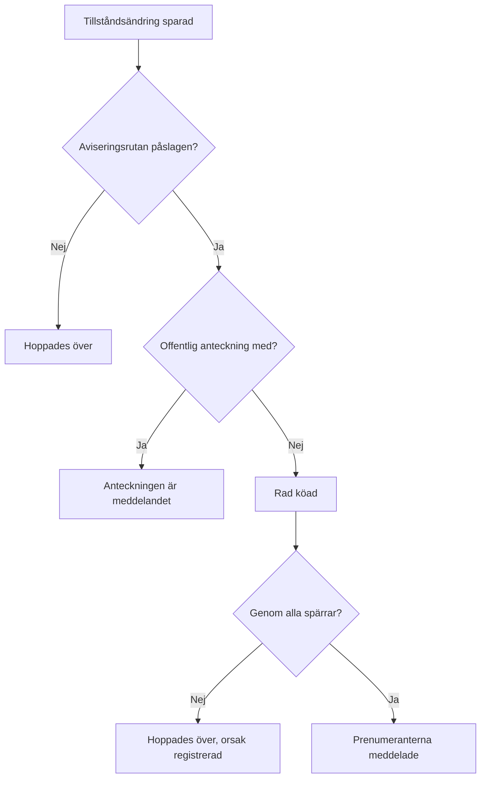

# Incidentstatusar och allvarlighetsgrader

Varje incident har två klassificeringar: ett **tillstånd** som säger var den befinner sig i din insats, och en **allvarlighetsgrad** som säger hur ont den gör. Den här sidan förklarar vad varje tillstånd gör, hur du lägger till egna och hur allvarlighetsgrader rangordnas — för alla som konfigurerar incidenter, eller som vill veta varför en incident larmade eller inte, löstes eller inte, eller visades på en statussida eller inte.

:::cards
- [Lägg till egna tillstånd](#lägg-till-egna-tillstånd): Forma din insats och se vad varje tillstånd räknas som.
- [Vad bekräftelse gör](#vad-bekräftelse-gör): Larmningen stoppas och SLA:n markeras som besvarad.
- [Vad lösning gör](#vad-lösning-gör): Monitorerna släpps och SLA:n stängs.
- [Meddela prenumeranterna](#meddela-statussidans-prenumeranter-om-en-tillståndsändring): Spärrarna som en tillståndsändring passerar innan en statussida får höra om den.
:::

## Så fungerar det

I instrumentpanelen liknar tillstånd och allvarlighetsgrader varandra — båda visas som färgade märken i listan över incidenter och som en färgad prick före namnet överallt där du väljer en, och båda är listor i projektet som du kan byta namn och färg på. De gör väldigt olika jobb.

Tillstånd styr beteendet. Tre booleska flaggor på tillståndens rader avgör, tillsammans med tillståndens ordning, vilka incidenter som räknas som aktiva, vilka knappar som visas i incidentens rubrik, när SLA-klockan stannar och när incidenten försvinner från din statussida. Allvarlighetsgrader styr ingenting själva — de är etiketter som beskriver påverkan, och som andra regler kan matcha mot.

```mermaid title="Incidenter rör sig bara nedåt i listan; var ett tillstånd står avgör vad det räknas som"
flowchart TB
    subgraph open["Räknas som inte bekräftad"]
        identified["Identified"]
    end
    subgraph working["Räknas som bekräftad"]
        acknowledged["Bekräftad"]
        mitigated["Mitigated (eget)"]
    end
    subgraph done["Räknas som löst"]
        resolved["Löst"]
        closed["Closed (eget)"]
    end
    identified --> acknowledged
    acknowledged --> mitigated
    mitigated --> resolved
    resolved --> closed
    identified -. "hoppa över" .-> resolved
```

Modellen `IncidentState` har `name`, `description`, `color` och `order`, plus tre booleans: `isCreatedState`, `isAcknowledgedState` och `isResolvedState`. Allt som produkten gör med tillstånd utgår från de booleans och från `order` — aldrig från tillståndets namn. Därför kan du byta namn på **Löst** till "Closed" utan att något går sönder: flaggan följer med raden.

Modellen `IncidentSeverity` har `name`, `description`, `color` och `order` och inget annat. Det finns inga flaggor. Inget i OneUptime behandlar av sig självt **Critical Incident** annorlunda än **Minor Incident** — allvarlighetsgraden spelar bara roll där du riktar något mot den, som matchningskriteriet **Incident Allvarligheter** i en jourregel.

Några snabba regler:

- **Välj allvarlighetsgrad för att kommunicera påverkan** — den visas i listan över incidenter och på incidentens **Översikt**, och den är ett obligatoriskt fält när du deklarerar en incident.
- **Välj tillstånd för att forma din process** — stegen i insatsen som du faktiskt går igenom, i den ordning du går igenom dem.
- **Lägg inte in brådska i tillstånd** — ett tillstånd som heter "Critical" larmar ingen. Det gör allvarlighetsgraden tillsammans med en jourregel.

> [!TIP]
> Båda listorna skapas när ditt projekt skapas, och båda redigeras under **Incidenter → Inställningar**. Det avsnittet av sidomenyn för Incidenter är hopfällt som standard, så fäll ut **Inställningar** innan du letar efter dem.

## De förskapade tillstånden

Tre tillstånd skapas med projektet, i den här ordningen. Skapandet är idempotent — ett tillstånd läggs bara till när det inte redan finns ett med det namnet.

| Tillstånd        | `order` | Flagga                | Färg      | Vad det betyder                                    |
| ---------------- | ------- | --------------------- | --------- | -------------------------------------------------- |
| **Identified**   | `1`     | `isCreatedState`      | `#fd625e` | Tillståndet som nya incidenter hamnar i.           |
| **Bekräftad**    | `2`     | `isAcknowledgedState` | `#ffbf53` | Någon har tagit incidenten.                        |
| **Löst**         | `3`     | `isResolvedState`     | `#2ab57d` | Incidenten är över och slutar räknas som aktiv.    |

> [!NOTE]
> Det första tillståndet heter **Identified**, även om flera beskrivningar i produkten fortfarande kallar det "created"-tillståndet. När ett dokument eller en verktygstips säger "skapandetillstånd" menas tillståndet som har `isCreatedState` — i ett nytt projekt är det **Identified**.

## Vad varje tillståndsflagga faktiskt gör

| Flagga                | Syfte                                                                                                                                                                                                |
| --------------------- | ---------------------------------------------------------------------------------------------------------------------------------------------------------------------------------------------------- |
| `isCreatedState`      | Tillståndet som en incident får när ingen har valt något. Har inget tillstånd i projektet den här flaggan misslyckas skapandet av en incident med ett fel som ber dig lägga till ett skapandetillstånd för incidenter från inställningarna. |
| `isAcknowledgedState` | Markerar projektets bekräftade tillstånd: det som **Bekräfta** flyttar en incident till och som nyckeltalsrutan för bekräftelse är uppkallad efter. En incident i det, i ett senare tillstånd, eller löst, är bekräftad — **Bekräfta** erbjuds inte längre för den, jouren slutar larma för den, och dess SLA markeras som besvarad. |
| `isResolvedState`     | Markerar projektets lösta tillstånd: det som **Lös** flyttar en incident till och som nyckeltalsrutan för lösning visar. En incident i det, eller i ett senare tillstånd, är löst — den försvinner från **Aktiva incidenter** och från den aktiva delen av en statussida, och dess SLA markeras som löst. |

Bara ett tillstånd per projekt förväntas ha varje flagga — uppslagen hämtar det första i ordningen. De tre tillstånden med flaggor har märket **Inbyggd** på inställningssidan; håll muspekaren över det (eller tabba till det) för att läsa vad OneUptime gör med tillståndet. De kan byta namn och färg och dras, men:

- **De behåller sin ordning.** Skapandetillståndet kommer före det bekräftade, och det bekräftade före det lösta. En dragning som skulle bryta det — **Löst** ovanför **Bekräftad** till exempel — avvisas, raderna går tillbaka, och sidan säger varför.
- **De kan inte tas bort.** Deras **Ta bort** finns kvar i radens meny, låst, med orsaken. En massborttagning hoppar över dem och nämner dem som inte borttagna. API:t vägrar också att ta bort ett projekts sista skapande-, bekräftade eller lösta tillstånd.

Eftersom gränssnittet läser tillståndsnamn dynamiskt ändrar ett namnbyte det du ser överallt — nyckeltalsrutorna (**Acknowledged in** och **Resolved in** med de förskapade namnen), bekräftelsen **Markera incident som …** för ett eget tillstånd och märket i listan över incidenter följer alla namnet som du gav raden.

## Lägg till egna tillstånd

Ett tillstånd som du lägger till är ett steg i din insats som de tre förskapade inte nämner: "Investigating", "Mitigated", "Monitoring", "Closed".

:::steps
### Öppna listan över tillstånd

Gå till **Incidenter → Inställningar → Incidentstatus**. Kortet **Incident Tillstånd** visar dina tillstånd i deras ordning, en rad var: ett grepp att dra det i, dess färg och namn, vad en incident i det **Räknas som**, och dess beskrivning. Meningen under titeln säger det rakt ut: incidenter rör sig bara nedåt i den här listan.

### Skapa tillståndet

Klicka på **Skapa Incidentstatus** i kortets rubrik och fyll i formuläret (fälten nedan). Det nya tillståndet läggs till **precis ovanför det lösta tillståndet** — där de flesta tillstånd hör hemma, och aldrig under det, där det tyst skulle räknas som löst.

### Dra det på plats

Dra en rad i dess grepp för att flytta den. Den nya ordningen sparas när du släpper; det finns inget ordningsnummer att skriva. Med tangentbordet sätter du fokus på greppet, trycker på mellanslag, flyttar med piltangenterna och trycker på mellanslag igen. Kolumnen **Räknas som** uppdateras när du släpper raden.
:::

**Redigera** öppnar samma formulär som skapandet. Tillståndets ID finns under **Visa ID** i radens meny.

| Fält            | Obligatoriskt | Vad det gör                                                                                                                                                                                                                                                    |
| --------------- | ------------- | -------------------------------------------------------------------------------------------------------------------------------------------------------------------------------------------------------------------------------------------------------------- |
| **Namn**        | Ja            | Minst två tecken. Platshållaren föreslår något i stil med "Investigating".                                                                                                                                                                                     |
| **Beskrivning** | Nej           | Fri text som förklarar när en incident står i det här tillståndet.                                                                                                                                                                                             |
| **Färg**        | Ja            | Redan vald när formuläret öppnas: en färg som inget av tillstånden i listan använder än, så att ett nytt tillstånd aldrig får samma röda färg som det ovanför. Välj en annan från raden med namngivna färger (Röd, Orange, Limegrön, Grön, Blågrön, Blå, Indigo, Lila, Magenta, Rosa), eller använd **Anpassad färg** för en exakt varumärkesfärg som `#fd625e`. |

Färgen färgar tillståndets märke och pricken före dess namn i varje tillståndsväljare: deklarations- och mallformulären, massåtgärden **Ändra tillstånd**, rubrikens tillståndsmeny och villkoren i regler och filter. Var och en av de väljarna visar tillstånden i den ordning som den här sidan sätter dem i.

Du kan inte sätta de tre flaggorna från det här formuläret — de hör till de förskapade raderna. Ett tillstånd som du lägger till är därför ett tillstånd utan flagga, vilket har tre konsekvenser som är värda att planera för:

- **Var det står avgör vad det räknas som.** Kolumnen **Räknas som** visar det och ändras medan du drar: ovanför det bekräftade tillståndet är en incident i det **Inte bekräftad**; från det bekräftade tillståndet och nedåt räknas den som **Bekräftad**, så jourpolicyerna slutar eskalera den; från det lösta tillståndet och nedåt räknas den som **Löst**, så statussidor slutar visa den som aktiv.
- **Ovanför det lösta tillståndet håller det incidenten aktiv.** **Aktiva incidenter** innehåller incidenterna vars aktuella tillstånd står ovanför det lösta tillståndet, så ett tillstånd som du lägger till där håller incidenten kvar i den aktiva listan och i räknaren i sidofältet. Ett tillstånd som har dragits under det lösta tillståndet räknas som löst överallt — i de aktiva listorna, på statussidor, i påminnelser och för SLA:n — och att flytta en incident in i det från **Löst** är inte en andra lösning.
- **Du flyttar in en incident i det från rubrikens meny.** Rubrikens knappar är bara **Bekräfta** och **Lös**; ett eget tillstånd finns under **Change state to** i menyn **⋯** bredvid dem, som visar varje tillstånd efter det aktuella. Dess bekräftelse heter **Markera incident som `<state name>`**, med en skicka-knapp **Markera som `<state name>`**.

> [!TIP]
> En vanlig form är ett lindringssteg mellan det bekräftade och det lösta tillståndet — skapa "Mitigated", så hamnar det precis ovanför **Löst**, efter **Bekräftad**, och räknas som bekräftat. För ett triagesteg innan någon har bekräftat incidenten drar du det ovanför **Bekräftad**.

## Ordningen är en verklig begränsning, inte en visningspreferens

Ordningen upprätthålls när en tillståndsändring skrivs, inte bara när listan ritas:

- **Övergångar bakåt avvisas.** Att flytta en incident till ett tillstånd som står tidigare i ordningen än dess nuvarande misslyckas med ett fel som nämner båda tillstånden.
- **Att välja det aktuella tillståndet igen avvisas.** Att sätta en incident i det tillstånd den redan är i misslyckas med "Incident state cannot be same as previous state."
- **En bakåtdaterad rad kan inte upprepa sin granne.** Att infoga en tidslinjerad vars tillstånd är samma som raden efter den avvisas också.
- **Rubrikens knappar följer de flaggade tillståndens plats i ordningen.** **Bekräfta** och **Lös** erbjuds utifrån var det aktuella tillståndet står i den sorterade listan. Ett eget tillstånd som är placerat *efter* det lösta tillståndet visar aldrig en knapp **Lös**, eftersom en incident i det redan räknas som löst.

Så när du lägger till ett tillstånd, placera det där en incident verkligen skulle passera det. Att ordna det fel ser inte bara konstigt ut — det gör övergångar omöjliga. Att flytta ett tillstånd längre ner ändrar vad incidenterna som redan är i det räknas som, i samma ögonblick som du släpper det.

Via API:t och Terraform är ordningen kolumnen `order`: lägre tal kommer först. Ett tillstånd som skapas utan hamnar precis ovanför det lösta tillståndet; ett som skapas eller uppdateras med ett tal tar den platsen, och tillstånden i vägen flyttar ner ett steg. Tal som ingen annan har behålls som de skrevs, så ett tillstånd som hanteras av Terraform läser tillbaka talet det fick.

## De förskapade allvarlighetsgraderna

Tre allvarlighetsgrader skapas med projektet, i den här ordningen, den allvarligaste först:

| Allvarlighetsgrad     | `order` | Färg      | Förskapad beskrivning                                                                                                                                                                     |
| --------------------- | ------- | --------- | ----------------------------------------------------------------------------------------------------------------------------------------------------------------------------------------- |
| **Critical Incident** | `1`     | `#b70400` | Issues causing very high impact to customers. Immediate response is required. Examples include a full outage, or a data breach.                                                          |
| **Major Incident**    | `2`     | `#fd625e` | Issues causing significant impact. Immediate response is usually required. We might have some workarounds that mitigate the impact on customers. Examples include an important sub-system failing. |
| **Minor Incident**    | `3`     | `#ffbf53` | Issues with low impact, which can usually be handled within working hours. Most customers are unlikely to notice any problems. Examples include a slight drop in application performance. |

Allvarlighetsgraden är obligatorisk när du deklarerar en incident, och den är obligatorisk i varje incidentspecifikation i en monitors kriterier, så varje incident — manuell eller automatisk — kommer med en. Se [Deklarera en incident](/docs/incidents/declaring-incidents) för deklarationsflödet och [Incident- och varningsmallar](/docs/monitor/incident-alert-templating) för vägen via monitorer.

## Redigera allvarlighetsgrader

Gå till **Incidenter → Inställningar → Incidentallvar**. Samma form som tillståndssidan — en rad per allvarlighetsgrad, den allvarligaste först, dra en rad för att ändra dess rang, **Skapa Incidentallvar** lägger till en sist (den minst allvarliga), med **Namn**, **Beskrivning** och **Färg** på formuläret, färgen redan vald som på tillståndsformuläret.

Rangen spelar roll överallt där OneUptime jämför allvarlighetsgrader: en episod tar allvarlighetsgraden från sin allvarligaste incident, och Critical och Warning i en rekommendation för en monitor motsvarar din första och andra allvarlighetsgrad.

Två skillnader mot tillstånd:

- **Det finns inget skydd mot borttagning.** Vilken allvarlighetsgrad som helst kan tas bort, även de tre förskapade.
- **Det finns inga flaggor att ärva och inget "Räknas som".** En ny allvarlighetsgrad beter sig exakt som de förskapade — den är en etikett med en färg och en rang.

Där allvarlighetsgraden gör mer än att beskriva: under **Incidenter → Regler → Jourregler** är en regels fält **Incident Allvarligheter** ett matchningskriterium. Att ange **Critical Incident** där är hur "larma databasteamet vid allt kritiskt" uttrycks — jourpolicyn sitter på regeln, inte på allvarlighetsgraden.

**Att ändra en incidents allvarlighetsgrad** — under **Redigera** på incidentens kort **Incidentdetaljer**, via API:t eller Terraform (`incidentSeverityId`), med ett arbetsflöde eller med AI-verktygen — gör samma fyra saker oavsett hur det skickas: incidentens flöde får en post **Incident updated** som nämner den nya allvarlighetsgraden, incidentens SLA-tidsgränser räknas om, dess påminnelseregel matchas igen, och incidentmåtten räknar en ändring av allvarlighetsgrad. Att spara den allvarlighetsgrad som incidenten redan har gör ingen av dem, så redigerar du bara titeln på en incident förblir dess SLA-tidsgränser, påminnelser och antal ändringar av allvarlighetsgrad som de var. Ett larms allvarlighetsgrad fungerar på samma sätt för dess flödespost och dess påminnelser.

## Flytta en incident genom dess tillstånd

Det finns fyra sätt som en incident byter tillstånd på:

| Sätt                | Var                                                                                         | Vad det frågar efter                                                                                                                                                                                         |
| ------------------- | ------------------------------------------------------------------------------------------- | ------------------------------------------------------------------------------------------------------------------------------------------------------------------------------------------------------------ |
| **Knappar i rubriken** | Incidentens rubrik: **Bekräfta** och **Lös**, och **Change state to** i dess meny **⋯**  | En kort bekräftelse — **Bekräfta incident** eller **Lös incident** — med **Meddela statussideprenumeranter** och, hopfällt under **Lägg till en offentlig anteckning**, den valfria **Offentlig anteckning** med väljaren **Välj anteckningsmall** (när projektet har anteckningsmallar). |
| **Tillståndstidslinje** | **Tillståndstidslinje** i incidentens sidomeny                                          | En rad som läggs till för hand, med **Incidentstatus**, **Börjar den** och **Meddela statussideprenumeranter**.                                                                                             |
| **Massändring**     | **Ändra tillstånd** på ett urval i listan över incidenter                                   | En sida med tillståndet, **Meddela statussideprenumeranter** och samma hopfällda **Lägg till en offentlig anteckning**.                                                                                     |
| **Automatiskt**     | Ett monitorkriterium eller din egen kod                                                     | Ett kriterium med **Lös incident automatiskt** påslaget löser sin incident när kriteriet inte längre uppfylls. API:t ändrar tillståndet genom att skapa en rad på `/api/incident-state-timeline`.            |

Står det aktuella tillståndet före det bekräftade tillståndet erbjuder rubriken **Bekräfta** och **Lös**; står det mellan de två, bara **Lös**. Bekräftelse stoppar också all eskalering från jouren för incidenten.

Var och en av dem skriver en tidslinjerad. En tillståndsändring gör också några saker som du inte behöver be om: den skriver en post i incidentens flöde, tilldelar en Incidentansvarig om incidenten inte har någon än, och uppdaterar SLA-klockan. Att öppna en löst incident igen startar en ny SLA-post från tidpunkten då den öppnades igen.

## Vad bekräftelse gör

En incident är bekräftad från det ögonblick den går in i ditt bekräftade tillstånd, i ett senare tillstånd — ett tillstånd **Mitigated** eller **Investigating** som du har placerat under **Bekräftad** — eller i ett löst tillstånd, vilket av de fyra sätten ovan som än flyttar den. Kolumnen **Räknas som** på inställningssidan för tillstånd visar vilka tillstånd det är. När den är bekräftad:

- **Bekräfta erbjuds inte längre.** Inte i incidentens rubrik, inte i mobilappen (dess knapp och dess svepning), inte i Slack eller Microsoft Teams och inte via `acknowledge_incident` på OneUptime MCP-servern. Att bekräfta den ändå — från en larmsida, Slack eller Teams — avvisas med "Incident is already acknowledged." (eller "Incident is already resolved."), i stället för att flytta den uppåt i listan igen.
- **Jouren slutar larma för den.** En jourhavande som bekräftar sitt larm efter att en kollega har bekräftat incidenten, eller flyttat den vidare, får sitt larm bekräftat, och incidenten stannar där den är.
- **SLA:n markeras som besvarad** vid den första sådana flytten; att gå vidare genom senare tillstånd behåller den tidpunkten.
- **Tiden till bekräftelse löper till den första flytten** — nyckeltalsrutan på incidentens **Översikt**, måttet **Time to Acknowledge**, en mätning som slutar när **Incidenten bekräftas**, och MTTA i sammanfattningarna i Slack och Microsoft Teams. En incident som gick direkt från **Identified** till **Investigating** bekräftades då; en som löstes direkt bekräftades när den löstes.
- **Ett filter Bekräftad** — på en instrumentpanels widget med en incidentlista till exempel — visar incidenterna i ditt bekräftade tillstånd och i varje senare tillstånd, fram till löst.

Larm och episoder följer samma regel, med dina larmtillstånd.

## Vad lösning gör

En incident är löst när den går från ett tillstånd ovanför ditt lösta tillstånd in i det lösta tillståndet, eller in i ett senare tillstånd — vilket av de fyra sätten ovan som än flyttar den. Varje lösning:

- **Släpper monitorerna som incidenten håller.** En incident som deklareras öppen håller sina monitorer: den satte dem i sin status från **Ändra övervakningsstatus till**, när den nämner en, och pausade, när den deklarerades för hand, deras övervakning. En redigering medan den är öppen — att lägga till monitorer eller ändra den statusen — får den också att hålla dem. Lösningen återupptar deras övervakning och sätter tillbaka dem till drift, om inte en annan öppen incident fortfarande ligger på dem, och från och med då håller incidenten ingenting. Så en incident som deklareras redan löst släpper ingenting, och det gör inte heller en andra lösning efter att den öppnats igen: en status som dess monitorer fick under tiden — från sina sonder, från underhåll eller satt för hand — står kvar.
- **Markerar SLA:n som löst** och skriver, när OneUptime AI:s utkast till efteranalyser är påslagna, ett utkast till en efteranalys.

Att gå vidare från **Löst** till ett senare tillstånd — **Closed** till exempel — är inte en andra lösning: inget av detta körs igen, och ingen ny SLA startar. En incident som deklarerades innan OneUptime började registrera detta släpper sina monitorer vid sin nästa lösning, som tidigare.

## Tillståndstidslinjen

Incidentens sida **Tillståndstidslinje** i incidentens sidomeny är granskningsspåret för varje tillstånd som incidenten har varit i. Kortet på den sidan heter **Statustidslinje**, och det är sorterat med de senaste först.

| Kolumn                             | Vad den visar                                                                                                                                                                                                                                                  |
| ---------------------------------- | -------------------------------------------------------------------------------------------------------------------------------------------------------------------------------------------------------------------------------------------------------------- |
| **Incidentstatus**                 | Ett färgat märke med tillståndets namn och färg.                                                                                                                                                                                                               |
| **Börjar den**                     | När incidenten gick in i det här tillståndet.                                                                                                                                                                                                                  |
| **Slutar den**                     | När den lämnade det. Det aktuella tillståndet visar `Currently Active`.                                                                                                                                                                                        |
| **Varaktighet**                    | Tiden i tillståndet, för det aktuella räknat fram till nu.                                                                                                                                                                                                     |
| **Prenumerantaviseringsstatus**    | Om statussidans avisering för den här ändringen skickades, hoppades över eller fortfarande väntar, med en länk **mer information**, och — när utskicket misslyckades — en åtgärd **Försök igen**. **Försök igen** skickar tillståndsändringen igen till varje statussida som incidenten når nu, även till prenumeranterna som redan har fått den. |

Varje rad har två åtgärder:

- **Visa orsak** — öppnar en dialog **Rotorsak** som visar den Markdown som registrerades med tillståndsändringen.
- **Visa loggar** — öppnar en dialog som förklarar varför statusen ändrades, med en vy **Incidenttillståndslogg**.

I instrumentpanelen kan tidslinjerader läggas till och tas bort, men inte redigeras; en incident behåller alltid minst en rad. Via API:t kan en rads `startsAt` rättas, och varje mätning som räknas fram från tidslinjen följer med.

> [!WARNING]
> Att ta bort fel rad skriver om incidentens historik, så använd det som ett verktyg för rättelser och inte som en vana för städning.

## Listan Aktiva incidenter

**Incidenter → Aktiva incidenter** är listan som du håller koll på under ett jourpass. Dess definition är exakt ett villkor: incidentens aktuella tillstånd står ovanför ditt lösta tillstånd — det första tillståndet i ordningen med flaggan `isResolvedState`. Inget annat tas med i beräkningen — inte allvarlighetsgraden, inte åldern, inte om någon har bekräftat den.

Posten i sidomenyn har ett rött märke med en räknare som använder samma fråga, så märket och listan är alltid överens. Finns det inget att se, säger sidan det.

Den praktiska följden: ett eget tillstånd som du lägger till ovanför det lösta tillståndet håller incidenter kvar i den här listan — "Mitigated" är inte "klart" — och ett som du placerar efter det tar ut dem, som det lösta tillståndet gör. Larm och episoder följer samma regel med sina egna tillstånd, och räknarna i sidomenyn, påminnelserna, statussidorna och mobilappen läser alla den.

## Meddela statussidans prenumeranter om en tillståndsändring

En tillståndsändring kan meddela dina statussidors prenumeranter, men den passerar flera spärrar. Att förstå dem sparar mycket felsökning av typen "varför fick ingen något meddelande".



Avisering begärs per tidslinjerad med **Meddela statussideprenumeranter** (`shouldStatusPageSubscribersBeNotified`), kryssrutan i dialogen för tillståndsändringar och på det manuella tidslinjeformuläret. I dialogen för tillståndsändringar börjar den avstängd när incidenten deklarerades utan att meddela prenumeranterna. Samma kryssruta avgör också om dialogens offentliga anteckning meddelar någon. När den är avstängd sparas raden med statusen överhoppad och en förklaring. När den är påslagen köas raden och ett bakgrundsjobb plockar upp den — jobbet körs varje minut, så leveransen är snabb men inte omedelbar.

**Raden i kön hoppas sedan över när något av detta gäller:**

- **Det nya tillståndet är skapandetillståndet.** Prenumeranterna meddelades redan när incidenten deklarerades, så den första tidslinjeraden skickar medvetet inte ett andra meddelande.
- **Incidenten har inga monitorer kopplade.** Utan resurser finns ingen statussida att koppla incidenten till.
- **Incidenten är inte synlig på statussidan** (`isVisibleOnStatusPage` är avstängd).
- **Statussidan har stängt av incidenter** (`showIncidentsOnStatusPage` är avstängd). Det här gäller per statussida — andra sidor som visar samma monitor meddelas fortfarande.
- **Statussidan ligger utanför incidentens omfång.** En incident som med **Begränsa till dessa statussidor** är begränsad till vissa statussidor meddelar bara de sidorna bland dem som visar dess monitorer, och en sida med **Visa bara incidenter som är begränsade till den här sidan** påslaget meddelas aldrig om en incident som inte är begränsad till den. Även detta gäller per statussida. Se [En statussida per målgrupp](/docs/status-pages/one-status-page-per-audience).

**En sak till som ändrar utfallet.** Skriver du en **Offentlig anteckning** i dialogen för tillståndsändringar (under **Lägg till en offentlig anteckning**) eller i massåtgärden **Ändra tillstånd** medan **Meddela statussideprenumeranter** är påslaget, markeras tidslinjeraden som redan meddelad i stället för att köas, och dess statusmeddelande säger att anteckningen bar den. Det är själva anteckningen som når prenumeranterna, så de får ett meddelande i stället för två. En anteckning med bara blanksteg publiceras inte, och raden köas som vanligt. Tillståndsändringar för schemalagt underhåll fungerar på samma sätt. Händelsetypen bakom det vanliga meddelandet om en tillståndsändring är `Subscriber Incident State Changed`.

**Anteckningen säger vad incidenten är nu.** Eftersom anteckningen är det enda meddelandet nämner den det nya tillståndet på varje kanal, som meddelandet om tillståndsändringen skulle ha gjort: e-postens ämne lyder `[Resolved Incident] <title>` och dess detaljer visar en rad **Status** i tillståndets färg, sms:et säger `Incident <title> on <status page> is Resolved.`, meddelanden i Slack och Microsoft Teams har en rad `**Status:** Resolved`, och webhookens payload `IncidentNoteCreated` har `incidentState` i `data`. En anteckning som publiceras för sig behåller sitt vanliga meddelande, och det gör även en redigerings uppdateringsavisering.

**Att publicera anteckningen kräver en egen behörighet.** Att ändra tillståndet och att publicera en offentlig anteckning är separata behörigheter (**Create Incident State Timeline** och **Create Incident Status Page Note** i en anpassad roll; de inbyggda incident- och projektrollerna har båda). Att ändra tillståndet kräver ingen behörighet att redigera incidenten: se [Ändra ett tillstånd](/docs/permissions/index#ändra-ett-tillstånd). Den som får ändra en incidents tillstånd men inte publicera offentliga anteckningar erbjuds inte **Lägg till en offentlig anteckning** i dialogen eller i massåtgärden **Ändra tillstånd**. En tillståndsändring som den personen skickar med en anteckning via API:t avvisas i sin helhet, med ett meddelande som säger att tillståndet inte ändrades och varför, så att en ändring aldrig registreras som meddelad av en anteckning som aldrig publicerades. Utelämna anteckningen, så går ändringen igenom. Larm, larmepisoder och incidentepisoder erbjuder i stället en privat anteckning med en tillståndsändring (**Lägg till en privat anteckning**), och den fungerar på samma sätt: att publicera den kräver anteckningens egen behörighet (**Create Alert Internal Note**, **Create Alert Episode Internal Note** eller **Create Incident Episode Internal Note** i en anpassad roll; de inbyggda larm-, incident- och projektrollerna har dem), och en tillståndsändring som skickas med en privat anteckning av någon utan den behörigheten avvisas i sin helhet, så att tillståndet inte ändras.

**Skickat betyder att varje prenumerant fick det skickat.** Jobbet väntar på varje meddelande och räknar det som skickat eller misslyckat, per statussida och kanal, och radens statusmeddelande nämner de antalen. Ett misslyckat meddelande, eller ett utskick som fick slut på tid eller avbröts, gör raden till **Misslyckades**. Se [Prenumeranter och meddelanden](/docs/status-pages/subscribers).

För vem som tar emot dem och hur mallarna väljs, se [Prenumeranter och meddelanden](/docs/status-pages/subscribers).

## Håll en incident borta från statussidan

Fyra separata saker avgör om en incident över huvud taget finns på en offentlig sida, och alla fyra måste vara sanna:

- **Visa incidenter** (`showIncidentsOnStatusPage`) på själva statussidan.
- **Synlig på statussidan** (`isVisibleOnStatusPage`) på incidenten — ett reglage på incidentens sida **Inställningar**. Det är sant som standard och finns inte i guiden för att deklarera; ett monitorkriterium kan sätta det med **Visa incident på statussida**. En incident som deklareras dold meddelar ingen prenumerant när den skapas; slår du på reglaget senare erbjuder redigeringsformuläret **Meddela prenumeranter att denna incident har skapats**. Se [Deklarera en incident](/docs/incidents/declaring-incidents).
- **Sidan är inom incidentens räckvidd.** Sidan visar någon av incidentens monitorer och är, om incidenten är begränsad till vissa statussidor, en av dem. En sida med **Visa bara incidenter som är begränsade till den här sidan** påslaget visar bara incidenterna som är begränsade till den. Se [En statussida per målgrupp](/docs/status-pages/one-status-page-per-audience).
- **Det aktuella tillståndet står ovanför det lösta tillståndet.** Det är det här som tar bort en incident från den aktiva delen: statussidans fråga hämtar incidenter vars aktuella tillstånd står ovanför ditt lösta tillstånd, så det lösta tillståndet och varje senare tillstånd tar bort incidenten. Du arkiverar eller stänger ingenting — du löser den, och den flyttar in i historiken.

**Privata incidenter visas aldrig.** Att slå på **Privat incident** döljer incidenten för alla statussidor, oavsett reglagen ovan, och begränsar den till dess ägare plus projektadministratörer och projektägare. Inget om den når heller en prenumerant på en statussida: inte dess skapande, inte dess tillståndsändringar, inte dess offentliga anteckningar och inte dess efteranalys. Bilderna i dess beskrivning, efteranalys, anpassade fält och offentliga anteckningar kan inte ses av alla medan den är privat.

De två reglagen hålls i takt, så att incidentens sida **Inställningar** alltid visar vad statussidorna gör:

- Att göra en incident privat stänger av **Synlig på statussidan** samtidigt.
- Att slå på **Synlig på statussidan** medan incidenten förblir privat lämnar det avstängt. För att publicera en privat incident stänger du av **Privat incident** och slår på **Synlig på statussidan** — i en sparning eller efter varandra.

Det här gäller hur incidenten än skrivs: instrumentpanelen, API:t, Terraform, ett arbetsflöde, en monitor, en incidentmall eller en sekretessregel. Ett värde som skickas som text, som `"true"`, räknas som `true`. En skrivning till många incidenter som slår på **Synlig på statussidan** — ett arbetsflödes **Update Many** till exempel — visar de som inte är privata och lämnar varje privat dold. Varje incident avgörs som den är när skrivningen når den, så en ändring av dess sekretess som landar i samma ögonblick blir aldrig överkörd: en incident sparas aldrig som både privat och synlig. En incident som skapas privat skapas dold och meddelar ingen prenumerant att den har skapats.

**Episoder följer samma regel.** En privat incidentepisod är dold för alla statussidor, vad dess reglage **Synlig på statussidan** än säger, och dess prenumeranter hör ingenting om den. På episodens sida **Inställningar** säger reglaget det och förblir avstängt medan episoden är privat. En privat incident tar aldrig med sin episod till en statussida: en episod når bara en sida genom incidenter som inte är privata.

:::details Uppgradera från en version utan de här reglerna
Incidenter och episoder som sparats som privata med **Synlig på statussidan** fortfarande påslaget från före de här reglerna får det avstängt när du uppgraderar. Inget skickas till någon. Bilderna som en sådan incident eller episod hade gjort synliga för alla görs privata igen, om inte något som dina statussidor visar fortfarande har dem i sig. Detsamma gäller bilderna i offentliga anteckningar på incidenter, episoder och schemalagda underhållshändelser som dina statussidor inte visar, och som tidigare förblev synliga för alla.
:::

Hur mycket löst historik sidan behåller är en inställning på statussidan, inte på incidenten. Se [Statussidans resurser och grupper](/docs/status-pages/resources-and-groups) för hur monitorer på sidan avgör vilka incidenter som över huvud taget visas.

## Nästa steg

:::cards
- [Deklarera en incident](/docs/incidents/declaring-incidents): Välj ett starttillstånd och en allvarlighetsgrad när du deklarerar.
- [Incidentanteckningar, ägare och flöde](/docs/incidents/notes-owners-and-feed): Publicera den offentliga anteckningen som följer med en tillståndsändring.
- [Incidentinställningar och automatisering](/docs/incidents/settings): Mät tiden mellan tillstånd och matcha allvarlighetsgrader i regler.
- [Prenumeranter och meddelanden](/docs/status-pages/subscribers): Vem som får meddelandena som en tillståndsändring skickar.
:::
