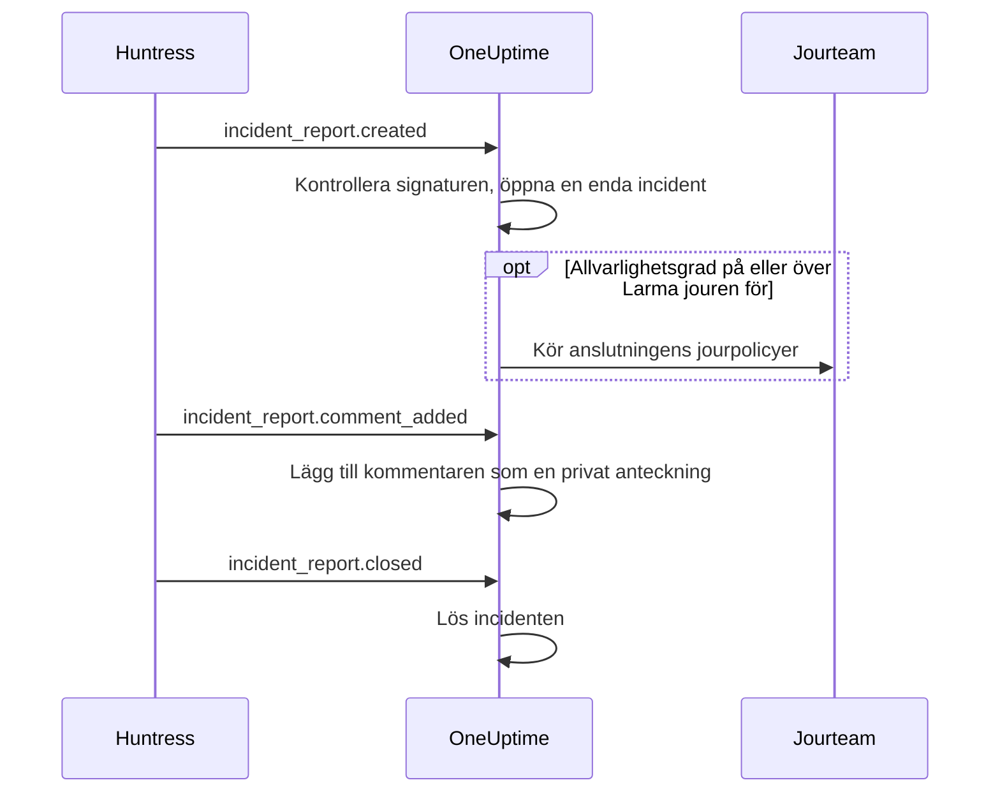

# Huntress-integration

Larma ditt jourteam för Huntress-incidentrapporter. När Huntress SOC skickar en incidentrapport om en slutpunkt eller en identitet öppnar OneUptime en enda incident för den, med den allvarlighetsgrad du väljer, larmar de jourpolicyer du väljer och löser incidenten när rapporten stängs i Huntress.

Den här integrationen är **inkommande**: Huntress skickar varje händelse om en incidentrapport till en webhook-URL som du får av OneUptime, signerad med slutpunktens signeringshemlighet. OneUptime anropar aldrig Huntress och behöver därför ingen API-nyckel för Huntress.

:::cards
- [Så fungerar det](#så-fungerar-det): Vad OneUptime gör med varje händelse om en rapport.
- [Konfigurera](#konfigurera-integrationen): Anslut i OneUptime, lägg till slutpunkten i Huntress, spara dess signeringshemlighet, skicka ett test.
- [Inställningar](#inställningar): Larm, allvarlighetsgrader, organisationer, etiketter och lösning.
- [Felsökning](#felsökning): Vad anslutningens fel betyder och vad du ska ändra.
:::

## Så fungerar det

Huntress skickar en händelse om en incidentrapport när rapporten skickas, när någon kommenterar den och när den stängs. Varje händelse innehåller hela rapporten.

1. **Kontrollera.** En förfrågan måste vara signerad med slutpunktens signeringshemlighet, högst fem minuter innan den kommer fram. Allt annat avvisas, och anslutningens sida säger varför.
2. **Öppna en enda incident.** Den första händelsen om en rapport öppnar en incident med rapportens namn, till exempel `Huntress: Incident on DESKTOP-01 (Acme Corp)`. Beskrivningen innehåller rapportens sammanfattning, dess allvarlighetsgrad i Huntress, organisationen, den berörda värden eller identiteten, de indikatorer Huntress hittade och en länk till rapporten i Huntress. Senare händelser om samma rapport, och leveranser som Huntress skickar igen, hittar den incidenten: en rapport öppnar aldrig två.
3. **Larma.** Incidenten öppnas med den incidentallvarlighetsgrad som anslutningen ger rapportens Huntress-allvarlighetsgrad. När den allvarlighetsgraden är på eller över **Larma jouren för** körs anslutningens **Jourpolicyer**.
4. **Följ rapporten.** En kommentar som läggs till i Huntress blir en privat anteckning på incidenten. När rapporten stängs eller avfärdas löses incidenten.

Incidenter som öppnas så visas aldrig på en statussida. Dina incidentregler (jour-, ägar-, etikett- och sekretessregler) gäller för dem som för alla andra incidenter.

## Innan du börjar

- I OneUptime rollen **Project Owner** eller **Project Admin**. Medlemmar, läsare och incidentrollerna ser anslutningen och rapporterna den tagit emot, men kan inte ändra den.
- I Huntress rollen **Account Admin**: bara kontoadministratörer kan lägga till webhooks.
- En jourpolicy att larma. Utan en öppnar rapporter incidenter och larmar ingen, om inte en jourregel för incidenter matchar dem.
- På en egen installation en OneUptime som Huntress når från internet över HTTPS: Huntress skickar bara webhooks till `https://`-URL:er.

## Konfigurera integrationen

:::steps
### Anslut Huntress i OneUptime

Öppna **Incidenter → Integrationer → Huntress** (`/dashboard/{projectId}/incidents/integrations/huntress`). Avsnittet **Integrationer** i incidenternas sidomeny är hopfällt som standard, så fäll ut det först. Klicka på **Anslut Huntress**.

Välj de **Jourpolicyer** som ska larmas. **Larma jouren för** frågar sedan vilka rapporter som larmar dem, och börjar på **Höga och kritiska rapporter**. Allt annat väntar under **Fler fält** med ett standardvärde (se [Inställningar](#inställningar)). Klicka på **Anslut Huntress**. Anslutningens sida öppnas, med ett kort **Anslut Huntress** som leder dig genom de tre nästa stegen.

### Lägg till en webhook-slutpunkt i Huntress

Klicka på **Kopiera webhook-URL** på anslutningens sida. URL:en ser ut som `https://oneuptime.com/api/huntress/webhook/<connection-id>`; på en egen installation börjar den med din egen värd.

Öppna menyn uppe till höger i Huntress och välj **Integrations**. Klicka på **Add an Integration**, välj **Webhooks** och klicka på **Add Endpoint**. Klistra in URL:en, slå på **Incident Reports** och spara. Låt **Escalations**, **Platform Actions** och **Account Notices** vara avstängda: OneUptime tar emot de händelserna och gör ingenting med dem.

### Spara slutpunktens signeringshemlighet

Öppna slutpunktens meny (⋯) i Huntress och välj **View Signing Secret**. Kopiera hela: den börjar med `whsec_`. Klicka på **Spara signeringshemlighet** på anslutningens sida, klistra in den och klicka på **Spara signeringshemlighet**. Hemligheten krypteras och visas aldrig igen.

Tills hemligheten är sparad avvisar OneUptime varje förfrågan till URL:en. Huntress skickar en avvisad händelse igen senare, så en händelse som avvisas nu kommer ändå fram.

### Skicka ett test

Öppna slutpunktens meny (⋯) i Huntress och välj **Send Test**. Inom några sekunder blir kortet på anslutningens sida **Anslutning**, med tillståndet **Tar emot rapporter**.

> [!NOTE]
> Vad testet än innehåller visar anslutningen att det kom fram. Ett test med en incidentrapport öppnar en incident som vilken rapport som helst, och larmar jouren om det är allvarligt nog.
:::

## Inställningar

**Anslut Huntress** frågar bara vem som larmas, och för vilka rapporter. Allt annat väntar under **Fler fält**, med ett standardvärde som passar de flesta team. Klicka på **Redigera inställningar** på anslutningens kort **Inställningar** för att ändra en inställning senare.

| Inställning | Vad den gör | Standard |
| --- | --- | --- |
| **Jourpolicyer** | Policyerna som körs när en rapport är allvarlig nog. Lämna tomt för att öppna incidenter utan att larma någon. | Inga |
| **Larma jouren för** | Vilka rapporter som larmar policyerna: **Endast kritiska rapporter**, **Höga och kritiska rapporter** eller **Alla rapporter**. Varje rapport öppnar en incident i vilket fall som helst. | **Höga och kritiska rapporter** |
| **Namn** | Vad anslutningen heter i OneUptime. | `Huntress` |
| **Allvarlighetsgrad för kritiska rapporter**, **Allvarlighetsgrad för höga rapporter**, **Allvarlighetsgrad för låga rapporter** | Den incidentallvarlighetsgrad som varje Huntress-allvarlighetsgrad öppnas med. | Dina tre högsta incidentallvarlighetsgrader, i ordning |
| **Endast dessa organisationer** | De Huntress-organisationer vars rapporter öppnar incidenter, ett organisationsnamn eller ID per rad. Namn skiljer inte på versaler och gemener. | Tomt: alla organisationer |
| **Etiketter** | Etiketter som läggs till varje incident, utöver den som har namnet på rapportens organisation. | Inga |
| **Lös när Huntress stänger rapporten** | Lös incidenten när dess rapport stängs eller avfärdas i Huntress. När det är avstängt anger en privat anteckning på incidenten det i stället. | På |

### Allvarlighetsgrader

Huntress ger varje incidentrapport en av tre allvarlighetsgrader. Om du inte väljer en incidentallvarlighetsgrad för någon av dem öppnas rapporten efter ordningen på dina incidentallvarlighetsgrader, så som **Incidenter → Inställningar → Incidentallvar** listar dem:

| Allvarlighetsgrad i Huntress | Vad Huntress menar med den | Incidentallvarlighetsgrad |
| --- | --- | --- |
| Critical | Angripare vid tangentbordet, farlig skadlig kod eller aktiv kompromettering, som ska begränsas omedelbart. | Den högsta |
| High | Bekräftad skadlig kod som kräver snabb åtgärd, eller kompromettering av en identitet som kräver handling. | Den andra |
| Low | Potentiellt oönskade program, rester av skadlig kod och äldre fynd om identiteter. | Den tredje |

Ett projekt med färre allvarlighetsgrader använder sin lägsta för resten. En rapport utan allvarlighetsgrad behandlas som hög. Om en allvarlighetsgrad du valt tas bort avgör ordningen igen.

### Organisationer

Varje incident får en etikett med namnet på rapportens Huntress-organisation, till exempel _Acme Corp_. En anslutning tar emot rapporterna från alla organisationer i ditt Huntress-konto, och **Endast dessa organisationer** begränsar det.

> [!TIP]
> För att larma varje kunds eget team lämnar du anslutningens **Jourpolicyer** tomma och lägger till en jourregel för incidenter per organisation, till exempel ”Om **Incidentetiketter** har någon av _Acme Corp_”, som kör kundens policy. Se [Jourregler för incidenter](/docs/incidents/settings#jourregler-för-incidenter).

## Rapporter på anslutningens sida

Anslutningens lista **Incidentrapporter** visar varje rapport som Huntress skickat, den senaste först: den berörda värden eller identiteten, dess allvarlighetsgrad och status i Huntress, och dess **Resultat**.

| Resultat | Vad som hände |
| --- | --- |
| **Incident öppnad** | Rapporten öppnade en incident. **Visa incident** öppnar den; **Jouren larmad** anger att anslutningen larmade sina policyer. |
| **Incident löst** | Huntress stängde rapporten, och dess incident löstes. |
| **Hoppades över: organisationen bevakas inte** | Rapportens organisation finns inte i **Endast dessa organisationer**. |
| **Hoppades över: redan stängd i Huntress** | Rapporten var redan stängd första gången OneUptime hörde om den. |

En rapport som hoppades över förblir överhoppad när du ändrar inställningarna senare. När **Lös när Huntress stänger rapporten** är avstängt behåller en stängd rapport resultatet **Incident öppnad**.

## Säkerhet

- **Endast signerade förfrågningar.** OneUptime kontrollerar rubrikerna `svix-id`, `svix-timestamp` och `svix-signature` som Huntress skickar mot förfrågans innehåll, precis som det kom fram. En förfrågan som inte är signerad med den sparade hemligheten, eller som signerades mer än fem minuter före eller efter, avvisas.
- **Hemligheten förblir hemlig.** Den lagras krypterad, returneras aldrig av API:et och visas aldrig igen. **Ersätt signeringshemlighet** på anslutningens sida sparar en annan, till exempel hemligheten för en ny slutpunkt.
- **URL:en är en adress, inte ett lösenord.** Den namnger anslutningen; bara en förfrågan som signerats med slutpunktens hemlighet behandlas.
- **En slutpunkt per anslutning.** Varje anslutning har sin egen URL och hemlighet. Anslut igen för att ta emot rapporterna från ett andra Huntress-konto.

## Använd e-post i stället

Huntress skickar också incidentrapporter med e-post, och en [övervakare för inkommande e-post](/docs/monitor/incoming-email-monitor) kan öppna incidenter från de e-postmeddelandena, till exempel när ämnet innehåller `Critical Incident Report`. Den behandlar dock e-postmeddelandena som en enda övervakares status: medan dess incident är öppen öppnar nästa rapport ingen, och incidenten löses av övervakarens kriterier i stället för när Huntress stänger rapporten. Huntress-anslutningen öppnar en incident per rapport och löser var och en med sin rapport, så välj den. Så snart anslutningen tar emot rapporter slutar du skicka e-postmeddelandena till övervakaren, annars larmar varje rapport två gånger.

## Felsökning

När OneUptime avvisar en förfrågan visar anslutningens sida orsaken under **Den senaste förfrågan avvisades**. I Huntress listar **View Delivery Attempts** i slutpunktens meny (⋯) varje leverans med OneUptimes svar.

:::details "A request arrived but was refused, because no signing secret is saved for this connection yet"
Spara slutpunktens signeringshemlighet: se [Konfigurera integrationen](#konfigurera-integrationen). Huntress skickar den avvisade förfrågan igen.
:::

:::details "The request's signature does not match the signing secret"
Den sparade hemligheten hör inte till den här slutpunkten. Varje slutpunkt har sin egen: öppna slutpunktens meny (⋯) i Huntress, välj **View Signing Secret**, kopiera hela och spara den med **Ersätt signeringshemlighet**.
:::

:::details "The request was signed more than five minutes from now"
Klockorna hos Huntress och på din OneUptime-server skiljer sig åt med mer än fem minuter, eller så är förfrågan en upprepning. På en egen installation kontrollerar du att serverns klocka går rätt.
:::

:::details "No Huntress connection has this address."
Anslutningen har tagits bort, eller så är slutpunktens URL i Huntress inte anslutningens. Klicka på **Kopiera webhook-URL** på anslutningens sida och klistra in URL:en i slutpunkten i Huntress igen.
:::

:::details "This project has no incident severities, so a Huntress report cannot open an incident"
Lägg till en under **Incidenter → Inställningar → Incidentallvar**. Huntress skickar rapporten igen.
:::

:::details Ingen larmades
En rapport under **Larma jouren för** öppnar en incident utan att larma någon. I listan **Incidentrapporter** anger **Jouren larmad** under en rapports resultat att anslutningen larmade. Incidentens sida **Jourexekveringar** visar vad varje policy gjorde.
:::

## Nästa steg

:::cards
- [Jourregler för incidenter](/docs/incidents/settings#jourregler-för-incidenter): Larma varje organisations eget team, via dess etikett.
- [Incidentstatusar och allvarlighetsgrader](/docs/incidents/states-and-severities): Ordna de allvarlighetsgrader som Huntress-rapporter öppnas med.
- [Eskaleringsregler](/docs/on-call/escalation-rules): Bestäm vem som larmas och när larmet går vidare.
- [Översikt över integrationer](/docs/integrations/index): De andra verktyg du kan ansluta.
:::
