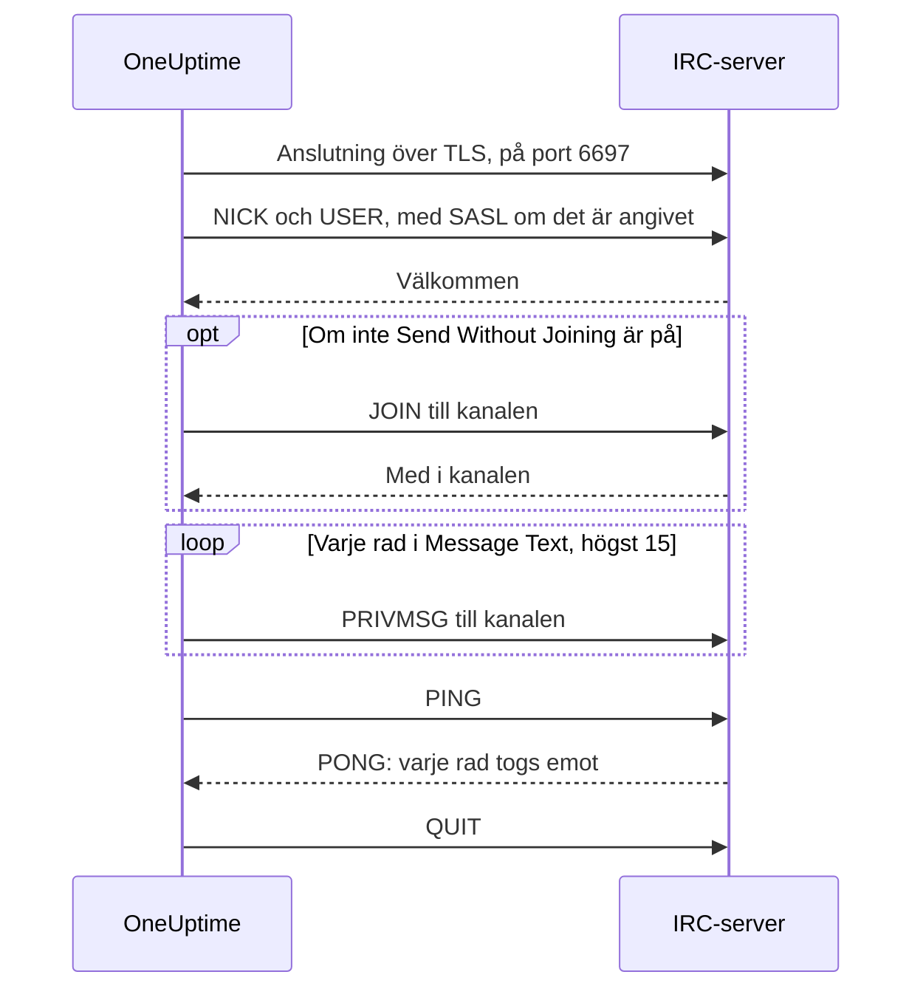

# IRC-integration

Posta incidentuppdateringar i en kanal i vilket IRC-nätverk som helst: Libera.Chat, OFTC eller en egen server.

IRC har inga webhooks, så OneUptimes arbetsflödessteg **Send Message to IRC** ansluter själv till servern, precis som vilken IRC-klient som helst. Det finns inget att installera och ingen app att registrera. Den här integrationen är **utgående**: OneUptime postar i kanalen och läser inte det som sägs där.

:::cards
- [Så fungerar det](#så-fungerar-det): Vad en körning av steget säger till servern.
- [Kom igång](#konfigurera-integrationen): Server och kanal, lösenord och sedan arbetsflödet: från mallen eller från grunden.
- [Tips](#tips): Posta utan att gå med, SASL, långa meddelanden och skurar.
- [Felsökning](#felsökning): Vad stegets fel betyder och vad du ska ändra.
:::

## Så fungerar det

Varje körning av steget för ett kort samtal med IRC-servern, som en IRC-klient skulle göra, och lägger sedan på.

1. **Ansluta.** Steget ansluter över TLS på port `6697` och kontrollerar serverns certifikat.
2. **Registrera sig.** Det registrerar sig som `OneUptime`, om du inte anger ett annat **Nickname**, och loggar in med SASL när **SASL Username** och **SASL Password** är ifyllda.
3. **Gå med.** Det går med i kanalen, om inte **Send Without Joining** är på, med **Channel Key** om kanalen har en.
4. **Skicka.** Varje rad i **Message Text** går ut som ett eget IRC-meddelande, en `PRIVMSG`.
5. **Bekräfta.** IRC säger aldrig ”levererat”, så steget skickar en `PING` och väntar på serverns `PONG`. En server svarar i ordning, så då har varje avvisning av meddelandet redan kommit.
6. **Avsluta.** Det lämnar servern.

Steget tar utgången **Framgång** så snart servern har tagit emot varje rad. Det tar **Fel**, med orsaken i serverns egna ord där den gav några, när servern inte går att nå eller när den avvisar anslutningen, nicknamet, ett lösenord, kanalen eller meddelandet.

## Innan du börjar

- På OneUptime Cloud planen **Growth** eller en högre: arbetsflöden och deras variabler ingår i den. Egenvärdade installationer utan fakturering har inga plangränser.
- En roll som bygger arbetsflöden: **Project Owner**, **Project Admin** eller **Workflow Admin**.
- Ett konto i IRC-nätverket, om det vill att du loggar in. Det vill Libera.Chat för anslutningar från vissa moln- och VPN-adresser.

## Konfigurera integrationen

:::steps
### Välj en server och en kanal

Bestäm vart meddelandena ska: serverns värdnamn, till exempel `irc.libera.chat`, och kanalen, till exempel `#your-channel`.

- **IRC Server** tar värdnamnet och inget annat: inget `ircs://` och ingen port. Steget ansluter över TLS på port `6697`. Tar din server emot TLS på en annan port anger du den i **Port**, under **Fler fält**.
- **Channel** måste vara en kanal. Ett nickname som skrivs där avvisas, så steget skickar aldrig ett privat meddelande till någon av misstag.

Servern måste vara en som OneUptime får ansluta till. Loopback-adresser (`localhost`, `127.0.0.1`), link-local-adresser och molnmetadataadresser avvisas alltid. På OneUptime Cloud avvisas även en server på en privat nätverksadress. En egenvärdad installation kan nå en IRC-server i sitt eget nätverk, om inte `DATA_SOURCE_BLOCK_PRIVATE_ADDRESSES` är satt till `true`.

### Spara lösenord som hemliga variabler

Hoppa över det här steget om din server, ditt nätverk och din kanal inte behöver något lösenord. Annars sparar du varje lösenord som en hemlig [global variabel](/docs/workflows/variables#globala-variabler). Då innehåller arbetsflödet variabelns namn i stället för lösenordet, och du ändrar lösenordet på ett ställe.

| Inställning         | Fyll i den när                                                                     | Variabel, till exempel |
| ------------------- | ---------------------------------------------------------------------------------- | ---------------------- |
| **Server Password** | Servern eller din bouncer ber om ett lösenord när du ansluter.                     | `IRC_SERVER_PASSWORD`  |
| **SASL Password**   | Nätverket vill att du loggar in på ditt konto. **SASL Username** tar kontots namn. | `IRC_SASL_PASSWORD`    |
| **Channel Key**     | Kanalen har en nyckel (läge `+k`).                                                 | `IRC_CHANNEL_KEY`      |

För att spara ett lösenord öppnar du **Arbetsflöden → Globala variabler** och klickar på **Skapa Arbetsflöde Variabel**. Skriv namnet i **Namn** och klicka på **Nästa**. Klistra in lösenordet i **Innehåll**, slå på **Hemlighet** och klicka på **Skapa Arbetsflöde Variabel**. Körningsloggar visar `[REDACTED]` i stället för värdet på en hemlig variabel.

### Bygg arbetsflödet

Börja från mallen, som bygger hela arbetsflödet åt dig, eller från grunden.

:::tabs
@tab Från mallen
1. Öppna **Arbetsflöden** och klicka på **Skapa arbetsflöde**.
2. Skriv `IRC` i **Sök mallar…**, klicka på **Tell IRC when an incident opens** och sedan på **Använd den här mallen**.
3. Behåll namnet **Notify IRC on new incident** eller ändra det, och klicka på **Nästa**.
4. Ange **IRC Server** och **IRC Channel** och klicka på **Skapa arbetsflöde**.

Arbetsflödet öppnas i **Byggare** med tre steg: **On Create Incident**; **Send Message to IRC**, som postar incidentens nummer, titel, allvarlighetsgrad och tillstånd på två rader; och ett **Logg**-steg på dess utgång **Fel**, som noterar varför ett meddelande inte levererades. Servern och kanalen sparas som arbetsflödets variabler `ircServer` och `ircChannel`. Om du sparade lösenord i föregående steg klickar du på **Send Message to IRC**, öppnar **Fler fält** och väljer varje variabel med knappen **{ }** i dess inställning.
@tab Från grunden
1. Öppna **Arbetsflöden**, klicka på **Skapa arbetsflöde**, välj **Börja från grunden**, ge arbetsflödet ett namn och klicka på **Skapa arbetsflöde**.
2. Klicka i **Byggare** på **Choose what starts this workflow** och välj **On Create Incident** under **Popular**. Klicka på utlösaren och välj i **Select Fields** de fält från incidenten som ditt meddelande visar, till exempel dess titel.
3. Klicka på **Lägg till komponent**, sök efter `irc` och klicka på **Send Message to IRC**. Koppla utlösarens utgång **Framgång** till steget.
4. Klicka på det nya steget och fyll i **IRC Server**, **Channel** och **Message Text**. Knappen **{ }** i **Message Text** infogar fält från incidenten, till exempel dess titel.
5. Om du sparade lösenord i föregående steg öppnar du **Fler fält**. Klicka på **{ }** i **Server Password**, **SASL Password** eller **Channel Key** och välj variabeln under **Global variables**. Skriv ditt kontos namn i **SASL Username**.
:::

### Slå på och testa

Slå på reglaget **Aktiverad** högst upp i **Byggare**. Från och med nu postas varje ny incident i kanalen.

För att testa utan att öppna en incident klickar du på **Kör arbetsflöde** och anger ID:t för en incident du redan har i **Incident-ID**. Incidentens sida visar dess ID. Klicka på **Run Workflow Manually** och bekräfta med **Run**. Panelen **Arbetsflödeskörning** följer körningen: IRC-stegets logg säger hur många rader det skickade, till exempel `Sent 2 lines to #your-channel.`, och meddelandet dyker upp i kanalen. Tar steget **Fel** i stället, säger dess logg varför: se [Felsökning](#felsökning).
:::

## Tips

- **Posta utan att gå med.** De flesta kanaler tar bara emot meddelanden från sina medlemmar (läge `+n`), så steget går med innan det postar och lämnar kanalen direkt efteråt. En kanal med `-n` tar emot meddelanden utifrån: slå på **Send Without Joining** under **Fler fält**, så ser kanalen inte steget komma och gå.
- **Logga in med SASL.** I nätverk som använder SASL, som Libera.Chat, fyller du i **SASL Username** och **SASL Password** för att logga in på ditt konto. Libera.Chat kräver det för anslutningar från vissa moln- och VPN-adresser. Se [Libera.Chats guide till SASL](https://libera.chat/guides/sasl).
- **Tänk på gränsen på 15 rader.** Varje rad i **Message Text** är ett eget IRC-meddelande, en lång rad delas så att den får plats och tomma rader hoppas över. Ett meddelande skickas som högst 15 IRC-rader: ett längre kortas av, och dess sista rad säger det. De fyra första raderna går iväg direkt och resten en per sekund, i den takt IRC-klienter håller, så 15 rader tar ungefär 11 sekunder.
- **Samla skurar i ett meddelande.** Varje körning är en egen anslutning, och IRC-nätverk begränsar hur ofta en adress får ansluta. En skur av körningar kan avvisas med en orsak som `Reconnecting too fast`, och tar **Fel** som vilken annan avvisning som helst. För ett arbetsflöde som kan köras många gånger i minuten samlar du det det har att säga i ett meddelande, eller skickar det via en egen server.
- **Formatera med IRC:s egna koder.** IRC har ingen Markdown, så texten skickas som den är skriven. IRC:s formateringskoder, som fetstil och färger, fungerar.
- **En server utan TLS.** Slå bara på **Disable TLS** för en server som inte erbjuder TLS: steget ansluter då på port `6667`, och varje lösenord skickas okrypterat. För att lita på en servers certifikat från din egen certifikatutfärdare anger en egenvärdad installation i stället `NODE_EXTRA_CA_CERTS`.
- **Ett annat nickname.** Meddelanden kommer från `OneUptime` om du inte anger **Nickname**. Är nicknamet upptaget lägger steget till ett understreck eller en siffra.

## Felsökning

När steget tar **Fel** säger körningsloggen varför, i en mening som börjar som en av de här.

:::details "The IRC server refused the connection"
Servern, eller din bouncer, avvisade anslutningen, och meddelandet slutar med orsaken. När servern vill ha ett lösenord säger meddelandet det: fyll i **Server Password**, eller kontrollera det.
:::

:::details "SASL sign-in failed"
Nätverket avvisade kontot eller lösenordet. Kontrollera **SASL Username** och **SASL Password**.
:::

:::details "Could not join #your-channel"
Kanalen avvisade steget, av den orsak som meddelandet anger. En kanal med en nyckel behöver den i **Channel Key**.
:::

:::details "Could not send to #your-channel"
Servern avvisade meddelandet, av den orsak som felmeddelandet anger. Med **Send Without Joining** påslaget tar kanalen kanske bara emot meddelanden från sina medlemmar: slå av det.
:::

:::details "The TLS certificate of the IRC server … is not trusted"
Serverns certifikat är inte ett som OneUptime litar på. En egenvärdad installation kan lita på sin egen certifikatutfärdare med `NODE_EXTRA_CA_CERTS`. Slå bara på **Disable TLS** för en server som inte erbjuder TLS.
:::

## Nästa steg

:::cards
- [Komponenter → IRC](/docs/workflows/components#irc): Varje inställning i steget och vad dess utgångar betyder.
- [Variabler](/docs/workflows/variables#globala-variabler): Hemliga globala variabler och hur steg använder dem.
- [Körningar](/docs/workflows/runs-and-logs): Läs vad varje körning av arbetsflödet gjorde.
- [Översikt över integrationer](/docs/integrations/index): Det utgående mönstret och de andra verktygen du kan ansluta.
:::
