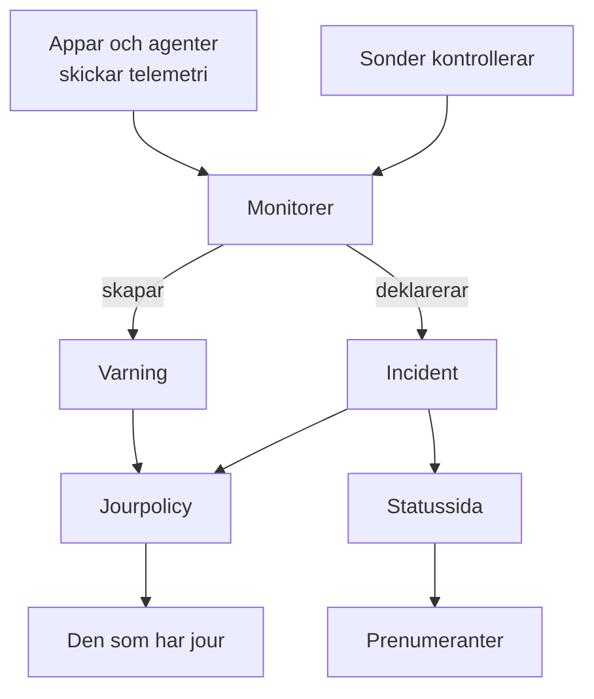

# Grundbegrepp

OneUptime har många produkter, men de vilar på en handfull idéer: projekt, monitorer, incidenter och varningar, jour, statussidor och telemetri. Den här sidan förklarar varje idé med några få meningar, visar hur de hänger ihop och länkar till sidorna som går igenom dem i detalj. Läs den en gång, så blir alla andra sidor i dokumentationen lättare att läsa.

:::cards
- [Projekt och personer](#projekt-och-personer): Var allt finns, och vem som får göra vad.
- [Monitorer och sonder](#monitorer-och-sonder): Hur OneUptime märker att något är fel.
- [Incidenter och varningar](#incidenter-och-varningar): Posten som ditt team arbetar utifrån.
- [Jour](#jour): Vem som larmas, hur, och vem som står på tur.
:::

## Så hänger delarna ihop

Ett problem rör sig i en riktning genom OneUptime. Sonder och din egen telemetri matar monitorer. En monitors kriterier avgör när något är fel och vad som öppnas: en incident, en varning eller båda. Jourpolicyer larmar personer om dem, och statussidor berättar för dina kunder om incidenter.

## Projekt och personer

Ett **projekt** rymmer allt: monitorer, incidenter, jourpolicyer, statussidor, telemetri och inställningar. De flesta företag behöver ett, och vissa har ett per miljö eller affärsområde. Inget som du skapar i ett projekt syns i ett annat.

Ditt **konto** är skilt från dina projekt. Ett konto, med en e-postadress och ett lösenord, kan tillhöra hur många projekt som helst; växla mellan dem med projektväljaren uppe till vänster. Se [Ditt konto](/docs/introduction/your-account).

Personer är med i ett projekt genom **team**, och ett teams behörigheter avgör vad dess medlemmar får göra. Varje nytt projekt börjar med tre team: Owners, med dig i, Admin och Members. På OneUptime Cloud har varje projekt sin egen plan.

:::cards
- [Användare, team och behörigheter](/docs/permissions/index): Bjud in personer och bestäm vad de får göra.
:::

## Monitorer och sonder

En **monitor** kontrollerar en sak som du kör och avgör om den fungerar. De flesta monitorer kontrolleras av **sonder**: maskiner som kör kontrollen enligt ett schema, till exempel genom att hämta en sida, anropa ett API, pinga en värd eller fråga en databas. OneUptime Cloud kör sonder i flera regioner, en självhostad installation kör sina egna, och du kan lägga till anpassade sonder i ditt nätverk. Andra monitorer läser i stället det du skickar: telemetrin från dina appar, eller data som en agent rapporterar från dina servrar, Kubernetes-kluster och övrig infrastruktur.

En monitors **kriterier** avgör vad varje resultat betyder. De kontrolleras i ordning, och det första som matchar kan ändra monitorns status, deklarera en incident, skapa en varning eller alla tre. Varje nytt projekt har tre monitorstatusar: **Fungerar**, **Försämrad** och **Offline**.

:::cards
- [Skapa en monitor](/docs/monitor/create-monitor): Välj en typ, säg vad som ska kontrolleras och hur ofta.
- [Anpassade probes](/docs/probe/custom-probe): Kontrollera det som bara ditt eget nätverk når.
:::

## Incidenter och varningar

Båda registrerar ett problem, och båda kan larma den som har jour. Skillnaden är vem problemet drabbar.

| | Incident | Varning |
| --- | --- | --- |
| **Vad det är** | Ett problem som drabbar dina användare, till exempel ett avbrott eller en fördröjning | Ett problem som ditt team bör titta på innan användarna drabbas |
| **På statussidor** | Kan visas, och meddelar prenumeranter | Aldrig |
| **Startstatusar** | **Identified**, **Bekräftad**, **Löst** | **Identified**, **Bekräftad**, **Löst** |
| **Startallvarlighetsgrader** | Critical Incident, Major Incident, Minor Incident | **High**, **Low** |

Att bekräfta en säger att någon tar hand om den, och hindrar dess jourpolicyer från att larma nästa nivå. Att lösa den stänger den. Du kan lägga till egna statusar och allvarlighetsgrader, och koppla varningar till incidenten som de visade sig höra till.

En **episod** samlar relaterade incidenter, eller relaterade varningar, så att ditt team hanterar dem som en. Grupperingsregler avgör vad som hör ihop.

:::cards
- [Incidenter – Översikt](/docs/incidents/index): Hur incidenter deklareras, hanteras och löses.
- [Länkade larm](/docs/incidents/linked-alerts): Koppla varningarna som ett avbrott utlöste till dess incident.
:::

## Jour

En **jourpolicy** avgör vem som larmas om en incident eller en varning, och vem som står på tur om ingen svarar. Dess **eskaleringsregler** är dess nivåer: varje nivå larmar sina personer och väntar sedan på att någon bekräftar innan nästa nivå larmas. En nivå kan larma personer, team eller ett **jourschema**, en rotation som hela tiden vet vem som har jour.

Hur varje person nås bestämmer de själva. I **Användarinställningar** sparar var och en sätten som OneUptime kan nå dem på, till exempel e-post, SMS, samtal, pushaviseringar, Slack eller Microsoft Teams, och vilka som används när de larmas.

:::cards
- [Eskaleringsregler](/docs/on-call/escalation-rules): Larma personer nivå för nivå tills någon svarar.
- [Jourscheman](/docs/on-call/schedules): Rotationer, lager och överlämningar.
:::

## Statussidor och underhåll

En **statussida** visar dina kunder om dina tjänster fungerar. Du väljer vilka monitorer den visar, under namn som dina kunder förstår. Medan en incident på någon av de monitorerna är aktiv visar sidan den, och dess **prenumeranter** får besked via e-post, SMS, Slack, Microsoft Teams eller webhook. En statussida kan vara offentlig, eller privat för dem du släpper in.

**Schemalagt underhåll** meddelar planerat arbete i förväg. En händelse går igenom **Schemalagd**, **Pågående**, **Avslutad** och **Slutförd**, och statussidorna som du visar den på berättar om den för besökare och prenumeranter.

:::cards
- [Statussidor – Översikt](/docs/status-pages/index): Skapa en statussida och bestäm vad den visar.
- [Prenumeranter och meddelanden](/docs/status-pages/subscribers): Vem som får besked, och när.
:::

## Telemetri

**Telemetri** är det som dina system skickar till OneUptime: loggar, mätvärden, spår, undantag och profiler. Appar skickar den med OpenTelemetry, och OneUptimes agenter skickar den från värdar, Kubernetes-kluster, Docker-värdar och övrig infrastruktur. Varje avsändare använder en **intagningsnyckel**, som skapas under **Projektinställningar → Telemetri och APM → Intagningsnycklar**. Du söker i telemetrin, visar den på instrumentpaneler och håller koll på den med telemetrimonitorer, som öppnar incidenter och varningar precis som alla andra monitorer.

:::cards
- [OpenTelemetry](/docs/telemetry/open-telemetry): Skicka loggar, mätvärden och spår från dina appar.
- [Loggövervakning](/docs/monitor/logs-monitor): Få veta när ett mönster dyker upp i dina loggar.
:::

## Automatisering och AI

- **Arbetsflöden** utför åtgärder när något händer, till exempel ett meddelande i Slack när en incident deklareras.
- **Runbooks** gör om en insatsrutin till steg som ditt team kan köra manuellt eller automatiskt.
- **OneUptime AI** undersöker nya incidenter och varningar och lägger ut vad den hittade på deras tidslinje, och **Ask AI** svarar på frågor om ditt projekt. Ett nytt projekt börjar med AI påslaget; reglaget **Aktivera AI** under **Projektinställningar → AI → AI Features** stänger av allt.

:::cards
- [Översikt över arbetsflöden](/docs/workflows/index): Automatisera åtgärder med utlösare och komponenter.
- [AI SRE](/docs/ai/ai-sre): Hur OneUptime AI undersöker incidenter och varningar.
:::

## Etiketter och ägare

**Etiketter** är märken som du sätter på monitorer, incidenter, statussidor och de flesta andra resurser, för att filtrera och gruppera dem. Ett teams behörigheter kan begränsas till resurser med vissa etiketter. **Ägare** är de personer och team som ansvarar för en resurs: de får besked när något händer med den. Etikettregler och ägarregler lägger till etiketter och ägare på nya resurser åt dig.

:::cards
- [Etikett- och ägarregler](/docs/configuration/label-and-owner-rules): Ge nya resurser etiketter och ägare automatiskt.
:::

## Nästa steg

:::cards
- [Snabbstart](/docs/introduction/quickstart): Använd idéerna i praktiken på femton minuter.
- [Startsida och kortkommandon](/docs/introduction/home): Hitta varje produkt i instrumentpanelen.
- [Skapa en monitor](/docs/monitor/create-monitor): Din första monitor, fält för fält.
- [Incidenter – Översikt](/docs/incidents/index): Vad som händer när en monitor har deklarerat en incident.
:::
