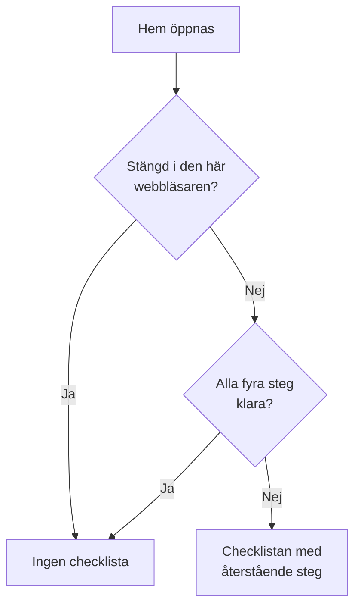

# Startsida och kortkommandon

Hem är den första sidan du ser i ett projekt. Den visar med en blick om något behöver dig just nu, och leder ett nytt projekt genom den första konfigurationen. Den här sidan förklarar vad Hem visar, hur du hittar vilken produkt, sida eller åtgärd som helst i instrumentpanelen, och kortkommandona som sparar dig turer genom menyerna.

:::cards
- [Vad Hem visar](#vad-hem-visar): Välkomstchecklistan, de fem rutorna och de aktiva incidenterna.
- [Hitta rätt](#hitta-rätt): Menyn Produkter och fälten högst upp på varje sida.
- [Sök](#sök-efter-en-sida-en-inställning-eller-en-åtgärd): Hitta vilken sida, inställning eller åtgärd som helst genom att skriva namnet.
- [Kortkommandon](#kortkommandon): Gå till Hem, Övervakare eller Incidenter med två tangenter.
:::

## Vad Hem visar

Öppna **Hem** i fältet högst upp, eller tryck `g` och sedan `h` var du än är. Uppifrån och ned visar Hem:

1. **Välkommen till OneUptime 👋**, en checklista för ett nytt projekt, tills den är klar.
2. Fem rutor som räknar det som behöver uppmärksamhet.
3. **Aktiva incidenter**, varje incident som inte är löst än.

### Välkomstchecklistan

Checklistan leder dig genom de fyra saker som ett projekt behöver innan det är användbart. Varje steg öppnar sidan där du gör det, och bockar av sig självt när projektet har det som steget ber om.

| Steg | Klart när | Öppnar |
| --- | --- | --- |
| **Skapa din första övervakare** | Projektet har en monitor. | Formuläret **Skapa monitor**, eller listan **Monitorer** för den som inte får skapa monitorer. |
| **Publicera en statussida** | Projektet har en statussida. | **Statussidor** |
| **Bjud in ditt team** | Någon förutom du finns i projektet, eller är inbjuden till det. | **Användare** |
| **Konfigurera en jourpolicy** | Projektet har en jourpolicy. | **Jourtjänst** |

Under stegen visar **Så fungerar OneUptime** de fyra kärnprodukterna i den ordning ett problem går igenom dem: **Monitorer**, **Incidenter och varningar**, **Jourtjänst** och **Statussidor**. Klicka på en för att öppna den.

Checklistan försvinner när alla fyra steg är klara. Klicka på **Stäng** för att dölja den tidigare. Det sparas i den här webbläsaren för det här projektet; allt som stegen öppnar finns kvar i menyn **Produkter**.

### Rutorna

Varje ruta räknar något, säger om det behöver dig och öppnar listan bakom siffran.

| Ruta | Vad den räknar | När siffran är noll |
| --- | --- | --- |
| **Aktiva incidenter** | Incidenter som inte är lösta | **Allt är i sin ordning** |
| **Aktiva varningar** | Varningar som inte är lösta | **Allt är i sin ordning** |
| **Icke-operativa monitorer** | Monitorer vars status inte är en fungerande status. Arkiverade monitorer räknas inte. | **Alla fungerar** |
| **Pågående underhåll** | Schemalagda underhåll som pågår | **Inget pågår** |
| **SLO:er i riskzonen** | Påslagna SLO:er som är i riskzonen eller har förbrukat sin felbudget | **Budgetarna är friska** |

En siffra över noll visar **Kräver uppmärksamhet**, eller **Pågår** och **Budgeten förbrukas** på rutorna för underhåll och SLO:er. Ett projekt utan monitorer ser **Inga monitorer ännu** på monitorrutan, och ett utan SLO:er ser **Inga SLO:er ännu**: ett tomt projekt är inte detsamma som ett friskt. De två rutorna öppnar då listorna **Monitorer** och **SLOs**, där du skapar en.

### Hems sidomeny

Sidomenyn bredvid Hem har samma listor, var och en med en siffra:

| Avsnitt | Sidor |
| --- | --- |
| **Incidenter** | **Aktiva incidenter** och **Aktiva episoder** |
| **Varningar** | **Aktiva varningar** och **Aktiva episoder** |
| **Monitorer** | **Ej operativ** |
| **Schemalagda händelser** | **Pågående** |

En episod samlar relaterade incidenter eller varningar, så att du hanterar dem som en. Se [Grundbegrepp](/docs/introduction/core-concepts#incidenter-och-varningar).

## Hitta rätt

Allt i OneUptime finns under **Produkter** i toppfältet. Menyn visar sina grupper som raderna i en enda lista och öppnas alltid med den första av dem, det grundläggande, utfälld: Övervakare, Incidenter, Varningar, Jourtjänst, Statussidor, Schemalagt underhåll och SLOs. Varje annan grupp (Observerbarhet, AI, Kod, Resurser, Infrastruktur, Instrumentpaneler och automatisering och Inställningar) är hopfälld till en rad i samma lista. Varje rad nämner gruppens produkter och säger hur många de är. Klicka på en rad för att fälla ut eller fälla ihop den, eller gå till den med piltangenterna och tryck på **Enter**.

- **Sökningen hittar allt.** Skriv i menyns sökruta för att hitta vilken produkt som helst efter namn, efter vad den gör eller efter ett välbekant ord som `k8s` eller `RUM`. Sökningen letar också i de hopfällda grupperna.
- **Du börjar där du är.** Gruppen för sidan du är på fälls ut av sig själv, och produkterna du nyligen har öppnat står överst.
- **Dina val ligger kvar.** Menyn kommer ihåg i din webbläsare vilka av de andra grupperna du har fällt ut eller ihop. Det grundläggande är utfällt igen varje gång du öppnar menyn, även om du fällde ihop det.
- **På en telefon** visar menyknappen produkterna på samma sätt: det grundläggande utfällt överst och varje annan grupp som en rad som öppnas med ett tryck.

### Fälten högst upp

Två fält löper över toppen av varje sida.

| Var | Vad som finns där |
| --- | --- |
| Uppe till vänster | Projektväljaren: växla till ett annat av dina projekt, eller skapa ett nytt. |
| Uppe till höger | **Sök** och **Ask AI**, aviseringsklockan med det som behöver dig nu (aktiva incidenter och varningar, jourpolicyerna du har jour i, väntande inbjudningar), **Hjälp**, och din bild, som öppnar menyn för ditt [konto](/docs/introduction/your-account). |
| Under dem | **Hem** och **Produkter** till vänster, **Användarinställningar** till höger: hur OneUptime når dig i det här projektet. |

**Hjälp** öppnar den här dokumentationen (**Dokumentation**) och listan **Keyboard shortcuts**, och erbjuder support via e-post och på Slack. På en smal skärm, som en telefon, utelämnas **Sök**, **Ask AI** och **Hjälp** för att spara plats; klockan och din bild finns kvar.

## Sök efter en sida, en inställning eller en åtgärd

Tryck på **Cmd+K** (Mac) eller **Ctrl+K** (Windows och Linux), eller klicka på sökikonen i toppfältet, och börja skriva. Sökningen hittar:

- **Varje sida i menyerna**, under namnet som menyn ger den: API-nycklar, Farozon, Jourscheman, Incidentallvar, dina egna Aviseringsmetoder. Varje resultat säger var det finns, till exempel *Projektinställningar › Avancerad*, så att sidor med samma namn (Anpassade fält under Incidenter, Varningar och Monitorer) är lätta att skilja åt.
- **Åtgärder**, efter vad du vill göra: Deklarera incident, Skapa monitor eller Delete Project, som öppnar Farozon. En åtgärd som ändrar något erbjuds bara den som får utföra den.
- **Dina monitorer, incidenter, varningar, statussidor och jourpolicyer**, efter namn.

Sökningen läser det du skriver som du menar det:

- Versaler, accenter, mellanslag och bindestreck spelar ingen roll: *on-call*, *on call* och *oncall* hittar samma sidor, och orden kan stå i valfri ordning.
- Den känner till andra ord för många sidor, på engelska: *pager* eller *escalation* för Jourpolicyer, *rota* för Jourscheman, *2fa* för tvåfaktorsautentisering, *delete project* för Farozon.
- Lägg till produktens namn för att smalna av en sökning: *incident custom fields* hittar sidan Anpassade fält under Incidenter.
- Ett litet stavfel, som *incidnet*, hittar ändå det du menade när inget matchar exakt.

Med en tom sökruta visar sökningen sidorna du nyligen har öppnat, åtgärderna och produkterna.

## Kortkommandon

Tryck på `?` var som helst i instrumentpanelen för att se alla kortkommandon, eller öppna **Hjälp** och välj **Keyboard shortcuts**. På en Mac är `Mod` Command-tangenten; på Windows och Linux är det Ctrl.

| Tangenter | Vad de gör |
| --- | --- |
| `Mod` + `K` | Öppna kommandopaletten: sök efter vilken sida, inställning eller åtgärd som helst. |
| `Mod` + `I` | Fråga AI om det du tittar på. |
| `/` | Sök i listan på den här sidan. |
| `?` | Visa kortkommandona. |
| `Esc` | Stäng en dialogruta eller en panel. |

### Gå till en produkt

Tryck på `g` och sedan en bokstav för att gå direkt till en produkt. Tryck på bokstaven inom en och en halv sekund efter `g`.

| Tangenter | Går till |
| --- | --- |
| `g` sedan `h` | Hem |
| `g` sedan `m` | Övervakare |
| `g` sedan `i` | Incidenter |
| `g` sedan `a` | Varningar |
| `g` sedan `o` | Jourtjänst |
| `g` sedan `s` | Statussidor |
| `g` sedan `e` | Schemalagt underhåll |
| `g` sedan `d` | Instrumentpaneler |
| `g` sedan `l` | Loggar |
| `g` sedan `t` | Spår |

Kortkommandona står inte i vägen. `?`, `/` och `g` gör ingenting medan du skriver i ett fält, och inget navigerar bort medan en dialogruta är öppen, så en felaktig tangent kan inte kosta dig ett halvifyllt formulär. Alla andra produkter är en sökning bort med `Mod` + `K`.

## Nästa steg

:::cards
- [Snabbstart](/docs/introduction/quickstart): Gå igenom välkomstchecklistan, steg för steg.
- [Ditt konto](/docs/introduction/your-account): Din profil, säkerheten för din inloggning, språk och tema.
- [Fråga AI](/docs/ai/ask-ai): Vad Ask AI kan svara på och göra åt dig.
- [Grundbegrepp](/docs/introduction/core-concepts): Vad monitorer, incidenter, varningar och jour är.
:::
