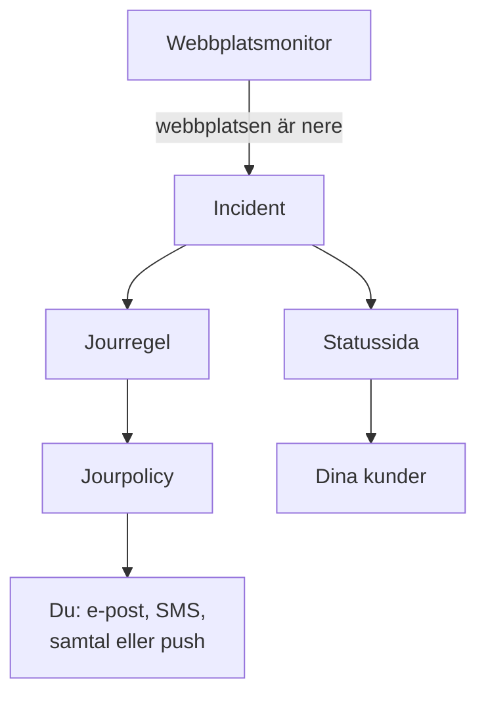

# Snabbstart

Den här guiden tar dig från ett nytt konto till en fungerande konfiguration på ungefär femton minuter: en monitor som kontrollerar din webbplats var femte minut, en jourpolicy som larmar dig när webbplatsen går ner och en statussida som informerar dina kunder. Den följer checklistan **Välkommen till OneUptime 👋** på projektets startsida.

## Innan du börjar

- **Ett konto.** På OneUptime Cloud registrerar du dig på [oneuptime.com](https://oneuptime.com/accounts/register) och öppnar länken i e-postmeddelandet du får. På din egen installation öppnar du den i webbläsaren och registrerar dig: det första kontot blir huvudadministratör. Se [Docker Compose](/docs/installation/docker-compose) för att installera en.
- **En webbplats att hålla koll på.** Vilken adress som helst som svarar över HTTP eller HTTPS, till exempel ditt företags startsida.

## Skapa ett projekt

I OneUptime ligger allt i ett projekt: dina monitorer, incidenter, jourpolicyer, statussidor och personerna som arbetar med dem.

:::steps
### Börja ett nytt projekt

Första gången du loggar in visar OneUptime **Inga projekt**. Klicka på **Skapa nytt projekt**. Om någon redan har bjudit in dig till ett projekt accepterar du i stället inbjudan på samma sida.

### Ge det ett namn

Ange ett **Projektnamn**, till exempel ditt företags namn. På OneUptime Cloud ber nästa steg dig välja en plan.

### Skapa det

Klicka på **Skapa projekt**. Projektets startsida öppnas, med checklistan **Välkommen till OneUptime 👋** överst.
:::

## Övervaka din webbplats

:::steps
### Öppna skapandet av monitor

Klicka på **Skapa din första övervakare** i checklistan. Du kan också öppna **Monitorer** från menyn **Produkter** och klicka på **Skapa monitor**.

### Välj Webbplats

Under **Monitortyp** väljer du **Webbplats**. Ange ett **Namn**, till exempel `Website`, och klicka på **Nästa**.

### Ange adressen

Ange webbplatsens fullständiga adress i **Webbplats-URL**, till exempel `https://example.com`. OneUptime lägger till kriterierna åt dig: monitorn blir **Offline** och deklarerar en incident när webbplatsen inte svarar, eller svarar med ett fel. Klicka på **Nästa**.

### Skapa monitorn

Behåll de valda **Sonder** och **Övervakningsintervall** **Var 5:e minut**, och klicka på **Skapa monitor**. Monitorns sida öppnas, och sonderna börjar kontrollera din webbplats.
:::

Vill du prova kontrollen innan du sparar, klickar du på **Testa monitor** i det andra steget. Alla andra monitortyper beskrivs i [Skapa en monitor](/docs/monitor/create-monitor).

## Bli larmad när den går ner

Som det är nu skickas en incident utan ägare med e-post till projektets ägare, och det inkluderar dig. För att bli larmad tills någon svarar skapar du en jourpolicy och låter varje incident utlösa den.

:::steps
### Skapa en jourpolicy

Klicka på **Konfigurera en jourpolicy** i checklistan, eller öppna **Jourtjänst** från menyn **Produkter**. Klicka på **Skapa Jourpolicy** och ange ett **Namn**. Under **Vem larmas först?** klickar du på **Lägg till mottagare** och väljer dig själv. Klicka på **Skapa Jourpolicy**.

### Utlös den för varje incident

Öppna **Incidenter** från menyn **Produkter**, fäll ut **Regler** i sidomenyn och välj **Jourregler**. Klicka på **Skapa Incident On-Call Rule**, ange ett **Namn** och klicka på **Nästa**. Lämna **Matchningskriterier** tomt, så att regeln gäller varje incident, och klicka på **Nästa**. Välj din policy under **Jourpolicyer** och klicka på **Skapa Incident On-Call Rule**.

### Välj hur du nås

E-postadressen du loggar in med är redan ett sätt att nå dig. För att också få SMS eller samtal öppnar du **Användarinställningar** i fältet under toppfältet, går till **Aviseringsmetoder** och lägger på fliken **Direct Contact** till ditt nummer under **Telefonnummer för SMS-aviseringar** eller **Telefonnummer för samtalsaviseringar**. Klicka på **Verifiera** och ange koden som OneUptime skickar till dig. Ett verifierat nummer används för jourlarm direkt.
:::

> [!NOTE]
> SMS och telefonsamtal är avstängda i ett nytt projekt. En projektägare, en Billing Admin eller någon med Manage Billing slår på dem i kortet **Aviseringskanaler** under **Projektinställningar → Aviseringar → Aviseringsinställningar**.

Se [Eskaleringsregler](/docs/on-call/escalation-rules) och [Jourscheman](/docs/on-call/schedules) för fler nivåer, rotationer och hur länge varje nivå väntar.

## Publicera en statussida

:::steps
### Skapa statussidan

Klicka på **Publicera en statussida** i checklistan, eller öppna **Statussidor** från menyn **Produkter**. Klicka på **Skapa statussida**, ange ett **Namn**, till exempel `Acme Status`, och klicka på **Skapa statussida**.

### Lägg till din monitor

Öppna den nya statussidan. I dess sidomeny, under **Resurser**, väljer du **Monitorer**; i projekt med monitorgrupper påslagna heter punkten **Resurser**. Klicka på **Lägg till monitor**, välj din webbplatsmonitor och klicka på **Lägg till monitor**. Raden visar monitorns namn för besökare; ändra det under **Visningsnamn** om du vill.

### Öppna sidan

Välj **Översikt** i sidomenyn. Kortet **Status Page Preview URL** länkar till din statussida: öppna den, så visas din webbplats som fungerande.
:::

En ny statussida är offentlig: alla som har adressen kan öppna den. Se [Statussidans varumärke och domäner](/docs/status-pages/branding-and-domains) för att ge den din egen domän, logotyp och dina egna färger.

## Bjud in ditt team

Klicka på **Bjud in ditt team** i checklistan, eller öppna **Användare** från menyn **Produkter**, under **Inställningar**. Klicka på **Bjud in användare**, ange personens **E-post** och välj ett **Team**: medlemsteamet är valt från början. Klicka på **Bjud in**. OneUptime skickar inbjudan med e-post, och teamet avgör vad personen får göra. Se [Användare, team och behörigheter](/docs/permissions/index).

## Prova det

Deklarera en testincident för att se hela kedjan fungera.

:::steps
### Deklarera en testincident

Öppna **Incidenter** och klicka på **Deklarera incident**. Ange en **Titel**, till exempel `Test incident`, välj ett **Incidentallvar** och klicka på **Nästa**. Under **Monitorer** väljer du din webbplatsmonitor, så att incidenten visas på din statussida. Klicka på **Nästa** tills du når sammanfattningen och sedan på **Deklarera incident**.

### Se vad som händer

Inom någon minut larmar din jourpolicy dig, och incidenten visas på din statussida.

### Lös den

Klicka på **Lös** på incidentens sida. Larmen slutar, och incidenten försvinner från din statussida.
:::

> [!WARNING]
> Alla som öppnar din statussida ser testincidenten tills du löser den. Kör testet innan du delar sidans adress.

## Felsökning

:::details Jag blev inte larmad
Öppna incidenten och välj **Jourexekveringar** i dess sidomeny: där ser du om din policy kördes och vem den larmade. Kördes den inte, kontrollera att din jourregel är aktiverad och anger policyn. Kördes den, kontrollera att dina metoder under **Användarinställningar → Aviseringsmetoder** är verifierade.
:::

:::details Incidenten visas inte på min statussida
En statussida visar en incident när en av incidentens monitorer finns på sidan. Kontrollera att incidenten har din monitor bland sina berörda resurser, och att monitorn finns på statussidan.
:::

:::details Monitorn säger offline, men min webbplats fungerar
Öppna monitorn och se vad sonderna tog emot. Se felsökningsavsnittet i [Webbplatsövervakning](/docs/monitor/website-monitor).
:::

## Nästa steg

:::cards
- [Grundbegrepp](/docs/introduction/core-concepts): Idéerna bakom det du just har konfigurerat.
- [Jourscheman](/docs/on-call/schedules): Dela jouren med ditt team.
- [Statussidans varumärke och domäner](/docs/status-pages/branding-and-domains): Gör statussidan till din egen.
- [OpenTelemetry](/docs/telemetry/open-telemetry): Skicka loggar, mätvärden och spår från dina appar.
:::
