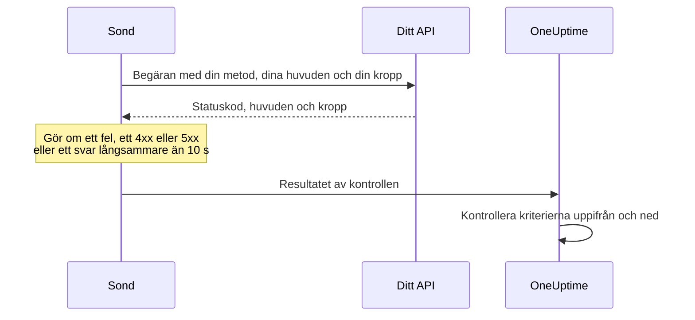

# API-övervakning

En API-monitor anropar en HTTP-slutpunkt enligt ett schema, med den metod, de huvuden och den kropp du väljer, och kontrollerar vad som kommer tillbaka: statuskoden, svarstiden, huvudena och kroppen. Använd den för REST-, JSON- och GraphQL-slutpunkter, hälsokontroller och alla anrop dina användare är beroende av.

:::cards
- [Skapa monitorn](#skapa-en-api-monitor): Sex steg i instrumentpanelen.
- [Konfigurationsalternativ](#konfigurationsalternativ): Metod, huvuden, kropp, omdirigeringar, certifikat, tidsgränser och återförsök.
- [Övervakningskriterier](#övervakningskriterier): Vad som från början räknas som uppe eller nere.
- [Felsökning](#felsökning): När en kontroll misslyckas som borde lyckas.
:::

## Så fungerar det

Vid varje kontroll skickar en sond begäran, följer omdirigeringar och registrerar statuskoden, svarstiden, huvudena och kroppen. En begäran som misslyckas, når tidsgränsen, svarar med status `4xx` eller `5xx` eller tar längre än 10 sekunder görs om, upp till det antal återförsök du tillåter. Sedan kör OneUptime resultatet genom monitorns kriterier.



En sond som har förlorat sin egen nätverksanslutning rapporterar inget resultat, så den kan inte markera ditt API som offline.

## Innan du börjar

- **En roll som kan skapa monitorer**: Project Owner, Project Admin, Project Member, Monitor Admin eller Monitor Member, eller en anpassad roll med behörigheten Create Monitor.
- **En sond som når API:et.** Projektets standardsonder väljs för varje ny monitor. Om en brandvägg står framför API:et tillåter du [OneUptime Clouds sond-IP-adresser](/docs/configuration/ip-addresses). Ett API i ett privat nätverk behöver en [anpassad sond](/docs/probe/custom-probe) i det nätverket, som får nå privata adresser: se [Åtkomst till privat nätverk](/docs/self-hosted/private-network-access).
- **Inloggningsuppgifter som övervakningshemligheter.** Om API:et behöver en nyckel eller en token sparar du den först som en [övervakningshemlighet](/docs/monitor/monitor-secrets), så att monitorn bara har en referens till den.

## Skapa en API-monitor

:::steps
### Börja en ny monitor

Gå till **Monitorer** och klicka på **Skapa monitor**. Välj **API** under **Monitortyp**.

### Namnge den

Ange ett **Namn**, som `Orders API`, och klicka sedan på **Nästa**.

### Ange begäran

Ange slutpunktens fullständiga URL under **API-URL**, som `https://api.example.com/health`. Välj **API-begärantyp** (**GET** om du inte ändrar den). För att lägga till huvuden eller en kropp öppnar du **Fler fält** och fyller i **Begärandehuvuden** och **Begärandekropp (i JSON)**.

### Testa den

Klicka på **Testa monitor**, välj en sond under **Välj sond** och klicka på **Kör test**. **Resultat av övervakningstest** visar vad API:et svarade.

### Gå igenom kriterierna

**Monitorkriterier** börjar med [standardkriterierna](#standardkriterier): offline när API:et inte svarar eller svarar med ett fel, online vid varje status `2xx` eller `3xx`. För att även kontrollera vad API:et returnerar lägger du till ett filter och klickar sedan på **Nästa**.

### Välj sonder och skapa

Behåll eller ändra **Sonder** och **Övervakningsintervall** (det börjar på **Var 5:e minut**) och klicka sedan på **Skapa monitor**. Monitorns sida öppnas.
:::

## Konfigurationsalternativ

### API-URL

Slutpunkten som anropas, som fullständig URL med schema, som `https://api.example.com/v1/health`. Du kan lägga in en [övervakningshemlighet](/docs/monitor/monitor-secrets) i URL:en som `{{monitorSecrets.NAME}}`.

### Dynamiska URL-platshållare

När ett CDN eller en cachande proxy står framför API:et kan en sond få svar från cachen i stället för från din server. För att komma förbi cachen lägger du till en platshållare i URL:en; sonden ersätter den med ett nytt värde vid varje kontroll.

| Platshållare | Ersätts med | Exempelvärde |
| --- | --- | --- |
| `{{timestamp}}` | Aktuell Unix-tid i sekunder | `1719500000` |
| `{{random}}` | En slumpmässig, unik sträng på 32 hexadecimala tecken | `3f2b8c1d9e7a4b6c8d0e1f2a3b4c5d6e` |

En URL med en platshållare:

```text
https://api.example.com/health?cb={{timestamp}}
```

Vad sonden begär vid två kontroller med fem minuters mellanrum:

```text
https://api.example.com/health?cb=1719500000
https://api.example.com/health?cb=1719500300
```

Använd `{{random}}` på samma sätt: `https://api.example.com/health?nocache={{random}}`.

### API-begärantyp

HTTP-metoden som skickas. **GET** är standard; de andra är **POST**, **PUT**, **PATCH**, **DELETE** och **HEAD**. Om en begäran **HEAD** får svar med status `4xx` eller `5xx` upprepar sonden den som `GET`.

### Fler fält

De här inställningarna är hopfällda under **Fler fält**. Den hopfällda rubriken nämner dem och visar vilka du har ändrat.

| Fält | Standard | Vad det gör |
| --- | --- | --- |
| **Begärandehuvuden** | Inga | Huvuden som skickas, som par av namn och värde. Klicka på **Lägg till Request Header** för vart och ett. |
| **Begärandekropp (i JSON)** | Ingen | Ett JSON-objekt som skickas som kropp, oftast med **POST**, **PUT** eller **PATCH**. Det måste vara giltig JSON. |
| **Följ inte omdirigeringar** | Av | Bedöm det första svaret i stället för att följa omdirigeringar. Se [nedan](#följ-inte-omdirigeringar). |
| **Tillåt självsignerade certifikat** | Av | Hoppa över valideringen av TLS-certifikatet för monitorns eget värdnamn. |
| **Använd klientcertifikat (mTLS)** | Av | Visa upp ett klientcertifikat och en privat nyckel. Se [Klientcertifikat (mTLS)](#klientcertifikat-mtls). |
| **Begärandetimeout (sekunder)** | `60` | Hur länge varje försök får vänta. Maxvärdet är 60 sekunder. |
| **Återförsök vid misslyckande** | Sondens standard, oftast `3` | Hur många gånger ett misslyckat försök görs om. Maxvärdet är 3. Se [Återförsök och tidsgränser](#återförsök-och-tidsgränser). |

Begärandehuvuden och begärandekroppen kan använda [övervakningshemligheter](/docs/monitor/monitor-secrets), till exempel ett huvud `Authorization` med värdet `Bearer {{monitorSecrets.ApiKey}}`.

#### Följ inte omdirigeringar

Som standard följer sonden omdirigeringar (`301`, `302`, `303`, `307` och `308`), upp till 10 av dem, och bedömer svaret den hamnar på. Slå på **Följ inte omdirigeringar** för att i stället bedöma själva omdirigeringssvaret. [Standardkriterierna](#standardkriterier) räknar ett omdirigeringssvar som online.

När den följer en omdirigering:

- En `303`, eller en `301` eller `302` som svar på en `POST`, gör om begäran till en `GET` utan kropp, som webbläsare gör.
- Dina begärandehuvuden skickas bara till URL:ens eget ursprung (samma schema, värd och port). En omdirigering till ett annat ursprung skickas utan dem.
- En omdirigering till ett annat ursprung får kontrollen att misslyckas om begäran fortfarande har en kropp, eller en annan metod än `GET` eller `HEAD`.
- **Tillåt självsignerade certifikat** följer omdirigeringar som stannar på monitorns eget värdnamn. En omdirigering till ett annat värdnamn verifieras som vanligt.

#### Klientcertifikat (mTLS)

Om API:et kräver ömsesidig TLS slår du på **Använd klientcertifikat (mTLS)** och fyller i:

| Fält | Vad du anger |
| --- | --- |
| **Klientcertifikat (PEM)** | Det PEM-kodade klientcertifikat som visas upp. |
| **Privat klientnyckel (PEM)** | Den matchande PEM-kodade privata nyckeln. |
| **Lösenfras för privat klientnyckel** | Valfritt. Lösenfrasen, bara om den privata nyckeln är krypterad. |

Det motsvarar curls flaggor `--cert` och `--key`:

```bash
curl --cert client.crt --key client.key https://api.example.com/health
```

För att hålla nyckeln utanför monitorns inställningar sparar du certifikatet och nyckeln som [övervakningshemligheter](/docs/monitor/monitor-secrets) och anger `{{monitorSecrets.NAME}}` i de här fälten. Hemligheter fylls i på servern, och deras värden visas aldrig i instrumentpanelen.

Klientcertifikatet visas bara upp så länge begäran stannar på URL:ens ursprung. Efter en omdirigering till ett annat ursprung fortsätter sonden utan det.

#### Återförsök och tidsgränser

**Återförsök vid misslyckande** räknar återförsök _efter_ det första försöket, så `0` kör kontrollen en gång och `2` upp till tre gånger. Lämnas fältet tomt används sondens standard: 3, om inte sondens `PROBE_MONITOR_RETRY_LIMIT` säger något annat. Sonden väntar en sekund mellan försöken, och varje försök får hela **Begärandetimeout (sekunder)**.

Dessa fel görs om: anslutningsfel, tidsgränser, svar `4xx` och `5xx` och svar som är långsammare än 10 sekunder. Dessa görs inte om, eftersom ett nytt försök inte kan ändra dem: en ogiltig eller blockerad URL, fler än 10 omdirigeringar och ett svar större än 512 KiB.

## Övervakningskriterier

Kriterier avgör när API:et räknas som online, försämrat eller offline, och om det deklarerar en incident eller skapar ett larm. Varje kriterium kontrollerar ett eller flera filter:

| Filter | Villkor | Vad det kontrollerar |
| --- | --- | --- |
| **Is Online** | **Sant**, **Falskt** | Om API:et svarade alls, oavsett statuskod. |
| **Statuskod för svar** | **Equal To**, **Not Equal To**, **Greater Than**, **Less Than**, **Greater Than Or Equal To**, **Less Than Or Equal To** | HTTP-statuskoden. |
| **Svarstid (i ms)** | **Greater Than**, **Less Than**, **Greater Than Or Equal To**, **Less Than Or Equal To** | Hur lång tid begäran tog, omdirigeringar inräknade. |
| **Svarstext** | **Innehåller**, **Not Contains** | Text i svarets kropp. Jämförelsen skiljer på versaler och gemener. |
| **Response Header** | **Innehåller**, **Not Contains** | Om svaret har ett huvud med det här namnet. Ange namnet med gemener, som `x-request-id`. |
| **Response Header Value** | **Innehåller**, **Not Contains** | Om ett huvud har exakt det här värdet, jämfört med gemener, som `application/json`. |
| **JavaScript Expression** | **Evaluates To True** | Ett uttryck över svaret. Se [JavaScript-uttryck](/docs/monitor/javascript-expression). |
| **Is Request Timeout** | **Sant**, **Falskt** | Om begäran nådde tidsgränsen vid varje försök. |

Ett JSON-svar kontrolleras i sin kompakta form, utan mellanslag mellan nycklar och värden. För att hitta `"status": "ok"` med **Svarstext** anger du `"status":"ok"`.

**Lägg till kriterier** lägger till ett kriterium som redan är namngivet efter sitt filter, till exempel _Response Time (in ms) is above 3000_. Namnet ändras med filtren tills du skriver ett eget. En beskrivning är valfri: för att lägga till en öppnar du kriteriets **Inställningar**.

Med två eller fler filter avgör **Matchningsvillkor** om **Alla** måste matcha eller om **Valfri** av dem räcker. Ett kriteriums **Åtgärder** avgör vad det gör: ändrar monitorns status, skapar ett larm, deklarerar en incident eller flera av dessa.

### Standardkriterier

En ny API-monitor börjar med två kriterier, så den fungerar utan att du ändrar något:

- **Offline** — API:et svarar inte, eller svarar med en statuskod på `400` eller högre (eller under `200`). Monitorn markeras som **Offline** och en incident skapas. Incidenten löser sig själv när API:et är tillbaka.
- **Uppe** — API:et svarar med valfri statuskod `2xx` eller `3xx`, som `200`, `201`, `202` eller `204`. Monitorn markeras som **Fungerar**.

I listan över kriterier är de namngivna efter monitorn: _Check if (name) is offline_ och _Check if (name) is online_.

En slutpunkt som svarar `201 Created` eller `204 No Content` räknas alltså som uppe. Om bara en statuskod betyder frisk för dig ändrar du båda kriterierna på monitorns sida **Konfiguration → Kriterier**: till exempel **Statuskod för svar** / **Equal To** / `200` i online-kriteriet och **Not Equal To** / `200` i offline-kriteriet, i stället för de två statuskodsfilter som vart och ett har. För att även kontrollera vad API:et returnerar lägger du till ett filter **Svarstext** eller **JavaScript Expression** i offline-kriteriet.

Kriterier kontrolleras uppifrån och ned, och det första som matchar avgör vad som händer.

När inget matchar faller monitorn tillbaka på sin standardstatus: **Fungerar**, om du inte väljer en annan under **Fler fält** under kriterierna. Den hopfällda rubriken för **Fler fält** visar vilken status det är.

Monitorer som skapades innan OneUptime ändrade dessa standarder behåller de kriterier de skapades med, och räknar bara `200` som online. Monitorer som skapas via API:et eller Terraform använder de kriterier du skickar.

### Utvärdering över en tidsperiod

**Utvärdera dessa kriterier över en tidsperiod** är en kryssruta under ett filter, som erbjuds för **Is Online**, **Statuskod för svar** och **Svarstid (i ms)**. Slå på den för att bedöma ett fönster av tidigare kontroller i stället för bara den senaste: välj en aggregering under **Utvärdera** och ett fönster från 2 till 60 minuter under **Under de senaste (i minuter)**.

| Aggregering | Matchar när |
| --- | --- |
| **Genomsnitt**, **Summa**, **Maximum Value**, **Minimum Value** | Det värdet över fönstret uppfyller villkoret. Bara numeriska filter. |
| **All Values** | Varje kontroll i fönstret uppfyller villkoret. |
| **Any Value** | Minst en kontroll i fönstret uppfyller villkoret. |

**All Values** matchar först när fönstret verkligen täcks av data. En monitor som just skapats, eller en vars kontroller slutade registreras, har inte tillräcklig historik för att säga något om de senaste N minuterna, så kriteriet väntar i stället för att matcha på den enda mätning det har. **Any Value** är inställningen för "säg till direkt när en enda kontroll går över gränsen" och utlöses fortfarande omedelbart.

**Om ingen data** avgör vad som händer så länge fönstret inte kan bära kriteriet:

| Alternativ | Vad som händer | Använd det för |
| --- | --- | --- |
| **Ignore** (standard) | Kriteriet matchar inte. | Vanliga tröskellarm. |
| **Utlösare** | Den saknade datan räknas som problemet. | Kontroller där tystnad i sig är ett fel. |
| **Treat As Zero** | Fönstret jämförs som en enda nolla. | Räknare där inga händelser verkligen betyder noll. |

### Exempelkriterier

| Mål | Filter | Villkor | Värde |
| --- | --- | --- | --- |
| Markera API:et som försämrat när det är långsamt | **Svarstid (i ms)** | **Greater Than** | `1000` |
| Offline när hälsokontrollen rapporterar ett problem | **Svarstext** | **Not Contains** | `"status":"ok"` |
| Samma sak, läst ur den tolkade JSON:en | **JavaScript Expression** | **Evaluates To True** | `"{{responseBody.status}}" !== "ok"` |
| Godta bara `201` från en `POST` | **Statuskod för svar** | **Equal To** | `201` |

## Felsökning

:::details API:et svarar på mina begäranden, men monitorn är offline
Sonden fick ett annat svar än du. Incidentens rotorsak och **Övervakningsloggar** på monitorn visar vad sonden såg. Kontrollera att sonden skickar det API:et förväntar sig: metoden, huvudet `Authorization`, kroppen. En brandvägg eller en hastighetsbegränsare framför API:et kan också blockera sonderna: tillåt [OneUptime Clouds sond-IP-adresser](/docs/configuration/ip-addresses).
:::

:::details Monitorn skickar `{{monitorSecrets.NAME}}` bokstavligt
Monitorn får inte använda hemligheten, eller så stämmer inte namnet. Se [Övervakningshemligheter](/docs/monitor/monitor-secrets) för vem som får använda en hemlighet.
:::

:::details Kontrollen misslyckas med "unsafe cross-origin redirect"
API:et omdirigerade en begäran med en kropp, eller med en annan metod än `GET` eller `HEAD`, till ett annat ursprung, och sonden vidarebefordrar inte sådana. Peka monitorn mot den URL som API:et omdirigerar till, eller slå på **Följ inte omdirigeringar** och kontrollera själva omdirigeringen.
:::

:::details Kontrollen misslyckas med "Remote response exceeded the allowed size."
Sonden läser högst 512 KiB av ett svar, och det här är större. Anropa en slutpunkt som returnerar mindre, till exempel med en mindre sidstorlek.
:::

## Nästa steg

:::cards
- [JavaScript-uttryck](/docs/monitor/javascript-expression): Kontrollera fält djupt inne i ett JSON-svar.
- [Övervakningshemligheter](/docs/monitor/monitor-secrets): Håll API-nycklar och tokens utanför monitorinställningarna.
- [Webbplatsövervakning](/docs/monitor/website-monitor): Kontrollera en webbsida i stället för en slutpunkt.
- [Incident- och varningsmallar](/docs/monitor/incident-alert-templating): Lägg in detaljer från svaret i rubrikerna på incidenter och larm.
:::
