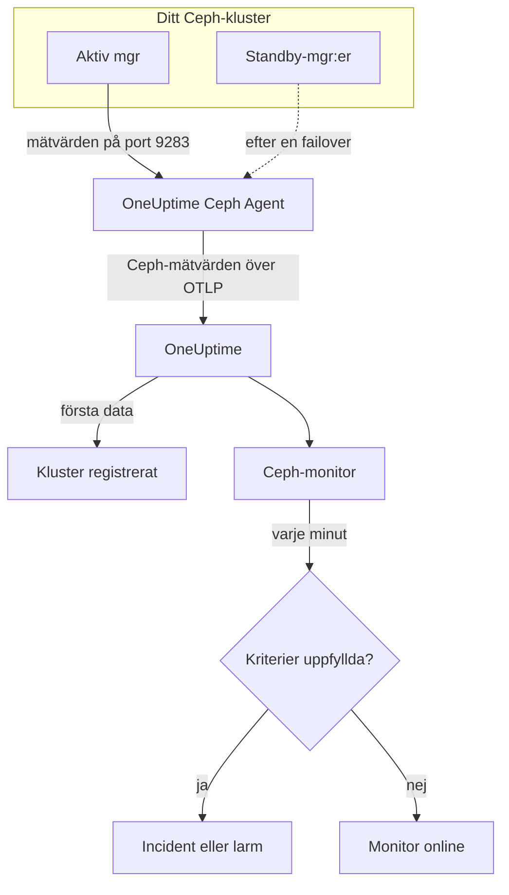

# Ceph-övervakning

En Ceph-monitor håller koll på ett Ceph-kluster — dess hälsa, health checks, monitorernas quorum, OSD:er, pooler och placement groups — och säger till i samma stund som hälsan försämras, en OSD går ner eller kapaciteten börjar ta slut. Den läser de `ceph_*`-mätvärden som Ceph-mgr:ns `prometheus`-modul exporterar och som OneUptime Ceph Agent samlar in, så ingenting avläses utifrån.

:::cards
- [Skapa monitorn](#skapa-en-ceph-monitor): Sex steg i instrumentpanelen.
- [Mallar](#färdiga-larmmallar): 23 färdiga larm för hälsa, OSD:er, placement groups och kapacitet.
- [Health checks](#serier-för-health-checks): Larma på valfri health check i Ceph efter namn.
- [Mätvärden](#insamlade-mätvärden): Varje `ceph_*`-serie som monitorn kan larma på.
:::

## Så fungerar det

Ceph-mgr:ns `prometheus`-modul tillhandahåller klustrets mätvärden på port 9283. OneUptime Ceph Agent hämtar från varje mgr-daemon var 30:e sekund — den aktiva svarar, standby-instanserna returnerar ingenting förrän de tar över —, behåller Cephs egna etiketter (`ceph_daemon`, `pool_id`) och skickar mätvärdena till OneUptime över OTLP, märkta med klustrets namn, `ceph.cluster.name`. De första data registrerar klustret.

En Ceph-monitor hör till ett kluster. Varje minut kör den sin fråga mot klustrets mätvärden och jämför resultatet med sina kriterier.



## Innan du börjar

- **Aktivera mgr:ns `prometheus`-modul** i klustret:

  ```bash
  ceph mgr module enable prometheus
  ```

- **Installera Ceph Agent** på en maskin som når varje mgr-daemon på port 9283, och lista alla i `CEPH_MGR_ENDPOINTS`. [Guiden för Ceph Agent](/docs/telemetry/ceph) beskriver installationen.
- **Kontrollera att klustret är registrerat.** Det visas under **Produkter → Infrastruktur → Ceph → Alla kluster**, med namnet från agentens `CEPH_CLUSTER_NAME`, ungefär en minut efter första hämtningen.
- **För larm på health checks** behöver du Ceph Quincy eller senare. Äldre versioner exporterar inte `ceph_health_detail`.

## Skapa en Ceph-monitor

:::steps
### Starta en ny monitor

Gå till **Monitorer** och klicka på **Skapa monitor**.

### Välj Ceph

Klicka på **Fler monitortyper** under **Monitortyp** och välj **Ceph** under **Infrastruktur**, eller skriv `ceph` i sökrutan. Ange ett **Namn** — det används i rubrikerna för incidenter och larm — och klicka på **Nästa**.

### Välj klustret

Välj klustret i **Ceph Cluster** under **Ceph Monitor Configuration**. Alla kluster som har skickat data finns i listan.

### Välj vad som ska övervakas

Välj en av de tre flikarna:

- **Quick Setup** — klicka på en [mall](#färdiga-larmmallar). Den ställer in mätvärden, filter, aggregering, tidsintervall och tröskelvärden och ersätter kriterierna nedan med sina egna. Du kan fortfarande ändra **Tidsintervall**.
- **Custom Metric** — välj ett mätvärde i **Ceph Metric** och ställ sedan in **Aggregering** och **Tidsintervall**. **OSD** och **Pool ID** begränsar det till en daemon eller pool.
- **Avancerad** — bygg frågor och formler själv under **Välj mått**, till exempel en kvot för använd kapacitet från `ceph_cluster_total_used_bytes / ceph_cluster_total_bytes`. Använd **Group by** `ceph_daemon` eller `pool_id` för att bedöma varje daemon eller pool för sig.

### Kontrollera kriterierna

Öppna varje kriterium under **Monitorkriterier** och kontrollera **Mätvärde**, **Aggregering**, **Villkor** och **Threshold**. En mall fyller i dem. Med **Custom Metric** eller **Avancerad** startar monitorn med [standardkriterierna](#standardkriterier), som bara märker att ett mätvärde sjunker till noll, så sätt ditt eget tröskelvärde.

### Skapa monitorn

Klicka på **Skapa monitor**. OneUptime öppnar monitorns sida och utvärderar den varje minut. Incidenter och larm som den skapar visas också på klustrets sidor **Incidenter** och **Varningar**.
:::

> [!TIP]
> Om du vill ställa in flera mallar på en gång öppnar du klustret från **Produkter → Infrastruktur → Ceph** och går till **Recommendations**. Välj de mallar du vill ha och vem som larmas, så skapar OneUptime en monitor per mall.

## Monitorinställningar

| Fält | Flik | Vad det gör |
| --- | --- | --- |
| **Ceph Cluster** | Alla | Obligatoriskt. Begränsar varje fråga till `resource.ceph.cluster.name`. |
| **OSD** | Custom Metric, Avancerad | Valfritt. Exakt matchning på etiketten `ceph_daemon`, till exempel `osd.3`. |
| **Pool ID** | Custom Metric, Avancerad | Valfritt. Exakt matchning på etiketten `pool_id`, till exempel `2`. |
| **Ceph Metric** | Custom Metric | Ett mätvärde från [katalogen](#insamlade-mätvärden). |
| **Aggregering** | Custom Metric | Hur mätpunkter kombineras: **Genomsnitt**, **Maximum**, **Minimum**, **Summa** eller **Antal**. Börjar med mätvärdets vanliga aggregering. |
| **Tidsintervall** | Alla | Det glidande fönster som frågan läser, från **Past 1 Minute** till **Past 365 Days**. En ny monitor börjar på **Past 1 Minute**; mallar sätter sitt eget. |
| **Välj mått** | Avancerad | Frågebyggaren: **Mätvärde**, **Aggregate by**, **Filter by attributes**, **Group by**, plus **Lägg till mätvärde** och **Lägg till formel** för att kombinera frågor. |

Poolernas dataserier har bara etiketten `pool_id`: Poolens namn finns bara i `ceph_pool_metadata`. Filtrera och gruppera poolserier efter `pool_id`, och slå upp namnet i `ceph_pool_metadata` när du behöver det.

### Serier för health checks

`ceph_health_detail` exporterar **en serie per aktiv health check**, med etiketterna `name` (till exempel `OSD_NEARFULL` eller `RECENT_CRASH`) och `severity`. En serie finns bara medan dess check är utlöst, så ingen serie betyder friskt. För att larma på valfri health check i Ceph filtrerar du på dess `name`, utlöser på **Maximum** över `0` och återställer vid `0` med **Om ingen data** satt till **Treat As Zero** — precis så är mallarna för health checks byggda. `ceph_daemon_health_metrics` fungerar likadant per daemon, med en `type`-etikett (till exempel `SLOW_OPS`) och `ceph_daemon`.

## Färdiga larmmallar

**Quick Setup** erbjuder 23 mallar för klustrets hälsa, OSD:er, placement groups och kapacitet. Varje mall bygger en komplett monitor — frågor, etikettfilter, en gruppering, ett kriterium som utlöser och ett som återställer. Tröskelvärdena är utgångspunkter som du kan ändra.

Mallar läser de senaste 5 minuterna om inte tabellen säger något annat. Ett kriterium utlöses bara när villkoret gäller under varje minut i fönstret, och ett tröskelkriterium återställs först 10 % bortom sitt tröskelvärde, så att ett värde som pendlar kring gränsen inte fladdrar. **Allvarlighetsgrad** är etiketten som väljaren visar; incidenten och larmet som en mall skapar börjar med projektets högsta allvarlighetsgrad för incidenter och larm.

### Mallar för klustrets hälsa

| Mall | Allvarlighetsgrad | Övervakar | Utlöses när | Återställs när |
| --- | --- | --- | --- | --- |
| Cluster Health Error | Kritisk | `ceph_health_status`, Max, senaste minuten | 2 eller mer: `HEALTH_ERR` | Under 1,8: `HEALTH_WARN` eller bättre |
| Cluster Health Warning | Warning | `ceph_health_status`, Max | 1 eller mer: `HEALTH_WARN` eller sämre | Under 0,9: `HEALTH_OK` |
| Monitor Quorum Degraded | Kritisk | `ceph_mon_quorum_status`, Min per `ceph_daemon`, senaste minuten | En monitor sjunker under 1, utanför quorum. En incident per monitor | Tillbaka på 1 |
| Slow Operations | Warning | `ceph_healthcheck_slow_ops`, Max | Över 0: Klustrets `SLOW_OPS`-check är aktiv | Vid 0 |
| Daemon Slow Operations | Warning | `ceph_daemon_health_metrics` för `type = SLOW_OPS`, Max per `ceph_daemon` | Över 0. En incident per OSD eller monitor | Serien försvinner |
| Daemon Crash | Kritisk | `ceph_health_detail` för `name = RECENT_CRASH`, Max | Checken är aktiv: Det finns daemonkrascher som inte arkiverats. Mgr:n har inget `ceph_crash_*`-mätvärde, så detta är den enda kraschsignalen | Kraschningarna arkiveras |
| Monitor Clock Skew | Warning | `ceph_health_detail` för `name = MON_CLOCK_SKEW`, Max | Checken är aktiv: Monitorernas klockor avviker mer än tillåtet (standard 0,05 s) | Checken försvinner |
| Monitor Disk Critically Low | Kritisk | `ceph_health_detail` för `name = MON_DISK_CRIT`, Max | Checken är aktiv: En monitors databasdisk har mindre än 5 % ledigt (standard) | Checken försvinner |
| Monitor Disk Space Low | Warning | `ceph_health_detail` för `name = MON_DISK_LOW`, Max | Checken är aktiv: mindre än 30 % ledigt (standard) | Checken försvinner |

### OSD-mallar

| Mall | Allvarlighetsgrad | Övervakar | Utlöses när | Återställs när |
| --- | --- | --- | --- | --- |
| OSD Down | Kritisk | `ceph_osd_up`, Min per `ceph_daemon` | En OSD sjunker under 1. En incident per OSD | Tillbaka på 1 |
| OSD Out | Warning | `ceph_osd_in`, Min per `ceph_daemon` | En OSD sjunker under 1: borttagen ur datafördelningen | Tillbaka på 1 |
| OSD High Latency | Warning | `ceph_osd_apply_latency_ms`, Avg per `ceph_daemon` | Över 100 ms. En incident per OSD | Vid eller under 90 ms |
| OSD Slow Heartbeats | Warning | `ceph_health_detail` för `name = OSD_SLOW_PING_TIME_FRONT` och `name = OSD_SLOW_PING_TIME_BACK`, Max | En av checkarna är aktiv: Heartbeats på det publika nätet eller klusternätet är långsamma. Mgr:n exporterar inget mått på pingtid | Båda checkarna försvinner |

### Mallar för placement groups

| Mall | Allvarlighetsgrad | Övervakar | Utlöses när | Återställs när |
| --- | --- | --- | --- | --- |
| Inactive Placement Groups | Kritisk | `ceph_pg_total` − `ceph_pg_active`, Max per `pool_id` | Över 0: PG:er kan inte betjäna I/O, så klientbegäranden till dem hänger sig. En incident per pool | Vid 0 |
| Degraded Placement Groups | Warning | `ceph_pg_degraded`, Max per `pool_id` | Över 0: Objekt har färre repliker än konfigurerat | Vid 0 |
| Undersized Placement Groups | Warning | `ceph_pg_undersized`, Max per `pool_id` | Över 0: PG:er ligger på färre OSD:er än deras antal repliker | Vid 0 |
| Damaged Placement Groups | Kritisk | `ceph_health_detail` för `name = PG_DAMAGED` och `name = OSD_SCRUB_ERRORS`, Max | En av checkarna är aktiv: Scrubbing har hittat skador eller läsfel | Båda checkarna försvinner |

### Kapacitetsmallar

| Mall | Allvarlighetsgrad | Övervakar | Utlöses när | Återställs när |
| --- | --- | --- | --- | --- |
| Cluster Near Full | Warning | `ceph_cluster_total_used_bytes` ÷ `ceph_cluster_total_bytes` × 100 | Över 85 %, Cephs standardkvot för nearfull | Vid eller under 76,5 % |
| Cluster Full | Kritisk | Samma kvot | Över 95 %, Cephs standardkvot för full, där skrivningar stoppas i hela klustret | Vid eller under 85,5 % |
| Pool Near Full | Warning | `ceph_pool_stored` ÷ (`ceph_pool_stored` + `ceph_pool_max_avail`) × 100, per `pool_id` | Över 85 % av vad poolen rymmer. En incident per pool | Vid eller under 76,5 % |
| OSD Nearfull | Warning | `ceph_health_detail` för `name = OSD_NEARFULL`, Max | Checken är aktiv: En OSD har passerat nearfull-tröskeln (standard 85 %). Enskilda OSD:er fylls långt innan klustrets genomsnitt gör det | Checken försvinner |
| OSD Backfillfull | Warning | `ceph_health_detail` för `name = OSD_BACKFILLFULL`, Max | Checken är aktiv: Backfill till OSD:n nekas (standard 90 %), och återställningen stannar av | Checken försvinner |
| OSD Full | Kritisk | `ceph_health_detail` för `name = OSD_FULL`, Max, senaste minuten | Checken är aktiv: En OSD har nått full-tröskeln (standard 95 %) och skrivningar nekas | Checken försvinner |

- **Mallar för avbrott och quorum använder minimum**, så att en enda OSD som är nere eller en enda monitor utanför quorum utlöser dem i stället för att döljas av den friska majoriteten.
- **Räknar- och health check-mallar använder maximum**, så att en enda dålig hämtning räcker.
- **PG- och poolserier finns per pool**: Det finns inget mått för hela klustret, så de mallarna grupperar efter `pool_id` och öppnar en incident per pool.
- **Kapacitetskvoter** tar **Summa** av båda sidor. Båda kommer från samma hämtning från mgr:n, så resultatet blir en riktig procentsats. **Inactive Placement Groups** använder i stället **Maximum** per pool, eftersom en summa skulle lägga ihop hämtningar i en subtraktion.
- **Health check-mallar** återställs när checken försvinner: Deras återställningskriterier räknar en saknad serie som 0.

Vissa larm har ingen mall. Ojämnt fördelade PG:er kräver statistik över flera serier som kriterier inte kan beräkna. Kapacitetsprognoser kräver en tillväxtkurva, som klustrets instrumentpanel ritar i stället. Förutsägelse av diskfel och eftersläpande scrubbing har inget mätvärde i mgr:n, och NVMe-oF, RBD-spegling och cephadm kräver andra exportörer.

## Insamlade mätvärden

Agenten hämtar från varje mgr-daemon var 30:e sekund och behåller Cephs egna etiketter, så serier per daemon har `ceph_daemon` (`osd.3`, `mon.a`) och serier per pool har `pool_id`.

### Mätvärden för klustrets hälsa

| Mätvärde | Enhet | Beskrivning |
| --- | --- | --- |
| `ceph_health_status` | — | Övergripande hälsa: 0 = `HEALTH_OK`, 1 = `HEALTH_WARN`, 2 = `HEALTH_ERR`. |
| `ceph_health_detail` | antal | En serie per **aktiv** health check, med etiketterna `name` och `severity`. Endast från Quincy. |
| `ceph_healthcheck_slow_ops` | antal | Långsamma OSD- och monitoroperationer som checken `SLOW_OPS` rapporterar. |
| `ceph_daemon_health_metrics` | antal | Hälsomätvärden per daemon, med `type` (till exempel `SLOW_OPS`) och `ceph_daemon`. |
| `ceph_mon_quorum_status` | antal | 1 när monitorn är i quorum, per `ceph_daemon` (till exempel `mon.a`). |
| `ceph_mon_metadata` | antal | Monitorns metadata, alltid 1. Summera för att räkna monitorer. |
| `ceph_cluster_total_bytes` | byte | Total rå kapacitet. |
| `ceph_cluster_total_used_bytes` | byte | Rå kapacitet som används. |

### OSD-mätvärden

| Mätvärde | Enhet | Beskrivning |
| --- | --- | --- |
| `ceph_osd_up` | antal | 1 när OSD:n är uppe, per `ceph_daemon` (till exempel `osd.3`). |
| `ceph_osd_in` | antal | 1 när OSD:n ingår i datafördelningen. |
| `ceph_osd_apply_latency_ms` | ms | Tid för att tillämpa en operation på den underliggande lagringen. |
| `ceph_osd_commit_latency_ms` | ms | Tid för att skriva en operation till journalen eller WAL. |
| `ceph_osd_stat_bytes` | byte | Rå kapacitet för OSD:ns enhet. |
| `ceph_osd_stat_bytes_used` | byte | Använda råa byte på OSD:n. Jämför med totalen för att hitta ojämnt fyllda eller nästan fulla OSD:er. |
| `ceph_osd_numpg` | antal | Placement groups på OSD:n. |
| `ceph_osd_metadata` | antal | OSD:ns metadata (värdnamn, enhetsklass, version), alltid 1. Summera för att räkna OSD:er. |

### Poolmätvärden

| Mätvärde | Enhet | Beskrivning |
| --- | --- | --- |
| `ceph_pool_stored` | byte | Användardata som lagras i poolen. |
| `ceph_pool_max_avail` | byte | Byte som fortfarande kan skrivas till poolen, givet dess replikerings- eller erasure coding-profil. |
| `ceph_pool_objects` | antal | Objekt i poolen. |
| `ceph_pool_rd` | ops | Läsoperationer på poolen. En räknare över hela livslängden. |
| `ceph_pool_wr` | ops | Skrivoperationer på poolen. En räknare över hela livslängden. |
| `ceph_pool_rd_bytes` | byte | Byte som lästs från poolen. En räknare över hela livslängden. |
| `ceph_pool_wr_bytes` | byte | Byte som skrivits till poolen. En räknare över hela livslängden. |
| `ceph_pool_metadata` | antal | Poolens metadata, alltid 1 — den enda serien som kopplar `pool_id` till ett namn. |

### Mätvärden för placement groups

Varje `ceph_pg_*`-serie är per pool, med etiketten `pool_id`; summera över poolerna för ett värde för hela klustret.

| Mätvärde | Enhet | Beskrivning |
| --- | --- | --- |
| `ceph_pg_total` | antal | Placement groups i poolen. |
| `ceph_pg_active` | antal | PG:er i tillståndet `active`, som kan betjäna I/O. |
| `ceph_pg_clean` | antal | PG:er i tillståndet `clean`, helt replikerade. |
| `ceph_pg_degraded` | antal | PG:er i tillståndet `degraded`. |
| `ceph_pg_undersized` | antal | PG:er i tillståndet `undersized`. |
| `ceph_num_objects_degraded` | antal | Objekt med färre repliker än konfigurerat. |
| `ceph_num_objects_misplaced` | antal | Objekt som inte ligger där CRUSH vill ha dem. Data är säkra; bara placeringen är fel. |

## Övervakningskriterier

Ett kriterium jämför en av monitorns frågor eller formler med ett tröskelvärde. En Ceph-monitors kriterier har ingen **Filtertyp**: Varje regel kontrollerar mätvärdets värde, med de här fälten.

| Fält | Vad det gör |
| --- | --- |
| **Mätvärde** | Frågan eller formeln som kontrolleras, efter dess variabelnamn. |
| **Aggregering** | Hur värdena i fönstret blir ett svar: **Genomsnitt**, **Summa**, **Maximum Value**, **Minimum Value**, **All Values** (varje värde måste matcha) eller **Any Value** (ett räcker). |
| **Villkor** | **Greater Than**, **Less Than**, **Greater Than Or Equal To**, **Less Than Or Equal To** eller **Equal To** — eller ett avvikelsevillkor: **Anomalously High**, **Anomalously Low** eller **Anomalous**. |
| **Threshold** | Värdet att jämföra med. Bredvid finns en enhetslista när mätvärdet har en enhet. Visas inte för avvikelsevillkor. |
| **Känslighet** | Endast avvikelsevillkor. **Low** (4σ), **Medium** (3σ, standard) eller **High** (2σ). |
| **Baslinjefönster** | Endast avvikelsevillkor. 14 dagar (standard), 28, 60 eller 90 dagars historik. |
| **Om ingen data** | Under **Fler fält**. Vad som händer när fönstret saknar mätpunkter: **Ignore** (standard), **Treat As Zero** eller **Utlösare**. |

Avvikelsevillkor jämför varje värde med samma timme i veckan i baslinjen. De ligger kvar i tillståndet "Learning" och larmar inte förrän baslinjefönstret har tillräckligt med historik.

Varje kriterium anger också vad som ska hända när det matchar: ändra monitorns status, skapa ett larm eller deklarera en incident. Kriterierna kontrolleras uppifrån och ned, och det första som matchar avgör.

### Standardkriterier

En monitor som du inte bygger från en mall börjar med två kriterier:

| Ordning | Kriterium | Matchar när | Sedan |
| --- | --- | --- | --- |
| 1 | Check if _monitornamn_ is offline | Något värde i den första frågan är `0` | Sätter monitorn till **Offline** och deklarerar incidenten "_monitornamn_ is offline", som löser sig själv när monitorn återhämtar sig. |
| 2 | Check if _monitornamn_ is online | Något värde är över `0` | Sätter monitorn till **Fungerar**. |

De här standardvärdena passar få Ceph-mätvärden: `ceph_health_status` är 0 när klustret är friskt. Välj en mall eller sätt egna kriterier.

> [!IMPORTANT]
> Tystnad matchar inget av kriterierna: Ett kluster som slutar skicka data lämnar monitorn som den var. För att få veta när data upphör sätter du **Om ingen data** till **Utlösare** i ett kriterium.

## Felsökning

:::details Klustret finns inte i listan Ceph Cluster
Kluster registrerar sig själva utifrån agentens data. Kontrollera att agenten körs och skickar data (se [guiden för Ceph Agent](/docs/telemetry/ceph)) och att `CEPH_CLUSTER_NAME` är satt.
:::

:::details Mätvärdena slutade komma efter en mgr-failover
Agenten måste hämta från **varje** mgr-daemon, inte bara den aktiva: Standby-instanser returnerar ingenting förrän de tar över. Lista varje mgr i `CEPH_MGR_ENDPOINTS`.
:::

:::details ceph_health_status är 1 men ingenting utlöses
Kontrollera att kriteriet använder **Greater Than Or Equal To** `1` och inte **Greater Than**, och att monitorns **Tidsintervall** täcker minst en hämtning på 30 sekunder.
:::

:::details Health check-mallar utlöses aldrig
Mallarna som övervakar `ceph_health_detail` — Daemon Crash, Monitor Clock Skew, OSD Nearfull, OSD Backfillfull, OSD Full, de två mallarna för monitordiskar, Damaged Placement Groups och OSD Slow Heartbeats — kräver mgr:ns `prometheus`-modul från Quincy eller senare. Bekräfta medan en check är aktiv att serien finns:

```bash
curl http://ACTIVE_MGR:9283/metrics | grep ceph_health_detail
```

Serier för health checks, även `ceph_daemon_health_metrics`, finns bara medan en check är utlöst, så det är väntat att inte hitta några när klustret är friskt.
:::

:::details Räknare som ceph_pool_wr_bytes växer bara
Poolernas I/O-serier är räknare över hela livslängden, och kriterier jämför råa värden: Det finns ingen rate-operator, och **Convert to per-second rate** i frågebyggaren ändrar bara diagrammet. Visa dem som rate, eller larma på deras tillväxt med en formel, till exempel en **Maximum**-fråga minus en **Minimum**-fråga för samma räknare.
:::

## Nästa steg

:::cards
- [Ceph Agent](/docs/telemetry/ceph): Installera och uppgradera agenten som den här monitorn läser.
- [Proxmox-övervakning](/docs/monitor/proxmox-monitor): Övervaka Proxmox VE-klustret som använder lagringen.
- [Övervakning av lagringsmatriser](/docs/monitor/storage-array-monitor): Samma sorts monitor för Pure Storage-matriser.
- [Incidenter](/docs/incidents/index): Vad som händer efter att ett kriterium har deklarerat en incident.
:::
