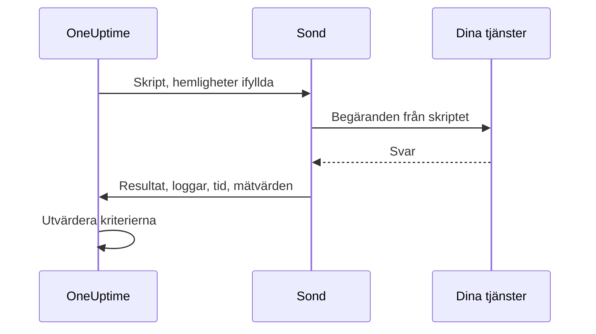

# Anpassad kodövervakning

En monitor med anpassad kod kör ett JavaScript-skript som du skriver själv, från en sond, enligt ett schema. Använd den för kontroller som de andra monitortyperna inte kan uttrycka — en inloggning följd av ett autentiserat API-anrop, en transaktion i flera steg eller ett värde som du räknar fram ur flera svar. Om skriptet kastar ett fel misslyckas kontrollen; det som skriptet returnerar finns tillgängligt för dina kriterier och dina incidentmallar.

:::cards
- [Skapa monitorn](#skapa-en-monitor-med-anpassad-kod): Skriv ett skript och välj de sonder som kör det.
- [Skriv skriptet](#skriv-skriptet): En körbar API-kontroll i flera steg att utgå från.
- [Använd hemligheter](#använda-övervakningshemligheter): Håll lösenord och token utanför skriptet.
- [Samla in anpassade mätvärden](#anpassade-mätvärden): Visa varje tal som ditt skript räknar fram i ett diagram.
:::

## Så fungerar det

Vid varje kontroll kör en sond ditt skript i en isolerad JavaScript-sandlåda, med dina övervakningshemligheter redan ifyllda. Skriptet anropar det som behövs och returnerar sedan ett resultat eller kastar ett fel. Sonden rapporterar resultatet, skriptets loggmeddelanden, hur länge det körde och de mätvärden det samlade in, och OneUptime utvärderar dina kriterier mot dem.



Sandlådan är inte Node.js: det finns ingen `require`, `process`, `fetch` eller något filsystem, bara [modulerna som listas nedan](#moduler-som-är-tillgängliga-i-skriptet).

## Innan du börjar

- En **sond** som når alla slutpunkter som skriptet anropar. Använd en [anpassad sond](/docs/probe/custom-probe) för slutpunkter i ditt nätverk.
- För att anropa en privat adress (som `10.0.0.5`) måste sonden tillåta det: ange `PROBE_ALLOW_PRIVATE_NETWORK_MONITORS=true` på den sonden. Loopback-, link-local- och molnmetadataadresser avvisas alltid. Se [Åtkomst till privat nätverk](/docs/self-hosted/private-network-access).
- Alla lösenord, API-nycklar och token som skriptet behöver, sparade som [övervakningshemligheter](/docs/monitor/monitor-secrets).

## Skapa en monitor med anpassad kod

:::steps
### Starta en ny monitor

Gå till **Monitorer** och klicka på **Skapa monitor**. Under **Monitortyp** klickar du på **Fler monitortyper** och väljer **Custom JavaScript Code** under **Synthetic Monitoring**, eller skriver `script` i sökrutan. Ange ett **Namn** och klicka sedan på **Nästa**.

### Lägg till skriptet

Skriv ditt skript i redigeraren **JavaScript-kod**. Utgå från [exemplet nedan](#skriv-skriptet).

### Testa det

Klicka på **Testa monitor** för att köra skriptet en gång från en sond och kontrollera resultatet.

### Gå igenom kriterierna

Monitorn börjar med två kriterier: den är offline och deklarerar en incident när skriptet misslyckas, och online när det inte gör det. Ändra dem eller lägg till egna — se [Kriterier](#kriterier) — och klicka sedan på **Nästa**.

### Välj sonder och skapa

Välj de **Sonder** som når dina slutpunkter och ett **Övervakningsintervall** — monitorer med anpassad kod erbjuds var 5:e minut eller mer sällan — och klicka sedan på **Skapa monitor**.
:::

## Skriv skriptet

Skriptet är kroppen i en `async`-funktion: du kan använda `await` på översta nivån, returnera ett resultat med `return` och få kontrollen att misslyckas med `throw`. Det här exemplet loggar in, anropar en slutpunkt med den token det fick tillbaka och misslyckas om svaret inte är det som förväntas:

```javascript title="Custom code monitor script"
// 1. Log in. axios rejects a 4xx or 5xx response, which fails the check.
const login = await axios.post("https://api.example.com/v1/login", {
  username: "monitoring@example.com",
  password: "{{monitorSecrets.ApiPassword}}",
});

// 2. Call an endpoint that needs the token.
const orders = await axios.get("https://api.example.com/v1/orders?limit=10", {
  headers: { Authorization: `Bearer ${login.data.token}` },
  timeout: 10000,
});

// 3. Fail the check when the data is wrong, not only when the request fails.
if (!Array.isArray(orders.data.items)) {
  throw new Error("The orders endpoint returned no items");
}

console.log(`Fetched ${orders.data.items.length} orders`);

// 4. Return what the criteria and incident templates should see.
return {
  data: orders.data.items.length,
};
```

| För att | Gör så här | Vad OneUptime registrerar |
| --- | --- | --- |
| Rapportera ett resultat | `return { data: ... }` med valfritt JSON-värde | **Resultat**. Bara egenskapen `data` sparas: `return 5` registrerar inget resultat. |
| Få kontrollen att misslyckas | `throw new Error("...")` | **Skriptfel**, som standardkriterierna gör till en incident. |
| Lämna ett spår | `console.log(...)` | **Loggmeddelanden**, upp till 1 000 per körning. |

För att se en körning öppnar du monitorns **Översikt**: kortet **Monitor-sammanfattning** visar sonden, körningstiden och felet, och **Visa fler detaljer** visar resultatet, skriptfelet och loggmeddelandena. **Övervakningsloggar** har samma sammanfattning för tidigare kontroller.

> [!NOTE]
> `axios` i den här sandlådan följer inte omdirigeringar, och dess begäranden går inte via en proxy som är konfigurerad på sonden. Begär den slutliga URL:en.

## Använda övervakningshemligheter

Hänvisa till en hemlighet som `{{monitorSecrets.NAME}}` var som helst i skriptet. OneUptime ersätter hänvisningen med hemlighetens värde, som vanlig text, innan skriptet når sonden. Sätt därför en hemlighet inom citattecken för att använda den som en sträng, och lämna den utan citattecken för att använda den som ett tal eller ett booleskt värde:

```javascript
// Used as a string: wrap it in quotes.
const apiKey = "{{monitorSecrets.ApiKey}}";

// Used as a number or a boolean: leave it bare.
const retryLimit = {{monitorSecrets.RetryLimit}};
const verbose = {{monitorSecrets.Verbose}};

// Check the secret was filled in without logging the secret itself.
console.log(apiKey.length > 0);
```

Ett hemligt värde som innehåller ett citattecken förstör strängen runt det. En hänvisning som monitorn inte kan använda blir kvar i skriptet som den skrevs. Se [Övervakningshemligheter](/docs/monitor/monitor-secrets) för att skapa en hemlighet och välja vilka monitorer som kan använda den.

## Anpassade mätvärden

Du kan samla in anpassade mätvärden från ditt skript med funktionen `oneuptime.captureMetric()`. Mätvärdena lagras i OneUptime och kan visas i diagram på instrumentpaneler med Metric Explorer.

```javascript
oneuptime.captureMetric(name, value, attributes);
```

| Parameter | Typ | Beskrivning |
| --- | --- | --- |
| `name` | string, obligatorisk | Mätvärdets namn (t.ex. `"api.response.time"`). Det lagras automatiskt med prefixet `custom.monitor.`. |
| `value` | number, obligatorisk | Mätvärdets numeriska värde. Ett värde som inte är ett tal ignoreras. |
| `attributes` | object, valfri | Nyckel-värde-par med extra sammanhang. Strängar, tal och booleska värden registreras (tal och booleska värden lagras som text, eftersom attribut på mätvärden är dimensioner och inte mätningar). Värden av alla andra typer ignoreras. |

### Exempel

```javascript
const response = await axios.get("https://api.example.com/health");

// Capture a simple metric
oneuptime.captureMetric("api.response.time", response.data.latency);

// Capture a metric with attributes
oneuptime.captureMetric("api.queue.depth", response.data.queueDepth, {
  region: "us-east-1",
  environment: "production",
});

return {
  data: response.data,
};
```

När de har samlats in visas mätvärdena i Metric Explorer under namn som `custom.monitor.api.response.time`, och på monitorns sida **Mätvärden** under **Anpassade mätvärden**. OneUptime lägger till monitorn och sonden på varje datapunkt, så att du kan visa dem i diagram, larma på dem och filtrera på monitor, sond eller de anpassade attribut du angav.

### Gränser

| Gräns | Värde | Över gränsen |
| --- | --- | --- |
| Mätvärden per skriptkörning | 100 | Fler anrop ignoreras. |
| Längd på mätvärdets namn | 200 tecken | Namnet kortas. |
| Attribut per mätvärde | 50 | Fler attribut tas bort. |
| Längd på attributnyckel | 200 tecken | Nyckeln kortas. |
| Längd på attributvärde | 1000 tecken | Värdet kortas. |

### Reserverade attributnycklar

Vissa attributnamn tillhör OneUptime självt, och ett skript kan inte skriva dem. Om ditt skript anger ett av dem tas attributet bort — själva mätvärdet registreras ändå — och en varning med nyckelns namn skrivs till OneUptimes serverloggar. Det gäller:

- Monitorns identitet: `monitorId`, `projectId`, `monitorName`, `probeName`, `probeId`, `isCustomMetric`.
- Allt i namnrymderna `oneuptime.` eller `resource.` — de bär de identifierare som OneUptime sätter vid inmatning.
- Attribut för resursidentitet: `service.name`, `host.name`, `k8s.cluster.name`, `iot.fleet.name`, `proxmox.cluster.name`, `vmware.vcenter.name`, `ceph.cluster.name`, `storage.array.name` och `docker.swarm.cluster.name`.

De här namnen är inte bara etiketter — OneUptime läser tillbaka dem som ett påstående om vilken resurs en datapunkt tillhör. Ett mätvärde märkt `service.name: payments-api` skulle dyka upp på den tjänstens flik Mätvärden, och om du senare byggde en mätvärdesmonitor grupperad på `service.name` skulle dess larm kopplas till den tjänsten, kalla in tjänstens ägare och tystna under ett underhållsfönster för den. Använd i stället monitorns egna etiketter för att koppla en monitor till en tjänst eller en värd.

## Kriterier

Kriterierna för en monitor med anpassad kod kan kontrollera:

| Filtertyp | Vad den kontrollerar | Filtervillkor |
| --- | --- | --- |
| **Fel** | Felet som skriptet kastade, om något. | Innehåller, Not Contains, Equal To, Not Equal To, Is Empty, Is Not Empty |
| **Result Value** | `data` som skriptet returnerade. Jämförs som ett tal när det är ett tal. | Samma, plus Greater Than, Less Than, Greater Than Or Equal To, Less Than Or Equal To, Sant och Falskt |
| **Körningstid (i ms)** | Hur länge skriptet körde. | Numeriska jämförelser |

Standardkriterierna markerar monitorn som online när **Fel** är tomt, och som offline — med en incident som löser sig själv när skriptet lyckas igen — när det inte är det. I incident- och larmmallar finns körningen tillgänglig som `{{result}}`, `{{scriptError}}`, `{{logMessages}}` och `{{executionTimeInMs}}`: se [Incident- och varningsmallar](/docs/monitor/incident-alert-templating).

### Larma på returnerade data

Det som skriptet returnerar som `data` är monitorns **Result Value**, och ett kriterium kan jämföra det — till exempel _Result Value is Equal To `UP`_.

När `data` är ett objekt eller en matris fyller du i **Fältsökväg (valfritt)** på Result Value-filtret för att jämföra ett fält i stället för hela värdet. Använd punkter för nästlade fält och `[n]` för element i en matris:

```javascript
const response = await axios.get("https://api.example.com/health");

return {
  data: {
    status: response.data.status, // "UP"
    cpu_busy_percent: response.data.cpu, // 42
    healthy: response.data.healthy, // true
    checks: response.data.checks, // [{ name: "db", latency: 12 }]
  },
};
```

| Fältsökväg | Jämför | Exempel på villkor |
| --- | --- | --- |
| `status` | `"UP"` | Not Equal To `UP` |
| `cpu_busy_percent` | `42` | Greater Than `90` |
| `healthy` | `true` | Falskt |
| `checks[0].latency` | `12` | Greater Than `500` |

Lägg till ett filter per fält som du vill kontrollera; varje filter kan ha sitt eget villkor och sitt eget värde.

- Lämna fältsökvägen tom för att jämföra hela värdet, som för ett skript som returnerar ett enda tal eller en enda sträng.
- Greater Than, Less Than och de andra talvillkoren matchar bara ett tal, så returnera ett fält som `42`, inte `"42"`. Sant och Falskt matchar bara ett booleskt värde.
- Ett fält som inte finns i returnerade data — en saknad nyckel eller ett matrisindex efter slutet — jämförs som tomt: **Is Empty** matchar det, och inget annat villkor gör det.
- Ett fält vars namn innehåller en punkt kan inte nås med en sökväg.
- I Terraform anger filtrets `custom_code_monitor_options` fältsökvägen: se [Monitorsteg](/docs/terraform/monitor-steps#comparing-one-field-of-a-scripts-result).

## Moduler som är tillgängliga i skriptet

| Namn | Vad det är |
| --- | --- |
| `axios` | En promise-baserad HTTP-klient: anropa `axios(...)`, eller `axios.get`, `post`, `put`, `patch`, `delete`, `head`, `options`, `request` och `create`. Storleken på begäranden och svar är begränsad (10 MB vardera), omdirigeringar följs inte och en sonds proxy används inte. |
| `crypto` | `createHash` och `createHmac` (anropa `update()` en gång, sedan `digest()`), `randomBytes`, `randomInt` och `randomUUID`. Det är inte Node.js-modulen `crypto`: det finns inga chiffer eller signaturer. |
| `http`, `https` | Bara deras klass `Agent`, att skicka till `axios` — till exempel `httpsAgent: new https.Agent({ rejectUnauthorized: false })`. Det finns ingen `request` eller `get`. |
| `console.log` | Loggar data för felsökning. Bara `console.log` finns; `console.error` och de andra finns inte. |
| `oneuptime.captureMetric` | Samlar in ett anpassat mätvärde. Se [Anpassade mätvärden](#anpassade-mätvärden). |
| `setTimeout`, `clearTimeout`, `sleep(ms)` | Vänta inne i skriptet. En fördröjning varar aldrig längre än skriptets tidsgräns. |

## Saker att tänka på

- **Tidsgräns.** Ett skript som kör längre än 60 sekunder stoppas och kontrollen misslyckas med "Script execution timed out". På en självhostad sond ändrar `PROBE_CUSTOM_CODE_MONITOR_SCRIPT_TIMEOUT_IN_MS` gränsen.
- **Minne.** Varje körning får en egen sandlåda med en minnesgräns på 128 MB.
- **Omdirigeringar.** `axios` följer dem inte, så en URL som omdirigerar får begäran att misslyckas. Använd den slutliga URL:en.

## Felsökning

:::details Kontrollen misslyckas med "Script execution timed out"
Skriptet körde längre än tidsgränsen. Ge varje begäran en egen `timeout` (i millisekunder), så att en långsam slutpunkt misslyckas snabbt, med ett fel som namnger den.
:::

:::details En begäran misslyckas med status 301 eller 302
`axios` följer inte omdirigeringar här. Ändra URL:en till adressen som den omdirigerar till.
:::

:::details En begäran till en intern adress avvisas
Sonden tillåter inte adresser i privata nätverk. Ange `PROBE_ALLOW_PRIVATE_NETWORK_MONITORS=true` på en sond i ditt nätverk och kör monitorn från den — se [Åtkomst till privat nätverk](/docs/self-hosted/private-network-access).
:::

:::details En hemlighet fylls inte i
Monitorn kan inte använda hemligheten, eller så stämmer namnet i hänvisningen inte exakt med hemlighetens namn. Se [Övervakningshemligheter](/docs/monitor/monitor-secrets).
:::

## Nästa steg

:::cards
- [Syntetisk övervakning](/docs/monitor/synthetic-monitor): Styr en riktig webbläsare i stället för att anropa API:er.
- [Övervakningshemligheter](/docs/monitor/monitor-secrets): Spara inloggningsuppgifterna som ditt skript använder.
- [Incident- och varningsmallar](/docs/monitor/incident-alert-templating): Lägg in skriptets resultat och loggar i incidenter.
:::
