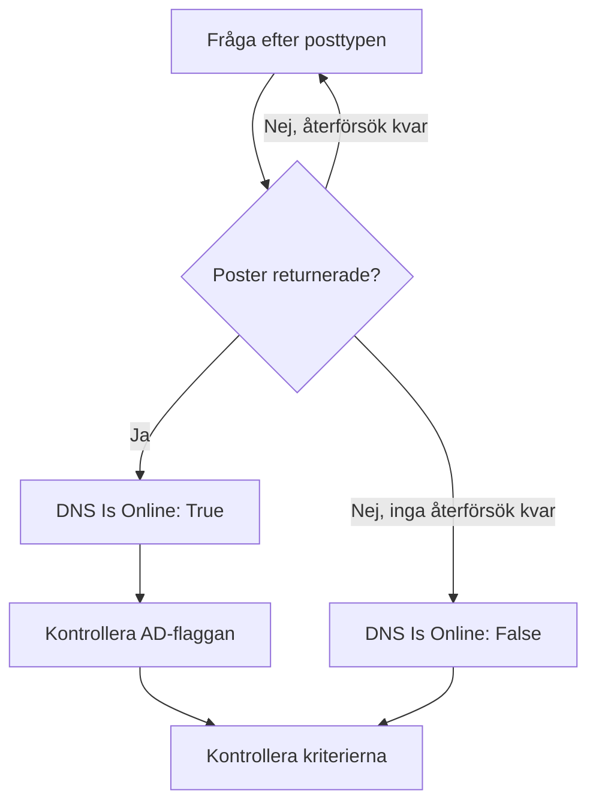

# DNS-övervakning

En DNS-monitor slår upp en DNS-post enligt ett schema och kontrollerar svaret: att namnet går att slå upp, hur snabbt och vad posterna säger. Använd den för att fånga ett DNS-avbrott, en post som har ändrats eller försvunnit, eller en långsam upplösare, innan användarna märker det.

:::cards
- [Skapa monitorn](#skapa-en-dns-monitor): Sex steg i instrumentpanelen.
- [Konfigurationsalternativ](#konfigurationsalternativ): Namnet, posttypen och DNS-servern.
- [Övervakningskriterier](#övervakningskriterier): Uppslag, poster, svarstid och DNSSEC.
- [Felsökning](#felsökning): När monitorn och `dig` inte håller med varandra.
:::

## Så fungerar det

Vid varje kontroll ber en sond en DNS-server om en posttyp för ett namn, till exempel `A`-posterna för `example.com`. Namnet är online när servern svarar med minst en post av den typen. En fråga som misslyckas, når tidsgränsen eller inte returnerar någon post görs om en sekund senare, upp till det antal återförsök du anger. Sedan frågar sonden en validerande upplösare om svaret bär DNSSEC:s authenticated-data-flagga (AD), och OneUptime kör resultatet genom monitorns kriterier.



En sond som har förlorat sin egen nätverksanslutning rapporterar inget resultat, så den kan inte markera din DNS som offline.

## Innan du börjar

- **En roll som kan skapa monitorer**: Project Owner, Project Admin, Project Member, Monitor Admin eller Monitor Member, eller en anpassad roll med behörigheten Create Monitor.
- **En sond som når DNS-servern.** Projektets standardsonder väljs för varje ny monitor. För att fråga en DNS-server i ett privat nätverk, till exempel en intern upplösare, använder du en [anpassad sond](/docs/probe/custom-probe) i det nätverket.

## Skapa en DNS-monitor

:::steps
### Börja en ny monitor

Gå till **Monitorer** och klicka på **Skapa monitor**. Klicka på **Fler monitortyper** under **Monitortyp** och välj **DNS** under **DNS Monitoring**.

### Namnge den

Ange ett **Namn**, som `example.com A records`, och klicka sedan på **Nästa**.

### Ange frågan

Ange det **Domännamn** som ska slås upp, som `example.com`, och välj dess **Posttyp**. För att fråga en viss server anger du den i **DNS-server (valfritt)**; lämna fältet tomt för att använda sondens egen upplösare.

### Testa den

Klicka på **Testa monitor**, välj en sond under **Välj sond** och klicka på **Kör test**. **Resultat av övervakningstest** visar posterna som sonden fick tillbaka.

### Gå igenom kriterierna

**Monitorkriterier** börjar med [standardkriterierna](#standardkriterier): offline när namnet inte går att slå upp, online när det går. För att kontrollera vad posterna säger lägger du till ett filter **DNS Record Value** och klickar sedan på **Nästa**.

### Välj sonder och skapa

Behåll eller ändra **Sonder** och **Övervakningsintervall** (det börjar på **Var 5:e minut**) och klicka sedan på **Skapa monitor**. Monitorns sida öppnas.
:::

## Konfigurationsalternativ

| Fält | Standard | Vad du anger |
| --- | --- | --- |
| **Domännamn** | Inget | Namnet som slås upp, som `example.com` eller `_sip._tcp.example.com`. För en `PTR`-post det omvända namnet, som `34.216.184.93.in-addr.arpa`. |
| **Posttyp** | `A` | Posttypen som slås upp. Se [Posttyper](#posttyper). |
| **DNS-server (valfritt)** | Sondens upplösare | En DNS-server som frågas i stället, som `8.8.8.8` eller `ns1.example.com`. Alla posttyper, även `CAA`, frågas hos den. |
| **Port** (under **Fler fält**) | `53` | Porten på servern i **DNS-server (valfritt)**. DNSSEC-kontrollen frågar på samma port. |
| **Timeout (ms)** (under **Fler fält**) | `5000` | Hur länge det väntas på ett svar, i millisekunder. |
| **Återförsök** (under **Fler fält**) | `3` | Återförsök efter att det första försöket har misslyckats. `0` betyder ett enda försök. |

### Posttyper

Ett kriterium med **DNS Record Value** jämför din text med varje post så som sonden skriver den, så följ det här formatet:

| Posttyp | Vad den innehåller | Värdets format, för kriterier |
| --- | --- | --- |
| `A` | IPv4-adresser | `93.184.216.34` |
| `AAAA` | IPv6-adresser | `2606:2800:220:1:248:1893:25c8:1946` |
| `CNAME` | Namnet som detta är ett alias för | `example.net` |
| `MX` | E-postservrar | `10 mail.example.com` (prioritet, sedan servern) |
| `NS` | Namnservrar | `ns1.example.com` |
| `TXT` | Text, som SPF- och verifieringsposter | `v=spf1 include:_spf.example.com ~all` |
| `SOA` | Zonens start of authority | `ns1.example.com hostmaster.example.com 2024010101 7200 3600 1209600 3600` (server, kontakt, serienummer, refresh, retry, expire, minsta TTL) |
| `PTR` | Namnet som en adress pekar tillbaka på (omvänd DNS) | `server1.example.com` |
| `SRV` | Tjänster | `10 5 5060 sip.example.com` (prioritet, vikt, port, mål) |
| `CAA` | De certifikatutfärdare som får utfärda för namnet | `0 letsencrypt.org` (flagga, sedan utfärdaren) |

En `TXT`-post som är uppdelad i flera strängar slås ihop till ett värde.

## Övervakningskriterier

Kriterier avgör när namnet räknas som online, försämrat eller offline, och om det deklarerar en incident eller skapar ett larm. Varje kriterium kontrollerar ett eller flera filter:

| Filter | Villkor | Vad det kontrollerar |
| --- | --- | --- |
| **DNS Is Online** | **Sant**, **Falskt** | Om frågan returnerade minst en post av typen. |
| **DNS Response Time (in ms)** | **Greater Than**, **Less Than**, **Greater Than Or Equal To**, **Less Than Or Equal To** | Hur lång tid frågan tog. |
| **DNS Record Exists** | **Sant**, **Falskt** | Om någon post av typen kom tillbaka. |
| **DNS Record Value** | **Innehåller**, **Not Contains**, **Starts With**, **Ends With**, **Equal To**, **Not Equal To** | Posternas värden. Filtret matchar när en enda post matchar. |
| **DNSSEC Is Valid** | **Sant**, **Falskt** | Om en validerande upplösare sätter AD-flaggan på svaret. |

**DNS Record Value** matchar när _någon_ av posterna matchar. Med flera `A`-poster matchar **Equal To** `93.184.216.34` när en av dem är den adressen, och **Not Equal To** matchar när en av dem inte är det.

**DNSSEC Is Valid** frågar servern i **DNS-server (valfritt)**, på dess **Port**, eller Google Public DNS (`8.8.8.8`) när fältet är tomt, så servern du anger bör vara en som validerar DNSSEC. Filtret har inget värde och matchar inte åt något håll när sonden inte kan köra den kontrollen. För en fullständig kontroll av en signerad zon använder du en [DNSSEC-monitor](/docs/monitor/dnssec-monitor).

Med två eller fler filter avgör **Matchningsvillkor** om **Alla** måste matcha eller om **Valfri** av dem räcker. Ett kriteriums **Åtgärder** avgör vad det gör: ändrar monitorns status, skapar ett larm, deklarerar en incident eller flera av dessa.

### Standardkriterier

En ny DNS-monitor börjar med två kriterier:

- **Offline** — namnet går inte att slå upp, eller har ingen post av typen, efter alla återförsök. Monitorn markeras som **Offline** och en incident med namnet "_monitor name_ is offline" skapas. Incidenten löser sig själv när namnet går att slå upp igen.
- **Uppe** — namnet går att slå upp. Monitorn markeras som **Fungerar**.

Kriterier kontrolleras uppifrån och ned, och det första som matchar avgör vad som händer. När inget matchar visar monitorn sin standardstatus: **Fungerar**, om du inte väljer en annan under **Fler fält** under kriterierna.

### Utvärdering över en tidsperiod

**Utvärdera dessa kriterier över en tidsperiod** är en kryssruta under ett filter, som erbjuds för **DNS Is Online** och **DNS Response Time (in ms)**. Slå på den för att bedöma ett fönster av tidigare kontroller i stället för den senaste: välj en aggregering under **Utvärdera** och ett fönster, från 2 till 60 minuter, under **Under de senaste (i minuter)**.

| Aggregering | Matchar när |
| --- | --- |
| **Genomsnitt**, **Summa**, **Maximum Value**, **Minimum Value** | Det värdet över fönstret uppfyller villkoret. Bara **DNS Response Time (in ms)**. |
| **All Values** | Varje kontroll i fönstret uppfyller villkoret. |
| **Any Value** | Minst en kontroll i fönstret uppfyller villkoret. |

**All Values** matchar först när fönstret verkligen täcks av data. En monitor som just skapats, eller en vars kontroller slutade registreras, har inte tillräcklig historik för att säga något om de senaste N minuterna, så kriteriet väntar i stället för att matcha på den enda mätning det har. **Any Value** är inställningen för "säg till direkt när en enda kontroll går över gränsen" och utlöses fortfarande omedelbart.

**Om ingen data** avgör vad som händer så länge fönstret inte kan bära kriteriet:

| Alternativ | Vad som händer | Använd det för |
| --- | --- | --- |
| **Ignore** (standard) | Kriteriet matchar inte. | Vanliga tröskellarm. |
| **Utlösare** | Den saknade datan räknas som problemet. | Kontroller där tystnad i sig är ett fel. |
| **Treat As Zero** | Fönstret jämförs som en enda nolla. | Räknare där inga händelser verkligen betyder noll. |

### Exempelkriterier

| Mål | Filter | Villkor | Värde |
| --- | --- | --- | --- |
| Offline när namnet slutar gå att slå upp | **DNS Is Online** | **Falskt** | — |
| Larma när ett namns enda `A`-post ändras | **DNS Record Value** | **Not Equal To** | `93.184.216.34` |
| Larma när en `MX`-post pekar utanför din domän | **DNS Record Value** | **Not Contains** | `example.com` |
| Markera DNS som försämrad när den är långsam | **DNS Response Time (in ms)** | **Greater Than** | `500` |
| Larma när DNSSEC-valideringen misslyckas | **DNSSEC Is Valid** | **Falskt** | — |

## Felsökning

:::details Monitorn säger offline, men namnet går att slå upp för mig
Sonden frågade en annan server, eller efter en annan posttyp. Kontrollera **Posttyp**: ett namn med bara en `CNAME`, eller bara `AAAA`-poster, har ingen `A`-post. Jämför med `dig` mot samma server:

```bash
dig @8.8.8.8 example.com A
```
:::

:::details Ett kriterium med Not Equal To utlöses fast rätt adress finns där
**DNS Record Value** matchar när en enda post matchar. Med flera poster utlöses **Not Equal To** så snart en av dem skiljer sig. För att kontrollera att ett visst värde finns bland posterna förlitar du dig på kriteriernas ordning, eftersom den första träffen vinner:

1. Behåll standardkriteriet för offline överst: **DNS Is Online** / **Falskt**.
2. Lägg under det till ett kriterium med **DNS Record Value** / **Equal To** / värdet du förväntar dig, som markerar monitorn som **Fungerar**.
3. Lägg under det i sin tur till ett kriterium med **DNS Is Online** / **Sant**, som markerar monitorn som **Offline** och deklarerar en incident. Det matchar bara svar som inte har värdet.
:::

:::details DNSSEC Is Valid matchar aldrig
Servern i **DNS-server (valfritt)** validerar inte DNSSEC och sätter därför aldrig AD-flaggan, eller så kunde sonden inte köra kontrollen. Lämna fältet tomt för att validera med `8.8.8.8`, eller använd en [DNSSEC-monitor](/docs/monitor/dnssec-monitor).
:::

## Nästa steg

:::cards
- [DNSSEC-övervakning](/docs/monitor/dnssec-monitor): Validera förtroendekedjan i en signerad zon.
- [Domänövervakning](/docs/monitor/domain-monitor): Håll koll på domänens registrering och utgång.
- [Anpassade probes](/docs/probe/custom-probe): Fråga interna DNS-servrar från ditt eget nätverk.
- [Incidenter – Översikt](/docs/incidents/index): Vad som händer när monitorn har deklarerat en.
:::
