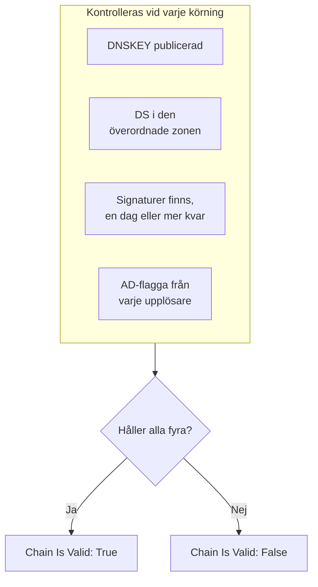

# DNSSEC-övervakning

En DNSSEC-monitor kontrollerar att en signerad DNS-zon fortfarande validerar: att den publicerar sina nycklar, att den överordnade zonen går i god för den, att dess signaturer inte har gått ut och att validerande upplösare godtar den. Använd den för att fånga en bruten förtroendekedja innan upplösare börjar svara `SERVFAIL` för din domän.

:::cards
- [Skapa monitorn](#skapa-en-dnssec-monitor): Sex steg i instrumentpanelen.
- [Vad som kontrolleras](#så-fungerar-det): Kontrollerna bakom en giltig kedja.
- [Övervakningskriterier](#övervakningskriterier): Kedjans giltighet, nycklar, DS-poster, signaturer, upplösare och namnservrar.
- [Bästa praxis](#bästa-praxis): Tröskelvärden och upplösare som fungerar.
:::

## Så fungerar det

Vid varje kontroll kör en sond en uppsättning DNS-frågor mot zonen:

| Fråga | Ställs till | Vad den berättar |
| --- | --- | --- |
| `DNSKEY` | Den första upplösaren i **Upplösare** | Om zonen publicerar sina signeringsnycklar. |
| `DS` | Den första upplösaren i **Upplösare** | Om den överordnade zonen publicerar en delegation signer-post för zonen. |
| `SOA`, med DNSSEC-poster | Den första upplösaren i **Upplösare** | Om zonens poster är signerade (den `RRSIG` som signerar dess `SOA`-post), och när den signatur som går ut först går ut. |
| `A`, med DNSSEC-validering | Varje upplösare i **Upplösare** | Om varje validerande upplösare godtar zonen, vilket den visar med authenticated-data-flaggan (AD). |
| `NS`, sedan `SOA` | Den första upplösaren, sedan varje auktoritativ namnserver den nämner | Om varje namnserver levererar samma SOA-serienummer. Bara när **Kontrollera namnserverkonsekvens** är påslaget. |

Validerande upplösare kontrollerar förtroendekedjan från roten och nedåt, så AD-flaggan berättar att hela kedjan håller. Kedjan räknas som giltig när allt detta håller:

En signatur med mindre än en dag kvar räknas redan som bruten, så du får veta det upp till en dag innan upplösare börjar avvisa zonen. En kontroll som finner kedjan bruten, eller namnservrarna i otakt, körs om en sekund senare, upp till det antal återförsök du anger, innan OneUptime kör resultatet genom monitorns kriterier. Alla frågor i ett försök delar en tidsfrist på tre gånger **Timeout (ms)**; ett försök som får slut på tid rapporterar en timeout, inte ett omdöme om zonen.

## Innan du börjar

- **En roll som kan skapa monitorer**: Project Owner, Project Admin, Project Member, Monitor Admin eller Monitor Member, eller en anpassad roll med behörigheten Create Monitor.
- **En signerad zon.** Zonen måste vara signerad och dess DS-post publicerad i den överordnade zonen via din registrar.
- **Utgående DNS från sonden** till upplösarna du anger och, för kontrollen av namnserverkonsekvens, till zonens auktoritativa namnservrar. Projektets standardsonder väljs för varje ny monitor.

## Skapa en DNSSEC-monitor

:::steps
### Börja en ny monitor

Gå till **Monitorer** och klicka på **Skapa monitor**. Klicka på **Fler monitortyper** under **Monitortyp** och välj **DNSSEC** under **DNS Monitoring**.

### Namnge den

Ange ett **Namn**, som `example.com DNSSEC`, och klicka sedan på **Nästa**.

### Ange zonen

Ange zonen som ska valideras i **Zon (domännamn)**, som `example.com`. Behåll standardvärdet för **Upplösare**, eller ange dina egna, åtskilda med kommatecken. Låt **Kontrollera namnserverkonsekvens** vara påslaget, om inte ditt nätverk blockerar DNS till godtyckliga servrar.

### Testa den

Klicka på **Testa monitor**, välj en sond under **Välj sond** och klicka på **Kör test**. **Resultat av övervakningstest** visar vad varje kontroll fann.

### Gå igenom kriterierna

**Monitorkriterier** börjar med [standardkriterierna](#standardkriterier): offline när kedjan är bruten, online när den är giltig. För att bli varnad innan signaturer går ut lägger du till ett kriterium (se [Bästa praxis](#bästa-praxis)) och klickar sedan på **Nästa**.

### Välj sonder och skapa

Behåll eller ändra **Sonder** och **Övervakningsintervall** (det börjar på **Var 5:e minut**) och klicka sedan på **Skapa monitor**. Monitorns sida öppnas.
:::

## Konfigurationsalternativ

| Fält | Standard | Vad du anger |
| --- | --- | --- |
| **Zon (domännamn)** | Inget | Zonen som valideras, som `example.com`. |
| **Upplösare** | `1.1.1.1, 8.8.8.8, 9.9.9.9` | Validerande upplösare som frågas, åtskilda med kommatecken. Var och en måste returnera AD-flaggan för att kedjan ska räknas som giltig. |
| **Kontrollera namnserverkonsekvens** | På | Fråga varje auktoritativ namnserver direkt och jämför deras SOA-serienummer. Stäng av det om ditt nätverk blockerar utgående DNS till godtyckliga servrar. |
| **Varning för signaturens utgång (dagar)** (under **Fler fält**) | `7` | Sparas med monitorn. Filtret **DNSSEC Signature Expires In Days** använder värdet du ger det i kriteriet, så ange ditt tröskelvärde där. |
| **Timeout (ms)** (under **Fler fält**) | `10000` | Hur länge det väntas på varje DNS-fråga, i millisekunder. Ett försök kan totalt ta upp till tre gånger så lång tid. |
| **Återförsök** (under **Fler fält**) | `3` | Återförsök efter att det första försöket har misslyckats. `0` betyder ett enda försök. |

## Övervakningskriterier

Kriterier avgör när zonen räknas som online, försämrad eller offline, och om det deklarerar en incident eller skapar ett larm. Varje kriterium kontrollerar ett eller flera filter:

| Filter | Villkor | Vad det kontrollerar |
| --- | --- | --- |
| **DNSSEC Chain Is Valid** | **Sant**, **Falskt** | Alla fyra kontrollerna ovan håller: nycklar publicerade, DS i den överordnade zonen, signaturer som finns med en dag eller mer kvar, och AD-flaggan från varje upplösare. |
| **DNSSEC DNSKEY Record Exists** | **Sant**, **Falskt** | Zonen publicerar minst en DNSKEY-post. |
| **DNSSEC DS Record Exists At Parent** | **Sant**, **Falskt** | Den överordnade zonen publicerar en DS-post för zonen. |
| **DNSSEC Signature Expires In Days** | **Greater Than**, **Less Than**, **Greater Than Or Equal To**, **Less Than Or Equal To** | Hela dagar tills den signatur (RRSIG) som går ut först går ut. |
| **DNSSEC Resolver Consensus (AD Flag)** | **Sant**, **Falskt** | Varje upplösare i **Upplösare** returnerar AD-flaggan. |
| **DNSSEC Nameservers Are Consistent** | **Sant**, **Falskt** | Varje auktoritativ namnserver svarar med samma SOA-serienummer. Alltid **Sant** så länge **Kontrollera namnserverkonsekvens** är avstängt. |

Med två eller fler filter avgör **Matchningsvillkor** om **Alla** måste matcha eller om **Valfri** av dem räcker. Ett kriteriums **Åtgärder** avgör vad det gör: ändrar monitorns status, skapar ett larm, deklarerar en incident eller flera av dessa.

### Standardkriterier

En ny DNSSEC-monitor börjar med två kriterier:

- **Kedjan är bruten** — **DNSSEC Chain Is Valid** är **Falskt**. Monitorn markeras som **Offline** och en incident med namnet "_monitor name_ DNSSEC chain is broken" skapas. Incidenten löser sig själv när kedjan är giltig igen.
- **Kedjan är giltig** — monitorn markeras som **Fungerar**.

Kriterier kontrolleras uppifrån och ned, och det första som matchar avgör vad som händer. När inget matchar visar monitorn sin standardstatus: **Fungerar**, om du inte väljer en annan under **Fler fält** under kriterierna.

Standardkriterierna bevakar inte själva signaturernas utgång eller namnserverkonsekvens. Lägg till kriterier för dem, som nedan.

### Exempelkriterier

| Mål | Filter | Villkor | Värde |
| --- | --- | --- | --- |
| Offline när kedjan är bruten (ett standardkriterium) | **DNSSEC Chain Is Valid** | **Falskt** | — |
| Varna innan signaturer går ut | **DNSSEC Signature Expires In Days** | **Less Than** | `7` |
| Fånga en delegering som har tappat sin DS-post | **DNSSEC DS Record Exists At Parent** | **Falskt** | — |
| Fånga upplösare som inte håller med varandra | **DNSSEC Resolver Consensus (AD Flag)** | **Falskt** | — |
| Fånga namnservrar i otakt | **DNSSEC Nameservers Are Consistent** | **Falskt** | — |

## Bästa praxis

1. **Välj upplösare som alltid går att nå.** Varje upplösare måste returnera AD-flaggan för att kedjan ska räknas som giltig, så en upplösare som sonden inte når får kontrollen att misslyckas när återförsöken är slut. Standardvärdena, `1.1.1.1`, `8.8.8.8` och `9.9.9.9`, drivs av tre olika operatörer, vilket också fångar en zon som validerar hos en upplösare men inte hos en annan.
2. **Bli varnad innan signaturer går ut.** Signeringsprogram signerar om en zon innan dess signaturer tar slut, så en signatur nära utgång betyder att omsigneringen har stannat. Lägg till ett kriterium med **DNSSEC Signature Expires In Days** / **Less Than** / `7` som skapar ett larm, och ett till på `2` som deklarerar en incident. Dra båda ovanför kriteriet som markerar kedjan som giltig, med `2`-dagarskriteriet först, eftersom det första kriteriet som matchar vinner. Välj tröskelvärden som är lägre än den tid ditt signeringsprogram normalt lämnar kvar på en signatur innan det signerar om, så att de förblir tysta så länge omsigneringen fungerar.
3. **Övervaka varje signerad zon.** Ta med apex-domänen, signerade underdomäner och varje zon som är delegerad till en annan operatör.
4. **Låt kontrollen av namnserverkonsekvens vara påslagen,** och lägg till ett kriterium för den. Den fångar en sekundär server som har slutat hämta zonöverföringar från den primära, vilket DNSSEC-validering ensam kan missa.

## Felsökning

:::details Kedjan rapporteras som bruten, men zonen validerar med `dig`
En av upplösarna i **Upplösare** returnerade inte AD-flaggan: den gick inte att nå från sonden, eller så validerar den inte DNSSEC. Tabellen **Resolver Checks**, i **Resultat av övervakningstest** och i varje kontrolls sammanfattning, visar varje upplösares svar och fel. Ta bort upplösare som sonden inte når, och ange bara validerande upplösare.
:::

:::details Namnservrar rapporteras som inkonsekventa direkt efter en ändring
Sekundära servrar kan ligga efter den primära en stund efter att zonen har ändrats. Tabellen **Nameserver Consistency** i kontrollens sammanfattning visar varje namnservers SOA-serienummer. Om en fortsätter att ligga efter har den sekundära servern slutat hämta zonöverföringar. Om varje namnserver visar ett fel kan sonden vara blockerad från att fråga dem direkt: stäng av **Kontrollera namnserverkonsekvens**.
:::

:::details Kontrollen rapporterar en timeout
Alla frågor i ett försök delar tre gånger **Timeout (ms)**. En långsam eller onåbar upplösare förbrukar den tiden; ta bort den från **Upplösare**, eller höj timeouten.
:::

## Nästa steg

:::cards
- [DNS-övervakning](/docs/monitor/dns-monitor): Kontrollera att ett namn går att slå upp och vad dess poster säger.
- [Domänövervakning](/docs/monitor/domain-monitor): Håll koll på domänens registrering och utgång.
- [Övervakning av SSL-certifikat](/docs/monitor/ssl-certificate-monitor): Håll koll på certifikaten som levereras på domänen.
- [Incidenter – Översikt](/docs/incidents/index): Vad som händer när monitorn har deklarerat en.
:::
