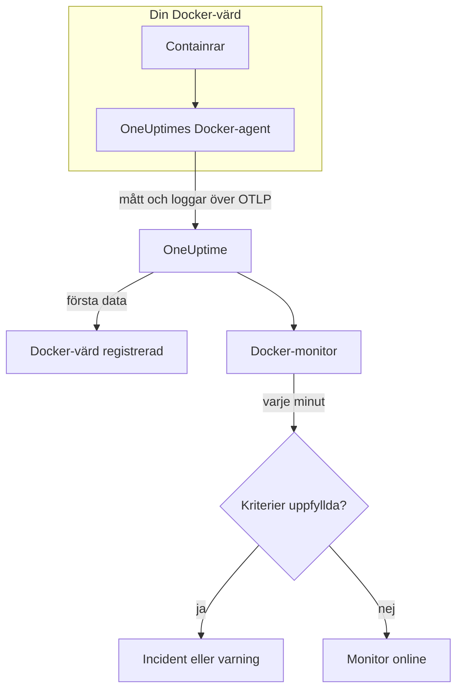

# Docker-övervakning

En Docker-monitor övervakar containrarna på en Docker-värd och säger till när en container går varm, får slut på minne eller hamnar i en kraschloop. Den läser de mätvärden som OneUptimes Docker-agent skickar från värden, så ingenting undersöks utifrån: installera agenten och skapa sedan monitorn från en mall eller din egen fråga.

:::cards
- [Skapa monitorn](#skapa-en-docker-monitor): Sex steg i instrumentpanelen.
- [Mallar](#färdiga-varningsmallar): Sex färdiga varningar, en incident per container.
- [Mätvärden](#insamlade-mätvärden): Vad agenten samlar in och vad varje mätvärde betyder.
- [Loggar](#insamlade-loggar): Containerloggar och den loggdrivrutin de behöver.
:::

## Så fungerar det

OneUptimes Docker-agent körs som en container på värden. Var 30:e sekund läser den containerstatistik från Docker Engine-API:t, följer containrarnas loggfiler och skickar båda till OneUptime över OTLP. De första data från en värd registrerar den i OneUptime.

En Docker-monitor är knuten till en värd. Varje minut kör den sin fråga över värdens containermått och jämför resultatet med sina kriterier.



## Innan du börjar

- **Installera Docker-agenten** på värden. [Guiden för Docker-agenten](/docs/telemetry/docker-host) beskriver installation, uppgradering och kontroll.
- **Kontrollera att värden är registrerad.** Den visas under **Produkter → Infrastruktur → Docker → Alla värdar**, namngiven efter agentens `DOCKER_HOST_NAME`, så snart dess första data kommer.
- **För containerloggar** kör du containrarna med Dockers loggdrivrutin `json-file`. Se [Krav på loggdrivrutin](#krav-på-loggdrivrutin).

## Skapa en Docker-monitor

:::steps
### Starta en ny monitor

Gå till **Monitorer** och klicka på **Skapa monitor**.

### Välj Docker Container

Klicka på **Fler monitortyper** under **Monitortyp** och välj **Docker Container** under **Infrastruktur**, eller skriv `docker` i sökrutan. Ange ett **Namn** – det används i titlar på incidenter och varningar – och klicka på **Nästa**.

### Välj värden

Välj värden i **Docker-värd** under **Docker-monitorkonfiguration**. Varje värd som har skickat data finns i listan.

### Välj vad som ska övervakas

Välj en av de tre flikarna:

- **Quick Setup** – klicka på en [mall](#färdiga-varningsmallar). Den anger mätvärdet, aggregeringen, tidsintervallet och trösklarna och ersätter kriterierna nedan med sina egna. Du kan fortfarande ändra **Tidsintervall**.
- **Custom Metric** – välj ett mätvärde i **Docker-mått** och ange sedan **Aggregering** och **Tidsintervall**. **Containernamn** och **Container-avbildning** begränsar det till vissa containrar.
- **Avancerad** – bygg frågor och formler själv under **Välj mått**. Använd **Group by** `resource.container.name` för att bedöma varje container för sig.

### Kontrollera kriterierna

Öppna varje kriterium under **Monitorkriterier** och kontrollera dess **Mätvärde**, **Aggregering**, **Villkor** och **Threshold**. En mall fyller i dem. Med **Custom Metric** eller **Avancerad** börjar monitorn med [standardkriterierna](#standardkriterier), som bara märker att ett mätvärde sjunker till noll, så ange din egen tröskel.

### Skapa monitorn

Klicka på **Skapa monitor**. OneUptime öppnar monitorns sida och utvärderar den varje minut. Incidenter och varningar som den öppnar visas också på värdens sidor **Incidenter** och **Varningar**.
:::

> [!TIP]
> För att ställa in flera mallar på en gång öppnar du värden från **Produkter → Infrastruktur → Docker** och går till **Recommendations**. Välj de mallar du vill ha och vem som ska larmas, så skapar OneUptime en monitor per mall.

## Monitorinställningar

| Fält | Flik | Vad det gör |
| --- | --- | --- |
| **Docker-värd** | Alla | Krävs. Begränsar varje fråga till värdens `resource.host.name`. OneUptime lägger också till `resource.container.runtime = docker` i varje fråga. |
| **Docker-mått** | Custom Metric | Ett mätvärde från agentens katalog, grupperat som CPU, minne, nätverk, block-I/O och container. |
| **Containernamn** | Custom Metric, Avancerad | Valfritt. Exakt matchning mot `resource.container.name`, till exempel `my-container`. |
| **Container-avbildning** | Custom Metric, Avancerad | Valfritt. Exakt matchning mot `resource.container.image.name`, till exempel `nginx:latest`. |
| **Aggregering** | Custom Metric | Hur mätningar kombineras: **Genomsnitt**, **Maximum**, **Minimum**, **Summa** eller **Antal**. Börjar på mätvärdets vanliga aggregering. |
| **Tidsintervall** | Alla | Det glidande fönster som frågan läser, från **Past 1 Minute** till **Past 365 Days**. En ny monitor börjar på **Past 1 Minute**; mallar anger sitt eget. |
| **Välj mått** | Avancerad | Frågebyggaren: **Mätvärde**, **Aggregate by**, **Filter by attributes**, **Group by**, plus **Lägg till mätvärde** och **Lägg till formel** för att kombinera frågor. |

## Färdiga varningsmallar

**Quick Setup** erbjuder sex mallar. Varje mall bygger en komplett monitor: en fråga grupperad efter `resource.container.name`, ett kriterium som utlöses och ett som återställer. Varje container bedöms för sig, så att en upptagen container inte döljer en annan, och varje container över tröskeln får en egen incident och en egen varning. Trösklarna är utgångspunkter som du kan redigera.

Om inte tabellen säger något annat utlöses ett kriterium bara när villkoret gäller varje minut i fönstret, och det återställs 10 % förbi tröskeln, så att ett värde som pendlar vid gränsen inte fladdrar.

| Mall | Allvarlighetsgrad | Övervakar | Utlöses när | Återställs när |
| --- | --- | --- | --- | --- |
| High Container CPU Usage | Warning | `container.cpu.utilization`, Max per container, senaste 5 minuterna | Över 80 (% av en kärna) | Vid eller under 72 |
| High Container Memory Usage | Warning | `container.memory.percent`, Max per container, senaste 5 minuterna | Över 85 % | Vid eller under 76,5 % |
| Container Restart Loop | Kritisk | Ökning av `container.restarts` per container, senaste 15 minuterna | Fler än 3 omstarter i fönstret (Summa) | 2,7 eller färre |
| Container CPU Throttling | Warning | Ökning av `container.cpu.throttling_data.throttled_time` i ms per container, senaste 5 minuterna | Mer än 1000 ms i fönstret (Summa) | 900 ms eller mindre |
| High Container Process Count | Warning | `container.pids.count`, Max per container, senaste 5 minuterna | Över 2000 | Vid eller under 1800 |
| Container Down (Low Uptime) | Kritisk | `container.uptime`, Min per container, senaste 1 minuten | Lika med 0 | Över 0 |

**Allvarlighetsgrad** är etiketten som väljaren visar. Incidenten och varningen som en mall skapar börjar på projektets allvarligaste incident- och varningsgrad; ändra dem i kriterierna.

> [!NOTE]
> `container.cpu.utilization` är talet som `docker stats` skriver ut: 100 % är en hel CPU-kärna, inte hela värden, så en container som använder två kärnor visar 200. På en värd med flera kärnor är tröskeln 80 en CPU-budget, inte en andel av maskinen.

> [!NOTE]
> `container.memory.percent` delar med containerns minnesgräns när en sådan är satt, och annars med **värdens** totala minne. Kontrollera om containern startades med `--memory` innan du behandlar en överskridning som ett nära förestående avslut på grund av minnesbrist.

> [!WARNING]
> `container.restarts` och `container.cpu.throttling_data.throttled_time` bara växer, så de två mallarna varnar på hur mycket de växte i fönstret: en Maximum- och en Minimum-fråga per minut, subtraherade av en formel och summerade. Med agentens insamling var 30:e sekund ser det ungefär hälften av den verkliga aktiviteten, och trösklarna tar redan hänsyn till det. Om du höjer agentens `collection_interval` till 60 sekunder eller mer innehåller varje minut en mätning, och båda mallarna slutar varna.

> [!CAUTION]
> **Container Down (Low Uptime)** kan inte fånga en container som stannar och förblir stoppad. Agenten rapporterar bara körande containrar, så en stoppad container skickar inga data alls och dess drifttid visar aldrig 0. För en tjänst som måste vara igång bör du också övervaka det den levererar – till exempel med en [API-övervakning](/docs/monitor/api-monitor).

## Insamlade mätvärden

Agenten använder OpenTelemetry-mottagaren `docker_stats` mot Docker-socketen var 30:e sekund. Varje containers mätvärden bär dess identitet som resursattribut: `resource.container.name`, `resource.container.image.name`, `resource.container.id`, `resource.container.runtime` (`docker`) och `resource.host.name`.

### CPU

| Mätvärde | Beskrivning |
| --- | --- |
| `container.cpu.utilization` | CPU-utnyttjande, där 100 % är en hel CPU-kärna (kolumnen CPU% i `docker stats`). |
| `container.cpu.usage.total` | Använd CPU-tid sedan containern startade, i nanosekunder. En räknare över hela livstiden. |
| `container.cpu.throttling_data.throttled_time` | Nanosekunder som containern har strypts av sin CPU-gräns sedan den startade. En räknare över hela livstiden. |
| `container.cpu.throttling_data.throttled_periods` | Strypningsperioder sedan containern startade. En räknare över hela livstiden. |

### Minne

| Mätvärde | Beskrivning |
| --- | --- |
| `container.memory.usage.total` | Minne som används, i byte. |
| `container.memory.usage.limit` | Minnesgräns, i byte. |
| `container.memory.percent` | Minnesanvändning som procentandel av containerns gräns, eller av värdens totala minne när containern inte har någon gräns. |

### Nätverk

| Mätvärde | Beskrivning |
| --- | --- |
| `container.network.io.usage.rx_bytes` | Mottagna byte. En räknare över hela livstiden. |
| `container.network.io.usage.tx_bytes` | Skickade byte. En räknare över hela livstiden. |

### Block-I/O

| Mätvärde | Beskrivning |
| --- | --- |
| `container.blockio.io_service_bytes_recursive.read` | Byte lästa från blockenheter. |
| `container.blockio.io_service_bytes_recursive.write` | Byte skrivna till blockenheter. |

### Container

| Mätvärde | Beskrivning |
| --- | --- |
| `container.uptime` | Sekunder sedan containern startade. Bara körande containrar rapporterar det. |
| `container.restarts` | Antal gånger containern har startats om sedan den skapades. En räknare över hela livstiden. |
| `container.pids.count` | Uppgifter i containern. Cgroupens pids-kontrollant räknar trådar lika väl som processer. |

Listan **Docker-mått** erbjuder också `container.cpu.usage.percpu`, `container.memory.rss`, `container.memory.cache` och räknarna för nätverkspaket. Den medföljande agentkonfigurationen slår inte på dem, så kontrollera värdens sida **Mätvärden** innan du bygger på dem. `container.cpu.throttling_data.throttled_periods` finns inte i listan; fråga efter det från **Avancerad**.

## Övervakningskriterier

Ett kriterium jämför en av monitorns frågor eller formler med en tröskel. En Docker-monitors kriterier har ingen **Filtertyp**: varje regel kontrollerar mätvärdet, med de här fälten.

| Fält | Vad det gör |
| --- | --- |
| **Mätvärde** | Frågan eller formeln som kontrolleras, efter dess variabelnamn. |
| **Aggregering** | Hur värdena i fönstret blir ett svar: **Genomsnitt**, **Summa**, **Maximum Value**, **Minimum Value**, **All Values** (varje värde måste matcha) eller **Any Value** (ett räcker). |
| **Villkor** | **Greater Than**, **Less Than**, **Greater Than Or Equal To**, **Less Than Or Equal To** eller **Equal To** – eller ett avvikelsevillkor: **Anomalously High**, **Anomalously Low** eller **Anomalous**. |
| **Threshold** | Värdet att jämföra med. En lista med enheter står bredvid när mätvärdet har en enhet. Visas inte för avvikelsevillkor. |
| **Känslighet** | Bara avvikelsevillkor. **Låg** (4σ), **Medel** (3σ, standard) eller **Hög** (2σ). |
| **Baslinjefönster** | Bara avvikelsevillkor. 14 dagar (standard), 28, 60 eller 90 dagars historik. |
| **Om ingen data** | Under **Fler fält**. Vad som händer när fönstret saknar mätningar: **Ignore** (standard), **Treat As Zero** eller **Utlösare**. |

Avvikelsevillkor jämför varje värde med samma timme i veckan i baslinjen. De stannar i ett "Learning"-läge och ger ingenting förrän baslinjefönstret innehåller tillräckligt med historik.

Varje kriterium anger också vad som ska hända när det matchar: ändra monitorns status, skapa en varning eller deklarera en incident. Kriterierna kontrolleras uppifrån och ned, och det första som matchar avgör.

### Standardkriterier

En monitor som du inte bygger från en mall börjar med två kriterier:

| Ordning | Kriterium | Matchar när | Sedan |
| --- | --- | --- | --- |
| 1 | Check if _monitor name_ is offline | Något värde i den första frågan är `0` | Markerar monitorn som **Offline** och deklarerar incidenten "_monitor name_ is offline", som löser sig själv när monitorn återhämtar sig. |
| 2 | Check if _monitor name_ is online | Något värde är över `0` | Markerar monitorn som **Fungerar**. |

> [!IMPORTANT]
> Tystnad matchar inget av kriterierna: en värd som slutar skicka data lämnar monitorn som den var. För att få veta när data slutar komma ställer du in **Om ingen data** på **Utlösare** i ett kriterium. Tid då OneUptime själv inte tog emot data är aldrig saknade data: en kontroll vars fönster innehåller sådan tid väntar i stället, som [När OneUptime inte tar emot data](/docs/monitor/when-oneuptime-is-not-receiving) förklarar.

## Insamlade loggar

Agenten följer också varje containers fil `*-json.log` och skickar varje rad som en OpenTelemetry-loggpost med:

| Fält | Värde |
| --- | --- |
| `resource.host.name` | Värden, från `DOCKER_HOST_NAME`. |
| `resource.container.id` | Det fullständiga container-ID:t. |
| `resource.container.runtime` | Alltid `docker`. |
| `attributes["log.iostream"]` | `stdout` eller `stderr`. |
| `severityText` / `severityNumber` | Läses från ett nivånyckelord där en nivå står i raden (`[ERROR]`, `app.INFO:`, `{"level":"warn"}`, `level=error`). En rad utan nivå faller tillbaka på sin ström: `stderr` är `ERROR`, `stdout` är `INFO`. |
| `body` | Raden som containern skrev. Rader som börjar med blanksteg eller en avslutande parentes, som rader i en stackspårning, läggs till raden före. |
| `time` | Docker-daemonens tidsstämpel för raden. |

Loggar visas på värdens sida **Loggar** och på varje containers sida.

### Krav på loggdrivrutin

Agenten kan bara läsa loggar från containrar som använder Dockers loggdrivrutin `json-file`. Det är Dockers standard, men en container eller hela daemonen kan använda en annan:

| Drivrutin | Vad agenten ser |
| --- | --- |
| `json-file` | Varje rad. |
| `local` | Ingenting: filen är binär och agenten kan inte tolka den. |
| `journald`, `syslog`, `fluentd`, `gelf`, `awslogs`, `splunk`, … | Ingenting: loggarna går någon annanstans, så det finns ingen fil att följa. |
| `none` | Ingenting: loggarna kastas. |

Kontrollera en containers drivrutin och daemonens standard:

```bash
docker inspect <container> --format '{{.HostConfig.LogConfig.Type}}'
docker info --format '{{.LoggingDriver}}'
```

Byt till `json-file`. Docker bestämmer en containers loggdrivrutin när containern skapas, så återskapa varje container efter ändringen – en omstart behåller den gamla drivrutinen.

:::tabs
@tab Docker Compose
Ange drivrutinen för varje tjänst, med rotation:

```yaml title="docker-compose.yml"
services:
  my-app:
    image: my-app:latest
    logging:
      driver: "json-file"
      options:
        max-size: "100m"
        max-file: "5"
```

Återskapa sedan tjänsten:

```bash
docker compose up -d --force-recreate <service>
```
@tab Docker-daemon
Gör `json-file` till standard för varje container som skapas efteråt:

```json title="/etc/docker/daemon.json"
{
  "log-driver": "json-file",
  "log-opts": {
    "max-size": "100m",
    "max-file": "5"
  }
}
```

Starta om Docker-daemonen och ta sedan bort och återskapa varje container:

```bash
docker rm -f <container>
docker run ... <image>
```
:::

## Felsökning

:::details Värden finns inte i listan Docker-värd
Värdar registrerar sig själva utifrån agentens data. Kontrollera att agentcontainern körs och att värden finns under **Produkter → Infrastruktur → Docker → Alla värdar**. [Guiden för Docker-agenten](/docs/telemetry/docker-host) har kontrollerna du kan köra på värden.
:::

:::details Mätvärden kommer men sidan Loggar är tom
Containrarna använder nästan säkert inte loggdrivrutinen `json-file`. Kontrollera dem med kommandona i [Krav på loggdrivrutin](#krav-på-loggdrivrutin), byt drivrutin på dem vars loggar du vill ha och återskapa dem.
:::

:::details Agenten loggar "no files match the configured criteria"
Agenten letar efter `/var/lib/docker/containers/*/*-json.log` och hittade ingenting. Antingen använder ingen container på värden `json-file`, eller så saknas agentens montering av `/var/lib/docker/containers` (`-v /var/lib/docker/containers:/var/lib/docker/containers:ro`) eller är tom, eller så körs agenten på Docker Desktop för macOS, där containerfilerna ligger i dess Linux-VM.
:::

:::details Data kommer under fel värdnamn
OneUptime identifierar en värd med `resource.host.name`, som agenten tar från `DOCKER_HOST_NAME`. Om du ändrar `DOCKER_HOST_NAME` efter de första data skapas en andra värd i stället för att den första byter namn, och en monitor förblir knuten till namnet den skapades med.
:::

:::details En CPU-varning utlöses aldrig
Gruppera frågan efter `resource.container.name` och aggregera med **Maximum**, som mallen **High Container CPU Usage** gör. Ett genomsnitt över alla containrar på en upptagen värd dras ned av de inaktiva. Kom ihåg att 100 % betyder en hel kärna, så en container som får använda flera kärnor behöver en högre tröskel.
:::

:::details Mallen för omstartsloop eller strypning slutade varna
Båda mäter hur mycket en räknare växte mellan två mätningar under samma minut. Om agentens `collection_interval` är 60 sekunder eller mer innehåller varje minut en mätning, ökningen är alltid 0 och ingen av mallarna utlöses. Behåll agentens standard på 30 sekunder.
:::

## Nästa steg

:::cards
- [Docker-agent](/docs/telemetry/docker-host): Installera, uppgradera och felsök agenten som den här monitorn läser.
- [Podman-övervakning](/docs/monitor/podman-monitor): Samma monitor för Podman-värdar.
- [Docker Swarm-övervakning](/docs/monitor/docker-swarm-monitor): Övervaka uppgifterna i ett Swarm-kluster.
- [Incidenter – Översikt](/docs/incidents/index): Vad som händer efter att ett kriterium har deklarerat en incident.
:::
