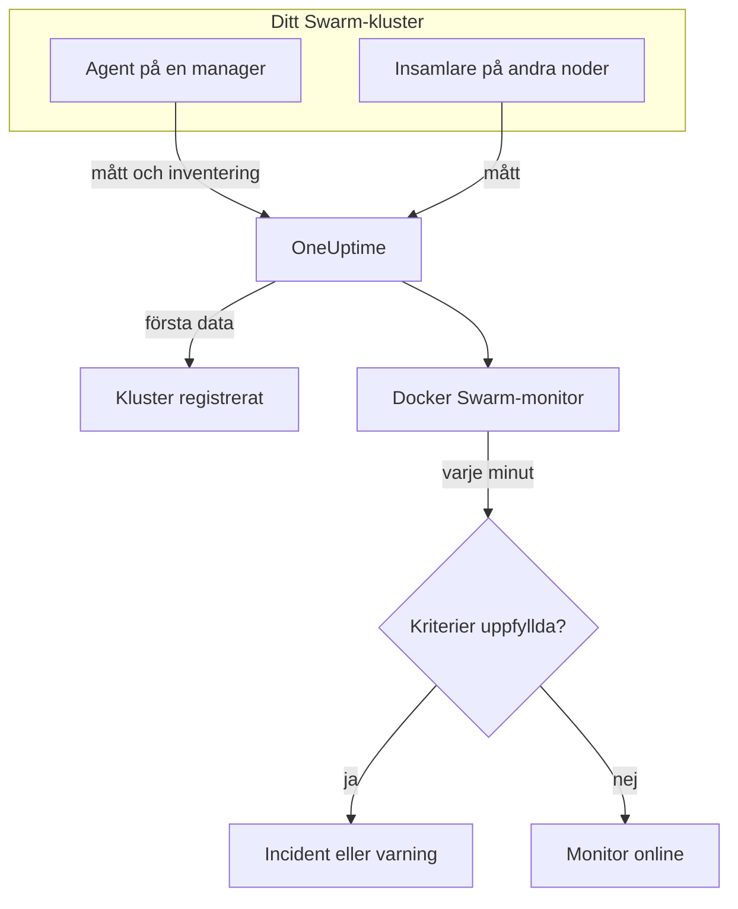

# Docker Swarm-övervakning

En Docker Swarm-monitor övervakar containrarna bakom ett Swarm-klusters tjänsteuppgifter och säger till när en uppgift startar om, går varm eller får slut på minne. Den läser de containermått som OneUptimes Docker Swarm-agent skickar, så ingenting undersöks utifrån: installera agenten och skapa sedan monitorn från en mall eller din egen fråga.

:::cards
- [Skapa monitorn](#skapa-en-docker-swarm-monitor): Sex steg i instrumentpanelen.
- [Mallar](#färdiga-varningsmallar): Fyra färdiga varningar, en incident per uppgift.
- [Mätvärden](#insamlade-mätvärden): De containermått som du kan varna på.
- [Filter](#monitorinställningar): Begränsa en monitor till en tjänst, en uppgift eller en avbildning.
:::

## Så fungerar det

OneUptimes Docker Swarm-agent körs på en managernod. Dess insamlare läser containerstatistik från nodens Docker-daemon var 30:e sekund och stämplar varje omgång med klustrets namn, `docker.swarm.cluster.name`. En liten inventeringspoller bredvid läser klustrets noder, tjänster och uppgifter från Swarm-API:t var 5:e minut. De första data registrerar klustret i OneUptime.

Insamlaren ser bara containrar på den nod den körs på. För mått från varje nod kör du insamlaren på varje nod med samma `DOCKER_SWARM_CLUSTER_NAME`.

En Docker Swarm-monitor är knuten till ett kluster. Varje minut kör den sin fråga över klustrets containermått och jämför resultatet med sina kriterier.

## Innan du börjar

- **Installera Docker Swarm-agenten** på en managernod. [Guiden för Docker Swarm-agenten](/docs/telemetry/docker-swarm) beskriver installation och uppgradering, och hur du kör insamlaren på de andra noderna.
- **Kontrollera att klustret är registrerat.** Det visas under **Produkter → Infrastruktur → Docker Swarm → Alla kluster**, namngivet efter agentens `DOCKER_SWARM_CLUSTER_NAME`, så snart dess första data kommer.

## Skapa en Docker Swarm-monitor

:::steps
### Starta en ny monitor

Gå till **Monitorer** och klicka på **Skapa monitor**.

### Välj Docker Swarm

Klicka på **Fler monitortyper** under **Monitortyp** och välj **Docker Swarm** under **Infrastruktur**, eller skriv `swarm` i sökrutan. Ange ett **Namn** – det används i titlar på incidenter och varningar – och klicka på **Nästa**.

### Välj klustret

Välj klustret i **Docker Swarm Cluster** under **Docker Swarm Monitor Configuration**. Varje kluster som har skickat data finns i listan.

### Välj vad som ska övervakas

Välj en av de tre flikarna:

- **Quick Setup** – klicka på en [mall](#färdiga-varningsmallar). Den anger mätvärdet, aggregeringen, tidsintervallet och trösklarna och ersätter kriterierna nedan med sina egna. Du kan fortfarande ändra **Tidsintervall**.
- **Custom Metric** – välj ett mätvärde i **Docker Swarm Metric** och ange sedan **Aggregering** och **Tidsintervall**. [Filtren](#monitorinställningar) begränsar det till vissa uppgifter.
- **Avancerad** – bygg frågor och formler själv under **Välj mått**. Använd **Group by** `resource.container.name` för att bedöma varje uppgift för sig.

### Kontrollera kriterierna

Öppna varje kriterium under **Monitorkriterier** och kontrollera dess **Mätvärde**, **Aggregering**, **Villkor** och **Threshold**. En mall fyller i dem. Med **Custom Metric** eller **Avancerad** börjar monitorn med [standardkriterierna](#standardkriterier), som bara märker att ett mätvärde sjunker till noll, så ange din egen tröskel.

### Skapa monitorn

Klicka på **Skapa monitor**. OneUptime öppnar monitorns sida och utvärderar den varje minut. Incidenter och varningar som den öppnar visas också på klustrets sidor **Incidenter** och **Varningar**.
:::

> [!TIP]
> För att ställa in flera mallar på en gång öppnar du klustret från **Produkter → Infrastruktur → Docker Swarm** och går till **Recommendations**. Välj de mallar du vill ha och vem som ska larmas, så skapar OneUptime en monitor per mall.

## Monitorinställningar

| Fält | Flik | Vad det gör |
| --- | --- | --- |
| **Docker Swarm Cluster** | Alla | Krävs. Begränsar varje fråga till `resource.docker.swarm.cluster.name`. Det är det enda resursattribut som agenten stämplar, så monitorn lägger inte till något filter på `container.runtime` eller `host.name`. |
| **Tjänstenamn** | Custom Metric, Avancerad | Valfritt. Exakt matchning mot `docker.swarm.service.name`, till exempel `web`. |
| **Nodnamn** | Custom Metric, Avancerad | Valfritt. Exakt matchning mot `docker.swarm.node.name`, till exempel `swarm-node-1`. |
| **Containernamn** | Custom Metric, Avancerad | Valfritt. Exakt matchning mot `resource.container.name`. En uppgifts container heter `<service>.<slot>.<taskid>`, till exempel `web.1.abc123`. |
| **Container-avbildning** | Custom Metric, Avancerad | Valfritt. Exakt matchning mot `resource.container.image.name`, till exempel `nginx:latest`. |
| **Docker Swarm Metric** | Custom Metric | Ett mätvärde från [katalogen](#insamlade-mätvärden). |
| **Aggregering** | Custom Metric | Hur mätningar kombineras: **Genomsnitt**, **Maximum**, **Minimum**, **Summa** eller **Antal**. Börjar på mätvärdets vanliga aggregering. |
| **Tidsintervall** | Alla | Det glidande fönster som frågan läser, från **Past 1 Minute** till **Past 365 Days**. En ny monitor börjar på **Past 1 Minute**; mallar anger sitt eget. |
| **Välj mått** | Avancerad | Frågebyggaren: **Mätvärde**, **Aggregate by**, **Filter by attributes**, **Group by**, plus **Lägg till mätvärde** och **Lägg till formel** för att kombinera frågor. |

> [!WARNING]
> Den medföljande agenten sätter ännu inte `docker.swarm.service.name` eller `docker.swarm.node.name`, så en monitor med **Tjänstenamn** eller **Nodnamn** ifyllt hittar inga data. Begränsa i stället med **Container-avbildning**, eller gruppera efter `resource.container.name`.

## Färdiga varningsmallar

**Quick Setup** erbjuder fyra mallar. Varje mall bygger en komplett monitor: en fråga grupperad efter `resource.container.name`, ett kriterium som utlöses och ett som återställer. Varje uppgift bedöms för sig och får en egen incident och en egen varning, vars grundorsak listar de berörda uppgifterna och deras värden. Trösklarna är utgångspunkter som du kan redigera.

Om inte tabellen säger något annat utlöses ett kriterium bara när villkoret gäller varje minut i fönstret, och det återställs 10 % förbi tröskeln, så att ett värde som pendlar vid gränsen inte fladdrar.

| Mall | Allvarlighetsgrad | Övervakar | Utlöses när | Återställs när |
| --- | --- | --- | --- | --- |
| Task Down (Low Uptime) | Kritisk | `container.uptime`, Min per uppgift, senaste 1 minuten | Något värde är under 60 sekunder | Varje värde är vid eller över 66 sekunder |
| High Task CPU Usage | Warning | `container.cpu.utilization`, Avg per uppgift, senaste 5 minuterna | Över 80 (% av en kärna) | Vid eller under 72 |
| High Task Memory Usage | Warning | `container.memory.percent`, Avg per uppgift, senaste 5 minuterna | Över 85 % | Vid eller under 76,5 % |
| High Task Process Count | Warning | `container.pids.count`, Max per uppgift, senaste 5 minuterna | Över 500 | Vid eller under 450 |

**Allvarlighetsgrad** är etiketten som väljaren visar. Incidenten och varningen som en mall skapar börjar på projektets allvarligaste incident- och varningsgrad; ändra dem i kriterierna.

> [!NOTE]
> **Task Down (Low Uptime)** utlöses på en enda ung mätning, eftersom en omstart är en händelse och inte en nivå. Swarm ger en ersättningsuppgift en ny container, och därmed en ny serie, vilket är varför mallen letar efter en drifttid under en minut i stället för en nolla. En driftsättning eller en uppskalning utlöser den också, och den upphör när de nya uppgifterna har passerat en minuts drifttid. En uppgift som dör och inte ersätts skickar ingenting, så den fångas inte.

## Insamlade mätvärden

Agentens insamlare använder OpenTelemetry-mottagaren `docker_stats`, så måtten är de vanliga containermåtten, en serie per uppgiftscontainer. Det finns inga mått `docker_swarm_*`: noder, tjänster och uppgifter följs som inventering, på klustrets sidor **Tjänster**, **Uppgifter**, **Noder** och relaterade sidor.

### CPU

| Mätvärde | Enhet | Beskrivning |
| --- | --- | --- |
| `container.cpu.utilization` | % | CPU-utnyttjande för en uppgifts container, där 100 % är en hel CPU-kärna. |

### Minne

| Mätvärde | Enhet | Beskrivning |
| --- | --- | --- |
| `container.memory.usage.total` | byte | Minne som en uppgifts container använder. |
| `container.memory.percent` | % | Använt minne som procentandel av containerns gräns, eller av nodens totala minne när tjänsten inte anger någon gräns. |

### Nätverk

| Mätvärde | Enhet | Beskrivning |
| --- | --- | --- |
| `container.network.io.usage.rx_bytes` | byte | Byte som en uppgifts container tagit emot. En räknare över hela livstiden. |
| `container.network.io.usage.tx_bytes` | byte | Byte som en uppgifts container skickat. En räknare över hela livstiden. |

### Container

| Mätvärde | Enhet | Beskrivning |
| --- | --- | --- |
| `container.pids.count` | antal | Processer i en uppgifts container. En plötslig ökning kan betyda en forkbomb eller en läcka. |
| `container.uptime` | sekunder | Hur länge en uppgifts container har körts. En uppgift som schemaläggs om eller startas om börjar en ny container på 0. |

Varje serie bär containerns identitet som resursattribut: `resource.container.name` (`<service>.<slot>.<taskid>`), `resource.container.image.name` och `resource.docker.swarm.cluster.name`.

## Övervakningskriterier

Ett kriterium jämför en av monitorns frågor eller formler med en tröskel. En Docker Swarm-monitors kriterier har ingen **Filtertyp**: varje regel kontrollerar mätvärdet, med de här fälten.

| Fält | Vad det gör |
| --- | --- |
| **Mätvärde** | Frågan eller formeln som kontrolleras, efter dess variabelnamn. |
| **Aggregering** | Hur värdena i fönstret blir ett svar: **Genomsnitt**, **Summa**, **Maximum Value**, **Minimum Value**, **All Values** (varje värde måste matcha) eller **Any Value** (ett räcker). |
| **Villkor** | **Greater Than**, **Less Than**, **Greater Than Or Equal To**, **Less Than Or Equal To** eller **Equal To** – eller ett avvikelsevillkor: **Anomalously High**, **Anomalously Low** eller **Anomalous**. |
| **Threshold** | Värdet att jämföra med. En lista med enheter står bredvid när mätvärdet har en enhet. Visas inte för avvikelsevillkor. |
| **Känslighet** | Bara avvikelsevillkor. **Låg** (4σ), **Medel** (3σ, standard) eller **Hög** (2σ). |
| **Baslinjefönster** | Bara avvikelsevillkor. 14 dagar (standard), 28, 60 eller 90 dagars historik. |
| **Om ingen data** | Under **Fler fält**. Vad som händer när fönstret saknar mätningar: **Ignore** (standard), **Treat As Zero** eller **Utlösare**. |

Avvikelsevillkor jämför varje värde med samma timme i veckan i baslinjen. De stannar i ett "Learning"-läge och ger ingenting förrän baslinjefönstret innehåller tillräckligt med historik.

Varje kriterium anger också vad som ska hända när det matchar: ändra monitorns status, skapa en varning eller deklarera en incident. Kriterierna kontrolleras uppifrån och ned, och det första som matchar avgör.

### Standardkriterier

En monitor som du inte bygger från en mall börjar med två kriterier:

| Ordning | Kriterium | Matchar när | Sedan |
| --- | --- | --- | --- |
| 1 | Check if _monitor name_ is offline | Något värde i den första frågan är `0` | Markerar monitorn som **Offline** och deklarerar incidenten "_monitor name_ is offline", som löser sig själv när monitorn återhämtar sig. |
| 2 | Check if _monitor name_ is online | Något värde är över `0` | Markerar monitorn som **Fungerar**. |

> [!IMPORTANT]
> Tystnad matchar inget av kriterierna: ett kluster som slutar skicka data lämnar monitorn som den var. För att få veta när data slutar komma ställer du in **Om ingen data** på **Utlösare** i ett kriterium. Tid då OneUptime själv inte tog emot data är aldrig saknade data: en kontroll vars fönster innehåller sådan tid väntar i stället, som [När OneUptime inte tar emot data](/docs/monitor/when-oneuptime-is-not-receiving) förklarar.

## Felsökning

:::details Klustret finns inte i listan Docker Swarm Cluster
Kluster registrerar sig själva utifrån agentens data. Kontrollera att agenten körs på en managernod, att `DOCKER_SWARM_CLUSTER_NAME` är angivet och att klustret finns under **Produkter → Infrastruktur → Docker Swarm → Alla kluster**. [Guiden för Docker Swarm-agenten](/docs/telemetry/docker-swarm) har kontrollerna du kan köra på noden.
:::

:::details Bara vissa uppgifter har mätvärden
Insamlaren läser Docker-daemonen på den nod den körs på, så den ser bara uppgifterna på den noden. Kör insamlaren på varje nod med samma `DOCKER_SWARM_CLUSTER_NAME`.
:::

:::details En monitor filtrerad på tjänst eller nod hittar inga data
**Tjänstenamn** och **Nodnamn** matchar `docker.swarm.service.name` och `docker.swarm.node.name`, som den medföljande agenten inte sätter. Töm dem och begränsa med **Container-avbildning**, eller gruppera efter `resource.container.name`.
:::

:::details Varje uppgift visas som en enda serie
Gruppera efter resursattributet `resource.container.name`, som mallarna gör. Det nakna `container.name` matchar ingenting, så alla uppgifter slås ihop till en serie med ett tomt namn.
:::

## Nästa steg

:::cards
- [Docker Swarm-agent](/docs/telemetry/docker-swarm): Installera och uppgradera agenten som den här monitorn läser.
- [Docker-övervakning](/docs/monitor/docker-monitor): Övervaka containrarna på en enda Docker-värd.
- [Incidenter – Översikt](/docs/incidents/index): Vad som händer efter att ett kriterium har deklarerat en incident.
- [Jourscheman](/docs/on-call/schedules): Bestäm vem som larmas när en uppgift går sönder.
:::
