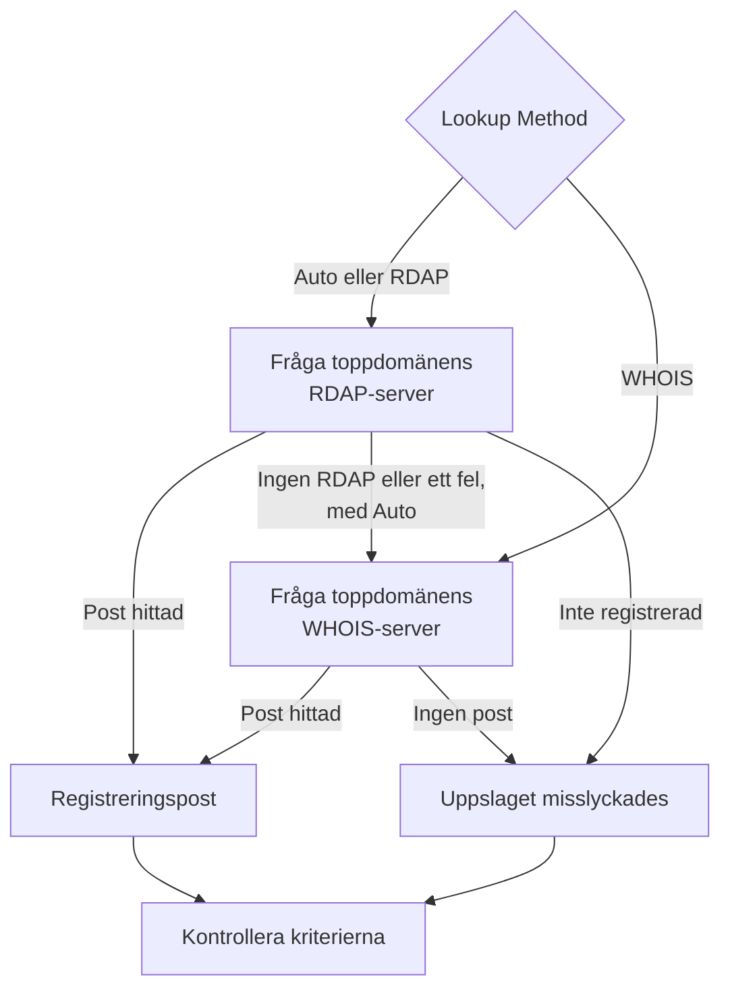

# Domänövervakning

En domänmonitor läser din domäns registreringspost enligt ett schema för att följa dess utgångsdatum, registrar, namnservrar och statuskoder, och varnar dig innan den går ut. Använd den för varje domän som dina webbplatser, API:er och din e-post är beroende av: en utgången registrering slår ut dem alla på en gång.

:::cards
- [Skapa monitorn](#skapa-en-domänmonitor): Sex steg i instrumentpanelen.
- [Uppslagsmetoder](#uppslagsmetoder): RDAP, WHOIS, och varför **Auto** är standard.
- [Standardkriterier](#standardkriterier): En varning om utgång 30 dagar i förväg, utan inställningar.
- [Felsökning](#felsökning): Nedlagda WHOIS-servrar, proxyservrar och saknade datum.
:::

## Så fungerar det

Vid varje kontroll slår en sond upp domänens registreringspost via RDAP eller WHOIS, beroende på **Lookup Method**, och normaliserar det den hittar: utgångsdatumet, registraren, namnservrarna och statuskoderna. Ett uppslag som misslyckas görs om, upp till det antal återförsök du anger. Sedan kör OneUptime posten genom monitorns kriterier.

Om ett uppslag inte kan ge registreringsdata — eftersom toppdomänens tjänst är nedlagd, eller domänen inte är registrerad — rapporteras monitorn som **offline** med orsaken visad i monitorns sondsvar, i stället för att rapporteras som frisk med ett tomt utgångsdatum. Ett register som svarar "den här domänen är ledig" (till exempel `Status: free` hos DENIC) behandlas som **inte registrerad**, inte som en frisk post.

Internationaliserade domännamn godtas i båda formerna: `münchen.de` konverteras till sin A-label (`xn--mnchen-3ya.de`) före uppslaget.

## Innan du börjar

- **En roll som kan skapa monitorer**: Project Owner, Project Admin, Project Member, Monitor Admin eller Monitor Member, eller en anpassad roll med behörigheten Create Monitor.
- **Utgående åtkomst från sonden** till registren. Projektets standardsonder väljs för varje ny monitor; en [anpassad sond](/docs/probe/custom-probe) behöver nå:

| Mål | Protokoll | Används för |
| --- | --- | --- |
| `https://data.iana.org/rdap/dns.json` | HTTPS, port 443 | IANA:s RDAP-bootstrapregister, som anger var varje toppdomäns RDAP-server finns. Hämtas en gång och cachas i 24 timmar. |
| Registrens RDAP-servrar | HTTPS, port 443 | RDAP-uppslag. |
| WHOIS-servrar | TCP-port 43 | WHOIS-uppslag. |

RDAP-begäranden följer sondens inställningar `HTTP_PROXY_URL` / `HTTPS_PROXY_URL` / `NO_PROXY`. WHOIS går över en rå socket och gör det inte. Om en sond inte når `data.iana.org` faller **Auto** tillbaka på WHOIS och försöker nå IANA igen efter fem minuter.

## Skapa en domänmonitor

:::steps
### Börja en ny monitor

Gå till **Monitorer** och klicka på **Skapa monitor**. Klicka på **Fler monitortyper** under **Monitortyp** och välj **Domän** under **Basic Monitoring**.

### Namnge den

Ange ett **Namn**, som `example.com registration`, och klicka sedan på **Nästa**.

### Ange domänen

Ange **Domännamn**, som `example.com`. Låt **Lookup Method** stå på **Auto** om du inte har skäl att göra annat (se [Uppslagsmetoder](#uppslagsmetoder)).

### Testa den

Klicka på **Testa monitor**, välj en sond under **Välj sond** och klicka på **Kör test**. **Resultat av övervakningstest** visar registreringsposten som sonden läste, och om RDAP eller WHOIS svarade.

### Gå igenom kriterierna

**Monitorkriterier** börjar med [standardkriterierna](#standardkriterier): offline när registreringen har gått ut eller inte kan läsas, ett larm när den går ut om 30 dagar eller mindre. Ändra dem vid behov och klicka sedan på **Nästa**.

### Välj sonder och skapa

Behåll eller ändra **Sonder** och **Övervakningsintervall** (det börjar på **Var 5:e minut**) och klicka sedan på **Skapa monitor**. Monitorns sida öppnas.
:::

## Konfigurationsalternativ

| Fält | Standard | Vad du anger |
| --- | --- | --- |
| **Domännamn** | Inget | Den registrerade domänen, som `example.com`. En inklistrad adress fungerar också: `https://example.com/pricing` läses som `example.com`. |
| **Lookup Method** | **Auto** | **Auto**, **RDAP** eller **WHOIS**. Se [Uppslagsmetoder](#uppslagsmetoder). |
| **Timeout (ms)** (under **Fler fält**) | `10000` | Hur länge det väntas på varje registreringsuppslag, i millisekunder. |
| **Återförsök** (under **Fler fält**) | `3` | Återförsök efter att det första försöket har misslyckats. `0` betyder ett enda försök. |

Varje misslyckat uppslag görs om, med en paus på en sekund mellan försöken. Det gäller även när ett register svarar att domänen inte är registrerad, eller att det inte har någon registreringstjänst, ifall svaret var ett tillfälligt fel. Bara ett felformaterat domännamn rapporteras direkt, utan uppslag.

Timeouten gäller varje begäran, inte hela kontrollen: en kontroll med **Auto** som provar RDAP och sedan faller tillbaka på WHOIS kan ta dubbelt så lång tid, eller längre.

### Uppslagsmetoder

Registreringsdata kan läsas över två protokoll, och vilket som fungerar beror på toppdomänen.

| Metod | Beteende |
| --- | --- |
| **Auto** | Standard. Använder RDAP när toppdomänen publicerar en RDAP-tjänst, och faller tillbaka på WHOIS när den inte gör det, eller när RDAP-uppslaget misslyckas. |
| **RDAP** | Bara RDAP. Misslyckas med ett tydligt fel om toppdomänen inte publicerar någon RDAP-tjänst. |
| **WHOIS** | Bara WHOIS. |

**RDAP** ([RFC 9083](https://www.rfc-editor.org/rfc/rfc9083)) är den ersättare för WHOIS som ICANN har gjort obligatorisk. Den auktoritativa servern för varje toppdomän hittas via [IANA:s bootstrapregister](https://www.rfc-editor.org/rfc/rfc9224), så den förblir rätt när register flyttar. Varje gTLD publicerar en. När toppdomänens RDAP-server säger att domänen inte är registrerad tar **Auto** det som svaret och frågar inte WHOIS.

**WHOIS** har ingen motsvarande mekanism för att hitta servrar — klienter levereras med en fast tabell från toppdomän till WHOIS-värd, och de tabellerna blir inaktuella. Varje toppdomän från Identity Digital (`.digital`, `.email`, `.life`, `.today`, `.zone` och omkring 290 andra) pekar fortfarande på en nedlagd värd som nu besvarar varje fråga med den bokstavliga texten `TLD is not supported.` i stället för en post. WHOIS är fortfarande det enda alternativet för de många ccTLD:er som inte publicerar någon RDAP-tjänst alls, som `.io`, `.co`, `.de`, `.ch` och `.jp`.

## Övervakningskriterier

Kriterier avgör när domänen räknas som i ordning eller trasig, och om det deklarerar en incident eller skapar ett larm. Varje kriterium kontrollerar ett eller flera filter:

| Filter | Villkor | Vad det kontrollerar |
| --- | --- | --- |
| **Is Online** | **Sant**, **Falskt** | Om själva registreringsuppslaget lyckades. |
| **Is Request Timeout** | **Sant**, **Falskt** | Om uppslaget nådde tidsgränsen vid varje försök. |
| **Domain Expires In Days** | **Greater Than**, **Less Than**, **Greater Than Or Equal To**, **Less Than Or Equal To** | Dagar tills registreringen går ut, avrundat uppåt till en hel dag. |
| **Domain Is Expired** | **Sant**, **Falskt** | Om utgångsdatumet har passerat. |
| **Domain Registrar** | **Innehåller**, **Not Contains**, **Starts With**, **Ends With**, **Equal To**, **Not Equal To** | Registrarens namn. |
| **Domain Name Server** | **Innehåller**, **Not Contains**, **Starts With**, **Ends With**, **Equal To**, **Not Equal To** | Domänens namnservrar. Matchar när någon av dem matchar. |
| **Domain Status Code** | **Innehåller**, **Not Contains**, **Starts With**, **Ends With**, **Equal To**, **Not Equal To** | Domänens EPP-statuskoder. Matchar när någon av dem matchar. |

Statuskoder normaliseras till sina EPP-namn (`clientTransferProhibited`) oavsett vilket protokoll som svarade, så ett kriterium fortsätter att matcha när **Auto** växlar mellan RDAP och WHOIS. Registrarers _namn_ är det som den svarande tjänsten publicerar och kan skilja sig något mellan de två protokollen, så välj hellre **Innehåller** än **Equal To** för ett kriterium med **Domain Registrar**.

Datum normaliseras till ISO 8601. Ett datum som ett register publicerar i en form som inte kan tolkas utelämnas i stället för att sparas, så att ett utgångskriterium inte kan avgöra och inte matchar, i stället för att i tysthet svara "inte utgången" för alltid.

Med två eller fler filter avgör **Matchningsvillkor** om **Alla** måste matcha eller om **Valfri** av dem räcker. Ett kriteriums **Åtgärder** avgör vad det gör: ändrar monitorns status, skapar ett larm, deklarerar en incident eller flera av dessa.

### Standardkriterier

En ny domänmonitor börjar med tre kriterier, så den varnar dig innan en registrering går ut utan några inställningar alls:

1. **Domänkontrollen misslyckades** — registreringen har gått ut, eller dess registreringsdata kunde inte läsas. Monitorn markeras som **Offline** och en incident med namnet "_monitor name_ domain check failed" skapas. Incidenten löser sig själv när registreringen kan läsas och är aktuell igen.
2. **Domänen går snart ut** — registreringen har inte gått ut men går ut om 30 dagar eller mindre. Ett **larm** med namnet "_monitor name_ domain expires soon" skapas.
3. **Domänen har inte gått ut** — monitorn markeras som **Fungerar**.

Varningen "går snart ut" är ett larm, inte en incident: det visas inte på dina statussidor, det kallar inte in någon om du inte lägger till en jourpolicy på det, och det ändrar inte monitorns status. Det använder projektets andra larmallvarlighetsgrad, **Low** i ett nytt projekt. När förnyelsen syns i registreringsposten löser larmet sig själv. Ett register som inte publicerar något utgångsdatum ger inte varningen något att gå på, så den förblir tyst.

Kriterier kontrolleras uppifrån och ned, och det första som matchar avgör vad som händer. Därför ligger "går snart ut" ovanför "har inte gått ut": en domän som håller på att gå ut har ännu inte gått ut, så den skulle matcha båda.

För att bli varnad tidigare ändrar du värdet för filtret **Domain Expires In Days** i kriteriet "går snart ut", till exempel till `60`. För att i stället kalla in någon öppnar du kriteriets **Åtgärder**: slå på **När filter matchar, deklarera en incident.**, eller behåll larmet och lägg till en jourpolicy på det under **Jourpolicyer**.

:::details Lägg till varningen på en monitor som skapades innan den fanns
Monitorer som skapades innan OneUptime lade till den här varningen har inget kriterium "går snart ut". Så här lägger du till det:

1. Öppna **Konfiguration → Kriterier** på monitorn och klicka på **Redigera Övervakningskriterier**.
2. Klicka på **Lägg till kriterier**. Sätt dess filter till **Domain Is Expired** / **Falskt**, klicka på **Lägg till filter** och sätt det andra till **Domain Expires In Days** / **Less Than Or Equal To** / `30`. Låt **Matchningsvillkor** stå på **Alla** (det visas under filtren så snart det finns två).
3. Slå på **När filter matchar, skapa en varning.** under **Åtgärder** och låt **När filter matchar, ändra övervakarstatus.** vara avstängt, så att det skapar ett larm och inte ändrar monitorns status.
4. Dra det nya kriteriet ovanför kriteriet som markerar monitorn som online och spara sedan.
:::

### Exempelkriterier

| Mål | Filter | Villkor | Värde |
| --- | --- | --- | --- |
| Larma när domänen går ut inom 30 dagar (ett standardkriterium) | **Domain Expires In Days** | **Less Than Or Equal To** | `30` |
| Offline när domänen har gått ut | **Domain Is Expired** | **Sant** | — |
| Offline när registreringen inte kan läsas | **Is Online** | **Falskt** | — |
| Larma när namnservrarna ändras | **Domain Name Server** | **Not Contains** | `ns1.example.com` |
| Larma när domänen är upplåst för överföring | **Domain Status Code** | **Not Contains** | `clientTransferProhibited` |

**Domain Name Server** och **Domain Status Code** matchar när _något_ enskilt värde matchar, så **Not Contains** matchar så snart en namnserver, eller en statuskod, inte innehåller texten.

## Bästa praxis

1. **Ge dig själv tid att förnya** — Standardvarningen kommer 30 dagar före utgång. Om förnyelsen kräver godkännanden eller en betalning som tar längre tid, höj den till 60 dagar.
2. **Täck misslyckade uppslag** — Ta med ett filter **Is Online** / **Falskt** i ditt offline-kriterium, så att en registrering som inte kan läsas inte misstas för en frisk. Nya monitorer har det i sina standardkriterier; en monitor som skapades innan det lades till behöver få det tillagt för hand. För att klara en WHOIS-server som då och då begränsar sonden kryssar du i **Utvärdera dessa kriterier över en tidsperiod** under det filtret och väljer **All Values**: domänen går då offline först när varje uppslag i fönstret har misslyckats.
3. **Övervaka alla viktiga domäner** — Ta med primära domäner, separat registrerade underdomäner och alla domäner som används för e-post eller API:er.
4. **Håll koll på registrarbyten** — Lägg till ett kriterium med **Domain Registrar** / **Not Contains** / namnet på din registrar, för att fånga en obehörig överföring.

## Felsökning

:::details WHOIS-servern "answered without any registration data"
Toppdomänens WHOIS-värd är nedlagd, begränsar sonden eller är tillfälligt trasig. En nedlagd värd, som den som fortfarande är kopplad till Identity Digitals toppdomäner, svarar `TLD is not supported.` varje gång. Om felet kvarstår med **Lookup Method** på **WHOIS** byter du till **Auto**, så att sonden läser toppdomänens RDAP-tjänst där det finns en.
:::

:::details Kontrollen misslyckas med "No RDAP service is published"
Monitorn använder **RDAP**, och toppdomänen publicerar ingen RDAP-tjänst, vilket många ccTLD:er inte gör. Byt **Lookup Method** till **Auto**, som faller tillbaka på WHOIS.
:::

:::details Domänen rapporteras som inte registrerad
Registret svarade att domänen är ledig. Kontrollera stavningen, och att du har angett den registrerade domänen, som `example.com`, inte en underdomän.
:::

:::details Uppslag misslyckas på en sond bakom en proxy
RDAP går via sondens proxyinställningar, WHOIS gör det inte. Tillåt utgående TCP-port 43 för WHOIS, eller använd **Auto** eller **RDAP** för toppdomäner som publicerar en RDAP-tjänst.
:::

:::details Utgångsdatumet är tomt, och utgångskriterierna utlöses aldrig
Registret publicerar inget utgångsdatum, eller ett i en form som inte kan tolkas. Utgångskriterier kan inte avgöra något utan ett datum, så de förblir tysta. **Is Online** berättar fortfarande om posten kan läsas.
:::

## Nästa steg

:::cards
- [Övervakning av SSL-certifikat](/docs/monitor/ssl-certificate-monitor): Bli varnad innan certifikaten på domänen går ut.
- [DNS-övervakning](/docs/monitor/dns-monitor): Kontrollera att domänens poster går att slå upp och vad de säger.
- [DNSSEC-övervakning](/docs/monitor/dnssec-monitor): Validera förtroendekedjan i en signerad zon.
- [Eskaleringsregler](/docs/on-call/escalation-rules): Bestäm vem som kallas in av larmen och incidenterna.
:::
