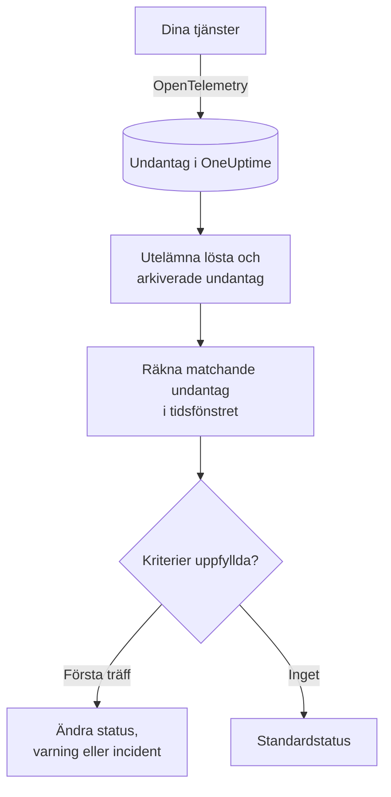

# Undantagsövervakning

En undantagsmonitor räknar inom ett tidsfönster de undantag som dina tjänster rapporterar till OneUptime och som matchar dina filter (meddelande, undantagstyp, miljö, tjänst). När antalet uppfyller dina kriterier ändrar den monitorns status, skapar en varning eller deklarerar en incident. Använd den för att varnas om varje ny krasch i produktion, om en enda undantagstyp eller om en plötslig ökning av fel.

:::cards
- [Skapa monitorn](#skapa-en-undantagsmonitor): Välj vilka undantag som räknas och när du ska varnas.
- [Miljöer](#miljöer): Begränsa monitorn till `production`.
- [Så utvärderas den](#så-utvärderas-den): Vad som räknas, och vad det gör att lösa ett undantag.
- [Kriterier](#kriterier): Villkoren och standardvärdena.
:::

## Så fungerar det



Varje minut räknar OneUptime de undantag som matchar monitorns filter och inträffade inom dess tidsfönster, och utelämnar undantag som du har markerat som lösta eller arkiverat. Antalet jämförs med monitorns kriterier uppifrån och ned, och det första kriteriet som matchar avgör vad som händer. När inget matchar går monitorn tillbaka till sin standardstatus.

## Innan du börjar

- Dina tjänster skickar undantag till OneUptime via OpenTelemetry. Se [OpenTelemetry](/docs/telemetry/open-telemetry).
- För att begränsa en monitor till en miljö måste dina tjänster ange resursattributet `deployment.environment`.

## Skapa en undantagsmonitor

:::steps
### Börja en ny monitor

Gå till **Monitorer** och klicka på **Skapa monitor**.

### Välj Exceptions

Under **Monitortyp** klickar du på **Fler monitortyper** och väljer **Undantag** under **Telemetri**, eller skriver `exceptions` i sökrutan. Ange ett **Namn** och klicka sedan på **Nästa**.

### Välj vilka undantag som ska räknas

I **Undantagsmonitorkonfiguration** anger du **Filtrera undantagsmeddelande**, **Undantagstyper**, **Environments** och **Övervaka undantag för (tid)**. Ett filter som du lämnar tomt matchar alla undantag. **Förhandsvisning av undantag** under filtren visar de undantag som de matchar just nu.

### Begränsa dem (valfritt)

Öppna **Fler fält** för att filtrera efter telemetritjänst eller infrastrukturentitet, eller för att även räkna lösta och arkiverade undantag.

### Ange kriterierna

Kortet **Monitorkriterier** börjar med två kriterier: offline, med en incident, när något undantag matchar; online när inget gör det. Ändra dem till det du vill varnas om (se [Kriterier](#kriterier)).

### Skapa monitorn

Klicka på **Skapa monitor**. Monitorn öppnas på sin sida **Översikt**, och dess första utvärdering körs inom en minut.
:::

## Vad den frågar efter

| Fält | Vad det matchar | Standard |
| --- | --- | --- |
| **Filtrera undantagsmeddelande** | Undantag vars meddelande innehåller denna text, utan skillnad på versaler och gemener. | Tomt: alla undantag |
| **Undantagstyper** | Undantag av någon av dessa typer, separerade med kommatecken, som `TypeError, NullReferenceException`. Typnamnet måste matcha exakt. | Tomt: alla typer |
| **Environments** | Undantag från någon av dessa miljöer, separerade med kommatecken (se [Miljöer](#miljöer)). | Tomt: alla miljöer |
| **Övervaka undantag för (tid)** | Undantag från de senaste 5 sekunderna upp till de senaste 24 timmarna. | **Senaste 1 minuten** |
| **Filtrera efter telemetritjänst** (under **Fler fält**) | Undantag från någon av de valda tjänsterna. | Tomt: alla tjänster |
| **Filter by Infrastructure Entity** (under **Fler fält**) | Undantag från någon av de valda värdarna, poddarna, containrarna och andra entiteterna. | Tomt: alla entiteter |
| **Inkludera lösta undantag** (under **Fler fält**) | Räkna även undantag som är markerade som lösta. | Av |
| **Inkludera arkiverade undantag** (under **Fler fält**) | Räkna även arkiverade undantag. | Av |

Alla filter som du anger måste matcha för att ett undantag ska räknas.

### Miljöer

Miljöer kommer från OpenTelemetry-resursattributet `deployment.environment` på varje undantag, samma värde som undantagsutforskaren filtrerar på med `env:production`. Ange en miljö, eller flera separerade med kommatecken; ett undantag räknas när dess miljö matchar någon av dem.

Jämförelsen är exakt och skiljer på versaler och gemener: `production` matchar inte `Production` eller `prod`. Undantag utan miljö räknas inte när det här filtret är angivet. Lämna det tomt för att räkna undantag från alla miljöer, även de utan miljö.

Miljöfiltret kombineras med alla andra filter, så en monitor som är begränsad till en telemetritjänst och `production` räknar bara den tjänstens produktionsundantag.

När du skapar monitorn via API:et anger du `environments` på stegets `exceptionMonitor` som en lista med miljönamn:

```json
{
  "exceptionMonitor": {
    "telemetryServiceIds": [],
    "environments": ["production"],
    "exceptionTypes": [],
    "message": "",
    "includeResolved": false,
    "includeArchived": false,
    "lastXSecondsOfExceptions": 300
  }
}
```

## Så utvärderas den

- **Varje minut.** En undantagsmonitor kontrolleras inte av sonder, så den har inget intervall att ange och ingen sida **Sonder och intervall**.
- **Förekomster, inte undantagstyper.** Monitorn räknar varje gång ett matchande undantag inträffade inom **Övervaka undantag för (tid)**. Ett undantag som kastas 40 gånger räknas som 40.
- **Lösta och arkiverade undantag utelämnas.** Om du inte aktiverar **Inkludera lösta undantag** eller **Inkludera arkiverade undantag** räknas inte förekomsterna av ett undantag som du har markerat som löst eller arkiverat. Att markera ett undantag som löst kan därför stänga den incident som det öppnade. När ett löst undantag inträffar igen blir det automatiskt olöst och räknas igen.
- **Inga undantag är ett antal på 0.**
- **OneUptimes eget avbrott är inte tystnad.** Så länge tidsfönstret innehåller tid då OneUptime självt inte tog emot data (det startade om, uppgraderades eller arbetade ikapp en eftersläpning) väntar kontrollen: statusen ändras inte, och ingen incident eller varning öppnas eller löses. Se [När OneUptime inte tar emot data](/docs/monitor/when-oneuptime-is-not-receiving).
- **Kriterier uppifrån och ned.** Det första kriteriet som matchar avgör, så lägg det allvarligaste överst.

Varje statusändring registreras med sin orsak på monitorns **Statustidslinje**.

## Kriterier

En undantagsmonitors kriterier har en enda **Filtertyp**: **Exception Count**, antalet undantag som matchade i fönstret. Välj ett **Filtervillkor** och ett **Värde**.

| Filtervillkor | Matchar när antalet undantag är… |
| --- | --- |
| **Greater Than** | över värdet |
| **Greater Than Or Equal To** | lika med värdet eller högre |
| **Less Than** | under värdet |
| **Less Than Or Equal To** | lika med värdet eller lägre |
| **Equal To** | exakt värdet |
| **Not Equal To** | allt utom värdet |

Antal undantag har inga avvikelsevillkor: det finns ingen baslinje att jämföra dem med.

En ny undantagsmonitor börjar med dessa kriterier:

| Kriterium | Filter | Effekt |
| --- | --- | --- |
| Check if … has exceptions | **Exception Count** **Greater Than** `0` | Markerar monitorn som offline och deklarerar en incident, som löses automatiskt |
| Check if … has no exceptions | **Exception Count** **Equal To** `0` | Markerar monitorn som online |

## Genomgånget exempel: bara produktionsundantag

Du vill ha en incident varje gång API:et kastar ett undantag i produktion, och ingenting för staging. Du ställer in **Environments** på `production` och **Övervaka undantag för (tid)** på **Senaste 5 minuterna**, och behåller standardkriterierna. Under de senaste fem minuterna:

| Undantag | Miljö | Tillstånd | Räknas? |
| --- | --- | --- | --- |
| `TypeError` × 3 | `production` | Aktivt | Ja: 3 |
| `TypeError` × 40 | `staging` | Aktivt | Nej: en annan miljö |
| `TimeoutError` × 2 | ingen | Aktivt | Nej: ingen miljö |
| `NullReferenceException` × 4 | `production` | Löst efter att de inträffade | Nej: löst |

**Exception Count** är 3, så **Greater Than** `0` matchar: monitorn går offline och en incident deklareras. När fem minuter har gått utan något aktivt produktionsundantag matchar online-kriteriet och incidenten löser sig själv.

## Felsökning

:::details Undantag visas i utforskaren, men monitorn räknar 0
Jämför värdet i **Environments** med utforskarens filter `env:`: jämförelsen är exakt och skiljer på versaler och gemener, och undantag utan miljö utelämnas när filtret är angivet. Kontrollera sedan om de undantagen är lösta eller arkiverade. Öppna monitorns sida **Kriterier** (under **Konfiguration**) och klicka på **Edit Monitoring Criteria**: **Förhandsvisning av undantag** visar vad filtren matchar.
:::

:::details Incidenten löstes när jag löste undantaget
Det är förväntat. Lösta undantag räknas inte, så antalet sjönk och kriteriet slutade matcha. Om undantaget inträffar igen blir det olöst och räknas igen. Aktivera **Inkludera lösta undantag** för att räkna dem ändå.
:::

:::details Ett filter på undantagstyp matchar ingenting
**Undantagstyper** jämförs exakt med det typnamn som undantaget rapporterades med, som `TypeError`. Kopiera typen från undantagsutforskaren.
:::

## Nästa steg

:::cards
- [Spårningsövervakning](/docs/monitor/traces-monitor): Varnas om misslyckade spans och slutpunkter.
- [Loggövervakning](/docs/monitor/logs-monitor): Varnas om loggvolym och logginnehåll.
- [Incident- och varningsmallar](/docs/monitor/incident-alert-templating): Skriv användbara titlar och beskrivningar för varningar.
- [OpenTelemetry](/docs/telemetry/open-telemetry): Skicka undantag till OneUptime.
:::
