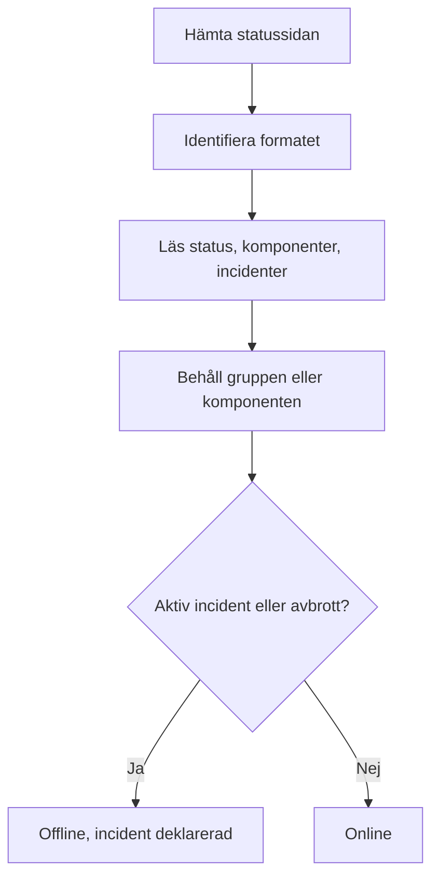

# Övervakning av extern statussida

En monitor för externa statussidor håller koll på den offentliga statussidan för en tjänst som du är beroende av — AWS, GCP, Azure, GitHub, OpenAI, Anthropic och många fler — och larmar dig när leverantören rapporterar ett avbrott eller försämrad prestanda. Använd den för att få veta om problem hos dina leverantörer så snart de rapporterar dem, och för att skilja dem från dina egna.

:::cards
- [Skapa monitorn](#skapa-en-monitor-för-externa-statussidor): Klistra in en statussidas URL och välj vad som ska bevakas.
- [Avgränsa den](#konfigurationsalternativ): Bevaka en komponentgrupp eller en komponent.
- [Kriterier](#övervakningskriterier): Vad som räknas som nere från början.
- [Populära statussidor](#populära-statussidors-urler): URL:er till de tjänster som de flesta team är beroende av.
:::

## Så fungerar det

Vid varje kontroll hämtar en sond statussidan, tar reda på vilket format den använder och läser den övergripande statusen, komponenterna och de aktiva incidenterna. Om du har avgränsat monitorn till en komponentgrupp eller en komponent räknas bara de. Sedan avgör kriterierna om monitorn är online eller offline.

Du kan använda den för att:

- Övervaka tillgängligheten för tjänster från tredje part som din applikation är beroende av
- Få larm när dina leverantörer har avbrott
- Följa statusen för enskilda komponenter
- Avgränsa övervakningen till en enda komponentgrupp (t.ex. bara OpenAI:s "APIs"), så att incidenter på andra ställen på sidan som inte rör dig inte utlöser din monitor
- Upptäcka försämrad prestanda innan den påverkar dina användare
- Koppla ihop dina egna incidenter med problem hos dina leverantörer

## Leverantörer som stöds

| Leverantör | Beskrivning |
| ------------------------ | ---------------------------------------------------------------------- |
| **Auto** (standard) | Identifierar statussidans format automatiskt |
| **Atlassian Statuspage** | Statussidor som drivs av Atlassian Statuspage (JSON-API) |
| **incident.io** | Statussidor som drivs av incident.io (t.ex. `https://status.openai.com`) |
| **RSS** | Statussidor som erbjuder ett RSS-flöde |
| **Atom** | Statussidor som erbjuder ett Atom-flöde |

### Automatisk identifiering

När leverantören är inställd på **Auto** identifierar OneUptime statussidans format automatiskt, i den här ordningen:

1. Först provar den statussidans API från incident.io (`/proxy/<host>`).
2. Sedan provar den JSON-API:et från Atlassian Statuspage (`/api/v2/status.json`, `/api/v2/components.json` och `/api/v2/incidents/unresolved.json`).
3. Om de misslyckas försöker den läsa sidan som ett RSS- eller Atom-flöde.
4. Som sista utväg gör den en enkel kontroll av om sidan kan nås över HTTP.

> [!NOTE]
> incident.io kontrolleras först eftersom vissa statussidor från incident.io (som `https://status.openai.com`) också exponerar en begränsad, Atlassian-kompatibel slutpunkt som utelämnar komponentgrupper och aktiva incidenter. När incident.io kontrolleras först används de rikare data som har grupper.

Kontrollen av om sidan kan nås är också utvägen när en leverantör som du uttryckligen har valt misslyckas. Den talar bara om ifall sidan svarar — online vid ett svar `2xx` eller `3xx` — och rapporterar inga komponenter eller incidenter.

## Skapa en monitor för externa statussidor

:::steps
### Starta en ny monitor

Gå till **Monitorer** och klicka på **Skapa monitor**. Under **Monitortyp** klickar du på **Fler monitortyper** och väljer **External Status Page** under **Basic Monitoring**, eller skriver `statuspage` i sökrutan. Ange ett **Namn** och klicka sedan på **Nästa**.

### Ange statussidans URL

Ange **Statussidans URL**. Låt **Leverantör** stå kvar på **Auto** om du inte känner till formatet.

### Avgränsa den, om du behöver

Öppna **Fler fält** för att ange ett **Component Group Filter (Optional)**, som `APIs`, och ett **Filter för komponentnamn (valfritt)** för att bevaka en enda komponent (inom gruppen, om en grupp är angiven).

### Testa den

Klicka på **Testa monitor** för att hämta sidan en gång, och kontrollera leverantören, komponenterna och incidenterna som den hittade.

### Gå igenom kriterierna

Kriteriesteget börjar med [standardkriterierna](#standardkriterier), som markerar monitorn som offline när leverantören rapporterar en aktiv incident eller ett avbrott inom avgränsningen. Ändra dem om du behöver och klicka sedan på **Nästa**.

### Välj sonder och skapa

Välj **Sonder** och ett **Övervakningsintervall** — det börjar på **Var 5:e minut** — och klicka sedan på **Skapa monitor**.
:::

## Konfigurationsalternativ

| Alternativ | Vad du anger | Standard |
| --- | --- | --- |
| **Statussidans URL** | URL:en till statussidan. För webbplatser som drivs av Atlassian Statuspage och incident.io är det vanligtvis rot-URL:en (t.ex. `https://status.example.com`). För RSS-/Atom-flöden anger du flödets URL direkt. | — |
| **Leverantör** | **Auto** för att identifiera formatet, eller **Atlassian Statuspage**, **incident.io**, **RSS** eller **Atom** om du känner till det. | **Auto** |
| **Component Group Filter (Optional)** | Gruppen som monitorn avgränsas till. Under **Fler fält**. | Alla grupper |
| **Filter för komponentnamn (valfritt)** | Komponenten som ska bevakas. Under **Fler fält**. | Alla komponenter inom avgränsningen |
| **Timeout (ms)** | Den längsta tiden att vänta på statussidan. Under **Fler fält**. | `10000` (10 sekunder) |
| **Återförsök** | Hur många gånger det ska försökas igen, med en sekunds mellanrum, efter att det första försöket misslyckats; `0` betyder ett enda försök. Under **Fler fält**. | `3` (upp till 4 försök) |

### Component Group Filter

Om statussidan delar in sina komponenter i grupper kan du avgränsa monitorn till en enda grupp. På `https://status.openai.com` avgränsar du till exempel monitorn till OpenAI:s API-tjänster genom att ange `APIs`.

När en komponentgrupp är angiven beräknas **antalet aktiva incidenter** och den **övergripande statusen** bara utifrån komponenterna i den gruppen — en incident som påverkar en grupp som inte rör dig (till exempel ChatGPT) utlöser inte en monitor som är avgränsad till gruppen "APIs".

Filtrering på komponentgrupp stöds för leverantörerna **Atlassian Statuspage** och **incident.io**. RSS- och Atom-flöden har inga komponentgrupper.

### Filter för komponentnamn

Om statussidan rapporterar om flera komponenter kan du ange ett komponentnamn för att bara övervaka den komponenten. Filtret matchar varje komponent vars namn innehåller det du anger, utan hänsyn till versaler och gemener — `actions` matchar en komponent som heter "Actions".

När en komponentgrupp också är angiven tillämpas filtret för komponentnamn **inom** den gruppen, så att du kan rikta in dig på en enda komponent i en större grupp. När inget av filtren är angivet övervakas alla komponenter inom avgränsningen. I ett RSS- eller Atom-flöde jämförs namnfiltret med titlarna på flödets poster.

> [!WARNING]
> Ett filter som inte matchar något ser friskt ut: utan komponenter inom avgränsningen finns det ingenting som kan rapportera ett avbrott. Kontrollera stavningen mot statussidan och använd **Testa monitor** för att se vad filtret behåller.

## Övervakningskriterier

Du kan konfigurera kriterier som avgör när den externa tjänsten anses vara online eller offline, utifrån:

| Filtertyp | Vad den kontrollerar | Filtervillkor |
| --- | --- | --- |
| **External Status Page Is Online** | Om statussidan kan nås och returnerar statusdata | Sant eller Falskt |
| **External Status Page Overall Status** | Den övergripande status som sidan rapporterar | Equal To, Not Equal To, Innehåller, Not Contains, Starts With, Ends With |
| **External Status Page Component Status** | Statusen för komponenterna inom avgränsningen (med hänsyn till filtren för komponentgrupp / komponentnamn): Fungerar, Under Maintenance, Degraded Performance, Partial Outage, Major Outage eller Full Outage | Equal To, Not Equal To, Innehåller, Not Contains, Starts With, Ends With |
| **External Status Page Active Incidents** | Antalet incidenter som för närvarande är aktiva på statussidan (avgränsat till komponentgruppen / komponenten när ett filter är angivet) | Equal To, Not Equal To och de numeriska jämförelserna |
| **External Status Page Response Time (in ms)** | Hur lång tid det tar att hämta statussidans data | Greater Than, Less Than, Greater Than Or Equal To, Less Than Or Equal To |

Den övergripande statusen är det som sidan säger, så värdena varierar mellan leverantörer: en Atlassian Statuspage rapporterar sin egen beskrivning, som `All Systems Operational`; ett flöde rapporterar `operational` eller `degraded_performance`; kontrollen av om sidan kan nås rapporterar `reachable` eller `unreachable`. De här jämförelserna skiljer på versaler och gemener. För att larma om avbrott är **External Status Page Active Incidents** och **External Status Page Component Status** oftast mer tillförlitliga.

I ett RSS- eller Atom-flöde räknas posterna från de senaste 24 timmarna som aktiva incidenter: en RSS-post utifrån sitt publiceringsdatum, en Atom-post utifrån sitt uppdateringsdatum.

### Standardkriterier

Som standard skapar OneUptime kriterier utifrån det som verkligen spelar roll för en statussida — dess aktiva incidenter och komponenternas hälsa, snarare än bara om den kan nås:

| Kriterium | Filter | Effekt |
| --- | --- | --- |
| Offline | **Valfri** av: sidan är inte online; det finns minst en aktiv incident inom avgränsningen; en komponent inom avgränsningen rapporterar Degraded Performance, Partial Outage, Major Outage eller Full Outage | Markerar monitorn som offline och deklarerar en incident, som löser sig själv när kriteriet slutar matcha |
| Online | **Alla** av: sidan är online; det finns inga aktiva incidenter inom avgränsningen | Markerar monitorn som online |

Eftersom antalet aktiva incidenter och komponenternas status tar hänsyn till filtren för komponentgrupp / komponentnamn riktar sig de här standardkriterierna automatiskt bara mot de komponenter du bryr dig om.

## Mallvariabler

När du skapar incidenter eller larm från monitorer för externa statussidor kan du använda de här variablerna i titlar, beskrivningar och åtgärdsanteckningar (se [Incident- och varningsmallar](/docs/monitor/incident-alert-templating)):

| Variabel | Beskrivning |
| ------------------------- | ------------------------------------------------------------------------------- |
| `{{isOnline}}`            | Om statussidan är online (true/false) |
| `{{responseTimeInMs}}`    | Svarstid i millisekunder |
| `{{failureCause}}`        | Orsaken till felet, om något |
| `{{overallStatus}}`       | Värdet på den övergripande statusindikatorn |
| `{{activeIncidentCount}}` | Antal aktiva incidenter (avgränsat till filtret, om något) |
| `{{componentStatuses}}`   | JSON-matris med komponenternas status (`name`, `status`, `description`, `groupName`) |
| `{{provider}}`            | Den identifierade leverantören (Atlassian Statuspage, incident.io, RSS, Atom); tom efter en kontroll av om sidan kan nås |
| `{{componentGroup}}`      | Komponentgruppen som monitorn är avgränsad till, om någon |
| `{{componentName}}`       | Komponenten som monitorn är avgränsad till, om någon |

## Populära statussidors URL:er

Här är en lista över statussidor för populära tjänster. Många av dem använder Atlassian Statuspage eller incident.io, så leverantören **Auto** identifierar dem automatiskt. En sida som inte bygger på någon av dem, och som inte är ett flöde, får bara kontrollen av om den kan nås — för sådana övervakar du i stället leverantörens RSS- eller Atom-flöde, om den publicerar ett.

| Tjänst | Statussidans URL |
| ---------------------------- | --------------------------------------------- |
| AWS                          | `https://health.aws.amazon.com/health/status` |
| Google Cloud Platform        | `https://status.cloud.google.com`             |
| Microsoft Azure              | `https://status.azure.com`                    |
| GitHub                       | `https://www.githubstatus.com`                |
| OpenAI                       | `https://status.openai.com`                   |
| Anthropic                    | `https://status.anthropic.com`                |
| Cloudflare                   | `https://www.cloudflarestatus.com`            |
| Datadog                      | `https://status.datadoghq.com`                |
| PagerDuty                    | `https://status.pagerduty.com`                |
| Twilio                       | `https://status.twilio.com`                   |
| Stripe                       | `https://status.stripe.com`                   |
| Slack                        | `https://status.slack.com`                    |
| Atlassian (Jira, Confluence) | `https://status.atlassian.com`                |
| Vercel                       | `https://www.vercel-status.com`               |
| Netlify                      | `https://www.netlifystatus.com`               |
| DigitalOcean                 | `https://status.digitalocean.com`             |
| Heroku                       | `https://status.heroku.com`                   |
| MongoDB Atlas                | `https://status.cloud.mongodb.com`            |
| Fastly                       | `https://status.fastly.com`                   |
| New Relic                    | `https://status.newrelic.com`                 |
| Sentry                       | `https://status.sentry.io`                    |
| CircleCI                     | `https://status.circleci.com`                 |

## Bästa praxis

- **Använd leverantören Auto** om du inte känner till det exakta formatet — automatisk identifiering fungerar bra för de flesta statussidor.
- **Avgränsa till en komponentgrupp** om du bara är beroende av en del av en leverantör (t.ex. bara OpenAI:s "APIs"), så att incidenter som inte rör dig inte skapar brus.
- **Övervaka specifika komponenter** om du bara är beroende av vissa tjänster.
- **Kombinera med dina egna monitorer** — para ihop monitorer för externa statussidor med dina egna API- och webbplatsmonitorer. När båda går ned samtidigt pekar leverantörens statussida snabbare ut grundorsaken.

## Felsökning

:::details Monitorn är offline, men incidenten gäller en del av tjänsten som jag inte använder
Avgränsa monitorn med ett **Component Group Filter**, ett **Filter för komponentnamn** eller båda. Antalet aktiva incidenter och komponenternas status räknar då bara det som ligger inom avgränsningen.
:::

:::details Monitorn blir aldrig offline, inte ens under ett avbrott
Filtren matchar kanske ingenting, vilket ser friskt ut, eller så får sidan kanske bara kontrollen av om den kan nås. Kör **Testa monitor** och kontrollera leverantören och komponenterna som den hittade.
:::

:::details Auto väljer fel format, eller hittar inga komponenter
Ställ in **Leverantör** på den som du vet att sidan använder. För ett RSS- eller Atom-flöde anger du flödets egen URL i stället för statussidans.
:::

:::details En intern statussida kan inte nås
En sond avvisar adresser i privata nätverk om den inte får nå dem. Ange `PROBE_ALLOW_PRIVATE_NETWORK_MONITORS=true` på en sond i ditt nätverk — se [Åtkomst till privat nätverk](/docs/self-hosted/private-network-access).
:::

## Nästa steg

:::cards
- [Incident- och varningsmallar](/docs/monitor/incident-alert-templating): Lägg in leverantörens status i dina incidenttitlar.
- [API-övervakning](/docs/monitor/api-monitor): Kontrollera dina egna slutpunkter bredvid leverantörens status.
- [Skapa en monitor](/docs/monitor/create-monitor): Stegen som alla monitortyper har gemensamt.
:::
