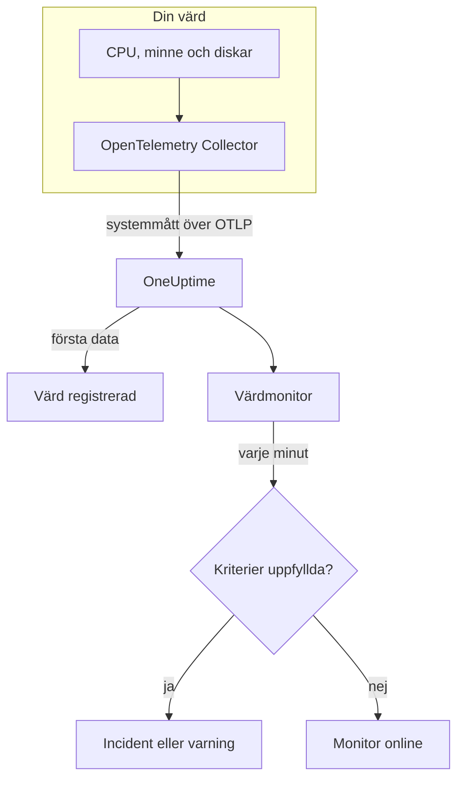

# Värdövervakning

En värdmonitor övervakar en maskin – dess CPU, minne, diskar, belastning och processer – och säger till när den är mättad eller håller på att fyllas. Den läser OpenTelemetry-måtten `system.*` som en OpenTelemetry Collector skickar från värden, samma data som produkten **Värdar** visar, så ingenting undersöks utifrån.

:::cards
- [Skapa monitorn](#skapa-en-värdmonitor): Sex steg i instrumentpanelen.
- [Mallar](#färdiga-varningsmallar): Fem färdiga varningar för CPU, minne, disk, belastning och processer.
- [Mätvärden](#insamlade-mätvärden): De värdmått som du kan varna på, och deras enheter.
- [Värd eller Server / VM?](#värdmonitor-eller-server-vm-monitor): Vilken av de två maskinmonitorerna du ska använda.
:::

## Så fungerar det

En OpenTelemetry Collector körs på värden med mottagaren `hostmetrics`. Var 30:e sekund läser den värdens siffror för CPU, minne, disk, nätverk, belastning och processer och skickar dem till OneUptime över OTLP. De första data från en värd registrerar den under **Värdar**.

En värdmonitor är knuten till en värd. Varje minut kör den sin fråga över värdens mätvärden och jämför resultatet med sina kriterier.

### Värdmonitor eller Server- / VM-monitor?

OneUptime har två monitorer för maskiner. De kan köras på samma värd.

| | Värdmonitor | Server- / VM-monitor |
| --- | --- | --- |
| **Agent** | En OpenTelemetry Collector med mottagaren `hostmetrics` | OneUptimes infrastrukturagent |
| **Data** | OpenTelemetry-måtten `system.*` och `process.*`, samma som sidorna under **Värdar** visar i diagram | En statusrapport som agenten skickar till monitorn |
| **Kriterier** | Trösklar eller avvikelseidentifiering på vilken måttfråga eller formel som helst | Inbyggda kontroller som CPU-, minnes- och diskanvändning |
| **Inställning** | Installera collectorn; värden registrerar sig själv | Skapa monitorn och ge sedan dess hemliga nyckel till agenten |

Använd värdmonitorn när värden redan skickar OpenTelemetry-data, eller när du vill ha loggar och rikare mätvärden från samma collector. Se [Server- / VM-övervakning](/docs/monitor/server-monitor) för den andra.

## Innan du börjar

- **Kör en OpenTelemetry Collector på värden** med mottagaren `hostmetrics`. [OpenTelemetry-collector på värden](/docs/telemetry/host-otel-collector) beskriver Linux, macOS och Windows, och **Produkter → Infrastruktur → Värdar → Dokumentation** ger en färdig konfiguration.
- **Slå på utnyttjandemåtten.** `system.cpu.utilization`, `system.memory.utilization` och `system.filesystem.utilization` är valfria i mottagaren, och mallarna för CPU, minne och filsystem behöver dem. Konfigurationen från instrumentpanelen slår på dem.
- **Kontrollera att värden är registrerad.** Den visas under **Produkter → Infrastruktur → Värdar → Alla värdar**, namngiven efter sitt `host.name`, så snart dess första data kommer.

## Skapa en värdmonitor

:::steps
### Starta en ny monitor

Gå till **Monitorer** och klicka på **Skapa monitor**.

### Välj Värd

Klicka på **Fler monitortyper** under **Monitortyp** och välj **Värd** under **Infrastruktur**. Ange ett **Namn** – det används i titlar på incidenter och varningar – och klicka på **Nästa**.

### Välj värden

Välj maskinen i **Värd** under **Host Monitor Configuration**. Varje värd som har skickat data finns i listan.

### Välj vad som ska övervakas

Välj en av de tre flikarna:

- **Quick Setup** – klicka på en [mall](#färdiga-varningsmallar). Den anger mätvärdet, aggregeringen, tidsintervallet och trösklarna och ersätter kriterierna nedan med sina egna. Du kan fortfarande ändra **Tidsintervall**.
- **Custom Metric** – välj ett mätvärde i **Host Metric** och ange sedan **Aggregering** och **Tidsintervall**.
- **Avancerad** – bygg frågor och formler själv under **Välj mått**, till exempel ett filter på `state` eller en gruppering efter `mountpoint`.

### Kontrollera kriterierna

Öppna varje kriterium under **Monitorkriterier** och kontrollera dess **Mätvärde**, **Aggregering**, **Villkor** och **Threshold**. En mall fyller i dem. Med **Custom Metric** eller **Avancerad** börjar monitorn med [standardkriterierna](#standardkriterier), som bara märker att ett mätvärde sjunker till noll, så ange din egen tröskel.

### Skapa monitorn

Klicka på **Skapa monitor**. OneUptime öppnar monitorns sida och utvärderar den varje minut. Incidenter och varningar som den öppnar visas också på värdens sidor **Incidenter** och **Varningar**.
:::

> [!TIP]
> För att ställa in flera mallar på en gång öppnar du värden från **Produkter → Infrastruktur → Värdar** och går till **Recommendations**. Välj de mallar du vill ha och vem som ska larmas, så skapar OneUptime en monitor per mall.

## Monitorinställningar

| Fält | Flik | Vad det gör |
| --- | --- | --- |
| **Värd** | Alla | Krävs. Begränsar varje fråga till värdens `resource.host.name`. |
| **Host Metric** | Custom Metric | Ett mätvärde från [katalogen](#insamlade-mätvärden), grupperat som CPU, minne, disk, nätverk, belastning och processer. |
| **Aggregering** | Custom Metric | Hur mätningar kombineras: **Genomsnitt**, **Maximum**, **Minimum**, **Summa** eller **Antal**. Börjar på mätvärdets vanliga aggregering. |
| **Tidsintervall** | Alla | Det glidande fönster som frågan läser, från **Past 1 Minute** till **Past 365 Days**. En ny monitor börjar på **Past 1 Minute**; mallar anger sitt eget. |
| **Välj mått** | Avancerad | Frågebyggaren: **Mätvärde**, **Aggregate by**, **Filter by attributes**, **Group by**, plus **Lägg till mätvärde** och **Lägg till formel** för att kombinera frågor. |

## Färdiga varningsmallar

**Quick Setup** erbjuder fem mallar. Varje mall bygger en komplett monitor: en fråga, ett kriterium som utlöses och ett som återställer. Trösklarna är utgångspunkter som du kan redigera.

Ett kriterium utlöses bara när villkoret gäller varje minut i fönstret, och det återställs 10 % förbi tröskeln, så att ett värde som pendlar vid gränsen inte fladdrar.

| Mall | Allvarlighetsgrad | Övervakar | Utlöses när | Återställs när |
| --- | --- | --- | --- | --- |
| High CPU Utilization | Warning | `system.cpu.utilization` för tillstånden `user` och `system`, adderade och visade som procent, senaste 5 minuterna | Över 80 % | Vid eller under 72 % |
| High Memory Utilization | Warning | `system.memory.utilization` för tillståndet `used`, som procent, senaste 5 minuterna | Över 85 % | Vid eller under 76,5 % |
| High Filesystem Usage | Kritisk | `system.filesystem.utilization`, Max per `mountpoint` och `device`, som procent, senaste 5 minuterna | Över 90 % | Vid eller under 81 % |
| High Load Average (1m) | Warning | `system.cpu.load_average.1m`, Avg, senaste 5 minuterna | Över 4 | Vid eller under 3,6 |
| High Process Count | Warning | `system.processes.count`, Max, senaste 5 minuterna | Över 2000 | Vid eller under 1800 |

**Allvarlighetsgrad** är etiketten som väljaren visar. Incidenten och varningen som en mall skapar börjar på projektets allvarligaste incident- och varningsgrad; ändra dem i kriterierna.

- **CPU** är upptagen tid (`user` plus `system`), samma siffra som värdens **Översikt** visar i diagram. Iowait och steal är utelämnade.
- **Minne** utesluter buffertar och sidcache, så att en värd som mest innehåller cache inte utlöser den.
- **Filsystem** öppnar en incident per montering. Skrivskyddade pseudofilsystem, som snap-monteringar av typen `squashfs` eller `devfs` på macOS, är alltid 100 % fulla; uteslut dem i collectorns skrapa `filesystem`.
- **Belastningsmedelvärde** är en rå längd på körkön, inte delad med antalet kärnor: 4 är mättnad på en värd med 2 kärnor och rutin på en med 32, så höj den på stora värdar.
- **Antal processer** jämför det största enskilda processtillståndet (`running`, `sleeping`, …), inte värdens totala antal, så det stämmer inte med en processlista. Processkrapan rapporterar bara på Linux.

## Insamlade mätvärden

Listan **Host Metric** erbjuder de här mätvärdena. Var och ett bär `resource.host.name`, vilket är hur monitorn begränsar sina frågor till en värd.

> [!IMPORTANT]
> Utnyttjandemåtten är en kvot från 0 till 1, inte en procentsats: använd `0.8` för 80 % i en tröskel på det råa mätvärdet. Mallarna räknar om till procent med en formel, så deras trösklar är 80, 85 och 90.

### CPU

| Mätvärde | Enhet | Beskrivning |
| --- | --- | --- |
| `system.cpu.utilization` | kvot | Andel av CPU-tiden i varje `state` (`user`, `system`, `idle`, …). Filtrera på `state`: ett genomsnitt över alla tillstånd når aldrig en användbar tröskel. |
| `process.cpu.utilization` | kvot | CPU-utnyttjande för varje process på värden. |

### Minne

| Mätvärde | Enhet | Beskrivning |
| --- | --- | --- |
| `system.memory.utilization` | kvot | Andel av det fysiska minnet i varje `state` (`used`, `free`, `cached`, …). Filtrera på `state = used` för minne som används. |
| `system.memory.usage` | byte | Minnesanvändning i byte. |

### Disk

| Mätvärde | Enhet | Beskrivning |
| --- | --- | --- |
| `system.filesystem.utilization` | kvot | Andel av varje filsystems kapacitet som används, per `mountpoint` och `device`. |
| `system.filesystem.usage` | byte | Filsystemanvändning i byte. |

### Nätverk

| Mätvärde | Enhet | Beskrivning |
| --- | --- | --- |
| `system.network.io` | byte | Mottagna och skickade byte. En räknare över hela livstiden. |

### Belastning

| Mätvärde | Enhet | Beskrivning |
| --- | --- | --- |
| `system.cpu.load_average.1m` | antal | Belastningsmedelvärde under den senaste minuten. |
| `system.cpu.load_average.5m` | antal | Belastningsmedelvärde under de senaste 5 minuterna. |
| `system.cpu.load_average.15m` | antal | Belastningsmedelvärde under de senaste 15 minuterna. |

### Processer

| Mätvärde | Enhet | Beskrivning |
| --- | --- | --- |
| `system.processes.count` | antal | Processer på värden, en serie per process-`status`. |

Frågebyggaren i **Avancerad** listar varje mätvärde som värden skickar, inte bara de här.

## Övervakningskriterier

Ett kriterium jämför en av monitorns frågor eller formler med en tröskel. En värdmonitors kriterier har ingen **Filtertyp**: varje regel kontrollerar mätvärdet, med de här fälten.

| Fält | Vad det gör |
| --- | --- |
| **Mätvärde** | Frågan eller formeln som kontrolleras, efter dess variabelnamn. |
| **Aggregering** | Hur värdena i fönstret blir ett svar: **Genomsnitt**, **Summa**, **Maximum Value**, **Minimum Value**, **All Values** (varje värde måste matcha) eller **Any Value** (ett räcker). |
| **Villkor** | **Greater Than**, **Less Than**, **Greater Than Or Equal To**, **Less Than Or Equal To** eller **Equal To** – eller ett avvikelsevillkor: **Anomalously High**, **Anomalously Low** eller **Anomalous**. |
| **Threshold** | Värdet att jämföra med. En lista med enheter står bredvid när mätvärdet har en enhet. Visas inte för avvikelsevillkor. |
| **Känslighet** | Bara avvikelsevillkor. **Låg** (4σ), **Medel** (3σ, standard) eller **Hög** (2σ). |
| **Baslinjefönster** | Bara avvikelsevillkor. 14 dagar (standard), 28, 60 eller 90 dagars historik. |
| **Om ingen data** | Under **Fler fält**. Vad som händer när fönstret saknar mätningar: **Ignore** (standard), **Treat As Zero** eller **Utlösare**. |

Avvikelsevillkor jämför varje värde med samma timme i veckan i baslinjen. De stannar i ett "Learning"-läge och ger ingenting förrän baslinjefönstret innehåller tillräckligt med historik.

Varje kriterium anger också vad som ska hända när det matchar: ändra monitorns status, skapa en varning eller deklarera en incident. Kriterierna kontrolleras uppifrån och ned, och det första som matchar avgör.

### Standardkriterier

En monitor som du inte bygger från en mall börjar med två kriterier:

| Ordning | Kriterium | Matchar när | Sedan |
| --- | --- | --- | --- |
| 1 | Check if _monitor name_ is offline | Något värde i den första frågan är `0` | Markerar monitorn som **Offline** och deklarerar incidenten "_monitor name_ is offline", som löser sig själv när monitorn återhämtar sig. |
| 2 | Check if _monitor name_ is online | Något värde är över `0` | Markerar monitorn som **Fungerar**. |

> [!IMPORTANT]
> Tystnad matchar inget av kriterierna: en värd som slutar skicka data lämnar monitorn som den var. För att få veta när värden tystnar ställer du in **Om ingen data** på **Utlösare** i ett kriterium. Tid då OneUptime själv inte tog emot data är aldrig saknade data: en kontroll vars fönster innehåller sådan tid väntar i stället, som [När OneUptime inte tar emot data](/docs/monitor/when-oneuptime-is-not-receiving) förklarar.

## Felsökning

:::details Värden finns inte i listan Värd
Värdar registrerar sig själva utifrån collectorns data, som behöver ett `host.name` och värdens OS-typ – båda kommer från collectorns processor `resourcedetection`. Kontrollera att collectorn körs och att värden finns under **Produkter → Infrastruktur → Värdar → Alla värdar**. [OpenTelemetry-collector på värden](/docs/telemetry/host-otel-collector) beskriver konfigurationen.
:::

:::details En CPU- eller minnesströskel utlöses aldrig
Utnyttjandemåtten är kvoter som maximalt når `1.0`, så en handskriven tröskel på `80` passeras aldrig: använd `0.8`, eller utgå från en mall, som räknar om till procent. Filtrera också på `state` – `user` och `system` för CPU, `used` för minne. Ett genomsnitt över alla tillstånd håller sig nära 1 delat med antalet tillstånd.
:::

:::details Incidenter utlöses för fel värd
Monitorn begränsar varje fråga med `resource.host.name` lika med värden du valde. Värdar som rapporterar samma `host.name` slås ihop till en serie, så ge varje värd ett unikt namn.
:::

:::details High Filesystem Usage utlöses för en montering som alltid är full
Skrivskyddade pseudofilsystem, som snap-loopmonteringar av typen `squashfs` under `/snap` eller `devfs` på macOS, är 100 % fulla med avsikt och återhämtar sig aldrig. Uteslut dem från collectorns skrapa `filesystem`.
:::

## Nästa steg

:::cards
- [OpenTelemetry-collector på värden](/docs/telemetry/host-otel-collector): Installera och konfigurera collectorn som den här monitorn läser.
- [Server- / VM-övervakning](/docs/monitor/server-monitor): Monitorn för maskiner som en agent skickar till.
- [Metrikövervakning](/docs/monitor/metrics-monitor): Varna på vilket mätvärde som helst, över värdar och tjänster.
- [Incidenter – Översikt](/docs/incidents/index): Vad som händer efter att ett kriterium har deklarerat en incident.
:::
