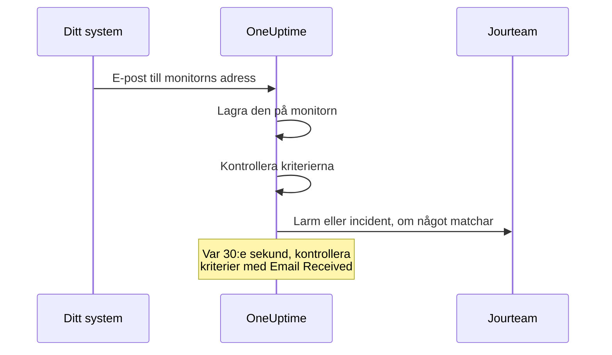

# Övervakning av inkommande e-post

En monitor för inkommande e-post ger dig en e-postadress som hör till en enda monitor. Allt som kan skicka e-post — ett säkerhetskopieringsjobb, ett äldre system, en molnleverantörs larm — skickar sina resultat dit, och OneUptime kontrollerar varje e-postmeddelande mot dina kriterier för att markera monitorn som nere, öppna en incident eller skapa ett larm, och för att lösa dem när klartecknet kommer.

:::cards
- [Skapa monitorn](#skapa-en-monitor-för-inkommande-e-post): Få en adress och peka din avsändare mot den.
- [Verifiera adressen](#verifiera-adressen-hos-avsändaren): Läs en avsändares bekräftelsemejl på monitorn.
- [Skriv kriterier](#tillgängliga-filtertyper): Matcha ämnet, avsändaren eller innehållet, eller larma när e-posten slutar komma.
- [Använd e-posten i larm](#mallvariabler): Lägg in ämnet och innehållet i titlar och beskrivningar.
:::

## Så fungerar det

E-post är en push-modell: ditt system skickar, och OneUptime lyssnar. Varje e-postmeddelande kontrolleras mot monitorns kriterier när det kommer. Kriterier som letar efter e-post som *borde* ha kommit kontrolleras dessutom enligt ett schema, var 30:e sekund.



1. När du skapar en monitor för inkommande e-post ger OneUptime den en unik e-postadress.
2. Varje e-postmeddelande som skickas till den adressen lagras på monitorn och utvärderas mot dess kriterier, uppifrån; det första kriteriet som matchar avgör.
3. Ett matchande kriterium kan ändra monitorns status, skapa ett larm och deklarera en incident. En incident med **Lös incident automatiskt** påslaget, eller ett larm med **Lös larm automatiskt** påslaget, löses när ett annat kriterium matchar senare — till exempel det som markerar monitorn som online.

## Skapa en monitor för inkommande e-post

:::steps
### Starta en ny monitor

Gå till **Monitorer** och klicka på **Skapa monitor**.

### Välj Incoming Email

Under **Monitortyp** klickar du på **Fler monitortyper** och väljer **Incoming Email** under **Inbound Monitoring**, eller skriver `email` i sökrutan. Ange ett **Namn** och klicka sedan på **Nästa**.

### Gå igenom kriterierna

Steget **Kriterier** börjar med [standardkriterierna](#vad-du-får-från-början), som markerar monitorn som offline när ett e-postmeddelande nämner `error`. Klicka på ett kriterium för att ändra det, eller klicka på **Lägg till kriterier** för att lägga till ett. Se [Exempel på konfigurationer](#exempel-på-konfigurationer) för vanliga upplägg.

### Skapa monitorn

Klicka på **Skapa monitor**. Monitorn öppnas på sidan **Översikt**, där kortet **Incoming Email Address** visar adressen med en kopieringsknapp tills det första e-postmeddelandet kommer.

### Skicka e-post till adressen

Konfigurera ditt system så att det skickar sina aviseringar till adressen. Om avsändaren ber dig bekräfta adressen först, se [Verifiera adressen hos avsändaren](#verifiera-adressen-hos-avsändaren).
:::

> [!NOTE]
> Adressen innehåller monitorns hemliga nyckel, så bara personer som kan redigera monitorer kan se den. Alla andra ser att konfigurationsuppgifterna är dolda.

## E-postadressens format

Varje monitor för inkommande e-post får en unik adress i det här formatet:

```text
monitor-{secret-key}@{inbound-domain}
```

Den hemliga nyckeln är ett UUID, till exempel `monitor-3f2b8c1e-5d4a-4f6b-9a7c-2e1d0b9f8a6c@inbound.yourdomain.com`. När det första e-postmeddelandet har kommit ligger adressen kvar på monitorns sida **Översikt** i kortet **Inbound email address**, bredvid tidpunkten för det senaste e-postmeddelandet. Monitorns sida **Dokumentation** visar den också.

## Återställa eller anpassa e-postadressen

Gå till monitorns flik **Inställningar**. Kortet **Incoming Email Address** visar den aktuella adressen och erbjuder två sätt att ersätta den:

| Åtgärd | Vad den gör | Använd den när |
| --- | --- | --- |
| **Reset Address** | Ger monitorn en ny, slumpmässigt genererad adress `monitor-{secret-key}@{inbound-domain}`. Har monitorn en anpassad adress tas den bort vid återställningen. Du blir ombedd att bekräfta först. | Adressen har läckt, eller du vill stänga ute det som skickar till den. |
| **Customize Address** | Låter dig välja delen före @, till exempel `nightly-backups@{inbound-domain}`. Ange den i **Address name** — du kan skriva namnet eller klistra in hela adressen — och klicka på **Save Address**. | Du vill ha en adress som folk känner igen. |

Båda åtgärderna avslutas med att den nya adressen visas med en kopieringsknapp.

> [!WARNING]
> **Den gamla adressen slutar fungera direkt**: e-post som skickas till den ignoreras, så uppdatera alla system som skickar e-post till den här monitorn.

Regler för anpassade adresser:

- 3 till 64 tecken: gemener, siffror, punkter (`.`), bindestreck (`-`) och understreck (`_`), utan två punkter i rad. Den måste börja och sluta med en bokstav eller en siffra. Versaler görs om till gemener åt dig.
- Domänen är alltid serverns domän för inkommande e-post.
- Namnet får inte redan användas av en annan monitor. Alla projekt på servern delar domänen för inkommande e-post, så namnet måste vara unikt bland dem alla.
- Namn på formen `monitor-{id}` och `workflow-{id}` är reserverade för genererade adresser. Namn på brevlådor som hör till själva domänen är också reserverade: `abuse`, `admin`, `administrator`, `hostmaster`, `mailer-daemon`, `noc`, `postmaster`, `root`, `security` och `webmaster`.

En anpassad adress är lika mycket en inloggningsuppgift som en genererad: alla som känner till den kan skicka e-post som den här monitorn utvärderar. Genererade adresser är i praktiken omöjliga att gissa, men ett kort, uppenbart namn är det inte. Välj något som är svårt att gissa om det spelar roll för dig.

API-användare kan göra samma sak via Monitor-API:et, på en befintlig monitor: sätt `incomingEmailCustomLocalPart` till namnet för att använda en anpassad adress, eller till `null` för att gå tillbaka till den genererade. Att återställa betyder att skriva en ny `incomingEmailSecretKey` och sätta `incomingEmailCustomLocalPart` till `null` i samma uppdatering.

## Verifiera adressen hos avsändaren

Vissa tjänster skickar inga larm till en ny adress förrän någon har visat att den kan läsa e-post där. De skickar först ett verifieringsmejl, och det kommer till monitorn som vilket e-postmeddelande som helst. Så här läser du det:

:::steps
### Lägg till adressen i tjänsten

Lägg till monitorns adress i tjänsten och spara. Tjänsten skickar sitt verifieringsmejl.

### Öppna det senaste e-postmeddelandet

Öppna monitorn i OneUptime. På sidan **Översikt** visar kortet **Monitor-sammanfattning** det senaste e-postmeddelandet. Kontrollera att **Från** och **Ämne** hör till verifieringsmejlet och klicka sedan på **Visa fler detaljer**.

### Kopiera koden eller länken

Koden eller länken finns i **E-postinnehåll (text)**. **E-postinnehåll (HTML)** visar HTML-källan, så om du kopierar en länk därifrån ändrar du varje `&amp;` i den till `&`.

### Slutför verifieringen

Slutför verifieringen så som e-postmeddelandet beskriver.
:::

Om ett annat e-postmeddelande har kommit sedan dess visar kortet inte längre verifieringsmejlet. Öppna **Övervakningsloggar**, leta upp verifieringsmejlet utifrån ämnet i kolumnen **E-post** och klicka på **Visa sammanfattning** på den raden.

> [!IMPORTANT]
> **Dina kriterier ser det också.** Verifieringsmejlet utvärderas som vilket e-postmeddelande som helst. En formulering som "if you received this in error" matchar standardkriteriet `error` och markerar monitorn som offline. För att undvika det stänger du av **Kontrollera den här övervakaren** i kortet **Övervakning** på monitorns sida **Inställningar** medan du verifierar (du blir ombedd att bekräfta). En monitor med övervakningen avstängd lagrar fortfarande e-postmeddelandet, och kortet **Monitor-sammanfattning** visar det fortfarande. Den utvärderar dock ingenting, så e-postmeddelandet får ingen rad i **Övervakningsloggar**: läs det innan ett annat e-postmeddelande kommer. När du är klar trycker du på **Slå på övervakning** i bannern högst upp på monitorns sidor, eller slår på reglaget igen.

**Verifieringen hör till adressen.** Om du [återställer eller anpassar adressen](#återställa-eller-anpassa-e-postadressen) ser tjänsten en ny mottagare, och du måste verifiera igen.

### Åtgärdsgrupper i Azure Monitor

Sedan juli 2026 inför Azure stegvis ett krav på att varje ny mottagare av typen **Email** i en åtgärdsgrupp verifieras med en engångskod. Tills det är gjort skickar åtgärdsgruppen varken larm eller testaviseringar till den adressen.

:::steps
1. Lägg till en avisering av typen **Email** med monitorns adress i åtgärdsgruppen och spara åtgärdsgruppen. Azure skickar verifieringsmejlet från en Microsoft-adress som `azure-noreply@microsoft.com`.
2. Läs det på monitorn som beskrivs ovan och följ dess instruktioner inom 30 minuter efter att du sparade åtgärdsgruppen. Om engångskoden går ut öppnar du åtgärdsgruppen och väljer **Resend**.
3. Öppna åtgärdsgruppen och välj **Test** för att skicka en testavisering. Den kommer till monitorn som ett riktigt larm, så den visar också om dina kriterier matchar Azures e-postmeddelanden.
:::

Verifieringen gäller alla åtgärdsgrupper i samma Azure-klientorganisation, så varje adress behöver bara verifieras en gång.

### Amazon SNS

En e-postprenumeration på ett SNS-ämne tar inte emot något förrän den har bekräftats. När du skapar prenumerationen skickar Amazon SNS ett bekräftelsemejl till adressen. Läs det på monitorn som beskrivs ovan och öppna dess länk **Confirm subscription** i webbläsaren. SNS tar bort en prenumeration som inte har bekräftats inom 48 timmar; om det händer skapar du prenumerationen igen.

## Vad du får från början

En ny monitor för inkommande e-post skapas med två kriterier som läser e-postmeddelandets innehåll:

| Kriterium | Filtertyp | Filtervillkor | Värde | Effekt |
| -------- | ----------- | ---------------- | ------- | -------------------------------------------- |
| Offline  | Email Body  | Innehåller | `error` | Markerar monitorn som offline, öppnar en incident |
| Online   | Email Body  | Not Contains | `error` | Markerar monitorn som online |

Det passar det vanliga fallet där ett jobb eller ett verktyg från tredje part mejlar sitt eget resultat: ett meddelande vars innehåll nämner `error` tar ned monitorn, och nästa meddelande utan ordet tar upp monitorn igen och löser incidenten. Jämförelsen av innehållet skiljer inte på versaler och gemener, så `Error` och `ERROR` matchar också.

Ändra värdet till det som din avsändare faktiskt skriver (`FAILED`, `exit code 1` och så vidare).

> [!NOTE]
> De här standardinställningarna är **inte** ett dödmansgrepp: ingenting här utlöses när e-posten slutar komma. Kriterier som bara läser ämnet, avsändaren, innehållet eller mottagaren utvärderas när ett e-postmeddelande kommer och vid ingen annan tidpunkt. Om du vill larmas vid tystnad lägger du till ett kriterium **Email Received** / **Not Recieved In Minutes** — se [Exempel 3](#exempel-3-heartbeat-monitor-ingen-e-post-larm).

## Tillgängliga filtertyper

Du kan skapa kriterier utifrån de här e-postfälten:

| Filtertyp | Beskrivning |
| ------------------------- | ----------------------------------------------------------------------------------- |
| **E-postämne** | Ämnesraden i det inkommande e-postmeddelandet |
| **Email From Address** | Avsändarens e-postadress: bara adressen, med gemener, utan visningsnamn |
| **Email Body** | Den oformaterade textdelen av e-postmeddelandets innehåll |
| **Email To Address** | Mottagarens e-postadress |
| **Email Received** | Tidsbaserade kriterier för när e-post tas emot |
| **JavaScript Expression** | Ett eget JavaScript-uttryck som måste ge sant |

Monitorns egen adress maskeras innan något kriterium läser e-postmeddelandet, så i **Email To Address**, **E-postämne** och **Email Body** står det `[REDACTED]`.

## Filtervillkor

### Strängfilter (ämne, avsändare, innehåll, mottagare)

| Filtervillkor | Beskrivning | Exempel |
| ---------------- | ----------------------------------------- | ---------------------------------- |
| **Innehåller** | Fältet innehåller den angivna texten | Ämnet innehåller "CRITICAL" |
| **Not Contains** | Fältet innehåller inte den angivna texten | Ämnet innehåller inte "TEST" |
| **Equal To** | Fältet stämmer exakt med den angivna texten | Avsändaren är lika med "alerts@service.com" |
| **Not Equal To** | Fältet stämmer inte med den angivna texten | Ämnet är inte lika med "OK" |
| **Starts With** | Fältet börjar med den angivna texten | Ämnet börjar med "[ALERT]" |
| **Ends With** | Fältet slutar med den angivna texten | Ämnet slutar med "- Production" |
| **Is Empty** | Fältet är tomt | Innehållet är tomt |
| **Is Not Empty** | Fältet har innehåll | Ämnet är inte tomt |

Ingen av de här jämförelserna skiljer på versaler och gemener. Ett filter med ett tomt värde matchar aldrig.

### Tidsbaserade filter (Email Received)

Instrumentpanelen stavar de här villkoren "Recieved".

| Filtervillkor | Beskrivning | Exempel |
| --------------------------- | ----------------------------------- | -------------------------------- |
| **Recieved In Minutes** | Ett e-postmeddelande togs emot inom X minuter | E-post mottagen inom 30 minuter |
| **Not Recieved In Minutes** | Ingen e-post togs emot på X minuter | Ingen e-post mottagen på 60 minuter |

En monitor som aldrig har tagit emot något e-postmeddelande räknar tidpunkten då den skapades som det senaste e-postmeddelandet.

### JavaScript Expression

| Filtervillkor | Beskrivning |
| --------------------- | ------------------------------------- |
| **Evaluates To True** | Uttrycket returnerar ett sant värde |

Uttrycket körs i en sandlåda utan bundna e-postfält, så det kan inte läsa ämnet, avsändaren, innehållet eller mottagaren för meddelandet som utlöste kontrollen. Använd filtertyperna **E-postämne**, **Email From Address**, **Email Body** och **Email To Address** för att matcha på e-postmeddelandets innehåll.

## Exempel på konfigurationer

Varje exempel är ett par kriterier. Ett kriterium har filter, ett **Matchningsvillkor** (**Alla** eller **Valfri** av dess filter) och åtgärder: ändra monitorns status, skapa ett larm, deklarera en incident. Slå på **Lös larm automatiskt** (eller **Lös incident automatiskt**) under **Fler fält** i larmet eller incidenten, så att det andra kriteriet löser det som det första öppnade.

### Exempel 1: Skapa ett larm vid kritiska e-postmeddelanden

| Kriterium | Filter | Matchningsvillkor | Åtgärder |
| --- | --- | --- | --- |
| Kritisk e-post | **E-postämne** Innehåller `CRITICAL`; **E-postämne** Innehåller `ALERT`; **E-postämne** Innehåller `ERROR` | **Valfri** | Ändra statusen till offline; skapa ett larm |
| Klartecken | **E-postämne** Innehåller `RESOLVED`; **E-postämne** Innehåller `RECOVERED` | **Valfri** | Ändra statusen till online |

Lägg det kritiska kriteriet först: kriterierna kontrolleras uppifrån, och det första som matchar avgör.

### Exempel 2: Övervaka en viss avsändare

| Kriterium | Filter | Matchningsvillkor | Åtgärder |
| --- | --- | --- | --- |
| Misslyckat jobb | **Email From Address** Equal To `monitoring@legacy-system.com`; **E-postämne** Innehåller `Failed` | **Alla** | Ändra statusen till offline; deklarera en incident |
| Lyckat jobb | **Email From Address** Equal To `monitoring@legacy-system.com`; **E-postämne** Innehåller `Success` | **Alla** | Ändra statusen till online |

### Exempel 3: Heartbeat-monitor (ingen e-post = larm)

| Kriterium | Filter | Åtgärder |
| --- | --- | --- |
| E-posten är sen | **Email Received** Not Recieved In Minutes `60` | Ändra statusen till offline; skapa ett larm |
| E-posten har kommit | **Email Received** Recieved In Minutes `60` | Ändra statusen till online |

Det första kriteriet utlöses när inget e-postmeddelande har kommit på 60 minuter — användbart för schemalagda jobb eller batchprocesser som skickar ett mejl när de är klara. Det andra löser larmet så snart ett meddelande kommer. Minuter då OneUptime självt inte tog emot e-post räknas inte in i de 60, som [När OneUptime inte tar emot data](/docs/monitor/when-oneuptime-is-not-receiving) förklarar.

## Användningsfall

| Användningsfall | Vad monitorn gör |
| --- | --- |
| Integration med äldre system | Gör larm som äldre system bara skickar via e-post till incidenter i OneUptime, och löser dem när klartecknet kommer. |
| Tjänster från tredje part | Tar emot aviseringar från molnleverantörer (AWS, GCP, Azure), säkerhetsskannrar, verktyg för säkerhetskopiering och varningar om certifikat som går ut. |
| Schemalagda jobb | Larmar när ett mejl om att ett jobb är klart är sent, eller när ett jobb mejlar om ett fel. |
| Samla larm | Samlar e-postlarm från Nagios, Zabbix eller andra verktyg, så att OneUptime är det enda stället där du hanterar dem. |

## Mallvariabler

Titlarna, beskrivningarna och åtgärdsanteckningarna i de larm och incidenter som den här monitorn skapar kan använda de här variablerna. Kriteriets formulär för larm och incidenter listar dem under **Mallvariabler**, och [Incident- och varningsmallar](/docs/monitor/incident-alert-templating) förklarar syntaxen.

| Variabel | Beskrivning |
| --------------------- | ----------------------------------------------------------------- |
| `{{emailSubject}}`    | Ämnet för det mottagna e-postmeddelandet |
| `{{emailFrom}}`       | Avsändarens e-postadress |
| `{{emailTo}}`         | Vem e-postmeddelandet skickades till, med den här monitorns egen adress maskerad |
| `{{emailBody}}`       | E-postmeddelandets innehåll som oformaterad text |
| `{{emailReceivedAt}}` | När e-postmeddelandet togs emot, som en ISO 8601-tidsstämpel i UTC |

- **En titel får en rad av varje.** I en titel kortas varje variabel till en rad på högst 150 tecken, som slutar med `...` när den var längre. En titel får inte vara längre än 500 tecken, och ett larm eller en incident med för lång titel skapas inte alls, så att citera ett helt e-postmeddelande skulle hindra monitorn från att larma om långa e-postmeddelanden. Beskrivningar och åtgärdsanteckningar får hela värdet.
- **Den här monitorns adress är maskerad.** Adressen fungerar som ett lösenord, så den maskeras innan e-postmeddelandet lagras, och `{{emailTo}}` blir `monitor-[REDACTED]@{inbound-domain}` (eller `[REDACTED]@{inbound-domain}` för en anpassad adress).
- **En kontroll av saknad e-post använder det senaste e-postmeddelandet.** När ett kriterium med **Email Received** öppnar ett larm för att inget e-postmeddelande kom i tid, beskriver variablerna det senaste e-postmeddelandet som monitorn tog emot. De är tomma om inget har kommit ännu.

## Vyn Monitor-sammanfattning

När monitorn har tagit emot ett e-postmeddelande visar kortet **Monitor-sammanfattning** på sidan **Översikt** det senaste:

- **Senaste e-post mottagen**: När det senaste e-postmeddelandet togs emot
- **Från**: Avsändaren av det senaste e-postmeddelandet
- **Ämne**: Ämnesraden i det senaste e-postmeddelandet

Klicka på **Visa fler detaljer** för att se resten:

- **E-posthuvuden**: Fullständiga huvuden för det senaste e-postmeddelandet
- **E-postinnehåll (text)**: Innehållet som oformaterad text
- **E-postinnehåll (HTML)**: HTML-innehållet, visat som HTML-källa i stället för renderat

### Tidigare e-postmeddelanden

Kortet visar bara det senaste e-postmeddelandet. Varje e-postmeddelande som monitorn utvärderar skrivs också till **Övervakningsloggar**: kolumnen **E-post** visar dess ämne och avsändare, och **Visa sammanfattning** på dess rad visar hela e-postmeddelandet på samma sätt som kortet. En monitor med övervakningen avstängd utvärderar ingenting, så e-postmeddelandena den tar emot får inga rader. Om något av dina kriterier kontrollerar **Email Received** skriver monitorn också en rad varje gång den letar efter saknad e-post. Kolumnen **E-post** säger "Scheduled check" på de raderna, och deras **Visa sammanfattning** visar det senaste e-postmeddelandet vid kontrollen, eller "No email yet" om inget hade kommit. Övervakningsloggar sparas som standard i en dag. På en självhostad server kan en administratör ändra det med **Lagringstid för övervakningsloggar (dagar)** i inställningarna i Admin Dashboard.

## Självhostad konfiguration

Om du självhostar OneUptime måste du konfigurera en leverantör för inkommande e-post. För närvarande stöds:

- **SendGrid Inbound Parse** - Se [SendGrid inkommande e-post](/docs/self-hosted/sendgrid-inbound-email) för instruktioner om konfigurationen

Tills det är konfigurerat säger monitorns adresskort att inkommande e-post inte är konfigurerad.

## Saker att tänka på

- **E-postadressens säkerhet**: Monitorns e-postadress fungerar som ett lösenord: alla som känner till den kan skicka e-post till monitorn. Dela den inte offentligt, och återställ den från monitorns flik **Inställningar** om den läcker.
- **E-postens storlek**: OneUptime tar emot ett inkommande e-postmeddelande på upp till 50 MB, bilagor inräknade. Bilagor lagras inte — bara deras namn, typer och storlekar.
- **Behandlingstid**: E-post behandlas asynkront. Det kan dröja några sekunder från att ett e-postmeddelande skickas tills larmet skapas.
- **Skiftlägesokänslighet**: Ingen av strängjämförelserna (Innehåller, Equal To osv.) skiljer på versaler och gemener.
- **Oformaterad text**: Kriterier på innehållet läser e-postmeddelandets oformaterade textdel. Ett e-postmeddelande som bara skickats som HTML har ett tomt innehåll för kriterierna — så det innehåller inte `error`, och standardkriterierna markerar monitorn som online.

## Felsökning

### E-post tas inte emot

1. Kontrollera att e-postadressen är rätt (titta efter stavfel).
2. Kontrollera om avsändaren väntar på att du ska verifiera adressen. Åtgärdsgrupper i Azure Monitor och Amazon SNS skickar ingenting till en ny adress förrän den är verifierad. Se [Verifiera adressen hos avsändaren](#verifiera-adressen-hos-avsändaren).
3. Kontrollera om e-postmeddelandet blockeras av skräppostfilter.
4. Kontrollera att din leverantör för inkommande e-post är rätt konfigurerad.
5. Leta efter felmeddelanden i OneUptimes loggar.

### Larm skapas inte

1. Kontrollera att dina kriterier matchar e-postmeddelandets innehåll. Kom ihåg att monitorns egen adress står som `[REDACTED]`, och att ett e-postmeddelande med bara HTML har ett tomt innehåll.
2. Kontrollera att övervakningen är påslagen: monitorns sida **Inställningar**, kortet **Övervakning**.
3. Öppna **Övervakningsloggar** och klicka på **Visa sammanfattning** på e-postmeddelandets rad för att se vad kriterierna läste.
4. Kontrollera ordningen på dina kriterier: det första som matchar avgör.

### Larm löses inte

1. Kontrollera att dina kriterier för lösning matchar klartecknet.
2. Kontrollera att **Lös larm automatiskt** (eller **Lös incident automatiskt**) är påslaget i kriteriet som öppnade det.
3. Kontrollera att klartecknet skickas till samma monitoradress.

## Nästa steg

:::cards
- [Incident- och varningsmallar](/docs/monitor/incident-alert-templating): Lägg in e-postmeddelandets ämne och innehåll i larm.
- [Övervakning av inkommande förfrågningar](/docs/monitor/incoming-request-monitor): Ta emot heartbeats och webhooks över HTTP i stället.
- [SendGrid inkommande e-post](/docs/self-hosted/sendgrid-inbound-email): Konfigurera inkommande e-post på en självhostad server.
:::
