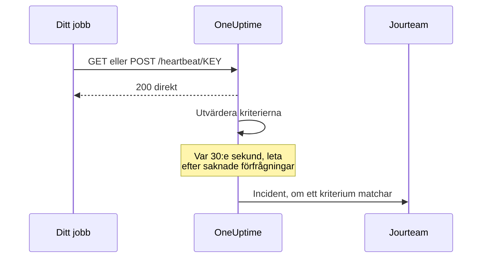

# Övervakning av inkommande förfrågningar

En monitor för inkommande förfrågningar ger dig en URL som andra system skickar HTTP-förfrågningar till. OneUptime utvärderar varje förfrågan mot dina kriterier och kan ändra monitorns status, deklarera incidenter och kalla in den som har jour.

Den täcker två olika uppgifter:

- **Heartbeat-övervakning** — ett cron-jobb, en worker eller en enhet anropar URL:en enligt ett schema, och OneUptime skapar en incident när anropen slutar komma.
- **Ta emot larm från ett annat system** — Prometheus Alertmanager, Grafana eller något annat som kan skicka JSON med POST skickar in larm, och OneUptime gör vart och ett till en incident med eskalering till jouren och automatisk lösning när problemet är över.

Båda använder samma monitortyp. Det som skiljer dem åt är kriterierna du konfigurerar.

:::cards
- [Skapa monitorn](#skapa-en-monitor-för-inkommande-förfrågningar): Få en heartbeat-URL i några få steg.
- [Skicka ett heartbeat](#skicka-ett-heartbeat): Från curl, cron, Node.js, Python eller Go.
- [Larma när anropen slutar](#markera-som-offline-om-inget-heartbeat-kommit-på-10-minuter-ett-dödmansgrepp): Gör monitorn till ett dödmansgrepp.
- [Ta emot larm](#ta-emot-larm-från-ett-annat-system): En incident per larm från Alertmanager eller Grafana.
:::

## Så fungerar det

Ingenting kontrollerar ditt system utifrån: ditt system anropar monitorns URL, OneUptime svarar direkt och utvärderar sedan förfrågan mot monitorns kriterier. Ett kriterium som letar efter förfrågningar som har *slutat* komma kontrolleras dessutom på nytt i bakgrunden var 30:e sekund, så att även tystnad kan skapa en incident.



Använd den för att:

- Övervaka cron-jobb och schemalagda uppgifter
- Kontrollera att bakgrunds-workers körs
- Övervaka tjänster bakom brandväggar som inte kan nås utifrån
- Ta emot larm från Prometheus Alertmanager, Grafana och andra larmsystem
- Följa heartbeat-signaler från alla system som kan tala HTTP

## Skapa en monitor för inkommande förfrågningar

:::steps
### Starta en ny monitor

Gå till **Monitorer** och klicka på **Skapa monitor**.

### Välj Incoming Request

Under **Monitortyp** väljer du **Incoming Request** — den är en av de vanliga typerna överst. Ange ett **Namn** och klicka sedan på **Nästa**.

### Gå igenom kriterierna

Steget **Kriterier** börjar med [standardkriterierna](#vad-du-får-från-början). För ett heartbeat klickar du på **Lägg till kriterier** och ger det nya kriteriet ett filter **Incoming Request** / **Not Recieved In Minutes** som ändrar statusen till offline och deklarerar en incident, med **Lös incident automatiskt** påslaget. Dra det sedan överst i listan — se [Exempel på kriterier](#exempel-på-kriterier) för varför.

### Skapa monitorn

Klicka på **Skapa monitor**. Monitorn öppnas på sidan **Översikt**, där kortet **Send the first heartbeat** visar **Heartbeat URL** med en kopieringsknapp och ett exempelkommando med `curl`.

### Skicka den första förfrågan

Konfigurera din tjänst så att den skickar förfrågningar till den URL:en (se [Skicka ett heartbeat](#skicka-ett-heartbeat)). När den första förfrågan kommer ger kortet plats åt monitorns historik, och ett kort **Heartbeat URL** visar URL:en och när den senaste förfrågan kom.
:::

> [!NOTE]
> URL:en innehåller monitorns hemliga nyckel, så bara personer som kan redigera monitorer kan se den. Du hittar den när som helst igen på monitorns sida **Dokumentation**, i avsnittet **Konfiguration** i sidomenyn.

## Förfrågans URL

Din monitor har en unik URL i det här formatet:

```text
https://oneuptime.com/heartbeat/YOUR_SECRET_KEY
```

Ersätt `https://oneuptime.com` med URL:en till din OneUptime-instans om du självhostar.

Skicka **GET**- eller **POST**-förfrågningar till den här URL:en. HEAD godtas och behandlas som GET; PUT, PATCH och DELETE returnerar 404. Den hemliga nyckeln i sökvägen är den enda inloggningsuppgiften — det krävs ingen header eller token. Frågesträngar ignoreras: skicka det som kriterierna ska läsa i kroppen eller i headerna.

> [!WARNING]
> Alla som känner till den här URL:en kan markera monitorn som frisk, så behandla den som en hemlighet. Om den läcker öppnar du monitorns sida **Inställningar** och klickar på **Återställ hemlig nyckel för inkommande begäran**, och sedan uppdaterar du varje avsändare. Alla headers du skickar lagras på monitorn och är synliga för alla som kan läsa den — skicka inte API-nycklar eller token i headers till den här slutpunkten.

> [!IMPORTANT]
> OneUptime svarar `200` med ett tomt JSON-objekt (`{}`) direkt och behandlar förfrågan via en kö. Svaret skrivs innan någon validering sker, så en `200` är **inte** en bekräftelse på att förfrågan godtogs — en felaktig hemlig nyckel, en borttagen monitor och en inaktiverad monitor returnerar också `200`. Kontrollera monitorns egen tidslinje för att bekräfta att förfrågningarna kommer fram.

### Skicka en förfrågningskropp

Om du vill använda fält i kroppen — `{{requestBody.status}}` i en incidenttitel, en JSON-sökväg i gruppering av incidenter eller ett kriterium med ett JavaScript-uttryck — skickar du `Content-Type: application/json`. Det är formatet som den här dokumentationen utgår från genomgående. Kroppen måste vara ett JSON-objekt eller en JSON-matris: ogiltig JSON, eller ett ensamt värde som `"error"`, avvisas med en `500`.

| Innehållstyp | Vad kriterier och mallar ser |
| --- | --- |
| `application/json` | Den tolkade JSON:en. |
| `application/x-www-form-urlencoded` | Det tolkade formuläret. Nycklar inom hakparenteser nästlas (`alerts[0][status]=firing`), och alla värden är strängar. |
| Allt annat, eller ingen | En tom kropp (`{}`), så varje hänvisning till `requestBody` blir ingenting. |

Kroppar på upp till 50 MB godtas; en större avvisas med en `413`. Komprimera inte kroppen med `Content-Encoding: gzip`: då lagras den inte som JSON, och sökvägar in i den löses inte upp.

### Skicka ett heartbeat

Varje exempel skickar en förfrågan. Ersätt `YOUR_SECRET_KEY` med nyckeln från din monitors URL.

:::tabs
@tab curl
```bash
# Simple GET request
curl https://oneuptime.com/heartbeat/YOUR_SECRET_KEY

# POST request with a JSON body
curl -X POST https://oneuptime.com/heartbeat/YOUR_SECRET_KEY \
  -H "Content-Type: application/json" \
  -d '{"status": "healthy", "version": "1.2.3"}'
```
@tab Cron
```bash
# Send a heartbeat every 5 minutes
*/5 * * * * curl -fsS https://oneuptime.com/heartbeat/YOUR_SECRET_KEY > /dev/null

# Or ping only when the job succeeds, so a failed run counts as a missed heartbeat
0 2 * * * /usr/local/bin/backup.sh && curl -fsS https://oneuptime.com/heartbeat/YOUR_SECRET_KEY > /dev/null
```
@tab Node.js
```javascript title="heartbeat.mjs"
// Node.js 18 or later: fetch is built in. Run with `node heartbeat.mjs`.
const response = await fetch(
  "https://oneuptime.com/heartbeat/YOUR_SECRET_KEY",
  {
    method: "POST",
    headers: { "Content-Type": "application/json" },
    body: JSON.stringify({ status: "healthy", version: "1.2.3" }),
  },
);

console.log(response.status); // 200
```
@tab Python
```python title="heartbeat.py"
# Python 3, standard library only. Run with `python3 heartbeat.py`.
import json
import urllib.request

request = urllib.request.Request(
    "https://oneuptime.com/heartbeat/YOUR_SECRET_KEY",
    data=json.dumps({"status": "healthy", "version": "1.2.3"}).encode(),
    headers={"Content-Type": "application/json"},
    method="POST",
)

with urllib.request.urlopen(request, timeout=10) as response:
    print(response.status)  # 200
```
@tab Go
```go title="heartbeat.go"
// Run with `go run heartbeat.go`.
package main

import (
	"bytes"
	"fmt"
	"net/http"
)

func main() {
	body := []byte(`{"status": "healthy", "version": "1.2.3"}`)

	resp, err := http.Post(
		"https://oneuptime.com/heartbeat/YOUR_SECRET_KEY",
		"application/json",
		bytes.NewReader(body),
	)
	if err != nil {
		panic(err)
	}
	defer resp.Body.Close()

	fmt.Println(resp.StatusCode) // 200
}
```
@tab PowerShell
```powershell
# Windows PowerShell 5.1 or PowerShell 7
Invoke-RestMethod -Method Post `
  -Uri "https://oneuptime.com/heartbeat/YOUR_SECRET_KEY" `
  -ContentType "application/json" `
  -Body '{"status": "healthy", "version": "1.2.3"}'
```
:::

## Övervakningskriterier

Du kan konfigurera kriterier som avgör när din tjänst anses vara online, försämrad eller offline. Varje kriteriefilter har en **Filtertyp** (vad som granskas), ett **Filtervillkor** (hur det jämförs) och ett **Värde**.

### Vad du får från början

En ny monitor för inkommande förfrågningar skapas med två kriterier som läser förfrågans kropp:

| Kriterium | Filtertyp | Filtervillkor | Värde | Effekt |
| -------- | ------------ | ---------------- | ------- | -------------------------------------------- |
| Offline  | Begärandekropp | Innehåller | `error` | Markerar monitorn som offline, öppnar en incident |
| Online   | Begärandekropp | Not Contains | `error` | Markerar monitorn som online |

Det passar det vanliga fallet där avsändaren rapporterar sin egen hälsa i nyttolasten: en förfrågan vars kropp nämner `error` tar ned monitorn, och nästa förfrågan utan ordet tar upp monitorn igen och löser incidenten. En förfrågan helt utan kropp räknas som "innehåller inte `error`", så ett vanligt heartbeat-anrop håller monitorn online.

Ändra värdet till det som din avsändare faktiskt skickar (`"status":"firing"`, `FAILED` och så vidare) — jämförelsen är en sökning efter en delsträng i hela kroppen, nycklar inräknade, som skiljer på versaler och gemener, så även `{"error":null}` matchar `error`.

> [!NOTE]
> De här standardinställningarna är **inte** ett dödmansgrepp: ingenting här utlöses när förfrågningarna slutar komma. Om du vill larmas vid tystnad lägger du till ett kriterium **Incoming Request** / **Not Recieved In Minutes** enligt beskrivningen nedan.

### Tillgängliga filtertyper

| Filtertyp | Kontrollerar | Anteckningar |
| --------------------- | ------------------------------------------------------ | -------------------------------------------------------------------------------------------- |
| Incoming Request | Om en förfrågan har tagits emot inom ett tidsfönster | Den enda kontrollen som kan utlösas när ingenting kommer |
| Begärandekropp | Förfrågans kropp | Sökning efter en delsträng. Objekt som kropp jämförs som kompakt JSON |
| Request Header | Namnen på förfrågans headers | Exakt jämförelse med ett helt headernamn, utan hänsyn till versaler och gemener |
| Request Header Value | Värdena i förfrågans headers | Exakt jämförelse med ett helt headervärde, utan hänsyn till versaler och gemener |
| JavaScript Expression | Alla uttryck över `requestBody` och `requestHeaders` | Det flexiblaste alternativet — se [JavaScript-uttryck](/docs/monitor/javascript-expression) |

### Filtervillkor

Varje filtertyp har sina egna villkor:

| Filtertyp | Villkor |
| --- | --- |
| **Incoming Request** | **Recieved In Minutes** — en förfrågan har tagits emot inom det angivna antalet minuter. **Not Recieved In Minutes** — ingen förfrågan har tagits emot inom det angivna antalet minuter. (Instrumentpanelen stavar dem så.) |
| **Begärandekropp**, **Request Header**, **Request Header Value** | **Innehåller** och **Not Contains** |
| **JavaScript Expression** | **Evaluates To True** |

> [!NOTE]
> Headernamn och headervärden jämförs med gemener och mot hela namnet eller hela värdet, inte som delsträng: `application/json` matchar inte `application/json; charset=utf-8`. Bara **Begärandekropp** söker efter en delsträng. Headers som din proxy eller OneUptimes egen lastbalanserare lägger till (`x-forwarded-for`, `x-real-ip`) lagras också.

Objekt som kropp jämförs som kompakt JSON utan mellanslag, så ett filter **Begärandekropp** / **Innehåller** måste skrivas `"status":"firing"` — kopierar du `"status": "firing"` från en snyggt formaterad nyttolast matchar det aldrig.

### Exempel på kriterier

#### Markera som offline om inget heartbeat kommit på 10 minuter (ett dödmansgrepp)

| Fält | Värde |
| --- | --- |
| **Filtertyp** | Incoming Request |
| **Filtervillkor** | Not Recieved In Minutes |
| **Värde** | `10` |

#### Markera som försämrad utifrån innehållet i förfrågans kropp

| Fält | Värde |
| --- | --- |
| **Filtertyp** | Begärandekropp |
| **Filtervillkor** | Innehåller |
| **Värde** | `"status":"degraded"` |

> [!IMPORTANT]
> Lägg dödmansgreppet **ovanför** standardkriterierna. Kriterierna kontrolleras uppifrån, och det första som matchar avgör. Bakgrundskontrollen läser den senaste förfrågan igen, så standardkriteriet för online — "Request Body Not Contains `error`" — fortsätter att matcha den, och ett kriterium under det kommer aldrig till tals. **Lägg till kriterier** lägger till ett kriterium längst ned: dra upp det.

> [!WARNING]
> En monitor utvärderas bara på nytt i bakgrunden om minst ett av dess kriterier kontrollerar **Incoming Request**. En monitor vars kriterier bara kontrollerar kroppen, Request Header eller ett JavaScript-uttryck utvärderas när en förfrågan kommer och vid ingen annan tidpunkt — så den kan aldrig bli offline av sig själv. Om du vill ha ett larm för uteblivna heartbeats behöver du ett kriterium med **Incoming Request**.

Bakgrundskontrollen räknar hela minuter och utlöses så fort *mer* än värdet har gått: "Not Recieved In Minutes: 10" utlöses ungefär 11 minuter efter den senaste förfrågan (kontrollen körs var 30:e sekund). En monitor som aldrig har tagit emot en förfrågan behandlas som om tidpunkten då den skapades var den senaste förfrågan, så samma kriterium på en helt ny monitor utlöses ungefär 11 minuter efter att du skapat den, även om avsändaren aldrig kopplades in. Bara minuter då OneUptime tog emot räknas: minuter då OneUptime själv startar om, uppgraderas eller hämtar ikapp räknas inte, som [När OneUptime inte tar emot data](/docs/monitor/when-oneuptime-is-not-receiving) förklarar.

## Ta emot larm från ett annat system

Alertmanager, Grafana och liknande verktyg skickar med POST ett JSON-dokument som beskriver ett eller flera larm. Som standard öppnar ett kriterium **en** incident, så en nyttolast med fem larm skulle ge en enda incident. Gruppering av incidenter ändrar det: den hämtar ut ett värde ur nyttolasten och öppnar **en separat incident per distinkt värde**, som alla kan vara öppna samtidigt.

```mermaid title="Gruppering av incidenter: en incident per larm i nyttolasten"
flowchart TB
    payload["Webhook-nyttolast"] --> keys["En nyckel per larm"]
    keys --> state{"Larmet löst?"}
    state -->|Nej| open["Öppna eller behåll dess incident"]
    state -->|Ja| resolve["Lös dess incident"]
```

### Aktivera gruppering av incidenter

:::steps
1. Öppna kriteriet och fäll ut **Inställningar**.
2. Slå på **Group incidents and alerts by a payload field**.
3. Fyll i **Open a separate incident for each…**. Om varje incident ska lösa sig själv fyller du också i fältet och värdet under **Auto-resolve each incident when…** (se nedan). Spara sedan monitorn.
:::

| Fält | Exempel | Vad det gör |
| ---------------------------------- | ---------------------------------------- | ---------------------------------------------------------------------- |
| Open a separate incident for each… | `requestBody.alerts[*].labels.alertname` | Sökvägen vars distinkta värden delar upp incidenterna |
| Field that signals recovery | `requestBody.alerts[*].status` | Sökvägen som kontrolleras för att avgöra att ett larm är över |
| Value that means recovered | `resolved` | Det exakta värde som markerar att problemet är över |
| Max incidents per request | `100` (standard) | Säkerhetstak så att ett fält med många värden inte kan öppna ett obegränsat antal incidenter |

### Syntax för sökvägar

Sökvägar måste börja med det bokstavliga prefixet `requestBody.`. En sökväg utan det — `alerts[*].labels.alertname` — matchar ingenting, utan att säga till. Omslaget `{{ }}` är valfritt: `requestBody.status` och `{{requestBody.status}}` beter sig likadant.

- `[*]` breder ut sig över en matris — en incident per **distinkt** värde. Två element som ger samma värde slås ihop till en incident, och den incidentens tillstånd (aktivt/löst) tas från det **första** matchande elementet. **Bara den första `[*]` i en sökväg är ett jokertecken**; `requestBody.groups[*].alerts[*].name` matchar ingenting.
- `[0]` och `[last]` väljer ett enda element och får komma efter en `[*]`.
- Objekt- och matrisvärden, tomma strängar och null-värden hoppas över. `0` och `false` är giltiga nycklar.
- Kroppen måste vara ett JSON-objekt; en nyttolast vars översta nivå är en matris grupperas inte.

### Lösning sker utifrån händelser

En webhook beskriver bara det som finns i den nyttolasten, så OneUptime löser aldrig en incident för att dess nyckel slutade dyka upp. En incident löses bara när en nyttolast uttryckligen säger att den nyckeln är över. Två saker måste båda vara sanna:

1. **Field that signals recovery** och **Value that means recovered** är ifyllda och matchar nyttolasten. Jämförelsen är exakt och skiljer på versaler och gemener — `Resolved` matchar inte `resolved`.
2. Kriteriets incident har **Lös incident automatiskt** påslaget, under **Fler fält** i incidentformuläret. Utan det ignoreras matchande meddelanden om att problemet är över, och incidenterna förblir öppna. (Detsamma gäller larm och **Lös larm automatiskt**.) Standardkriteriet för offline börjar med det påslaget; en incident som du själv lägger till i ett kriterium börjar med det avslaget.

**Max incidents per request** begränsar uthämtningen, inte bara skapandet. Nycklar bortom taket är också osynliga för lösningen, så i en nyttolast med fler distinkta nycklar än taket stänger ett larm som rapporterar `resolved` bortom taket inte sin incident.

> [!NOTE]
> När en monitor tar emot förfrågningar snabbare än OneUptime utvärderar dem utvärderar OneUptime den nyaste och hoppar över dem däremellan, så en skur av webhooks kan lämna ett aktivt eller ett löst larm outvärderat. På en självhostad server gör `INCOMING_REQUEST_INGEST_COALESCE_ENABLED=false` i OneUptime-appens miljö att varje förfrågan utvärderas för sig.

> [!WARNING]
> Om **Field that signals recovery** innehåller `[*]` men **Open a separate incident for each…** inte gör det, löses aldrig något. Använd antingen `[*]` i båda, eller i ingen av dem. En sökväg för lösning utan `[*]` utvärderas mot hela nyttolasten, så en `status: resolved` på nyttolastens nivå löser varje nyckel i den nyttolasten — även larm vars egen status fortfarande är aktiv.

### Namnge incidenterna

Grupperingsnyckeln görs tillgänglig för incident- och larmmallar som en variabel som är uppkallad efter **sökvägens sista segment**:

| Sökväg | Variabel |
| ---------------------------------------- | ----------------- |
| `requestBody.alerts[*].labels.alertname` | `{{alertname}}`   |
| `requestBody.alerts[*].fingerprint`      | `{{fingerprint}}` |
| `requestBody.commonLabels.severity`      | `{{severity}}`    |

Hela nyttolasten finns tillgänglig vid sidan av, så både en incidenttitel `{{alertname}}` och en beskrivning som hänvisar till `{{requestBody.commonAnnotations.summary}}` fungerar. Se [Incident- och varningsmallar](/docs/monitor/incident-alert-templating).

> [!WARNING]
> Variabelns namn är en del av den identitet som OneUptime använder för att koppla ett meddelande om att problemet är över till en öppen incident. Om du ändrar grupperingssökvägen till en med ett annat sista segment blir alla incidenter som är öppna under den gamla sökvägen föräldralösa — de kan inte längre lösas automatiskt utan måste stängas för hand.

`[*]` fungerar **bara** i de två fälten för grupperingssökvägar. På andra ställen löses den inte upp, och en platshållare som inte löses upp skrivs ut **ordagrant** i stället för att tömmas — en titel `{{requestBody.alerts[*].labels.alertname}}` visas med klammerparenteserna kvar. En titel `{{requestBody.alerts[0].annotations.summary}}` löses upp, men läser alltid det första larmet i nyttolasten, inte det som den här incidenten öppnades för. Föredra grupperingsvariabeln plus nyttolastens gemensamma fält `commonAnnotations`.

### Genomarbetat exempel

En fullständig Alertmanager-konfiguration finns under [Prometheus Alertmanager](/docs/integrations/prometheus-alertmanager). För Grafana, se [Grafana](/docs/integrations/grafana).

## Bästa praxis

1. **Ställ in tidsfönstret rätt** — Om ditt cron-jobb körs var 5:e minut sätter du tröskeln för "Not Recieved In Minutes" till 10–15 minuter för att ge utrymme för enstaka fördröjningar, och lägger det kriteriet först.
2. **Skicka med meningsfulla data** — Skicka statusinformation i förfrågans kropp så att du kan ställa in detaljerade kriterier.
3. **Använd POST med `Content-Type: application/json`** — allt som läser i kroppen är beroende av det.
4. **Blanda inte de två uppgifterna på en monitor** — en monitor som tar emot händelsestyrda larm har ingen fast rytm, så ett kriterium "Not Recieved In Minutes" på den kommer att slå fram och tillbaka. Använd en separat monitor för dödmansgreppet.
5. **Övervaka övervakningen** — Se till att tjänsten som skickar förfrågningarna hanterar fel ordentligt, så att misslyckade förfrågningar inte går obemärkta förbi.

## Felsökning

:::details Min avsändare får en 200, men ingenting visas på monitorn
`200` skickas innan förfrågan valideras, så den bevisar inte att förfrågan godtogs. Kontrollera att den hemliga nyckeln i URL:en stämmer med monitorns **Heartbeat URL**, och att monitorn inte är inaktiverad. Titta sedan på monitorns tidslinje för att se om förfrågningarna kommer fram.
:::

:::details Monitorn blir aldrig offline när heartbeats upphör
Bara ett kriterium med **Incoming Request** (**Not Recieved In Minutes**) kan märka tystnad. Lägg till ett om det saknas, och dra det ovanför standardkriterierna: standardkriteriet för online matchar den senaste förfrågan vid varje bakgrundskontroll, och det första kriteriet som matchar avgör.
:::

:::details Ett filter på Begärandekropp matchar aldrig
Skicka `Content-Type: application/json`, och skriv värdet som kompakt JSON — `"status":"firing"`, utan mellanslag efter kolonet. Utan en innehållstyp för JSON eller formulär tolkas kroppen inte.
:::

:::details Ett filter på Request Header matchar aldrig
Headernamn och headervärden jämförs i sin helhet. Ange hela värdet, som `application/json; charset=utf-8`, i stället för en del av det.
:::

:::details Avsändaren får en 500
Förfrågan säger `Content-Type: application/json`, men kroppen är inte ett JSON-objekt eller en JSON-matris. Skicka giltig JSON, eller en annan innehållstyp.
:::

## Nästa steg

:::cards
- [Prometheus Alertmanager](/docs/integrations/prometheus-alertmanager): En komplett konfiguration för inkommande larm.
- [Grafana](/docs/integrations/grafana): Samma sak, för larm från Grafana.
- [Incident- och varningsmallar](/docs/monitor/incident-alert-templating): Alla variabler som finns i titlar och beskrivningar.
- [JavaScript-uttryck](/docs/monitor/javascript-expression): Syntax för uttryck och regler för citattecken.
:::
