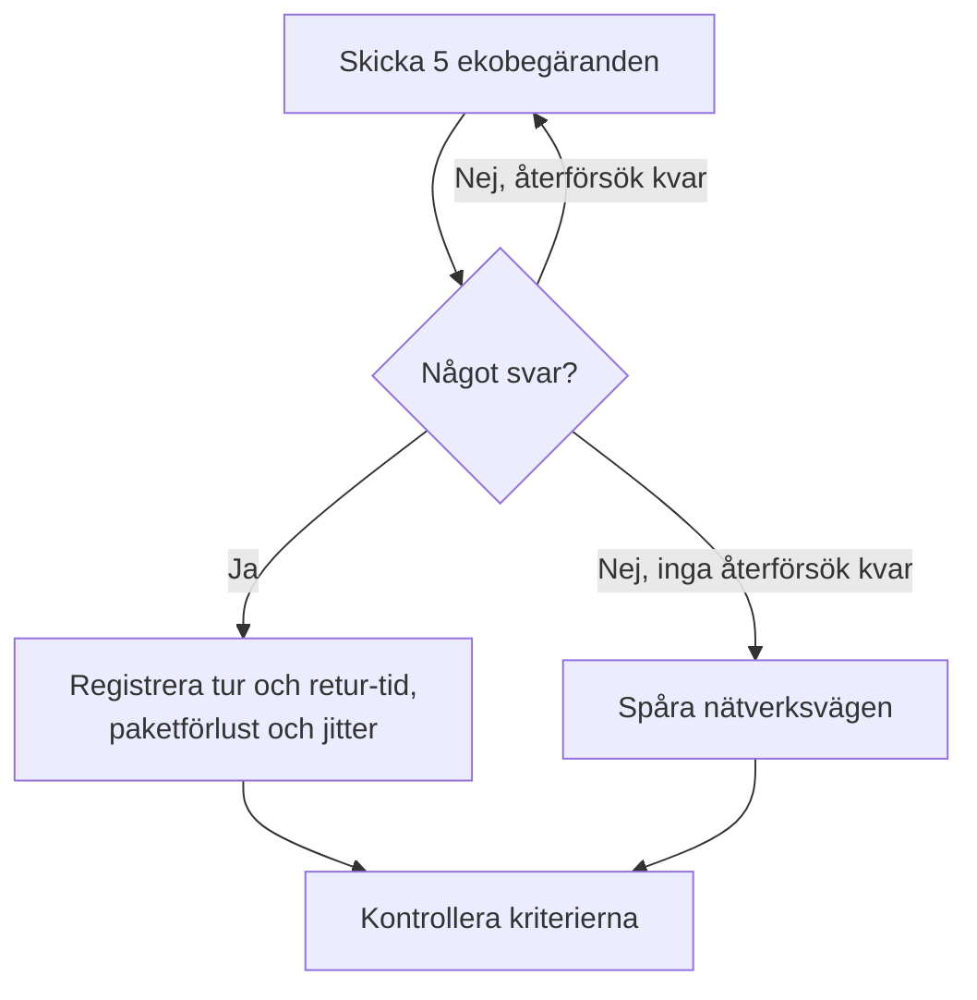

# IP-övervakning

En IP-monitor kontrollerar att en IPv4- eller IPv6-adress svarar på ping (ICMP-ekobegäranden) och mäter tur och retur-tiden, paketförlusten och jittret. Använd den för infrastruktur som du känner till via adressen, som en gateway, en lastbalanserares virtuella IP eller en server med fast adress.

:::cards
- [Skapa monitorn](#skapa-en-ip-monitor): Sex steg i instrumentpanelen.
- [Konfigurationsalternativ](#konfigurationsalternativ): Adressen, tidsgränsen och återförsök.
- [Övervakningskriterier](#övervakningskriterier): Nåbarhet, latens, paketförlust och jitter.
- [Felsökning](#felsökning): När adressen är uppe men monitorn säger offline.
:::

## Så fungerar det

En IP-monitor kör samma kontroll som en [ping-monitor](/docs/monitor/ping-monitor). Vid varje kontroll skickar en sond fem ekobegäranden till adressen. Om minst ett svar kommer tillbaka är adressen online, och sonden registrerar den genomsnittliga tur och retur-tiden som svarstid, tillsammans med paketförlusten, jittret och det snabbaste och långsammaste svaret. Om inget svar kommer tillbaka försöker sonden igen, upp till det antal återförsök du tillåter. Sedan kör OneUptime resultatet genom monitorns kriterier.

När en kontroll misslyckas spårar sonden också vägen till adressen och bifogar det den hittade till resultatet som **Network Path at Time of Failure**, så att du ser var vägen bröts.

Vilken du ska använda:

| Monitor | Tar | Använd den när |
| --- | --- | --- |
| **IP** | Bara en IP-adress | Adressen i sig är det du bevakar, och den ändras inte. |
| [Ping](/docs/monitor/ping-monitor) | Ett värdnamn eller en IP-adress | Du känner till värden via namn; namnet slås upp vid varje kontroll, så monitorn följer DNS-ändringar. |

> [!NOTE]
> Vissa värdleverantörer blockerar ICMP på de maskiner där en sond körs. En sond som inte kan skicka ping alls kontrollerar i stället TCP-port `80` på adressen, så att monitorn ändå säger om den kan nås. Paketförlust och jitter mäts då inte.

En sond som har förlorat sin egen nätverksanslutning rapporterar inget resultat, så den kan inte markera din adress som offline.

## Innan du börjar

- **En roll som kan skapa monitorer**: Project Owner, Project Admin, Project Member, Monitor Admin eller Monitor Member, eller en anpassad roll med behörigheten Create Monitor.
- **En sond som når adressen**, med ICMP tillåtet på vägen. Projektets standardsonder väljs för varje ny monitor. Om en brandvägg står framför den tillåter du ICMP-ekobegäranden från [OneUptime Clouds sond-IP-adresser](/docs/configuration/ip-addresses). En privat adress behöver en [anpassad sond](/docs/probe/custom-probe) i det nätverket, och en IPv6-adress behöver en sond med IPv6-anslutning.

## Skapa en IP-monitor

:::steps
### Börja en ny monitor

Gå till **Monitorer** och klicka på **Skapa monitor**. Klicka på **Fler monitortyper** under **Monitortyp** och välj **IP** under **Basic Monitoring**.

### Namnge den

Ange ett **Namn**, som `Office gateway`, och klicka sedan på **Nästa**.

### Ange adressen

Ange under **IP-adress** den IPv4- eller IPv6-adress som ska kontrolleras, som `192.168.1.1` eller `2001:db8::1`. Ett värdnamn godtas inte: fältet visar ett fel. För att pinga en värd via namn använder du en [ping-monitor](/docs/monitor/ping-monitor).

### Testa den

Klicka på **Testa monitor**, välj en sond under **Välj sond** och klicka på **Kör test**. **Resultat av övervakningstest** visar de tur och retur-tider och den paketförlust som sonden såg.

### Gå igenom kriterierna

**Monitorkriterier** börjar med [standardkriterierna](#standardkriterier): offline när adressen inte svarar, online när den gör det. Ändra dem vid behov och klicka sedan på **Nästa**.

### Välj sonder och skapa

Behåll eller ändra **Sonder** och **Övervakningsintervall** (det börjar på **Var 5:e minut**) och klicka sedan på **Skapa monitor**. Monitorns sida öppnas.
:::

## Konfigurationsalternativ

| Fält | Standard | Vad du anger |
| --- | --- | --- |
| **IP-adress** | Ingen | En IPv4-adress, som `192.168.1.1`, eller en IPv6-adress, som `2001:db8::1`. Hakparenteser runt en IPv6-adress tas bort. |
| **Begärandetimeout (sekunder)** (under **Fler fält**) | `60` | Hur länge det väntas på ett svar vid varje försök. Maxvärdet är 60 sekunder. |
| **Återförsök vid misslyckande** (under **Fler fält**) | Sondens standard, oftast `3` | Hur många gånger ett misslyckat försök görs om. Maxvärdet är 3. |

**Återförsök vid misslyckande** räknar återförsök _efter_ det första försöket, så `0` kör kontrollen en gång och `2` upp till tre gånger. Lämnas fältet tomt används sondens standard: 3, om inte sondens `PROBE_MONITOR_RETRY_LIMIT` säger något annat. Varje fel görs om, tidsgränser inräknade, med en paus på en sekund mellan försöken. En lyckad kontroll vars svar tog längre än 10 sekunder kontrolleras också igen.

## Övervakningskriterier

Kriterier avgör när adressen räknas som online, försämrad eller offline, och om det deklarerar en incident eller skapar ett larm. Varje kriterium kontrollerar ett eller flera filter:

| Filter | Villkor | Vad det kontrollerar |
| --- | --- | --- |
| **Is Online** | **Sant**, **Falskt** | Om minst en ekobegäran fick svar. |
| **Svarstid (i ms)** | **Greater Than**, **Less Than**, **Greater Than Or Equal To**, **Less Than Or Equal To** | Svarens genomsnittliga tur och retur-tid. |
| **Packet Loss (in %)** | **Greater Than**, **Less Than**, **Greater Than Or Equal To**, **Less Than Or Equal To** | Andelen av de fem ekobegäranden som inte fick svar. |
| **Jitter (in ms)** | **Greater Than**, **Less Than**, **Greater Than Or Equal To**, **Less Than Or Equal To** | Standardavvikelsen för tur och retur-tiderna över paketen i en kontroll. |
| **Is Request Timeout** | **Sant**, **Falskt** | Om pingen nådde tidsgränsen vid varje försök. |

Med två eller fler filter avgör **Matchningsvillkor** om **Alla** måste matcha eller om **Valfri** av dem räcker. Ett kriteriums **Åtgärder** avgör vad det gör: ändrar monitorns status, skapar ett larm, deklarerar en incident eller flera av dessa.

### Standardkriterier

En ny IP-monitor börjar med två kriterier:

- **Offline** — adressen svarar inte på någon av ekobegärandena, eller kan inte nås alls, efter alla återförsök. Monitorn markeras som **Offline** och en incident som heter "_monitor name_ is offline" skapas. Incidenten löser sig själv när adressen svarar igen.
- **Uppe** — adressen svarar. Monitorn markeras som **Fungerar**.

Kriterier kontrolleras uppifrån och ned, och det första som matchar avgör vad som händer. När inget matchar visar monitorn sin standardstatus: **Fungerar**, om du inte väljer en annan under **Fler fält** under kriterierna.

### Utvärdering över en tidsperiod

**Utvärdera dessa kriterier över en tidsperiod** är en kryssruta under ett filter, som erbjuds för **Is Online**, **Svarstid (i ms)**, **Packet Loss (in %)** och **Jitter (in ms)**. Slå på den för att bedöma ett fönster av tidigare kontroller i stället för bara den senaste: välj en aggregering under **Utvärdera** och ett fönster från 2 till 60 minuter under **Under de senaste (i minuter)**.

| Aggregering | Matchar när |
| --- | --- |
| **Genomsnitt**, **Summa**, **Maximum Value**, **Minimum Value** | Det värdet över fönstret uppfyller villkoret. Bara numeriska filter. |
| **All Values** | Varje kontroll i fönstret uppfyller villkoret. |
| **Any Value** | Minst en kontroll i fönstret uppfyller villkoret. |

**All Values** matchar först när fönstret verkligen täcks av data. En monitor som just skapats, eller en vars kontroller slutade registreras, har inte tillräcklig historik för att säga något om de senaste N minuterna, så kriteriet väntar i stället för att matcha på den enda mätning det har. **Any Value** är inställningen för "säg till direkt när en enda kontroll går över gränsen" och utlöses fortfarande omedelbart.

**Om ingen data** avgör vad som händer så länge fönstret inte kan bära kriteriet:

| Alternativ | Vad som händer | Använd det för |
| --- | --- | --- |
| **Ignore** (standard) | Kriteriet matchar inte. | Vanliga tröskellarm. |
| **Utlösare** | Den saknade datan räknas som problemet. | Kontroller där tystnad i sig är ett fel. |
| **Treat As Zero** | Fönstret jämförs som en enda nolla. | Räknare där inga händelser verkligen betyder noll. |

### Exempelkriterier

| Mål | Filter | Villkor | Värde |
| --- | --- | --- | --- |
| Offline när adressen inte kan nås | **Is Online** | **Falskt** | — |
| Larma när latensen är hög | **Svarstid (i ms)** | **Greater Than** | `100` |
| Markera adressen som försämrad på en länk med förluster | **Packet Loss (in %)** | **Greater Than** | `20` |
| Larma vid en instabil anslutning | **Jitter (in ms)** | **Greater Than** | `30` |

## Felsökning

:::details Adressen är uppe, men monitorn säger offline
Adressen, eller en brandvägg framför den, svarar inte på ICMP-ekobegäranden från sonden. Tillåt ICMP-ekobegäranden från sonderna, eller bevaka i stället en tjänst på den adressen med en [portmonitor](/docs/monitor/port-monitor). **Network Path at Time of Failure** på den misslyckade kontrollen visar hur långt vägen nådde.
:::

:::details En IPv6-adress misslyckas alltid
Sonden som körde kontrollen saknar IPv6-anslutning; felet säger det. Kör monitorn på en sond med IPv6: se [Anpassade probes](/docs/probe/custom-probe).
:::

:::details Paketförlust och jitter är tomma
Sonden som körde kontrollen kan inte skicka ping, så den kontrollerade i stället TCP-port `80`, som inte mäter någon av dem. Kör monitorn på en sond som får skicka ICMP.
:::

## Nästa steg

:::cards
- [Ping-övervakning](/docs/monitor/ping-monitor): Pinga en värd via namn och följ DNS-ändringar.
- [Portövervakning](/docs/monitor/port-monitor): Kontrollera en tjänst på adressen, inte bara adressen.
- [Anpassade probes](/docs/probe/custom-probe): Kontrollera privata adresser och IPv6-adresser från ditt eget nätverk.
- [Incidenter](/docs/incidents/index): Vad som händer efter att monitorn har deklarerat en.
:::
