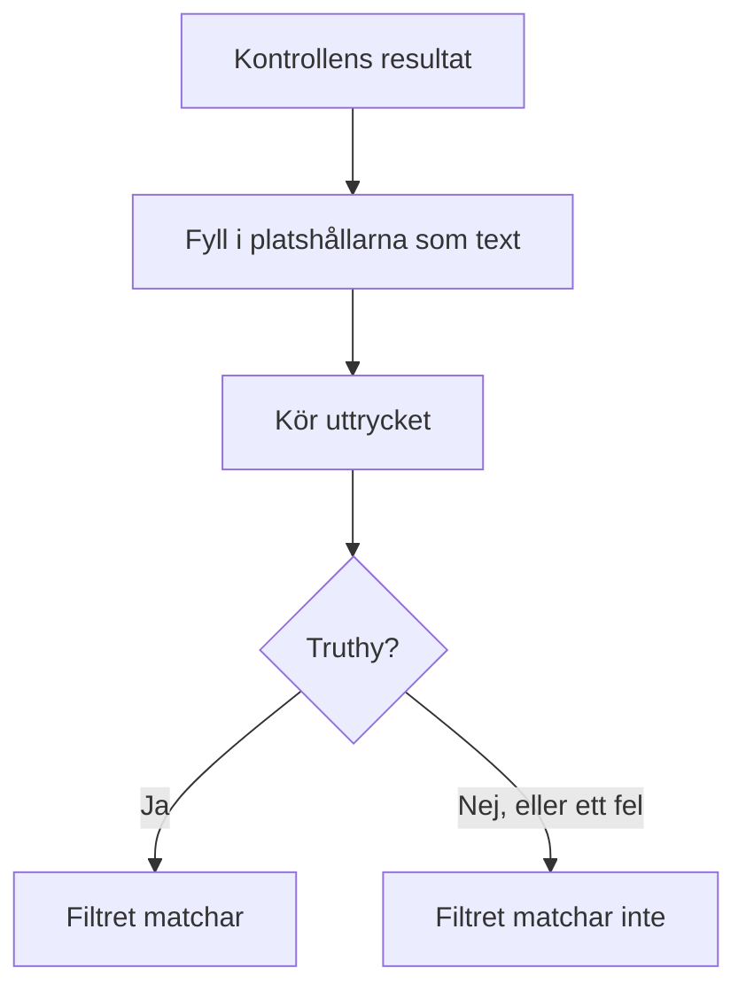

# JavaScript-uttryck

Ett kriteriefilter **JavaScript Expression** avgör med en rad JavaScript i stället för en fast jämförelse om en monitors kriterium är uppfyllt. Använd det när de inbyggda filtren inte kan uttrycka villkoret — ett fält djupt inne i ett JSON-svar, två värden som jämförs med varandra, eller flera kontroller kombinerade med `&&` och `||`.

:::cards
- [Så fungerar det](#så-fungerar-det): Platshållarna fylls i, sedan körs uttrycket.
- [Variabler](#variabler-per-monitortyp): Vad varje monitortyp ger dig.
- [Exempel](#exempel): Uttryck för API:er, inkommande förfrågningar och databaser.
- [Regler för citattecken](#regler-för-citattecken): Misstaget som nästan alla gör.
:::

## Så fungerar det

Innan uttrycket körs ersätts varje platshållare `{{variable}}` i det med värdet från monitorns senaste kontroll — som ren text. Resultatet körs sedan som JavaScript. Om det ger ett sant värde (truthy) matchar filtret; allt annat, även ett fel, betyder att det inte matchar.



Eftersom platshållarna ersätts som text blir `{{responseBody.item}}` det råa värdet. En sträng måste stå inom citattecken för att vara en JavaScript-sträng; ett tal eller ett booleskt värde ska inte det — se [Regler för citattecken](#regler-för-citattecken). Uttryck körs på OneUptime-servern, i en isolerad sandlåda.

## Lägg till ett filter av typen JavaScript Expression

:::steps
### Öppna kriterierna

Öppna **Konfiguration → Kriterier** på monitorn och klicka på **Redigera Övervakningskriterier**, eller använd steget **Kriterier** i **Skapa monitor**. Arbeta i det kriterium du vill ändra, eller klicka på **Lägg till kriterier** för ett nytt.

### Lägg till ett filter

Klicka på **Lägg till filter** under **Filter** och sätt dess **Filtertyp** till **JavaScript Expression**. **Filtervillkor** är **Evaluates To True**.

### Skriv uttrycket

Ange uttrycket i **Värde**, med [variablerna för monitorns typ](#variabler-per-monitortyp). Länken under filtret, **Read documentation for using JavaScript expressions here.**, öppnar den här sidan.

### Spara

Spara monitorn. Filtret utvärderas vid monitorns nästa kontroll.
:::

## Variabler per monitortyp

JavaScript-uttryck erbjuds för monitorer av typen Website, API, Incoming Request, Incoming Email, SQL Query och Database Health.

### Webbplats- och API-monitorer

| Variabel | Beskrivning | Typ |
| --- | --- | --- |
| `responseBody` | Svarets kropp. Om kroppen är JSON tolkas den; annars, till exempel för HTML eller XML, är den en sträng. | `string` eller `JSON` |
| `responseHeaders` | Svarets huvuden, med namn i gemener. | `Dictionary<string>` |
| `responseStatusCode` | Svarets statuskod. | `number` |
| `responseTimeInMs` | Svarstiden i millisekunder. | `number` |
| `isOnline` | Om monitorn räknar svaret som online. | `boolean` |

### Monitorer för inkommande förfrågningar

| Variabel | Beskrivning | Typ |
| --- | --- | --- |
| `requestBody` | Förfrågans kropp. | `string` eller `JSON` |
| `requestHeaders` | Förfrågans huvuden, med namn i gemener. | `Dictionary<string>` |

### Monitorer för SQL-frågor

| Variabel | Beskrivning | Typ |
| --- | --- | --- |
| `rowCount` | Antalet rader som frågan returnerade. | `number` |
| `scalarValue` | Den första kolumnen i den första raden. | valfri |
| `firstRow` | Den första raden, som par av kolumn och värde. | `JSON` |
| `executionTimeInMs` | Hur lång tid frågan tog, i millisekunder. | `number` |
| `queryError` | Frågans fel, om det fanns ett. | `string` |
| `isOnline` | Om databasen gick att nå och frågan lyckades. | `boolean` |

### Monitorer för databashälsa

`isOnline`, `engineVersion`, `connectionError`, `collectedGroups`, `unavailableGroups` och `metrics`. Se [Variabler för JavaScript-uttryck](/docs/monitor/database-health-monitor#variabler-för-javascript-uttryck) på sidan om övervakning av databashälsa.

### Monitorer för inkommande e-post

Filtret erbjuds, men inga e-postfält är kopplade till det: ett uttryck kan inte läsa ämnet, avsändaren, brödtexten eller mottagaren. Använd i stället e-postfiltertyperna — se [Övervakning av inkommande e-post](/docs/monitor/incoming-email-monitor#tillgängliga-kriterief-ält).

## Exempel

Varje rad nedan är ett fullständigt uttryck. För en JSON-kropp i ett svar som den här:

```json
{
  "item": "hello",
  "count": 3,
  "items": [{ "name": "hello" }]
}
```

| Uttryck | Matchar när |
| --- | --- |
| `"{{responseBody.item}}" === "hello"` | Fältet `item` är `hello`. |
| `{{responseBody.count}} > 2` | Fältet `count` är större än 2. |
| `"{{responseBody.items[0].name}}" === "hello"` | Det första elementet i `items` har namnet `hello`. |
| `{{responseStatusCode}} === 200 && {{responseTimeInMs}} < 500` | Statusen är 200 och svaret tog mindre än en halv sekund. |
| `/hel+o/.test("{{responseBody.item}}")` | Fältet `item` matchar ett reguljärt uttryck. |
| `"{{responseHeaders.content-type}}".startsWith("application/json")` | Svaret är JSON. Huvudnamn är i gemener. |

Kombinera villkor med `&&` och `||`, och gruppera dem med parenteser:

```javascript
({{responseStatusCode}} === 200 || {{responseStatusCode}} === 204) && {{responseTimeInMs}} < 1000
```

För en monitor för inkommande förfrågningar som tar emot `{"status": "degraded", "region": "eu"}` som `Content-Type: application/json`:

```javascript
"{{requestBody.status}}" === "degraded" && "{{requestBody.region}}" === "eu"
```

För en monitor för SQL-frågor vars fråga returnerar ett antal, larma vid ett högt antal eller en långsam fråga:

```javascript
{{scalarValue}} > 50 || {{executionTimeInMs}} > 2000
```

För en monitor för databashälsa läser du ett mätvärde genom att slå upp i hela objektet `metrics` — seriernas namn innehåller punkter, så de kan inte stå inom klammerparenteserna:

```javascript
{{metrics}}['oneuptime.monitor.database.connections.used.percent'] > 90
```

## Regler för citattecken

`{{var}}` ersätts med värdet, som text. För att jämföra en sträng sätter du den inom citattecken, som i `"{{responseBody.item}}" === "hello"`; för att jämföra ett tal låter du det stå utan, som i `{{responseStatusCode}} === 200`.

| Värdetyp | Skriv det | Exempel |
| --- | --- | --- |
| Sträng | Inom citattecken | `"{{responseBody.status}}" === "ok"` |
| Tal | Utan citattecken | `{{responseTimeInMs}} < 500` |
| Booleskt värde | Utan citattecken | `{{isOnline}} === true` |
| Objekt eller array | Utan citattecken, och slå sedan upp i det | `{{responseHeaders}}['content-type']` |

Tre saker att se upp med:

- **En platshållare inom citattecken är ensam alltid sann.** `"{{responseBody.healthy}}"` är den icke-tomma strängen `"false"` när fältet är `false`. Jämför den: `"{{responseBody.healthy}}" === "true"`, eller låt den stå utan citattecken: `{{responseBody.healthy}} === true`.
- **Värden escapas inte.** Ett värde som innehåller ett dubbelt citattecken eller en radbrytning avslutar strängen för tidigt, och uttrycket misslyckas. För att leta efter text på en HTML-sida använder du i stället filtret **Svarstext**.
- **En sökväg som saknas står kvar som den skrevs.** Om kontrollen inte har ett sådant fält står `{{responseBody.item}}` kvar i uttrycket som det är, vilket oftast är ett syntaxfel — så filtret matchar inte.

## Begränsningar

Ett uttryck har 5 sekunder på sig att köras. Ett uttryck som tar längre tid, eller kastar ett fel, matchar inte, och felet skrivs till OneUptime-serverns logg.

## Felsökning

:::details Uttrycket matchar aldrig
Kontrollera citattecknen först: en strängplatshållare utan citattecken blir ett fristående ord, vilket är ett syntaxfel, och ett fel matchar aldrig. Kontrollera sedan att sökvägen finns i kontrollens resultat — en platshållare för en sökväg som inte finns fylls inte i.
:::

:::details Uttrycket matchar alltid
En platshållare inom citattecken är ensam en icke-tom sträng, och den är alltid truthy. Jämför den med ett värde.
:::

## Nästa steg

:::cards
- [Incident- och varningsmallar](/docs/monitor/incident-alert-templating): Använd samma platshållare i titlar och beskrivningar av incidenter.
- [API-övervakning](/docs/monitor/api-monitor): Kontrollera en HTTP-slutpunkt och dess svar.
- [Övervakning av inkommande förfrågningar](/docs/monitor/incoming-request-monitor): Utvärdera förfrågningar som andra system skickar till dig.
:::
