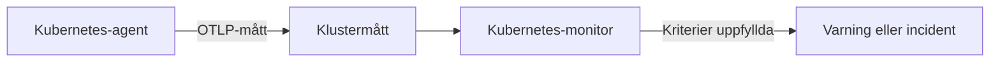

# Kubernetes-övervakning

En Kubernetes-monitor varnar på de mätvärden som OneUptimes Kubernetes-agent skickar från ett kluster: noder, poddar, containrar, arbetsbelastningar, autoskalare och kontrollplanet. Utgå från en färdig varningsmall, välj ett enskilt mätvärde eller skriv din egen fråga, och ange sedan den tröskel som öppnar en varning eller en incident.

:::cards
- [Installera agenten](/docs/monitor/kubernetes-agent): Ett Helm-kommando tar in klustret i OneUptime.
- [Skapa monitorn](#skapa-en-kubernetes-monitor): Välj klustret, sedan en mall, ett mätvärde eller en fråga.
- [Varningsmallar](#färdiga-varningsmallar): Sjutton färdiga varningar, från CrashLoopBackOff till etcd.
- [Kriterier](#övervakningskriterier): Statiska trösklar och avvikelseidentifiering.
:::

## Så fungerar det

Agenten skickar klustrets mätvärden till OneUptime över OTLP, vart och ett märkt med klustrets namn (`k8s.cluster.name`, chartets `clusterName`). De första data från ett nytt namn registrerar klustret under **Kubernetes**, och från och med då kan klustret väljas i en Kubernetes-monitor. Varje minut frågar monitorn efter de mätvärdena över sitt **Tidsintervall**, aggregerar dem och jämför resultatet med sina kriterier.

## Innan du börjar

- OneUptimes Kubernetes-agent körs i klustret. Se [Kubernetes-agent (Helm-installation)](/docs/monitor/kubernetes-agent); klustret visas under **Kubernetes** några minuter efter installationen.
- För kontrollplansmallarna (**etcd No Leader**, **API Server Request Saturation**, **Scheduler Backlog**): agentens insamling från kontrollplanet, `controlPlane.enabled`. Hanterade kluster (EKS, GKE, AKS) exponerar inte de här slutpunkterna, så där får de monitorerna aldrig några data.

## Skapa en Kubernetes-monitor

:::steps
### Starta en ny monitor

Gå till **Monitorer** och klicka på **Skapa monitor**. Välj **Kubernetes** under **Fler monitortyper** – eller skriv `k8s` i sökrutan.

### Välj klustret

Välj det i **Kubernetes-kluster**. Listan innehåller varje kluster som agenten har rapporterat från.

### Välj vad som ska övervakas

Använd en av de tre flikarna:

| Flik | Vad du väljer |
| --- | --- |
| **Quick Setup** | En [färdig varningsmall](#färdiga-varningsmallar). Den fyller i mätvärdet, omfattningen, tidsintervallet och kriterierna; du kan fortfarande ändra **Tidsintervall**. |
| **Custom Metric** | Ett mätvärde från [måttkatalogen](#måttkatalog), sedan dess **Resursomfattning**, filter, **Aggregering** (Genomsnitt, Maximum, Minimum, Summa eller Antal) och **Tidsintervall**. |
| **Avancerad** | **Resursomfattning**, filter och **Tidsintervall**, samt dina egna måttfrågor och formler under **Välj mått**, med ett livediagram över resultatet. |

### Ange kriterierna

Ange när monitorn byter status och när den öppnar en varning eller en incident – se [Övervakningskriterier](#övervakningskriterier). En mall har redan fyllt i dem: gå igenom trösklarna, allvarlighetsgraderna och jourpolicyerna.

### Spara monitorn

Slutför formuläret och spara. Monitorn visas under **Monitorer**, och dess status följer dina kriterier från den första utvärderingen.
:::

## Konfigurationsalternativ

### Resursomfattning och filter

**Resursomfattning** anger den nivå som mätvärdet utvärderas på och avgör vilka filter formuläret visar. Varje filter är valfritt.

| Omfattning | Övervakar | Filter |
| --- | --- | --- |
| Kluster | Hela klustret | — |
| Namnrymd | Resurser i en namnrymd | **Namnrymd** |
| Arbetsbelastning | En deployment, statefulset, daemonset, job eller cronjob | **Namnrymd**, **Arbetsbelastningsnamn** |
| Nod | En nod i klustret | **Nodnamn** |
| Podd | En podd | **Namnrymd**, **Pod-namn** |

### Tidsintervall

**Tidsintervall** är det fönster som måttfrågan täcker varje gång monitorn utvärderas, från **Past 1 Minute** upp till **Past 365 Days**. Korta fönster (1 till 15 minuter) passar för varningar; längre fönster jämnar ut brusiga mätvärden.

### Måttfrågor och formler

På fliken **Avancerad** anger varje fråga ett mätvärde, hur dess värden aggregeras och valfria attributfilter. En **formel** kombinerar frågor med aritmetik – mallarna för nodutnyttjande delar till exempel användningen med den allokerbara kapaciteten.

## Måttkatalog

Fliken **Custom Metric** erbjuder de här mätvärdena, grupperade efter resurstyp:

| Kategori | Mätvärden |
| --- | --- |
| Podd | Pod CPU Usage, Pod Memory Usage, Pod Phase (Code), Pod Filesystem Usage, Pod Memory Limit Utilization, Pod CPU Limit Utilization, Pod Network I/O (Cumulative, Both Directions) |
| Nod | Node CPU Usage, Node Allocatable CPU, Node Memory Usage, Node Filesystem Usage, Node Allocatable Memory, Node Ready Condition, Node Filesystem Available |
| Container | Container Restarts, Container CPU Limit, Container CPU Request, Container Memory Limit, Container Memory Request, Container Ready |
| Arbetsbelastning | Deployment Available Replicas, Deployment Desired Replicas, DaemonSet Misscheduled Nodes, DaemonSet Ready Nodes, StatefulSet Ready Replicas, Job Failed Pods, Job Successful Pods |
| HPA | HPA Current Replicas, HPA Desired Replicas, HPA Max Replicas, HPA Min Replicas |
| Kontrollplan | etcd Has Leader, API Server In-Flight Requests, Scheduler Pending Pods |

> [!NOTE]
> **Pod CPU Usage** och **Node CPU Usage** anges i kärnor, inte procent: `0.18` är 0,18 av en kärna. **Pod Phase (Code)** är en kod (1 Pending, 2 Running, 3 Succeeded, 4 Failed, 5 Unknown) – aggregera den med Maximum eller Minimum, aldrig Summa. Kontrollplansmått kommer bara när agentens insamling från kontrollplanet är påslagen.

## Övervakningskriterier

### Vad som utvärderas

De här monitorerna utvärderar alltid **Metric Value** – värdet av den konfigurerade måttfrågan eller formeln. Kriterieformuläret har ingen väljare för filtertyp; det visar **Mätvärde**, **Aggregering**, **Villkor** och **Threshold**.

### Aggregeringstyper

| Aggregering | Beskrivning |
| --- | --- |
| Genomsnitt | Genomsnittligt värde över tidsfönstret |
| Summa | Summan av alla värden |
| Maximum Value | Högsta värdet i tidsfönstret |
| Minimum Value | Lägsta värdet i tidsfönstret |
| All Values | Alla värden måste matcha kriteriet |
| Any Value | Minst ett värde måste matcha |

### Villkor

Statiska trösklar jämförs med det **Threshold** du anger: **Greater Than**, **Less Than**, **Greater Than Or Equal To**, **Less Than Or Equal To** och **Equal To**.

Avvikelseidentifiering mot en baslinje behöver ingen tröskel. Välj ett av de här villkoren så visar formuläret i stället **Känslighet** och **Baslinjefönster**:

| Villkor | Matchar när värdet |
| --- | --- |
| **Anomalously High** | Stiger över det förväntade intervallet |
| **Anomalously Low** | Sjunker under det förväntade intervallet |
| **Anomalous** | Lämnar det förväntade intervallet åt något håll |

Varje mätning jämförs med en baslinje för samma timme i veckan, byggd från **Baslinjefönster** (14 dagar som standard; 28, 60 eller 90 dagar). **Känslighet** anger hur brett det förväntade intervallet är: **Låg (4σ — endast grova avvikelser)**, **Medel (3σ — rekommenderas)**, som är standard, eller **Hög (2σ — brusigare, mycket stabila tjänster)**. Avvikelsevillkor stannar i ett "Learning"-läge och ger inga varningar förrän det finns minst det valda baslinjefönstret av måtthistorik.

**Om ingen data**, under **Fler fält**, avgör vad som händer när frågan inte returnerar något i fönstret: **Ignore** (standard) matchar inte, **Utlösare** behandlar tystnaden som problemet och **Treat As Zero** jämför en nolla. Tid då OneUptime själv inte tog emot data är aldrig saknade data: en kontroll vars fönster innehåller sådan tid väntar i stället, som [När OneUptime inte tar emot data](/docs/monitor/when-oneuptime-is-not-receiving) förklarar.

## Färdiga varningsmallar

Fliken **Quick Setup** listar de här mallarna, grupperade efter kategori. Varje mall fyller i två kriterier: ett som markerar monitorn som offline och öppnar en incident och en varning medan villkoret gäller, och ett som tar den online igen när villkoret upphör.

| Mall | Kategori | Utlöses när | Allvarlighetsgrad |
| --- | --- | --- | --- |
| CrashLoopBackOff Detection | Arbetsbelastning | En container har startats om mer än 5 gånger sedan dess podd skapades | Kritisk |
| Pod Stuck in Pending | Schemaläggning | Någon podd är i fasen Pending i varje mätning under ett fönster på 15 minuter | Warning |
| Node Not Ready | Nod | En nod rapporterar NotReady | Kritisk |
| High Node CPU Utilization | Nod | En nods genomsnittliga CPU-användning är över 90 % av dess allokerbara CPU | Warning |
| High Node Memory Utilization | Nod | En nods genomsnittliga minnesanvändning är över 85 % av dess allokerbara minne | Warning |
| Deployment Replica Mismatch | Arbetsbelastning | En deployment har färre tillgängliga repliker än önskat i 15 minuter | Warning |
| Job Failures | Arbetsbelastning | Ett job har misslyckade poddar | Warning |
| etcd No Leader | Kontrollplan | etcd har ingen vald ledare | Kritisk |
| API Server Request Saturation | Kontrollplan | API-servern håller 200 eller fler pågående begäranden under hela fönstret | Kritisk |
| Scheduler Backlog | Schemaläggning | Schemaläggarens kö av väntande poddar är inte tom på 5 minuter | Warning |
| High Node Disk Usage | Lagring | En nods filsystem är mer än 90 % fullt | Warning |
| DaemonSet Misscheduled Nodes | Arbetsbelastning | Ett DaemonSet kör poddar på noder som inte längre matchar dess nodselektor, affinitet eller toleranser | Warning |
| High Node CPU Request Commitment | Nod | En nods summerade CPU-förfrågningar från containrar överstiger 90 % av dess allokerbara CPU | Warning |
| High Node Memory Request Commitment | Nod | En nods summerade minnesförfrågningar från containrar överstiger 90 % av dess allokerbara minne | Warning |
| HPA Saturated at Max Replicas | Arbetsbelastning | En HPA kör på 90 % eller mer av sin `maxReplicas` | Kritisk |
| Pod Memory Saturating Container Limit | Arbetsbelastning | En podd använder mer än 90 % av sina containrars minnesgräns | Kritisk |
| Pod CPU Saturating Container Limit | Arbetsbelastning | En podd använder mer än 90 % av sina containrars CPU-gräns | Warning |

Mallar på mätvärden per objekt utvärderar varje nod, podd, deployment, job, DaemonSet eller HPA för sig, så att ett kluster med flera ohälsosamma poddar får en incident per podd i stället för en för hela klustret.

> [!NOTE]
> **CrashLoopBackOff Detection** läser containerns totala antal omstarter för dess nuvarande podd, inte en takt. En container som har fastnat i en kraschloop och sedan återhämtat sig håller varningen öppen tills dess podd ersätts.

### Fånga orsaker, inte bara symtom

Mallarna på nodnivå (High Node CPU Utilization, High Node Memory Utilization, Node Not Ready, Pod Stuck in Pending) utlöses i *slutet* av en kedja av resursutmattning, när klustret redan är försämrat. Tre mallar utlöses i *början* av den, där lösningen oftast finns:

- **Pod Memory Saturating Container Limit** och **Pod CPU Saturating Container Limit** fångar en arbetsbelastning som ligger an mot sina egna gränser. Att passera en minnesgräns ger en omedelbar OOMKill; att passera en CPU-gräns får kärnan att strypa podden, så att den blir långsammare utan att någonsin ge fel. Båda är den vanliga orsaken bakom CrashLoopBackOff och oförklarad latens.
- **HPA Saturated at Max Replicas** fångar en autoskalare utan marginal kvar. En arbetsbelastning vars gränser per podd är för låga stryps eller dödas, vilket blåser upp just det mätvärde som HPA:n skalar på – så autoskalaren fortsätter att lägga till repliker som alla saknar lika mycket, tills den når sitt tak. Att höja gränserna är lösningen; att höja `maxReplicas` gör det värre.

Slå på dem tillsammans i varje namnrymd som kör en autoskalad arbetsbelastning: kombinationen skiljer "behöver verkligen mer kapacitet" från "för lite resurser per podd".

> [!NOTE]
> De två mallarna för poddgränser delar poddens användning med **summan** av dess containrars gränser, så att poddar med sidecars mäts korrekt. Kubelets siffra för poddminne inkluderar sidcache som kan återvinnas, så en filtung arbetsbelastning kan ligga högt i minnesmallen utan att någonsin få OOMKill: läs det som "närmar sig gränsen", inte "på väg att dödas".

## Felsökning

:::details Klustret finns inte i listan Kubernetes-kluster
Kluster registrerar sig själva utifrån agentens data, under det `clusterName` som agenten installerades med. Kontrollera att agentens poddar körs och att klustret finns under **Produkter → Infrastruktur → Kubernetes → Alla kluster**. [Kubernetes-agent (Helm-installation)](/docs/monitor/kubernetes-agent) beskriver installationen och vad du ska kontrollera när inga data kommer.
:::

:::details En kontrollplansmall utlöses aldrig
**etcd No Leader**, **API Server Request Saturation** och **Scheduler Backlog** läser mätvärden som bara agentens insamling från kontrollplanet hämtar. Slå på `controlPlane.enabled` i agentens Helm-värden; den är avstängd som standard. Hanterade kluster (EKS, GKE, AKS) exponerar inte de här slutpunkterna, så där får de här monitorerna aldrig några data.
:::

:::details En CPU-tröskel utlöses aldrig
**Pod CPU Usage** och **Node CPU Usage** anges i kärnor, inte procent, så en tröskel på `80` betyder 80 kärnor. Ange tröskeln i kärnor, eller utgå från **High Node CPU Utilization** eller **Pod CPU Saturating Container Limit**, som jämför en procentandel.
:::

:::details CrashLoopBackOff Detection förblir öppen efter att podden återhämtat sig
Mallen läser containerns totala antal omstarter för dess nuvarande podd, så antalet går inte tillbaka när det väl har passerat 5. Varningen löses när podden ersätts, till exempel genom en ny driftsättning, en vräkning eller en tömning av noden.
:::

## Nästa steg

:::cards
- [Kubernetes-agent (Helm-installation)](/docs/monitor/kubernetes-agent): Installera, uppgradera och finjustera agenten med Helm.
- [Kubernetes-agent](/docs/telemetry/kubernetes-agent): Namnrymdsfilter, kontrollplansmått, filter för loggallvarlighet och AI-agenten.
- [Metrikövervakning](/docs/monitor/metrics-monitor): Varna på vilket mätvärde som helst, även agentens anpassade mått och eBPF-mått.
- [Incident- och varningsmallar](/docs/monitor/incident-alert-templating): Lägg in podden eller noden som passerar gränsen i incidenttitlar.
:::
