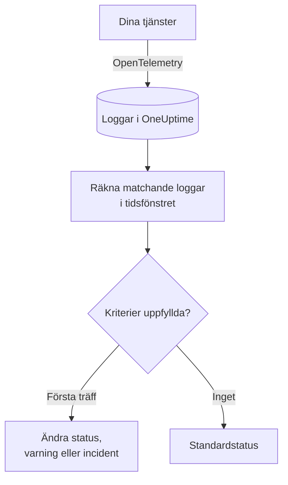
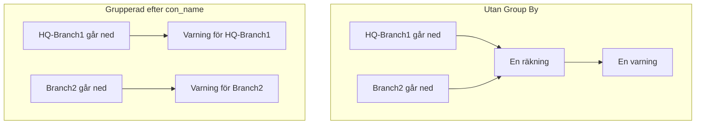

# Loggövervakning

En loggmonitor räknar inom ett tidsfönster de loggar som dina tjänster skickar till OneUptime och som matchar dina filter (text, allvarlighetsgrad, tjänst, attribut). När antalet uppfyller dina kriterier ändrar den monitorns status, skapar en varning eller deklarerar en incident. Använd den för att upptäcka en ökning av fel, ett visst felmeddelande eller en tjänst som har slutat logga.

:::cards
- [Skapa monitorn](#skapa-en-loggmonitor): Välj vilka loggar som räknas och när du ska varnas.
- [Så utvärderas den](#så-utvärderas-den): Tidsfönstret, räkningen och cykeln på en minut.
- [Kriterier](#kriterier): Tröskelvärden, avvikelsedetektering och standardvärdena.
- [Varningar per grupp](#varningar-per-grupp-group-by): En varning per tunnel, användare eller gränssnitt.
:::

## Så fungerar det



Varje minut räknar OneUptime de loggar som matchar monitorns filter och har kommit in inom dess tidsfönster. Antalet jämförs med monitorns kriterier uppifrån och ned, och det första kriteriet som matchar avgör vad som händer. När inget matchar går monitorn tillbaka till sin standardstatus.

## Innan du börjar

- Dina tjänster skickar loggar till OneUptime via OpenTelemetry (eller en annan loggkälla som OneUptime tar emot). Se [OpenTelemetry](/docs/telemetry/open-telemetry).
- För att filtrera eller gruppera på ett värde inne i loggraden, som namnet på en tunnel eller en användare, gör du först om det till ett attribut med en [loggpipeline](/docs/telemetry/log-pipelines).

## Skapa en loggmonitor

:::steps
### Börja en ny monitor

Gå till **Monitorer** och klicka på **Skapa monitor**.

### Välj Logs

Under **Monitortyp** klickar du på **Fler monitortyper** och väljer **Loggar** under **Telemetri**, eller skriver `logs` i sökrutan. Ange ett **Namn** och klicka sedan på **Nästa**.

### Välj vilka loggar som ska räknas

I **Logg-monitorkonfiguration** anger du **Övervakningsloggar som innehåller denna text**, **Övervakningsloggar för (tid)** och **Loggens allvarlighetsgrad**. Ett filter som du lämnar tomt matchar alla loggar. **Förhandsgranskning av loggar** under filtren visar de loggar som de matchar just nu.

### Begränsa dem (valfritt)

Öppna **Fler fält** för att filtrera efter telemetritjänst, infrastrukturentitet eller attribut. Vill du ha en varning per tunnel, användare eller gränssnitt i stället för en för hela monitorn lägger du till attributet under **Group by Attributes** (se [Varningar per grupp](#varningar-per-grupp-group-by)).

### Ange kriterierna

Kortet **Monitorkriterier** börjar med två kriterier: offline, med en incident, när inga loggar matchar; online när minst en gör det. Ändra dem till det du vill varnas om (se [Kriterier](#kriterier)).

### Skapa monitorn

Klicka på **Skapa monitor**. Monitorn öppnas på sin sida **Översikt**, och dess första utvärdering körs inom en minut.
:::

## Vad den frågar efter

| Fält | Vad det matchar | Standard |
| --- | --- | --- |
| **Övervakningsloggar som innehåller denna text** | Loggar vars brödtext innehåller denna text, utan skillnad på versaler och gemener. | Tomt: alla loggar |
| **Övervakningsloggar för (tid)** | Loggar från de senaste 5 sekunderna upp till de senaste 24 timmarna. | **Senaste 1 minuten** |
| **Loggens allvarlighetsgrad** | Loggar med någon av de valda allvarlighetsgraderna. | Tomt: alla allvarlighetsgrader |
| **Group by Attributes** | Inget filter: räknar varje kombination av dessa attributs värden för sig. | Tomt: en räkning |
| **Filtrera efter telemetritjänst** (under **Fler fält**) | Loggar från någon av de valda tjänsterna. | Tomt: alla tjänster |
| **Filter by Infrastructure Entity** (under **Fler fält**) | Loggar från någon av de valda värdarna, poddarna, containrarna och andra entiteterna. | Tomt: alla entiteter |
| **Filtrera efter attribut** (under **Fler fält**) | Loggar vars attribut uppfyller alla villkor. Varje villkor har en egen operator, som "är lika med" eller "innehåller". | Tomt: inga villkor |

Alla filter som du anger måste matcha för att en logg ska räknas.

### Loggarnas allvarlighetsgrad

Varje logg lagras med en av sju allvarlighetsgrader. För loggar från OpenTelemetry kommer den från loggens allvarlighetsnummer, så välj efter allvarlighetsgrad och inte efter texten som din loggare skrev ut:

| Allvarlighetsgrad | OpenTelemetrys allvarlighetsnummer |
| --- | --- |
| **Spår** | 1–4 |
| **Debug** | 5–8 |
| **Information** | 9–12 |
| **Warning** | 13–16 |
| **Fel** | 17–20 |
| **Fatal** | 21–24 |
| **Ospecificerad** | Allt annat |

## Så utvärderas den

- **Varje minut.** En loggmonitor kontrolleras inte av sonder, så den har inget intervall att ange och ingen sida **Sonder och intervall**.
- **Ett tal per utvärdering.** Monitorn räknar de loggar som matchar alla filter och har kommit in inom **Övervakningsloggar för (tid)** före utvärderingen. Med **Senaste 5 minuterna** ser varje utvärdering fem minuter bakåt, så fönstren för utvärderingar i följd överlappar.
- **Inga loggar är ett antal på 0.** En tjänst som slutar logga ger 0, och det är vad standardkriteriet för offline letar efter.
- **OneUptimes eget avbrott är inte tystnad.** Så länge tidsfönstret innehåller tid då OneUptime självt inte tog emot data (det startade om, uppgraderades eller arbetade ikapp en eftersläpning) väntar kontrollen: statusen ändras inte, och ingen incident eller varning öppnas eller löses. Se [När OneUptime inte tar emot data](/docs/monitor/when-oneuptime-is-not-receiving).
- **Kriterier uppifrån och ned.** Det första kriteriet som matchar avgör, så lägg det allvarligaste överst. En grupperad monitor fungerar annorlunda: den kontrollerar alla kriterier för varje grupp (se [Utvärderingen av kriterier skiljer sig](#utvärderingen-av-kriterier-skiljer-sig)).

Varje statusändring registreras med sin orsak på monitorns **Statustidslinje**.

## Kriterier

En loggmonitors kriterier har en enda **Filtertyp**: **Log Count**, antalet loggar som matchade i fönstret. Välj ett **Filtervillkor** och, för ett tröskelvillkor, ett **Värde**.

| Filtervillkor | Matchar när antalet loggar är… |
| --- | --- |
| **Greater Than** | över värdet |
| **Greater Than Or Equal To** | lika med värdet eller högre |
| **Less Than** | under värdet |
| **Less Than Or Equal To** | lika med värdet eller lägre |
| **Equal To** | exakt värdet |
| **Anomalously High** | över det förväntade intervallet för den här timmen i veckan |
| **Anomalously Low** | under det intervallet |
| **Anomalous** | utanför det intervallet, åt vilket håll som helst |

Avvikelsevillkoren har inget **Värde**. Välj en **Känslighet** (Low, Medium, som är standard, eller High) och ett **Baslinjefönster** på 14 (standard), 28, 60 eller 90 dagar. OneUptime gör om antalet till en takt per minut och jämför den med samma timme i veckan över det fönstret. Baslinjen omfattar bara monitorns tjänster och allvarlighetsgrader: dess text- och attributfilter ingår inte. Tills den timmen i veckan har tillräcklig historik lär sig kriteriet fortfarande och utlöses inte.

En ny loggmonitor börjar med dessa kriterier:

| Kriterium | Filter | Effekt |
| --- | --- | --- |
| Check if … is offline | **Log Count** **Equal To** `0` | Markerar monitorn som offline och deklarerar en incident, som löses automatiskt |
| Check if … is online | **Log Count** **Greater Than** `0` | Markerar monitorn som online |

> [!TIP]
> För att varnas om fel i stället för om tystnad ställer du in **Loggens allvarlighetsgrad** på **Fel** och ändrar offline-kriteriet till **Log Count** **Greater Than** det antal fel som du godtar i fönstret.

## Genomgånget exempel: en ökning av fel

Du vill ha en incident när checkout-tjänsten loggar fler än 50 fel på fem minuter:

- **Loggens allvarlighetsgrad**: **Fel**
- **Övervakningsloggar för (tid)**: **Senaste 5 minuterna**
- **Filtrera efter telemetritjänst**: `checkout`
- Kriterium 1: **Log Count** **Greater Than** `50`: markera monitorn som offline och deklarera en incident
- Kriterium 2: **Log Count** **Less Than Or Equal To** `50`: markera monitorn som online

Fyra utvärderingar i följd:

| Tid | Felloggar de senaste 5 minuterna | Kriterium som matchar | Vad som händer |
| --- | --- | --- | --- |
| 10:00 | 12 | 2 | Monitorn är online. |
| 10:01 | 64 | 1 | Monitorn går offline och en incident deklareras. |
| 10:02 | 81 | 1 | Förblir offline. Incidenten är redan öppen, så ingen ny deklareras. |
| 10:06 | 9 | 2 | Monitorn är online igen, och incidenten löser sig själv eftersom **Lös incident automatiskt** är aktiverat. |

Eftersom fönstren överlappar håller en enda skur av fel antalet högt i upp till fem minuter efter att den är slut. Använd ett kortare fönster för en monitor som ska återhämta sig snabbare.

## Varningar per grupp (Group By)

**Group by Attributes** delar upp en loggmonitors räkning i en räkning per distinkt kombination av attributvärden (en per IPsec-tunnel, per VPN-användare, per brandväggsgränssnitt) och utvärderar kriterierna för varje grupp för sig. Det är loggarnas motsvarighet till en metrikmonitors [Group By](/docs/monitor/metrics-monitor#varningar-per-serie-group-by).

### En varning per grupp

Utan Group By är en monitor som håller koll på avslutade IPsec-tunnlar en enda räkning för hela monitorn och ger **en varning för hela monitorn**. Så länge den varningen är öppen ger det inget nytt att ytterligare en tunnel går ned: monitorn varnar redan.

Med Group By på tunnelnamnet öppnar avslutningen av tunneln `HQ-Branch1` sin egen varning, och avslutningen av tunneln `Branch2` tio minuter senare öppnar en **andra, separat varning** bredvid.



### Oberoende lösning

Varje grupps varning eller incident löses för sig. Så snart en grupp inte längre uppfyller kriterierna (`HQ-Branch1` loggar inga fler avslutningar inom tidsfönstret) löses dess varning, medan varningen för `Branch2` förblir öppen tills även `Branch2` slutar. Att en grupp återhämtar sig stänger aldrig en annan grupps varning.

En loggmonitor ser händelser, inte tillstånd: en grupps varning löses så snart gruppen inte har loggat något som uppfyller kriterierna under ett helt tidsfönster, oavsett om tunneln är uppe igen eller inte.

### Exempel: en varning per Sophos-IPsec-tunnel

Det här förutsätter att brandväggens syslog-rader delas upp i attribut med en [Key=Value-parser](/docs/telemetry/log-pipelines#keyvalue-parser) utan målprefix, så att tunnelnamnet är attributet `con_name`:

```text
log_component="IPSec" con_name="HQ-Branch1" status="Terminated" message="IPSec Connection HQ-Branch1 between 10.171.4.117 and 10.171.4.118 for Child HQ-Branch1 terminated."
```

:::steps
1. Skapa en monitor av typen **Loggar**.
2. Ställ in **Övervakningsloggar som innehåller denna text** på `terminated` och **Övervakningsloggar för (tid)** på **Senaste 5 minuterna**.
3. Under **Fler fält** lägger du till attributfiltret `log_component` = `IPSec`.
4. Under **Group by Attributes** lägger du till `con_name`.
5. Lägg till ett kriterium med filtret **Log Count** **Greater Than** `0` som skapar en varning eller en incident med titeln `IPsec tunnel {{con_name}} terminated`.
:::

Varje tunnel som loggar en avslutning får nu sin egen varning (`IPsec tunnel HQ-Branch1 terminated`, `IPsec tunnel Branch2 terminated`), och var och en löses för sig.

### Gruppvärden i titlar och beskrivningar

Värdet för varje Group By-attribut är en [mallvariabel](/docs/monitor/incident-alert-templating) i titeln, beskrivningen och åtgärdsanteckningarna för varningen eller incidenten, precis som etiketterna på en metrikserie: gruppering efter `con_name` ger dig `{{con_name}}`. En nyckel med punkter läses som en sökväg, så `sophos.con_name` blir `{{sophos.con_name}}`. När titeln inte redan nämner gruppen läggs gruppen till i den (`IPsec tunnel terminated - Con Name: HQ-Branch1`), och `{{seriesResourceSuffix}}` och `{{seriesResourceSummary}}` fungerar som på metrikmonitorer.

### Så räknas grupper

- Upp till 10 attribut. Varje distinkt kombination av deras värden är en grupp.
- En logg som saknar ett Group By-attribut räknas med ett **tomt värde** för det, så loggar utan attributet bildar en egen grupp, vars varning inte nämner något värde för det. Kommer alla varningar utan gruppvärde kontrollerar du attributets nyckel: en loggpipeline med målprefix lagrar `con_name` som `sophos.con_name`.
- Gruppvärden på över 256 tecken kortas till 256.
- Högst **100 grupper** utvärderas per kontroll: de 100 med flest loggar. Matchar fler grupper hoppas resten över i den kontrollen och en varning loggas; begränsa monitorns filter för att täcka dem.

### Utvärderingen av kriterier skiljer sig

- **Alla kriterier utvärderas**, som på en grupperad metrikmonitor, så olika grupper kan uppfylla olika kriterier samtidigt. En grupp som uppfyller två kriterier får ändå bara en varning, från det första; sortera därför kriterierna från allvarligast till minst allvarligt.
- **En grupp finns bara om den har loggat något i tidsfönstret.** Kriterier som **Equal To 0** och **Less Than** utlöses därför bara för grupper som har loggat minst en gång; för att varnas när loggar slutar komma helt använder du en monitor utan Group By.
- **Avvikelsedetektering** (**Anomalously High**, **Anomalously Low**, **Anomalous**) utvärderas inte per grupp (dess baslinje omfattar hela monitorn), så de filtren matchar aldrig på en grupperad monitor.
- Monitorns status följer det första kriterium som någon grupp uppfyller. När ingen grupp uppfyller något kriterium går monitorn tillbaka till sin standardstatus.

## Felsökning

:::details Monitorn är offline, men min tjänst loggar
Antalet var 0, så filtren matchar inga av de loggar som tjänsten skickar. Öppna monitorns sida **Kriterier** (under **Konfiguration**) och klicka på **Edit Monitoring Criteria**: **Förhandsgranskning av loggar** visar vad filtren väljer ut just nu. De vanligaste orsakerna är en allvarlighetsgrad som valts efter texten som loggaren skriver ut i stället för efter dess allvarlighetsnummer (se [Loggarnas allvarlighetsgrad](#loggarnas-allvarlighetsgrad)), ett tjänst- eller attributfilter som inte matchar och ett tidsfönster som är kortare än tiden mellan tjänstens loggar.
:::

:::details Det var en ökning, men ingenting varnade
Kriterierna kontrolleras uppifrån och ned, och den första träffen avgör. Ett brett kriterium ovanför det du väntade dig, som **Log Count** **Greater Than** `0`, matchar först och stoppar resten. Lägg det allvarligaste kriteriet överst.
:::

:::details Ett avvikelsekriterium utlöses aldrig
Det lär sig fortfarande: timmen i veckan som det jämför med har ännu inte tillräcklig historik. På en monitor med **Group by Attributes** matchar avvikelsevillkor aldrig; använd ett tröskelvärde där.
:::

:::details Gruppvarningar kommer utan gruppvärde
Loggar som saknar Group By-attributet räknas med ett tomt värde. Kontrollera nyckelns exakta namn i loggutforskaren: en loggpipeline med målprefix lagrar `con_name` som `sophos.con_name`.
:::

## Nästa steg

:::cards
- [Loggpipelines](/docs/telemetry/log-pipelines): Dela upp loggrader i attribut som du kan filtrera och gruppera på.
- [Incident- och varningsmallar](/docs/monitor/incident-alert-templating): Lägg in gruppvärden och antal i titlar och beskrivningar.
- [Metrikövervakning](/docs/monitor/metrics-monitor): Varnas om ett mätvärde, per värd eller per container.
- [Spårningsövervakning](/docs/monitor/traces-monitor): Varnas på samma sätt om misslyckade spans.
:::
