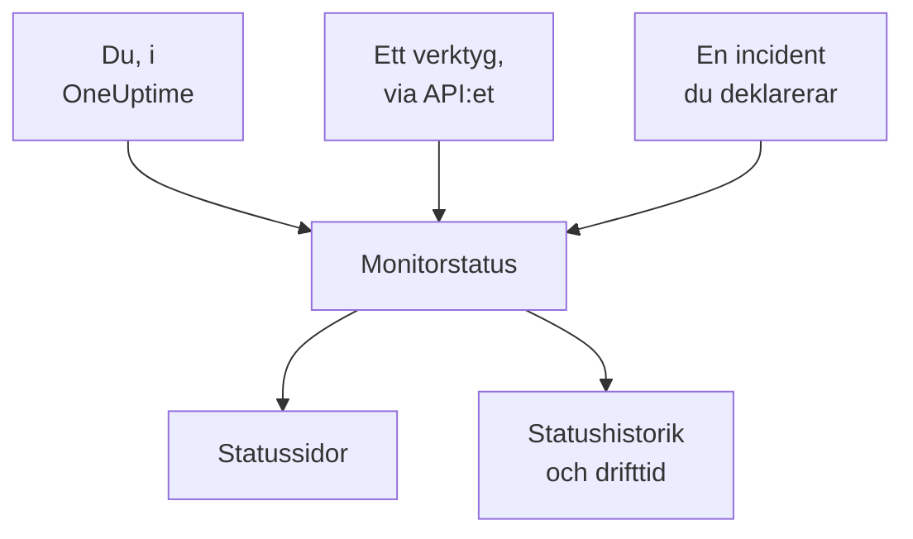

# Manuell övervakning

En manuell monitor har inga automatiska kontroller: dess status är det du ställer in, i instrumentpanelen eller via API:et. Använd den för att representera något som OneUptime inte kan kontrollera själv — ett beroende hos en tredje part, ett fysiskt system, en affärsprocess — på dina statussidor och i dina incidenter.

:::cards
- [Skapa en](#skapa-en-manuell-monitor): Ett steg i instrumentpanelen.
- [Ändra dess status](#uppdatera-status): I instrumentpanelen, eller från dina egna verktyg via API:et.
- [Incidenter och larm](#incidenter-och-larm): Deklarera en incident och ställ in statusen i samma steg.
:::

## När du ska använda en manuell monitor

| Användningsfall | Beskrivning |
| --- | --- |
| Tredjepartstjänster | Följ statusen för externa tjänster som du är beroende av men inte kan övervaka direkt. |
| Fysisk infrastruktur | Representera hårdvara eller fysiska system utan nätverksövervakning. |
| Affärsprocesser | Följ icke-tekniska processer som påverkar tjänstens status. |
| API-styrd status | Låt dina egna verktyg ställa in statusen via OneUptimes API. |
| Platshållare på statussidor | Visa komponenter på din statussida som hanteras utanför OneUptime. |

En leverantör som publicerar en statussida behöver ingen: en [monitor för extern statussida](/docs/monitor/external-status-page-monitor) följer den sidan åt dig.

## Så fungerar det

En manuell monitor har inget övervakningsintervall, inga sonder och inga kriterier. Dess status förblir som du ställde in den tills du, ett verktyg via API:et eller en incident du deklarerar ändrar den — och den nya statusen visas överallt där monitorn visas.



Varje ändring är en post på monitorns **Statustidslinje**, så dess drifttid och statushistorik sparas som för vilken annan monitor som helst. En manuell monitor är inte en aktiv monitor, så på OneUptime Cloud lägger den inte till något på din faktura.

## Skapa en manuell monitor

:::steps
### Börja en ny monitor

Gå till **Monitorer** och klicka på **Skapa monitor**.

### Välj Manual

Klicka på **Fler monitortyper** under **Monitortyp** och välj **Manual** under **Annat**.

### Namnge den och skapa den

Ange ett **Namn** — och en **Beskrivning** under **Fler fält**, om du vill — och klicka sedan på **Skapa monitor**. En manuell monitor behöver inget mer, så den skapas från det här första steget.
:::

## Uppdatera status

### I instrumentpanelen

:::steps
1. Öppna monitorn och klicka på **Statustidslinje** i dess sidomeny.
2. Klicka på **Skapa Monitor Status Händelse**.
3. Välj **Monitorstatus**. **Börjar den** är nu; ange en tidigare tidpunkt om ändringen skedde tidigare.
4. Klicka på **Skapa Monitor Status Händelse**. Den nya statusen visas direkt på monitorn och på varje statussida som listar den.
:::

### Via API:et

Skicka den nya statusen som en statushändelse för monitorn, med en [API-nyckel](/docs/api-reference/api-reference) från ditt projekt i huvudet `ApiKey`:

```bash
curl -X POST https://oneuptime.com/api/monitor-status-timeline \
  -H "ApiKey: $ONEUPTIME_API_KEY" \
  -H "Content-Type: application/json" \
  -d '{"data": {"monitorId": "<monitor id>", "monitorStatusId": "<monitor status id>"}}'
```

- `monitorId` är monitorns ID: klicka på raden **ID** på dess sida för att kopiera det.
- `monitorStatusId` är statusen som ska ställas in: välj **Visa ID** på den statusens rad under **Monitorer → Inställningar → Monitorstatus**.
- `startsAt` är valfritt. Utelämnas det börjar ändringen nu.
- På en egen installation skickar du begäran till din egen värd i stället för `oneuptime.com`.

Att skicka den status som monitorn redan har avvisas med `Monitor Status cannot be same as previous status.` och registrerar ingenting, så ett verktyg som rapporterar vid varje körning kan ignorera det svaret.

## Incidenter och larm

En manuell monitor väljs som vilken annan monitor som helst överallt där monitorer väljs:

- Deklarera en incident och välj monitorn under **Monitorer**. Med **Ändra övervakningsstatus till** ställer deklarationen även in monitorns status, och när incidenten löses sätts monitorn tillbaka till fungerande, om inte en annan incident på den fortfarande är öppen. Se [Deklarera en incident](/docs/incidents/declaring-incidents#steg-2-berörda-resurser).
- Skapa ett larm om den, för ett problem som ditt team ska åtgärda utan att berätta det för dina kunder.
- Lägg till den på en statussida, för att visa kunderna ett beroende som du bevakar för hand.

## Nästa steg

:::cards
- [Skapa en monitor](/docs/monitor/create-monitor): De monitortyper som kontrollerar saker åt dig.
- [Övervakning av extern statussida](/docs/monitor/external-status-page-monitor): Följ i stället en leverantörs statussida automatiskt.
- [Statussidor – Översikt](/docs/status-pages/index): Visa monitorns status för dina kunder.
:::
