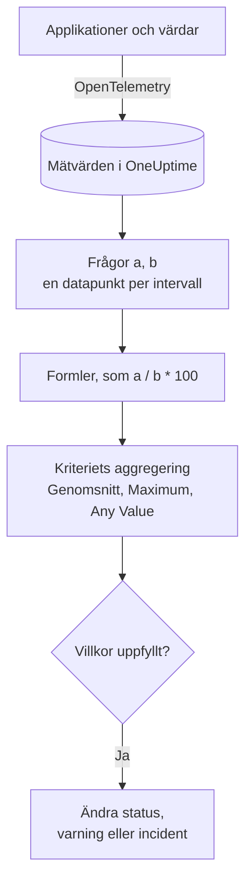

# Metrikövervakning

En metrikmonitor frågar efter de mätvärden som dina applikationer och din infrastruktur skickar till OneUptime, kombinerar dem med formler när du behöver ett förhållande eller en summa, och jämför resultatet med dina kriterier över ett rullande tidsintervall. Använd den för förfrågningstakt, felandelar, ködjup, CPU, minne och disk (vilken numerisk serie som helst), med en varning per värd eller per container när du grupperar den.

:::cards
- [Skapa monitorn](#skapa-en-metrikmonitor): Frågor, formler, ett tidsintervall och kriterier.
- [Så utvärderas den](#så-utvärderas-den): Datapunkter, formler och kriteriernas aggregering.
- [Genomgånget exempel](#genomgånget-exempel-en-kö-som-växer): Samma data under varje aggregering.
- [Varningar per serie](#varningar-per-serie-group-by): En varning per värd, container eller monteringspunkt.
:::

## Så fungerar det

Varje minut kör OneUptime var och en av monitorns metrikfrågor över dess tidsintervall. En fråga returnerar en datapunkt per tidsintervall, och formler kombinerar frågorna intervall för intervall. Varje kriterium reducerar sedan datapunkterna från den fråga eller formel som det kontrollerar (till deras genomsnitt, deras maximum eller ett test av varje punkt) och jämför resultatet med sitt tröskelvärde.

## Innan du börjar

- Dina applikationer eller din infrastruktur skickar mätvärden till OneUptime via OpenTelemetry. Se [OpenTelemetry](/docs/telemetry/open-telemetry).
- Känn till mätvärdets namn och de attribut som du vill filtrera eller gruppera på. Listorna **Mätvärde** och **Group by** erbjuder bara namn och attribut som OneUptime har tagit emot.

## Skapa en metrikmonitor

:::steps
### Börja en ny monitor

Gå till **Monitorer** och klicka på **Skapa monitor**.

### Välj Metrics

Under **Monitortyp** klickar du på **Fler monitortyper** och väljer **Mätvärden** under **Telemetri**, eller skriver `metrics` i sökrutan. Ange ett **Namn** och klicka sedan på **Nästa**.

### Välj tidsintervallet

I **Mätvärdesmonitorkonfiguration** väljer du ett **Tidsintervall**: hur långt bakåt varje utvärdering ser. Det börjar på **Past 1 Minute**.

### Lägg till metrikfrågorna

Under **Välj mått** väljer du ett **Mätvärde** och hur det ska aggregeras med **Aggregate by**. Öppna **Filters & grouping** för att filtrera efter attribut eller gruppera med **Group by**. Klicka på **Lägg till mätvärde** för ännu en fråga, eller på **Lägg till formel** för att kombinera dem. Diagrammet under frågorna förhandsgranskar tidsintervallet, så att du ser de värden som kriterierna kommer att kontrollera.

### Ange kriterierna

I **Monitorkriterier** väljer varje kriterium vilket **Mätvärde** som ska kontrolleras (en fråga eller en formel), sin **Aggregering**, ett **Villkor** och ett **Threshold**. Se [Kriterier](#kriterier) för de kriterier som en ny monitor börjar med.

### Skapa monitorn

Klicka på **Skapa monitor**. Monitorn öppnas på sin sida **Översikt**, och dess första utvärdering körs inom en minut.
:::

## Vad den frågar efter

### Metrikfrågor

| Fält | Vad det gör | Standard |
| --- | --- | --- |
| **Mätvärde** | Det mätvärde som frågas efter. | Obligatoriskt |
| **Aggregate by** | Hur värdena i varje tidsintervall kombineras till en datapunkt: Genomsn., Summa, Min, Max, Antal eller en percentil (P50, P75, P90, P95 eller P99). | Genomsn. |
| **Filter by attributes** (under **Filters & grouping**) | Bara serier vars attribut uppfyller dessa villkor. | Inget filter |
| **Group by** (under **Filters & grouping**) | En serie per unikt värde av dessa attribut (se [Varningar per serie](#varningar-per-serie-group-by)). | En serie |

Varje fråga och formel får en variabel (`a`, `b`, `c` och så vidare) i den ordning du lägger till dem.

### Formler

En formel kombinerar frågevariabler med `+`, `-`, `*`, `/`, `%`, `^` och parenteser, intervall för intervall. Du kan skriva variablerna med eller utan ett inledande `$`:

- `a / b * 100`: den andel av `b` som `a` utgör, i procent
- `a + b`: två mätvärden adderade
- `a - b`: skillnaden mellan dem

### Rullande tidsfönster

**Tidsintervall** anger hur långt bakåt varje utvärdering ser: **Past 1 Minute**, **Past 5 Minutes**, **Past 10 Minutes**, **Past 15 Minutes**, **Past 30 Minutes**, **Past 1 Hour**, **Past 2 Hours**, **Past 3 Hours**, **Past 6 Hours**, **Past 12 Hours**, **Past 1 Day**, **Past 2 Days**, **Past 3 Days**, **Past 7 Days**, **Past 14 Days**, **Past 30 Days**, **Past 60 Days**, **Past 90 Days**, **Past 180 Days** eller **Past 365 Days**.

Ju längre intervallet är, desto bredare är varje tidsintervall, så en datapunkt står för mer tid:

| Tidsintervall | En datapunkt per |
| --- | --- |
| Past 1 Minute till Past 3 Hours | minut |
| Past 6 Hours, Past 12 Hours | 5 minuter |
| Past 1 Day | 15 minuter |
| Past 2 Days, Past 3 Days | 30 minuter |
| Past 7 Days | timme |
| Past 14 Days, Past 30 Days | dag |
| Past 60 Days till Past 180 Days | vecka |
| Past 365 Days | månad |

## Så utvärderas den

- **Varje minut.** En metrikmonitor kontrolleras inte av sonder, så den har inget intervall att ange och ingen sida **Sonder och intervall**.
- **Först frågor, sedan formler.** Varje fråga returnerar en datapunkt per tidsintervall i tidsintervallet, med sin **Aggregate by**. Formler räknas ut för varje intervall från frågornas datapunkter.
- **Sedan kriteriets aggregering.** Varje kriterium reducerar datapunkterna för sitt **Mätvärde** till det som det jämför med tröskelvärdet:

| Aggregering | Villkoret kontrolleras mot… |
| --- | --- |
| Genomsnitt | genomsnittet av datapunkterna |
| Summa | summan av datapunkterna |
| Maximum Value | den högsta datapunkten |
| Minimum Value | den lägsta datapunkten |
| All Values | varje datapunkt: alla måste uppfylla villkoret |
| Any Value | varje datapunkt: det räcker att en av dem uppfyller villkoret |

- **Kriterier uppifrån och ned.** På en monitor utan Group By avgör det första kriteriet som matchar, så lägg det allvarligaste överst. En grupperad monitor kontrollerar alla kriterier för varje serie (se [Utvärderingen av kriterier skiljer sig](#utvärderingen-av-kriterier-skiljer-sig)).
- **Ingen data är inte noll.** När frågan inte returnerar några datapunkter i tidsintervallet gör ett kriterium det som dess inställning **Om ingen data** säger, under **Fler fält**: **Ignore** (standard: kriteriet matchar inte), **Treat As Zero** eller **Utlösare**.
- **OneUptimes eget avbrott är inte tystnad.** Så länge tidsintervallet innehåller tid då OneUptime självt inte tog emot data (det startade om, uppgraderades eller arbetade ikapp en eftersläpning) väntar kontrollen: statusen ändras inte, och ingen incident eller varning öppnas eller löses, oavsett vad **Om ingen data** säger. Se [När OneUptime inte tar emot data](/docs/monitor/when-oneuptime-is-not-receiving).

## Kriterier

Dessa monitorer utvärderar alltid **Metric Value**: det aggregerade värdet av den konfigurerade metrikfrågan eller formeln. Kriterieformuläret har ingen väljare för filtertyp; det visar **Mätvärde**, **Aggregering**, **Villkor** och **Threshold**. När mätvärdet har en enhet väljer du tröskelvärdets enhet bredvid det.

| Villkor | Matchar när värdet är… |
| --- | --- |
| **Greater Than** | över tröskelvärdet |
| **Greater Than Or Equal To** | lika med tröskelvärdet eller högre |
| **Less Than** | under tröskelvärdet |
| **Less Than Or Equal To** | lika med tröskelvärdet eller lägre |
| **Equal To** | exakt tröskelvärdet |
| **Anomalously High** | över det förväntade intervallet för den här timmen i veckan |
| **Anomalously Low** | under det intervallet |
| **Anomalous** | utanför det intervallet, åt vilket håll som helst |

Avvikelsevillkoren har inget tröskelvärde. Formuläret visar i stället **Känslighet** (Low, Medium, som är standard, eller High) och **Baslinjefönster** (14 dagar, som är standard, 28, 60 eller 90), och jämför varje datapunkt med baslinjen för samma timme i veckan, byggd från det fönstret. Tills den timmen i veckan har tillräcklig historik lär sig kriteriet fortfarande och ger inga varningar.

En ny metrikmonitor börjar med två kriterier på sin första fråga, båda med aggregeringen **Any Value**:

| Kriterium | Villkor | Effekt |
| --- | --- | --- |
| Check if … is offline | **Equal To** `0` | Markerar monitorn som offline och deklarerar en incident, som löses automatiskt |
| Check if … is online | **Greater Than** `0` | Markerar monitorn som online |

> [!NOTE]
> Offline-kriteriet utlöses av ett rapporterat värde på 0, inte av tystnad. För att varnas när ett mätvärde slutar komma ställer du in dess **Om ingen data** på **Utlösare**.

## Genomgånget exempel: en kö som växer

Du vill ha en incident när checkout-kön förblir djup. Fråga `a` är mätaren `checkout.queue.depth`, med **Aggregate by** Max, och **Tidsintervall** är **Past 5 Minutes**. En utvärdering ser dessa fem datapunkter på en minut vardera:

| Minut | 10:01 | 10:02 | 10:03 | 10:04 | 10:05 |
| --- | --- | --- | --- | --- | --- |
| `a` | 640 | 980 | 1 500 | 1 620 | 1 100 |

Ett kriterium med **Mätvärde** `a`, **Villkor** **Greater Than** och **Threshold** `1000` ger ett olika svar för varje **Aggregering**:

| Aggregering | Jämfört med 1 000 | Matchar? |
| --- | --- | --- |
| Genomsnitt | 1 168 | Ja |
| Summa | 5 840 | Ja |
| Maximum Value | 1 620 | Ja |
| Minimum Value | 640 | Nej |
| All Values | 640, 980, 1 500, 1 620, 1 100 | Nej: två punkter är inte över 1 000 |
| Any Value | 640, 980, 1 500, 1 620, 1 100 | Ja: 1 500 är det |

**Genomsnitt** varnar om en ihållande eftersläpning och bortser från en enstaka djup minut; **All Values** väntar tills varje minut i intervallet är djup; **Any Value** varnar vid den första djupa minuten.

## Varningar per serie (Group By)

**Group by** på en metrikfråga delar upp frågan i en serie per unikt attributvärde (en per värd, en per container, en per monteringspunkt), och en monitor med Group By utvärderar varje serie oberoende. Den enda inställningen är skillnaden mellan "flottan mår dåligt" och "`prod-db-01` mår dåligt".

### En varning per grupp

Med Group By satt till `host.name` ger en monitor för diskanvändning som håller koll på femtio värdar **en varning (eller incident) per värd över tröskelvärdet**. När värd A fylls öppnar den sin egen varning; när värd B fylls tio minuter senare öppnar den en andra, separat varning bredvid.

Utan Group By är samma monitor en enda skalär: frågan slår ihop alla värdar till ett tal och monitorn ger **en varning för hela monitorn**. Så länge den varningen är öppen ger en andra värd över tröskelvärdet ingenting (monitorn varnar redan, så det finns inget nytt att ge) och jourhavande tekniker får aldrig höra om värd B. **Att ange Group By är sättet att få varningar per värd.** Vill du bli larmad per värd, per container eller per monteringspunkt anger du det.

### Oberoende lösning

Varje varning per grupp följer sin egen grupp. När värd A sjunker under tröskelvärdet igen löses dess varning av sig själv, och varningen för värd B förblir öppen tills värd B återhämtar sig. Att en grupp återhämtar sig stänger aldrig en annan grupps varning.

### Utvärderingen av kriterier skiljer sig

- **Grupperade monitorer utvärderar alla kriterier.** Allvarlighetsnivåer kan därför utlösas för olika grupper samtidigt: med "Critical: större än 95" ovanför "Warning: större än 80" öppnar en värd på 96 % en kritisk varning medan en värd på 85 % öppnar en vanlig varning i samma kontroll. En värd som överskrider båda nivåerna får ändå exakt en varning, från det första kriteriet som matchar, så **sortera kriterierna med det allvarligaste först**.
- **Ogrupperade monitorer stannar vid det första kriteriet som matchar.** Bara det kriteriet utlöses, ännu ett skäl att lägga varningskriteriet ovanför det friska: ett brett friskt kriterium överst matchar i nästan varje kontroll och hindrar att varningskriteriet under det någonsin utvärderas.

| Värd | Disk använd | Critical (> 95) | Warning (> 80) | Varning som ges |
| --- | --- | --- | --- | --- |
| `prod-db-01` | 96 % | Ja | Ja | Critical |
| `prod-db-02` | 85 % | Nej | Ja | Warning |
| `prod-db-03` | 40 % | Nej | Nej | Ingen |

### Välj ett attribut att gruppera efter

Gruppera efter ett attribut som verkligen identifierar en separat sak som du skulle larma någon för: värdattributet för ett värdmätvärde i hela flottan, container- eller poddattributet för ett containermätvärde, monteringspunkts- eller enhetsattributet för ett filsystems- eller disk-I/O-mätvärde, gränssnittsattributet för ett nätverksmätvärde. Listrutan **Group by** fylls med de attribut som din collector faktiskt skickar, så välj från listan i stället för att skriva en nyckel för hand.

Gruppera inte ett mätvärde som redan är en enda skalär för hela systemet (en ledarflagga för hela klustret, en eftersläpning i schemaläggaren eller CPU:n på en enda värd i en monitor för en värd). Att gruppera sådana mätvärden ger exakt en serie och ändrar ingenting utom varningarnas titlar.

Grupperingsattributets värden finns också som [mallvariabler](/docs/monitor/incident-alert-templating) i titeln, beskrivningen och åtgärdsanteckningarna för varningen eller incidenten: gruppering efter `host.name` låter titeln lyda `Disk almost full on {{host.name}}`.

## Felsökning

:::details Diagrammet visar ett överskridande, men monitorn varnade inte
Kontrollera först kriteriets **Aggregering**: **All Values** matchar bara när varje datapunkt i tidsintervallet överskrider tröskelvärdet, och **Genomsnitt** jämnar ut en kort topp. Kontrollera sedan att kriteriets **Mätvärde** är den fråga eller formel som du menar (`a` är inte formeln `c`) och att tröskelvärdet är i den enhet som du tror.
:::

:::details Mätvärdet slutade komma och ingenting hände
Ett tidsintervall utan datapunkter är inte ett värde på 0. Med **Om ingen data** på standardvärdet, **Ignore**, matchar kriteriet inte. Ställ in det på **Utlösare** under kriteriets **Fler fält** för att varnas om tystnad.
:::

:::details Jag får en varning för hela flottan
Frågan har ingen **Group by**, så alla värdar slås ihop till ett tal. Gruppera frågan efter värd-, container- eller monteringspunktsattributet (se [Varningar per serie](#varningar-per-serie-group-by)).
:::

:::details Ett avvikelsekriterium utlöses aldrig
Det lär sig fortfarande: timmen i veckan som det jämför med har ännu inte tillräcklig historik inom **Baslinjefönster**.
:::

## Nästa steg

:::cards
- [Incident- och varningsmallar](/docs/monitor/incident-alert-templating): Lägg in värdnamnet och värdet i varningarnas titlar.
- [Loggövervakning](/docs/monitor/logs-monitor): Varnas om loggvolym och logginnehåll, per grupp.
- [Värdövervakning](/docs/monitor/host-monitor): Färdiga kontroller av CPU, minne och disk för dina värdar.
- [OpenTelemetry](/docs/telemetry/open-telemetry): Skicka mätvärden till OneUptime.
:::
