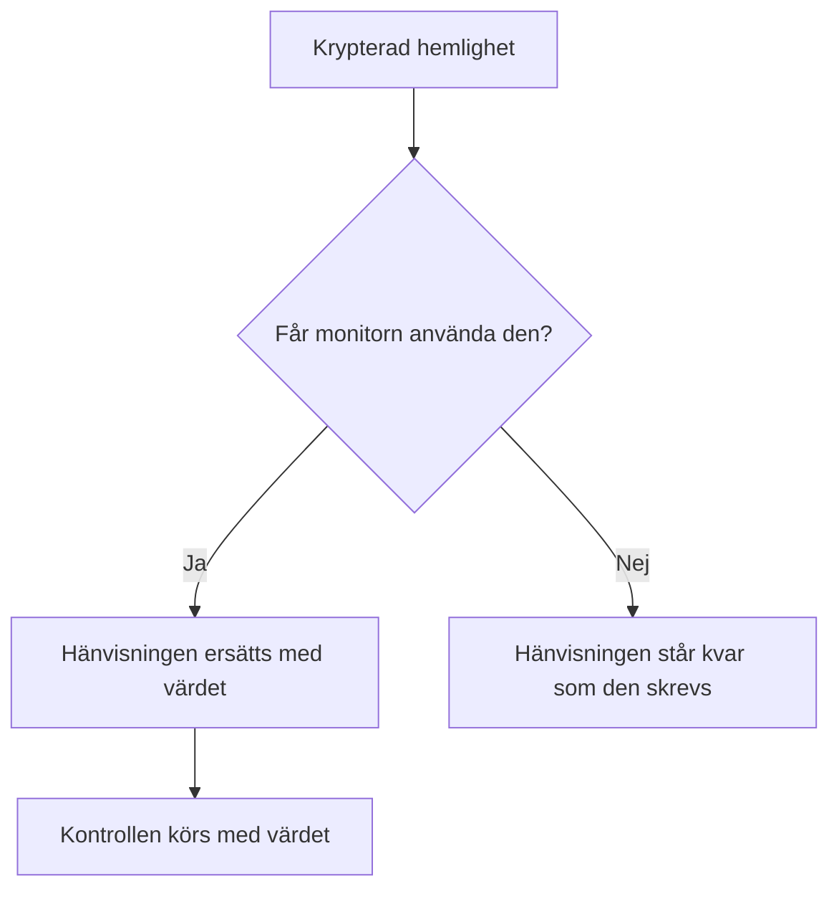

# Övervakningshemligheter

Övervakningshemligheter håller de lösenord, API-nycklar och token som dina monitorer behöver utanför själva monitorn. Du sparar ett värde en gång, krypterat, väljer vilka monitorer som får använda det och hänvisar till det som `{{monitorSecrets.NAME}}` där monitorn behöver det.

:::cards
- [Lägg till en hemlighet](#lägg-till-en-hemlighet): Spara ett värde och välj vem som får använda det.
- [Välj åtkomst](#välj-vilka-monitorer-som-får-använda-en-hemlighet): Alla monitorer, specifika monitorer eller monitorer med etiketter.
- [Använd en hemlighet](#använd-en-hemlighet): Var `{{monitorSecrets.NAME}}` fungerar.
:::

## Så når hemligheter en monitor

En hemlighet sparas krypterad och visas aldrig igen efter att du har sparat den. Innan OneUptime lämnar över en monitor till en sond ersätter den varje hänvisning som monitorn får använda med det dekrypterade värdet; en hänvisning som monitorn inte får använda står kvar som den skrevs.

Sonden som kör kontrollen tar emot värdet, så en monitor som använder en hemlighet bör köras på sonder du litar på: OneUptimes egna, eller en [anpassad sond](/docs/probe/custom-probe) som du själv driver.

## Innan du börjar

- **Growth-abonnemanget eller högre**, på OneUptime Cloud. Egna installationer har inga abonnemang.
- **En roll som kan hantera hemligheter**: Project Owner, Project Admin, eller en anpassad roll med behörigheten Create Monitor Secret.

## Arbeta med hemligheter

### Lägg till en hemlighet

:::steps
1. Gå till **Monitorer → Inställningar → Hemligheter** och klicka på **Skapa Monitor Hemlighet**.
2. Ange ett **Namn** och **Värde för hemlighet**. Namnet är det du hänvisar till, till exempel `ApiKey`. Det får bara innehålla bokstäver, siffror, bindestreck (`-`) och understreck (`_`), och två hemligheter i ett projekt kan inte ha samma namn.
3. Välj i steget **Åtkomst** vilka monitorer som får använda den (se nästa avsnitt) och klicka sedan på **Skapa Monitor Hemlighet**.
:::

> [!IMPORTANT]
> Hemligheter krypteras och lagras säkert. Hemlighetens värde visas aldrig igen efter att det har sparats — inte i tabellen, inte i redigeringsformuläret och inte via API:et. Om du tappar bort värdet måste du hämta det där det kom ifrån och ställa in det igen. För att rotera en hemlighet använder du knappen **Uppdatera hemligt värde** på dess rad; du behöver inte ta bort och skapa om den.

### Välj vilka monitorer som får använda en hemlighet

Varje hemlighet har ett av tre åtkomstalternativ:

| Alternativ | Vilka monitorer som får använda hemligheten | Använd det för |
| --- | --- | --- |
| **Alla övervakare** | Varje monitor i projektet, även monitorer som du skapar senare. | En inloggningsuppgift som många monitorer delar. |
| **Specifika övervakare** | Bara de monitorer du väljer. Det är standard, och hemligheter som skapades innan de här alternativen fanns fungerar så. | En inloggningsuppgift för en eller några få monitorer. |
| **Övervakare med etiketter** | Monitorer som har minst en av de etiketter du väljer. När en av de etiketterna läggs till på en monitor får den åtkomst, och när etiketten tas bort förlorar den åtkomsten nästa gång monitorn körs. | En inloggningsuppgift för en grupp monitorer som ändras över tid. |

Du kan när som helst ändra alternativet med **Redigera** på hemlighetens rad. Bara listan för det valda alternativet behålls: att byta till **Alla övervakare** tömmer hemlighetens listor över monitorer och etiketter, och att byta mellan **Specifika övervakare** och **Övervakare med etiketter** tömmer listan du byter bort från.

En hemlighet är aldrig tillgänglig för monitorer i ett annat projekt.

> [!WARNING]
> Alla som kan redigera en monitor som får använda en hemlighet kan skicka den hemligheten dit monitorn ansluter. Med **Alla övervakare** är det alla som kan skapa eller redigera monitorer i projektet. Med **Övervakare med etiketter** omfattar det även alla som kan lägga till en av de etiketterna på en monitor.

Via API:et är åtkomstalternativet fältet `monitorAccess`: `All Monitors`, `Specific Monitors` eller `Monitors With Labels`. Fälten `monitors` och `labels` innehåller listorna. En hemlighet som skapas utan `monitorAccess` får `Specific Monitors`.

### Använd en hemlighet

För att använda en hemlighet skriver du `{{monitorSecrets.SECRET_NAME}}` i ett fält som tar emot hemligheter. Till exempel skickar huvudet `Authorization: Bearer {{monitorSecrets.ApiKey}}` i en begäran värdet för hemligheten `ApiKey`.

De här monitortyperna och fälten tar emot hemligheter:

| Monitortyp | Fält |
| --- | --- |
| API | URL:en, begärans huvuden och kropp, samt klientcertifikatet, den privata nyckeln och lösenfrasen (mTLS) |
| Webbplats | URL:en, samt klientcertifikatet, den privata nyckeln och lösenfrasen (mTLS) |
| Ping, IP, Port, NTP, SSL Certificate | Värden eller URL:en som kontrolleras |
| DNS | Domännamnet och DNS-servern |
| DNSSEC, Domän | Domännamnet |
| SQL Query | Värden, databasnamnet, användarnamnet, lösenordet och frågan |
| Database Health | Värden, databasnamnet, användarnamnet och lösenordet |
| External Status Page | Statussidans URL |
| Synthetic Monitor, Custom JavaScript Code | Skriptet |
| Network Device | SNMP-communitysträngen, samt autentiserings- och sekretessnycklarna för SNMPv3 |

Hemligheter fylls i innan skriptet i en monitor av typen Synthetic Monitor eller Custom JavaScript Code körs, så en hänvisning som `{{monitorSecrets.ApiKey}}` i skriptet är det dekrypterade värdet när det körs.

Om en monitor hänvisar till en hemlighet som den inte får använda står hänvisningen kvar som den är och ersätts inte med värdet.

När du testar en monitor innan du sparar den fylls bara hemligheter i som är tillgängliga för **Alla övervakare**, eftersom en ny monitor inte finns på någon lista och inte har några etiketter ännu. När du har sparat monitorn använder testerna varje hemlighet som monitorn får använda.

## Felsökning

:::details `{{monitorSecrets.NAME}}` skickas ordagrant
Monitorn får inte använda hemligheten, eller så stämmer inte namnet. Kontrollera hemlighetens åtkomstalternativ med **Redigera** på dess rad, och att namnet i hänvisningen är exakt hemlighetens namn.
:::

:::details När en ny monitor testas fylls hemligheten inte i
Innan en monitor är sparad fylls bara hemligheter i som är tillgängliga för **Alla övervakare**. Spara monitorn och testa den igen.
:::

:::details Ett fält ignorerar hemligheten
Bara fälten i tabellen ovan tar emot hemligheter. I alla andra fält skickas `{{monitorSecrets.NAME}}` som det skrevs.
:::

## Nästa steg

:::cards
- [API-övervakning](/docs/monitor/api-monitor): Skicka en hemlighet i ett huvud i en begäran.
- [Syntetisk övervakning](/docs/monitor/synthetic-monitor): Använd en hemlighet i ett webbläsarskript.
- [SQL-frågeövervakning](/docs/monitor/sql-monitor): Håll ett databaslösenord krypterat.
:::
