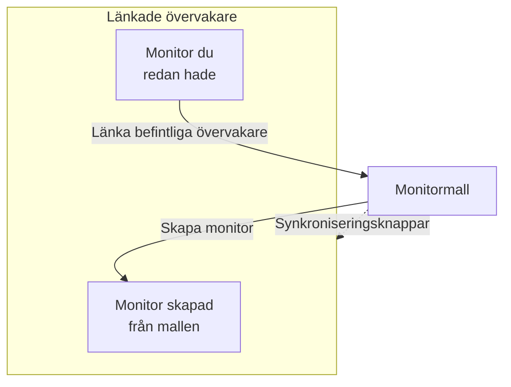

# Monitormallar

En monitormall är en sparad monitorkonfiguration (en typ, kriterier, ett intervall, etiketter och standardvärden för anpassade fält) som du skapar monitorer från med ett klick. Monitorer som skapats från den eller länkats till den förblir anslutna: ändra mallen och synkronisera sedan ändringen till alla. Använd mallar när många monitorer ska bete sig likadant, som samma hälsokontroll på varje tjänst eller samma API-kontroller i produktion och staging.

:::cards
- [Skapa en mall](#skapa-en-mall): Fyra steg, som Skapa monitor.
- [Skapa monitorer från den](#skapa-monitorer-från-en-mall): Ett klick, eller länka monitorer du redan har.
- [Synkronisera ändringar](#synkronisera-ändringar-till-länkade-monitorer): Vad varje synkroniseringsknapp kopierar.
- [Behåll värden för varje monitor](#behåll-värden-för-varje-monitor): Skydda ett mål eller huvuden mot en synkronisering.
:::

## Så fungerar mallar

En mall övervakar inget själv. Monitorer skapas från den eller länkas till den, och mallens sida listar dem som **Länkade övervakare**. När du ändrar mallen ändras inget på de monitorerna förrän du synkroniserar: varje synkroniseringsknapp kopierar en del av mallen till varje länkad monitor, och fält du skyddar behåller varje monitors eget värde.



## Innan du börjar

- **En roll som kan skapa mallar**: Project Owner, Project Admin, Project Member, Monitor Admin eller Monitor Member, eller en anpassad roll med behörigheten Create Monitor Template. Att ändra en mall kräver samma roller eller behörigheten Edit Monitor Template.
- **Behörighet att uppdatera de länkade monitorerna.** En synkronisering skriver till varje länkad monitor som du och hoppar över de monitorer som dina behörigheter inte täcker.

## Skapa en mall

:::steps
### Öppna Mallar

Gå till **Monitorer → Inställningar → Mallar** och klicka på **Skapa Monitor Mall**.

### Namnge mallen

Under **Mallinformation** anger du ett **Mallnamn**, som `Production API Health`, och en **Mallbeskrivning**, och klickar sedan på **Nästa**.

### Ange monitorns standardvärden

Under **Standardvärden för övervakning** väljer du **Monitortyp** med samma väljare som i Skapa monitor. Ange eventuellt ett **Standardnamn för övervakning**; lämnas det tomt får varje monitor namn efter resursen den övervakar. **Standardbeskrivning för övervakning** och **Etiketter** väntar under **Fler fält**. Klicka på **Nästa**.

### Ange kriterierna och intervallet

Under **Kriterier** fyller du i vad som ska kontrolleras och kriterierna, som i [Skapa monitor](/docs/monitor/create-monitor#kriterier). Med kortet **Template sync settings** överst skyddar du fält mot synkroniseringar (se [Behåll värden för varje monitor](#behåll-värden-för-varje-monitor)). För en monitortyp som sonder kontrollerar frågar det sista steget, **Intervall**, efter **Övervakningsintervall**. Klicka på **Skapa Monitor Mall** på det sista steget.
:::

Mallen läggs till i listan. Öppna den för att se dess sida, med ett kort för varje del: **Mallinformation**, **Standardvärden för övervakning**, **Övervakningskriterier**, **Övervakningsintervall** (med **Minsta sondöverensstämmelse**), **Etiketter**, **Custom Field Defaults** (när projektet har anpassade monitorfält) och **Länkade övervakare**. Du ändrar varje del på sitt eget kort, till exempel med **Redigera Kriterier** eller **Redigera Intervall**.

## Skapa monitorer från en mall

- **Ny monitor.** Klicka på **Skapa monitor** på mallens rad i listan, eller på **Skapa övervakning från mall** på dess sida. **Skapa monitor** öppnas med mallens typ och inställningar ifyllda; ändra det du behöver och skapa den. Den nya monitorn länkas till mallen.
- **Monitorer du redan har.** Under **Länkade övervakare** klickar du på **Länka befintliga övervakare** och väljer dem. De behåller sina inställningar tills du synkroniserar.

Värden som angetts under **Custom Field Defaults** skrivs till varje monitor som skapas från mallen, även monitorer som regler för automatisk import och larmpolicyer skapar från den.

## Synkronisera ändringar till länkade monitorer

Att redigera en mall ändrar bara mallen. För att kopiera en ändring till de länkade monitorerna använder du synkroniseringsknappen på kortet du ändrade. Varje knapp anger hur många monitorer den når, som **Sync Criteria to 3 Linked Monitors**, och är nedtonad så länge inget är länkat. En synkronisering kan inte ångras.

| Knapp | Kopierar till varje länkad monitor | Lämnar orört |
| --- | --- | --- |
| **Synkronisera kriterier till länkade övervakare** | Kriterierna och steginställningarna, som mål och begärandealternativ, utom skyddade fält | Övervakningsintervallet, minsta sondöverensstämmelse, namnet, beskrivningen, etiketterna och värdena i anpassade fält |
| **Synkronisera intervall till länkade övervakare** | Övervakningsintervallet och minsta sondöverensstämmelse | Kriterierna, namnet, beskrivningen, etiketterna och värdena i anpassade fält |
| **Synkronisera etiketter till länkade övervakare** | Etiketterna och inget annat | Allt annat |
| **Sync Custom Fields to Linked Monitors** | De anpassade fält som mallen har ett standardvärde för, i stället för det varje monitor hade | Anpassade fält som mallen lämnar tomma, och allt annat |

För att synkronisera en enskild monitor klickar du på **Synkronisera från mall** på dess rad under **Länkade övervakare**. Det kopierar kriterierna och steginställningarna (utom skyddade fält), övervakningsintervallet, minsta sondöverensstämmelse och etiketterna, och lämnar monitorns namn, beskrivning och värden i anpassade fält orörda. **Avlänka från mall** kopplar loss en monitor; den behåller sina inställningar.

Efter en synkronisering anger en sammanfattning hur många monitorer som uppdaterades. **Delvis synkroniserad** betyder att några länkade monitorer fortfarande har den tidigare konfigurationen, oftast för att dina behörigheter inte täcker dem.

## Behåll värden för varje monitor

En kriteriesynkronisering kopierar också steginställningar som mål, begärandehuvuden och tidsgränser, om du inte skyddar de fälten. Skydda ett fält så att varje länkad monitor behåller sitt eget värde för det.

:::steps
### Öppna mallen

Gå till **Monitorer → Inställningar → Mallar** och öppna mallen.

### Redigera dess kriterier

Klicka på **Redigera Kriterier** på kortet **Övervakningskriterier**.

### Skydda fälten

Under **Template sync settings** markerar du **Do not sync this field** bredvid varje fält du vill behålla på de länkade monitorerna.

### Spara

Spara dina ändringar. Kortet **Övervakningskriterier** och bekräftelsen av båda synkroniseringarna nedan listar de skyddade fälten.

### Synkronisera

Använd **Synkronisera kriterier till länkade övervakare**, eller **Synkronisera från mall** på en enskild länkad monitor.
:::

Skydda till exempel **Monitor destination** och **Request headers** på en API-mall. Produktions- och staging-monitorer behåller sina egna URL:er och huvuden, medan båda får mallens uppdaterade kriterier och övriga oskyddade inställningar.

Vilka alternativ som finns beror på monitortypen. De omfattar mål och portar, alternativ för HTTP-begäranden, databasanslutningar, DNS-inställningar, infrastrukturväljare och telemetrifrågor. Relaterade inloggningsuppgifter, som ett klientcertifikat och dess privata nyckel, hålls ihop.

### Så fungerar undantag

- Markerade fält behåller varje befintlig monitors nuvarande värde, även ett tomt eller oinställt värde. Begärandehuvuden och andra samlingar bevaras i sin helhet.
- Omarkerade fält fortsätter att synkroniseras från mallen. Avmarkera ett skyddat fält och spara för att kopiera dess mallvärde vid nästa synkronisering.
- Undantag gäller för massvisa och enskilda synkroniseringar. De sparas på mallen och väljs inte separat för varje synkronisering.
- Nya monitorer börjar fortfarande med mallens fältvärden. Undantag påverkar bara synkronisering av befintliga monitorer.
- Kriterier synkroniseras alltid. En synkronisering av enbart kriterier lämnar övervakningsintervallet, etiketterna och andra inställningar på monitornivå orörda.
- Befintliga mallar har inga fältundantag förrän du ställer in dem. Monitorer för nätverksenheter behåller fortfarande sin egen enhetskoppling automatiskt.

För mallar med flera steg matchas skyddade värden via steg-ID:na. Fristående skapade monitorer med ett steg kan också ta emot en mall med ett steg. Om ett skyddat steg inte kan matchas avvisas synkroniseringen innan någon monitor uppdateras, så att ett nytt eller omordnat steg inte av misstag kan kopiera ett annat stegs mål eller inloggningsuppgifter.

> [!IMPORTANT]
> Innan du ändrar monitortypen för en sparad mall (med **Redigera Standardvärden för övervakning**) tar du under **Redigera Kriterier** bort de undantag som inte gäller för den nya typen. Alla en malls undantag måste finnas för dess monitortyp.

## Konfiguration via API

Varje mallsteg accepterar en array `doNotSyncFields` i sitt objekt `MonitorStep.value`. För en API-monitor skyddar du dess mål och hela samlingen av huvuden med:

```json title="monitorSteps (excerpt)"
{
  "_type": "MonitorSteps",
  "value": {
    "monitorStepsInstanceArray": [
      {
        "_type": "MonitorStep",
        "value": {
          "id": "<step id>",
          "doNotSyncFields": ["monitorDestination", "requestHeaders"]
        }
      }
    ]
  }
}
```

Utelämna arrayen eller sätt den till `[]` för att synkronisera alla steginställningar som stöds. Fältnamn som inte stöds och fält som inte gäller för mallens monitortyp avvisas. Mallens array styr synkroniseringen; sådana metadata på en länkad monitor åsidosätter den inte.

:::details Fältnamn för doNotSyncFields, per monitortyp
| Monitortyp | Fältnamn |
| --- | --- |
| Webbplats, API, Ping, IP, Port, SSL Certificate, NTP | `monitorDestination`, `requestTimeoutInMs`, `retryCount` |
| Endast API | `requestHeaders`, `requestType`, `requestBody` |
| Webbplats och API | `doNotFollowRedirects`, `allowSelfSignedCertificates`, `tlsClientAuthentication` (klientcertifikatet, nyckeln och lösenfrasen tillsammans) |
| Port, NTP | `monitorDestinationPort` |
| Synthetic Monitor, Custom JavaScript Code | `customCode` |
| Synthetic Monitor | `browserTypes`, `screenSizeTypes`, `retryCountOnError` |
| DNS | `dnsMonitor.queryName`, `dnsMonitor.recordType`, `dnsMonitor.resolver` (DNS-servern och porten tillsammans), `dnsMonitor.timeout`, `dnsMonitor.retries` |
| Domän | `domainMonitor.domainName`, `domainMonitor.lookupMethod`, `domainMonitor.timeout`, `domainMonitor.retries` |
| DNSSEC | `dnssecMonitor.domainName`, `dnssecMonitor.resolvers`, `dnssecMonitor.checkNameserverConsistency`, `dnssecMonitor.signatureExpiryWarningDays`, `dnssecMonitor.timeout`, `dnssecMonitor.retries` |
| SQL Query | `sqlMonitor.connection`, `sqlMonitor.connectionTimeoutInMs`, `sqlMonitor.statementTimeoutInMs`, `sqlMonitor.query`, `sqlMonitor.maxRows` |
| Database Health | `databaseMonitor.connection`, `databaseMonitor.connectionTimeoutInMs`, `databaseMonitor.statementTimeoutInMs`, `databaseMonitor.enabledMetricGroups` |
| External Status Page | `externalStatusPageMonitor.statusPageUrl`, `externalStatusPageMonitor.provider`, `externalStatusPageMonitor.components`, `externalStatusPageMonitor.timeout`, `externalStatusPageMonitor.retries` |
| Loggar, Security Events, Spår, AI / LLM, Mätvärden, Undantag | `logMonitor`, `securityEventsMonitor`, `traceMonitor`, `llmMonitor`, `metricMonitor`, `exceptionMonitor` (monitorns hela konfiguration) |

Infrastrukturmonitorer (Kubernetes, Docker Container, Värd, Podman Container, Proxmox, Docker Swarm, Ceph, Lagringsarray, IoT Device) erbjuder sin resursväljare, filter (alla utom Värd), mätvärdesfrågor och frågans tidsfönster. Deras namn listas under **Template sync settings** på en mall av den typen.
:::

## Felsökning

:::details En synkronisering säger "Delvis synkroniserad"
Några länkade monitorer uppdaterades inte, oftast för att dina behörigheter inte täcker dem. Be någon som kan uppdatera alla länkade monitorer att köra synkroniseringen igen.
:::

:::details En synkronisering misslyckas med "a template step cannot be matched to an existing monitor step"
Ett skyddat fält kunde inte matchas mot ett steg på en av monitorerna, så synkroniseringen stoppade innan någon av dem ändrades. Ge mallens steg samma ID:n som monitorernas steg, eller använd en mall med ett steg tillsammans med monitorer med ett steg.
:::

:::details Synkroniseringsknapparna är nedtonade
Ingen monitor är länkad till mallen än. Skapa en monitor från den, eller klicka på **Länka befintliga övervakare** under **Länkade övervakare**.
:::

:::details Sparandet misslyckas med "Unsupported do not sync field"
Ett namn i `doNotSyncFields` är inte ett fält för mallens monitortyp. Kontrollera det mot fältnamnen ovan.
:::

## Nästa steg

:::cards
- [Skapa en monitor](/docs/monitor/create-monitor): Formuläret som en mall fyller i.
- [API-övervakning](/docs/monitor/api-monitor): Inställningarna som en API-mall har med sig.
- [Övervakningshemligheter](/docs/monitor/monitor-secrets): Dela inloggningsuppgifter mellan monitorer utan att kopiera dem.
- [Terraform-monitorsteg](/docs/terraform/monitor-steps): Hantera monitorer och deras steg som kod.
:::
