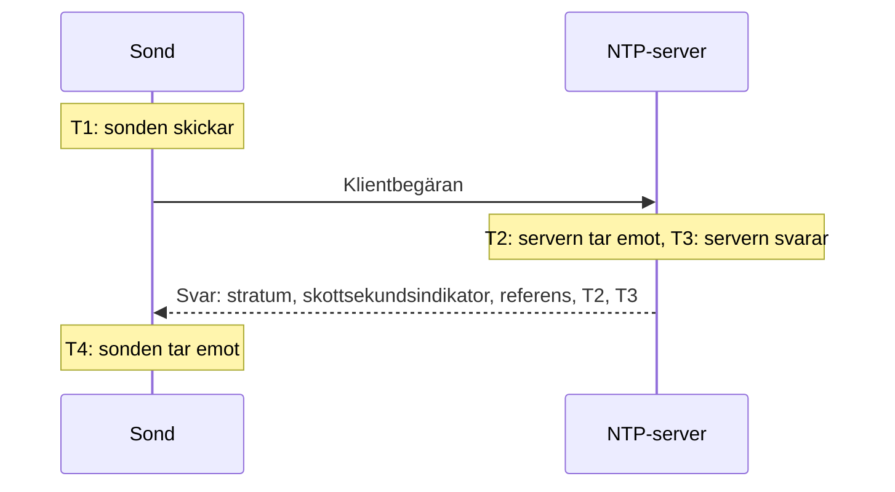

# NTP-övervakning

En NTP-monitor kontrollerar att en tidsserver svarar på UDP-port 123 och levererar tillförlitlig tid: att den är synkroniserad, på ett rimligt stratum och att dess klocka stämmer med sondens. Använd den för de tidsservrar du själv driver, som en GPS-klocka i datacentret eller de interna servrar som dina maskiner synkroniserar mot, och för de publika servrar du är beroende av.

:::cards
- [Skapa monitorn](#skapa-en-ntp-monitor): Sex steg i instrumentpanelen.
- [Vad kontrollen läser](#vad-kontrollen-läser): Stratum, klockavvikelse, skottsekundsindikator och resten av svaret.
- [Övervakningskriterier](#övervakningskriterier): Nåbarhet, synkronisering, stratum och avvikelse.
- [Felsökning](#felsökning): När servern är igång men monitorn säger något annat.
:::

## Så fungerar det

Vid varje kontroll skickar en sond en SNTP-klientbegäran (NTP version 4, klientläge) från en slumpmässig lokal port till serverns UDP-port och väntar på svaret. Bara ett riktigt svar på den begäran räknas: sonden lägger 64 slumpmässiga bitar i begärans sändningstidsstämpel och ignorerar alla paket som inte skickar tillbaka dem, är kortare än ett NTP-paket eller inte är i serverläge. Ett gammalt svar på en tidigare kontroll, eller ett förfalskat svar, kan aldrig få en nere server att se levande ut.

Utifrån de fyra tidsstämplarna räknar sonden ut **klockavvikelsen**, ((T2 − T1) + (T3 − T4)) / 2: hur långt serverns klocka ligger från sondens. En positiv avvikelse betyder att servern går före. Formeln antar att begäran och svaret tar lika lång tid, så en väg som är mycket långsammare i ena riktningen kan förskjuta avvikelsen med upp till halva tur och retur-tiden.

> [!NOTE]
> Avvikelsen mäts mot sondens egen klocka. OneUptime Clouds sonder håller sina klockor synkroniserade. På en [anpassad sond](/docs/probe/custom-probe) behöver även värdens klocka hållas synkroniserad, med chrony eller systemd-timesyncd, annars kan en avvikelsevarning handla om sonden och inte om servern.

En server som svarar tillfrågas inte igen, inte ens när den svarar utan tillförlitlig tid. Tystnad, en nekad port och en misslyckad DNS-uppslagning görs om med en ny begäran. När servern inte svarar alls spårar sonden också vägen dit och bifogar det den hittade som **Network Path at Time of Failure**. En sond som har tappat sin egen nätverksanslutning rapporterar inget resultat, så den kan inte markera din server som offline.

## Innan du börjar

- **En roll som kan skapa monitorer**: Project Owner, Project Admin, Project Member, Monitor Admin eller Monitor Member, eller en anpassad roll med behörigheten Create Monitor.
- **En sond som når UDP-port 123 på servern.** Alla sonder kan kontrollera en publik tidsserver. För en server i ett privat nätverk använder du en [anpassad sond](/docs/probe/custom-probe) inne i det nätverket. En brandvägg framför servern måste släppa igenom UDP, inte bara TCP, från [OneUptime Clouds sond-IP-adresser](/docs/configuration/ip-addresses) eller från din anpassade sond.

## Skapa en NTP-monitor

:::steps
### Starta en ny monitor

Gå till **Monitorer** och klicka på **Skapa monitor**. Under **Monitortyp** skriver du `ntp` i sökrutan och väljer **NTP**. Den finns också under **Fler monitortyper**, i gruppen Nätverk.

### Ge den ett namn

Ange ett **Namn**, till exempel `GPS-tidsserver`, och klicka på **Nästa**.

### Ange servern

I **NTP-server** anger du serverns värdnamn eller IP-adress, till exempel `time.example.com` eller `192.168.1.10`. Begäran går till port 123. Öppna **Fler fält** och ange **Port** för att använda en annan port.

### Testa den

Klicka på **Testa monitor**, välj en sond under **Välj sond** och klicka på **Kör test**. **Resultat av övervakningstest** visar om servern svarade, om den är synkroniserad, dess stratum och hur mycket dess klocka avviker.

### Gå igenom kriterierna

**Monitorkriterier** börjar med [standardkriterierna](#standardkriterier): offline när servern inte levererar tillförlitlig tid, online när den gör det. Ändra dem vid behov och klicka på **Nästa**.

### Välj sonder och skapa

Behåll eller ändra **Sonder** och **Övervakningsintervall** (det börjar på **Var 5:e minut**) och klicka på **Skapa monitor**. Monitorns sida öppnas.
:::

## Konfigurationsalternativ

| Fält | Standard | Vad du anger |
| --- | --- | --- |
| **NTP-server** | Ingen | Servern, till exempel `time.example.com`, `192.168.1.10` eller `2001:db8::123`. Ange bara värden, utan `udp://`. En port skriven efter värden, till exempel `time.example.com:1123`, används i stället för **Port**. |
| **Port** (under **Fler fält**) | `123` | UDP-porten som servern svarar på NTP på, från `1` till `65535`. Lämna den tom för `123`. |
| **Begärandetimeout (sekunder)** (under **Fler fält**) | `5` | Hur länge ett försök väntar på svaret, DNS-uppslagningen inräknad. Maximum är 60 sekunder. |
| **Återförsök vid misslyckande** (under **Fler fält**) | Sondens standard, vanligtvis `3` | Hur många gånger ett försök utan svar görs om. Maximum är 3. |

**Återförsök vid misslyckande** räknar återförsök _efter_ det första försöket, så `0` kör kontrollen en gång och `2` upp till tre gånger, med en paus på en sekund mellan försöken. Lämnas fältet tomt används sondens standard: 3, om inte sondens `PROBE_MONITOR_RETRY_LIMIT` säger något annat.

## Vad kontrollen läser

Monitorns sida visar den senaste kontrollen från varje sond:

| Fält | Vad det betyder |
| --- | --- |
| **Synkroniserad** | Om servern svarade på stratum 1 till 15, utan larmet i sin skottsekundsindikator och med riktiga tidsstämplar i svaret. |
| **Klockavvikelse** | Hur långt serverns klocka ligger från sondens, och åt vilket håll. En frisk server ligger inom några få millisekunder. |
| **Stratum** | Hur många hopp servern är från en referensklocka: 1 för en server med en egen GPS- eller atomkälla, 2 för en som synkroniserar mot en stratum 1-server, och så vidare. 16 betyder inte synkroniserad. |
| **Referens** | Vad servern synkroniserar mot: ett källnamn som `GPS`, `PPS` eller `NIST` på stratum 1, adressen till servern ovanför från stratum 2 och uppåt. |
| **Skottsekundsindikator** | 0 när ingen skottsekund väntar, 1 eller 2 när en läggs till eller tas bort vid dagens slut, 3 när servern säger att dess klocka inte är synkroniserad. |
| **Rotspridning** | Serverns egen uppskattning av hur långt dess tid kan ligga från den sanna tiden. Den växer medan servern inte når sin källa. ntpd slutar lita på en server när halva dess rotfördröjning plus det här värdet passerar 1,5 sekunder. |
| **Rotfördröjning** | Tur och retur-tiden från servern till dess referensklocka. |
| **Svarstid** | Från att sonden skickar begäran till att den tar emot svaret, utan DNS-uppslagningen. |
| **Servertid** | Serverns klocka när den skickade svaret. |

En server som vägrar ge tiden skickar i stället ett **kiss-o'-death**: ett svar på stratum 0 med en kod på fyra bokstäver. De vanligaste koderna är `RATE` (servern begränsar sondens frekvens), `DENY` och `RSTR` (dess åtkomstregler nekar sonden) och `INIT` (den har inte synkroniserats än). Kontrollen visar koden och räknar servern som svarande men inte synkroniserad.

## Övervakningskriterier

Kriterier avgör när servern räknas som online, försämrad eller offline, och om det deklarerar en incident eller skapar en varning. Varje kriterium kontrollerar ett eller flera filter:

| Filter | Villkor | Vad det kontrollerar |
| --- | --- | --- |
| **NTP Is Online** | **Sant**, **Falskt** | Om servern besvarade sondens begäran med ett NTP-svar. Ett kiss-o'-death är ett svar. |
| **NTP Is Synchronized** | **Sant**, **Falskt** | Om servern som svarade levererar synkroniserad tid. När servern inte svarar kontrolleras inte det här filtret; använd **NTP Is Online** för det. |
| **NTP Stratum** | **Greater Than**, **Greater Than Or Equal To**, **Less Than**, **Less Than Or Equal To**, **Equal To**, **Not Equal To** | Serverns stratum. Ett kiss-o'-deaths 0 räknas som 16, inte synkroniserad. |
| **NTP Clock Offset (in ms)** | **Greater Than**, **Less Than**, **Greater Than Or Equal To**, **Less Than Or Equal To** | Hur långt serverns klocka ligger från sondens, åt båda hållen. |
| **NTP Response Time (in ms)** | **Greater Than**, **Less Than**, **Greater Than Or Equal To**, **Less Than Or Equal To** | Från begäran till svaret. |
| **NTP Root Dispersion (in ms)** | **Greater Than**, **Less Than**, **Greater Than Or Equal To**, **Less Than Or Equal To** | Serverns egen uppskattning av sitt största fel. |

Med två eller flera filter avgör **Matchningsvillkor** om **Alla** måste matcha eller om det räcker med **Valfri** av dem. Ett kriteriums **Åtgärder** avgör vad det gör: ändrar monitorns status, skapar en varning, deklarerar en incident eller en kombination av dessa.

### Standardkriterier

En ny NTP-monitor börjar med två kriterier:

- **Offline** — servern svarar inte, är inte synkroniserad, eller dess klocka ligger `1000` ms eller mer från sondens. Monitorn markeras som **Offline** och en incident med namnet "_monitornamn_ is not serving good time" skapas. Den löser sig själv när servern åter levererar tillförlitlig tid.
- **Online** — servern svarar, är synkroniserad och dess klocka ligger inom `1000` ms från sondens. Monitorn markeras som **Fungerar**.

Kriterierna kontrolleras uppifrån och ned, och det första som matchar avgör vad som händer. En server som svarar med fel tid behandlas avsiktligt som nere: varje klient som följer den skulle också ta den tiden.

### Utvärdering över en tidsperiod

**Utvärdera dessa kriterier över en tidsperiod** är en kryssruta under varje NTP-filter. Slå på den för att bedöma ett fönster av tidigare kontroller i stället för den senaste: välj en aggregering under **Utvärdera** och ett fönster, från 2 till 60 minuter, under **Under de senaste (i minuter)**. Bara kontroller som servern svarade på har ett stratum, en avvikelse och en rotspridning, så ett fönster av tystnad saknar data för de filtren, och **Om ingen data** avgör vad som händer.

### Exempel på kriterier

| Mål | Filter | Villkor | Värde |
| --- | --- | --- | --- |
| Varna när en GPS-server faller tillbaka på en nätverkskälla | **NTP Stratum** | **Greater Than** | `1` |
| Varna när klockan driver | **NTP Clock Offset (in ms)** | **Greater Than** | `100` |
| Varna när serverns felmarginal växer | **NTP Root Dispersion (in ms)** | **Greater Than** | `500` |
| Varna när svaren blir långsamma | **NTP Response Time (in ms)** | **Greater Than** | `1000` |

## Felsökning

:::details Servern är igång, men monitorn säger att den inte svarade
Begäran eller svaret föll bort på vägen. En brandvägg som tillåter TCP men inte UDP, en ntpd-regel `restrict` eller chrony-regel `allow` som utelämnar sondens adress, eller en server som bara lyssnar på ett internt gränssnitt ser alla ut så här. **Network Path at Time of Failure** visar hur långt vägen nådde. Släpp igenom sonden, eller kontrollera servern från en [anpassad sond](/docs/probe/custom-probe) inne i nätverket.
:::

:::details Monitorn säger att servern nekade begäran
Värden svarade att inget lyssnar på den UDP-porten (ICMP port unreachable): NTP-tjänsten är stoppad eller lyssnar på en annan port. Starta tjänsten, eller sätt **Port** till den den använder.
:::

:::details Servern svarar med ett kiss-o'-death
`RATE` betyder att servern begränsar sondens frekvens. Sonden frågar en gång per kontroll, så ett längre **Övervakningsintervall**, eller ett undantag för sondens adresser i serverns begränsning, stoppar det. `DENY` och `RSTR` betyder att serverns åtkomstregler nekar sonden. `INIT` och `STEP` betyder att servern inte har synkroniserats än, vilket är normalt de första minuterna efter start.
:::

:::details Alla NTP-monitorer på en sond visar en liknande avvikelse
Det är sondens klocka som avviker, inte servrarnas. Kontrollera att sondens värd håller sin klocka synkroniserad, eller kör monitorerna på en annan sond.
:::

:::details Avvikelsen hoppar mellan kontrollerna
Sonden ligger långt från servern, eller vägen är långsammare åt ena hållet än åt det andra. Använd en sond närmare servern, eller bedöm avvikelsen över några minuter med **Utvärdera dessa kriterier över en tidsperiod** och **Genomsnitt**.
:::

## Nästa steg

:::cards
- [Ping-övervakning](/docs/monitor/ping-monitor): Kontrollera att själva värden kan nås.
- [Portövervakning](/docs/monitor/port-monitor): Kontrollera TCP-tjänsterna på samma värd.
- [Anpassade probes](/docs/probe/custom-probe): Kontrollera tidsservrar i ditt eget nätverk.
- [Incident- och varningsmallar](/docs/monitor/incident-alert-templating): Lägg stratum och avvikelse i en incidents titel.
:::
