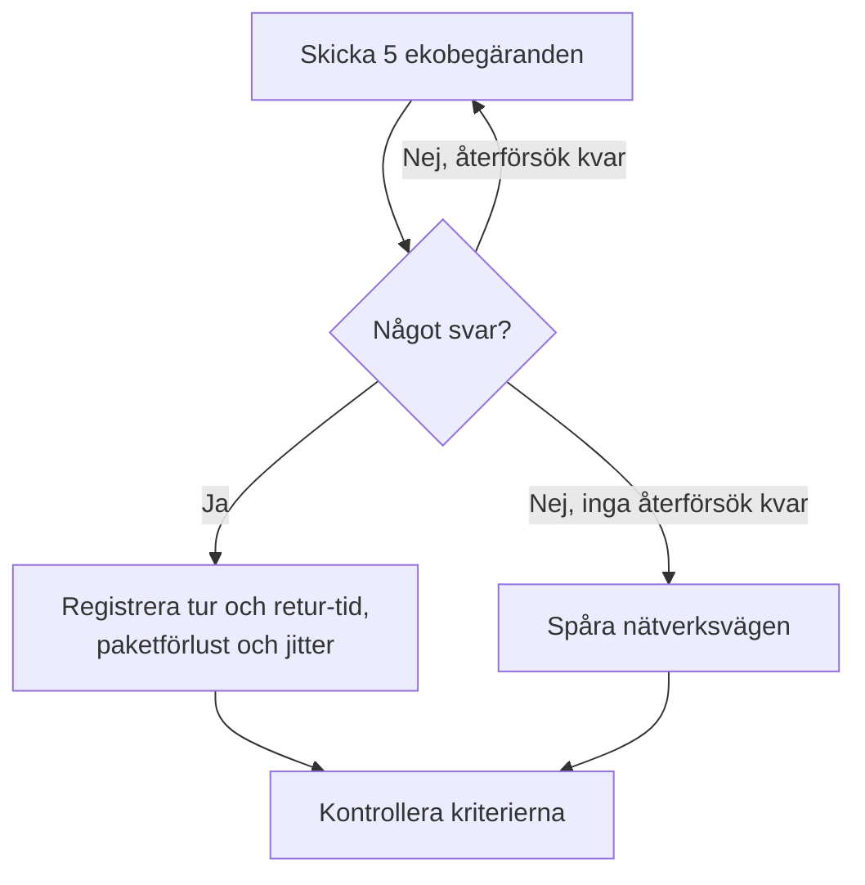

# Ping-övervakning

En ping-monitor kontrollerar att en värd svarar på ping (ICMP-ekobegäranden) och mäter tur och retur-tiden, paketförlusten och jittret. Använd den för servrar, routrar, brandväggar och andra enheter som du når via värdnamn eller IP-adress.

:::cards
- [Skapa monitorn](#skapa-en-ping-monitor): Sex steg i instrumentpanelen.
- [Konfigurationsalternativ](#konfigurationsalternativ): Värden, tidsgränsen och återförsök.
- [Övervakningskriterier](#övervakningskriterier): Nåbarhet, latens, paketförlust och jitter.
- [Felsökning](#felsökning): När värden är uppe men monitorn säger offline.
:::

## Så fungerar det

Vid varje kontroll skickar en sond fem ekobegäranden till värden. Om minst ett svar kommer tillbaka är värden online, och sonden registrerar den genomsnittliga tur och retur-tiden som svarstid, tillsammans med paketförlusten, jittret och det snabbaste och långsammaste svaret. Om inget svar kommer tillbaka försöker sonden igen, upp till det antal återförsök du tillåter. Sedan kör OneUptime resultatet genom monitorns kriterier.

När en kontroll misslyckas spårar sonden också vägen till värden och slår upp dess namn, och bifogar det den hittade till resultatet som **Network Path at Time of Failure**, så att du ser var vägen bröts.

> [!NOTE]
> Vissa värdleverantörer blockerar ICMP på de maskiner där en sond körs. En sond som inte kan skicka ping alls kontrollerar i stället TCP-port `80` på värden, så att monitorn ändå säger om värden kan nås. Paketförlust och jitter mäts då inte.

En sond som har förlorat sin egen nätverksanslutning rapporterar inget resultat, så den kan inte markera din värd som offline.

## Innan du börjar

- **En roll som kan skapa monitorer**: Project Owner, Project Admin, Project Member, Monitor Admin eller Monitor Member, eller en anpassad roll med behörigheten Create Monitor.
- **En sond som når värden**, med ICMP tillåtet på vägen. Projektets standardsonder väljs för varje ny monitor. Om en brandvägg står framför värden tillåter du ICMP-ekobegäranden från [OneUptime Clouds sond-IP-adresser](/docs/configuration/ip-addresses). En värd i ett privat nätverk behöver en [anpassad sond](/docs/probe/custom-probe) i det nätverket.

## Skapa en ping-monitor

:::steps
### Börja en ny monitor

Gå till **Monitorer** och klicka på **Skapa monitor**. Välj **Ping** under **Monitortyp**.

### Namnge den

Ange ett **Namn**, som `Core router`, och klicka sedan på **Nästa**.

### Ange värden

Ange under **Värdnamn eller IP-adress** värdnamnet eller den IPv4- eller IPv6-adress som ska pingas, som `example.com` eller `192.168.1.1`. Ange bara värden, utan `http://` och utan port.

### Testa den

Klicka på **Testa monitor**, välj en sond under **Välj sond** och klicka på **Kör test**. **Resultat av övervakningstest** visar de tur och retur-tider och den paketförlust som sonden såg.

### Gå igenom kriterierna

**Monitorkriterier** börjar med [standardkriterierna](#standardkriterier): offline när värden inte svarar, online när den gör det. Ändra dem vid behov och klicka sedan på **Nästa**.

### Välj sonder och skapa

Behåll eller ändra **Sonder** och **Övervakningsintervall** (det börjar på **Var 5:e minut**) och klicka sedan på **Skapa monitor**. Monitorns sida öppnas.
:::

## Konfigurationsalternativ

| Fält | Standard | Vad du anger |
| --- | --- | --- |
| **Värdnamn eller IP-adress** | Ingen | Värden som ska pingas, som `example.com`, `192.168.1.1` eller `2001:db8::1`. Ett värdnamn slås upp vid varje kontroll, så monitorn följer DNS-ändringar. |
| **Begärandetimeout (sekunder)** (under **Fler fält**) | `60` | Hur länge det väntas på ett svar vid varje försök. Maxvärdet är 60 sekunder. |
| **Återförsök vid misslyckande** (under **Fler fält**) | Sondens standard, oftast `3` | Hur många gånger ett misslyckat försök görs om. Maxvärdet är 3. |

**Återförsök vid misslyckande** räknar återförsök _efter_ det första försöket, så `0` kör kontrollen en gång och `2` upp till tre gånger. Lämnas fältet tomt används sondens standard: 3, om inte sondens `PROBE_MONITOR_RETRY_LIMIT` säger något annat. Varje fel görs om, tidsgränser inräknade, med en paus på en sekund mellan försöken. En lyckad kontroll vars svar tog längre än 10 sekunder kontrolleras också igen.

För att bevaka en fast IP-adress och aldrig ett värdnamn kan du i stället använda en [IP-monitor](/docs/monitor/ip-monitor). Den kör samma kontroll.

## Övervakningskriterier

Kriterier avgör när värden räknas som online, försämrad eller offline, och om det deklarerar en incident eller skapar ett larm. Varje kriterium kontrollerar ett eller flera filter:

| Filter | Villkor | Vad det kontrollerar |
| --- | --- | --- |
| **Is Online** | **Sant**, **Falskt** | Om minst en ekobegäran fick svar. |
| **Svarstid (i ms)** | **Greater Than**, **Less Than**, **Greater Than Or Equal To**, **Less Than Or Equal To** | Svarens genomsnittliga tur och retur-tid. |
| **Packet Loss (in %)** | **Greater Than**, **Less Than**, **Greater Than Or Equal To**, **Less Than Or Equal To** | Andelen av de fem ekobegäranden som inte fick svar. |
| **Jitter (in ms)** | **Greater Than**, **Less Than**, **Greater Than Or Equal To**, **Less Than Or Equal To** | Standardavvikelsen för tur och retur-tiderna över paketen i en kontroll. |
| **Is Request Timeout** | **Sant**, **Falskt** | Om pingen nådde tidsgränsen vid varje försök. |

Med två eller fler filter avgör **Matchningsvillkor** om **Alla** måste matcha eller om **Valfri** av dem räcker. Ett kriteriums **Åtgärder** avgör vad det gör: ändrar monitorns status, skapar ett larm, deklarerar en incident eller flera av dessa.

### Standardkriterier

En ny ping-monitor börjar med två kriterier:

- **Offline** — värden svarar inte på någon av ekobegärandena, eller kan inte nås alls, efter alla återförsök. Monitorn markeras som **Offline** och en incident som heter "_monitor name_ is offline" skapas. Incidenten löser sig själv när värden svarar igen.
- **Uppe** — värden svarar. Monitorn markeras som **Fungerar**.

Kriterier kontrolleras uppifrån och ned, och det första som matchar avgör vad som händer. När inget matchar visar monitorn sin standardstatus: **Fungerar**, om du inte väljer en annan under **Fler fält** under kriterierna.

### Utvärdering över en tidsperiod

**Utvärdera dessa kriterier över en tidsperiod** är en kryssruta under ett filter, som erbjuds för **Is Online**, **Svarstid (i ms)**, **Packet Loss (in %)** och **Jitter (in ms)**. Slå på den för att bedöma ett fönster av tidigare kontroller i stället för bara den senaste: välj en aggregering under **Utvärdera** och ett fönster från 2 till 60 minuter under **Under de senaste (i minuter)**.

| Aggregering | Matchar när |
| --- | --- |
| **Genomsnitt**, **Summa**, **Maximum Value**, **Minimum Value** | Det värdet över fönstret uppfyller villkoret. Bara numeriska filter. |
| **All Values** | Varje kontroll i fönstret uppfyller villkoret. |
| **Any Value** | Minst en kontroll i fönstret uppfyller villkoret. |

**All Values** matchar först när fönstret verkligen täcks av data. En monitor som just skapats, eller en vars kontroller slutade registreras, har inte tillräcklig historik för att säga något om de senaste N minuterna, så kriteriet väntar i stället för att matcha på den enda mätning det har. **Any Value** är inställningen för "säg till direkt när en enda kontroll går över gränsen" och utlöses fortfarande omedelbart.

**Om ingen data** avgör vad som händer så länge fönstret inte kan bära kriteriet:

| Alternativ | Vad som händer | Använd det för |
| --- | --- | --- |
| **Ignore** (standard) | Kriteriet matchar inte. | Vanliga tröskellarm. |
| **Utlösare** | Den saknade datan räknas som problemet. | Kontroller där tystnad i sig är ett fel. |
| **Treat As Zero** | Fönstret jämförs som en enda nolla. | Räknare där inga händelser verkligen betyder noll. |

### Exempelkriterier

| Mål | Filter | Villkor | Värde |
| --- | --- | --- | --- |
| Offline när värden inte kan nås | **Is Online** | **Falskt** | — |
| Larma när latensen är hög | **Svarstid (i ms)** | **Greater Than** | `200` |
| Markera värden som försämrad på en länk med förluster | **Packet Loss (in %)** | **Greater Than** | `20` |
| Larma vid en instabil anslutning | **Jitter (in ms)** | **Greater Than** | `30` |

För att bara larma när latensen förblir hög slår du på **Utvärdera dessa kriterier över en tidsperiod** för svarstidsfiltret och väljer **All Values** över **5** minuter.

## Felsökning

:::details Värden är uppe, men monitorn säger offline
Värden, eller en brandvägg framför den, svarar inte på ICMP-ekobegäranden från sonden. Många servrar och molnnätverk släpper ping som standard. Tillåt ICMP-ekobegäranden från sonderna, eller bevaka i stället en tjänst på värden med en [portmonitor](/docs/monitor/port-monitor). **Network Path at Time of Failure** på den misslyckade kontrollen visar hur långt vägen nådde.
:::

:::details Kontrollen misslyckas med "This probe could not resolve" för värden
Sondens DNS-server känner inte till värdnamnet. Kontrollera namnet, eller ange IP-adressen i stället. Ett namn som bara slås upp inom ditt nätverk behöver en [anpassad sond](/docs/probe/custom-probe) där.
:::

:::details Paketförlust och jitter är tomma
Sonden som körde kontrollen kan inte skicka ping, så den kontrollerade i stället TCP-port `80`, som inte mäter någon av dem. Kör monitorn på en sond som får skicka ICMP.
:::

## Nästa steg

:::cards
- [IP-övervakning](/docs/monitor/ip-monitor): Bevaka en fast IPv4- eller IPv6-adress.
- [Portövervakning](/docs/monitor/port-monitor): Kontrollera en tjänst på värden, inte bara värden.
- [Anpassade probes](/docs/probe/custom-probe): Pinga värdar i ditt eget nätverk.
- [Incidenter](/docs/incidents/index): Vad som händer efter att monitorn har deklarerat en.
:::
