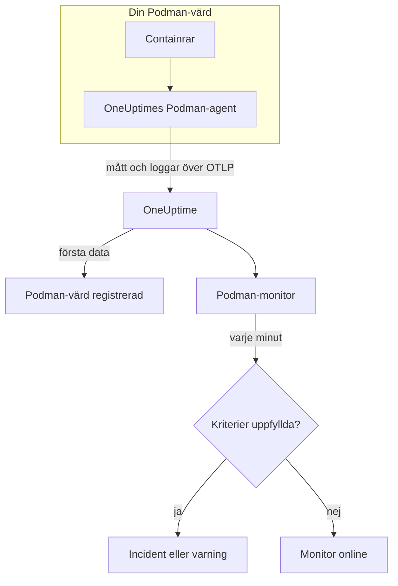

# Podman-övervakning

En Podman-monitor övervakar containrarna på en Podman-värd och säger till när en container går varm, får slut på minne eller startar om gång på gång. Den läser de mätvärden som OneUptimes Podman-agent skickar från värden, så ingenting undersöks utifrån: installera agenten och skapa sedan monitorn från en mall eller din egen fråga.

:::cards
- [Skapa monitorn](#skapa-en-podman-monitor): Sex steg i instrumentpanelen.
- [Mallar](#färdiga-varningsmallar): Fem färdiga varningar, en incident per container.
- [Mätvärden](#insamlade-mätvärden): Vad agenten samlar in och vad varje mätvärde betyder.
- [Loggar](#insamlade-loggar): Containerloggar och den loggdrivrutin de behöver.
:::

## Så fungerar det

OneUptimes Podman-agent körs som en container på värden. Var 30:e sekund läser den containerstatistik via Podmans Docker-kompatibla API-socket, följer containrarnas loggfiler och skickar båda till OneUptime över OTLP. De första data från en värd registrerar den i OneUptime.

En Podman-monitor är knuten till en värd. Varje minut kör den sin fråga över värdens containermått och jämför resultatet med sina kriterier.



## Innan du börjar

- **Installera Podman-agenten** på värden. [Guiden för Podman-agenten](/docs/telemetry/podman-host) beskriver installation, uppgradering och kontroll. Agenten behöver Podmans API-socket på `/run/podman/podman.sock`.
- **Kontrollera att värden är registrerad.** Den visas under **Produkter → Infrastruktur → Podman → Alla värdar**, namngiven efter agentens `PODMAN_HOST_NAME`, så snart dess första data kommer.
- **För containerloggar** kör du containrarna med loggdrivrutinen `k8s-file`. Se [Krav på loggdrivrutin](#krav-på-loggdrivrutin).

## Skapa en Podman-monitor

:::steps
### Starta en ny monitor

Gå till **Monitorer** och klicka på **Skapa monitor**.

### Välj Podman Container

Klicka på **Fler monitortyper** under **Monitortyp** och välj **Podman Container** under **Infrastruktur**, eller skriv `podman` i sökrutan. Ange ett **Namn** – det används i titlar på incidenter och varningar – och klicka på **Nästa**.

### Välj värden

Välj värden i **Podman Host** under **Podman Monitor Configuration**. Varje värd som har skickat data finns i listan.

### Välj vad som ska övervakas

Välj en av de tre flikarna:

- **Quick Setup** – klicka på en [mall](#färdiga-varningsmallar). Den anger mätvärdet, aggregeringen, tidsintervallet och trösklarna och ersätter kriterierna nedan med sina egna. Du kan fortfarande ändra **Tidsintervall**.
- **Custom Metric** – välj ett mätvärde i **Podman Metric** och ange sedan **Aggregering** och **Tidsintervall**. **Containernamn** och **Container-avbildning** begränsar det till vissa containrar.
- **Avancerad** – bygg frågor och formler själv under **Välj mått**. Använd **Group by** `resource.container.name` för att bedöma varje container för sig.

### Kontrollera kriterierna

Öppna varje kriterium under **Monitorkriterier** och kontrollera dess **Mätvärde**, **Aggregering**, **Villkor** och **Threshold**. En mall fyller i dem. Med **Custom Metric** eller **Avancerad** börjar monitorn med [standardkriterierna](#standardkriterier), som bara märker att ett mätvärde sjunker till noll, så ange din egen tröskel.

### Skapa monitorn

Klicka på **Skapa monitor**. OneUptime öppnar monitorns sida och utvärderar den varje minut. Incidenter och varningar som den öppnar visas också på värdens sidor **Incidenter** och **Varningar**.
:::

> [!TIP]
> För att ställa in flera mallar på en gång öppnar du värden från **Produkter → Infrastruktur → Podman** och går till **Recommendations**. Välj de mallar du vill ha och vem som ska larmas, så skapar OneUptime en monitor per mall.

## Monitorinställningar

| Fält | Flik | Vad det gör |
| --- | --- | --- |
| **Podman Host** | Alla | Krävs. Begränsar varje fråga till värdens `resource.host.name`. OneUptime lägger också till `resource.container.runtime = podman` i varje fråga. |
| **Podman Metric** | Custom Metric | Ett mätvärde från agentens katalog, grupperat som CPU, minne, nätverk, block-I/O och container. |
| **Containernamn** | Custom Metric, Avancerad | Valfritt. Exakt matchning mot `resource.container.name`, till exempel `my-container`. |
| **Container-avbildning** | Custom Metric, Avancerad | Valfritt. Exakt matchning mot `resource.container.image.name`, till exempel `nginx:latest`. |
| **Aggregering** | Custom Metric | Hur mätningar kombineras: **Genomsnitt**, **Maximum**, **Minimum**, **Summa** eller **Antal**. Börjar på mätvärdets vanliga aggregering. |
| **Tidsintervall** | Alla | Det glidande fönster som frågan läser, från **Past 1 Minute** till **Past 365 Days**. En ny monitor börjar på **Past 1 Minute**; mallar anger sitt eget. |
| **Välj mått** | Avancerad | Frågebyggaren: **Mätvärde**, **Aggregate by**, **Filter by attributes**, **Group by**, plus **Lägg till mätvärde** och **Lägg till formel** för att kombinera frågor. |

## Färdiga varningsmallar

**Quick Setup** erbjuder fem mallar. Varje mall bygger en komplett monitor: en fråga grupperad efter `resource.container.name`, ett kriterium som utlöses och ett som återställer. Varje container bedöms för sig och får en egen incident och en egen varning. Trösklarna är utgångspunkter som du kan redigera.

Ett kriterium utlöses bara när villkoret gäller varje minut i fönstret, och det återställs 10 % förbi tröskeln, så att ett värde som pendlar vid gränsen inte fladdrar.

| Mall | Allvarlighetsgrad | Övervakar | Utlöses när | Återställs när |
| --- | --- | --- | --- | --- |
| High Container CPU Usage | Warning | `container.cpu.utilization`, Avg per container, senaste 5 minuterna | Över 80 (% av en kärna) | Vid eller under 72 |
| High Container Memory Usage | Warning | `container.memory.percent`, Avg per container, senaste 5 minuterna | Över 85 % | Vid eller under 76,5 % |
| High Container Restart Count | Kritisk | `container.restarts`, Max per container, senaste 5 minuterna | Över 5 omstarter totalt | 4,5 eller färre |
| High Container Process Count | Warning | `container.pids.count`, Max per container, senaste 5 minuterna | Över 500 | Vid eller under 450 |
| Container Restarted (Low Uptime) | Kritisk | `container.uptime`, Min per container, senaste 1 minuten | Under 120 sekunder | Vid eller över 132 sekunder |

**Allvarlighetsgrad** är etiketten som väljaren visar. Incidenten och varningen som en mall skapar börjar på projektets allvarligaste incident- och varningsgrad; ändra dem i kriterierna.

De två procentmallarna använder **Genomsnitt**: deras mätvärden är redan procentsatser per container, så genomsnittet för en minut är det ihållande värdet. Antal omstarter och antal processer använder **Maximum**, där en enda mätning över tröskeln är signalen.

> [!NOTE]
> `container.cpu.utilization` är talet som `podman stats` skriver ut: 100 % är en hel CPU-kärna, inte containerns hela CPU-tilldelning. En container som har fått flera kärnor ligger långt över 100 när den är frisk, så höj tröskeln för sådana.

> [!NOTE]
> `container.restarts` är en löpande summa som Podman håller, inte ett antal omstarter i fönstret. **High Container Restart Count** förblir därför öppen tills containern återskapas, vilket nollställer antalet.

> [!CAUTION]
> `container.uptime` finns bara för körande containrar. En container som stannar och förblir stoppad skickar inga data, så **Container Restarted (Low Uptime)** fångar omstarter och nya driftsättningar, inte en permanent avstängning. En container som är tänkt att köras i mindre än två minuter förblir i varningsläge hela sin livstid.

Det finns ingen mall för CPU-strypning. Strypningsmåtten som agenten samlar in bara växer, och en varning om "överhuvudtaget strypt" skulle utlösas en gång och aldrig upphöra. Båda samlas fortfarande in, så du kan visa dem i diagram.

## Insamlade mätvärden

Agenten använder OpenTelemetry-mottagaren `docker_stats`, riktad mot Podmans Docker-kompatibla socket, `/run/podman/podman.sock`, var 30:e sekund. Varje containers mätvärden bär dess identitet som resursattribut: `resource.container.name`, `resource.container.image.name`, `resource.container.id`, `resource.container.runtime` (`podman`) och `resource.host.name`.

### CPU

| Mätvärde | Beskrivning |
| --- | --- |
| `container.cpu.utilization` | Containerns CPU-utnyttjande, där 100 % är en hel CPU-kärna. |
| `container.cpu.usage.total` | Använd CPU-tid sedan containern startade, i nanosekunder. En räknare över hela livstiden. |
| `container.cpu.throttling_data.throttled_time` | Nanosekunder som containern har strypts av sin CPU-gräns. En räknare över hela livstiden. |
| `container.cpu.throttling_data.throttled_periods` | Strypningsperioder sedan containern startade. En räknare över hela livstiden. |

### Minne

| Mätvärde | Beskrivning |
| --- | --- |
| `container.memory.usage.total` | Minne som används, i byte. |
| `container.memory.usage.limit` | Minnesgräns, i byte. |
| `container.memory.percent` | Minnesanvändning som procentandel av containerns gräns, eller av värdens minne när containern inte har någon gräns. |

### Nätverk

| Mätvärde | Beskrivning |
| --- | --- |
| `container.network.io.usage.rx_bytes` | Mottagna byte. En räknare över hela livstiden. |
| `container.network.io.usage.tx_bytes` | Skickade byte. En räknare över hela livstiden. |

### Block-I/O

| Mätvärde | Beskrivning |
| --- | --- |
| `container.blockio.io_service_bytes_recursive.read` | Byte lästa från blockenheter. |
| `container.blockio.io_service_bytes_recursive.write` | Byte skrivna till blockenheter. |

### Container

| Mätvärde | Beskrivning |
| --- | --- |
| `container.uptime` | Sekunder sedan containern startade. Bara körande containrar rapporterar det. |
| `container.restarts` | Antal gånger containern har startats om. En löpande summa. |
| `container.pids.count` | Uppgifter i containern. Cgroupens pids-kontrollant räknar trådar lika väl som processer. |

Listan **Podman Metric** erbjuder också `container.cpu.usage.percpu`, `container.memory.rss`, `container.memory.cache` och räknarna för nätverkspaket. Den medföljande agentkonfigurationen slår inte på dem, så kontrollera värdens sida **Mätvärden** innan du bygger på dem. `container.cpu.throttling_data.throttled_periods` finns inte i listan; fråga efter det från **Avancerad**.

## Övervakningskriterier

Ett kriterium jämför en av monitorns frågor eller formler med en tröskel. En Podman-monitors kriterier har ingen **Filtertyp**: varje regel kontrollerar mätvärdet, med de här fälten.

| Fält | Vad det gör |
| --- | --- |
| **Mätvärde** | Frågan eller formeln som kontrolleras, efter dess variabelnamn. |
| **Aggregering** | Hur värdena i fönstret blir ett svar: **Genomsnitt**, **Summa**, **Maximum Value**, **Minimum Value**, **All Values** (varje värde måste matcha) eller **Any Value** (ett räcker). |
| **Villkor** | **Greater Than**, **Less Than**, **Greater Than Or Equal To**, **Less Than Or Equal To** eller **Equal To** – eller ett avvikelsevillkor: **Anomalously High**, **Anomalously Low** eller **Anomalous**. |
| **Threshold** | Värdet att jämföra med. En lista med enheter står bredvid när mätvärdet har en enhet. Visas inte för avvikelsevillkor. |
| **Känslighet** | Bara avvikelsevillkor. **Låg** (4σ), **Medel** (3σ, standard) eller **Hög** (2σ). |
| **Baslinjefönster** | Bara avvikelsevillkor. 14 dagar (standard), 28, 60 eller 90 dagars historik. |
| **Om ingen data** | Under **Fler fält**. Vad som händer när fönstret saknar mätningar: **Ignore** (standard), **Treat As Zero** eller **Utlösare**. |

Avvikelsevillkor jämför varje värde med samma timme i veckan i baslinjen. De stannar i ett "Learning"-läge och ger ingenting förrän baslinjefönstret innehåller tillräckligt med historik.

Varje kriterium anger också vad som ska hända när det matchar: ändra monitorns status, skapa en varning eller deklarera en incident. Kriterierna kontrolleras uppifrån och ned, och det första som matchar avgör.

### Standardkriterier

En monitor som du inte bygger från en mall börjar med två kriterier:

| Ordning | Kriterium | Matchar när | Sedan |
| --- | --- | --- | --- |
| 1 | Check if _monitor name_ is offline | Något värde i den första frågan är `0` | Markerar monitorn som **Offline** och deklarerar incidenten "_monitor name_ is offline", som löser sig själv när monitorn återhämtar sig. |
| 2 | Check if _monitor name_ is online | Något värde är över `0` | Markerar monitorn som **Fungerar**. |

> [!IMPORTANT]
> Tystnad matchar inget av kriterierna: en värd som slutar skicka data lämnar monitorn som den var. För att få veta när data slutar komma ställer du in **Om ingen data** på **Utlösare** i ett kriterium. Tid då OneUptime själv inte tog emot data är aldrig saknade data: en kontroll vars fönster innehåller sådan tid väntar i stället, som [När OneUptime inte tar emot data](/docs/monitor/when-oneuptime-is-not-receiving) förklarar.

## Insamlade loggar

Agenten följer också varje containers fil `ctr.log` och skickar varje rad som en OpenTelemetry-loggpost med:

| Fält | Värde |
| --- | --- |
| `resource.host.name` | Värden, från `PODMAN_HOST_NAME`. |
| `resource.container.id` | Det fullständiga container-ID:t. |
| `resource.container.runtime` | Alltid `podman`. |
| `attributes["log.iostream"]` | `stdout` eller `stderr`. |
| `severityText` / `severityNumber` | Läses från ett nivånyckelord där en nivå står i raden (`[ERROR]`, `app.INFO:`, `{"level":"warn"}`, `level=error`). En rad utan nivå faller tillbaka på sin ström: `stderr` är `ERROR`, `stdout` är `INFO`. |
| `body` | Raden som containern skrev. Rader som börjar med blanksteg eller en avslutande parentes, som rader i en stackspårning, läggs till raden före. |
| `time` | Podmans tidsstämpel för raden. |

Loggar visas på värdens sida **Loggar** och på varje containers sida.

### Krav på loggdrivrutin

Agenten läser filerna som Podmans loggdrivrutin `k8s-file` skriver, i `/var/lib/containers/storage/overlay-containers/*/userdata/ctr.log`. Rootful Podman använder `journald` som standard, som i stället skriver till systemd-journalen, så det finns ingen fil att läsa:

| Drivrutin | Vad agenten ser |
| --- | --- |
| `k8s-file` (eller `json-file`, som Podman behandlar på samma sätt) | Varje rad. |
| `journald` | Ingenting: loggarna finns i systemd-journalen. |
| `none` | Ingenting: loggarna kastas. |

Mätvärden beror inte på loggdrivrutinen: en värd vars containrar använder `journald` rapporterar fortfarande mätvärden, bara dess sida **Loggar** förblir tom.

Kontrollera en containers drivrutin och Podmans standard:

```bash
podman inspect <container> --format '{{.HostConfig.LogConfig.Type}}'
podman info --format '{{.Host.LogDriver}}'
```

Byt till `k8s-file`. Podman bestämmer en containers loggdrivrutin när containern skapas, så återskapa varje container efter ändringen – en omstart behåller den gamla drivrutinen.

:::tabs
@tab podman run
Starta containern med drivrutinen:

```bash
podman run --log-driver k8s-file ... <image>
```

För att byta en befintlig container tar du bort den och kör den igen:

```bash
podman rm -f <container>
podman run --log-driver k8s-file ... <image>
```
@tab Podman Compose
Ange drivrutinen för varje tjänst:

```yaml title="docker-compose.yml"
services:
  my-app:
    image: my-app:latest
    logging:
      driver: "k8s-file"
      options:
        max-size: "100m"
```

Återskapa sedan tjänsten:

```bash
podman compose up -d --force-recreate <service>
```
@tab containers.conf
Gör `k8s-file` till standard för varje container som skapas efteråt, i `/etc/containers/containers.conf` (rootful) eller `~/.config/containers/containers.conf` (rootless):

```toml title="containers.conf"
[containers]
log_driver = "k8s-file"
```

Ta sedan bort och återskapa varje container.
:::

## Felsökning

:::details Värden finns inte i listan Podman Host
Värdar registrerar sig själva utifrån agentens data. Kontrollera att agentcontainern körs, att Podmans API-socket är aktiverad och att värden finns under **Produkter → Infrastruktur → Podman → Alla värdar**. [Guiden för Podman-agenten](/docs/telemetry/podman-host) har kontrollerna du kan köra på värden.
:::

:::details Mätvärden kommer men sidan Loggar är tom
Containrarna använder nästan säkert `journald`. Byt de containrar vars loggar du vill ha till `k8s-file` (se [Krav på loggdrivrutin](#krav-på-loggdrivrutin)) och återskapa dem.
:::

:::details Agenten loggar "no files match the configured criteria"
Agenten letar efter `/var/lib/containers/storage/overlay-containers/*/userdata/ctr.log` och hittade ingenting. Antingen använder ingen container på värden `k8s-file`, eller så saknas agentens montering av `/var/lib/containers/storage` eller är tom, eller så körs agenten och containrarna i olika lägen – rootless-containrar har sin lagring på ett ställe som rootful-sökvägen inte täcker, och tvärtom.
:::

:::details Data kommer under fel värdnamn
OneUptime identifierar en värd med `resource.host.name`, som agenten tar från `PODMAN_HOST_NAME`. Om du ändrar `PODMAN_HOST_NAME` efter de första data skapas en andra värd i stället för att den första byter namn, och en monitor förblir knuten till namnet den skapades med.
:::

:::details En CPU-varning utlöses aldrig
Gruppera frågan efter `resource.container.name`, som mallen **High Container CPU Usage** gör, så att varje container bedöms för sig. Ett genomsnitt över alla containrar på en upptagen värd dras ned av de inaktiva. Kom ihåg att 100 % betyder en hel kärna, så en container som får använda flera kärnor behöver en högre tröskel.
:::

:::details Varningen för antal omstarter upphör aldrig
`container.restarts` är en löpande summa, så den sjunker inte under tröskeln av sig själv. Åtgärda orsaken och återskapa sedan containern för att nollställa antalet, eller höj tröskeln.
:::

## Nästa steg

:::cards
- [Podman-agent](/docs/telemetry/podman-host): Installera, uppgradera och felsök agenten som den här monitorn läser.
- [Docker-övervakning](/docs/monitor/docker-monitor): Samma monitor för Docker-värdar.
- [Incidenter – Översikt](/docs/incidents/index): Vad som händer efter att ett kriterium har deklarerat en incident.
- [Jourscheman](/docs/on-call/schedules): Bestäm vem som larmas när en container går sönder.
:::
