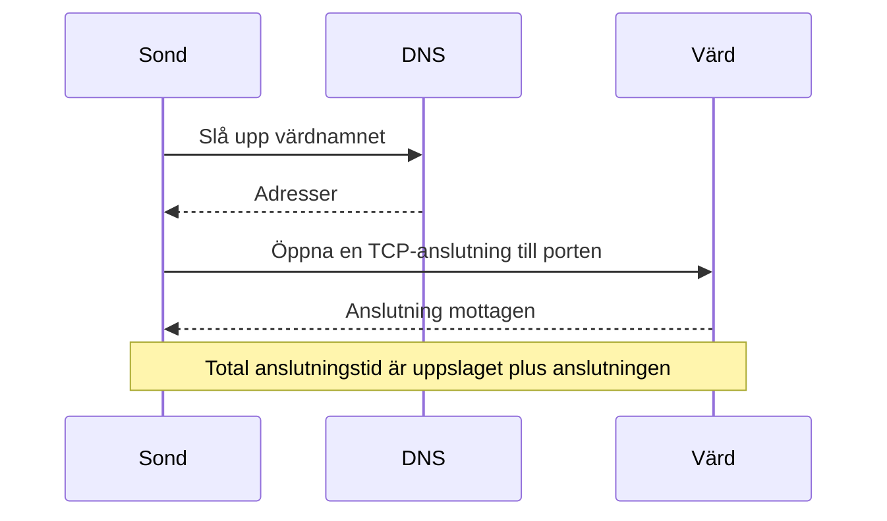

# Portövervakning

En portmonitor kontrollerar att en värd tar emot TCP-anslutningar på en port, och mäter hur lång tid anslutningen tar. Använd den för tjänster som inte talar HTTP, eller vars HTTP du inte vill kontrollera: databaser, e-postservrar, SSH, meddelandeköer och liknande.

:::cards
- [Skapa monitorn](#skapa-en-portmonitor): Sex steg i instrumentpanelen.
- [Anslutningstider](#anslutningstider): Vad DNS-, TCP- och totaltiderna mäter.
- [Övervakningskriterier](#övervakningskriterier): Nåbarhet och anslutningstider.
- [Felsökning](#felsökning): När tjänsten körs men monitorn säger offline.
:::

## Så fungerar det

Vid varje kontroll slår en sond upp värdnamnet, om du angav ett, och öppnar en TCP-anslutning till porten. Porten är online så snart anslutningen tas emot; sonden stänger den sedan utan att skicka något. En anslutning som nekas eller når tidsgränsen görs om, upp till det antal återförsök du tillåter. Sedan kör OneUptime resultatet genom monitorns kriterier.

Sonden öppnar bara TCP-anslutningar: en tjänst som bara lyssnar på UDP, som en SNMP-agent, kan inte kontrolleras med en portmonitor.

När en kontroll misslyckas spårar sonden också vägen till värden och slår upp dess namn, och bifogar det den hittade till resultatet som **Network Path at Time of Failure**, så att du ser var vägen bröts. En sond som har förlorat sin egen nätverksanslutning rapporterar inget resultat, så den kan inte markera din tjänst som offline.

## Innan du börjar

- **En roll som kan skapa monitorer**: Project Owner, Project Admin, Project Member, Monitor Admin eller Monitor Member, eller en anpassad roll med behörigheten Create Monitor.
- **En sond som når porten.** Projektets standardsonder väljs för varje ny monitor. Om en brandvägg står framför tjänsten tillåter du [OneUptime Clouds sond-IP-adresser](/docs/configuration/ip-addresses) att ansluta till porten. En tjänst i ett privat nätverk, som en databas, behöver en [anpassad sond](/docs/probe/custom-probe) i det nätverket.

## Skapa en portmonitor

:::steps
### Börja en ny monitor

Gå till **Monitorer** och klicka på **Skapa monitor**. Välj **Port** under **Monitortyp**.

### Namnge den

Ange ett **Namn**, som `Orders database`, och klicka sedan på **Nästa**.

### Ange värden och porten

Ange under **Värdnamn eller IP-adress** den värd som porten finns på, som `db.example.com` eller `10.0.0.12`. Ange portnumret under **Port**, som `5432`.

### Testa den

Klicka på **Testa monitor**, välj en sond under **Välj sond** och klicka på **Kör test**. **Resultat av övervakningstest** visar om anslutningen öppnades och hur lång tid varje del tog.

### Gå igenom kriterierna

**Monitorkriterier** börjar med [standardkriterierna](#standardkriterier): offline när porten inte tar emot en anslutning, online när den gör det. Ändra dem vid behov och klicka sedan på **Nästa**.

### Välj sonder och skapa

Behåll eller ändra **Sonder** och **Övervakningsintervall** (det börjar på **Var 5:e minut**) och klicka sedan på **Skapa monitor**. Monitorns sida öppnas.
:::

## Konfigurationsalternativ

| Fält | Standard | Vad du anger |
| --- | --- | --- |
| **Värdnamn eller IP-adress** | Ingen | Värden, som `example.com`, `192.168.1.1` eller `2001:db8::1`. Ange bara värden, utan `http://`. |
| **Port** | Ingen | TCP-porten som det ansluts till, från `1` till `65535`. |
| **Begärandetimeout (sekunder)** (under **Fler fält**) | `60` | Hur lång tid ett försök får ta, DNS-uppslaget och TCP-anslutningen tillsammans. Maxvärdet är 60 sekunder. |
| **Återförsök vid misslyckande** (under **Fler fält**) | Sondens standard, oftast `3` | Hur många gånger ett misslyckat försök görs om. Maxvärdet är 3. |

**Återförsök vid misslyckande** räknar återförsök _efter_ det första försöket, så `0` kör kontrollen en gång och `2` upp till tre gånger. Lämnas fältet tomt används sondens standard: 3, om inte sondens `PROBE_MONITOR_RETRY_LIMIT` säger något annat. Varje fel görs om, tidsgränser inräknade, med en paus på en sekund mellan försöken. En lyckad anslutning som tog längre än 10 sekunder kontrolleras också igen.

Vanliga portar:

| Port | Tjänst |
| --- | --- |
| `22` | SSH |
| `25` | SMTP |
| `80` | HTTP |
| `443` | HTTPS |
| `3306` | MySQL |
| `5432` | PostgreSQL |
| `6379` | Redis |
| `27017` | MongoDB |

> [!NOTE]
> Många värdleverantörer blockerar utgående SMTP. På en sond som inte kan skicka ping, vilket är hur en sond märker att den körs hos en sådan leverantör, räknas en kontroll av port `25` som når tidsgränsen som online. För att pålitligt kontrollera port `25` på en e-postserver kör du monitorn på en [anpassad sond](/docs/probe/custom-probe) som får ansluta till den.

## Anslutningstider

För ett värdnamn mäter sonden kontrollen i två faser:

| Fas | Från | Till |
| --- | --- | --- |
| **DNS-uppslag** | Kontrollens början | Det första TCP-anslutningsförsöket |
| **TCP-anslutning** | Det första TCP-anslutningsförsöket | Att anslutningen tas emot, inklusive tiden för att växla mellan IPv6- och IPv4-adresser |

**Total Connection Time (DNS + TCP)** löper från kontrollens början tills anslutningen tas emot. Det är också portmonitorns svarstid, så befintliga kriterier, larm och diagram som använder svarstiden fortsätter att fungera.

När målet är en IP-adress finns inget DNS-uppslag, så den fasen utelämnas. Kontrollresultat från innan fastiderna fanns visar bara den totala anslutningstiden.

## Övervakningskriterier

Kriterier avgör när porten räknas som online, försämrad eller offline, och om det deklarerar en incident eller skapar ett larm. Varje kriterium kontrollerar ett eller flera filter:

| Filter | Villkor | Vad det kontrollerar |
| --- | --- | --- |
| **Is Online** | **Sant**, **Falskt** | Om porten tog emot en anslutning. |
| **Total Connection Time (DNS + TCP) (in ms)** | **Greater Than**, **Less Than**, **Greater Than Or Equal To**, **Less Than Or Equal To** | Hela anslutningstiden, inklusive DNS-uppslaget för ett värdnamn. |
| **Port DNS Lookup Time (in ms)** | **Greater Than**, **Less Than**, **Greater Than Or Equal To**, **Less Than Or Equal To** | DNS-uppslaget före det första TCP-försöket. Det har inget värde när målet är en IP-adress. |
| **Port TCP Connect Time (in ms)** | **Greater Than**, **Less Than**, **Greater Than Or Equal To**, **Less Than Or Equal To** | Från det första TCP-försöket tills anslutningen tas emot, inklusive växling mellan IPv6 och IPv4. |
| **Is Request Timeout** | **Sant**, **Falskt** | Om DNS-uppslaget eller TCP-anslutningen överskred tidsgränsen vid varje försök. |

Ett kriterium för DNS-uppslagstid har inget att utvärdera när målet är en IP-adress. För kriterier som måste fungera med både värdnamn och IP-adresser använder du totaltiden eller TCP-anslutningstiden.

Med två eller fler filter avgör **Matchningsvillkor** om **Alla** måste matcha eller om **Valfri** av dem räcker. Ett kriteriums **Åtgärder** avgör vad det gör: ändrar monitorns status, skapar ett larm, deklarerar en incident eller flera av dessa.

### Standardkriterier

En ny portmonitor börjar med två kriterier:

- **Offline** — porten tar inte emot någon anslutning efter alla återförsök. Monitorn markeras som **Offline** och en incident som heter "_monitor name_ is offline" skapas. Incidenten löser sig själv när porten tar emot anslutningar igen.
- **Uppe** — porten tar emot en anslutning. Monitorn markeras som **Fungerar**.

Kriterier kontrolleras uppifrån och ned, och det första som matchar avgör vad som händer. När inget matchar visar monitorn sin standardstatus: **Fungerar**, om du inte väljer en annan under **Fler fält** under kriterierna.

### Utvärdering över en tidsperiod

**Utvärdera dessa kriterier över en tidsperiod** är en kryssruta under ett filter, som erbjuds för **Is Online**, **Total Connection Time (DNS + TCP) (in ms)**, **Port DNS Lookup Time (in ms)** och **Port TCP Connect Time (in ms)**. Slå på den för att bedöma ett fönster av tidigare kontroller i stället för bara den senaste: välj en aggregering under **Utvärdera** och ett fönster från 2 till 60 minuter under **Under de senaste (i minuter)**.

| Aggregering | Matchar när |
| --- | --- |
| **Genomsnitt**, **Summa**, **Maximum Value**, **Minimum Value** | Det värdet över fönstret uppfyller villkoret. Bara numeriska filter. |
| **All Values** | Varje kontroll i fönstret uppfyller villkoret. |
| **Any Value** | Minst en kontroll i fönstret uppfyller villkoret. |

**All Values** matchar först när fönstret verkligen täcks av data. En monitor som just skapats, eller en vars kontroller slutade registreras, har inte tillräcklig historik för att säga något om de senaste N minuterna, så kriteriet väntar i stället för att matcha på den enda mätning det har. **Any Value** är inställningen för "säg till direkt när en enda kontroll går över gränsen" och utlöses fortfarande omedelbart.

**Om ingen data** avgör vad som händer så länge fönstret inte kan bära kriteriet:

| Alternativ | Vad som händer | Använd det för |
| --- | --- | --- |
| **Ignore** (standard) | Kriteriet matchar inte. | Vanliga tröskellarm. |
| **Utlösare** | Den saknade datan räknas som problemet. | Kontroller där tystnad i sig är ett fel. |
| **Treat As Zero** | Fönstret jämförs som en enda nolla. | Räknare där inga händelser verkligen betyder noll. |

### Exempelkriterier

| Mål | Filter | Villkor | Värde |
| --- | --- | --- | --- |
| Offline när porten är stängd | **Is Online** | **Falskt** | — |
| Larma när anslutningen är långsam | **Total Connection Time (DNS + TCP) (in ms)** | **Greater Than** | `500` |
| Markera tjänsten som försämrad när den är långsam att ansluta | **Total Connection Time (DNS + TCP) (in ms)** | **Greater Than** | `200` |
| Larma när DNS är långsam | **Port DNS Lookup Time (in ms)** | **Greater Than** | `100` |
| Larma när TCP-handskakningen är långsam | **Port TCP Connect Time (in ms)** | **Greater Than** | `250` |

## Felsökning

:::details Tjänsten körs, men monitorn säger offline
Sonden kunde inte öppna en anslutning: en brandvägg släpper den, tjänsten lyssnar bara på ett privat gränssnitt, eller porten är fel. Incidentens rotorsak och **Övervakningsloggar** på monitorn visar felet, och **Network Path at Time of Failure** visar hur långt vägen nådde. Släpp igenom sonderna i brandväggen, eller använd en [anpassad sond](/docs/probe/custom-probe) inuti nätverket.
:::

:::details DNS-uppslagstiden är alltid tom
Målet är en IP-adress, så det finns inget att slå upp. Använd i stället **Total Connection Time (DNS + TCP) (in ms)** eller **Port TCP Connect Time (in ms)**.
:::

:::details Jag behöver kontrollera en UDP-tjänst
Portmonitorer öppnar bara TCP-anslutningar. För en DNS-server använder du en [DNS-monitor](/docs/monitor/dns-monitor), och för en tidsserver på UDP-port 123 en [NTP-monitor](/docs/monitor/ntp-monitor). Båda skickar riktiga frågor.
:::

## Nästa steg

:::cards
- [Ping-övervakning](/docs/monitor/ping-monitor): Kontrollera att värden själv kan nås.
- [Övervakning av SSL-certifikat](/docs/monitor/ssl-certificate-monitor): Kontrollera certifikatet på en TLS-port.
- [Övervakning av databashälsa](/docs/monitor/database-health-monitor): Gå längre än en öppen port och bevaka en databas hälsa.
- [Anpassade probes](/docs/probe/custom-probe): Kontrollera portar i ditt eget nätverk.
:::
