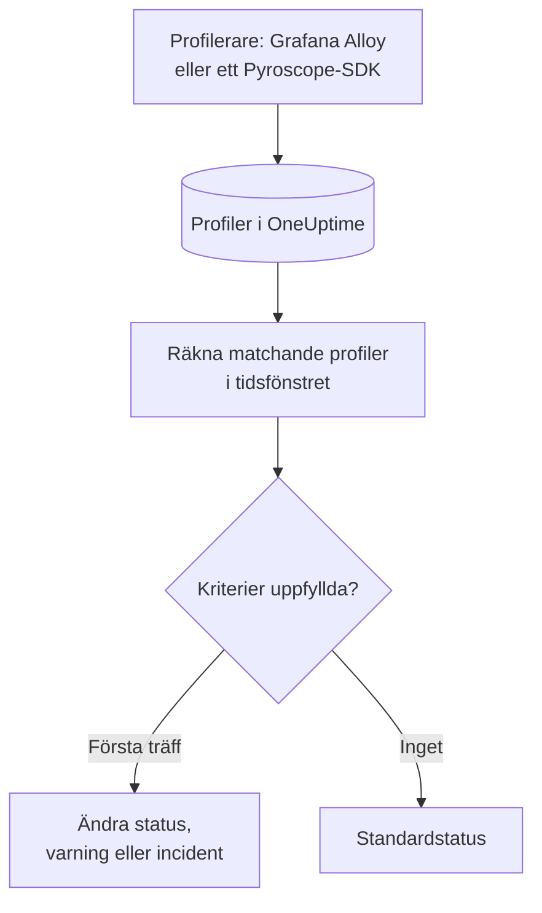

# Profilövervakning

En profilmonitor räknar inom ett tidsfönster de kontinuerliga profiler som dina tjänster skickar till OneUptime och som matchar dina filter (profiltyp, tjänst, attribut). När antalet uppfyller dina kriterier ändrar den monitorns status, skapar en varning eller deklarerar en incident. Den används främst för att märka när profileringsdata slutar komma från en tjänst.

> [!IMPORTANT]
> **Skapa monitor** i instrumentpanelen erbjuder inte Profiles: det finns ännu inget formulär för dess filter. Skapa en profilmonitor via [API:et](/docs/api-reference/api-reference) eller [Terraform](/docs/terraform/monitor-steps), som beskrivs nedan. När den finns kan du se och redigera dess kriterier på monitorns sida **Kriterier** i instrumentpanelen; dess filter kan bara ändras via API:et eller Terraform.

:::cards
- [Skapa monitorn](#skapa-en-profilmonitor): Konfigurationen som du skickar via API:et eller Terraform.
- [Vad den frågar efter](#vad-den-frågar-efter): Profiltyper, tjänster, attribut och fönstret.
- [Kriterier](#kriterier): Villkoren som du kan använda.
- [Genomgånget exempel](#genomgånget-exempel-profiler-slutar-komma): Få veta när en tjänst slutar skicka profiler.
:::

## Så fungerar det



Varje minut räknar OneUptime de profiler som matchar monitorns filter och startade inom dess tidsfönster. Antalet jämförs med monitorns kriterier uppifrån och ned, och det första kriteriet som matchar avgör vad som händer. När inget matchar går monitorn tillbaka till sin standardstatus.

## Innan du börjar

- Dina tjänster skickar kontinuerliga profileringsdata till OneUptime via Grafana Alloy (eBPF) eller ett Pyroscope-SDK. Se [Kontinuerlig profilering](/docs/telemetry/profiles).
- Du har antingen en API-nyckel som kan skapa monitorer eller OneUptimes Terraform-provider konfigurerad.
- Du känner till ID:t för varje telemetritjänst som ska övervakas och de profiltyper som den skickar, som `cpu`, `wall`, `alloc_objects`, `alloc_space` eller `goroutine`.

## Skapa en profilmonitor

:::steps
### Välj vad som ska räknas

Skriv stegets `profileMonitor`-konfiguration. Den här räknar CPU-profiler från en tjänst under de senaste fem minuterna:

```json
{
  "profileMonitor": {
    "telemetryServiceIds": [],
    "profileTypes": ["cpu"],
    "profileType": "",
    "attributes": {},
    "lastXSecondsOfProfiles": 300
  }
}
```

Lägg tjänstens ID i `telemetryServiceIds`, eller lämna listan tom för att räkna profiler från alla tjänster. [Vad den frågar efter](#vad-den-frågar-efter) beskriver varje fält.

### Skapa monitorn

Skapa via [API:et](/docs/api-reference/api-reference) eller [Terraform](/docs/terraform/monitor-steps) en monitor med monitortypen `Profiles` och ett steg som innehåller den här konfigurationen och minst ett kriterium. I Terraform skickar du konfigurationen som stegets attribut `profile_monitor`, skriven med `jsonencode()`.

### Kontrollera den i instrumentpanelen

Öppna monitorn från **Monitorer**. Dess första utvärdering körs inom en minut, och dess status ändras så snart ett kriterium matchar.
:::

## Vad den frågar efter

| Fält | Vad det matchar | Standard |
| --- | --- | --- |
| `profileTypes` | Profiler av någon av dessa typer, jämförda exakt, som `cpu`. | Tomt: alla typer |
| `profileType` | Profiler vars typ innehåller denna text, utan skillnad på versaler och gemener. När det är angivet ignoreras `profileTypes`. | Tomt |
| `telemetryServiceIds` | Profiler från någon av dessa telemetritjänster. | Tomt: alla tjänster |
| `entityKeys` | Profiler från någon av dessa värdar, poddar, containrar och andra infrastrukturentiteter. | Tomt: alla entiteter |
| `attributes` | Profiler vars attribut har dessa värden. | Tomt: inga villkor |
| `lastXSecondsOfProfiles` | Profiler som startade inom så här många sekunder före utvärderingen. | Inget: ange det alltid, annars räknas varje lagrad profil och antalet sjunker aldrig till 0 |

Alla filter som du anger måste matcha för att en profil ska räknas.

## Så utvärderas den

- **Varje minut.** En profilmonitor kontrolleras inte av sonder, så den har inget intervall att ange och ingen sida **Sonder och intervall**.
- **Ett tal per utvärdering.** Monitorn räknar de profiler som matchar alla filter och startade inom `lastXSecondsOfProfiles`. En profilerare laddar upp med ett jämnt intervall, så ge fönstret utrymme för flera uppladdningar.
- **Inga profiler är ett antal på 0.** En tjänst vars profilerare slutar ladda upp ger 0.
- **OneUptimes eget avbrott är inte tystnad.** Så länge tidsfönstret innehåller tid då OneUptime självt inte tog emot data (det startade om, uppgraderades eller arbetade ikapp en eftersläpning) väntar kontrollen: statusen ändras inte, och ingen incident eller varning öppnas eller löses. Se [När OneUptime inte tar emot data](/docs/monitor/when-oneuptime-is-not-receiving).
- **Kriterier uppifrån och ned.** Det första kriteriet som matchar avgör, så lägg det allvarligaste överst.

Varje statusändring registreras med sin orsak på monitorns **Statustidslinje**.

## Kriterier

En profilmonitors kriterier har ett enda filter, **Profile Count**: antalet profiler som matchade i fönstret. Jämför det med ett värde:

| Filtervillkor | Matchar när antalet profiler är… |
| --- | --- |
| **Greater Than** | över värdet |
| **Greater Than Or Equal To** | lika med värdet eller högre |
| **Less Than** | under värdet |
| **Less Than Or Equal To** | lika med värdet eller lägre |
| **Equal To** | exakt värdet |
| **Not Equal To** | allt utom värdet |

Antal profiler har inga avvikelsevillkor: det finns ingen baslinje att jämföra dem med.

## Genomgånget exempel: profiler slutar komma

Checkout-tjänsten kör ett Pyroscope-SDK som laddar upp CPU-profiler. Du vill ha en incident när de uteblir i fem minuter:

- `profileTypes`: `["cpu"]`, `telemetryServiceIds`: checkout-tjänsten, `lastXSecondsOfProfiles`: `300`
- Kriterium 1: **Profile Count** **Equal To** `0`: markera monitorn som offline och deklarera en incident
- Kriterium 2: **Profile Count** **Greater Than** `0`: markera monitorn som online

Medan SDK:t laddar upp räknar varje utvärdering några profiler och kriterium 2 håller monitorn online. När tjänsten driftsätts utan SDK:t sjunker antalet till 0 fem minuter efter den senaste uppladdningen, kriterium 1 matchar och incidenten deklareras. Den första uppladdningen efter rättningen för antalet över 0 igen, och incidenten löser sig själv om **Lös incident automatiskt** är aktiverat för den.

## Felsökning

:::details Monitorn räknar 0, men profiler visas i OneUptime
Jämför filtren med de profiler som du ser: `profileTypes` måste matcha typen exakt, och `telemetryServiceIds` måste innehålla rätt tjänst-ID:n. Ett kort `lastXSecondsOfProfiles` kan också hamna mellan två uppladdningar.
:::

:::details Profiles saknas i Skapa monitor
Det är förväntat: instrumentpanelen har ännu inget formulär för en profilmonitors filter. Skapa den via API:et eller Terraform, som beskrivs i [Skapa en profilmonitor](#skapa-en-profilmonitor).
:::

## Nästa steg

:::cards
- [Kontinuerlig profilering](/docs/telemetry/profiles): Skicka profiler från Grafana Alloy eller ett Pyroscope-SDK.
- [Monitorsteg](/docs/terraform/monitor-steps): Skicka stegets konfiguration från Terraform.
- [Spårningsövervakning](/docs/monitor/traces-monitor): Varnas om misslyckade spans.
- [Metrikövervakning](/docs/monitor/metrics-monitor): Varnas om CPU, minne och andra mätvärden.
:::
