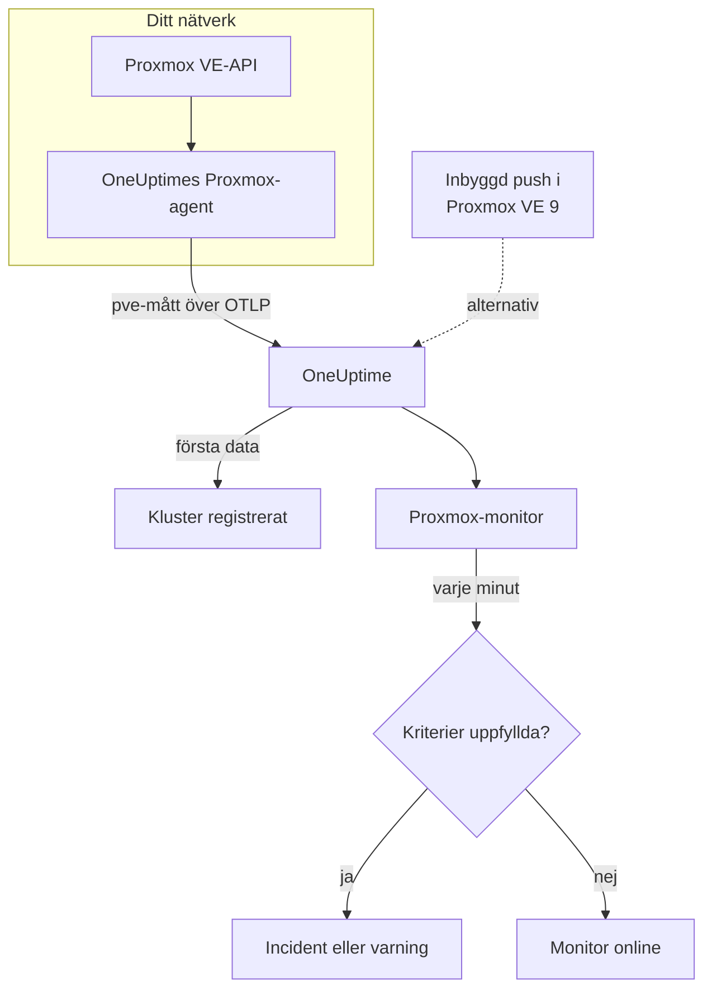

# Proxmox-övervakning

En Proxmox-monitor övervakar ett Proxmox VE-kluster – dess noder, VM:ar och LXC-containrar, lagring, HA-tillstånd, täckning av säkerhetskopieringsjobb och lagringsreplikering – och säger till när en nod går offline, en gäst stannar eller lagringen fylls. Den läser måtten `pve_*` som OneUptimes Proxmox-agent samlar in, så ingenting undersöks utifrån.

:::cards
- [Skapa monitorn](#skapa-en-proxmox-monitor): Sex steg i instrumentpanelen.
- [Mallar](#färdiga-varningsmallar): Elva färdiga varningar, en incident per nod, gäst eller volym.
- [Resursidentitet](#resursidentitet): Så riktar du in dig på en nod, gäst eller lagringsvolym.
- [Mätvärden](#insamlade-mätvärden): Varje serie `pve_*` som monitorn kan varna på.
:::

## Så fungerar det

OneUptimes Proxmox-agent körs på en maskin som når Proxmox VE-API:t. Var 30:e sekund hämtar den data från prometheus-pve-exporter med kluster- och nodinsamlarna, märker varje serie med resursen den beskriver och skickar måtten till OneUptime över OTLP, stämplade med klustrets namn, `proxmox.cluster.name`. De första data registrerar klustret. Proxmox VE 9 och senare kan i stället pusha mått själv, utan att något installeras; se [den inbyggda pushen](#den-inbyggda-pushen-i-proxmox-ve).

En Proxmox-monitor är knuten till ett kluster. Varje minut kör den sin fråga över klustrets mätvärden och jämför resultatet med sina kriterier.

## Innan du börjar

- **Installera Proxmox-agenten** där den når Proxmox VE-API:t, med en skrivskyddad API-token. [Guiden för Proxmox-agenten](/docs/telemetry/proxmox) beskriver token, installationen och den inbyggda pushen.
- **Kontrollera att klustret är registrerat.** Det visas under **Produkter → Infrastruktur → Proxmox → Alla kluster**, namngivet efter agentens `PROXMOX_CLUSTER_NAME`, ungefär en minut efter den första insamlingen.

## Skapa en Proxmox-monitor

:::steps
### Starta en ny monitor

Gå till **Monitorer** och klicka på **Skapa monitor**.

### Välj Proxmox

Klicka på **Fler monitortyper** under **Monitortyp** och välj **Proxmox** under **Infrastruktur**, eller skriv `proxmox` i sökrutan. Ange ett **Namn** – det används i titlar på incidenter och varningar – och klicka på **Nästa**.

### Välj klustret

Välj klustret i **Proxmox Cluster** under **Proxmox Monitor Configuration**. Varje kluster som har skickat data finns i listan.

### Välj vad som ska övervakas

Välj en av de tre flikarna:

- **Quick Setup** – klicka på en [mall](#färdiga-varningsmallar). Den anger mätvärdena, filtren, aggregeringen, tidsintervallet och trösklarna och ersätter kriterierna nedan med sina egna. Du kan fortfarande ändra **Tidsintervall**.
- **Custom Metric** – välj ett mätvärde i **Proxmox Metric** och ange sedan **Aggregering** och **Tidsintervall**. [Filtren](#monitorinställningar) begränsar det till en typ av resurs eller till en resurs.
- **Avancerad** – bygg frågor och formler själv under **Välj mått**, till exempel en minnesprocent från `pve_memory_usage_bytes / pve_memory_size_bytes`. Använd **Group by** `id` för att bedöma varje resurs för sig.

### Kontrollera kriterierna

Öppna varje kriterium under **Monitorkriterier** och kontrollera dess **Mätvärde**, **Aggregering**, **Villkor** och **Threshold**. En mall fyller i dem. Med **Custom Metric** eller **Avancerad** börjar monitorn med [standardkriterierna](#standardkriterier), som bara märker att ett mätvärde sjunker till noll, så ange din egen tröskel.

### Skapa monitorn

Klicka på **Skapa monitor**. OneUptime öppnar monitorns sida och utvärderar den varje minut. Incidenter och varningar som den öppnar visas också på klustrets sidor **Incidenter** och **Varningar**.
:::

> [!TIP]
> För att ställa in flera mallar på en gång öppnar du klustret från **Produkter → Infrastruktur → Proxmox** och går till **Recommendations**. Välj de mallar du vill ha och vem som ska larmas, så skapar OneUptime en monitor per mall.

## Monitorinställningar

| Fält | Flik | Vad det gör |
| --- | --- | --- |
| **Proxmox Cluster** | Alla | Krävs. Begränsar varje fråga till `resource.proxmox.cluster.name`. |
| **Resursomfattning** | Custom Metric, Avancerad | Valfritt. **Nod**, **Guest (VM / container)**, **Lagring** eller **Kluster** – en exakt matchning mot `pve.scope`. |
| **PVE ID** | Custom Metric, Avancerad | Valfritt. Exakt matchning mot `pve.id`: ett nodnamn (`pve1`), ett VMID (`100`) eller `<node>/<storage>` (`pve1/local`). Kombinera det med en omfattning för att rikta in dig på en resurs. |
| **Nodnamn** | Custom Metric, Avancerad | Valfritt. Bara en nods egna serier (`pve.scope = node` och `pve.id`). Det kan inte välja gästerna eller lagringen på den noden. |
| **Guest ID** | Custom Metric, Avancerad | Valfritt. Exakt matchning mot den råa etiketten `id`, till exempel `qemu/100` eller `lxc/101`. När det är angivet ignoreras de andra filtren. |
| **Proxmox Metric** | Custom Metric | Ett mätvärde från [katalogen](#insamlade-mätvärden). |
| **Aggregering** | Custom Metric | Hur mätningar kombineras: **Genomsnitt**, **Maximum**, **Minimum**, **Summa** eller **Antal**. Börjar på mätvärdets vanliga aggregering. |
| **Tidsintervall** | Alla | Det glidande fönster som frågan läser, från **Past 1 Minute** till **Past 365 Days**. En ny monitor börjar på **Past 1 Minute**; mallar anger sitt eget. |
| **Välj mått** | Avancerad | Frågebyggaren: **Mätvärde**, **Aggregate by**, **Filter by attributes**, **Group by**, plus **Lägg till mätvärde** och **Lägg till formel** för att kombinera frågor. |

## Resursidentitet

Varje serie bär en datapunktsetikett `id` som namnger den Proxmox-resurs den hör till:

| Värde för `id` | Resurs |
| --- | --- |
| `node/<name>` | En klusternod, till exempel `node/pve1`. |
| `qemu/<vmid>` | En virtuell QEMU-maskin, till exempel `qemu/100`. |
| `lxc/<vmid>` | En LXC-container, till exempel `lxc/101`. |
| `storage/<node>/<storage>` | En lagringsvolym på en nod, till exempel `storage/pve1/local`. |

Två undantag: replikeringsserier (`pve_replication_*`) bär replikerings-**jobbets** id i `id` (till exempel `100-0`), och den klusteromfattande `pve_not_backed_up_total` har inget `id` alls.

Filter matchar på likhet, inte på ett prefix, så agenten delar också upp `id` i tre attribut som du kan filtrera på. Mallarna bygger på dem:

| Attribut | Värden | För `qemu/100` |
| --- | --- | --- |
| `pve.scope` | `node`, `guest`, `storage`, `cluster` (`qemu` och `lxc` är båda `guest`) | `guest` |
| `pve.type` | `node`, `qemu`, `lxc`, `storage` | `qemu` |
| `pve.id` | Allt efter det första `/` i `id` (`pve1`, `100`, `pve1/local`) | `100` |

Filtrera på `pve.scope` eller `pve.type` för en typ av resurs, på `pve.id` eller `id` för en resurs, och gruppera efter `id` för att bedöma varje resurs för sig.

## Färdiga varningsmallar

**Quick Setup** erbjuder 11 mallar. Varje mall bygger en komplett monitor – frågor, attributfilter, en gruppering, ett kriterium som utlöses och ett som återställer. De flesta grupperar efter `id`, så att varje nod, gäst, volym eller jobb får en egen incident och en egen varning. Trösklarna är utgångspunkter som du kan redigera.

Mallarna läser de senaste 5 minuterna om inte tabellen säger något annat. Ett kriterium utlöses bara när villkoret gäller varje minut i fönstret, och ett tröskelkriterium återställs 10 % förbi sin tröskel, så att ett värde som pendlar vid gränsen inte fladdrar.

| Mall | Allvarlighetsgrad | Övervakar | Utlöses när | Återställs när |
| --- | --- | --- | --- | --- |
| Node Offline | Kritisk | `pve_up` för `pve.scope = node`, Min per `id` | Under 1 | Vid 1 |
| Guest Down | Warning | `pve_up` och `pve_onboot_status` för `pve.scope = guest`, Min per `id` | `pve_up` är under 1 medan `pve_onboot_status` är 1 | `pve_up` är tillbaka på 1, eller start vid uppstart är avstängd |
| Cluster Quorum at Risk | Kritisk | `pve_up` ÷ `pve_node_info` × 100 för `pve.scope = node` (båda Summa): andelen noder som är online | 50 % eller mindre | Över 55 % |
| High Node CPU Usage | Warning | `pve_cpu_usage_ratio` för `pve.scope = node`, Avg per `id` | Över 0,9 (90 % av nodens kärnor) | Vid eller under 0,81 |
| High Node Memory Usage | Warning | `pve_memory_usage_bytes` ÷ `pve_memory_size_bytes` × 100 för `pve.scope = node`, per `id` | Över 85 % | Vid eller under 76,5 % |
| High Guest CPU Usage | Warning | `pve_cpu_usage_ratio` för `pve.scope = guest`, Avg per `id`, senaste 15 minuterna | Över 0,95 (95 % av dess vCPU:er) under alla 15 minuter | Vid eller under 0,855 |
| Storage Near Full | Warning | `pve_disk_usage_bytes` ÷ `pve_disk_size_bytes` × 100 för `pve.scope = storage`, per `id` | Över 85 % | Vid eller under 76,5 % |
| Container Root Disk Near Full | Warning | Samma diskkvot för `pve.type = lxc`, per `id` | Över 90 % | Vid eller under 81 % |
| HA Resource in Error State | Kritisk | `pve_ha_state` för `state = error`, Max per `id` | Över 0 | Vid 0 |
| Guest Not Backed Up | Warning | `pve_not_backed_up_total`, Max (en klusteromfattande serie) | Över 0 | Vid 0 |
| Replication Failing | Kritisk | `pve_replication_failed_syncs`, Max per `id` (jobbets id) | Över 0 | Vid 0 |

**Allvarlighetsgrad** är etiketten som väljaren visar. Incidenten och varningen som en mall skapar börjar på projektets allvarligaste incident- och varningsgrad; ändra dem i kriterierna.

- **Mallarna för nedtid använder Minimum**, så att en enda insamling där resursen var nere utlöser dem i stället för att döljas av insamlingar där den var igång.
- **Guest Down** tittar bara på gäster som är inställda på att starta vid uppstart, så en gäst som du har stoppat med avsikt larmar aldrig någon.
- **Cluster Quorum at Risk** är en approximation: pve-exporter har inget corosync-mått, så mallen räknar de noder som är online.
- **High Guest CPU Usage** ligger högre och reagerar långsammare än nodmallen: en gäst är tänkt att använda sina vCPU:er, så bara en som aldrig går ned igen larmar någon.
- **Kvotformler** tar **Summa** av båda sidor. Båda kommer från samma insamling, så resultatet är en äkta procentsats.
- **Container Root Disk Near Full** utelämnar QEMU-VM:ar: deras diskanvändning visar 0 utan QEMU-gästagenten.
- **Guest Not Backed Up** täcker bara medlemskap i säkerhetskopieringsjobb. pve-exporter säger inte om säkerhetskopior kördes eller lyckades; gruppera `pve_not_backed_up_info` efter `id` för att lista gästerna.
- **Inaktuell replikering** (nu minus den senaste synkroniseringen) går inte att varna på, eftersom kriterier inte kan räkna med klockan. Klustrets sida **Översikt** visar den; varna i stället med **Replication Failing**.

### Den inbyggda pushen i Proxmox VE

Proxmox VE 9 och senare kan pusha mått via sin inbyggda OpenTelemetry-måttserver, utan att något installeras – se [guiden för Proxmox-agenten](/docs/telemetry/proxmox). OneUptime gör om pushen till samma serier `pve_*`, så katalogen och mallarna för CPU, minne och lagring fungerar med den.

**Node Offline** och **Cluster Quorum at Risk** fungerar också: varje nod pushar bara sin egen status, så en nod som slutar rapportera rapporteras som nere (`pve_up` = 0) av de noder som fortfarande lever – se [När en nod slutar rapportera](/docs/telemetry/proxmox#when-a-node-stops-reporting). **Guest Down**, **HA Resource in Error State**, **Guest Not Backed Up** och **Replication Failing** behöver data som bara agenten samlar in.

## Insamlade mätvärden

Agenten hämtar data från prometheus-pve-exporter var 30:e sekund med både kluster- och nodinsamlarna, vilket också täcker exporterns insamlare `backup-info` och `replication` (båda påslagna som standard).

### Tillgänglighet

| Mätvärde | Enhet | Beskrivning |
| --- | --- | --- |
| `pve_up` | — | 1 när noden eller gästen är uppe eller körs, annars 0. |
| `pve_uptime_seconds` | sekunder | Nodens eller gästens drifttid. |
| `pve_version_info` | antal | Proxmox VE-versionen, i sina etiketter. Alltid 1. |

### Nod

| Mätvärde | Enhet | Beskrivning |
| --- | --- | --- |
| `pve_node_info` | antal | Nodmetadata, alltid 1. Summera den för att räkna de noder som rapporterar. |
| `pve_cpu_usage_ratio` | kvot | CPU som används som en kvot på 0–1 av den tillgängliga CPU:n. |
| `pve_cpu_usage_limit` | kärnor | Tillgänglig CPU, i kärnor. För en gäst dess vCPU:er. |
| `pve_memory_usage_bytes` | byte | Minne som används. |
| `pve_memory_size_bytes` | byte | Totalt minne. |

CPU- och minnesserierna rapporteras också för varje gäst, på id:na `qemu/*` och `lxc/*`.

### Gäst

| Mätvärde | Enhet | Beskrivning |
| --- | --- | --- |
| `pve_guest_info` | antal | Gästmetadata (namn, nod, typ `qemu` eller `lxc`) i etiketter. Alltid 1. |
| `pve_network_receive_bytes` | byte | Byte som gästen tagit emot. En räknare över hela livstiden. |
| `pve_network_transmit_bytes` | byte | Byte som gästen skickat. En räknare över hela livstiden. |
| `pve_disk_read_bytes` | byte | Byte som gästen läst från disk. En räknare över hela livstiden. |
| `pve_disk_write_bytes` | byte | Byte som gästen skrivit till disk. En räknare över hela livstiden. |
| `pve_onboot_status` | antal | 1 när gästen startar vid nodens uppstart. En stoppad gäst med den här inställningen är oftast oplanerad nedtid. |

### Lagring

| Mätvärde | Enhet | Beskrivning |
| --- | --- | --- |
| `pve_disk_usage_bytes` | byte | Använda byte på disken eller lagringen. För en QEMU-gäst visar den 0 om inte QEMU-gästagenten är installerad. |
| `pve_disk_size_bytes` | byte | Total storlek på disken eller lagringen. |
| `pve_storage_info` | antal | Lagringsmetadata, alltid 1. Summera den för att räkna lagringsvolymer. |

### HA

| Mätvärde | Enhet | Beskrivning |
| --- | --- | --- |
| `pve_ha_state` | — | En serie per HA-tillstånd (`started`, `stopped`, `error`, …) för varje HA-resurs, 1 på dess aktuella tillstånd. Filtrera på etiketten `state` för att varna på ett tillstånd. |

### Säkerhetskopiering

Från exporterns insamlare `backup-info` på klusternivå. De rapporterar bara täckning av säkerhetskopierings-**jobb**:

| Mätvärde | Enhet | Beskrivning |
| --- | --- | --- |
| `pve_not_backed_up_total` | antal | Gäster som inte ingår i något säkerhetskopieringsjobb. En klusteromfattande serie utan `id`. |
| `pve_not_backed_up_info` | antal | En serie per gäst som saknar täckning, alltid 1, märkt med gästens `id`. Den försvinner när gästen läggs till i ett säkerhetskopieringsjobb. |

### Replikering

Från exporterns insamlare `replication` på nodnivå. Serierna finns bara när klustret har replikeringsjobb, och bär jobbets id i `id`:

| Mätvärde | Enhet | Beskrivning |
| --- | --- | --- |
| `pve_replication_failed_syncs` | antal | Misslyckade synkroniseringsförsök i följd. Över 0 betyder att repliken håller på att bli inaktuell. |
| `pve_replication_duration_seconds` | sekunder | Hur lång tid den senaste synkroniseringen tog. |
| `pve_replication_last_sync_timestamp_seconds` | sekunder | Unix-tid för den senaste **lyckade** synkroniseringen. |
| `pve_replication_last_try_timestamp_seconds` | sekunder | Unix-tid för det senaste **försöket**. Nyare än den senaste synkroniseringen betyder att det senaste försöket misslyckades. |
| `pve_replication_next_sync_timestamp_seconds` | sekunder | Unix-tid för nästa schemalagda synkronisering. |
| `pve_replication_info` | antal | Jobbmetadata – typ, källa, mål, gäst – i etiketter. Alltid 1. |

## Övervakningskriterier

Ett kriterium jämför en av monitorns frågor eller formler med en tröskel. En Proxmox-monitors kriterier har ingen **Filtertyp**: varje regel kontrollerar mätvärdet, med de här fälten.

| Fält | Vad det gör |
| --- | --- |
| **Mätvärde** | Frågan eller formeln som kontrolleras, efter dess variabelnamn. |
| **Aggregering** | Hur värdena i fönstret blir ett svar: **Genomsnitt**, **Summa**, **Maximum Value**, **Minimum Value**, **All Values** (varje värde måste matcha) eller **Any Value** (ett räcker). |
| **Villkor** | **Greater Than**, **Less Than**, **Greater Than Or Equal To**, **Less Than Or Equal To** eller **Equal To** – eller ett avvikelsevillkor: **Anomalously High**, **Anomalously Low** eller **Anomalous**. |
| **Threshold** | Värdet att jämföra med. En lista med enheter står bredvid när mätvärdet har en enhet. Visas inte för avvikelsevillkor. |
| **Känslighet** | Bara avvikelsevillkor. **Låg** (4σ), **Medel** (3σ, standard) eller **Hög** (2σ). |
| **Baslinjefönster** | Bara avvikelsevillkor. 14 dagar (standard), 28, 60 eller 90 dagars historik. |
| **Om ingen data** | Under **Fler fält**. Vad som händer när fönstret saknar mätningar: **Ignore** (standard), **Treat As Zero** eller **Utlösare**. |

Avvikelsevillkor jämför varje värde med samma timme i veckan i baslinjen. De stannar i ett "Learning"-läge och ger ingenting förrän baslinjefönstret innehåller tillräckligt med historik.

Varje kriterium anger också vad som ska hända när det matchar: ändra monitorns status, skapa en varning eller deklarera en incident. Kriterierna kontrolleras uppifrån och ned, och det första som matchar avgör.

### Standardkriterier

En monitor som du inte bygger från en mall börjar med två kriterier:

| Ordning | Kriterium | Matchar när | Sedan |
| --- | --- | --- | --- |
| 1 | Check if _monitor name_ is offline | Något värde i den första frågan är `0` | Markerar monitorn som **Offline** och deklarerar incidenten "_monitor name_ is offline", som löser sig själv när monitorn återhämtar sig. |
| 2 | Check if _monitor name_ is online | Något värde är över `0` | Markerar monitorn som **Fungerar**. |

> [!IMPORTANT]
> Tystnad matchar inget av kriterierna: ett kluster som slutar skicka data lämnar monitorn som den var. För att få veta när data slutar komma ställer du in **Om ingen data** på **Utlösare** i ett kriterium. Tid då OneUptime själv inte tog emot data är aldrig saknade data: en kontroll vars fönster innehåller sådan tid väntar i stället, som [När OneUptime inte tar emot data](/docs/monitor/when-oneuptime-is-not-receiving) förklarar.

## Felsökning

:::details Klustret finns inte i listan Proxmox Cluster
Kluster registrerar sig själva utifrån agentens data. Kontrollera att agenten körs och skickar data (se [guiden för Proxmox-agenten](/docs/telemetry/proxmox)), och att `PROXMOX_CLUSTER_NAME` är angivet.
:::

:::details Gästmått saknas
Gästserier kommer från exporterns klusterinsamlare, som den medföljande konfigurationen slår på med insamlingsparametern `cluster=1`. Om du har ändrat insamlarkonfigurationen återställer du den.
:::

:::details High Node CPU Usage utlöses aldrig
Mallen tar genomsnittet av `pve_cpu_usage_ratio` per `id`, så varje nod kontrolleras för sig. Om du har byggt en egen fråga grupperar du den efter `id`: ett genomsnitt över alla noder dras ned av de inaktiva.
:::

:::details Node Offline fortsätter att utlösas för en nod som du har tagit bort från klustret
Med den inbyggda pushen i Proxmox VE ser en nod som har tagits ur klustret likadan ut som en som har gått ned: den slutade rapportera, så de noder som fortfarande lever fortsätter att rapportera den som nere. Öppna nodens sida och klicka på **Remove Node** – noden försvinner och dess varning löses. Annars förblir den offline i upp till 7 dagar. Agenten har inte det här problemet: den frågar klustret, som inte längre listar noden.
:::

:::details Mått för säkerhetskopiering eller replikering saknas
`pve_not_backed_up_*` kommer från exporterns insamlare `backup-info` och `pve_replication_*` från dess insamlare `replication`. Båda är påslagna som standard och täcks av insamlingsparametrarna `cluster=1` och `node=1` i den medföljande konfigurationen. Om du kör en egen exporter kontrollerar du att du inte har stängt av dem. `pve_replication_*` finns bara när klustret har jobb för lagringsreplikering.
:::

:::details Räknare som pve_network_receive_bytes bara växer
Serier för nätverks- och disk-I/O är räknare över hela livstiden, och kriterier jämför råa värden: det finns ingen rate-operator, och **Convert to per-second rate** i frågebyggaren ändrar bara diagrammet. Visa dem som en takt i ett diagram, eller varna på deras ökning med en formel, till exempel en **Maximum**-fråga minus en **Minimum**-fråga på samma räknare.
:::

## Nästa steg

:::cards
- [Proxmox-agent](/docs/telemetry/proxmox): Installera agenten eller ställ in den inbyggda pushen.
- [Ceph-övervakning](/docs/monitor/ceph-monitor): Övervaka Ceph-lagringen bakom ett Proxmox-kluster.
- [VMware-övervakning](/docs/monitor/vmware-monitor): Samma typ av monitor för vSphere.
- [Incidenter – Översikt](/docs/incidents/index): Vad som händer efter att ett kriterium har deklarerat en incident.
:::
