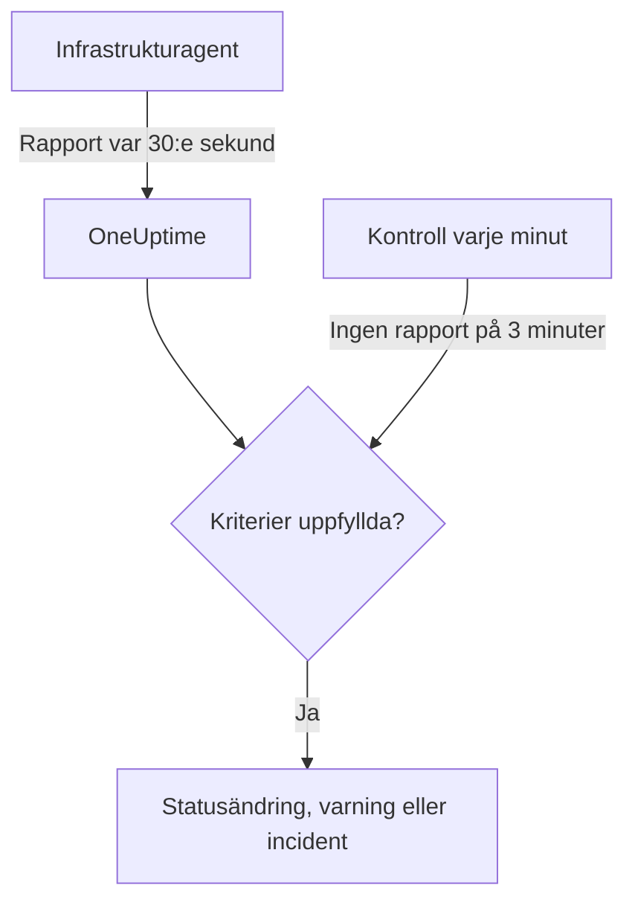

# Server- / VM-övervakning

En Server- / VM-monitor övervakar en maskin genom OneUptimes infrastrukturagent (`oneuptime-infrastructure-agent`), en liten tjänst som var 30:e sekund rapporterar CPU, minne, diskar, belastning, nätverk och körande processer till OneUptime. Den här sidan visar hur du ansluter agenten till en Server- / VM-monitor, vad agenten rapporterar och hur du skriver de kriterier som avgör när servern är online eller offline.

> [!IMPORTANT]
> **Skapa monitor** erbjuder inte längre **Server / VM**. Server- / VM-monitorer som du redan har fortsätter att fungera, och allt på den här sidan gäller för dem. För att övervaka en ny server skapar du i stället en [värdmonitor](/docs/monitor/host-monitor): den varnar på de värdmått som [OpenTelemetry-collectorn på värden](/docs/telemetry/host-otel-collector) skickar.

:::cards
- [Anslut agenten](#anslut-agenten): Installera den, ge den monitorns hemliga nyckel och starta den.
- [Vad agenten rapporterar](#vad-agenten-rapporterar): CPU, minne, diskar, belastning, nätverk och processer.
- [Övervakningskriterier](#övervakningskriterier): Avgör när servern räknas som online eller offline.
- [Felsökning](#felsökning): Agenten rapporterar inte, eller monitorn går aldrig offline.
:::

## Så fungerar det

Agenten körs som en systemtjänst. Var 30:e sekund samlar den in en rapport och skickar den till din OneUptime-URL, signerad med monitorns hemliga nyckel. OneUptime sparar siffrorna som monitorns mätvärden och prövar rapporten mot monitorns kriterier.

Tystnad kontrolleras separat. Varje minut utvärderar OneUptime på nytt **Is Online**-kriterierna för varje Server- / VM-monitor som inte har rapporterat på 3 minuter eller mer, och en server som är tyst längre än kriterierna tillåter (3 minuter som standard) räknas som offline. En monitor utan **Is Online**-kriterium markeras aldrig som offline bara för att agenten har tystnat. Bara tid då OneUptime tog emot data räknas in i den tystnaden: tid då OneUptime själv startade om, uppgraderades eller kom ikapp räknas inte, som [När OneUptime inte tar emot data](/docs/monitor/when-oneuptime-is-not-receiving) förklarar.



## Innan du börjar

- En Server- / VM-monitor i ditt projekt.
- Behörighet att redigera monitorer. Den hemliga nyckeln, och installationskommandona som innehåller den, visas bara för den som kan redigera monitorer.
- Root-behörighet (Linux, macOS) eller administratörsbehörighet (Windows) på servern. Agenten installerar sig själv som en systemtjänst.
- Utgående HTTPS från servern till din OneUptime-URL, direkt eller via en HTTP-proxy.

## Anslut agenten

Kommandona nedan använder `https://oneuptime.com` och `YOUR_SECRET_KEY`. I monitorns egna installationskommandon är din OneUptime-URL och monitorns hemliga nyckel redan ifyllda, så kopiera dem från monitorn när du kan.

:::steps
### Öppna monitorns installationskommandon

Gå till **Monitorer**, öppna Server- / VM-monitorn och välj **Dokumentation**. Korten **Set up your Server Monitor (Linux/Mac)** och **Set up your Server Monitor (Windows)** innehåller kommandona för den här monitorn. Tills agenten rapporterar första gången visar även monitorns **Översikt** dem.

### Installera agenten

:::tabs
@tab Linux
```bash
curl -sSL https://oneuptime.com/docs/static/scripts/infrastructure-agent/install.sh | sudo bash
```
@tab macOS
```bash
curl -sSL https://oneuptime.com/docs/static/scripts/infrastructure-agent/install.sh | sudo bash
```
@tab Windows
1. Ladda ned agenten från den [senaste GitHub-versionen](https://github.com/OneUptime/oneuptime/releases/latest): `oneuptime-infrastructure-agent_windows_amd64.zip` för x64 eller `oneuptime-infrastructure-agent_windows_arm64.zip` för ARM64.
2. Packa upp zip-filen. Den innehåller `oneuptime-infrastructure-agent.exe`.
3. Öppna **Kommandotolken** som administratör i mappen du packade upp den till.
:::

Installationsskriptet hämtar den senaste versionen för ditt operativsystem och din processor (x86-64 eller ARM64) och lägger binärfilen `oneuptime-infrastructure-agent` i `$HOME/bin`. På en egen installation levereras skriptet från din egen OneUptime-URL.

### Anslut den till monitorn

:::tabs
@tab Linux
```bash
sudo oneuptime-infrastructure-agent configure --secret-key=YOUR_SECRET_KEY --oneuptime-url=https://oneuptime.com
```
@tab macOS
```bash
sudo oneuptime-infrastructure-agent configure --secret-key=YOUR_SECRET_KEY --oneuptime-url=https://oneuptime.com
```
@tab Windows
```shell
oneuptime-infrastructure-agent configure --secret-key=YOUR_SECRET_KEY --oneuptime-url=https://oneuptime.com
```
:::

`configure` sparar den hemliga nyckeln och URL:en i agentens konfigurationsfil och installerar agenten som en systemtjänst. Båda flaggorna krävs. Ersätt `https://oneuptime.com` med din egen URL på en egen installation.

Om servern når internet via en proxy lägger du till `--proxy-url`:

```bash
sudo oneuptime-infrastructure-agent configure --proxy-url=http://proxy.example.com:8080 --secret-key=YOUR_SECRET_KEY --oneuptime-url=https://oneuptime.com
```

### Starta agenten

:::tabs
@tab Linux
```bash
sudo oneuptime-infrastructure-agent start
```
@tab macOS
```bash
sudo oneuptime-infrastructure-agent start
```
@tab Windows
```shell
oneuptime-infrastructure-agent start
```
:::

När agenten startar kontrollerar den den hemliga nyckeln hos OneUptime och skickar sin första rapport direkt.

### Kontrollera att den rapporterar

Kör `sudo oneuptime-infrastructure-agent status` (utan `sudo` på Windows): den skriver ut `Service is running`. I OneUptime slutar monitorns **Översikt** att visa installationskommandona så snart den första rapporten kommer, och fliken **Mätvärden** börjar visa servern i diagram.
:::

## Agentreferens

### Kommandon

| Kommando | Vad det gör |
| --- | --- |
| `configure --secret-key=<key> --oneuptime-url=<url>` | Sparar inställningarna och installerar agenten som en systemtjänst. Lägg till `--proxy-url=<url>` för att skicka rapporter via en proxy. |
| `start` | Startar tjänsten. Den vägrar starta innan `configure` har körts. |
| `stop` | Stoppar tjänsten. |
| `restart` | Startar om tjänsten. |
| `status` | Skriver ut om tjänsten körs eller är stoppad. |
| `logs` | Skriver ut de sista 100 raderna i agentens logg. `-n <lines>` skriver ut ett annat antal rader, och `-f` följer nya rader. |
| `uninstall` | Tar bort tjänsten och raderar agentens konfigurationsfil. |
| `help` | Listar kommandona. |

Kör dem med `sudo` på Linux och macOS, och från **Kommandotolken** med administratörsbehörighet på Windows. För att ändra den hemliga nyckeln, URL:en eller proxyn för en konfigurerad agent kör du `stop` och `uninstall`, och sedan `configure` och `start` igen.

### Filer

| Fil | Linux och macOS | Windows |
| --- | --- | --- |
| Konfiguration | `/etc/oneuptime-infrastructure-agent/config.json` | `%PROGRAMDATA%\oneuptime-infrastructure-agent\config.json` |
| Logg | `/var/log/oneuptime-infrastructure-agent/oneuptime-infrastructure-agent.log` | `%PROGRAMDATA%\oneuptime-infrastructure-agent\oneuptime-infrastructure-agent.log` |

När agenten inte kan skriva till de här katalogerna använder den i stället `~/.oneuptime-infrastructure-agent/`. Miljövariablerna `ONEUPTIME_AGENT_CONFIG_PATH` och `ONEUPTIME_AGENT_LOG_PATH` anger vardera sökvägen uttryckligen.

## Vad agenten rapporterar

Varje rapport innehåller serverns värdnamn och:

| Område | Vad som rapporteras |
| --- | --- |
| CPU | Användning i %, antal kärnor, användning per kärna och tid i user, system, idle, I/O-väntan, steal, nice, IRQ och soft-IRQ |
| Minne | Totalt, använt, ledigt och tillgängligt minne, buffertar och cache, användning i %, samt swap totalt, använt, ledigt och användning i % |
| Diskar | För varje monterad disk: monteringssökväg, enhet, filsystem, totalt, använt och ledigt utrymme, användning i %, lästa och skrivna byte och operationer samt I/O-tid |
| Belastning | Belastningsmedelvärden över 1, 5 och 15 minuter |
| Nätverk | För varje gränssnitt: skickade och mottagna byte och paket, fel och tappade paket in och ut; plus etablerade och lyssnande anslutningar |
| Värd | Operativsystem, plattform och version, kärnversion och arkitektur, drifttid, starttid, virtualisering och antal processer |
| Processer | Varje körande process: namn, PID, kommando, CPU i %, minne, status, trådar, användare och starttid |

Värden som operativsystemet inte tillhandahåller utelämnas. Monitorns flik **Mätvärden** visar diagram över tillgänglighet, CPU, minne, diskanvändning och disk-I/O, belastningsmedelvärden, swap, nätverkstrafik och -fel, anslutningar, drifttid och antal processer.

## Övervakningskriterier

Kriterier avgör när monitorn är online, försämrad eller offline, och när den öppnar en varning eller en incident. Varje filter i ett kriterium har en **Filtertyp**, ett **Filtervillkor** och för de flesta typer ett värde.

| Filtertyp | Vad den kontrollerar | Filtervillkor |
| --- | --- | --- |
| Is Online | Om agenten har rapporterat nyligen (som standard under de senaste 3 minuterna) | Sant, Falskt |
| CPU Usage (in %) | Total CPU-användning | Greater Than, Less Than, Greater Than Or Equal To, Less Than Or Equal To |
| Memory Usage (in %) | Minne som används | Som för CPU |
| Disk Usage (in %) | Användning av disken som anges i **Diskväg** | Som för CPU |
| Swap Usage (in %) | Swap som används | Som för CPU |
| CPU IO Wait (in %) | Andel av CPU-tiden som väntar på I/O | Som för CPU |
| Load Average (1 minute) | Belastningsmedelvärde under den senaste minuten | Som för CPU |
| Load Average (5 minute) | Belastningsmedelvärde under de senaste 5 minuterna | Som för CPU |
| Load Average (15 minute) | Belastningsmedelvärde under de senaste 15 minuterna | Som för CPU |
| Server Process Name | Om en process med det här namnet körs (skiftlägesokänsligt) | Is Executing, Is Not Executing |
| Server Process Command | Om en process med exakt den här kommandoraden körs (skiftlägesokänsligt) | Is Executing, Is Not Executing |
| Server Process PID | Om en process med det här PID:t körs | Is Executing, Is Not Executing |

**Diskväg** tar en monteringspunkt eller en enhet, till exempel `/`, `/mnt/data`, `C:\` eller `/dev/sda1`; tom är den `/`. Ange `*` för att kontrollera varje disk som agenten rapporterar: varje disk som passerar tröskeln får en egen varning, så att en andra disk som fylls inte döljs bakom den första diskens öppna varning.

### Utvärdera över en tidsperiod

**Utvärdera dessa kriterier över en tidsperiod** är en separat kryssruta i kriterieformuläret och inte ett filtervillkor. Den finns för **Is Online** och för varje numerisk filtertyp. Slå på den för att jämföra ett aggregat – valt under **Utvärdera** (Genomsnitt, Summa, Maximum Value, Minimum Value, All Values, Any Value) över fönstret som **Under de senaste (i minuter)** anger – i stället för värdet från den senaste kontrollen. På ett **Is Online**-filter är fönstret hur länge agenten får vara tyst innan servern räknas som offline.

**All Values** matchar först när fönstret verkligen täcks av data. En monitor som just har skapats, eller en vars kontroller har slutat registreras, har inte tillräckligt med historik för att säga något om de senaste N minuterna, så kriteriet väntar i stället för att matcha på den enda mätning det har. **Any Value** är inställningen för "säg till så fort en enda kontroll passerar gränsen" och utlöses fortfarande direkt.

**Om ingen data** styr vad som händer medan fönstret inte kan bära kriteriet:

| Om ingen data | Beteende | Använd den för |
| --- | --- | --- |
| **Ignore** (standard) | Kriteriet matchar inte. | Vanliga tröskelvarningar. |
| **Utlösare** | De saknade data behandlas som problemet. | Heartbeat-liknande kontroller, där tystnad i sig är ett fel. |
| **Treat As Zero** | Fönstret jämförs som en enda nolla. | Räknare, där "inga händelser" verkligen betyder noll. |

> [!TIP]
> CPU och belastning har korta toppar hela tiden. Utvärdera dem över några minuter med **Genomsnitt** eller **All Values** i stället för att varna på en enda rapport.

### Exempel på kriterier

| Mål | Filtertyp | Filtervillkor | Värde |
| --- | --- | --- | --- |
| Markera servern som offline när agenten slutar rapportera | Is Online | Falskt | — |
| Varna när CPU-användningen är över 90 % | CPU Usage (in %) | Greater Than | `90` |
| Varna när rotdisken är mer än 85 % full | Disk Usage (in %), **Diskväg** `/` | Greater Than | `85` |
| Varna för varje disk som är mer än 85 % full, en varning per disk | Disk Usage (in %), **Diskväg** `*` | Greater Than | `85` |
| Varna när minnesanvändningen är över 80 % | Memory Usage (in %) | Greater Than | `80` |
| Varna när nginx slutar köras | Server Process Name | Is Not Executing | `nginx` |

## Felsökning

:::details Agenten rapporterar inte
- Kontrollera att tjänsten körs: `sudo oneuptime-infrastructure-agent status`.
- Läs loggen: `sudo oneuptime-infrastructure-agent logs -n 50`. En rad `Metrics successfully pushed to OneUptime server` betyder att rapporterna kommer fram.
- Agenten kontrollerar den hemliga nyckeln när den startar och avslutas om OneUptime avvisar den, med loggraden `Secret key is invalid`. Jämför nyckeln med den på monitorns sida **Inställningar**, under **Återställ hemlig nyckel för serverövervakning**.
- Se till att servern kan nå din OneUptime-URL över HTTPS och att ingen brandvägg blockerar utgående anslutningar.
:::

:::details `sudo` säger att kommandot inte hittas
Installationsskriptet lägger binärfilen i `$HOME/bin` för användaren det kördes som, och skriver ut katalogen det använde. Kör agenten med hela sökvägen, till exempel `sudo /root/bin/oneuptime-infrastructure-agent configure ...`. För att i stället installera den i en katalog på systemets sökväg skickar du `-b` till skriptet:

```bash
curl -sSL https://oneuptime.com/docs/static/scripts/infrastructure-agent/install.sh | sudo bash -s -- -b /usr/local/bin
```
:::

:::details `start` säger att tjänstkonfigurationen inte hittades
`configure` har inte körts, eller så har `uninstall` tagit bort konfigurationen. Kör `configure` med den hemliga nyckeln och URL:en, och sedan `start`.
:::

:::details Monitorn går aldrig offline när servern är nere
Bara ett **Is Online**-kriterium markerar en tyst server som offline. Lägg till ett med **Filtervillkor** satt till **Falskt**, och ange den monitorstatus det ändrar till.
:::

:::details Rapporterna kommer inte igenom proxyn
- Kontrollera proxy-URL:en och porten som angavs i `--proxy-url`.
- Se till att proxyn tillåter anslutningar till din OneUptime-URL.
- För att ändra proxyn kör du `stop` och `uninstall`, sedan `configure` med den nya `--proxy-url`, och `start`.
:::

## Nästa steg

:::cards
- [Värdövervakning](/docs/monitor/host-monitor): Monitorn för nya servrar, byggd på OpenTelemetry-värdmått.
- [OpenTelemetry-collector på värden](/docs/telemetry/host-otel-collector): Skicka värdmått och loggar från Linux, macOS och Windows.
- [Incident- och varningsmallar](/docs/monitor/incident-alert-templating): Lägg in CPU-, minnes-, disk- och processuppgifter i incidenttitlar.
:::
