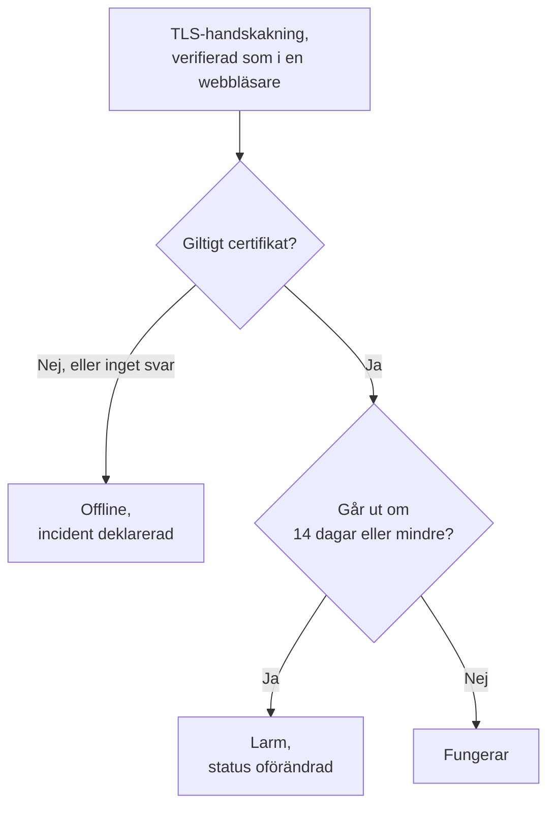

# Övervakning av SSL-certifikat

En SSL-certifikatmonitor kontrollerar de TLS-certifikat som dina webbplatser och tjänster visar upp, på samma sätt som en webbläsare, och varnar dig innan de går ut. Den tar också monitorn offline när ett certifikat inte längre är giltigt: utgånget, självsignerat, utfärdat för ett annat värdnamn eller från en utfärdare som webbläsare inte litar på.

:::cards
- [Skapa monitorn](#skapa-en-ssl-certifikatmonitor): Sex steg i instrumentpanelen.
- [Standardkriterier](#standardkriterier): En varning om utgång 14 dagar i förväg, utan inställningar.
- [Övervakningskriterier](#övervakningskriterier): Giltighet, utgång och självsignerade certifikat.
- [Felsökning](#felsökning): Självsignerade och interna certifikat.
:::

## Så fungerar det

Vid varje kontroll öppnar en sond en TLS-anslutning till värden och porten i URL:en, port `443` om inte URL:en anger en annan, och verifierar certifikatet som en webbläsare skulle göra: en betrodd utfärdare, ett värdnamn som stämmer och en giltighetsperiod som omfattar i dag. Om certifikatet inte klarar verifieringen läser sonden det ändå, så dess utgångsdatum, utfärdare och fingeravtryck registreras i vilket fall som helst. En anslutning som misslyckas, når tidsgränsen eller visar upp ett ogiltigt certifikat görs om, upp till det antal återförsök du tillåter. Sedan kör OneUptime resultatet genom monitorns kriterier.

En sond som har förlorat sin egen nätverksanslutning rapporterar inget resultat, så den kan inte markera ditt certifikat som ogiltigt.

## Innan du börjar

- **En roll som kan skapa monitorer**: Project Owner, Project Admin, Project Member, Monitor Admin eller Monitor Member, eller en anpassad roll med behörigheten Create Monitor.
- **En sond som når värden och porten.** Projektets standardsonder väljs för varje ny monitor. En tjänst i ett privat nätverk behöver en [anpassad sond](/docs/probe/custom-probe) i det nätverket.

## Skapa en SSL-certifikatmonitor

:::steps
### Börja en ny monitor

Gå till **Monitorer** och klicka på **Skapa monitor**. Välj **SSL Certificate** under **Monitortyp**.

### Namnge den

Ange ett **Namn**, som `example.com certificate`, och klicka sedan på **Nästa**.

### Ange URL:en

Ange webbplatsen vars certifikat ska kontrolleras i **Webbplats-URL**, som `https://example.com`. För en tjänst på en annan port tar du med porten: `https://example.com:8443`.

### Testa den

Klicka på **Testa monitor**, välj en sond under **Välj sond** och klicka på **Kör test**. **Resultat av övervakningstest** visar certifikatet som sonden fick, med dess utfärdare och utgångsdatum.

### Gå igenom kriterierna

**Monitorkriterier** börjar med [standardkriterierna](#standardkriterier): offline när certifikatet inte är giltigt, ett larm när det går ut om 14 dagar eller mindre. Ändra dem vid behov och klicka sedan på **Nästa**.

### Välj sonder och skapa

Behåll eller ändra **Sonder** och **Övervakningsintervall** (det börjar på **Var 5:e minut**; för SSL-certifikatmonitorer erbjuds 5 minuter eller längre) och klicka sedan på **Skapa monitor**. Monitorns sida öppnas.
:::

## Konfigurationsalternativ

| Fält | Standard | Vad du anger |
| --- | --- | --- |
| **Webbplats-URL** | Inget | Webbplatsen vars certifikat kontrolleras, som `https://example.com` eller `https://example.com:8443`. Bara värden och porten används; sökvägen ignoreras. |
| **Begärandetimeout (sekunder)** (under **Fler fält**) | `60` | Hur länge det väntas på TLS-handskakningen vid varje försök. Maximum är 60 sekunder. |
| **Återförsök vid misslyckande** (under **Fler fält**) | Sondens standard, oftast `3` | Hur många gånger ett misslyckat försök görs om. Maximum är 3. |

**Återförsök vid misslyckande** räknar återförsök _efter_ det första försöket, så `0` kör kontrollen en gång och `2` kör den upp till tre gånger. Lämnas fältet tomt används sondens standard: 3, om inte sondens `PROBE_MONITOR_RETRY_LIMIT` säger något annat. Anslutningsfel, misslyckade certifikatverifieringar och timeouter görs alla om, med en paus på en sekund mellan försöken.

## Övervakningskriterier

Kriterier avgör när certifikatet räknas som i ordning, försämrat eller trasigt, och om det deklarerar en incident eller skapar ett larm. Varje kriterium kontrollerar ett eller flera filter:

| Filter | Villkor | Vad det kontrollerar |
| --- | --- | --- |
| **Is Valid Certificate** | **Sant**, **Falskt** | Certifikatet klarar en webbläsares kontroller: en betrodd utfärdare, ett värdnamn som stämmer och en giltighetsperiod som omfattar i dag. **Falskt** när slutpunkten inte svarade. |
| **Is Not A Valid Certificate** | **Sant**, **Falskt** | Motsatsen till **Is Valid Certificate**: **Sant** när certifikatet inte klarar de kontrollerna eller inte kunde kontrolleras. |
| **Is Expired Certificate** | **Sant**, **Falskt** | Certifikatets utgångsdatum har passerat. |
| **Is Self Signed Certificate** | **Sant**, **Falskt** | Certifikatet, eller ett i dess kedja, är självsignerat. |
| **Expires In Days** | **Greater Than**, **Less Than**, **Greater Than Or Equal To**, **Less Than Or Equal To** | Dagar tills certifikatet går ut. |
| **Expires In Hours** | **Greater Than**, **Less Than**, **Greater Than Or Equal To**, **Less Than Or Equal To** | Timmar tills certifikatet går ut. |

**Expires In Days** räknar hela dagar: ett certifikat som går ut om 14 dagar och 20 timmar har 14 dagar kvar. **Expires In Hours** räknar hela timmar på samma sätt.

Med två eller fler filter avgör **Matchningsvillkor** om **Alla** måste matcha eller om **Valfri** av dem räcker. Ett kriteriums **Åtgärder** avgör vad det gör: ändrar monitorns status, skapar ett larm, deklarerar en incident eller flera av dessa.

### Standardkriterier

En ny SSL-certifikatmonitor börjar med tre kriterier, så den varnar dig innan ett certifikat går ut utan några inställningar alls:

1. **Certifikatet är inte giltigt** — certifikatet har gått ut, är självsignerat, utfärdat för ett annat värdnamn eller av en utfärdare som inte är betrodd, eller kunde inte kontrolleras eftersom slutpunkten inte svarade. Monitorn markeras som **Offline** och en incident med namnet "_monitor name_ certificate is not valid" skapas. Dess grundorsak säger vilket av dessa fall det var. Incidenten löser sig själv när certifikatet är giltigt igen.
2. **Certifikatet går snart ut** — certifikatet är giltigt men går ut om 14 dagar eller mindre. Ett **larm** med namnet "_monitor name_ certificate expires soon" skapas.
3. **Certifikatet är giltigt** — monitorn markeras som **Fungerar**.

Varningen "går snart ut" är ett larm, inte en incident: det visas inte på dina statussidor, det kallar inte in någon om du inte lägger till en jourpolicy på det, och det ändrar inte monitorns status. Det använder projektets andra larmallvarlighetsgrad, **Low** i ett nytt projekt. När det förnyade certifikatet plockas upp är monitorn tillbaka på "Certifikatet är giltigt", och larmet löser sig själv.

Kriterier kontrolleras uppifrån och ned, och det första som matchar avgör vad som händer. Därför ligger "går snart ut" ovanför "är giltigt": ett certifikat som håller på att gå ut är fortfarande giltigt, så det skulle matcha båda.

För att bli varnad tidigare ändrar du värdet för filtret **Expires In Days** i kriteriet "går snart ut", till exempel till `30`. För att i stället kalla in någon öppnar du kriteriets **Åtgärder**: slå på **När filter matchar, deklarera en incident.**, eller behåll larmet och lägg till en jourpolicy på det under **Jourpolicyer**.

:::details Lägg till varningen på en monitor som skapades innan den fanns
Monitorer som skapades innan OneUptime lade till den här varningen har inget kriterium "går snart ut". Så här lägger du till det:

1. Öppna **Konfiguration → Kriterier** på monitorn och klicka på **Redigera Övervakningskriterier**.
2. Klicka på **Lägg till kriterier**. Sätt dess filter till **Is Valid Certificate** / **Sant**, klicka på **Lägg till filter** och sätt det andra till **Expires In Days** / **Less Than Or Equal To** / `14`. Låt **Matchningsvillkor** stå på **Alla** (det visas under filtren så snart det finns två).
3. Slå på **När filter matchar, skapa en varning.** under **Åtgärder** och låt **När filter matchar, ändra övervakarstatus.** vara avstängt, så att det skapar ett larm och inte ändrar monitorns status.
4. Dra det nya kriteriet ovanför kriteriet som markerar monitorn som online och spara sedan.
:::

### Exempelkriterier

| Mål | Filter | Villkor | Värde |
| --- | --- | --- | --- |
| Varna en månad i förväg | **Expires In Days** | **Less Than Or Equal To** | `30` |
| Kalla in någon den sista dagen | **Expires In Hours** | **Less Than** | `24` |
| Offline först när certifikatet har gått ut | **Is Expired Certificate** | **Sant** | — |
| Flagga ett självsignerat certifikat | **Is Self Signed Certificate** | **Sant** | — |

Ett kriterium om utgång måste ligga ovanför kriteriet som markerar certifikatet som giltigt: ett certifikat som snart går ut är fortfarande giltigt, och det första kriteriet som matchar vinner.

## Bästa praxis

1. **Ge dig själv tid att förnya** — Standardvarningen kommer 14 dagar före utgång, vilket passar certifikat som förnyar sig själva. Om förnyelsen tar längre tid för dig (ett certifikat du köper, eller en ändringsprocess), höj den till 30 dagar.
2. **Övervaka varje slutpunkt** — Om du har flera domäner eller underdomäner skapar du en monitor för var och en. Var och en kan ha sitt eget certifikat.
3. **Ta med andra portar** — Tjänster som levererar TLS på en annan port än `443`, som `8443`, har också certifikat. Ange porten i URL:en.
4. **Kontrollera efter förnyelse** — När du har förnyat ett certifikat kontrollerar du monitorns nästa resultat: utgångsdatumet den visar ska vara det nya.

## Felsökning

:::details Certifikatet är i ordning i min webbläsare, men monitorn säger att det inte är giltigt
Incidentens grundorsak säger varför. En vanlig orsak är en server som skickar sitt certifikat utan mellanliggande certifikat: webbläsare fyller ofta i luckan själva, sonden gör det inte. Konfigurera servern att skicka hela kedjan. En annan är en URL vars värdnamn inte finns på certifikatet.
:::

:::details Jag övervakar en intern tjänst med ett självsignerat certifikat
Ett självsignerat certifikat är aldrig giltigt, så standardkriterierna håller monitorn offline. **Is Self Signed Certificate**, **Is Expired Certificate** och **Expires In Days** fungerar fortfarande för det, så bygg kriterierna på dem. På **Konfiguration → Kriterier**:

1. Klicka på **Lägg till filter** i kriteriet "inte giltigt", sätt det nya filtret till **Is Self Signed Certificate** / **Falskt** och sätt **Matchningsvillkor** till **Alla**. Kriteriet tar fortfarande monitorn offline när slutpunkten inte svarar, eller när certifikatet är fel på något annat sätt.
2. Lägg till ett kriterium med **Is Expired Certificate** / **Sant** som markerar monitorn som **Offline** och deklarerar en incident, och dra det högst upp.
3. Ersätt **Is Valid Certificate** / **Sant** med **Is Expired Certificate** / **Falskt** i kriteriet "går snart ut", så att varningen även täcker det självsignerade certifikatet.

Så länge certifikatet är aktuellt matchar inget kriterium, och monitorn visar sin standardstatus, **Fungerar**.
:::

:::details Monitorn är offline med "could not be checked because the endpoint is not reachable"
Sonden kunde inte öppna en TLS-anslutning till värden och porten. Kontrollera porten i URL:en, och att en brandvägg släpper igenom sonderna. En värd i ett privat nätverk behöver en [anpassad sond](/docs/probe/custom-probe).
:::

## Nästa steg

:::cards
- [Webbplatsövervakning](/docs/monitor/website-monitor): Kontrollera att själva webbplatsen svarar.
- [Domänövervakning](/docs/monitor/domain-monitor): Bli varnad innan domänens registrering går ut.
- [Eskaleringsregler](/docs/on-call/escalation-rules): Bestäm vem som kallas in av larmen och incidenterna.
- [Incidenter – Översikt](/docs/incidents/index): Vad som händer när monitorn har deklarerat en.
:::
