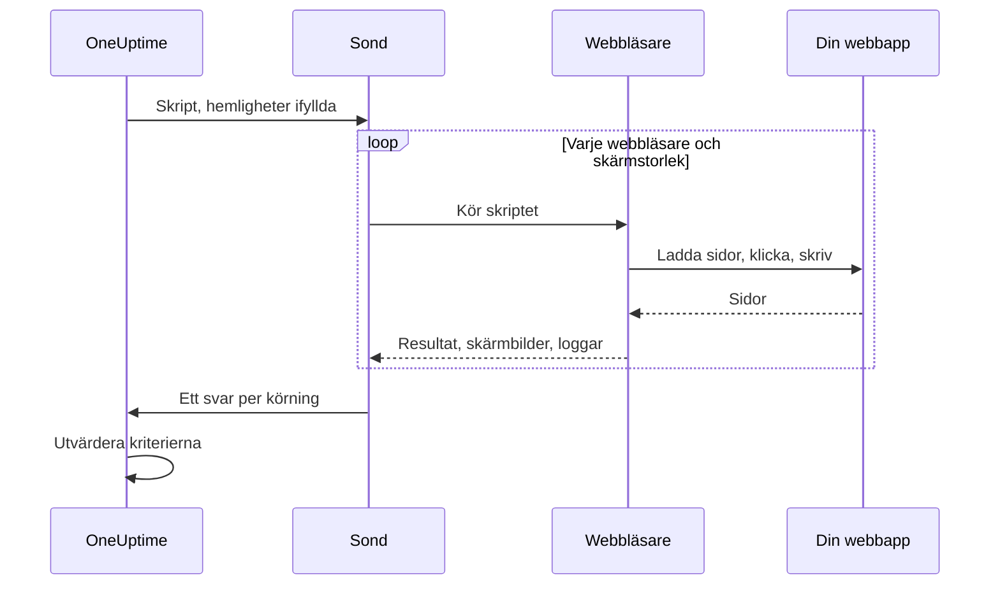

# Syntetisk övervakning

En syntetisk monitor styr din webbapp i en riktig webbläsare, enligt ett schema, med ett Playwright-skript som du skriver själv: den öppnar sidor, fyller i formulär och klickar sig igenom en användarresa, och den misslyckas när resan gör det. Använd den för att fånga de fel som en kontroll av drifttid inte ser — en inloggning som inte längre fungerar, en kassaknapp som inte gör något, en instrumentpanel som aldrig laddas färdigt.

:::cards
- [Skapa monitorn](#skapa-en-syntetisk-monitor): Skriv ett skript och välj webbläsare och skärmstorlekar.
- [Skriv skriptet](#skriv-skriptet): En körbar inloggningsresa att utgå från.
- [Skärmbilder](#skärmbilder): Se hur sidan såg ut när en körning misslyckades.
- [Vad skriptet kan använda](#moduler-som-är-tillgängliga-i-skriptet): Playwright, HTTP, kryptografi och mätvärden.
:::

## Så fungerar det

Vid varje kontroll kör en sond ditt skript en gång för varje webbläsare och skärmstorlek du har valt, en i taget. Varje körning startar en ny webbläsare utan cookies eller lagring från tidigare körningar; skriptet styr sin sida, tar skärmbilder och returnerar ett resultat eller kastar ett fel. Sonden rapporterar varje körning, och OneUptime utvärderar dina kriterier mot dem.



| Skärmtyp | Visningsområde |
| --- | --- |
| Mobile | 360 × 640 |
| Tablet | 1024 × 768 |
| Desktop | 1920 × 1080 |

Webbläsarna är Chromium och Firefox.

## Innan du börjar

- En **sond** som når din webbapp. Använd en [anpassad sond](/docs/probe/custom-probe) för en app i ditt nätverk. Sondens Docker-avbildning innehåller Chromium och Firefox; en sond som körs utanför Docker måste ha dem installerade.
- Alla lösenord och token som resan behöver, sparade som [övervakningshemligheter](/docs/monitor/monitor-secrets).

## Skapa en syntetisk monitor

:::steps
### Starta en ny monitor

Gå till **Monitorer** och klicka på **Skapa monitor**. Under **Monitortyp** klickar du på **Fler monitortyper** och väljer **Synthetic Monitor** under **Synthetic Monitoring**, eller skriver `playwright` i sökrutan. Ange ett **Namn** och klicka sedan på **Nästa**.

### Lägg till skriptet

Skriv ditt skript i redigeraren **Playwright Code**. Utgå från [exemplet nedan](#skriv-skriptet).

### Välj webbläsare och skärmstorlekar

Markera webbläsarna under **Webbläsartyp** och storlekarna under **Skärmtyp**. Skriptet körs en gång för varje kombination, så två webbläsare och tre storlekar ger sex körningar per kontroll. Under **Fler fält** gör **Antal återförsök vid fel** om en misslyckad körning upp till 5 gånger.

### Testa det

Klicka på **Testa monitor** för att köra skriptet en gång från en sond, och kontrollera resultatet, loggarna och skärmbilderna för varje körning.

### Gå igenom kriterierna

Monitorn börjar med två kriterier: den är offline och deklarerar en incident när en körning misslyckas, och online när ingen gör det. Ändra dem eller lägg till egna — se [Kriterier](#kriterier) — och klicka sedan på **Nästa**.

### Välj sonder och skapa

Välj **Sonder** och ett **Övervakningsintervall** — syntetiska monitorer erbjuds var 5:e minut eller mer sällan — och klicka sedan på **Skapa monitor**.
:::

## Skriv skriptet

Skriptet är kroppen i en `async`-funktion. `page` är en Playwright-kompatibel sida som redan är öppen; styr den, returnera ett resultat med `return` och använd `throw` (eller låt ett Playwright-anrop nå sin tidsgräns) för att få körningen att misslyckas. Det här exemplet loggar in och kontrollerar att instrumentpanelen laddas:

```javascript title="Synthetic monitor script"
await page.goto("https://app.example.com/login");
screenshots["login-page"] = await page.screenshot();

await page.fill("#email", "monitoring@example.com");
await page.fill("#password", "{{monitorSecrets.AppPassword}}");
await page.click("button[type=submit]");

// Fails the run if the dashboard does not appear within 10 seconds.
await page.waitForSelector(".dashboard", { timeout: 10000 });
screenshots["dashboard"] = await page.screenshot();

console.log(`Signed in on ${browserType}, ${screenSizeType}`);

return {
  data: { title: await page.title() },
};
```

| För att | Gör så här | Vad OneUptime registrerar |
| --- | --- | --- |
| Rapportera ett resultat | `return { data: ... }` | Körningens **Resultat**. Bara `data` sparas. |
| Få körningen att misslyckas | `throw new Error("...")`, eller låt en väntan nå sin tidsgräns | Körningens **Skriptfel**. |
| Spara bevis | `screenshots["name"] = await page.screenshot()` | En skärmbild, som sparas även när körningen misslyckas. |
| Lämna ett spår | `console.log(...)` | Körningens loggmeddelanden. |

För att se körningarna öppnar du monitorns **Översikt**: kortet **Monitor-sammanfattning** har ett block per webbläsare och skärmstorlek, och **Visa fler detaljer** visar skärmbilderna från varje körning.

### Användning av Playwright

Vi använder Playwright för att simulera användarinteraktioner. Värdet `page` är en säker, Playwright-kompatibel fasad för sidan som skapats för den här körningen. Vanliga metoder på `Page`, `Locator`, `Frame`, `ElementHandle`, `JSHandle`, `Request`, `Response`, tangentbord, mus och webbläsarkontext är tillgängliga. Det omfattar navigering, locators, klick, formulärinmatning, utvärdering på sidan, popup-fönster, fler sidor, granskning av svar och skärmbilder. Du kan nå körningens webbläsarkontext via `page.context()`, till exempel för att öppna en ny sida eller hantera ett popup-fönster.

Syntetiska skript körs inte i sondens Node.js-process. Värden korsar körmiljöns gräns som kopierade data eller ogenomskinliga förmågor som är knutna till körningen, så vissa Playwright-API:er fungerar annorlunda eller inte alls:

| Inte tillgängligt | Använd i stället |
| --- | --- |
| Metoder för att starta eller ansluta webbläsare, CDP-sessioner, routning av begäranden, exponerade bindningar, privata fält i Playwright och alla alternativ som läser eller skriver en sökväg i värdens filsystem. `page.context().browser()` är därför inte tillgängligt. | Sidan och webbläsarkontexten som du får. |
| Händelselyssnare (`page.on(...)`, `page.once(...)`) — anrop till dem misslyckas med ett tydligt fel. | `page.waitForEvent(...)` för dialogrutor och popup-fönster, eller väntan på svar och begäranden med strängar eller reguljära uttryck som matchare. |
| Funktionspredikat för väntemetoder för händelser, begäranden, svar och URL:er. | Strängar eller reguljära uttryck som matchare, locators eller explicit avsökning. |
| De synkrona frame-åtkomstmetoderna (`page.frames()`, `page.mainFrame()`, `page.frame(...)`). | `page.frameLocator(...)` för iframes. |
| `page.request.*` | Den globala `axios` för HTTP-begäranden. |
| Skärmbilder av hela sidan och PDF-utdata. | Skärmbilder av visningsområdet, som behåller hanteringen av felbevis som beskrivs nedan. |

`page.waitForNavigation(...)`, `page.setDefaultTimeout(...)` och `page.setDefaultNavigationTimeout(...)` stöds. `page.waitForEvent(...)` väntar på `dialog`, `domcontentloaded`, `load`, `popup`, `request`, `requestfailed`, `requestfinished` och `response`. Utvärderingsfunktioner som skickas till metoder som `page.evaluate()` körs i den övervakade webbläsarsidan, aldrig i sondens process. Varje körning kan använda upp till åtta sidor.

Webbläsarbehörigheter är begränsade till geolokalisering och aviseringar. Urklipp, kamera, mikrofon, MIDI, lokala typsnitt och andra behörigheter för värdens enheter är inte tillgängliga för övervakningsskript.

### Vad skriptet returnerar

Data som returneras från skriptet serialiseras till JSON innan de lagras: i vanliga objekt och matriser blir `NaN` och `Infinity` till `null`, egenskaper med `undefined` och funktioner tas bort, och `Date`-objekt blir ISO-strängar — på samma sätt som `JSON.stringify` hanterar dem. Instanser av klasser och andra objekt som inte är vanliga tas bort helt. En `BigInt` blir en sträng. Ett resultat som är cirkulärt, nästlat mer än 30 nivåer djupt eller större än 5 MB får i stället körningen att misslyckas.

### Larma på returnerade data

Det som skriptet returnerar som `data` är monitorns **Result Value**, som ett kriterium kan jämföra. När `data` är ett objekt eller en matris fyller du i **Fältsökväg (valfritt)** på Result Value-filtret för att jämföra ett fält — till exempel `status`, `timings.loadTime` eller `errors[0].message`. Filtret kontrolleras mot data från varje webbläsare och skärmstorlek som monitorn körs på, och matchar när någon av dem gör det. Se [Larma på returnerade data](/docs/monitor/custom-code-monitor#larma-på-returnerade-data) för hur sökvägar och villkor fungerar.

## Skärmbilder

Ett fördeklarerat objekt `screenshots` finns i skriptets kontext. Tilldela skärmbilder till det var som helst i skriptet — de här skärmbilderna sparas **även om skriptet kastar ett fel** (även vid misslyckade kontroller, tidsgränser eller oväntade fel), så att du kan se exakt hur sidan såg ut när körningen misslyckades. Skärmbilderna visas i OneUptime-instrumentpanelen för just den körningen av monitorn.

```javascript
// Capture screenshots via the `screenshots` side-channel — they are preserved on both success and failure.

await page.goto("https://app.example.com/login");
screenshots["login-page"] = await page.screenshot();

await page.fill("#email", "user@example.com");
await page.fill("#password", "wrong");
await page.click("button[type=submit]");

// If the next assertion throws, the `login-page` screenshot above is still captured.
await page.waitForSelector(".dashboard", { timeout: 5000 });

screenshots["dashboard"] = await page.screenshot();

return {
  data: "Login succeeded",
};
```

En körning sparar upp till 20 skärmbilder, var och en upp till 10 MB och 50 MB totalt. En skärmbild kan också visas i den incident eller det larm som en misslyckad körning öppnar — på dess sida och i e-postmeddelandena om den — genom att du placerar den i monitorns beskrivning för incidenter eller larm. Se [Visa en skärmbild](/docs/monitor/incident-alert-templating#syntetiska-monitorer).

:::details Returnera skärmbilder (äldre sätt)
För bakåtkompatibilitet kan du också returnera skärmbilder från skriptet som en del av returvärdet. Skärmbilder som returneras på det här sättet sparas **bara** när skriptet slutförs normalt — de går förlorade om skriptet kastar ett fel. Föredra sidokanalmönstret ovan när du vill ha bevis på fel.

```javascript
// Legacy pattern — screenshots only captured on successful return.
const screenshots = {};
screenshots["screenshot-name"] = await page.screenshot();

return {
  data: "Hello World",
  screenshots: screenshots,
};
```
:::

## Använda övervakningshemligheter

Hänvisa till en hemlighet som `{{monitorSecrets.NAME}}` var som helst i skriptet. OneUptime ersätter hänvisningen med hemlighetens värde, som vanlig text, innan skriptet når sonden. Sätt därför en hemlighet inom citattecken för att använda den som en sträng, och lämna den utan citattecken för att använda den som ett tal eller ett booleskt värde:

```javascript
// Used as a string: wrap it in quotes.
const password = "{{monitorSecrets.AppPassword}}";

// Used as a number or a boolean: leave it bare.
const retryLimit = {{monitorSecrets.RetryLimit}};
const verbose = {{monitorSecrets.Verbose}};
```

Se [Övervakningshemligheter](/docs/monitor/monitor-secrets) för att skapa en hemlighet och välja vilka monitorer som kan använda den.

## Anpassade mätvärden

Du kan samla in anpassade mätvärden från ditt skript med funktionen `oneuptime.captureMetric()`. Mätvärdena lagras i OneUptime och kan visas i diagram på instrumentpaneler med Metric Explorer.

```javascript
oneuptime.captureMetric(name, value, attributes);
```

| Parameter | Typ | Beskrivning |
| --- | --- | --- |
| `name` | string, obligatorisk | Mätvärdets namn (t.ex. `"dashboard.load.time"`). Det lagras automatiskt med prefixet `custom.monitor.`. |
| `value` | number, obligatorisk | Mätvärdets numeriska värde. |
| `attributes` | object, valfri | Nyckel-värde-par med extra sammanhang. |

### Exempel

```javascript
await page.goto("https://app.example.com");

const startTime = Date.now();
await page.waitForSelector("#dashboard-loaded");
const loadTime = Date.now() - startTime;

// Capture page load time, tagged with this run's browser and screen size
oneuptime.captureMetric("dashboard.load.time", loadTime, {
  page: "dashboard",
  browser: browserType,
  screen: screenSizeType,
});

screenshots["dashboard"] = await page.screenshot();

return {
  data: { loadTime },
};
```

När de har samlats in visas mätvärdena i Metric Explorer under namn som `custom.monitor.dashboard.load.time`, och på monitorns sida **Mätvärden** under **Anpassade mätvärden**. OneUptime lägger till monitorn och sonden på varje datapunkt; för att filtrera på webbläsare eller skärmstorlek skickar du med dem som attribut, som exemplet gör.

En körning kan samla in högst 100 mätvärden, bara med numeriska värden, och OneUptime sparar högst 100 per kontroll över alla dess körningar. Precis som för en monitor med anpassad kod är vissa attributnamn [reserverade](/docs/monitor/custom-code-monitor#reserverade-attributnycklar) och tas bort om ett skript anger dem.

## Kriterier

| Filtertyp | Vad den kontrollerar |
| --- | --- |
| **Fel** | Felet som en körning kastade, om något. |
| **Result Value** | `data` som en körning returnerade. |
| **Körningstid (i ms)** | Hur lång tid en körning tog. |
| **Webbläsartyp** | Webbläsaren som en körning använde: **Equal To** eller **Not Equal To**. |
| **Screen Size** | Skärmstorleken som en körning använde: **Equal To** eller **Not Equal To**. |

Varje filter kontrolleras mot varje körning och matchar när någon enda körning matchar det. Filtren kontrolleras var för sig, inte körning för körning: **Fel** Is Not Empty tillsammans med **Webbläsartyp** Equal To `Firefox` matchar när någon körning misslyckades och en av körningarna använde Firefox — inte bara när Firefox-körningen misslyckades. Om du vill följa en webbläsare för sig ger du den en egen monitor.

I incident- och larmmallar finns varje körning i `{{syntheticResponses}}`: se [Incident- och varningsmallar](/docs/monitor/incident-alert-templating#syntetiska-monitorer).

## Moduler som är tillgängliga i skriptet

| Namn | Vad det är |
| --- | --- |
| `page` | En säker Playwright-kompatibel fasad för att interagera med webbläsaren. Du kan nå körningens webbläsarkontext via `page.context()` för att skapa sidor eller hantera popup-fönster, men start/anslutning av webbläsare, CDP, routning, bindningar, privata fält och alternativ med sökvägar på värden är inte tillgängliga. |
| `screenshots` | Ett fördeklarerat objekt som du tilldelar skärmbilder till (t.ex. `screenshots['login-page'] = await page.screenshot()`). Skärmbilder som tilldelas här sparas även om skriptet senare kastar ett fel. |
| `browserType` | Webbläsaren som den här körningen använder: `Chromium` eller `Firefox`. |
| `screenSizeType` | Skärmstorleken som den här körningen använder: `Mobile`, `Tablet` eller `Desktop`. |
| `axios` | En promise-baserad HTTP-klient som stöder Axios som funktion plus `request`, `get`, `head`, `options`, `post`, `put`, `patch`, `delete` och `create`. En begärandekropp kan vara upp till 1 MB och ett svar upp till 5 MB; den följer upp till 5 omdirigeringar och når sin tidsgräns efter högst 30 sekunder. Egna transporter, adaptrar, socketar, agenter och åsidosättning av proxy är inte tillgängliga. |
| `crypto` | En implementering i en webbläsar-worker av SHA-256-hashar, HMAC-SHA-256, `randomBytes`, `randomInt` och `randomUUID`. |
| `console` | `console.log`, `info`, `warn` och `error`. Meddelandena sparas med varje körning. |
| `oneuptime.captureMetric` | Samlar in ett anpassat mätvärde. Se [Anpassade mätvärden](#anpassade-mätvärden). |
| `http` | En buffrad kompatibilitetsfasad enbart för klienter, som stöder `request`, `get` och `Agent`. |
| `https` | HTTPS-motsvarigheten till fasaden `http`, som bara är för klienter. |
| `Buffer`, `setTimeout`, `setInterval` | Och deras `clear`-funktioner. |

Skriptet körs i en webbläsar-worker, inte i Node.js, och kan inte öppna egna nätverksanslutningar: `fetch`, `XMLHttpRequest` och `WebSocket` är blockerade. Använd `axios` för HTTP-begäranden.

## Gränser

| Gräns | Standard | Sondinställning |
| --- | --- | --- |
| Tidsgräns för skriptet | 60 sekunder. Workers som når tidsgränsen och alla webbläsarens underprocesser avslutas. | `PROBE_SYNTHETIC_MONITOR_SCRIPT_TIMEOUT_IN_MS` |
| Minne för en körnings hela processträd | 1,5 GiB | `PROBE_SYNTHETIC_MONITOR_MAX_PROCESS_TREE_RSS_BYTES` |
| Skrivbar webbläsarlagring | 256 MiB | `PROBE_SYNTHETIC_MONITOR_MAX_DISK_BYTES` |
| Samtidiga körningar på en sond | 4 | `PROBE_SYNTHETIC_MONITOR_MAX_CONCURRENCY` |
| Sidor per körning | 8 | — |

Om gränsen för minne eller lagring överskrids avslutas den körningen och dess tillfälliga profil tas bort. Sondinställningarna gäller självhostade sonder; Helm-diagrammet anger samma värden per sond (till exempel `syntheticMonitorScriptTimeoutInMs`).

Webbläsarna följer med i sondens Docker-avbildning, så en självhostad sond får nyare webbläsare när du uppdaterar dess avbildning.

## Felsökning

:::details En körning misslyckas, men jag kan inte se varför
Tilldela skärmbilder till objektet `screenshots` före varje riskabelt steg. De sparas även när körningen misslyckas och visar hur sidan såg ut vid den tidpunkten.
:::

:::details `page.on(...)` kastar ett fel
Händelselyssnare kan inte korsa isoleringsgränsen. Använd `page.waitForEvent(...)` för dialogrutor och popup-fönster, eller en väntan på ett svar eller en begäran med en sträng eller ett reguljärt uttryck som matchare.
:::

:::details Körningen når sin tidsgräns
Vänta på specifika element med `page.waitForSelector(...)` och en `timeout` som är kortare än skriptets egen gräns, så att körningen misslyckas på det steg som är långsamt, med ett tydligt fel.
:::

:::details En självhostad sond säger att webbläsarens körbara fil inte hittades
Sonden körs utanför sin Docker-avbildning, utan Chromium eller Firefox installerade. Kör sondens avbildning eller installera webbläsarna på den datorn.
:::

## Nästa steg

:::cards
- [Anpassad kodövervakning](/docs/monitor/custom-code-monitor): Kontrollera API:er med ett skript, utan webbläsare.
- [Visa en skärmbild](/docs/monitor/incident-alert-templating#syntetiska-monitorer): Lägg in skärmbilden från den misslyckade körningen i incidenten.
- [Övervakningshemligheter](/docs/monitor/monitor-secrets): Håll inloggningsuppgifter utanför ditt skript.
:::
