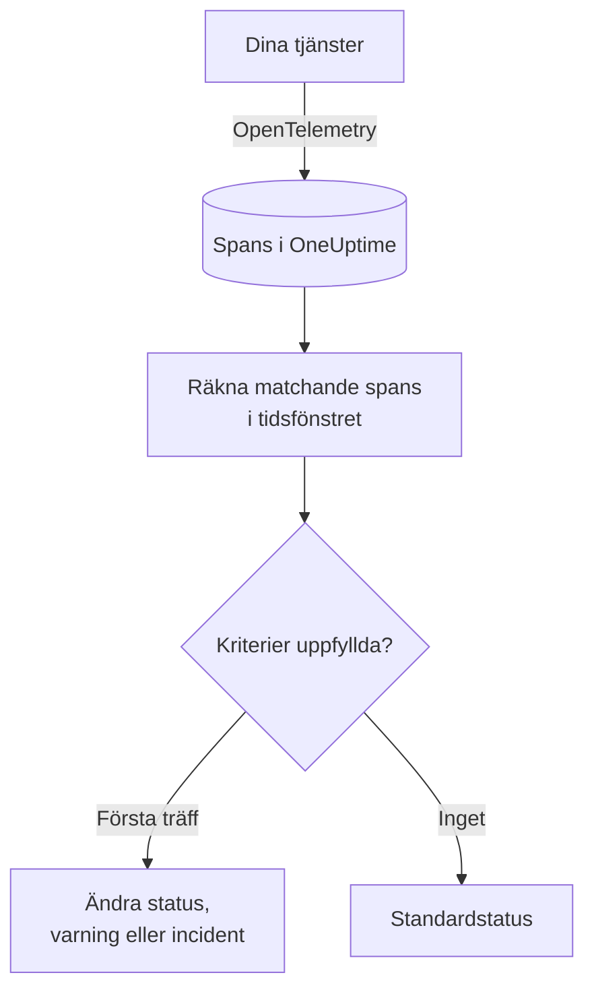

# Spårningsövervakning

En spårningsmonitor räknar inom ett tidsfönster de spans som dina tjänster skickar till OneUptime och som matchar dina filter (span-namn, status, tjänst, attribut). När antalet uppfyller dina kriterier ändrar den monitorns status, skapar en varning eller deklarerar en incident. Använd den för att varnas om misslyckade förfrågningar till en slutpunkt, en ökning av fel-spans eller en tjänst som har slutat skicka spårningar.

:::cards
- [Skapa monitorn](#skapa-en-spårningsmonitor): Välj vilka spans som räknas och när du ska varnas.
- [Span-statuskoder](#span-statuskoder): Vad OK, ERROR och UNSET betyder, och vad du ska filtrera på.
- [Så utvärderas den](#så-utvärderas-den): Tidsfönstret, räkningen och cykeln på en minut.
- [Kriterier](#kriterier): Tröskelvärden, avvikelsedetektering och standardvärdena.
:::

## Så fungerar det

Varje minut räknar OneUptime de spans som matchar monitorns filter och startade inom dess tidsfönster. Antalet jämförs med monitorns kriterier uppifrån och ned, och det första kriteriet som matchar avgör vad som händer. När inget matchar går monitorn tillbaka till sin standardstatus.

## Innan du börjar

- Dina tjänster skickar spårningar till OneUptime via OpenTelemetry. Se [OpenTelemetry](/docs/telemetry/open-telemetry).
- Slå upp det exakta namnet på den span som du vill övervaka i spårningsutforskaren: span-namn bestäms av din instrumentering, till exempel `POST /api/checkout` eller `GET`.

## Skapa en spårningsmonitor

:::steps
### Börja en ny monitor

Gå till **Monitorer** och klicka på **Skapa monitor**.

### Välj Traces

Under **Monitortyp** klickar du på **Fler monitortyper** och väljer **Spår** under **Telemetri**, eller skriver `traces` i sökrutan. Ange ett **Namn** och klicka sedan på **Nästa**.

### Välj vilka spans som ska räknas

I **Trace-monitorkonfiguration** anger du **Span-namn**, **Övervakningsspår för (tid)** och **Filtrera efter spannstatus**. Ett filter som du lämnar tomt matchar alla spans. **Förhandsvisning av spans** under filtren visar de spans som de matchar just nu.

### Begränsa dem (valfritt)

Öppna **Fler fält** för att filtrera efter telemetritjänst, infrastrukturentitet eller attribut.

### Ange kriterierna

Kortet **Monitorkriterier** börjar med två kriterier: offline, med en incident, när inga spans matchar; online när minst en gör det. Ändra dem till det du vill varnas om (se [Kriterier](#kriterier)).

### Skapa monitorn

Klicka på **Skapa monitor**. Monitorn öppnas på sin sida **Översikt**, och dess första utvärdering körs inom en minut.
:::

> [!TIP]
> För att få veta när en AI-funktion svarar dåligt (misslyckade, nekade, avbrutna, tomma, flaggade eller långsamma svar) väljer du i stället **AI / LLM** under **Telemetri**. Den monitorn läser AI-anropen i dina spårningar åt dig, utan span-filter att skriva. Se [AI- / LLM-observerbarhet](/docs/telemetry/ai-llm-observability#få-veta-när-ain-svarar-dåligt).

## Vad den frågar efter

| Fält | Vad det matchar | Standard |
| --- | --- | --- |
| **Span-namn** | Spans vars namn innehåller denna text, utan skillnad på versaler och gemener. | Tomt: alla spans |
| **Övervakningsspår för (tid)** | Spans som startade de senaste 5 sekunderna upp till de senaste 24 timmarna. | **Senaste 1 minuten** |
| **Filtrera efter spannstatus** | Spans med någon av de valda statusarna: **Ej angiven**, **Ok** eller **Fel**. | Tomt: alla statusar |
| **Filtrera efter telemetritjänst** (under **Fler fält**) | Spans från någon av de valda tjänsterna. | Tomt: alla tjänster |
| **Filter by Infrastructure Entity** (under **Fler fält**) | Spans från någon av de valda värdarna, poddarna, containrarna och andra entiteterna. | Tomt: alla entiteter |
| **Filtrera efter attribut** (under **Fler fält**) | Spans vars attribut uppfyller alla villkor. Varje villkor har en egen operator, som "är lika med" eller "innehåller". | Tomt: inga villkor |

Alla filter som du anger måste matcha för att en span ska räknas.

### Span-statuskoder

- **OK** – Operationen markerades uttryckligen som lyckad av applikationskod eller en spårningspipeline
- **ERROR** – Operationen stötte på ett fel
- **UNSET** – Ingen felstatus angavs. Detta är OpenTelemetrys standardstatus

UNSET betyder inte att data saknas. OpenTelemetry-instrumentering sätter ERROR när en operation misslyckas och lämnar lyckade spans som UNSET, så hos en frisk tjänst är de flesta spans UNSET. OneUptime visar dem i grönt som "Unset (no error)". Att registrera ett undantag ändrar inte en spans status, så en UNSET-span kan ändå ha undantag; de listas tillsammans med spanen. Filtrera på ERROR för att varna om fel. Välj både OK och UNSET för att räkna alla spans som inte misslyckades.

Om du vill att lyckade förfrågningar ska visas som OK, lägger du till en spårningspipeline under **Spår > Inställningar > Pipelines** med filtervillkoret **Status = Ej angiven** och en **Status-ommappare** som mappar `http.response.status_code`-värden, till exempel `200`, till Ok.

## Så utvärderas den

- **Varje minut.** En spårningsmonitor kontrolleras inte av sonder, så den har inget intervall att ange och ingen sida **Sonder och intervall**.
- **Ett tal per utvärdering.** Monitorn räknar de spans som matchar alla filter och startade inom **Övervakningsspår för (tid)** före utvärderingen. Med **Senaste 5 minuterna** ser varje utvärdering fem minuter bakåt, så fönstren för utvärderingar i följd överlappar.
- **Inga spans är ett antal på 0.** En tjänst som slutar skicka spårningar ger 0, och det är vad standardkriteriet för offline letar efter.
- **OneUptimes eget avbrott är inte tystnad.** Så länge tidsfönstret innehåller tid då OneUptime självt inte tog emot data (det startade om, uppgraderades eller arbetade ikapp en eftersläpning) väntar kontrollen: statusen ändras inte, och ingen incident eller varning öppnas eller löses. Se [När OneUptime inte tar emot data](/docs/monitor/when-oneuptime-is-not-receiving).
- **Kriterier uppifrån och ned.** Det första kriteriet som matchar avgör, så lägg det allvarligaste överst.

Varje statusändring registreras med sin orsak på monitorns **Statustidslinje**.

## Kriterier

En spårningsmonitors kriterier har en enda **Filtertyp**: **Span Count**, antalet spans som matchade i fönstret. Välj ett **Filtervillkor** och, för ett tröskelvillkor, ett **Värde**.

| Filtervillkor | Matchar när antalet spans är… |
| --- | --- |
| **Greater Than** | över värdet |
| **Greater Than Or Equal To** | lika med värdet eller högre |
| **Less Than** | under värdet |
| **Less Than Or Equal To** | lika med värdet eller lägre |
| **Equal To** | exakt värdet |
| **Anomalously High** | över det förväntade intervallet för den här timmen i veckan |
| **Anomalously Low** | under det intervallet |
| **Anomalous** | utanför det intervallet, åt vilket håll som helst |

Avvikelsevillkoren har inget **Värde**. Välj en **Känslighet** (Low, Medium, som är standard, eller High) och ett **Baslinjefönster** på 14 (standard), 28, 60 eller 90 dagar. OneUptime gör om antalet till en takt per minut och jämför den med samma timme i veckan över det fönstret. Baslinjen omfattar bara monitorns tjänster och spannstatusar: dess filter på span-namn och attribut ingår inte. Tills den timmen i veckan har tillräcklig historik lär sig kriteriet fortfarande och utlöses inte.

En ny spårningsmonitor börjar med dessa kriterier:

| Kriterium | Filter | Effekt |
| --- | --- | --- |
| Check if … is offline | **Span Count** **Equal To** `0` | Markerar monitorn som offline och deklarerar en incident, som löses automatiskt |
| Check if … is online | **Span Count** **Greater Than** `0` | Markerar monitorn som online |

## Genomgånget exempel: misslyckade checkout-förfrågningar

På fem minuter registrerar checkout-tjänsten 1 200 spans med namnet `POST /api/checkout`: 1 150 UNSET, 20 OK och 30 ERROR. Samma monitor räknar mycket olika tal beroende på **Filtrera efter spannstatus**:

| Filtrera efter spannstatus | Span Count | Vad det mäter |
| --- | --- | --- |
| **Fel** | 30 | Förfrågningar som misslyckades |
| **Ok** | 20 | Bara de förfrågningar som din kod markerade som lyckade |
| **Ej angiven** och **Ok** | 1 170 | Alla förfrågningar som inte misslyckades |
| Tomt | 1 200 | Alla förfrågningar |

För att bli larmad när fler än 10 checkout-förfrågningar misslyckas på fem minuter:

- **Span-namn**: `POST /api/checkout`
- **Övervakningsspår för (tid)**: **Senaste 5 minuterna**
- **Filtrera efter spannstatus**: **Fel**
- Kriterium 1: **Span Count** **Greater Than** `10`: markera monitorn som offline och deklarera en incident
- Kriterium 2: **Span Count** **Less Than Or Equal To** `10`: markera monitorn som online

Med 30 misslyckade förfrågningar matchar kriterium 1 och incidenten deklareras. När fem minuter har gått med 10 eller färre fel matchar kriterium 2, monitorn är online igen och incidenten löser sig själv.

## Felsökning

:::details Monitorn räknar inga spans för min slutpunkt
**Span-namn** jämförs med spanens namn, och instrumentering namnger ofta server-spans efter routen (`POST /api/checkout`) eller bara efter metoden (`GET`). Leta upp det exakta namnet i spårningsutforskaren. Öppna sedan monitorns sida **Kriterier** (under **Konfiguration**) och klicka på **Edit Monitoring Criteria**: **Förhandsvisning av spans** visar vad filtren matchar just nu.
:::

:::details Lyckade förfrågningar räknas inte när jag filtrerar på Ok
De flesta instrumenteringar lämnar lyckade spans som UNSET, inte OK (se [Span-statuskoder](#span-statuskoder)). Välj både **Ej angiven** och **Ok**, eller lägg till spårningspipelinen som beskrivs där.
:::

:::details En span har ett undantag men räknas inte som fel
Att registrera ett undantag ändrar inte en spans status. Filtrera på **Fel**, eller använd en [undantagsmonitor](/docs/monitor/exceptions-monitor) för att varnas om själva undantagen.
:::

:::details Ett avvikelsekriterium utlöses aldrig
Det lär sig fortfarande: timmen i veckan som det jämför med har ännu inte tillräcklig historik inom **Baslinjefönster**.
:::

## Nästa steg

:::cards
- [Undantagsövervakning](/docs/monitor/exceptions-monitor): Varnas om de undantag som dina tjänster registrerar.
- [Loggövervakning](/docs/monitor/logs-monitor): Varnas om loggvolym och logginnehåll.
- [Söksyntax](/docs/telemetry/search-syntax): Hitta span-namn och spannstatusar i spårningsutforskaren.
- [Incident- och varningsmallar](/docs/monitor/incident-alert-templating): Skriv användbara titlar och beskrivningar för varningar.
:::
